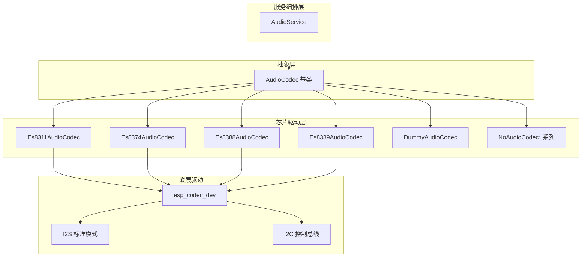
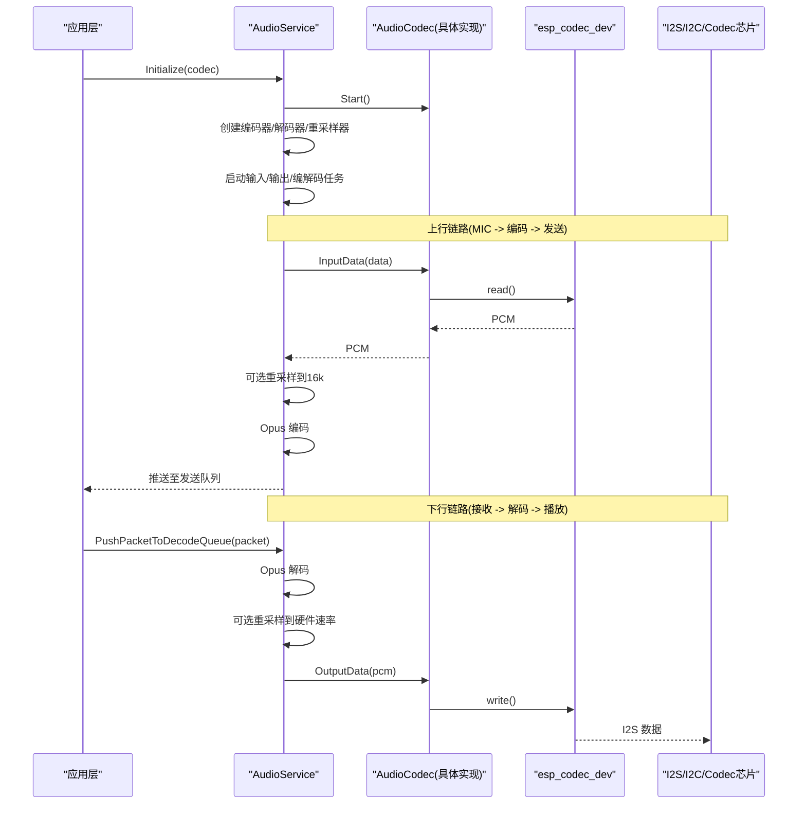
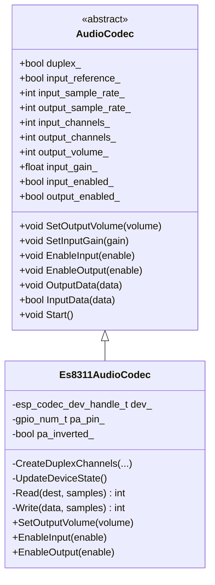
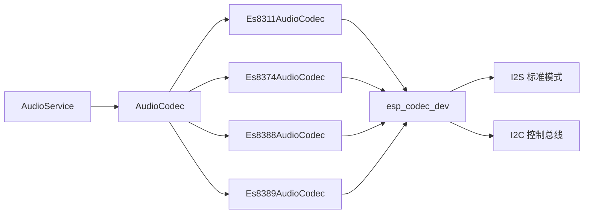

# 音频编解码器

<cite>
**本文引用的文件**   
- [audio_codec.h](file://main\audio\audio_codec.h)
- [audio_codec.cc](file://main\audio\audio_codec.cc)
- [es8311_audio_codec.h](file://main\audio\codecs\es8311_audio_codec.h)
- [es8311_audio_codec.cc](file://main\audio\codecs\es8311_audio_codec.cc)
- [es8374_audio_codec.h](file://main\audio\codecs\es8374_audio_codec.h)
- [es8374_audio_codec.cc](file://main\audio\codecs\es8374_audio_codec.cc)
- [es8388_audio_codec.h](file://main\audio\codecs\es8388_audio_codec.h)
- [es8388_audio_codec.cc](file://main\audio\codecs\es8388_audio_codec.cc)
- [es8389_audio_codec.h](file://main\audio\codecs\es8389_audio_codec.h)
- [es8389_audio_codec.cc](file://main\audio\codecs\es8389_audio_codec.cc)
- [dummy_audio_codec.h](file://main\audio\codecs\dummy_audio_codec.h)
- [dummy_audio_codec.cc](file://main\audio\codecs\dummy_audio_codec.cc)
- [no_audio_codec.h](file://main\audio\codecs\no_audio_codec.h)
- [audio_service.h](file://main\audio\audio_service.h)
- [audio_service.cc](file://main\audio\audio_service.cc)
</cite>

## 目录
1. [简介](#简介)
2. [项目结构](#项目结构)
3. [核心组件](#核心组件)
4. [架构总览](#架构总览)
5. [详细组件分析](#详细组件分析)
6. [依赖关系分析](#依赖关系分析)
7. [性能与质量优化](#性能与质量优化)
8. [故障排查指南](#故障排查指南)
9. [结论](#结论)
10. [附录：新编解码器适配与测试](#附录：新编解码器适配与测试)

## 简介
本技术文档围绕音频编解码器适配层展开，系统性阐述 AudioCodec 抽象接口的设计理念与扩展机制，深入解析 ES8311、ES8374、ES8388、ES8389 等芯片的驱动实现差异，覆盖 I2S 初始化、采样率配置、音量控制、通道映射与数据流处理。同时提供新编解码器的适配开发指南、测试方法、音频质量评估与性能优化技巧，并给出中断与时钟同步等底层问题的排障建议。

## 项目结构
本项目将音频子系统划分为三层：
- 抽象适配层：AudioCodec 基类定义统一接口，屏蔽具体硬件差异。
- 芯片驱动层：各具体编解码器实现（如 Es8311AudioCodec、Es8374AudioCodec、Es8388AudioCodec、Es8389AudioCodec），封装 esp_codec_dev 与 I2C/I2S 配置。
- 服务编排层：AudioService 负责任务调度、Opus 编解码、重采样、唤醒词与语音处理管线集成。

图表来源
- [audio_codec.h:17-59](file://main\audio\audio_codec.h#L17-L59)
- [es8311_audio_codec.h:13-40](file://main\audio\codecs\es8311_audio_codec.h#L13-L40)
- [es8374_audio_codec.h:13-39](file://main\audio\codecs\es8374_audio_codec.h#L13-L39)
- [es8388_audio_codec.h:12-38](file://main\audio\codecs\es8388_audio_codec.h#L12-L38)
- [es8389_audio_codec.h:12-38](file://main\audio\codecs\es8389_audio_codec.h#L12-L38)
- [audio_service.h:105-195](file://main\audio\audio_service.h#L105-L195)

章节来源
- [audio_codec.h:17-59](file://main\audio\audio_codec.h#L17-L59)
- [audio_service.h:105-195](file://main\audio\audio_service.h#L105-L195)

## 核心组件
- AudioCodec 抽象接口
  - 职责：定义统一的输入/输出、音量/增益、双工能力、采样率与通道数查询等接口；提供 OutputData/InputData 便捷方法；Start 加载持久化音量设置。
  - 关键属性：duplex、input_reference、input/output_sample_rate、input/output_channels、output_volume、input_gain、input_enabled/output_enabled。
  - 关键方法：SetOutputVolume、SetInputGain、EnableInput、EnableOutput、OutputData、InputData、Start。
- 具体编解码器实现
  - 通过继承 AudioCodec，实现 Read/Write 虚函数，内部调用 esp_codec_dev_read/write 完成数据通路；在 EnableInput/EnableOutput 中打开/关闭设备句柄并控制 PA 引脚。
  - 不同芯片的差异体现在：是否使用单设备句柄还是分离的 input/output 句柄、参考输入通道支持、PA 反相控制、模拟输出寄存器默认值等。
- AudioService 服务编排
  - 管理输入/输出/编解码三个任务，维护队列与条件变量，实现 Opus 编解码、动态重采样、唤醒词与语音处理管线集成、电源状态管理与回调通知。

章节来源
- [audio_codec.h:17-59](file://main\audio\audio_codec.h#L17-L59)
- [audio_codec.cc:17-68](file://main\audio\audio_codec.cc#L17-L68)
- [audio_service.h:105-195](file://main\audio\audio_service.h#L105-L195)
- [audio_service.cc:62-123](file://main\audio\audio_service.cc#L62-L123)

## 架构总览
下图展示从上层服务到底层驱动的完整数据流与控制流。

图表来源
- [audio_service.cc:62-123](file://main\audio\audio_service.cc#L62-L123)
- [audio_service.cc:184-228](file://main\audio\audio_service.cc#L184-L228)
- [audio_service.cc:327-446](file://main\audio\audio_service.cc#L327-L446)
- [audio_service.cc:448-482](file://main\audio\audio_service.cc#L448-L482)
- [audio_codec.cc:17-27](file://main\audio\audio_codec.cc#L17-L27)

## 详细组件分析

### AudioCodec 抽象接口设计
- 设计理念
  - 以纯虚函数 Read/Write 暴露最小数据通路，上层无需关心具体硬件。
  - 通过 duplex/input_reference 等标志位描述硬件能力，便于上层做通道选择与 AEC 策略。
  - 统一音量/增益接口，结合 Settings 持久化用户偏好。
- 扩展机制
  - 新增芯片只需继承 AudioCodec，实现 Read/Write，并在构造中完成 I2S 与 codec_if 初始化。
  - 若需独立控制输入/输出路径，可分别维护 input_dev_ 与 output_dev_ 句柄。
- 复杂度与性能
  - 数据通路为阻塞式读写，配合 DMA 与队列缓冲，避免频繁上下文切换。
  - 重采样在需要时按需创建与重置，减少资源占用。

章节来源
- [audio_codec.h:17-59](file://main\audio\audio_codec.h#L17-L59)
- [audio_codec.cc:29-46](file://main\audio\audio_codec.cc#L29-L46)

### ES8311 驱动实现
- 特点
  - 使用单一 esp_codec_dev 句柄同时承载输入/输出，通过 UpdateDeviceState 在启用任一方向时打开设备，禁用两者时关闭。
  - 支持 PA 反相控制 pa_inverted_，用于匹配不同功放极性。
  - 使用 audio_codec_new_i2s_data 绑定 I2S 数据接口，audio_codec_new_i2c_ctrl 建立 I2C 控制总线。
- I2S 配置要点
  - 主模式、16bit、立体声槽掩码、MCLK 倍频 256，左右对齐与大小端按平台宏控制。
- 音量与增益
  - SetOutputVolume 直接调用 esp_codec_dev_set_out_vol；输入增益在打开设备后设置。
- 时序与状态
  - EnableInput/EnableOutput 会更新内部状态并触发 UpdateDeviceState，确保 PA 电平与设备生命周期一致。

图表来源
- [audio_codec.h:17-59](file://main\audio\audio_codec.h#L17-L59)
- [es8311_audio_codec.h:13-40](file://main\audio\codecs\es8311_audio_codec.h#L13-L40)
- [es8311_audio_codec.cc:70-98](file://main\audio\codecs\es8311_audio_codec.cc#L70-L98)

章节来源
- [es8311_audio_codec.h:13-40](file://main\audio\codecs\es8311_audio_codec.h#L13-L40)
- [es8311_audio_codec.cc:7-59](file://main\audio\codecs\es8311_audio_codec.cc#L7-L59)
- [es8311_audio_codec.cc:100-156](file://main\audio\codecs\es8311_audio_codec.cc#L100-L156)
- [es8311_audio_codec.cc:158-202](file://main\audio\codecs\es8311_audio_codec.cc#L158-L202)

### ES8374 驱动实现
- 特点
  - 分离 input_dev_ 与 output_dev_ 两个设备句柄，分别打开/关闭，灵活控制功耗。
  - 未显式提供 PA 反相参数，PA 电平在 EnableOutput 中置高/低。
- I2S 配置要点
  - 与 ES8311 类似，主模式、16bit、立体声槽掩码、MCLK 倍频 256。
- 音量与增益
  - SetOutputVolume 作用于 output_dev_；输入增益在打开输入设备后设置。

章节来源
- [es8374_audio_codec.h:13-39](file://main\audio\codecs\es8374_audio_codec.h#L13-L39)
- [es8374_audio_codec.cc:7-62](file://main\audio\codecs\es8374_audio_codec.cc#L7-L62)
- [es8374_audio_codec.cc:76-132](file://main\audio\codecs\es8374_audio_codec.cc#L76-L132)
- [es8374_audio_codec.cc:134-200](file://main\audio\codecs\es8374_audio_codec.cc#L134-L200)

### ES8388 驱动实现
- 特点
  - 支持参考输入 input_reference，当开启时 input_channels_ 设为 2，用于设备侧 AEC。
  - 输出路径对模拟输出寄存器进行默认值修正（HP_LVOL/HP_RVOL/SPK_LVOL/SPK_RVOL）以确保 0dB 基准。
  - master_mode=true，明确作为 I2S 主时钟源。
- I2S 配置要点
  - 强制 left_align=true，big_endian=false，bit_order_lsb=false，保证与硬件布局一致。
- 音量与增益
  - SetOutputVolume 作用于 output_dev_；参考输入模式下通过 ctrl_if 直接写寄存器配置增益。

章节来源
- [es8388_audio_codec.h:12-38](file://main\audio\codecs\es8388_audio_codec.h#L12-L38)
- [es8388_audio_codec.cc:7-71](file://main\audio\codecs\es8388_audio_codec.cc#L7-L71)
- [es8388_audio_codec.cc:85-137](file://main\audio\codecs\es8388_audio_codec.cc#L85-L137)
- [es8388_audio_codec.cc:139-221](file://main\audio\codecs\es8388_audio_codec.cc#L139-L221)

### ES8389 驱动实现
- 特点
  - 与 ES8374 类似，采用分离的 input/output 设备句柄，支持 use_mclk 参数。
  - 输入增益在打开输入设备后设置，输出增益在打开输出设备后设置。
- I2S 配置要点
  - 与 ES8388 一致的左对齐与大端/位序配置。

章节来源
- [es8389_audio_codec.h:12-38](file://main\audio\codecs\es8389_audio_codec.h#L12-L38)
- [es8389_audio_codec.cc:7-70](file://main\audio\codecs\es8389_audio_codec.cc#L7-L70)
- [es8389_audio_codec.cc:84-138](file://main\audio\codecs\es8389_audio_codec.cc#L84-L138)
- [es8389_audio_codec.cc:140-206](file://main\audio\codecs\es8389_audio_codec.cc#L140-L206)

### Dummy/NoAudioCodec 辅助实现
- DummyAudioCodec：空实现，返回 0，用于无硬件环境下的流程验证。
- NoAudioCodec 系列：面向 PDM 麦克风或简单 I2S 场景的轻量实现，提供全双工/半双工变体。

章节来源
- [dummy_audio_codec.h:6-14](file://main\audio\codecs\dummy_audio_codec.h#L6-L14)
- [dummy_audio_codec.cc:1-21](file://main\audio\codecs\dummy_audio_codec.cc#L1-L21)
- [no_audio_codec.h:10-41](file://main\audio\codecs\no_audio_codec.h#L10-L41)

## 依赖关系分析
- 组件耦合
  - AudioService 强依赖 AudioCodec 抽象，不感知具体芯片细节。
  - 各芯片驱动依赖 esp_codec_dev 与 I2C/I2S 驱动，遵循统一的 data_if/ctrl_if/gpio_if 接口。
- 外部依赖
  - esp_opus_enc/dec 用于编解码；esp_ae_rate_cvt 用于重采样；FreeRTOS 事件组与队列用于任务间同步。
- 潜在循环依赖
  - 当前分层清晰，未见循环依赖。

图表来源
- [audio_service.h:105-195](file://main\audio\audio_service.h#L105-L195)
- [audio_codec.h:17-59](file://main\audio\audio_codec.h#L17-L59)
- [es8311_audio_codec.h:13-40](file://main\audio\codecs\es8311_audio_codec.h#L13-L40)
- [es8374_audio_codec.h:13-39](file://main\audio\codecs\es8374_audio_codec.h#L13-L39)
- [es8388_audio_codec.h:12-38](file://main\audio\codecs\es8388_audio_codec.h#L12-L38)
- [es8389_audio_codec.h:12-38](file://main\audio\codecs\es8389_audio_codec.h#L12-L38)

章节来源
- [audio_service.h:105-195](file://main\audio\audio_service.h#L105-L195)
- [audio_codec.h:17-59](file://main\audio\audio_codec.h#L17-L59)

## 性能与质量优化
- 任务与队列
  - 输入/输出/编解码分任务运行，使用条件变量与最大队列长度限制，避免内存抖动与拥塞。
- 重采样策略
  - 仅在输入/输出采样率与目标不一致时创建重采样器；切换模式前重置重采样器，防止缓存污染。
- 功耗管理
  - 空闲超时自动关闭输入/输出，保持双工 RX 活跃时保留 TX 时钟，避免部分板卡 RX 停滞。
- 音量与增益
  - 输出音量持久化保存；参考输入模式下通过寄存器直写提升信噪比。
- 时钟与相位
  - MCLK 倍频 256，slot 模式与对齐方式严格匹配硬件，降低时钟漂移与相位误差。

章节来源
- [audio_service.cc:125-167](file://main\audio\audio_service.cc#L125-L167)
- [audio_service.cc:184-228](file://main\audio\audio_service.cc#L184-L228)
- [audio_service.cc:448-482](file://main\audio\audio_service.cc#L448-L482)
- [audio_service.cc:682-698](file://main\audio\audio_service.cc#L682-L698)
- [es8388_audio_codec.cc:139-206](file://main\audio\codecs\es8388_audio_codec.cc#L139-L206)

## 故障排查指南
- 常见问题定位
  - 无声/爆音：检查 I2S 配置（位宽、槽掩码、对齐）、MCLK 倍频、PA 电平与反相逻辑。
  - 回声/啸叫：确认是否启用参考输入通道，核对输入通道数与 AEC 模式。
  - 卡顿/断流：观察队列是否溢出，调整 MAX_* 常量或增加任务栈空间。
  - 时钟不同步：核对输入/输出采样率一致性，必要时启用重采样。
- 调试手段
  - 使用内置调试开关导出原始 PCM 数据进行分析。
  - 打印日志 TAG 与错误码，定位 esp_codec_dev 与 I2C 访问失败点。
- 典型恢复步骤
  - 重置解码器与队列，清空时间戳队列，重新打开编解码器。
  - 切换模式前重置重采样器，避免缓存污染导致溢出。

章节来源
- [audio_service.cc:668-680](file://main\audio\audio_service.cc#L668-L680)
- [audio_service.cc:579-604](file://main\audio\audio_service.cc#L579-L604)
- [audio_service.cc:549-577](file://main\audio\audio_service.cc#L549-L577)
- [es8311_audio_codec.cc:158-188](file://main\audio\codecs\es8311_audio_codec.cc#L158-L188)
- [es8388_audio_codec.cc:144-171](file://main\audio\codecs\es8388_audio_codec.cc#L144-L171)

## 结论
本适配层通过清晰的抽象与模块化设计，实现了多芯片的统一接入与灵活扩展。AudioService 的任务化编排与重采样机制保障了端到端的稳定与低延迟。针对具体芯片的差异，驱动层提供了细粒度的控制能力，满足高质量语音交互的需求。

## 附录：新编解码器适配与测试
- 适配步骤
  - 新建类继承 AudioCodec，声明私有成员：data_if_/ctrl_if_/codec_if_/gpio_if_ 与 esp_codec_dev 句柄（单或双）。
  - 构造函数中：
    - 设置 duplex_/input_reference_/channels/sample_rates/gains。
    - 调用 CreateDuplexChannels 初始化 I2S 主模式与 GPIO。
    - 创建 data_if/ctrl_if/gpio_if，并实例化对应 codec_if（如 es83xx_codec_new）。
  - 实现 Read/Write：根据 input_enabled_/output_enabled_ 调用 esp_codec_dev_read/write。
  - 实现 EnableInput/EnableOutput：打开/关闭设备句柄，设置增益/音量，控制 PA 电平。
  - 实现 SetOutputVolume：调用 esp_codec_dev_set_out_vol 并更新基类状态。
- 关键配置清单
  - I2S：sample_rate_hz、mclk_multiple=256、data_bit_width=16、slot_mode=STEREO、slot_mask=BOTH、ws_width=16、对齐与大小端按芯片手册。
  - 控制总线：i2c_port、addr、bus_handle。
  - 设备模式：ESP_CODEC_DEV_WORK_MODE_BOTH；是否需要 master_mode。
  - 参考输入：如需 AEC，设置 input_reference_=true 并将 input_channels_=2。
- 测试方法
  - 单元测试：构造后调用 Start，EnableInput/EnableOutput 切换，验证 Read/Write 返回值与日志。
  - 环路测试：启用录音与播放，采集 PCM 并回放，检测噪声与失真。
  - 压力测试：长时间运行，监控队列长度与 CPU 占用，调整 DMA 描述符与帧数。
  - 功能验证：调节音量/增益，验证持久化与实时生效；切换采样率，验证重采样正确性。
- 质量评估
  - 主观听感：清晰度、底噪、削波与瞬态响应。
  - 客观指标：SNR、THD、频率响应平坦度、延迟与抖动。
  - 稳定性：丢包/卡顿统计、异常恢复成功率。

章节来源
- [audio_codec.h:17-59](file://main\audio\audio_codec.h#L17-L59)
- [es8311_audio_codec.cc:100-156](file://main\audio\codecs\es8311_audio_codec.cc#L100-L156)
- [es8374_audio_codec.cc:76-132](file://main\audio\codecs\es8374_audio_codec.cc#L76-L132)
- [es8388_audio_codec.cc:85-137](file://main\audio\codecs\es8388_audio_codec.cc#L85-L137)
- [es8389_audio_codec.cc:84-138](file://main\audio\codecs\es8389_audio_codec.cc#L84-L138)