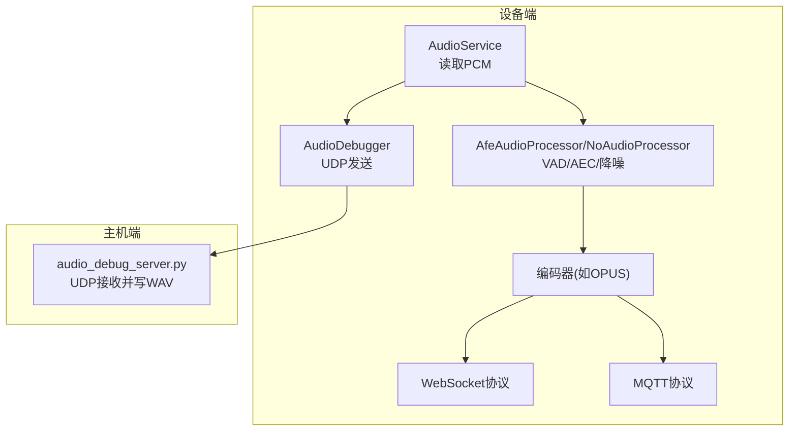
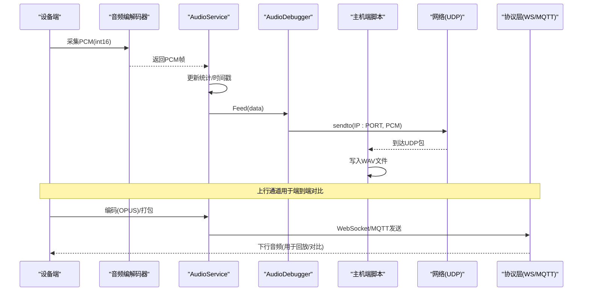
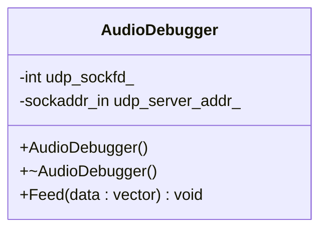
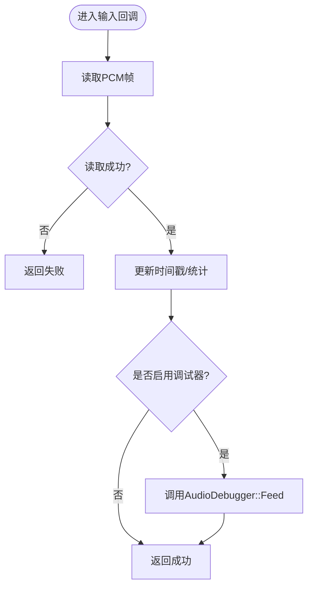
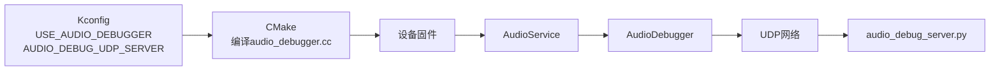

# 音频调试工具

<cite>
**本文引用的文件**   
- [audio_debugger.h](file://main/audio/processors/audio_debugger.h)
- [audio_debugger.cc](file://main/audio/processors/audio_debugger.cc)
- [Kconfig.projbuild](file://main/Kconfig.projbuild)
- [CMakeLists.txt](file://main/CMakeLists.txt)
- [audio_service.cc](file://main/audio/audio_service.cc)
- [audio_service.h](file://main/audio/audio_service.h)
- [afe_audio_processor.h](file://main/audio/processors/afe_audio_processor.h)
- [afe_audio_processor.cc](file://main/audio/processors/afe_audio_processor.cc)
- [no_audio_processor.h](file://main/audio/processors/no_audio_processor.h)
- [websocket_protocol.cc](file://main/protocols/websocket_protocol.cc)
- [mqtt_protocol.cc](file://main/protocols/mqtt_protocol.cc)
- [application.cc](file://main/application.cc)
- [audio_debug_server.py](file://scripts/audio_debug_server.py)
</cite>

## 目录
1. [简介](#简介)
2. [项目结构](#项目结构)
3. [核心组件](#核心组件)
4. [架构总览](#架构总览)
5. [详细组件分析](#详细组件分析)
6. [依赖关系分析](#依赖关系分析)
7. [性能考量](#性能考量)
8. [故障排除指南](#故障排除指南)
9. [结论](#结论)
10. [附录](#附录)

## 简介
本文件面向需要在嵌入式设备上采集、分析与定位音频问题的工程师，提供基于仓库内“音频调试器”的完整使用文档。内容涵盖：
- AudioDebugger 类的功能与使用方法（UDP 发送 PCM）
- 音频数据捕获路径与触发方式
- 波形分析与频谱显示（配合主机端脚本与第三方工具）
- 音频质量指标分析方法（信噪比、失真度、延迟测量）
- 音频问题定位方法与故障排除流程
- 音频性能监控与瓶颈分析技巧
- 常见音频问题的诊断案例与解决方案
- 使用调试工具进行音频链路验证与测试

## 项目结构
与音频调试相关的关键位置如下：
- 设备侧 UDP 客户端实现：AudioDebugger（头文件与源文件）
- 配置项：是否启用音频调试、UDP 服务器地址
- 集成点：在音频输入路径中调用 Feed 将原始 PCM 通过 UDP 发送
- 主机端接收脚本：Python UDP 接收并保存为 WAV
- 音频处理链：AfeAudioProcessor / NoAudioProcessor 等处理器
- 协议层：WebSocket/MQTT 下行音频解码与播放路径（用于端到端对比）

图表来源
- [audio_service.cc:210-228](file://main/audio/audio_service.cc#L210-L228)
- [audio_debugger.cc:16-42](file://main/audio/processors/audio_debugger.cc#L16-L42)
- [audio_debug_server.py:11-43](file://scripts/audio_debug_server.py#L11-L43)
- [websocket_protocol.cc:115-137](file://main/protocols/websocket_protocol.cc#L115-L137)
- [mqtt_protocol.cc:260-290](file://main/protocols/mqtt_protocol.cc#L260-L290)

章节来源
- [CMakeLists.txt:1-33](file://main/CMakeLists.txt#L1-L33)
- [Kconfig.projbuild:945-980](file://main/Kconfig.projbuild#L945-L980)

## 核心组件
- AudioDebugger：负责将设备端采集到的原始 PCM（int16_t）通过 UDP 发送到配置的服务器地址。构造时解析 CONFIG_AUDIO_DEBUG_UDP_SERVER，Feed 方法直接 sendto。
- 配置开关：USE_AUDIO_DEBUGGER 控制编译期是否包含该模块；AUDIO_DEBUG_UDP_SERVER 指定目标 IP:PORT。
- 集成点：AudioService 在每次成功读取到输入 PCM 后，若启用调试器则调用其 Feed 接口。
- 主机端脚本：audio_debug_server.py 监听 UDP 端口，持续写入 WAV 文件，便于后续波形/频谱分析。

章节来源
- [audio_debugger.h:10-20](file://main/audio/processors/audio_debugger.h#L10-L20)
- [audio_debugger.cc:16-42](file://main/audio/processors/audio_debugger.cc#L16-L42)
- [audio_debugger.cc:54-66](file://main/audio/processors/audio_debugger.cc#L54-L66)
- [Kconfig.projbuild:945-980](file://main/Kconfig.projbuild#L945-L980)
- [audio_service.cc:218-225](file://main/audio/audio_service.cc#L218-L225)
- [audio_debug_server.py:11-43](file://scripts/audio_debug_server.py#L11-L43)

## 架构总览
下图展示了从设备采集到主机端落盘的端到端链路，以及上行音频通道（用于对比与延迟测量）。

图表来源
- [audio_service.cc:210-228](file://main/audio/audio_service.cc#L210-L228)
- [audio_debugger.cc:54-66](file://main/audio/processors/audio_debugger.cc#L54-L66)
- [audio_debug_server.py:11-43](file://scripts/audio_debug_server.py#L11-L43)
- [websocket_protocol.cc:115-137](file://main/protocols/websocket_protocol.cc#L115-L137)
- [mqtt_protocol.cc:260-290](file://main/protocols/mqtt_protocol.cc#L260-L290)

## 详细组件分析

### AudioDebugger 类分析
职责
- 初始化 UDP Socket，解析配置的目标地址（IP:PORT）
- 提供 Feed 接口，将 int16 PCM 帧以 UDP 数据包形式发送
- 析构时关闭 Socket

关键行为
- 构造阶段：创建 socket，解析 CONFIG_AUDIO_DEBUG_UDP_SERVER，失败或无效时记录警告并关闭 socket
- Feed 阶段：若 socket 有效则 sendto，失败记录警告，成功记录调试日志
- 析构阶段：关闭 socket

图表来源
- [audio_debugger.h:10-20](file://main/audio/processors/audio_debugger.h#L10-L20)
- [audio_debugger.cc:16-42](file://main/audio/processors/audio_debugger.cc#L16-L42)
- [audio_debugger.cc:54-66](file://main/audio/processors/audio_debugger.cc#L54-L66)

章节来源
- [audio_debugger.h:10-20](file://main/audio/processors/audio_debugger.h#L10-L20)
- [audio_debugger.cc:16-42](file://main/audio/processors/audio_debugger.cc#L16-L42)
- [audio_debugger.cc:54-66](file://main/audio/processors/audio_debugger.cc#L54-L66)

### 配置与构建集成
- Kconfig 选项
  - USE_AUDIO_DEBUGGER：布尔开关，默认关闭
  - AUDIO_DEBUG_UDP_SERVER：字符串，格式为 IP:PORT，默认示例地址
- CMake 列表
  - audio_debugger.cc 被纳入主工程编译

章节来源
- [Kconfig.projbuild:945-980](file://main/Kconfig.projbuild#L945-L980)
- [CMakeLists.txt:1-33](file://main/CMakeLists.txt#L1-L33)

### 音频服务集成点
- 在 AudioService 的输入路径中，成功读取 PCM 后，若启用调试器则调用 Feed 发送
- 同时维护输入计数与时间戳，便于后续统计与延迟计算

图表来源
- [audio_service.cc:210-228](file://main/audio/audio_service.cc#L210-L228)

章节来源
- [audio_service.cc:210-228](file://main/audio/audio_service.cc#L210-L228)

### 音频处理器与 VAD/AEC
- AfeAudioProcessor：基于 ESP-AFE 的语音前端，支持降噪、VAD、可选设备端 AEC
- NoAudioProcessor：直通处理器，不做信号处理
- 这些处理器位于采集与编码之间，影响最终上行音频质量与延迟

章节来源
- [afe_audio_processor.h:17-46](file://main/audio/processors/afe_audio_processor.h#L17-L46)
- [afe_audio_processor.cc:13-75](file://main/audio/processors/afe_audio_processor.cc#L13-L75)
- [no_audio_processor.h:11-33](file://main/audio/processors/no_audio_processor.h#L11-L33)

### 主机端音频调试服务器
- 功能：监听 UDP 8000 端口，持续接收 PCM 并写入 WAV 文件
- 参数：采样率、声道数可通过命令行传入
- 输出：按采样率和声道数命名的 WAV 文件，可用任意播放器或分析工具打开

章节来源
- [audio_debug_server.py:11-43](file://scripts/audio_debug_server.py#L11-L43)
- [audio_debug_server.py:46-55](file://scripts/audio_debug_server.py#L46-L55)

## 依赖关系分析
- 编译期依赖
  - USE_AUDIO_DEBUGGER 控制是否编译 AudioDebugger
  - AUDIO_DEBUG_UDP_SERVER 作为运行时配置
- 运行期依赖
  - AudioService 在输入路径中调用 AudioDebugger
  - 主机端脚本需与设备端配置一致（端口、采样率、声道）
- 协议层对比
  - WebSocket/MQTT 下行音频可用于端到端对比与延迟测量

图表来源
- [Kconfig.projbuild:945-980](file://main/Kconfig.projbuild#L945-L980)
- [CMakeLists.txt:1-33](file://main/CMakeLists.txt#L1-L33)
- [audio_service.cc:218-225](file://main/audio/audio_service.cc#L218-L225)
- [audio_debug_server.py:11-43](file://scripts/audio_debug_server.py#L11-L43)

章节来源
- [Kconfig.projbuild:945-980](file://main/Kconfig.projbuild#L945-L980)
- [CMakeLists.txt:1-33](file://main/CMakeLists.txt#L1-L33)
- [audio_service.cc:218-225](file://main/audio/audio_service.cc#L218-L225)

## 性能考量
- 网络开销
  - 每帧 PCM 大小 = 采样率 × 帧时长 × 声道 × 2 字节
  - 建议合理设置帧时长（例如 10ms），避免过大导致丢包或抖动
- CPU 占用
  - 设备端仅做简单 sendto，CPU 开销较低
  - 主机端写入磁盘可能成为瓶颈，建议使用 SSD 或降低写入频率（合并帧）
- 内存与队列
  - 确保设备端队列长度足够，避免阻塞采集任务
- 时钟同步
  - 如需精确延迟测量，建议在应用层增加时间戳标记（当前上行协议已携带时间戳字段，可用于对比）

[本节为通用指导，不直接分析具体文件]

## 故障排除指南
常见问题与排查步骤
- 无法收到数据
  - 检查设备端配置是否正确（USE_AUDIO_DEBUGGER 开启、AUDIO_DEBUG_UDP_SERVER 地址与端口）
  - 确认主机端脚本已启动且绑定 0.0.0.0:8000
  - 检查防火墙/路由策略是否允许 UDP 通信
- 收到的 WAV 无声或异常
  - 核对主机端脚本的采样率与声道数是否与设备端一致
  - 使用播放器或频谱工具检查是否有数据
- 延迟偏高
  - 观察设备端输入/输出时间戳与协议层时间戳差异
  - 检查网络拥塞与主机端磁盘写入速度
- 设备端日志告警
  - 关注 AudioDebugger 的警告日志（无效地址、sendto 失败等）

章节来源
- [audio_debugger.cc:34-41](file://main/audio/processors/audio_debugger.cc#L34-L41)
- [audio_debugger.cc:59-63](file://main/audio/processors/audio_debugger.cc#L59-L63)
- [audio_service.cc:210-228](file://main/audio/audio_service.cc#L210-L228)

## 结论
通过启用 AudioDebugger 并在主机端运行 UDP 接收脚本，可以快速获取设备端原始 PCM 数据，结合波形与频谱分析工具完成音频链路验证与问题定位。配合协议层的时间戳与播放路径，可进一步评估端到端延迟与音质表现。

[本节为总结性内容，不直接分析具体文件]

## 附录

### 部署与连接步骤
- 设备端
  - 在配置中启用 USE_AUDIO_DEBUGGER
  - 设置 AUDIO_DEBUG_UDP_SERVER 为目标主机 IP:端口
  - 编译并烧录固件
- 主机端
  - 运行脚本：python scripts/audio_debug_server.py --samplerate 16000 --channels 2
  - 等待设备端开始采集，脚本将生成 WAV 文件
- 验证
  - 使用播放器或频谱工具打开生成的 WAV 文件，确认有声音与正常频谱

章节来源
- [Kconfig.projbuild:945-980](file://main/Kconfig.projbuild#L945-L980)
- [audio_debug_server.py:46-55](file://scripts/audio_debug_server.py#L46-L55)

### 音频质量指标分析方法
- 信噪比（SNR）
  - 采集安静环境下的底噪片段与含声片段，分别计算功率，取比值
- 失真度（THD）
  - 对稳态正弦信号录制，进行 FFT 分析基波与各次谐波幅度，计算总谐波失真
- 延迟测量
  - 在设备端注入已知时序的测试音，比较设备端时间戳与主机端接收时间戳差值
  - 或使用协议层时间戳与播放时间戳对比，估算端到端延迟

[本节为方法论说明，不直接分析具体文件]

### 音频问题定位方法与流程
- 链路分段
  - 采集段：检查麦克风、ADC、预处理（降噪/VAD/AEC）
  - 编码段：检查编码器参数与帧长
  - 传输段：检查网络丢包与抖动
  - 解码与播放段：检查解码器与 DAC 输出
- 快速定位
  - 用 AudioDebugger 抓取原始 PCM，判断问题是否在采集或预处理
  - 对比上行协议音频与本地 PCM，判断问题是否在编码/传输/解码

[本节为方法论说明，不直接分析具体文件]

### 音频链路验证与测试用例
- 基础连通性
  - 设备端开启调试，主机端收到 WAV 即表示链路连通
- 音质基准
  - 标准粉红噪声/正弦扫频测试，记录 SNR 与 THD
- 压力测试
  - 长时间连续采集，观察丢包与缓冲区溢出情况
- 延迟基准
  - 注入带时间戳的测试音，统计端到端延迟分布

[本节为方法论说明，不直接分析具体文件]