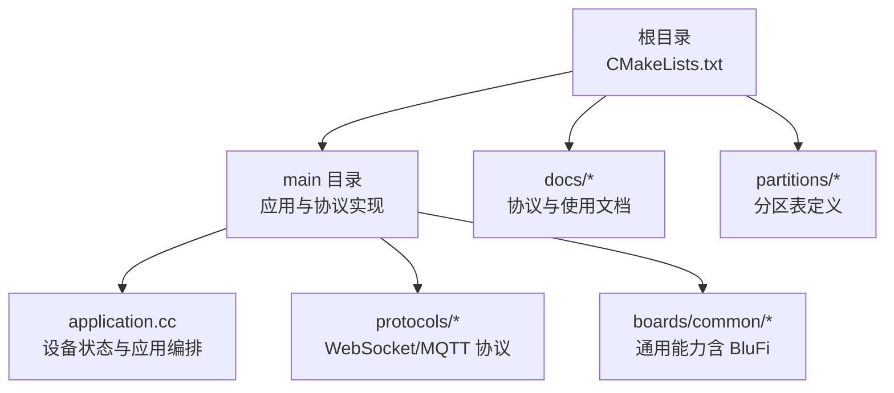
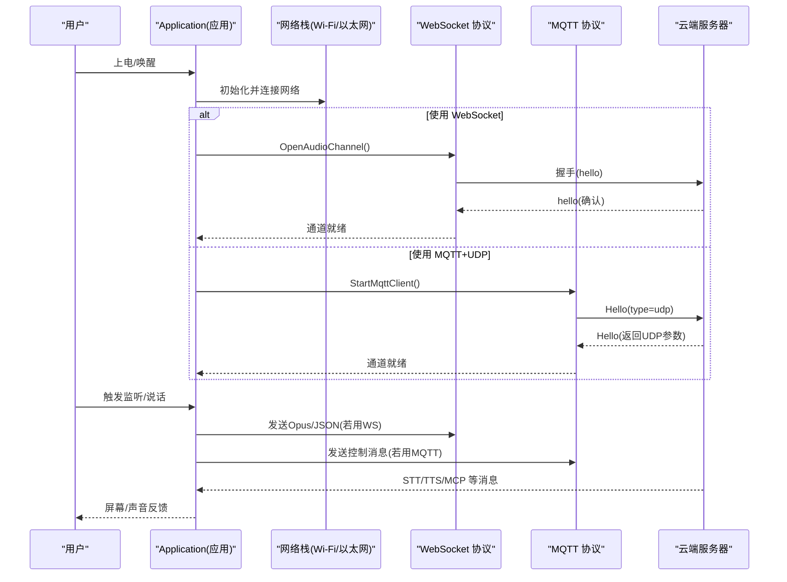
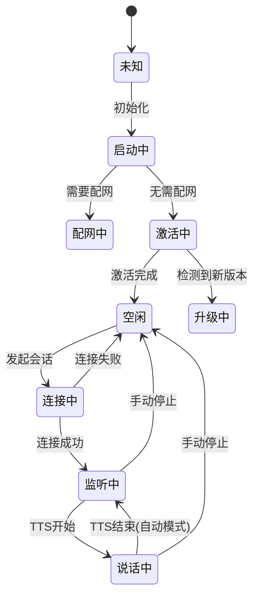
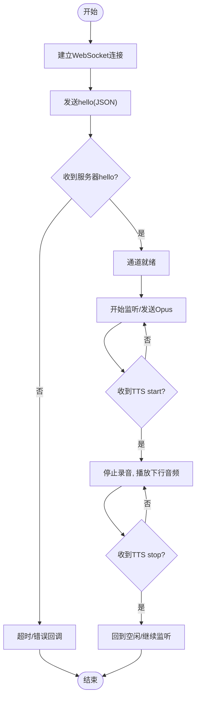
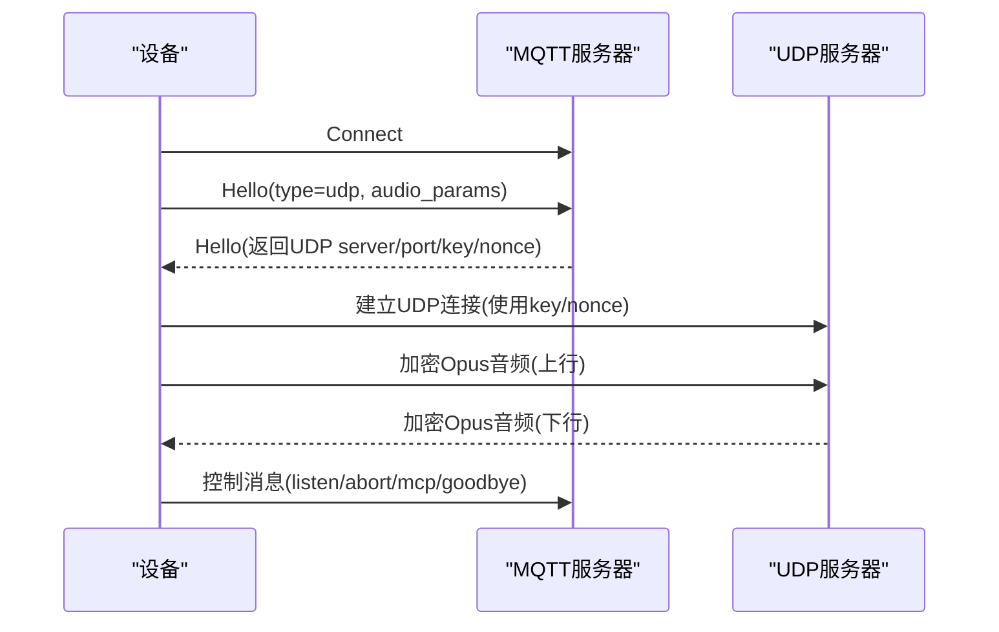
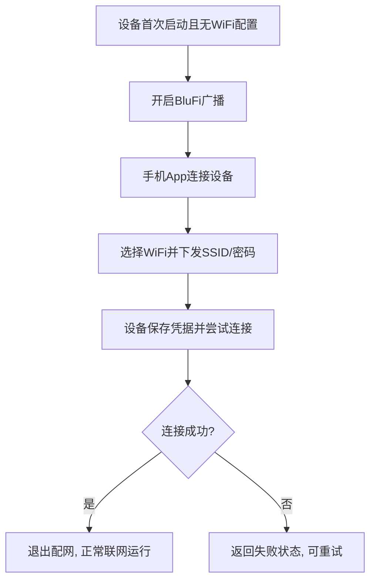
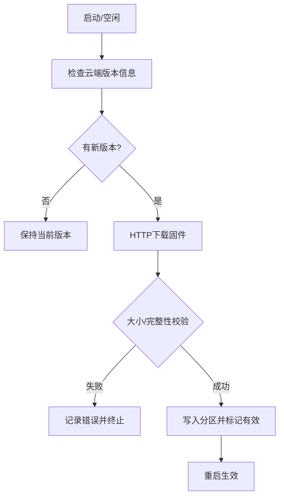
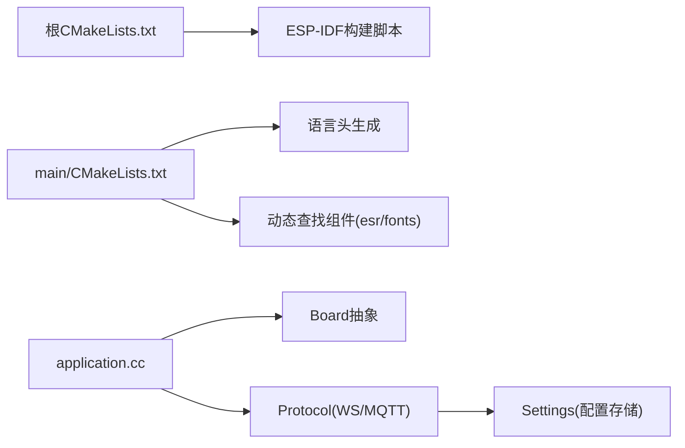

# 快速开始

<cite>
**本文引用的文件**   
- [README_zh.md](file://README_zh.md)
- [CMakeLists.txt](file://CMakeLists.txt)
- [main\CMakeLists.txt](file://main\CMakeLists.txt)
- [main\application.cc](file://main\application.cc)
- [main\device_state.h](file://main\device_state.h)
- [main\device_state_machine.cc](file://main\device_state_machine.cc)
- [main\protocols\mqtt_protocol.cc](file://main\protocols\mqtt_protocol.cc)
- [docs\websocket_zh.md](file://docs\websocket_zh.md)
- [docs\mqtt-udp_zh.md](file://docs\mqtt-udp_zh.md)
- [docs\blufi_zh.md](file://docs\blufi_zh.md)
- [main\boards\common\blufi.cpp](file://main\boards\common\blufi.cpp)
- [main\boards\common\blufi.h](file://main\boards\common\blufi.h)
- [main\ota.cc](file://main\ota.cc)
</cite>

## 目录
1. [简介](#简介)
2. [项目结构](#项目结构)
3. [核心组件](#核心组件)
4. [架构总览](#架构总览)
5. [详细组件分析](#详细组件分析)
6. [依赖分析](#依赖分析)
7. [性能考虑](#性能考虑)
8. [故障排查指南](#故障排查指南)
9. [结论](#结论)
10. [附录](#附录)

## 简介
本指南面向零经验用户，帮助你在最短时间内完成小智 AI 聊天机器人的环境搭建、固件烧录、基础配置与首次语音对话体验。你将了解：
- 开发环境与工具链准备（ESP-IDF、VSCode）
- 免编译的预编译固件下载与烧录流程
- 网络配置（Wi-Fi/热点/蓝牙配网）
- 服务器连接与默认云端服务
- 首次语音测试步骤

## 项目结构
仓库采用 ESP-IDF 工程结构，顶层 CMakeLists 指定版本与构建入口；应用主逻辑位于 main 目录，协议实现、音频处理、显示与板级适配均按功能分层组织。文档集中在 docs 目录，涵盖 WebSocket、MQTT+UDP、BluFi 配网等关键主题。

图表来源
- [CMakeLists.txt:1-13](file://CMakeLists.txt#L1-L13)
- [main\CMakeLists.txt:1071-1111](file://main\CMakeLists.txt#L1071-L1111)

章节来源
- [CMakeLists.txt:1-13](file://CMakeLists.txt#L1-L13)
- [main\CMakeLists.txt:1071-1111](file://main\CMakeLists.txt#L1071-L1111)

## 核心组件
- 应用编排与状态机：负责初始化硬件、管理设备状态流转、调度音频与网络事件。
- 通信协议层：支持 WebSocket 与 MQTT+UDP 两种通道，提供统一的音频通道与消息接口。
- 配网能力：支持热点配网与 BluFi（BLE Wi-Fi 配网），便于无屏幕或新手快速入网。
- OTA 与资源更新：支持在线升级与资源包更新，提升可维护性。

章节来源
- [main\application.cc:47-904](file://main\application.cc#L47-L904)
- [main\device_state.h:1-18](file://main\device_state.h#L1-L18)
- [main\device_state_machine.cc:1-51](file://main\device_state_machine.cc#L1-L51)
- [main\protocols\mqtt_protocol.cc:1-148](file://main\protocols\mqtt_protocol.cc#L1-L148)
- [docs\websocket_zh.md:1-496](file://docs\websocket_zh.md#L1-L496)
- [docs\mqtt-udp_zh.md:1-393](file://docs\mqtt-udp_zh.md#L1-L393)
- [docs\blufi_zh.md:1-38](file://docs\blufi_zh.md#L1-L38)
- [main\boards\common\blufi.cpp:46-779](file://main\boards\common\blufi.cpp#L46-L779)
- [main\boards\common\blufi.h:1-44](file://main\boards\common\blufi.h#L1-L44)
- [main\ota.cc:218-322](file://main\ota.cc#L218-L322)

## 架构总览
下图展示从“上电启动”到“语音对话”的关键路径：应用初始化 → 选择并建立通信通道（WebSocket 或 MQTT+UDP）→ 握手与音频通道打开 → 录音/播放交互。

图表来源
- [main\application.cc:47-904](file://main\application.cc#L47-L904)
- [docs\websocket_zh.md:1-496](file://docs\websocket_zh.md#L1-L496)
- [docs\mqtt-udp_zh.md:1-393](file://docs\mqtt-udp_zh.md#L1-L393)

## 详细组件分析

### 设备状态机与生命周期
- 状态枚举包含未知、启动中、配网中、空闲、连接中、监听、说话、升级、激活、音频测试、致命错误等。
- 状态转换受严格规则约束，确保在异常或中断时能回到安全态。

图表来源
- [main\device_state.h:1-18](file://main\device_state.h#L1-L18)
- [main\device_state_machine.cc:1-51](file://main\device_state_machine.cc#L1-L51)
- [main\application.cc:47-904](file://main\application.cc#L47-L904)

章节来源
- [main\device_state.h:1-18](file://main\device_state.h#L1-L18)
- [main\device_state_machine.cc:1-51](file://main\device_state_machine.cc#L1-L51)
- [main\application.cc:47-904](file://main\application.cc#L47-L904)

### 通信协议：WebSocket
- 设备端通过 OpenAudioChannel 建立连接，发送 hello 握手，等待服务器 hello 响应后进入可用状态。
- 文本帧承载 JSON 指令（如 listen/stt/tts/mcp/system/custom），二进制帧承载 Opus 音频流。
- 支持多种二进制协议版本，默认直接传输 Opus 数据。

图表来源
- [docs\websocket_zh.md:1-496](file://docs\websocket_zh.md#L1-L496)
- [main\application.cc:47-904](file://main\application.cc#L47-L904)

章节来源
- [docs\websocket_zh.md:1-496](file://docs\websocket_zh.md#L1-L496)
- [main\application.cc:47-904](file://main\application.cc#L47-L904)

### 通信协议：MQTT + UDP
- 控制面走 MQTT，数据面走 UDP（AES-CTR 加密）。
- 先通过 MQTT 交换 hello，获取 UDP 服务器地址、端口、密钥与随机数，再建立 UDP 通道进行音频传输。
- 具备序列号保护、防重放、自动重连等机制。

图表来源
- [docs\mqtt-udp_zh.md:1-393](file://docs\mqtt-udp_zh.md#L1-L393)
- [main\protocols\mqtt_protocol.cc:1-148](file://main\protocols\mqtt_protocol.cc#L1-L148)

章节来源
- [docs\mqtt-udp_zh.md:1-393](file://docs\mqtt-udp_zh.md#L1-L393)
- [main\protocols\mqtt_protocol.cc:1-148](file://main\protocols\mqtt_protocol.cc#L1-L148)

### 配网能力：BluFi（BLE Wi-Fi 配网）
- 通过 BLE 将路由器 SSID/密码下发至设备，设备写入 NVS 并自动连接 Wi-Fi。
- 与热点配网互斥，需根据需求在配置中选择一种方式。
- 适用于无屏幕或不便输入的场景。

图表来源
- [docs\blufi_zh.md:1-38](file://docs\blufi_zh.md#L1-L38)
- [main\boards\common\blufi.cpp:46-779](file://main\boards\common\blufi.cpp#L46-L779)
- [main\boards\common\blufi.h:1-44](file://main\boards\common\blufi.h#L1-L44)

章节来源
- [docs\blufi_zh.md:1-38](file://docs\blufi_zh.md#L1-L38)
- [main\boards\common\blufi.cpp:46-779](file://main\boards\common\blufi.cpp#L46-L779)
- [main\boards\common\blufi.h:1-44](file://main\boards\common\blufi.h#L1-L44)

### OTA 与资源更新
- 设备可检查云端版本信息，按需拉取并安装新固件。
- 支持进度与速度上报，校验大小一致性，失败回滚或提示。

图表来源
- [main\ota.cc:218-322](file://main\ota.cc#L218-L322)

章节来源
- [main\ota.cc:218-322](file://main\ota.cc#L218-L322)

## 依赖分析
- 构建系统：根 CMakeLists 引入 ESP-IDF 构建脚本，设置最小化构建与项目版本。
- 组件发现：main/CMakeLists 动态查找 esp-sr 与字体组件，生成语言头文件，注入 BOARD_TYPE/BOARD_NAME 等编译宏。
- 运行时依赖：应用依赖 Board 抽象获取音频、显示、网络能力；协议层依赖 Settings 读取服务端地址、鉴权等配置。

图表来源
- [CMakeLists.txt:1-13](file://CMakeLists.txt#L1-L13)
- [main\CMakeLists.txt:1071-1111](file://main\CMakeLists.txt#L1071-L1111)
- [main\application.cc:47-904](file://main\application.cc#L47-L904)
- [main\protocols\mqtt_protocol.cc:1-148](file://main\protocols\mqtt_protocol.cc#L1-L148)

章节来源
- [CMakeLists.txt:1-13](file://CMakeLists.txt#L1-L13)
- [main\CMakeLists.txt:1071-1111](file://main\CMakeLists.txt#L1071-L1111)
- [main\application.cc:47-904](file://main\application.cc#L47-L904)
- [main\protocols\mqtt_protocol.cc:1-148](file://main\protocols\mqtt_protocol.cc#L1-L148)

## 性能考虑
- 音频编码：默认使用 Opus，采样率与帧时长可在协议协商阶段对齐，避免重采样失真。
- 通道选择：对实时性要求高的场景优先 WebSocket；对带宽敏感且需高吞吐可选 MQTT+UDP。
- 电源策略：连接建立后切换到高性能模式，会话结束后回到低功耗模式以节省电量。
- 内存与缓冲：合理设置缓冲区大小与队列长度，避免丢帧或卡顿。

[本节为通用指导，不直接分析具体文件]

## 故障排查指南
- 无法连接到服务
  - 现象：WebSocket 握手超时或 MQTT 连接失败。
  - 排查：确认 Wi-Fi 已连通、服务端地址/端口/鉴权正确；查看日志中的错误码与提示。
  - 参考：WebSocket 握手与错误回调、MQTT 连接失败处理。
- 音频无声或断续
  - 现象：听不到回复或声音卡顿。
  - 排查：核对上下行采样率是否一致；检查网络抖动；确认设备处于 Speaking 状态。
- 配网失败
  - 现象：BluFi 或热点配网失败。
  - 排查：确认仅启用一种配网方式；清除旧 WiFi 配置；检查路由器兼容性。
- OTA 失败
  - 现象：下载失败或校验不一致。
  - 排查：检查网络稳定性与服务端 URL；关注进度与错误日志。

章节来源
- [docs\websocket_zh.md:1-496](file://docs\websocket_zh.md#L1-L496)
- [main\protocols\mqtt_protocol.cc:1-148](file://main\protocols\mqtt_protocol.cc#L1-L148)
- [docs\blufi_zh.md:1-38](file://docs\blufi_zh.md#L1-L38)
- [main\ota.cc:218-322](file://main\ota.cc#L218-L322)

## 结论
通过以上步骤，你可以在最短时间内完成小智 AI 聊天机器人的环境准备、固件烧录、网络配置与首次语音对话体验。后续可根据需要切换通信协议、自定义资源与扩展 MCP 能力。

[本节为总结，不直接分析具体文件]

## 附录

### 从零开始的完整入门流程（建议顺序）
- 准备硬件与工具
  - 准备一块兼容的 ESP32 开发板与 USB 数据线。
  - 如需自行编译，安装 VSCode 与 ESP-IDF 插件（SDK 版本 5.4 或以上）。
- 下载并烧录预编译固件（推荐新手）
  - 按照官方“新手烧录固件教程”指引，下载对应版本的固件并使用烧录工具写入设备。
  - 固件默认接入官方服务器，个人用户注册账号即可免费使用 Qwen 实时模型。
- 首次开机与网络配置
  - 若无已保存的 Wi-Fi，设备会进入配网模式：
    - 热点配网：连接设备热点，按提示输入 Wi-Fi 信息。
    - BluFi 配网：使用手机 App 通过 BLE 下发 Wi-Fi 信息。
- 验证语音对话
  - 设备联网成功后，可通过唤醒词或按键触发对话。
  - 观察屏幕状态与听到语音反馈，确认链路畅通。
- 进阶配置
  - 如需自建服务器或调整参数，请参考 WebSocket 与 MQTT+UDP 协议文档，并在控制台或本地配置中修改 endpoint、鉴权等信息。

章节来源
- [README_zh.md:105-134](file://README_zh.md#L105-L134)
- [docs\websocket_zh.md:1-496](file://docs\websocket_zh.md#L1-L496)
- [docs\mqtt-udp_zh.md:1-393](file://docs\mqtt-udp_zh.md#L1-L393)
- [docs\blufi_zh.md:1-38](file://docs\blufi_zh.md#L1-L38)