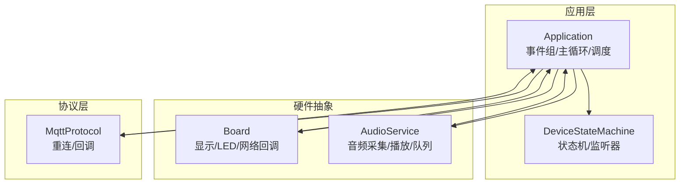
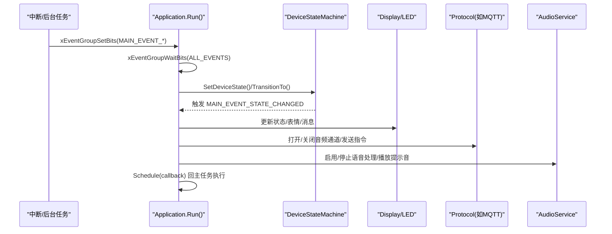
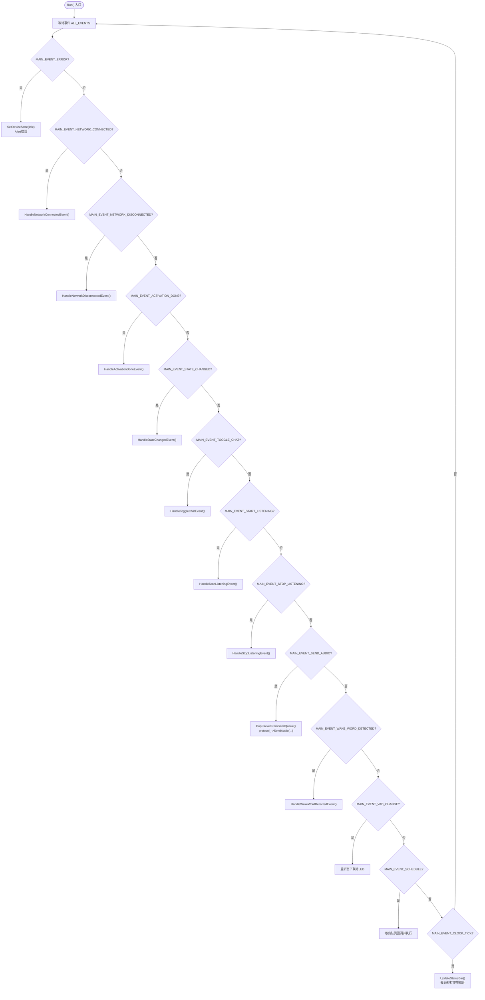
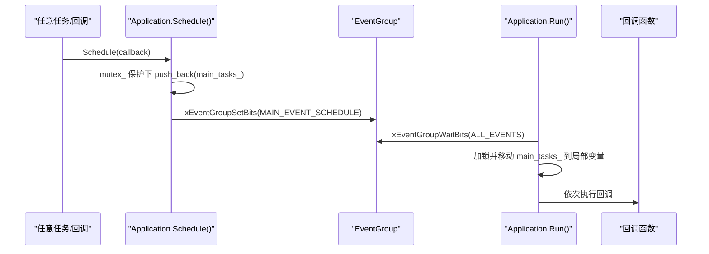
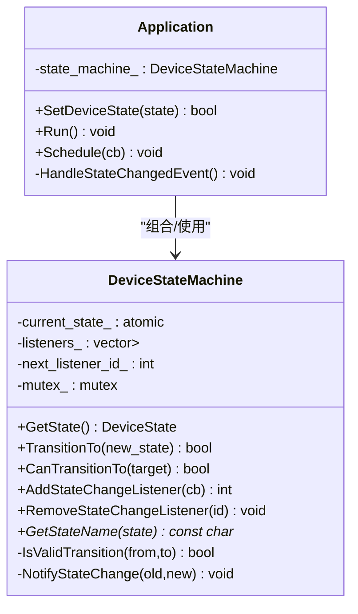
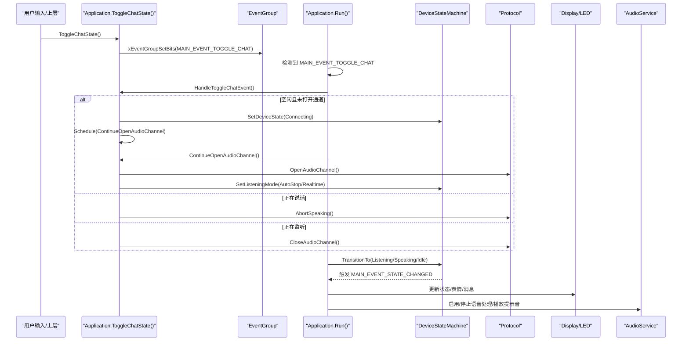
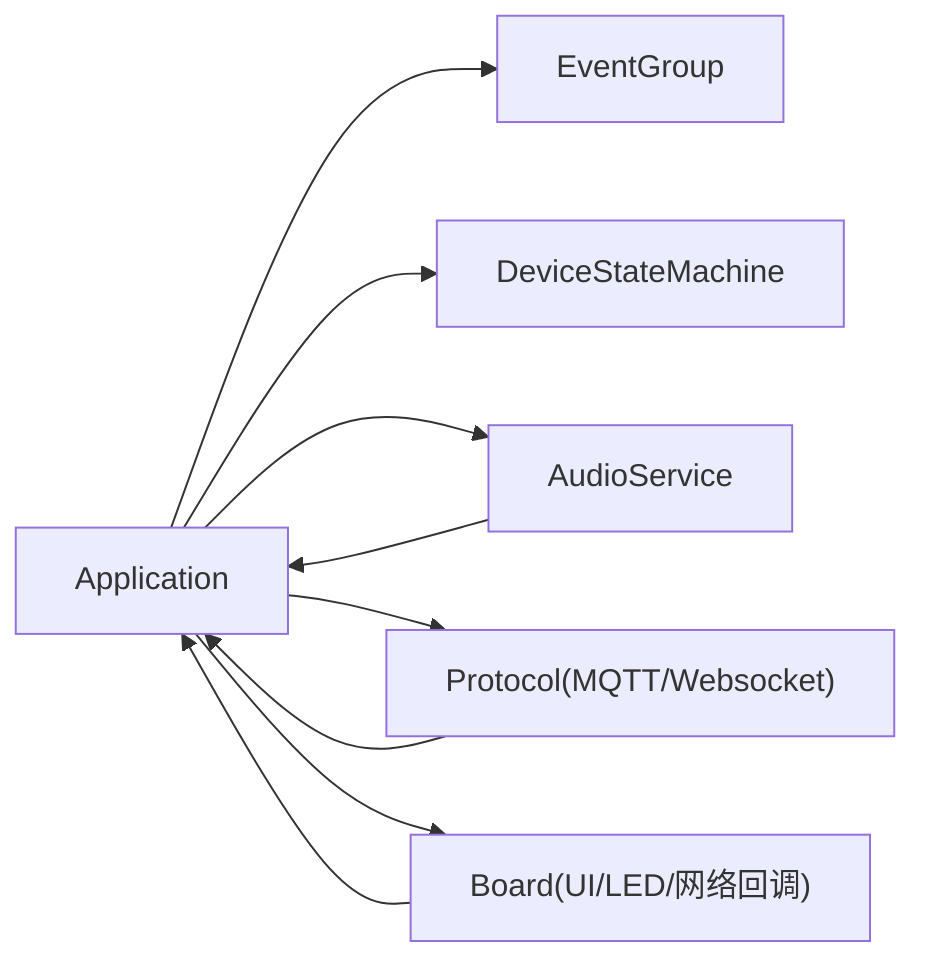

# 事件驱动架构

<cite>
**本文引用的文件**   
- [application.h](file://main/application.h)
- [application.cc](file://main/application.cc)
- [device_state_machine.h](file://main/device_state_machine.h)
- [device_state_machine.cc](file://main/device_state_machine.cc)
- [device_state.h](file://main/device_state.h)
- [mqtt_protocol.cc](file://main/protocols/mqtt_protocol.cc)
</cite>

## 目录
1. [引言](#引言)
2. [项目结构](#项目结构)
3. [核心组件](#核心组件)
4. [架构总览](#架构总览)
5. [详细组件分析](#详细组件分析)
6. [依赖关系分析](#依赖关系分析)
7. [性能考虑](#性能考虑)
8. [故障排查指南](#故障排查指南)
9. [结论](#结论)
10. [附录：最佳实践与参考路径](#附录最佳实践与参考路径)

## 引言
本文件面向小智AI聊天机器人（基于ESP32 + FreeRTOS）的事件驱动架构，聚焦以下目标：
- 解释基于FreeRTOS EventGroup的事件处理机制：事件定义、触发、处理函数设计模式
- 说明主事件循环 Run() 的工作流程与各 MAIN_EVENT_* 事件的处理逻辑
- 描述异步任务调度机制 Schedule 的实现原理
- 阐述线程安全的设计考虑与互斥锁(mutex)的使用场景
- 提供从用户操作到系统响应的完整事件链流程图与时序图
- 为开发者提供事件驱动编程的最佳实践指导

## 项目结构
围绕事件驱动的核心代码集中在 Application 层与设备状态机 DeviceStateMachine。关键文件职责如下：
- application.h / application.cc：应用入口、事件组、主循环、事件分发、异步调度、协议与音频服务集成
- device_state_machine.h / device_state_machine.cc：设备状态机，负责状态转换校验与变更回调
- device_state.h：设备状态枚举定义
- mqtt_protocol.cc：网络协议层的示例，展示如何跨线程通过 Schedule 回到主任务执行

图表来源
- [application.h:1-194](file://main/application.h#L1-L194)
- [application.cc:1-1132](file://main/application.cc#L1-L1132)
- [device_state_machine.h:1-84](file://main/device_state_machine.h#L1-L84)
- [device_state_machine.cc:1-162](file://main/device_state_machine.cc#L1-L162)
- [mqtt_protocol.cc:1-46](file://main/protocols/mqtt_protocol.cc#L1-L46)

章节来源
- [application.h:1-194](file://main/application.h#L1-L194)
- [application.cc:1-1132](file://main/application.cc#L1-L1132)
- [device_state_machine.h:1-84](file://main/device_state_machine.h#L1-L84)
- [device_state_machine.cc:1-162](file://main/device_state_machine.cc#L1-L162)
- [device_state.h:1-18](file://main/device_state.h#L1-L18)
- [mqtt_protocol.cc:1-46](file://main/protocols/mqtt_protocol.cc#L1-L46)

## 核心组件
- 事件组与事件位定义
  - 使用 FreeRTOS EventGroup 作为跨任务/中断的轻量级事件通知机制
  - 在头文件中集中定义所有 MAIN_EVENT_* 位标志，便于统一管理与扩展
- 主事件循环 Run()
  - 阻塞等待任意事件位被置位，按位判断并调用对应处理函数
  - 将耗时或需要UI更新的操作放入主任务上下文执行，避免跨线程直接访问共享资源
- 异步调度 Schedule
  - 将回调推入主任务队列，并通过事件位唤醒主循环执行
  - 保证回调在主任务中串行执行，天然具备线程安全性
- 设备状态机 DeviceStateMachine
  - 严格的状态转换规则与合法性检查
  - 变更时通过观察者模式通知监听者，由监听者触发 MAIN_EVENT_STATE_CHANGED 进入主循环统一处理

章节来源
- [application.h:21-35](file://main/application.h#L21-L35)
- [application.cc:165-259](file://main/application.cc#L165-L259)
- [application.cc:934-940](file://main/application.cc#L934-L940)
- [device_state_machine.h:17-81](file://main/device_state_machine.h#L17-L81)
- [device_state_machine.cc:34-102](file://main/device_state_machine.cc#L34-L102)

## 架构总览
下图展示了事件驱动的整体交互：各子系统（音频、网络、定时器、用户输入等）通过设置事件位通知主循环；主循环根据事件位分派到具体处理函数；涉及UI或协议状态变更的操作通过 Schedule 回到主任务执行，确保线程安全。

图表来源
- [application.cc:165-259](file://main/application.cc#L165-L259)
- [application.cc:934-940](file://main/application.cc#L934-L940)
- [device_state_machine.cc:108-131](file://main/device_state_machine.cc#L108-L131)

## 详细组件分析

### 事件定义与触发
- 事件位定义
  - 位于头文件集中声明，包括：调度、发送音频、唤醒词检测、VAD变化、错误、激活完成、时钟滴答、网络连接/断开、切换对话、开始/停止监听、状态变更等
- 触发方式
  - 中断/定时器回调：例如时钟定时器周期性触发 MAIN_EVENT_CLOCK_TICK
  - 音频服务回调：发送队列可用、唤醒词检测、VAD变化等
  - 网络回调：连接/断开等
  - 状态机变更：监听器回调触发 MAIN_EVENT_STATE_CHANGED
  - 用户交互：按键/触摸等上层调用 ToggleChatState/StartListening/StopListening 设置相应事件位

章节来源
- [application.h:21-35](file://main/application.h#L21-L35)
- [application.cc:36-47](file://main/application.cc#L36-L47)
- [application.cc:77-91](file://main/application.cc#L77-L91)
- [application.cc:102-156](file://main/application.cc#L102-L156)
- [application.cc:662-672](file://main/application.cc#L662-L672)

### 主事件循环 Run() 工作流程
- 优先级设置：主任务优先级设为较高值，确保及时响应
- 事件等待：xEventGroupWaitBits 等待任一事件位
- 事件分发：按位判断并调用对应 Handle* 方法
- 典型分支：
  - 错误事件：复位到空闲并弹出错误提示
  - 网络事件：连接后启动激活任务；断开时关闭音频通道
  - 激活完成：清理OTA对象、降低功耗、播放成功提示
  - 状态变更：根据新状态更新UI、控制音频处理开关、发送协议命令
  - 对话切换/开始/停止监听：根据当前状态决定打开/关闭音频通道、发送指令
  - 发送音频：从音频队列取包并发送到协议层
  - 唤醒词检测：编码唤醒词、建立通道或继续对话
  - VAD变化：监听状态下联动LED
  - 调度任务：取出队列中的回调并执行
  - 时钟滴答：刷新状态栏、定时打印堆信息

图表来源
- [application.cc:165-259](file://main/application.cc#L165-L259)

章节来源
- [application.cc:165-259](file://main/application.cc#L165-L259)

### 异步任务调度机制 Schedule
- 实现原理
  - 将 std::function<void()> 推入主任务队列 main_tasks_
  - 通过设置 MAIN_EVENT_SCHEDULE 唤醒主循环
  - 主循环持有互斥锁拷贝出队列，释放锁后逐个执行回调
- 适用场景
  - 从非主任务（定时器、协议回调、网络回调）更新UI或修改协议状态
  - 避免跨线程直接访问共享资源，保证串行执行顺序

图表来源
- [application.cc:934-940](file://main/application.cc#L934-L940)
- [application.cc:239-246](file://main/application.cc#L239-L246)

章节来源
- [application.cc:934-940](file://main/application.cc#L934-L940)
- [application.cc:239-246](file://main/application.cc#L239-L246)

### 设备状态机与状态变更事件
- 状态定义
  - 包含未知、启动、配网、空闲、连接、监听、说话、升级、激活、音频测试、致命错误等
- 转换规则
  - 仅允许合法转换，非法转换将被拒绝并记录日志
- 变更通知
  - 内部维护监听器列表，变更时复制回调列表并在锁外执行，避免死锁
  - 监听器回调通常设置 MAIN_EVENT_STATE_CHANGED，交由主循环统一处理UI与业务逻辑

图表来源
- [device_state_machine.h:17-81](file://main/device_state_machine.h#L17-L81)
- [device_state_machine.cc:34-102](file://main/device_state_machine.cc#L34-L102)
- [device_state_machine.cc:108-131](file://main/device_state_machine.cc#L108-L131)
- [device_state_machine.cc:148-161](file://main/device_state_machine.cc#L148-L161)
- [application.h:67-75](file://main/application.h#L67-L75)
- [application.cc:860-932](file://main/application.cc#L860-L932)

章节来源
- [device_state.h:4-16](file://main/device_state.h#L4-L16)
- [device_state_machine.cc:34-102](file://main/device_state_machine.cc#L34-L102)
- [device_state_machine.cc:108-131](file://main/device_state_machine.cc#L108-L131)
- [device_state_machine.cc:148-161](file://main/device_state_machine.cc#L148-L161)
- [application.cc:860-932](file://main/application.cc#L860-L932)

### 用户操作到系统响应的时序图
以“用户按下按钮发起对话”为例，展示从事件触发到系统响应的完整链路：

图表来源
- [application.cc:662-711](file://main/application.cc#L662-L711)
- [application.cc:713-730](file://main/application.cc#L713-L730)
- [application.cc:860-932](file://main/application.cc#L860-L932)

章节来源
- [application.cc:662-711](file://main/application.cc#L662-L711)
- [application.cc:713-730](file://main/application.cc#L713-L730)
- [application.cc:860-932](file://main/application.cc#L860-L932)

## 依赖关系分析
- 模块耦合
  - Application 聚合 AudioService、Protocol、DeviceStateMachine、Board 等子系统
  - 通过事件组松耦合地传递信号，减少直接调用带来的紧耦合
- 外部依赖
  - FreeRTOS EventGroup 用于跨任务/中断同步
  - esp_timer 提供周期任务（时钟滴答）
  - 协议层（如MQTT）通过 Schedule 回到主任务执行，避免在协议回调中直接操作共享状态

图表来源
- [application.h:1-194](file://main/application.h#L1-L194)
- [application.cc:1-1132](file://main/application.cc#L1-L1132)
- [mqtt_protocol.cc:1-46](file://main/protocols/mqtt_protocol.cc#L1-L46)

章节来源
- [application.h:1-194](file://main/application.h#L1-L194)
- [application.cc:1-1132](file://main/application.cc#L1-L1132)
- [mqtt_protocol.cc:1-46](file://main/protocols/mqtt_protocol.cc#L1-L46)

## 性能考虑
- 事件分组与批量处理
  - 主循环一次性获取所有置位的事件位，避免多次等待造成的延迟
- 队列批处理
  - 发送音频时循环 PopPacketFromSendQueue，减少协议调用次数
- 低功耗策略
  - 空闲/待机时降低功耗等级；连接/传输时提升性能等级
- 定时任务
  - 时钟滴答每1秒刷新UI，每10秒打印堆统计，平衡实时性与开销

[本节为通用性能建议，不直接分析具体文件]

## 故障排查指南
- 常见问题定位
  - 网络错误：协议层回调设置 MAIN_EVENT_ERROR，主循环复位到空闲并弹出错误提示
  - 网络断开：自动关闭音频通道，防止数据残留
  - 激活失败：重试机制与指数退避，必要时降级到空闲继续运行
- 调试手段
  - 利用状态机日志输出查看状态转换是否合法
  - 定期打印堆统计，观察内存泄漏或碎片化问题
  - 通过 UI 状态栏与提示音辅助定位阶段

章节来源
- [application.cc:187-190](file://main/application.cc#L187-L190)
- [application.cc:286-297](file://main/application.cc#L286-L297)
- [application.cc:398-471](file://main/application.cc#L398-L471)
- [device_state_machine.cc:118-121](file://main/device_state_machine.cc#L118-L121)

## 结论
该事件驱动架构通过 FreeRTOS EventGroup 实现了低耦合、高内聚的系统通信模型：
- 事件位作为统一的“消息总线”，屏蔽了不同子系统间的差异
- 主循环作为唯一协调者，保证状态变更与UI更新的原子性
- 异步调度 Schedule 提供了安全的跨线程执行通道
- 状态机确保了业务流转的正确性与可观测性

这种设计既适合资源受限的嵌入式平台，也便于后续扩展新的事件类型与处理逻辑。

[本节为总结性内容，不直接分析具体文件]

## 附录：最佳实践与参考路径
- 事件驱动编程最佳实践
  - 事件定义集中管理，命名清晰，避免位冲突
  - 所有跨线程的UI/协议状态变更一律走 Schedule，禁止直接访问共享资源
  - 状态变更必须经过状态机校验，非法转换应记录日志并拒绝
  - 对耗时操作采用后台任务+事件通知的方式，避免阻塞主循环
  - 使用幂等的事件处理逻辑，防止重复事件导致副作用
- 参考路径（含行号范围）
  - 事件位定义与主循环：[application.h:21-35](file://main/application.h#L21-L35)、[application.cc:165-259](file://main/application.cc#L165-L259)
  - 异步调度实现：[application.cc:934-940](file://main/application.cc#L934-L940)
  - 状态机与监听器：[device_state_machine.h:17-81](file://main/device_state_machine.h#L17-L81)、[device_state_machine.cc:108-131](file://main/device_state_machine.cc#L108-L131)
  - 状态变更处理：[application.cc:860-932](file://main/application.cc#L860-L932)
  - 网络错误与断线处理：[application.cc:187-190](file://main/application.cc#L187-L190)、[application.cc:286-297](file://main/application.cc#L286-L297)
  - 协议层跨线程调度示例：[mqtt_protocol.cc:1-46](file://main/protocols/mqtt_protocol.cc#L1-L46)