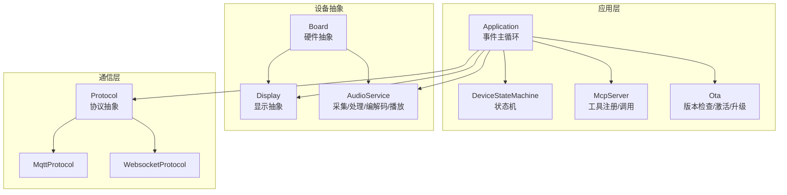
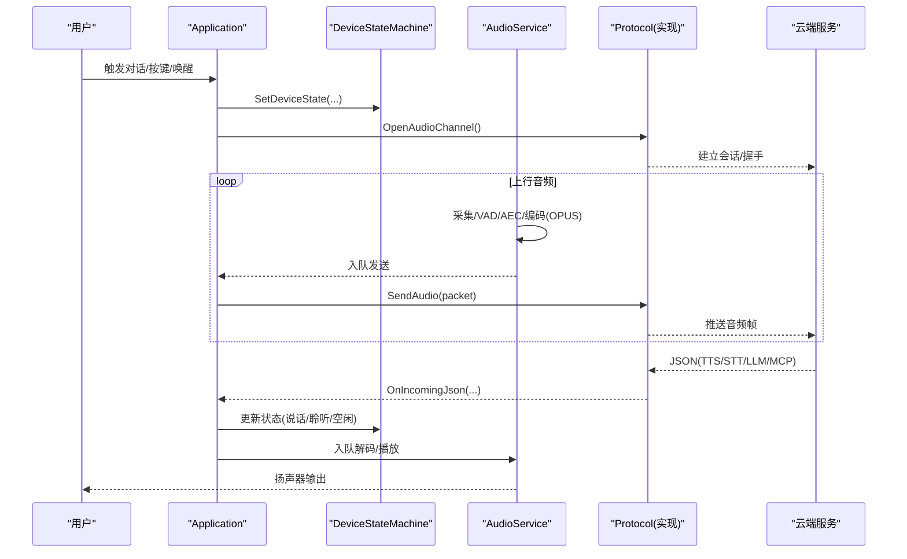
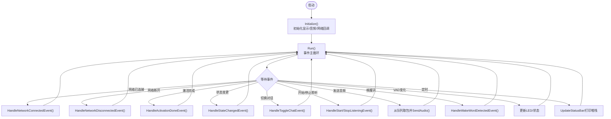
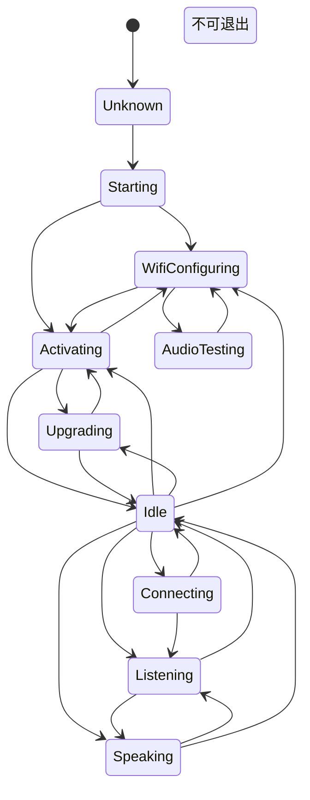
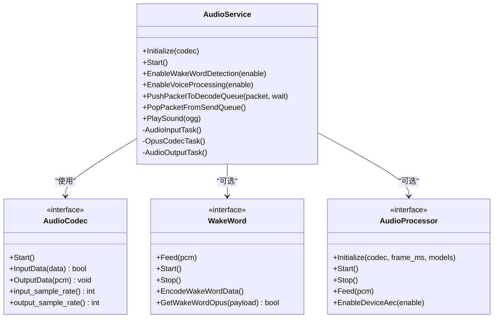
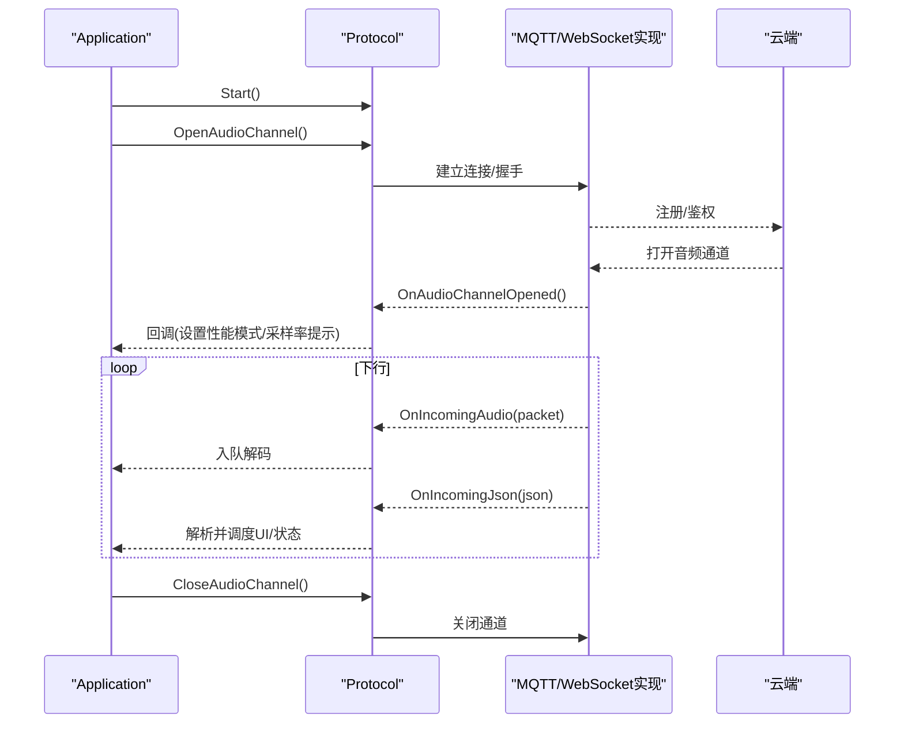
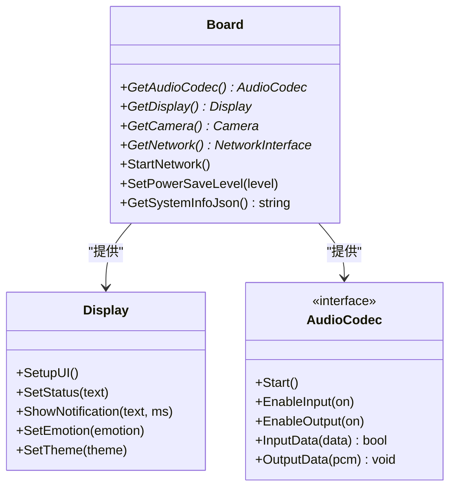
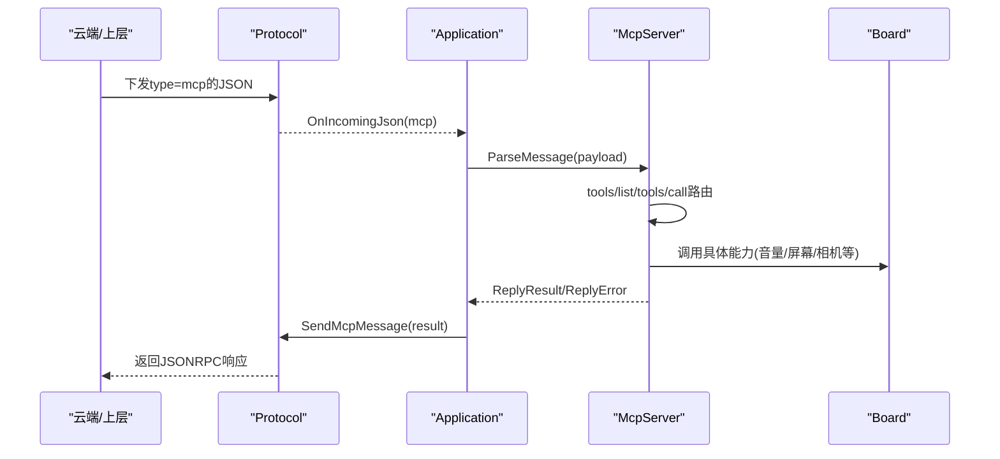
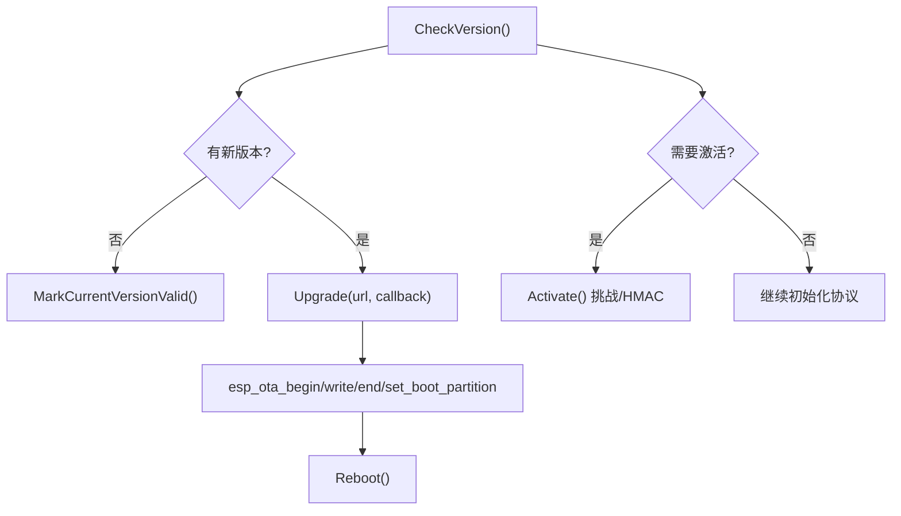
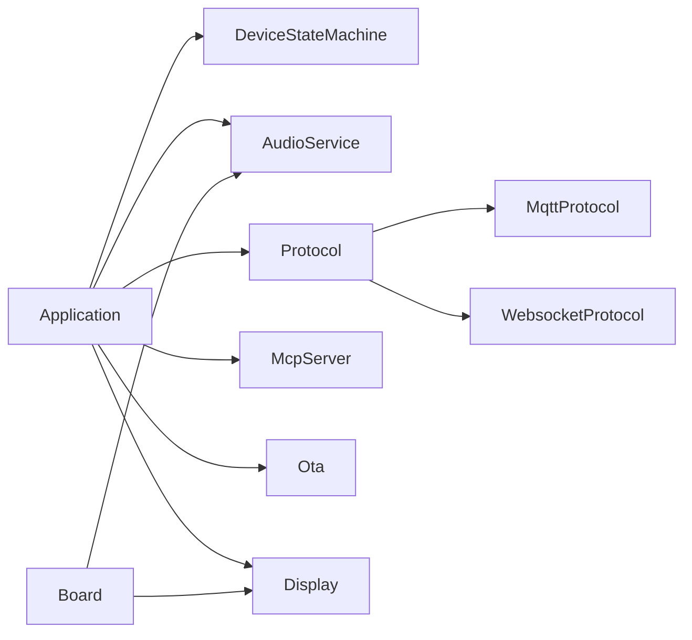

# 技术架构概览

<cite>
**本文引用的文件**   
- [README.md](file://README.md)
- [application.h](file://main/application.h)
- [application.cc](file://main/application.cc)
- [device_state_machine.h](file://main/device_state_machine.h)
- [device_state_machine.cc](file://main/device_state_machine.cc)
- [audio_service.h](file://main/audio/audio_service.h)
- [audio_service.cc](file://main/audio/audio_service.cc)
- [protocol.h](file://main/protocols/protocol.h)
- [board.h](file://main/boards/common/board.h)
- [board.cc](file://main/boards/common/board.cc)
- [display.h](file://main/display/display.h)
- [display.cc](file://main/display/display.cc)
- [mcp_server.h](file://main/mcp_server.h)
- [mcp_server.cc](file://main/mcp_server.cc)
- [ota.h](file://main/ota.h)
- [ota.cc](file://main/ota.cc)
</cite>

## 目录
1. [引言](#引言)
2. [项目结构](#项目结构)
3. [核心组件](#核心组件)
4. [架构总览](#架构总览)
5. [详细组件分析](#详细组件分析)
6. [依赖关系分析](#依赖关系分析)
7. [性能考量](#性能考量)
8. [故障排查指南](#故障排查指南)
9. [结论](#结论)
10. [附录](#附录)

## 引言
本文件面向开发者，提供小智AI聊天机器人的系统级技术架构概览。内容覆盖ESP32设备端、云端服务与通信协议的整体设计；基于事件驱动的应用程序架构与FreeRTOS任务调度机制；从语音输入到AI响应处理的端到端数据流；以及模块化与插件化架构如何支撑70+硬件平台的适配。文档包含架构图与数据流图，帮助读者快速建立系统理解框架。

## 项目结构
仓库采用“功能域 + 板级抽象”的组织方式：
- main：应用层与核心子系统（应用主循环、状态机、音频服务、协议抽象、MCP工具服务器、OTA升级等）
- boards：各硬件板级适配实现（统一Board接口，屏蔽差异）
- display：显示抽象与具体实现（LVGL/OLED等）
- protocols：通信协议抽象与具体实现（MQTT/UDP、WebSocket）
- assets：多语言与资源管理
- scripts：构建与调试脚本

图表来源
- [application.h:43-176](file://main/application.h#L43-L176)
- [device_state_machine.h:17-81](file://main/device_state_machine.h#L17-L81)
- [audio_service.h:105-195](file://main/audio/audio_service.h#L105-L195)
- [protocol.h:44-95](file://main/protocols/protocol.h#L44-L95)
- [board.h:49-85](file://main/boards/common/board.h#L49-L85)
- [display.h:28-61](file://main/display/display.h#L28-L61)
- [mcp_server.h:314-345](file://main/mcp_server.h#L314-L345)
- [ota.h:10-56](file://main/ota.h#L10-L56)

章节来源
- [README.md:1-173](file://README.md#L1-L173)

## 核心组件
- Application：应用入口与事件主循环，协调网络、音频、UI、协议、MCP、OTA等模块，通过事件组分发事件，保证线程安全与可插拔扩展。
- DeviceStateMachine：严格的状态转换控制，提供监听器回调，确保交互流程一致性与可观测性。
- AudioService：音频I/O、VAD/唤醒词、AEC、Opus编解码、重采样、队列缓冲与功耗管理，支持多种工作模式（自动/手动/实时）。
- Protocol抽象与实现：统一Open/Close/Send/OnIncoming接口，具体实现包括MQTT+UDP与WebSocket两种通道。
- Board抽象：统一获取AudioCodec/Display/Camera/Network等硬件能力，屏蔽不同板卡差异，支持70+平台。
- Display抽象：UI状态、通知、表情、主题切换的统一接口。
- McpServer：设备侧MCP工具注册与执行，暴露设备能力给大模型或用户侧工具链。
- Ota：版本检查、激活码/挑战应答、固件下载与分区切换、回滚保护。

章节来源
- [application.h:43-176](file://main/application.h#L43-L176)
- [application.cc:61-163](file://main/application.cc#L61-L163)
- [device_state_machine.h:17-81](file://main/device_state_machine.h#L17-L81)
- [device_state_machine.cc:34-102](file://main/device_state_machine.cc#L34-L102)
- [audio_service.h:105-195](file://main/audio/audio_service.h#L105-L195)
- [audio_service.cc:125-167](file://main/audio/audio_service.cc#L125-L167)
- [protocol.h:44-95](file://main/protocols/protocol.h#L44-L95)
- [board.h:49-85](file://main/boards/common/board.h#L49-L85)
- [display.h:28-61](file://main/display/display.h#L28-L61)
- [mcp_server.h:314-345](file://main/mcp_server.h#L314-L345)
- [ota.h:10-56](file://main/ota.h#L10-L56)

## 架构总览
整体采用“事件驱动 + 分层抽象”的架构：
- 设备端：以Application为主控，通过FreeRTOS事件组与定时器驱动主循环；AudioService在独立任务中完成采集/处理/编解码/播放；Protocol负责与云端双向传输；McpServer提供工具能力；Board抽象屏蔽硬件差异。
- 云端服务：根据配置选择MQTT+UDP或WebSocket通道；接收OPUS音频帧与JSON控制消息，返回TTS/LLM结果与系统指令。
- 通信协议：二进制帧携带时间戳用于服务端AEC；JSON承载对话、情绪、MCP命令等元信息。

图表来源
- [application.cc:473-610](file://main/application.cc#L473-L610)
- [audio_service.cc:230-288](file://main/audio/audio_service.cc#L230-L288)
- [audio_service.cc:327-446](file://main/audio/audio_service.cc#L327-L446)
- [protocol.h:44-95](file://main/protocols/protocol.h#L44-L95)

## 详细组件分析

### 事件驱动与应用主循环
- 事件定义：MAIN_EVENT_*集中定义于头文件，涵盖网络、音频、唤醒词、VAD、时钟、错误、状态变更等。
- 主循环：Application::Run使用xEventGroupWaitBits等待事件，按位分发到对应处理器；Schedule将跨任务回调投递至主任务执行，避免竞态。
- 网络事件：Board回调网络扫描/连接/断开等，驱动UI与状态机。
- 激活流程：网络就绪后启动ActivationTask，进行资源/版本/协议初始化，完成后进入Idle。

图表来源
- [application.h:22-35](file://main/application.h#L22-L35)
- [application.cc:165-259](file://main/application.cc#L165-L259)
- [application.cc:261-338](file://main/application.cc#L261-L338)

章节来源
- [application.h:22-35](file://main/application.h#L22-L35)
- [application.cc:61-163](file://main/application.cc#L61-L163)
- [application.cc:165-259](file://main/application.cc#L165-L259)
- [application.cc:261-338](file://main/application.cc#L261-L338)

### 设备状态机
- 状态集合：unknown/starting/wifi_configuring/idle/connecting/listening/speaking/upgrading/activating/audio_testing/fatal_error。
- 转换规则：IsValidTransition明确合法迁移路径，防止非法跳转；TransitionTo原子更新并通知监听器。
- 监听器：AddStateChangeListener允许UI/业务逻辑对状态变化作出反应。

图表来源
- [device_state_machine.cc:34-102](file://main/device_state_machine.cc#L34-L102)

章节来源
- [device_state_machine.h:17-81](file://main/device_state_machine.h#L17-L81)
- [device_state_machine.cc:108-131](file://main/device_state_machine.cc#L108-L131)

### 音频服务与任务调度
- 任务划分：
  - audio_input：采集PCM，可选喂给唤醒词与语音处理器，推送到编码队列。
  - opus_codec：并行Opus编解码，维护解码/播放/发送队列，按需重采样。
  - audio_output：从播放队列取出PCM写入Codec。
- 关键特性：
  - 双路队列：解码队列与发送队列解耦，降低延迟与抖动。
  - 动态采样率：根据远端协商调整解码参数与输出重采样。
  - 功耗管理：无IO时关闭Codec输入/输出，周期性检测恢复。
  - AEC：支持设备端与服务端AEC，时间戳对齐。
  - 唤醒词：按芯片平台选择AFE/自定义/ESP-WakeWord实现。

图表来源
- [audio_service.h:105-195](file://main/audio/audio_service.h#L105-L195)
- [audio_service.cc:125-167](file://main/audio/audio_service.cc#L125-L167)
- [audio_service.cc:230-288](file://main/audio/audio_service.cc#L230-L288)
- [audio_service.cc:327-446](file://main/audio/audio_service.cc#L327-L446)

章节来源
- [audio_service.h:105-195](file://main/audio/audio_service.h#L105-L195)
- [audio_service.cc:125-167](file://main/audio/audio_service.cc#L125-L167)
- [audio_service.cc:230-288](file://main/audio/audio_service.cc#L230-L288)
- [audio_service.cc:327-446](file://main/audio/audio_service.cc#L327-L446)

### 通信协议与云端交互
- 协议抽象：Protocol定义统一的音频通道与JSON消息回调；具体实现包括MQTT+UDP与WebSocket。
- 上行：OPUS音频帧带时间戳，便于服务端AEC。
- 下行：JSON类型包括tts/stt/llm/mcp/system/alert等，驱动UI与状态机。
- 连接生命周期：OpenAudioChannel/CloseAudioChannel/IsAudioChannelOpened，配合网络事件处理。

图表来源
- [protocol.h:44-95](file://main/protocols/protocol.h#L44-L95)
- [application.cc:473-610](file://main/application.cc#L473-L610)

章节来源
- [protocol.h:44-95](file://main/protocols/protocol.h#L44-L95)
- [application.cc:473-610](file://main/application.cc#L473-L610)

### 板级抽象与插件化适配
- Board抽象：统一创建与管理AudioCodec/Display/Camera/Network等，提供网络事件回调与电源策略。
- 插件化：每个板子实现自己的Board子类与config.json，复用通用逻辑，新增平台仅需实现最小适配集。
- 显示抽象：Display封装UI状态、通知、表情、主题切换，NoDisplay为默认空实现。

图表来源
- [board.h:49-85](file://main/boards/common/board.h#L49-L85)
- [display.h:28-61](file://main/display/display.h#L28-L61)

章节来源
- [board.h:49-85](file://main/boards/common/board.h#L49-L85)
- [board.cc:15-46](file://main/boards/common/board.cc#L15-L46)
- [display.h:28-61](file://main/display/display.h#L28-L61)
- [display.cc:23-46](file://main/display/display.cc#L23-L46)

### MCP工具服务器
- 工具注册：AddCommonTools/AddUserOnlyTools分别向AI与用户暴露能力，支持属性校验与范围限制。
- 工具调用：tools/list分页返回，tools/call在主线程执行，异常统一包装为错误响应。
- 典型工具：设备状态查询、音量控制、屏幕亮度/主题、拍照解释、系统信息、重启、固件升级、资产URL设置等。

图表来源
- [mcp_server.h:314-345](file://main/mcp_server.h#L314-L345)
- [mcp_server.cc:350-433](file://main/mcp_server.cc#L350-L433)
- [mcp_server.cc:508-560](file://main/mcp_server.cc#L508-L560)
- [application.cc:521-607](file://main/application.cc#L521-L607)

章节来源
- [mcp_server.h:314-345](file://main/mcp_server.h#L314-L345)
- [mcp_server.cc:33-126](file://main/mcp_server.cc#L33-L126)
- [mcp_server.cc:350-433](file://main/mcp_server.cc#L350-L433)
- [mcp_server.cc:508-560](file://main/mcp_server.cc#L508-L560)
- [application.cc:521-607](file://main/application.cc#L521-L607)

### OTA与激活流程
- 版本检查：POST设备信息到服务器，解析firmware/mqtt/websocket/server_time/activation字段。
- 激活：支持激活码与挑战应答（HMAC），超时重试。
- 升级：分块下载、边写边校验、设置boot分区、标记当前版本有效。

图表来源
- [ota.cc:77-245](file://main/ota.cc#L77-L245)
- [ota.cc:267-387](file://main/ota.cc#L267-L387)
- [ota.cc:458-493](file://main/ota.cc#L458-L493)
- [application.cc:323-338](file://main/application.cc#L323-L338)

章节来源
- [ota.h:10-56](file://main/ota.h#L10-L56)
- [ota.cc:77-245](file://main/ota.cc#L77-L245)
- [ota.cc:267-387](file://main/ota.cc#L267-L387)
- [ota.cc:458-493](file://main/ota.cc#L458-L493)
- [application.cc:323-338](file://main/application.cc#L323-L338)

## 依赖关系分析
- 松耦合：Application仅依赖Protocol抽象，不关心具体实现；Board抽象屏蔽硬件差异；Display/AudioCodec均为接口。
- 内聚性：AudioService内部自包含采集/处理/编解码/播放链路；McpServer自管工具注册与调用；Ota封装HTTP/分区操作。
- 外部依赖：cJSON、ESP-IDF音频库、网络栈、LVGL（可选）、ESP-SR（可选）。

图表来源
- [application.h:43-176](file://main/application.h#L43-L176)
- [protocol.h:44-95](file://main/protocols/protocol.h#L44-L95)
- [board.h:49-85](file://main/boards/common/board.h#L49-L85)

章节来源
- [application.h:43-176](file://main/application.h#L43-L176)
- [protocol.h:44-95](file://main/protocols/protocol.h#L44-L95)
- [board.h:49-85](file://main/boards/common/board.h#L49-L85)

## 性能考量
- 任务优先级：主循环高优先级，音频输入/输出/编解码任务合理分配，避免阻塞关键路径。
- 队列限流：解码/播放/发送队列有上限，防止内存暴涨与卡顿。
- 动态重采样：仅在必要时重建解码器与重采样器，减少开销。
- 功耗管理：无IO时关闭Codec输入/输出，周期性检测恢复，延长续航。
- 网络模式切换：连接前提升性能模式，结束后回落低功耗。

[本节为通用指导，无需源码引用]

## 故障排查指南
- 网络问题：关注NetworkEvent回调与状态机迁移；断网时自动关闭音频通道。
- 音频问题：检查队列是否积压、编码器/解码器是否成功创建、重采样是否启用。
- 协议问题：确认OnIncomingJson分支是否正确处理tts/stt/llm/mcp/system/alert类型。
- 升级失败：查看CheckVersion/Activate日志与HTTP状态码；确认分区可用与签名验证。
- 状态异常：通过GetStateName与监听器定位非法跳转。

章节来源
- [application.cc:286-297](file://main/application.cc#L286-L297)
- [audio_service.cc:448-482](file://main/audio/audio_service.cc#L448-L482)
- [application.cc:521-607](file://main/application.cc#L521-L607)
- [ota.cc:77-245](file://main/ota.cc#L77-L245)
- [device_state_machine.cc:108-131](file://main/device_state_machine.cc#L108-L131)

## 结论
小智AI聊天机器人采用清晰的分层与事件驱动架构，结合FreeRTOS任务调度与严格的设备状态机，实现了稳定高效的语音交互体验。Board抽象与MCP工具体系使系统具备强大的可扩展性与跨平台适配能力，能够支撑70+硬件平台快速落地。

[本节为总结，无需源码引用]

## 附录
- 参考文档：README中提供了开发环境、协议文档与相关开源项目链接，便于进一步集成与二次开发。

章节来源
- [README.md:122-156](file://README.md#L122-L156)