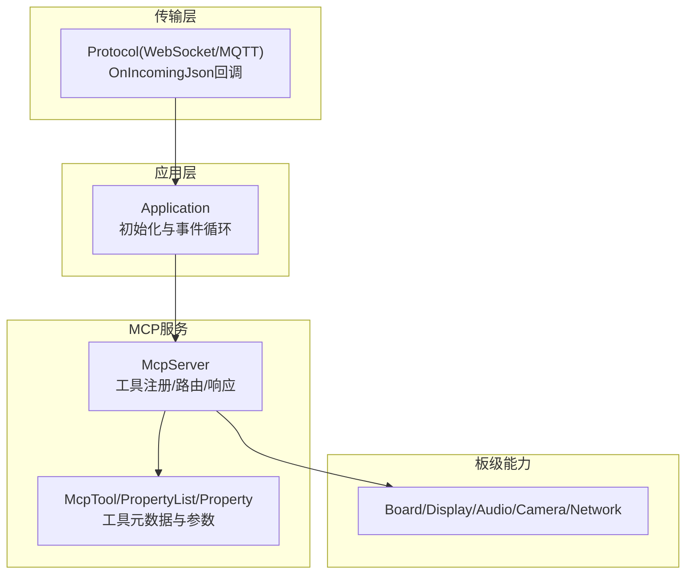
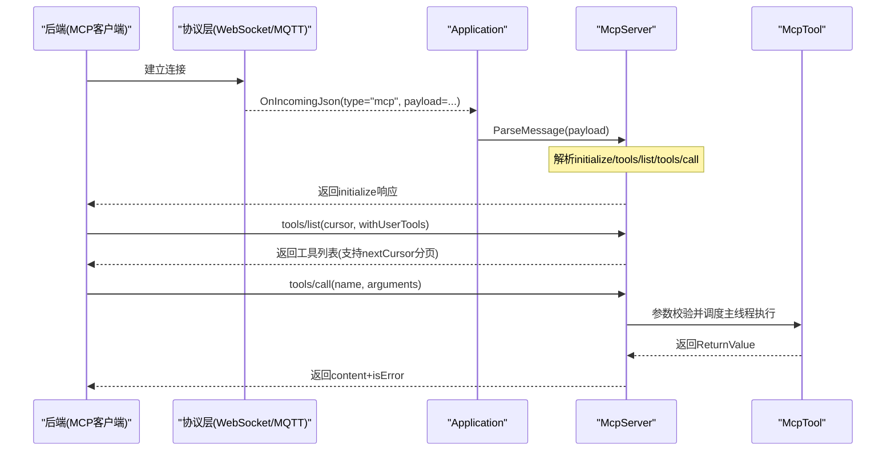
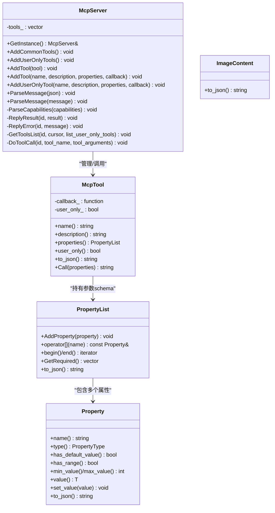
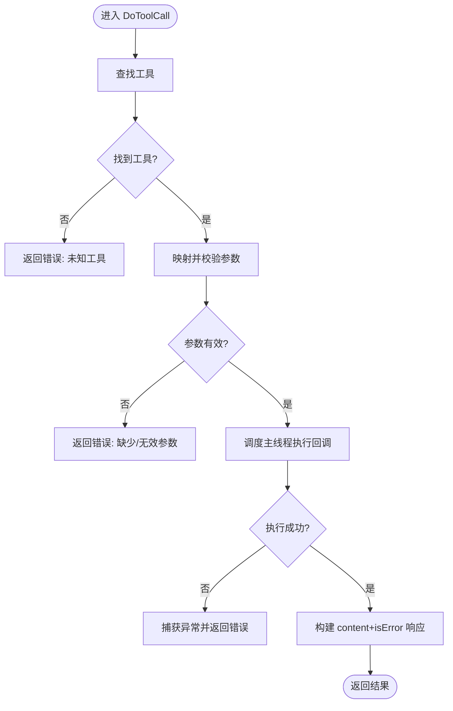
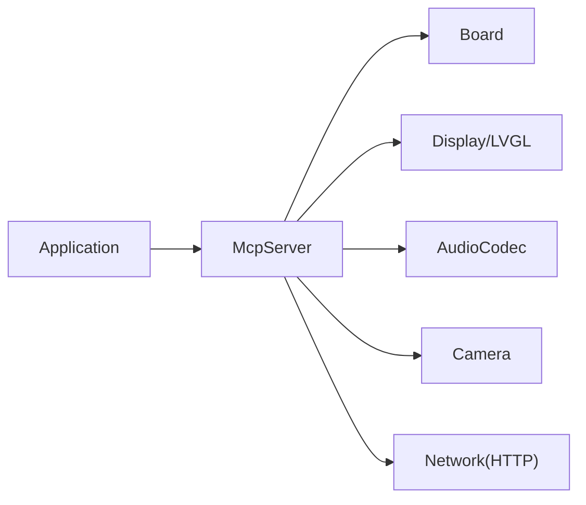
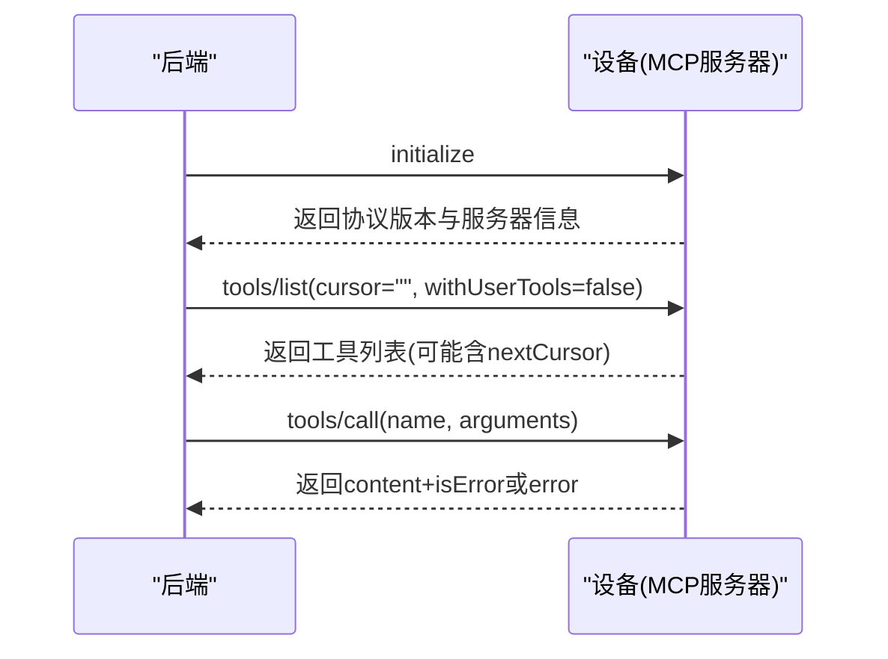

# MCP服务器

<cite>
**本文引用的文件**   
- [mcp_server.h](file://main/mcp_server.h)
- [mcp_server.cc](file://main/mcp_server.cc)
- [application.cc](file://main/application.cc)
- [mcp-protocol.md](file://docs/mcp-protocol.md)
- [mcp-usage.md](file://docs/mcp-usage.md)
- [press_to_talk_mcp_tool.cc](file://main/boards/common/press_to_talk_mcp_tool.cc)
- [lamp_controller.h](file://main/boards/common/lamp_controller.h)
- [led_control.cc](file://main/boards/df-k10/led_control.cc)
</cite>

## 目录
1. [简介](#简介)
2. [项目结构](#项目结构)
3. [核心组件](#核心组件)
4. [架构总览](#架构总览)
5. [详细组件分析](#详细组件分析)
6. [依赖关系分析](#依赖关系分析)
7. [性能与并发特性](#性能与并发特性)
8. [故障排查指南](#故障排查指南)
9. [结论](#结论)
10. [附录：MCP调用流程与工具注册示例](#附录mcp调用流程与工具注册示例)

## 简介
本文件面向开发者，系统性阐述设备端 MCP（Model Context Protocol）服务器的实现与使用。重点包括：
- McpServer 类的架构设计：工具注册机制、请求路由、异步执行框架
- Model Context Protocol 规范在本项目的落地：工具定义、参数校验、结果返回格式
- 内置工具的集成：按键触发、设备控制、信息查询等
- 动态工具加载机制：插件式架构、运行时注册、热更新支持
- 错误处理策略：超时控制、异常捕获、降级处理
- 自定义工具开发指南：接口定义、权限控制、安全考虑
- MCP 调用流程图与工具注册示例，帮助快速集成新的设备控制功能

## 项目结构
MCP 服务器位于 main 目录下，核心头文件与实现文件为 mcp_server.h 与 mcp_server.cc；协议交互入口在 application.cc 中通过 JSON 分发到 MCP 解析器；文档说明见 docs/mcp-protocol.md 与 docs/mcp-usage.md；部分板级或通用模块提供了示例工具注册，如 press_to_talk_mcp_tool.cc、lamp_controller.h、led_control.cc。

图表来源
- [application.cc:565-569](file://main/application.cc#L565-L569)
- [mcp_server.h:314-342](file://main/mcp_server.h#L314-L342)
- [mcp_server.cc:350-433](file://main/mcp_server.cc#L350-L433)

章节来源
- [application.cc:96-100](file://main/application.cc#L96-L100)
- [mcp_server.h:1-345](file://main/mcp_server.h#L1-L345)
- [mcp_server.cc:1-561](file://main/mcp_server.cc#L1-L561)
- [mcp-protocol.md:1-271](file://docs/mcp-protocol.md#L1-L271)
- [mcp-usage.md:1-186](file://docs/mcp-usage.md#L1-L186)

## 核心组件
- McpServer：单例服务，负责工具注册、JSON-RPC 方法分发、分页列出工具、调用工具并返回结果。
- McpTool：工具对象，封装名称、描述、输入 schema、回调函数以及“仅用户可见”标记。
- Property / PropertyList：参数类型与列表，支持布尔、整数、字符串，提供默认值与范围约束，生成 JSON Schema。
- ImageContent：图片内容封装，用于以 Base64 形式返回图像数据。
- ReturnValue：统一返回值变体，支持 bool/int/string/cJSON*/ImageContent*。

章节来源
- [mcp_server.h:50-56](file://main/mcp_server.h#L50-L56)
- [mcp_server.h:58-156](file://main/mcp_server.h#L58-L156)
- [mcp_server.h:158-206](file://main/mcp_server.h#L158-L206)
- [mcp_server.h:208-312](file://main/mcp_server.h#L208-L312)
- [mcp_server.h:314-342](file://main/mcp_server.h#L314-L342)

## 架构总览
MCP 基于 JSON-RPC 2.0，消息被封装在传输层的 type="mcp" 载荷中。设备启动后，Application 初始化时注册常用工具与仅用户工具；网络就绪后，后端发送 initialize 建立会话，随后 tools/list 发现工具，tools/call 调用具体工具。

图表来源
- [mcp-protocol.md:37-100](file://docs/mcp-protocol.md#L37-L100)
- [mcp-protocol.md:102-189](file://docs/mcp-protocol.md#L102-L189)
- [application.cc:565-569](file://main/application.cc#L565-L569)
- [mcp_server.cc:350-433](file://main/mcp_server.cc#L350-L433)
- [mcp_server.cc:508-560](file://main/mcp_server.cc#L508-L560)

## 详细组件分析

### McpServer 类与请求路由
- 单例模式：GetInstance() 提供全局访问点。
- 工具注册：AddCommonTools() 与 AddUserOnlyTools() 分别注册常规工具与仅用户工具；AddTool()/AddUserOnlyTool() 支持运行时新增。
- 消息解析：ParseMessage(cJSON*) 与 ParseMessage(string) 负责 JSON-RPC 版本检查、method 分发、params 校验。
- 工具列表：GetToolsList(id, cursor, list_user_only_tools) 支持分页 nextCursor 与过滤 user-only 工具。
- 工具调用：DoToolCall(id, tool_name, tool_arguments) 完成参数映射、必填校验、异常捕获，并通过 Application::Schedule 在主线程执行回调。
- 响应封装：ReplyResult/ReplyError 构造标准 JSON-RPC 响应并通过 Application::SendMcpMessage 发送。

图表来源
- [mcp_server.h:314-342](file://main/mcp_server.h#L314-L342)
- [mcp_server.h:208-312](file://main/mcp_server.h#L208-L312)
- [mcp_server.h:158-206](file://main/mcp_server.h#L158-L206)
- [mcp_server.h:58-156](file://main/mcp_server.h#L58-L156)
- [mcp_server.h:16-47](file://main/mcp_server.h#L16-L47)

章节来源
- [mcp_server.h:314-342](file://main/mcp_server.h#L314-L342)
- [mcp_server.cc:33-126](file://main/mcp_server.cc#L33-L126)
- [mcp_server.cc:128-298](file://main/mcp_server.cc#L128-L298)
- [mcp_server.cc:300-319](file://main/mcp_server.cc#L300-L319)
- [mcp_server.cc:350-433](file://main/mcp_server.cc#L350-L433)
- [mcp_server.cc:452-506](file://main/mcp_server.cc#L452-L506)
- [mcp_server.cc:508-560](file://main/mcp_server.cc#L508-L560)

### Model Context Protocol 规范实现
- 消息格式：遵循 JSON-RPC 2.0，外层包裹 type="mcp" 的传输载荷。
- 方法集：initialize、tools/list、tools/call；通知方法以 notifications/ 前缀约定。
- 工具定义：每个工具包含 name、description、inputSchema（由 PropertyList 生成），可选 annotations.audience=user 表示仅用户可见。
- 参数验证：按声明的类型进行匹配，缺失必填参数将返回错误；整数支持最小/最大值校验。
- 结果返回：成功时 result.content 为数组，元素类型为 text 或 image；isError=false；失败时 error.message 携带错误信息。

章节来源
- [mcp-protocol.md:7-36](file://docs/mcp-protocol.md#L7-L36)
- [mcp-protocol.md:102-189](file://docs/mcp-protocol.md#L102-L189)
- [mcp_server.h:232-270](file://main/mcp_server.h#L232-L270)
- [mcp_server.h:272-311](file://main/mcp_server.h#L272-L311)
- [mcp_server.cc:350-433](file://main/mcp_server.cc#L350-L433)
- [mcp_server.cc:508-560](file://main/mcp_server.cc#L508-L560)

### 内置工具集成
- 常规工具（AI可调用）：
  - self.get_device_status：返回设备状态（音频、屏幕、电池、网络等）。
  - self.audio_speaker.set_volume：设置音量（0-100）。
  - self.screen.set_brightness：设置亮度（0-100，需背光可用）。
  - self.screen.set_theme：切换主题（light/dark，LVGL启用时）。
  - self.camera.take_photo：拍照并根据问题解释图像（需要相机）。
- 仅用户工具（隐藏于默认列表，需 withUserTools=true）：
  - self.get_system_info：系统信息。
  - self.reboot：重启设备。
  - self.upgrade_firmware：从 URL 下载并安装固件后重启。
  - self.screen.get_info：屏幕宽高与是否单色。
  - self.screen.snapshot：截图上传至指定 URL（LVGL且开启快照配置）。
  - self.screen.preview_image：下载并预览图片。
  - self.assets.set_download_url：设置资源下载 URL。

章节来源
- [mcp_server.cc:33-126](file://main/mcp_server.cc#L33-L126)
- [mcp_server.cc:128-298](file://main/mcp_server.cc#L128-L298)
- [mcp-usage.md:96-125](file://docs/mcp-usage.md#L96-L125)

### 动态工具加载机制
- 插件式架构：通过 McpServer::AddTool/AddUserOnlyTool 在运行时注册新工具，无需修改核心代码。
- 常见注册位置：
  - 应用初始化阶段：Application::Initialize 中调用 AddCommonTools 与 AddUserOnlyTools。
  - 板级 InitializeTools：各板可在其初始化函数中追加特定工具（例如 press_to_talk_mcp_tool.cc、lamp_controller.h、led_control.cc）。
- 热更新支持：由于工具注册是运行期行为，可通过 OTA 升级后重新初始化工具列表，或在运行中按需添加新工具（注意内存与生命周期管理）。

章节来源
- [application.cc:96-100](file://main/application.cc#L96-L100)
- [press_to_talk_mcp_tool.cc:16](file://main/boards/common/press_to_talk_mcp_tool.cc#L16)
- [lamp_controller.h:28-38](file://main/boards/common/lamp_controller.h#L28-L38)
- [led_control.cc:26-32](file://main/boards/df-k10/led_control.cc#L26-L32)

### 错误处理策略
- 参数校验错误：缺少必填参数或类型不匹配时，立即返回错误消息。
- 未知工具与方法：返回“未知工具”或“未实现方法”的错误。
- 执行异常捕获：工具回调抛出 std::exception 时，捕获并返回错误消息。
- 分页限制：当工具列表超过最大负载大小时，返回 nextCursor 继续拉取；若无法加入下一个工具则返回错误。
- 超时控制：当前实现未在 MCP 层显式设置超时；建议在上层（后端）对 tools/call 设置合理超时，并在工具内部避免阻塞主线程。

图表来源
- [mcp_server.cc:508-560](file://main/mcp_server.cc#L508-L560)
- [mcp_server.cc:452-506](file://main/mcp_server.cc#L452-L506)

章节来源
- [mcp_server.cc:410-433](file://main/mcp_server.cc#L410-L433)
- [mcp_server.cc:508-560](file://main/mcp_server.cc#L508-L560)
- [mcp_server.cc:452-506](file://main/mcp_server.cc#L452-L506)

### 自定义工具开发指南
- 工具接口定义：
  - 使用 McpServer::AddTool 或 AddUserOnlyTool 注册。
  - 参数通过 PropertyList 与 Property 定义，支持布尔、整数、字符串，并可设置默认值与范围。
  - 回调函数签名：std::function<ReturnValue(const PropertyList&)>，返回值可为 bool/int/string/cJSON*/ImageContent*。
- 权限控制：
  - 普通工具：默认对 AI 可见。
  - 仅用户工具：通过 AddUserOnlyTool 注册，仅在 withUserTools=true 时出现在列表中，适合敏感操作（重启、升级、截图上传等）。
- 安全考虑：
  - 对用户工具进行严格校验与日志记录。
  - 避免在回调中直接阻塞主线程，必要时通过 Application::Schedule 异步执行。
  - 对外部 URL 或资源访问应做合法性校验与错误处理。
- 参考示例路径：
  - 无参工具：[press_to_talk_mcp_tool.cc:16](file://main/boards/common/press_to_talk_mcp_tool.cc#L16)
  - 带参工具（RGB灯）：[lamp_controller.h:28-38](file://main/boards/common/lamp_controller.h#L28-L38)
  - 亮度控制工具：[led_control.cc:26-32](file://main/boards/df-k10/led_control.cc#L26-L32)

章节来源
- [mcp-usage.md:18-46](file://docs/mcp-usage.md#L18-L46)
- [mcp-usage.md:48-94](file://docs/mcp-usage.md#L48-L94)
- [mcp_server.h:208-312](file://main/mcp_server.h#L208-L312)
- [press_to_talk_mcp_tool.cc:16](file://main/boards/common/press_to_talk_mcp_tool.cc#L16)
- [lamp_controller.h:28-38](file://main/boards/common/lamp_controller.h#L28-L38)
- [led_control.cc:26-32](file://main/boards/df-k10/led_control.cc#L26-L32)

## 依赖关系分析
- Application 作为主控，负责协议初始化与消息分发，将 type="mcp" 的消息交给 McpServer 解析。
- McpServer 依赖 Board、Display、Audio、Camera、Network 等板级能力以提供内置工具。
- 工具回调可能涉及网络 I/O（如截图上传、图片预览）、显示更新、音频控制等，需注意线程模型与资源占用。

图表来源
- [application.cc:565-569](file://main/application.cc#L565-L569)
- [mcp_server.cc:33-126](file://main/mcp_server.cc#L33-L126)
- [mcp_server.cc:128-298](file://main/mcp_server.cc#L128-L298)

章节来源
- [application.cc:565-569](file://main/application.cc#L565-L569)
- [mcp_server.cc:33-126](file://main/mcp_server.cc#L33-L126)
- [mcp_server.cc:128-298](file://main/mcp_server.cc#L128-L298)

## 性能与并发特性
- 工具列表优化：常用工具优先插入，利用 prompt cache 提升响应速度。
- 异步执行：工具回调通过 Application::Schedule 在主线程执行，避免阻塞接收线程。
- 分页限制：tools/list 单次响应大小受限，通过 nextCursor 分页获取，防止大包导致传输失败。
- 内存与资源：图片预览与截图上传涉及较大内存分配与网络 I/O，建议在低优先级任务中执行并妥善处理异常。

章节来源
- [mcp_server.cc:33-40](file://main/mcp_server.cc#L33-L40)
- [mcp_server.cc:452-506](file://main/mcp_server.cc#L452-L506)
- [mcp_server.cc:508-560](file://main/mcp_server.cc#L508-L560)

## 故障排查指南
- 常见问题定位：
  - 解析失败：检查 JSON-RPC 版本与 method 字段是否正确。
  - 参数错误：确认 arguments 中的键名与类型与工具定义一致。
  - 未知工具：核对工具名称是否已注册且未被过滤（withUserTools）。
  - 执行异常：查看 ESP_LOGE 输出，定位工具回调抛出的异常信息。
- 日志与调试：
  - 关注 TAG="MCP" 的日志输出，便于快速定位问题。
  - 对于网络相关工具（截图上传、图片预览），检查 HTTP 状态码与返回体。

章节来源
- [mcp_server.cc:350-433](file://main/mcp_server.cc#L350-L433)
- [mcp_server.cc:508-560](file://main/mcp_server.cc#L508-L560)

## 结论
MCP 服务器通过清晰的工具注册与 JSON-RPC 路由机制，实现了设备能力的标准化暴露与调用。结合仅用户工具与参数校验，既保证了灵活性又兼顾了安全性。通过 Application 的异步调度与分页策略，系统在资源受限环境下仍能保持良好性能。开发者可依据本文档快速扩展新工具，满足多样化的设备控制需求。

## 附录：MCP调用流程与工具注册示例

### MCP 调用流程图

图表来源
- [mcp-protocol.md:37-100](file://docs/mcp-protocol.md#L37-L100)
- [mcp-protocol.md:102-189](file://docs/mcp-protocol.md#L102-L189)
- [application.cc:565-569](file://main/application.cc#L565-L569)
- [mcp_server.cc:350-433](file://main/mcp_server.cc#L350-L433)

### 工具注册示例（路径引用）
- 无参工具（按键触发）：[press_to_talk_mcp_tool.cc:16](file://main/boards/common/press_to_talk_mcp_tool.cc#L16)
- 带参工具（RGB灯控制）：[lamp_controller.h:28-38](file://main/boards/common/lamp_controller.h#L28-L38)
- 亮度控制工具：[led_control.cc:26-32](file://main/boards/df-k10/led_control.cc#L26-L32)
- 内置工具（音量/亮度/主题/拍照）：[mcp_server.cc:33-126](file://main/mcp_server.cc#L33-L126)
- 仅用户工具（重启/升级/截图/预览/资产URL）：[mcp_server.cc:128-298](file://main/mcp_server.cc#L128-L298)

章节来源
- [mcp-usage.md:48-94](file://docs/mcp-usage.md#L48-L94)
- [mcp_server.cc:33-126](file://main/mcp_server.cc#L33-L126)
- [mcp_server.cc:128-298](file://main/mcp_server.cc#L128-L298)
- [press_to_talk_mcp_tool.cc:16](file://main/boards/common/press_to_talk_mcp_tool.cc#L16)
- [lamp_controller.h:28-38](file://main/boards/common/lamp_controller.h#L28-L38)
- [led_control.cc:26-32](file://main/boards/df-k10/led_control.cc#L26-L32)