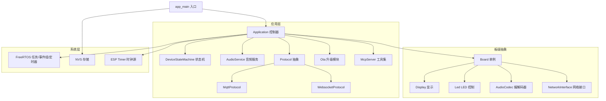
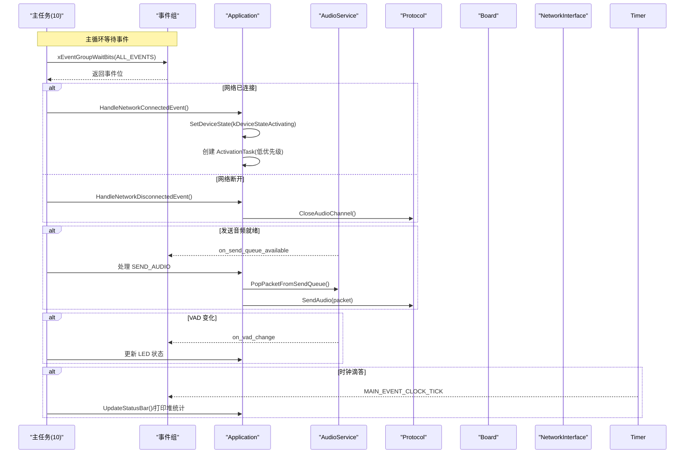
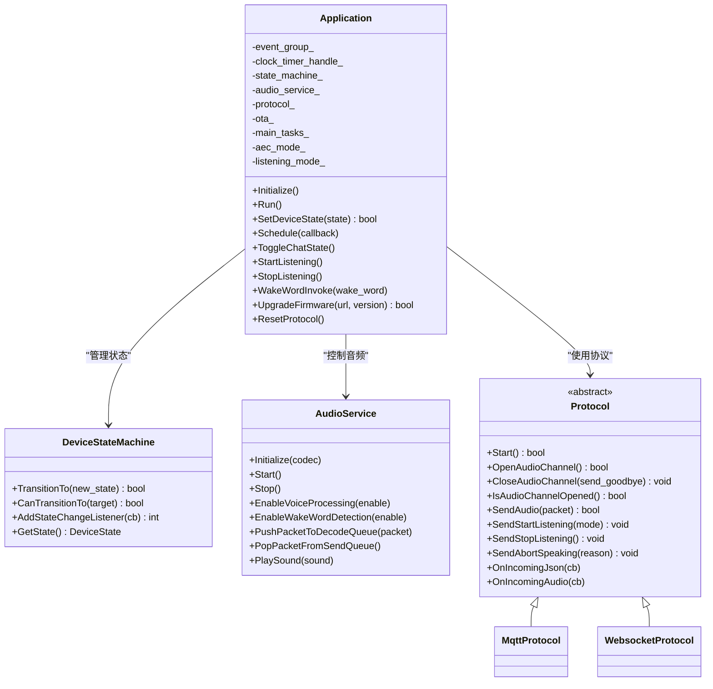
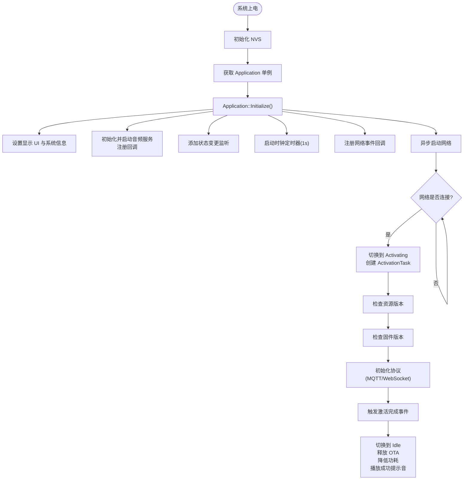
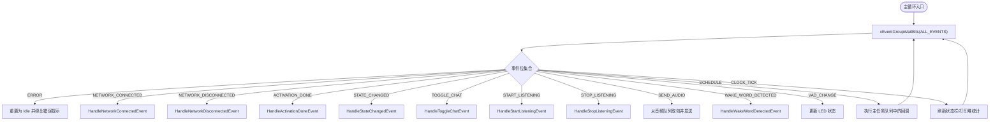
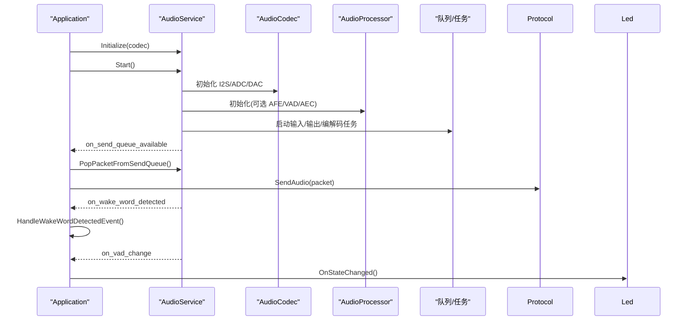
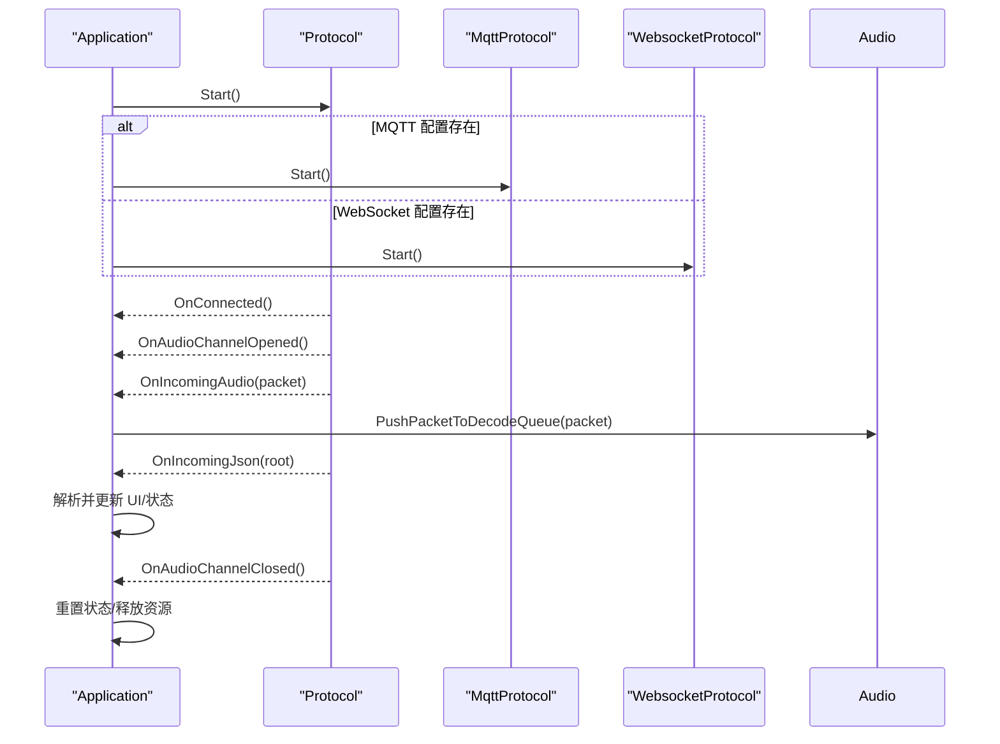
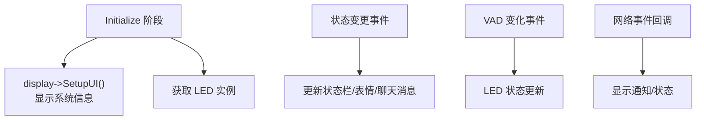
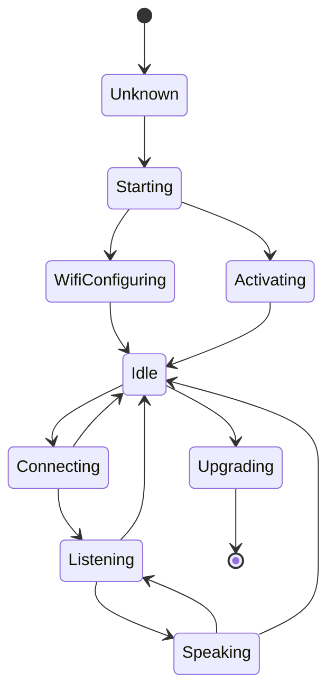
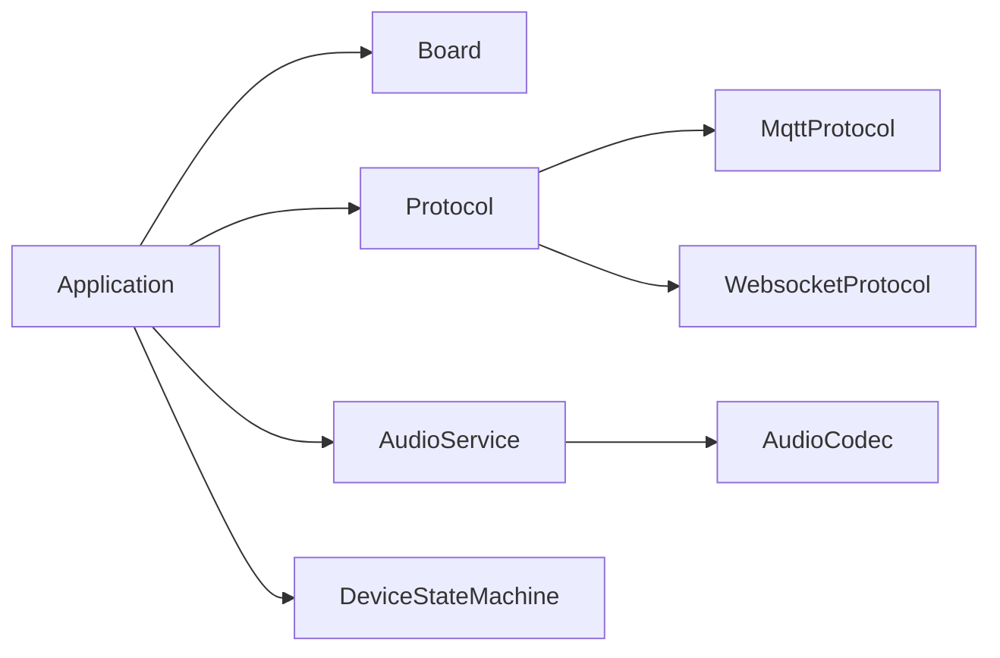

# 应用控制器

<cite>
**本文引用的文件**   
- [main.cc](file://main/main.cc)
- [application.h](file://main/application.h)
- [application.cc](file://main/application.cc)
- [device_state.h](file://main/device_state.h)
- [device_state_machine.h](file://main/device_state_machine.h)
- [device_state_machine.cc](file://main/device_state_machine.cc)
- [audio_service.h](file://main/audio/audio_service.h)
- [audio_service.cc](file://main/audio/audio_service.cc)
- [protocol.h](file://main/protocols/protocol.h)
- [mqtt_protocol.h](file://main/protocols/mqtt_protocol.h)
- [websocket_protocol.cc](file://main/protocols/websocket_protocol.cc)
- [board.h](file://main/boards/common/board.h)
- [esp_box3_board.cc](file://main/boards/esp-box-3/esp_box3_board.cc)
- [atk_dnesp32s3_box3.cc](file://main/boards/atk-dnesp32s3-box3/atk_dnesp32s3_box3.cc)
- [system_info.cc](file://main/system_info.cc)
</cite>

## 目录
1. [简介](#简介)
2. [项目结构](#项目结构)
3. [核心组件](#核心组件)
4. [架构总览](#架构总览)
5. [详细组件分析](#详细组件分析)
6. [依赖关系分析](#依赖关系分析)
7. [性能与资源管理](#性能与资源管理)
8. [故障排查指南](#故障排查指南)
9. [结论](#结论)
10. [附录](#附录)

## 简介
本技术文档聚焦于应用控制器 Application 的架构设计与实现，围绕其作为系统核心控制器的职责展开：初始化流程、任务调度、事件循环管理；应用的启动序列（硬件初始化、网络配置、服务启动）及其依赖关系；事件驱动架构的实现（事件队列、任务优先级、资源分配策略）；各子系统（音频、通信、显示、LED）的生命周期管理与异常恢复机制；以及应用配置选项、调试接口与性能监控方法。文末提供系统架构图与初始化流程图，帮助开发者建立完整的系统控制视角。

## 项目结构
本项目采用分层与模块化组织方式：
- main 层：应用入口、应用控制器、状态机、协议抽象、音频服务、系统信息、OTA 等
- boards 层：板级抽象与具体板卡实现（如 ESP-BOX3、ATK-DNESP32S3-BOX3），负责硬件初始化、外设绑定、网络与电源策略
- protocols 层：协议抽象与具体实现（MQTT、WebSocket）
- audio 层：音频采集/播放、编解码、唤醒词、VAD/AEC 处理
- display/led 等：显示与 LED 子系统

图表来源
- [main.cc:14-29](file://main/main.cc#L14-L29)
- [application.h:43-176](file://main/application.h#L43-L176)
- [board.h:49-92](file://main/boards/common/board.h#L49-L92)

章节来源
- [main.cc:14-29](file://main/main.cc#L14-L29)
- [application.h:43-176](file://main/application.h#L43-L176)
- [board.h:49-92](file://main/boards/common/board.h#L49-L92)

## 核心组件
- Application 控制器：单例模式，持有事件组、主任务调度队列、设备状态机、音频服务、协议实例、OTA 对象等；负责初始化、事件分发、生命周期协调。
- DeviceStateMachine：严格的状态转换规则与观察者回调，确保状态迁移合法性。
- AudioService：多任务音频管线（输入/输出/编解码）、唤醒词检测、VAD/AEC、声音提示、队列缓冲与功耗管理。
- Protocol 抽象及实现：统一音频通道与 JSON 消息收发，支持 MQTT 与 WebSocket 两种后端。
- Board 抽象：屏蔽不同板卡的硬件差异，提供 Display/Led/AudioCodec/NetworkInterface 的统一访问点。

章节来源
- [application.h:43-176](file://main/application.h#L43-L176)
- [device_state_machine.h:17-83](file://main/device_state_machine.h#L17-L83)
- [audio_service.h:105-195](file://main/audio/audio_service.h#L105-195)
- [protocol.h:44-99](file://main/protocols/protocol.h#L44-L99)
- [board.h:49-92](file://main/boards/common/board.h#L49-L92)

## 架构总览
Application 通过 FreeRTOS 事件组驱动主循环，将来自音频、网络、定时器等的事件汇聚到单一线程中处理，保证 UI 更新与状态切换的一致性。同时通过 Schedule 机制将跨线程回调安全地投递到主任务执行。

图表来源
- [application.cc:165-259](file://main/application.cc#L165-L259)
- [application.cc:261-297](file://main/application.cc#L261-L297)
- [audio_service.cc:128-160](file://main/audio/audio_service.cc#L128-L160)

## 详细组件分析

### Application 类架构设计
- 单例与构造/析构：在构造时创建事件组与周期性时钟定时器；析构时清理定时器与事件组。
- Initialize：设置显示 UI、初始化并启动音频服务、注册音频回调（发送队列可用、唤醒词检测、VAD 变化）、注册状态变更监听、启动时钟定时器、注册网络事件回调、异步启动网络。
- Run：主事件循环，按事件位分发处理：错误、网络连接/断开、激活完成、状态变更、聊天切换、开始/停止监听、音频发送、唤醒词检测、VAD 变化、主任务调度、时钟滴答。
- 调度与线程安全：Schedule 使用互斥锁保护的任务队列，并通过事件组通知主任务执行，避免跨线程直接调用。
- 激活流程：ActivationTask 检查资源版本、固件版本、初始化协议，完成后触发激活完成事件。
- 协议初始化：根据配置选择 MQTT 或 WebSocket，注册连接、错误、音频通道打开/关闭、JSON 消息等回调。
- 状态机集成：所有状态变更通过 DeviceStateMachine 进行，并在状态变更后同步更新 UI、音频处理开关、LED 行为等。

图表来源
- [application.h:43-176](file://main/application.h#L43-L176)
- [device_state_machine.h:17-83](file://main/device_state_machine.h#L17-L83)
- [audio_service.h:105-195](file://main/audio/audio_service.h#L105-195)
- [protocol.h:44-99](file://main/protocols/protocol.h#L44-L99)
- [mqtt_protocol.h:26-52](file://main/protocols/mqtt_protocol.h#L26-L52)
- [websocket_protocol.cc:44-82](file://main/protocols/websocket_protocol.cc#L44-L82)

章节来源
- [application.cc:61-163](file://main/application.cc#L61-L163)
- [application.cc:165-259](file://main/application.cc#L165-L259)
- [application.cc:323-338](file://main/application.cc#L323-L338)
- [application.cc:473-610](file://main/application.cc#L473-L610)
- [application.cc:934-940](file://main/application.cc#L934-L940)

### 启动序列与依赖关系
- app_main：初始化 NVS，获取 Application 单例，调用 Initialize 后进入 Run 永不返回。
- Initialize：
  - 设置显示 UI 与系统信息
  - 初始化并启动音频服务，注册回调
  - 添加状态变更监听
  - 启动时钟定时器（每秒触发一次）
  - 注册网络事件回调（扫描/连接/连接成功/断开/蜂窝模组事件）
  - 异步启动网络
- 网络连接后：
  - 若处于 Starting/WifiConfiguring，则切换到 Activating 并创建 ActivationTask
  - 立即刷新状态栏
- ActivationTask：
  - 检查资源版本（Assets）
  - 检查固件版本（OTA）
  - 初始化协议（MQTT/WebSocket）
  - 触发激活完成事件
- 激活完成：
  - 切换到 Idle
  - 释放 OTA 对象
  - 降低功耗等级
  - 播放成功提示音

图表来源
- [main.cc:14-29](file://main/main.cc#L14-L29)
- [application.cc:61-163](file://main/application.cc#L61-L163)
- [application.cc:261-284](file://main/application.cc#L261-L284)
- [application.cc:323-338](file://main/application.cc#L323-L338)
- [application.cc:340-396](file://main/application.cc#L340-L396)
- [application.cc:398-471](file://main/application.cc#L398-L471)
- [application.cc:473-610](file://main/application.cc#L473-L610)
- [application.cc:299-321](file://main/application.cc#L299-L321)

章节来源
- [main.cc:14-29](file://main/main.cc#L14-L29)
- [application.cc:61-163](file://main/application.cc#L61-L163)
- [application.cc:261-284](file://main/application.cc#L261-L284)
- [application.cc:299-321](file://main/application.cc#L299-L321)
- [application.cc:323-338](file://main/application.cc#L323-L338)
- [application.cc:340-396](file://main/application.cc#L340-L396)
- [application.cc:398-471](file://main/application.cc#L398-L471)
- [application.cc:473-610](file://main/application.cc#L473-L610)

### 事件驱动架构与任务调度
- 事件组：定义 MAIN_EVENT_* 位标志，涵盖调度、音频发送、唤醒词、VAD、错误、激活完成、时钟、网络连接/断开、聊天切换、开始/停止监听、状态变更等。
- 主任务优先级：设置为 10，确保对 UI 与状态切换的高响应性。
- 事件分发：主循环等待 ALL_EVENTS，按位逐一处理对应处理器。
- 跨线程调度：Schedule 将回调加入队列并通过事件通知主任务执行，避免竞态条件。
- 时钟滴答：每 1 秒触发，刷新状态栏，每 10 秒打印堆统计用于调试。

图表来源
- [application.h:22-35](file://main/application.h#L22-L35)
- [application.cc:165-259](file://main/application.cc#L165-L259)
- [application.cc:934-940](file://main/application.cc#L934-L940)

章节来源
- [application.h:22-35](file://main/application.h#L22-L35)
- [application.cc:165-259](file://main/application.cc#L165-L259)
- [application.cc:934-940](file://main/application.cc#L934-L940)

### 音频子系统生命周期管理
- 初始化与启动：Initialize 接收 AudioCodec 指针，Start 启动输入/输出/编解码任务，并开启音频功率管理定时器。
- 任务模型：
  - 输入任务：采集 PCM，可选 AFE 唤醒词/VAD/AEC 处理，入编码队列
  - 输出任务：从播放队列取 PCM 输出至 DAC
  - 编解码任务：Opus 编码/解码，维护解码/发送队列
- 回调机制：on_send_queue_available 通知主任务发送音频；on_wake_word_detected 触发唤醒词处理；on_vad_change 触发 LED 状态更新。
- 唤醒词与语音处理：
  - 空闲态启用唤醒词检测
  - 监听态可启用语音处理（根据 AEC 模式决定自动停止或实时模式）
  - 说话态根据模式决定是否禁用语音处理
- 异常恢复：网络断开时关闭音频通道；升级失败时重启音频服务并继续运行；重置协议时关闭通道并释放协议对象。

图表来源
- [audio_service.h:105-195](file://main/audio/audio_service.h#L105-195)
- [audio_service.cc:128-160](file://main/audio/audio_service.cc#L128-L160)
- [application.cc:76-86](file://main/application.cc#L76-L86)
- [application.cc:220-237](file://main/application.cc#L220-L237)

章节来源
- [audio_service.h:105-195](file://main/audio/audio_service.h#L105-195)
- [audio_service.cc:128-160](file://main/audio/audio_service.cc#L128-L160)
- [application.cc:76-86](file://main/application.cc#L76-L86)
- [application.cc:220-237](file://main/application.cc#L220-L237)

### 通信子系统（协议）生命周期管理
- 协议抽象：统一 Open/Close/Send/回调接口，支持多种二进制/文本协议版本。
- MQTT 实现：基于 MQTT+UDP 传输音频，包含心跳、重连、AES 加密等特性。
- WebSocket 实现：基于 WebSocket 传输文本/二进制数据，支持多版本协议头。
- 生命周期：
  - 激活阶段根据配置选择协议并 Start
  - 音频通道打开/关闭回调用于调整功耗与 UI
  - 网络错误回调触发主循环错误处理
  - JSON 消息解析处理 TTS/STT/LLM/MCP/System/Alert 等类型

图表来源
- [protocol.h:44-99](file://main/protocols/protocol.h#L44-L99)
- [mqtt_protocol.h:26-52](file://main/protocols/mqtt_protocol.h#L26-L52)
- [websocket_protocol.cc:44-82](file://main/protocols/websocket_protocol.cc#L44-L82)
- [application.cc:473-610](file://main/application.cc#L473-L610)

章节来源
- [protocol.h:44-99](file://main/protocols/protocol.h#L44-L99)
- [mqtt_protocol.h:26-52](file://main/protocols/mqtt_protocol.h#L26-L52)
- [websocket_protocol.cc:44-82](file://main/protocols/websocket_protocol.cc#L44-L82)
- [application.cc:473-610](file://main/application.cc#L473-L610)

### 显示与 LED 子系统生命周期管理
- 显示：
  - 初始化阶段设置 UI、显示系统信息与版本号
  - 状态变更时更新状态栏、表情、聊天消息
  - 网络事件时显示通知或状态
- LED：
  - 监听 VAD 变化与状态变更，动态更新 LED 指示
- 板级实现：
  - ESP-BOX3 与 ATK-DNESP32S3-BOX3 示例展示了如何初始化 I2C/SPI、按钮、显示、摄像头等，并提供统一的 Board 接口供 Application 调用

图表来源
- [application.cc:61-163](file://main/application.cc#L61-L163)
- [application.cc:860-932](file://main/application.cc#L860-L932)
- [esp_box3_board.cc:37-76](file://main/boards/esp-box-3/esp_box3_board.cc#L37-L76)
- [atk_dnesp32s3_box3.cc:408-447](file://main/boards/atk-dnesp32s3-box3/atk_dnesp32s3_box3.cc#L408-L447)

章节来源
- [application.cc:61-163](file://main/application.cc#L61-L163)
- [application.cc:860-932](file://main/application.cc#L860-L932)
- [esp_box3_board.cc:37-76](file://main/boards/esp-box-3/esp_box3_board.cc#L37-L76)
- [atk_dnesp32s3_box3.cc:408-447](file://main/boards/atk-dnesp32s3-box3/atk_dnesp32s3_box3.cc#L408-L447)

### 设备状态机与状态转换
- 状态枚举：未知、启动、配网、空闲、连接中、监听、说话、升级、激活、音频测试、致命错误。
- 转换规则：严格限制合法转换路径，非法转换将被拒绝并记录日志。
- 观察者模式：状态变更时通知所有监听者，Application 据此更新 UI、音频处理、LED 等。

图表来源
- [device_state.h:4-16](file://main/device_state.h#L4-16)
- [device_state_machine.cc:34-102](file://main/device_state_machine.cc#L34-L102)

章节来源
- [device_state.h:4-16](file://main/device_state.h#L4-16)
- [device_state_machine.cc:34-102](file://main/device_state_machine.cc#L34-L102)
- [application.cc:860-932](file://main/application.cc#L860-L932)

## 依赖关系分析
- Application 依赖 Board 以获取硬件能力（Display/Led/AudioCodec/NetworkInterface）。
- Application 通过 Protocol 抽象与具体实现（MQTT/WebSocket）交互，解耦网络传输细节。
- AudioService 依赖 AudioCodec 与可选 AudioProcessor，内部维护多个任务与队列。
- DeviceStateMachine 独立于硬件，仅关注状态转换逻辑与回调。

图表来源
- [application.h:43-176](file://main/application.h#L43-L176)
- [board.h:49-92](file://main/boards/common/board.h#L49-L92)
- [protocol.h:44-99](file://main/protocols/protocol.h#L44-L99)
- [mqtt_protocol.h:26-52](file://main/protocols/mqtt_protocol.h#L26-L52)
- [websocket_protocol.cc:44-82](file://main/protocols/websocket_protocol.cc#L44-L82)
- [audio_service.h:105-195](file://main/audio/audio_service.h#L105-195)

章节来源
- [application.h:43-176](file://main/application.h#L43-L176)
- [board.h:49-92](file://main/boards/common/board.h#L49-L92)
- [protocol.h:44-99](file://main/protocols/protocol.h#L44-L99)
- [mqtt_protocol.h:26-52](file://main/protocols/mqtt_protocol.h#L26-L52)
- [websocket_protocol.cc:44-82](file://main/protocols/websocket_protocol.cc#L44-L82)
- [audio_service.h:105-195](file://main/audio/audio_service.h#L105-195)

## 性能与资源管理
- 任务优先级：主任务优先级设为 10，确保 UI 与状态切换及时响应。
- 音频任务优先级：输入任务优先级较高（8），输出与编解码任务较低（4），平衡延迟与 CPU 占用。
- 功耗管理：
  - 激活阶段与升级阶段提升性能等级
  - 空闲与待机阶段降低功耗等级
  - 音频模块具备自动休眠与唤醒机制（定时器检测活动）
- 内存与堆统计：每 10 秒打印堆统计，便于定位内存泄漏与碎片化问题。
- 资源释放：激活完成后释放 OTA 对象；升级失败时重启音频服务并恢复功耗等级；重置协议时关闭通道并释放协议对象。

章节来源
- [application.cc:165-167](file://main/application.cc#L165-L167)
- [audio_service.cc:128-160](file://main/audio/audio_service.cc#L128-L160)
- [application.cc:299-321](file://main/application.cc#L299-L321)
- [application.cc:972-1022](file://main/application.cc#L972-L1022)
- [system_info.cc:84-119](file://main/system_info.cc#L84-L119)

## 故障排查指南
- 网络错误：
  - 协议层 OnNetworkError 回调设置错误消息并触发 MAIN_EVENT_ERROR
  - 主循环收到错误事件后重置为 Idle 并弹出错误提示
- 音频异常：
  - 升级失败时重启音频服务并继续运行
  - 网络断开时关闭音频通道，防止资源泄露
- 状态异常：
  - 非法状态转换会被拒绝并记录警告日志
  - 可通过状态名映射辅助定位当前状态
- 调试接口：
  - 每 10 秒打印堆统计
  - 支持 MCP 工具扩展与自定义消息处理（受编译选项控制）

章节来源
- [application.cc:187-190](file://main/application.cc#L187-L190)
- [application.cc:286-297](file://main/application.cc#L286-L297)
- [application.cc:972-1022](file://main/application.cc#L972-L1022)
- [device_state_machine.cc:117-121](file://main/device_state_machine.cc#L117-L121)
- [application.cc:253-256](file://main/application.cc#L253-L256)

## 结论
Application 控制器通过清晰的分层与事件驱动架构，实现了硬件初始化、网络配置、服务启动的有序依赖；借助严格的设备状态机与跨线程调度机制，保证了 UI、音频、通信等多子系统的协同工作；结合功耗管理与调试接口，提供了良好的性能与可维护性。开发者可基于此架构快速扩展功能、适配新板卡与协议，并确保系统稳定可靠。

## 附录
- 配置选项（部分）：
  - AEC 模式：kAecOff/kAecOnDeviceSide/kAecOnServerSide，影响默认监听模式与语音处理开关
  - 唤醒词检测：可在监听态启用（取决于 AFE 支持）
  - 自定义消息：受 CONFIG_RECEIVE_CUSTOM_MESSAGE 控制
- 调试方法：
  - 查看串口日志（ESP_LOGI/ESP_LOGW/ESP_LOGE）
  - 每 10 秒堆统计输出
  - 通过 MCP 工具扩展进行运行时控制与诊断

章节来源
- [application.h:37-41](file://main/application.h#L37-41)
- [application.cc:900-906](file://main/application.cc#L900-L906)
- [application.cc:592-603](file://main/application.cc#L592-L603)
- [application.cc:253-256](file://main/application.cc#L253-L256)