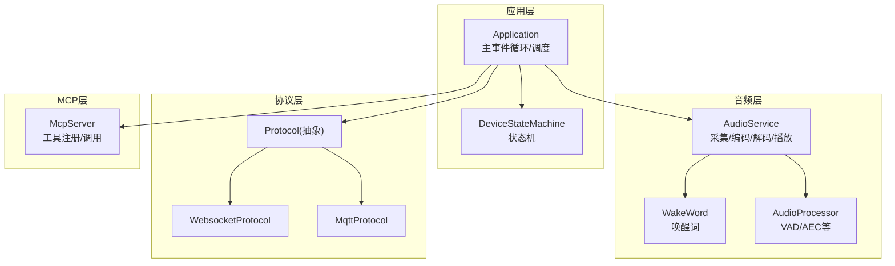
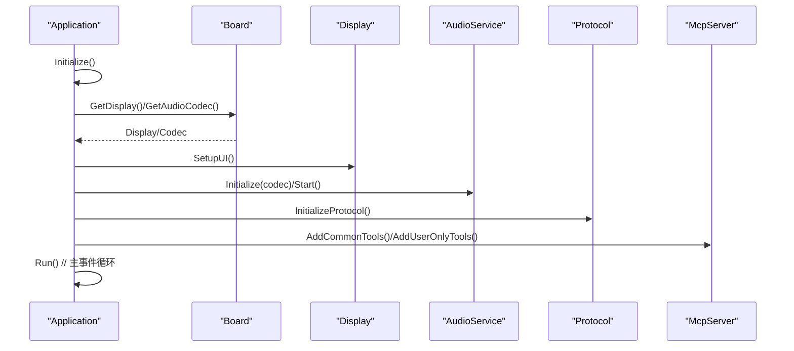
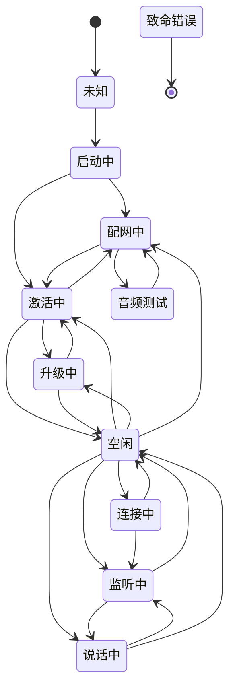
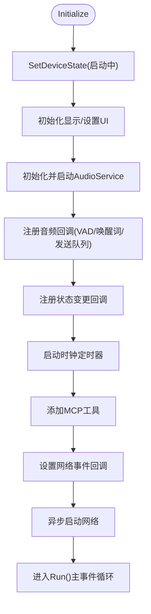
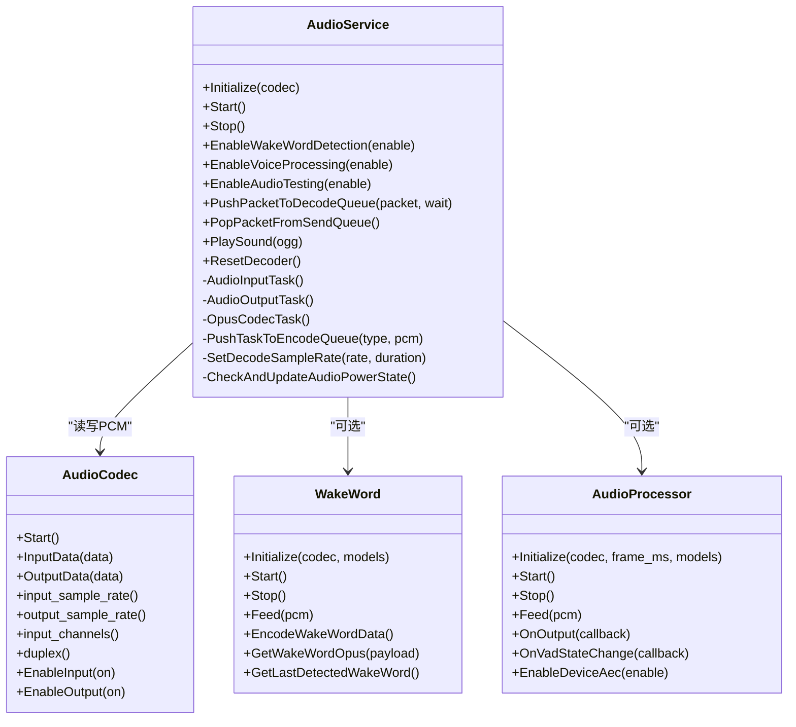
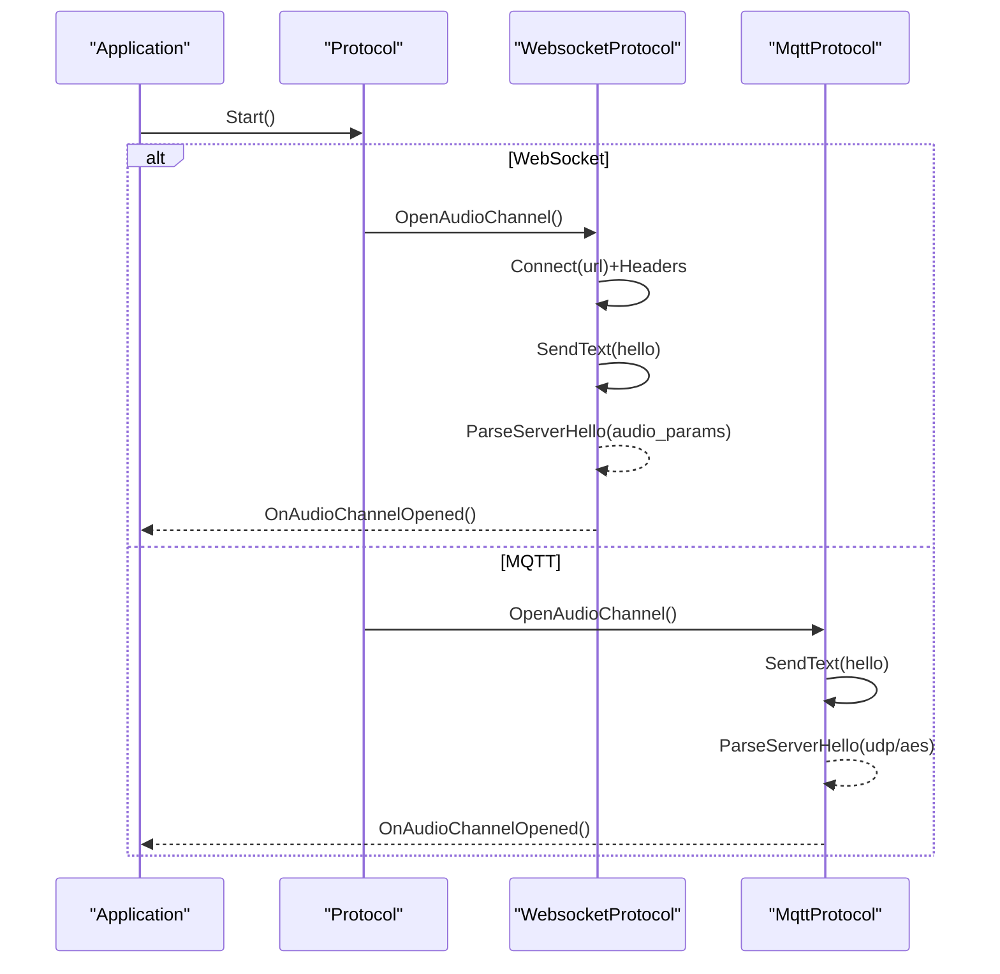
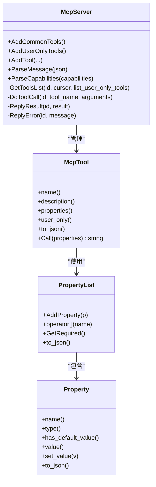
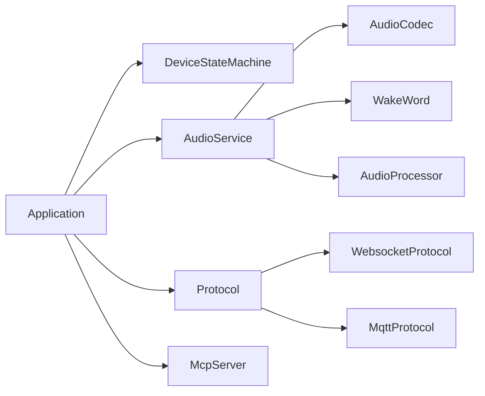

# 核心组件设计

<cite>
**本文引用的文件列表**
- [application.h](file://main/application.h)
- [application.cc](file://main/application.cc)
- [device_state.h](file://main/device_state.h)
- [device_state_machine.h](file://main/device_state_machine.h)
- [device_state_machine.cc](file://main/device_state_machine.cc)
- [audio_service.h](file://main/audio/audio_service.h)
- [audio_service.cc](file://main/audio/audio_service.cc)
- [protocol.h](file://main/protocols/protocol.h)
- [websocket_protocol.h](file://main/protocols/websocket_protocol.h)
- [websocket_protocol.cc](file://main/protocols/websocket_protocol.cc)
- [mqtt_protocol.h](file://main/protocols/mqtt_protocol.h)
- [mqtt_protocol.cc](file://main/protocols/mqtt_protocol.cc)
- [mcp_server.h](file://main/mcp_server.h)
- [mcp_server.cc](file://main/mcp_server.cc)
</cite>

## 目录
1. [引言](#引言)
2. [项目结构](#项目结构)
3. [核心组件](#核心组件)
4. [架构总览](#架构总览)
5. [详细组件分析](#详细组件分析)
6. [依赖关系分析](#依赖关系分析)
7. [性能考量](#性能考量)
8. [故障排查指南](#故障排查指南)
9. [结论](#结论)

## 引言
本设计文档聚焦小智AI聊天机器人核心组件，围绕以下目标展开：
- 设备状态机 DeviceStateMachine 的设计原理、状态定义、转换规则与事件处理机制
- Application 系统控制器的职责：初始化流程、事件循环、任务调度
- AudioService 音频服务架构：采集、编码、解码、播放、唤醒词与VAD联动
- Protocol 通信协议抽象设计与 WebSocket/MQTT 两种实现
- McpServer MCP 服务器实现：工具注册、参数校验、调用执行与结果回传
- 生命周期管理、资源分配策略与错误处理机制
- 提供组件关系图与状态转换图，帮助开发者深入理解并扩展

## 项目结构
核心代码位于 main 目录下，按功能分层组织：
- 应用控制器：Application（主事件循环、状态机协调、网络/音频/显示联动）
- 设备状态机：DeviceStateMachine + DeviceState 枚举
- 音频服务：AudioService（多任务流水线、队列缓冲、Opus编解码、重采样、唤醒词/VAD）
- 通信协议：Protocol 抽象 + WebsocketProtocol / MqttProtocol 实现
- MCP 服务器：McpServer（工具模型、属性校验、JSON-RPC 解析与分发）

图表来源
- [application.h:43-176](file://main/application.h#L43-L176)
- [device_state_machine.h:17-81](file://main/device_state_machine.h#L17-L81)
- [audio_service.h:105-193](file://main/audio/audio_service.h#L105-L193)
- [protocol.h:44-95](file://main/protocols/protocol.h#L44-L95)
- [websocket_protocol.h:13-32](file://main/protocols/websocket_protocol.h#L13-L32)
- [mqtt_protocol.h:26-62](file://main/protocols/mqtt_protocol.h#L26-L62)
- [mcp_server.h:314-342](file://main/mcp_server.h#L314-L342)

章节来源
- [application.h:43-176](file://main/application.h#L43-L176)
- [device_state_machine.h:17-81](file://main/device_state_machine.h#L17-L81)
- [audio_service.h:105-193](file://main/audio/audio_service.h#L105-L193)
- [protocol.h:44-95](file://main/protocols/protocol.h#L44-L95)
- [websocket_protocol.h:13-32](file://main/protocols/websocket_protocol.h#L13-L32)
- [mqtt_protocol.h:26-62](file://main/protocols/mqtt_protocol.h#L26-L62)
- [mcp_server.h:314-342](file://main/mcp_server.h#L314-L342)

## 核心组件
- Application：单例控制器，负责初始化显示/音频/网络、启动主事件循环、统一调度跨线程回调、管理协议实例与MCP广播。
- DeviceStateMachine：线程安全的状态机，维护当前状态、严格的状态转换表、观察者回调。
- AudioService：三任务流水线（输入、输出、Opus编解码），多队列缓冲，支持唤醒词、VAD、AEC、动态重采样与电源管理。
- Protocol：抽象接口，定义连接、音频通道、文本/二进制发送、回调注册；WebSocket/MQTT 分别实现。
- McpServer：JSON-RPC 2.0 工具服务器，支持能力协商、工具分页、用户可见/不可见工具、参数校验与异常返回。

章节来源
- [application.h:43-176](file://main/application.h#L43-L176)
- [device_state_machine.h:17-81](file://main/device_state_machine.h#L17-L81)
- [audio_service.h:105-193](file://main/audio/audio_service.h#L105-L193)
- [protocol.h:44-95](file://main/protocols/protocol.h#L44-L95)
- [mcp_server.h:314-342](file://main/mcp_server.h#L314-L342)

## 架构总览
系统采用“控制器+状态机+服务”的清晰分层：
- Application 作为唯一入口，持有状态机、音频服务、协议实例与MCP服务器
- 状态机驱动 UI 与业务逻辑切换
- 音频服务通过事件组与条件变量在多任务间解耦
- 协议层屏蔽底层传输差异，向上暴露统一的音频/文本通道
- MCP 服务器以工具形式对外暴露设备能力，供服务端或上层调用

图表来源
- [application.cc:61-163](file://main/application.cc#L61-L163)
- [application.cc:473-610](file://main/application.cc#L473-L610)

章节来源
- [application.cc:61-163](file://main/application.cc#L61-L163)
- [application.cc:473-610](file://main/application.cc#L473-L610)

## 详细组件分析

### 设备状态机 DeviceStateMachine
- 状态定义：未知、启动中、配网中、空闲、连接中、监听中、说话中、升级中、激活中、音频测试、致命错误
- 转换规则：在 IsValidTransition 中显式定义合法边，禁止非法跳转
- 并发安全：原子状态存储 + 互斥保护监听器集合
- 观察者模式：AddStateChangeListener 注册回调，TransitionTo 成功后同步通知

图表来源
- [device_state_machine.cc:34-102](file://main/device_state_machine.cc#L34-L102)
- [device_state.h:4-16](file://main/device_state.h#L4-L16)

章节来源
- [device_state_machine.h:17-81](file://main/device_state_machine.h#L17-L81)
- [device_state_machine.cc:24-162](file://main/device_state_machine.cc#L24-L162)
- [device_state.h:4-16](file://main/device_state.h#L4-L16)

### Application 系统控制器
- 初始化流程：设置状态为“启动中”，初始化显示与音频服务，注册音频回调（发送队列可用、唤醒词检测、VAD变化），注册状态变更回调，启动时钟定时器，添加MCP通用工具，设置网络事件回调，异步启动网络
- 主事件循环：等待事件组，依次处理错误、网络、激活完成、状态变更、对话开关、开始/停止监听、音频发送、唤醒词、VAD、定时任务、时钟节拍
- 任务调度：Schedule 将回调入队，在主循环中串行执行，保证UI与状态一致性
- 协议生命周期：根据配置选择 WebSocket 或 MQTT，注册连接/断开、音频通道打开/关闭、JSON消息、音频数据回调
- 错误处理：网络错误置位 MAIN_EVENT_ERROR，触发告警与状态复位；超时与握手失败均会设置错误码并通过回调上报

图表来源
- [application.cc:61-163](file://main/application.cc#L61-L163)
- [application.cc:165-259](file://main/application.cc#L165-L259)

章节来源
- [application.h:43-176](file://main/application.h#L43-L176)
- [application.cc:61-163](file://main/application.cc#L61-L163)
- [application.cc:165-259](file://main/application.cc#L165-L259)
- [application.cc:473-610](file://main/application.cc#L473-L610)

### AudioService 音频服务
- 任务划分：
  - 输入任务：读取麦克风，可选唤醒词/语音处理管线，推送至编码队列
  - 输出任务：从播放队列取PCM，写入扬声器
  - Opus编解码任务：从编码队列取PCM编码后推送到发送队列；从解码队列取OPUS解码后推送到播放队列
- 队列与背压：使用条件变量与最大长度限制，避免内存暴涨与阻塞
- 重采样：输入/输出路径按需启用重采样，适配不同硬件采样率
- 唤醒词与VAD：可插拔唤醒词实现，VAD状态变化回调到上层
- 电源管理：无IO活动时自动关闭编解码器输入/输出，降低功耗
- 服务器AEC：记录播放时间戳，编码时复用，便于服务端做回声消除

图表来源
- [audio_service.h:105-193](file://main/audio/audio_service.h#L105-L193)
- [audio_service.cc:62-123](file://main/audio/audio_service.cc#L62-L123)
- [audio_service.cc:230-288](file://main/audio/audio_service.cc#L230-L288)
- [audio_service.cc:290-325](file://main/audio/audio_service.cc#L290-L325)
- [audio_service.cc:327-446](file://main/audio/audio_service.cc#L327-L446)

章节来源
- [audio_service.h:105-193](file://main/audio/audio_service.h#L105-L193)
- [audio_service.cc:62-123](file://main/audio/audio_service.cc#L62-L123)
- [audio_service.cc:230-288](file://main/audio/audio_service.cc#L230-L288)
- [audio_service.cc:290-325](file://main/audio/audio_service.cc#L290-L325)
- [audio_service.cc:327-446](file://main/audio/audio_service.cc#L327-L446)
- [audio_service.cc:448-482](file://main/audio/audio_service.cc#L448-L482)
- [audio_service.cc:484-504](file://main/audio/audio_service.cc#L484-L504)
- [audio_service.cc:506-518](file://main/audio/audio_service.cc#L506-L518)
- [audio_service.cc:520-529](file://main/audio/audio_service.cc#L520-L529)
- [audio_service.cc:531-547](file://main/audio/audio_service.cc#L531-L547)
- [audio_service.cc:549-577](file://main/audio/audio_service.cc#L549-L577)
- [audio_service.cc:579-604](file://main/audio/audio_service.cc#L579-L604)
- [audio_service.cc:606-617](file://main/audio/audio_service.cc#L606-L617)
- [audio_service.cc:619-627](file://main/audio/audio_service.cc#L619-L627)
- [audio_service.cc:633-654](file://main/audio/audio_service.cc#L633-L654)
- [audio_service.cc:656-666](file://main/audio/audio_service.cc#L656-L666)
- [audio_service.cc:668-680](file://main/audio/audio_service.cc#L668-L680)
- [audio_service.cc:682-698](file://main/audio/audio_service.cc#L682-L698)
- [audio_service.cc:700-726](file://main/audio/audio_service.cc#L700-L726)
- [audio_service.cc:728-735](file://main/audio/audio_service.cc#L728-L735)

### Protocol 通信协议抽象与实现
- 抽象接口：定义连接、音频通道、文本/二进制发送、回调注册、超时判断、会话信息访问
- WebSocket 实现：
  - 建立连接、携带鉴权与协议版本头
  - 发送客户端 hello，接收服务器 hello 协商音频参数
  - 二进制流支持 v2/v3 自定义帧格式，包含时间戳字段
  - JSON 消息透传到 Application 处理
- MQTT 实现：
  - 基于MQTT控制面，UDP承载音频面
  - hello 协商 session_id、音频参数、UDP地址与AES密钥/随机数
  - 上行音频使用 AES-CTR 加密，附带序列号与时间戳
  - 下行音频解密后交由 Application 处理
  - 断线重连与优雅退出（goodbye）

图表来源
- [protocol.h:44-95](file://main/protocols/protocol.h#L44-L95)
- [websocket_protocol.cc:83-201](file://main/protocols/websocket_protocol.cc#L83-L201)
- [websocket_protocol.cc:203-255](file://main/protocols/websocket_protocol.cc#L203-L255)
- [mqtt_protocol.cc:215-295](file://main/protocols/mqtt_protocol.cc#L215-L295)
- [mqtt_protocol.cc:297-366](file://main/protocols/mqtt_protocol.cc#L297-L366)

章节来源
- [protocol.h:44-95](file://main/protocols/protocol.h#L44-L95)
- [websocket_protocol.h:13-32](file://main/protocols/websocket_protocol.h#L13-L32)
- [websocket_protocol.cc:83-201](file://main/protocols/websocket_protocol.cc#L83-L201)
- [websocket_protocol.cc:203-255](file://main/protocols/websocket_protocol.cc#L203-L255)
- [mqtt_protocol.h:26-62](file://main/protocols/mqtt_protocol.h#L26-L62)
- [mqtt_protocol.cc:215-295](file://main/protocols/mqtt_protocol.cc#L215-L295)
- [mqtt_protocol.cc:297-366](file://main/protocols/mqtt_protocol.cc#L297-L366)

### McpServer MCP 服务器
- 工具模型：Property/PropertyList 描述参数类型、默认值与范围约束；McpTool 封装名称、描述、输入Schema与回调
- 工具分类：公共工具（对AI可见）、仅用户工具（带 audience=user 注解，AI不可见）
- 能力协商：initialize 方法中解析 capabilities（如 vision URL/token），用于相机解释能力
- 工具发现：tools/list 支持分页（cursor）与是否包含用户工具
- 工具调用：tools/call 参数校验、异常捕获、结果包装（文本/图片/JSON），通过 Application.SendMcpMessage 回传
- 典型工具：设备状态查询、音量调节、屏幕亮度/主题、拍照解释、系统信息、重启、固件升级、截图上传、预览图片、设置资源下载URL

图表来源
- [mcp_server.h:58-206](file://main/mcp_server.h#L58-L206)
- [mcp_server.h:208-312](file://main/mcp_server.h#L208-L312)
- [mcp_server.h:314-342](file://main/mcp_server.h#L314-L342)
- [mcp_server.cc:33-126](file://main/mcp_server.cc#L33-L126)
- [mcp_server.cc:128-298](file://main/mcp_server.cc#L128-L298)
- [mcp_server.cc:350-433](file://main/mcp_server.cc#L350-L433)
- [mcp_server.cc:452-506](file://main/mcp_server.cc#L452-L506)
- [mcp_server.cc:508-560](file://main/mcp_server.cc#L508-L560)

章节来源
- [mcp_server.h:58-206](file://main/mcp_server.h#L58-L206)
- [mcp_server.h:208-312](file://main/mcp_server.h#L208-L312)
- [mcp_server.h:314-342](file://main/mcp_server.h#L314-L342)
- [mcp_server.cc:33-126](file://main/mcp_server.cc#L33-L126)
- [mcp_server.cc:128-298](file://main/mcp_server.cc#L128-L298)
- [mcp_server.cc:350-433](file://main/mcp_server.cc#L350-L433)
- [mcp_server.cc:452-506](file://main/mcp_server.cc#L452-L506)
- [mcp_server.cc:508-560](file://main/mcp_server.cc#L508-L560)

## 依赖关系分析
- Application 强依赖 Board、Display、AudioService、Protocol、Ota、McpServer
- AudioService 依赖 AudioCodec、WakeWord、AudioProcessor、Opus编解码库、重采样库
- Protocol 抽象被 WebSocket/MQTT 实现继承
- McpServer 依赖 Application 进行消息回传与任务调度

图表来源
- [application.h:43-176](file://main/application.h#L43-L176)
- [audio_service.h:105-193](file://main/audio/audio_service.h#L105-L193)
- [protocol.h:44-95](file://main/protocols/protocol.h#L44-L95)
- [websocket_protocol.h:13-32](file://main/protocols/websocket_protocol.h#L13-L32)
- [mqtt_protocol.h:26-62](file://main/protocols/mqtt_protocol.h#L26-L62)
- [mcp_server.h:314-342](file://main/mcp_server.h#L314-L342)

章节来源
- [application.h:43-176](file://main/application.h#L43-L176)
- [audio_service.h:105-193](file://main/audio/audio_service.h#L105-L193)
- [protocol.h:44-95](file://main/protocols/protocol.h#L44-L95)
- [websocket_protocol.h:13-32](file://main/protocols/websocket_protocol.h#L13-L32)
- [mqtt_protocol.h:26-62](file://main/protocols/mqtt_protocol.h#L26-L62)
- [mcp_server.h:314-342](file://main/mcp_server.h#L314-L342)

## 性能考量
- 音频流水线：
  - 固定帧长（60ms）与合理队列上限，平衡延迟与吞吐
  - 条件变量+双端队列，避免忙轮询
  - 动态重采样仅在必要时启用，减少CPU开销
- 电源管理：
  - 长时间无I/O自动关闭编解码器输入/输出，降低功耗
  - 全双工场景保留TX时钟，防止RX卡死
- 协议层：
  - WebSocket 直接二进制传输，低开销
  - MQTT 走UDP音频面，控制面保持心跳与重连
- 任务优先级：
  - 音频输入高优先级，输出中等，编解码较低，确保实时性

[本节为通用指导，不直接分析具体文件]

## 故障排查指南
- 网络连接问题：
  - WebSocket：检查 URL/Token/版本头，确认 hello 握手成功，查看 IsTimeout 与错误回调
  - MQTT：检查 endpoint/认证，确认 hello 响应与 UDP 参数，关注重连定时器
- 音频问题：
  - 检查编码器/解码器初始化返回值，确认采样率/帧长匹配
  - 观察队列长度与丢弃日志，调整队列上限或优化上游处理
  - AEC 相关：确认时间戳传递与服务器侧对齐
- 状态机异常：
  - 打印非法转换日志，核对业务逻辑是否触发了不允许的状态跳转
- MCP 工具调用：
  - 检查参数类型与必填项，关注异常抛出与 ReplyError 返回
  - 用户工具需具备必要权限，注意 audience 标注

章节来源
- [websocket_protocol.cc:83-201](file://main/protocols/websocket_protocol.cc#L83-L201)
- [mqtt_protocol.cc:215-295](file://main/protocols/mqtt_protocol.cc#L215-L295)
- [audio_service.cc:62-123](file://main/audio/audio_service.cc#L62-L123)
- [audio_service.cc:327-446](file://main/audio/audio_service.cc#L327-L446)
- [device_state_machine.cc:108-131](file://main/device_state_machine.cc#L108-L131)
- [mcp_server.cc:508-560](file://main/mcp_server.cc#L508-L560)

## 结论
本设计通过清晰的职责分离与严格的转换规则，构建了稳定可扩展的小智AI聊天机器人核心：
- Application 作为中枢，协调状态机、音频与协议，提供统一的事件与调度接口
- DeviceStateMachine 保障状态流转的正确性与可观测性
- AudioService 以多任务流水线实现低延迟、低功耗的音视频处理
- Protocol 抽象屏蔽传输差异，WebSocket/MQTT 双实现满足多样化部署
- McpServer 以标准化工具接口开放设备能力，便于上层集成与自动化