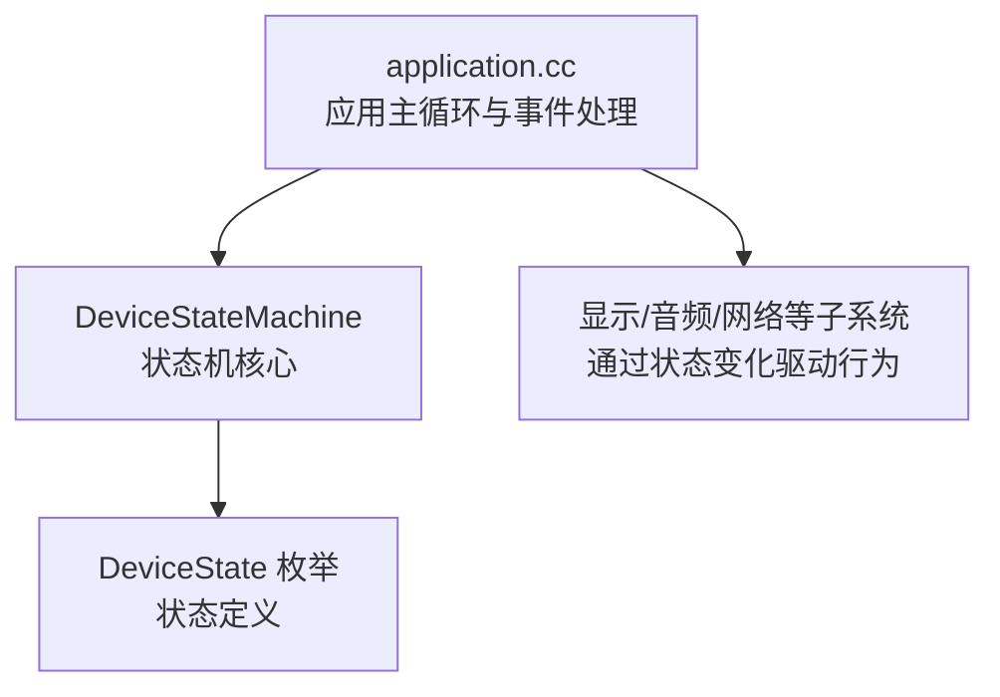
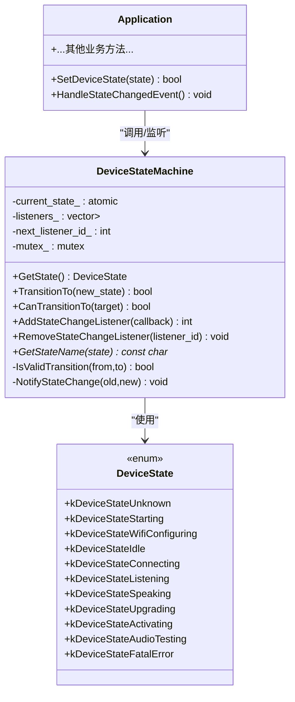
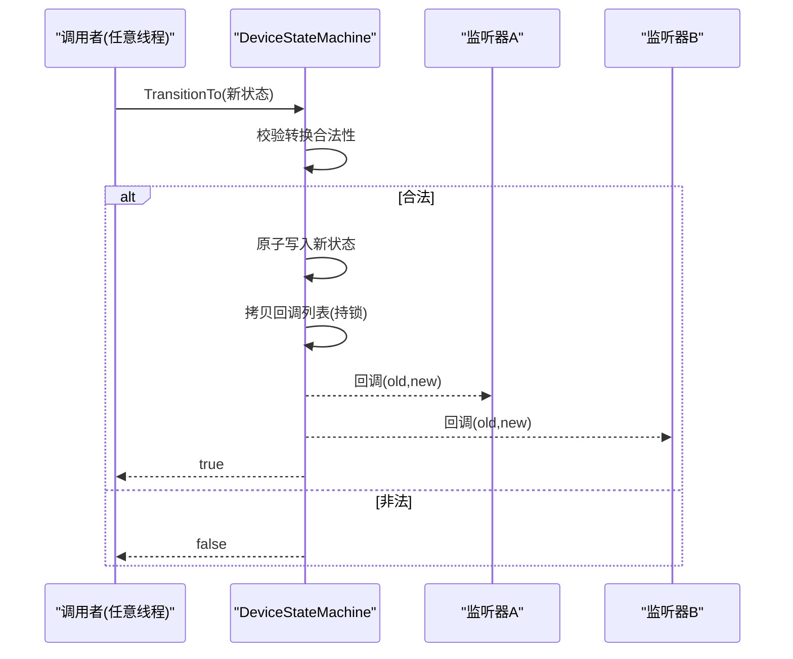
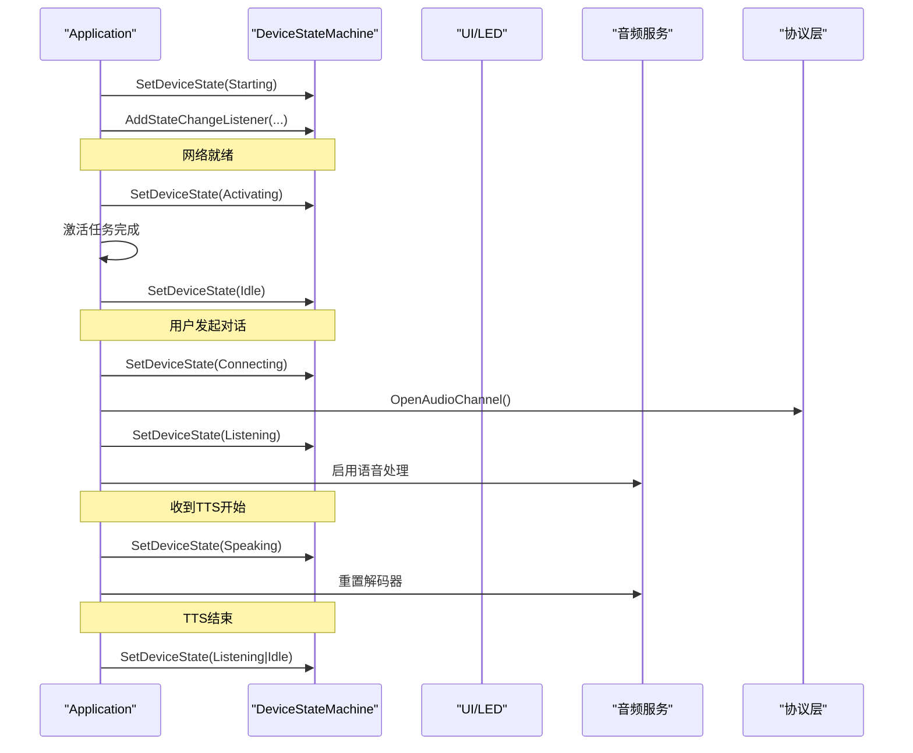
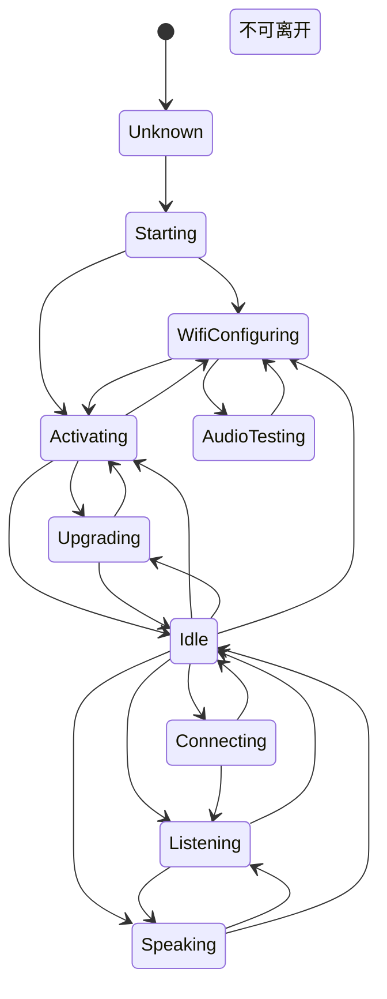
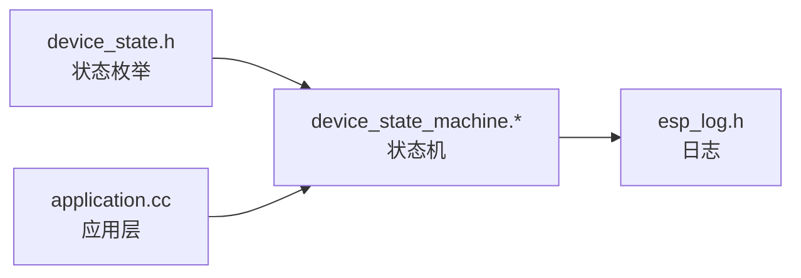
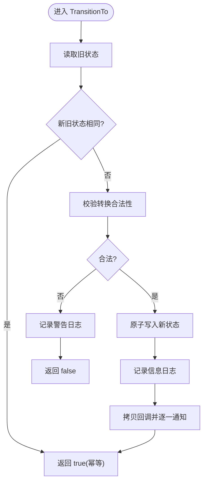

# 设备状态机

<cite>
**本文引用的文件**   
- [device_state.h](file://main/device_state.h)
- [device_state_machine.h](file://main/device_state_machine.h)
- [device_state_machine.cc](file://main/device_state_machine.cc)
- [application.cc](file://main/application.cc)
</cite>

## 目录
1. [简介](#简介)
2. [项目结构](#项目结构)
3. [核心组件](#核心组件)
4. [架构总览](#架构总览)
5. [详细组件分析](#详细组件分析)
6. [依赖关系分析](#依赖关系分析)
7. [性能与并发特性](#性能与并发特性)
8. [故障排查指南](#故障排查指南)
9. [结论](#结论)
10. [附录：使用示例与最佳实践](#附录使用示例与最佳实践)

## 简介
本技术文档聚焦于设备状态机的设计与实现，围绕 DeviceStateMachine 类展开，系统阐述以下要点：
- 所有设备状态的定义与含义
- 状态转换规则表与验证逻辑
- 观察者模式的状态监听机制（注册/移除、回调执行上下文、线程安全）
- 状态转换的原子性与错误处理策略
- 状态持久化现状与建议
- 典型状态转换示例与跨组件响应流程
- 状态转换图与时序图，帮助理解完整工作流

## 项目结构
与设备状态机直接相关的代码位于 main 目录下，核心文件如下：
- device_state.h：定义设备状态枚举
- device_state_machine.h/.cc：状态机实现与转换规则
- application.cc：应用层对状态机的调用与状态变化后的业务编排

图表来源
- [application.cc:57-91](file://main/application.cc#L57-L91)
- [device_state_machine.h:17-81](file://main/device_state_machine.h#L17-L81)
- [device_state.h:4-16](file://main/device_state.h#L4-L16)

章节来源
- [device_state.h:4-16](file://main/device_state.h#L4-L16)
- [device_state_machine.h:17-81](file://main/device_state_machine.h#L17-L81)
- [device_state_machine.cc:34-102](file://main/device_state_machine.cc#L34-L102)
- [application.cc:57-91](file://main/application.cc#L57-L91)

## 核心组件
- 设备状态枚举 DeviceState：集中定义全部设备状态常量，供状态机与应用层共同引用。
- 状态机 DeviceStateMachine：提供当前状态读取、状态转换尝试、合法性检查、状态变更通知、状态名称映射等能力。
- 应用层 Application：在初始化、网络事件、激活流程、语音交互等关键路径中调用状态机，并在状态变更后更新 UI、音频与协议通道。

章节来源
- [device_state.h:4-16](file://main/device_state.h#L4-L16)
- [device_state_machine.h:17-81](file://main/device_state_machine.h#L17-L81)
- [device_state_machine.cc:108-131](file://main/device_state_machine.cc#L108-L131)
- [application.cc:57-91](file://main/application.cc#L57-L91)

## 架构总览
状态机作为“单一事实源”，对外暴露最小接口；应用层在合适时机发起状态转换，并通过监听器获得变更通知，从而驱动 UI、音频、网络等子系统的联动。

图表来源
- [device_state_machine.h:17-81](file://main/device_state_machine.h#L17-L81)
- [device_state.h:4-16](file://main/device_state.h#L4-L16)
- [application.cc:57-91](file://main/application.cc#L57-L91)

## 详细组件分析

### 状态定义与命名映射
- 状态枚举包含未知、启动、配网、空闲、连接中、监听、说话、升级、激活、音频测试、致命错误等。
- 状态名映射用于日志输出，非法状态会返回占位字符串，避免越界访问。

章节来源
- [device_state.h:4-16](file://main/device_state.h#L4-L16)
- [device_state_machine.cc:27-32](file://main/device_state_machine.cc#L27-L32)

### 状态转换规则表
以下为从各状态出发的合法目标状态集合（含自转允许）：
- Unknown → Starting
- Starting → WifiConfiguring | Activating
- WifiConfiguring → Activating | AudioTesting
- AudioTesting → WifiConfiguring
- Activating → Upgrading | Idle | WifiConfiguring
- Upgrading → Idle | Activating
- Idle → Connecting | Listening | Speaking | Activating | Upgrading | WifiConfiguring
- Connecting → Idle | Listening
- Listening → Speaking | Idle
- Speaking → Listening | Idle
- FatalError → 无（不可离开）

说明：
- 自转（from == to）视为合法且为幂等操作，不会触发通知。
- 非法转换会被拒绝并记录警告日志。

章节来源
- [device_state_machine.cc:34-102](file://main/device_state_machine.cc#L34-L102)

### 转换验证与原子性
- 验证入口：CanTransitionTo 仅做只读判断；TransitionTo 负责校验、写入与通知。
- 原子性：内部使用原子变量保存当前状态，确保多线程环境下状态可见性与一致性。
- 幂等：若新旧状态相同，直接返回成功且不触发通知。
- 日志：非法转换记录警告；合法转换记录信息日志。

章节来源
- [device_state_machine.cc:104-131](file://main/device_state_machine.cc#L104-L131)

### 状态监听器机制（观察者模式）
- 注册：AddStateChangeListener 返回唯一 listener id，便于后续移除。
- 移除：RemoveStateChangeListener 按 id 精确删除。
- 通知：NotifyStateChange 在持有互斥锁时拷贝回调列表，释放锁后逐个调用，避免在回调期间修改监听器列表导致迭代器失效或死锁。
- 执行上下文：回调在调用 TransitionTo 的线程上下文中同步执行，调用方需保证回调内操作轻量或自行异步化。

图表来源
- [device_state_machine.cc:108-161](file://main/device_state_machine.cc#L108-L161)

章节来源
- [device_state_machine.h:47-59](file://main/device_state_machine.h#L47-L59)
- [device_state_machine.cc:133-161](file://main/device_state_machine.cc#L133-L161)

### 应用层集成与状态驱动
- 初始化阶段设置初始状态为“启动”，并注册状态变更监听，将变更事件投递到主循环事件组。
- 主循环根据事件分发，统一在 HandleStateChangedEvent 中刷新 UI、控制音频处理与唤醒词检测、管理协议通道等。
- 网络就绪后进入“激活”流程；激活完成后进入“空闲”。
- 语音交互路径：空闲→连接中→监听→说话→监听/空闲，异常或断网回退至空闲。

图表来源
- [application.cc:61-91](file://main/application.cc#L61-L91)
- [application.cc:261-321](file://main/application.cc#L261-L321)
- [application.cc:674-711](file://main/application.cc#L674-L711)
- [application.cc:860-932](file://main/application.cc#L860-L932)

章节来源
- [application.cc:57-91](file://main/application.cc#L57-L91)
- [application.cc:261-321](file://main/application.cc#L261-L321)
- [application.cc:674-711](file://main/application.cc#L674-L711)
- [application.cc:860-932](file://main/application.cc#L860-L932)

### 状态转换图

图表来源
- [device_state_machine.cc:34-102](file://main/device_state_machine.cc#L34-L102)

## 依赖关系分析
- 模块耦合
  - DeviceStateMachine 仅依赖标准库与设备状态枚举，低耦合、高内聚。
  - Application 依赖状态机进行生命周期与交互流程编排，同时驱动 UI、音频、协议等子系统。
- 外部依赖
  - 日志：ESP_LOGI/ESP_LOGW 用于调试与排障。
  - 线程原语：std::atomic、std::mutex、std::function、std::vector。
- 潜在风险
  - 回调函数在调用线程同步执行，若回调耗时过长会影响状态切换吞吐。建议回调内只做轻量标记或投递任务。

图表来源
- [device_state.h:4-16](file://main/device_state.h#L4-L16)
- [device_state_machine.cc:1-6](file://main/device_state_machine.cc#L1-L6)
- [application.cc:57-91](file://main/application.cc#L57-L91)

章节来源
- [device_state_machine.cc:1-6](file://main/device_state_machine.cc#L1-L6)
- [application.cc:57-91](file://main/application.cc#L57-L91)

## 性能与并发特性
- 原子状态读写：current_state_ 使用 std::atomic，避免额外锁开销，提升并发安全性。
- 监听器通知：先拷贝回调列表再释放锁，降低锁持有时间，减少阻塞风险。
- 幂等优化：同态转换直接返回，不触发通知与副作用。
- 建议
  - 回调中避免阻塞型 I/O，必要时通过调度器投递到主循环或其他任务。
  - 高频状态变更场景下，可考虑批量通知或去抖策略（需在应用层实现）。

[本节为通用指导，不直接分析具体文件]

## 故障排查指南
- 非法状态转换
  - 现象：日志出现“Invalid state transition”警告，转换失败返回 false。
  - 排查：核对当前状态与目标状态是否符合规则表；检查是否有并发竞争导致状态不一致。
- 回调未触发
  - 现象：监听器未收到通知。
  - 排查：确认是否已正确注册监听器；确认转换是否被拒绝；注意回调在调用线程同步执行，若调用线程被挂起可能观察不到即时效果。
- 状态卡住
  - 现象：设备长时间停留在某状态。
  - 排查：检查对应状态的业务分支是否设置了下一状态；关注网络/协议/音频的错误回调是否回退到空闲或错误状态。
- 致命错误状态
  - 说明：FatalError 状态下不允许任何转换，需外部复位或重启恢复。

章节来源
- [device_state_machine.cc:117-121](file://main/device_state_machine.cc#L117-L121)
- [device_state_machine.cc:95-101](file://main/device_state_machine.cc#L95-L101)

## 结论
该状态机以最小接口提供强约束的状态流转与可靠的观察者通知，结合应用层的统一事件分发，实现了清晰、可维护的设备生命周期与交互流程。其原子状态、幂等转换与安全的回调机制，为多组件协作提供了坚实基础。建议在扩展新状态时严格遵循规则表，并在回调中保持轻量与可中断，以保证整体响应性与稳定性。

[本节为总结性内容，不直接分析具体文件]

## 附录：使用示例与最佳实践

### 示例一：在初始化时注册状态监听
- 步骤
  - 在应用初始化时设置初始状态为“启动”。
  - 注册状态变更监听，将变更事件投递到主循环事件组。
  - 在主循环中统一处理状态变更，更新 UI、音频与协议。

章节来源
- [application.cc:61-91](file://main/application.cc#L61-L91)
- [application.cc:860-932](file://main/application.cc#L860-L932)

### 示例二：网络就绪后进入激活流程
- 步骤
  - 网络连接成功后，若处于“启动”或“配网”状态，则切换到“激活”。
  - 激活完成后切换到“空闲”。

章节来源
- [application.cc:261-321](file://main/application.cc#L261-L321)

### 示例三：发起对话的典型路径
- 步骤
  - 空闲 → 连接中（打开音频通道）
  - 连接中 → 监听（发送开始监听命令，启用语音处理）
  - 监听 → 说话（收到 TTS start）
  - 说话 → 监听/空闲（收到 TTS stop）

章节来源
- [application.cc:674-711](file://main/application.cc#L674-L711)
- [application.cc:860-932](file://main/application.cc#L860-L932)

### 示例四：升级固件的流程
- 步骤
  - 检测到新版本或资源包需要更新时，切换到“升级”。
  - 升级成功则重启；失败则回到“激活”或“空闲”继续运行。

章节来源
- [application.cc:340-396](file://main/application.cc#L340-L396)
- [application.cc:972-1022](file://main/application.cc#L972-L1022)

### 状态转换流程图（算法视角）

图表来源
- [device_state_machine.cc:108-131](file://main/device_state_machine.cc#L108-L131)
- [device_state_machine.cc:148-161](file://main/device_state_machine.cc#L148-L161)

### 状态持久化机制与改进建议
- 现状
  - 当前状态机未在运行时持久化状态，重启后由应用层重新初始化并设置初始状态。
- 建议
  - 可在状态变更时落盘（如 NVS/Flash），并在启动时恢复最近一次有效状态，以提升用户体验与可观测性。
  - 注意写入频率与可靠性，避免频繁写闪存影响寿命与性能。

[本节为概念性建议，不直接分析具体文件]