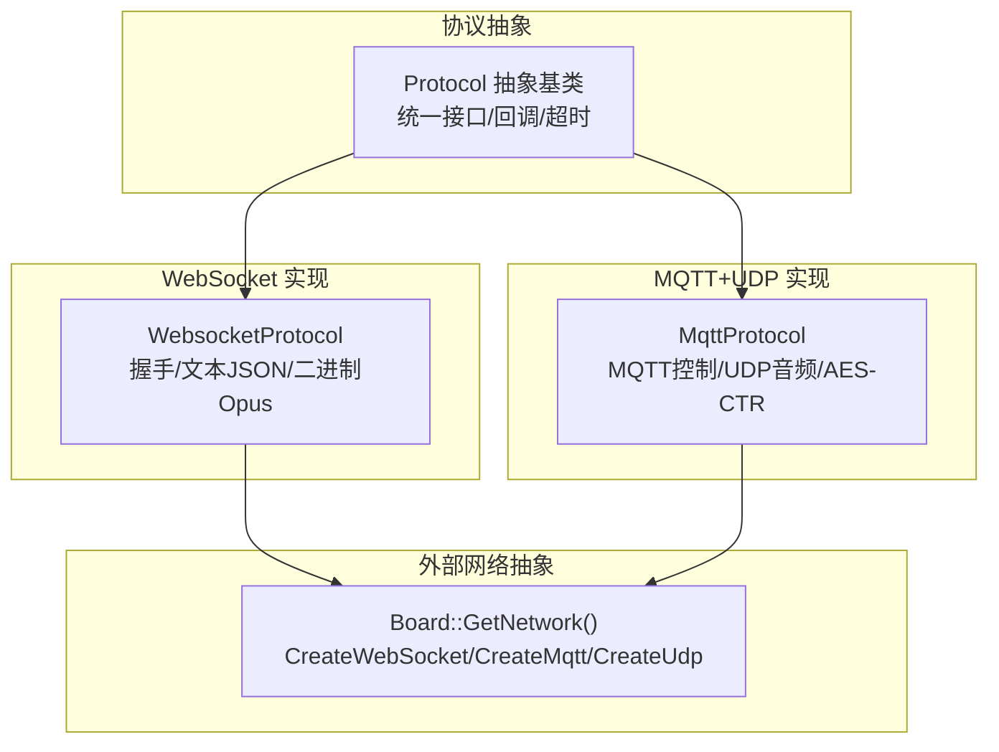
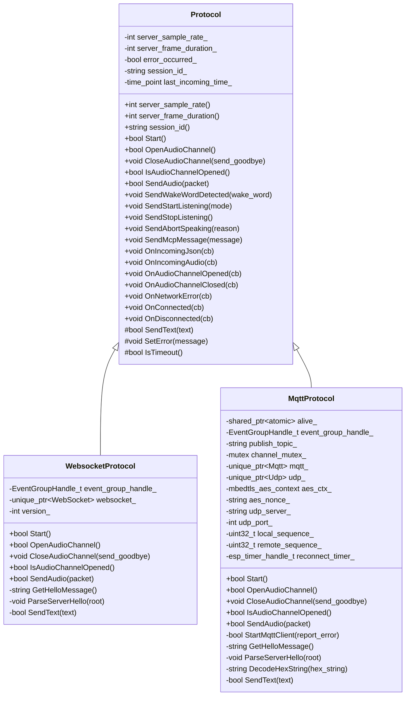
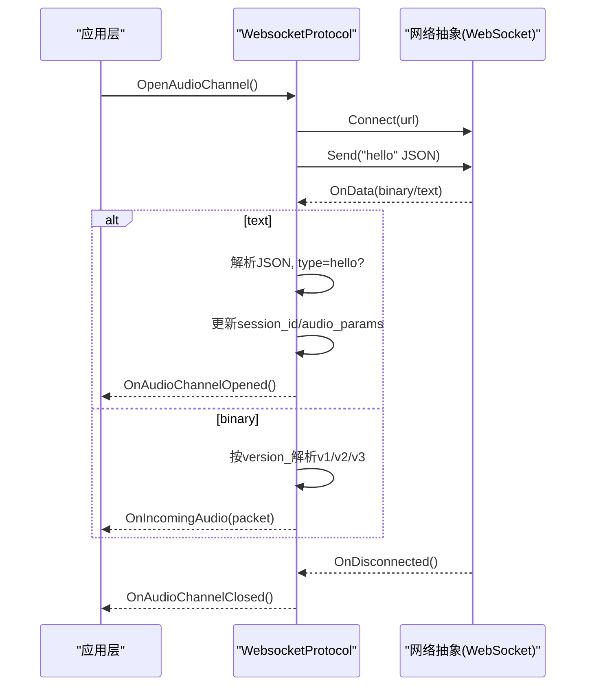
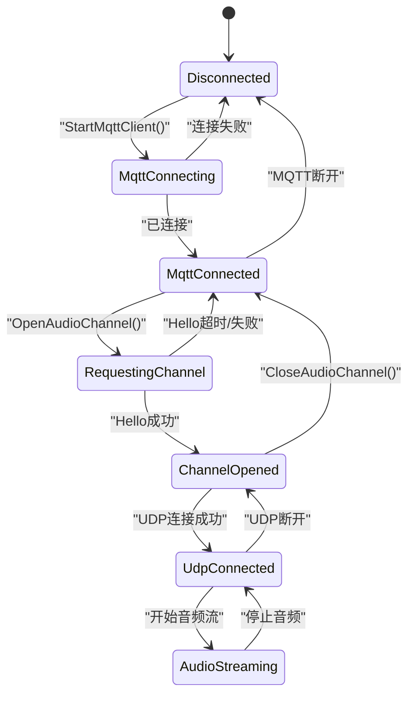
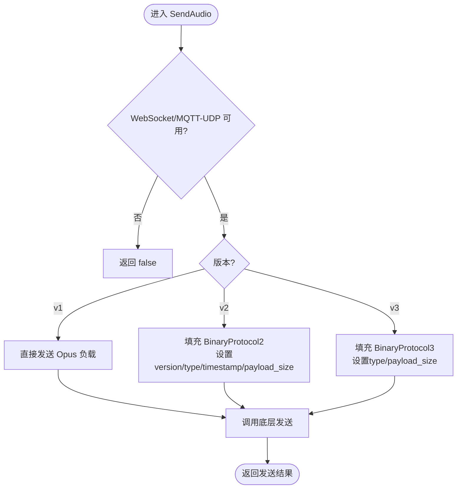
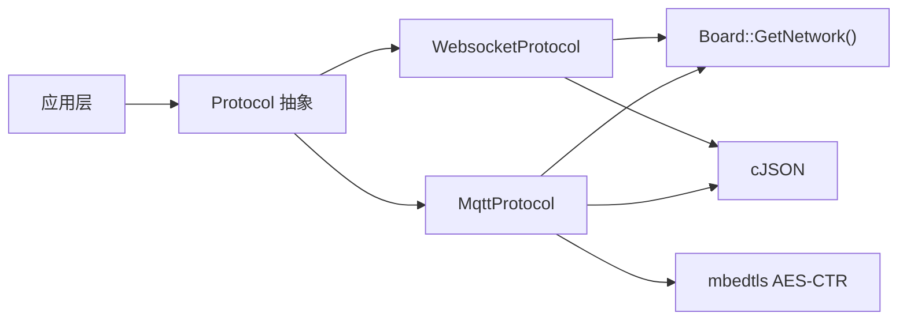

# 通信协议层

<cite>
**本文引用的文件**   
- [protocol.h](file://main/protocols/protocol.h)
- [protocol.cc](file://main/protocols/protocol.cc)
- [websocket_protocol.h](file://main/protocols/websocket_protocol.h)
- [websocket_protocol.cc](file://main/protocols/websocket_protocol.cc)
- [mqtt_protocol.h](file://main/protocols/mqtt_protocol.h)
- [mqtt_protocol.cc](file://main/protocols/mqtt_protocol.cc)
- [websocket.md](file://docs/websocket.md)
- [mqtt-udp.md](file://docs/mqtt-udp.md)
</cite>

## 目录
1. [引言](#引言)
2. [项目结构](#项目结构)
3. [核心组件](#核心组件)
4. [架构总览](#架构总览)
5. [详细组件分析](#详细组件分析)
6. [依赖关系分析](#依赖关系分析)
7. [性能与可靠性](#性能与可靠性)
8. [故障排查指南](#故障排查指南)
9. [结论](#结论)
10. [附录：协议扩展指南](#附录协议扩展指南)

## 引言
本文件面向开发者，系统化梳理设备侧通信协议层的设计与实现。重点覆盖：
- Protocol 抽象基类：统一接口、连接管理、消息封装机制
- WebSocket 协议：握手、二进制音频传输、版本化帧格式、错误处理
- MQTT+UDP 混合协议：控制信令与实时音频分离、AES-CTR 加密、序列号防重放
- 二进制协议 v2/v3 的帧格式与序列化
- 安全通信：TLS（MQTT）、证书与认证、会话密钥分发
- 协议栈架构图与数据包格式示例
- 自定义协议扩展步骤与兼容性建议

## 项目结构
协议层位于 main/protocols 目录，提供统一的抽象与两种具体实现；文档位于 docs 目录，描述协议细节与交互流程。

图表来源
- [protocol.h:44-95](file://main/protocols/protocol.h#L44-L95)
- [websocket_protocol.h:13-32](file://main/protocols/websocket_protocol.h#L13-L32)
- [mqtt_protocol.h:26-62](file://main/protocols/mqtt_protocol.h#L26-L62)

章节来源
- [protocol.h:1-99](file://main/protocols/protocol.h#L1-L99)
- [websocket_protocol.h:1-35](file://main/protocols/websocket_protocol.h#L1-L35)
- [mqtt_protocol.h:1-66](file://main/protocols/mqtt_protocol.h#L1-L66)

## 核心组件
- Protocol 抽象基类
  - 定义统一的音频通道生命周期方法：Start/OpenAudioChannel/CloseAudioChannel/IsAudioChannelOpened/SendAudio
  - 定义通用 JSON 命令发送：SendWakeWordDetected/SendStartListening/SendStopListening/SendAbortSpeaking/SendMcpMessage
  - 提供回调注册：OnIncomingJson/OnIncomingAudio/OnConnected/OnDisconnected/OnAudioChannelOpened/OnAudioChannelClosed/OnNetworkError
  - 内置超时检测 IsTimeout（默认 120s）
  - 维护服务器协商参数：server_sample_rate_/server_frame_duration_、session_id_
- WebsocketProtocol
  - 基于 WebSocket 建立双向通道，支持文本 JSON 与二进制 Opus
  - 支持二进制协议 v1/v2/v3，按配置选择
  - 通过请求头携带鉴权与设备标识
- MqttProtocol
  - 使用 MQTT 作为控制面，UDP 承载加密音频数据
  - Hello 交换后下发 UDP 端点与 AES 密钥/Nonce，后续音频走 UDP
  - 具备自动重连与心跳保活能力

章节来源
- [protocol.h:44-95](file://main/protocols/protocol.h#L44-L95)
- [protocol.cc:35-90](file://main/protocols/protocol.cc#L35-L90)
- [websocket_protocol.h:13-32](file://main/protocols/websocket_protocol.h#L13-L32)
- [websocket_protocol.cc:83-201](file://main/protocols/websocket_protocol.cc#L83-L201)
- [mqtt_protocol.h:26-62](file://main/protocols/mqtt_protocol.h#L26-L62)
- [mqtt_protocol.cc:55-152](file://main/protocols/mqtt_protocol.cc#L55-L152)

## 架构总览
协议层采用“抽象 + 多实现”的分层设计，上层应用仅依赖 Protocol 接口，屏蔽底层传输差异。

图表来源
- [protocol.h:44-95](file://main/protocols/protocol.h#L44-L95)
- [websocket_protocol.h:13-32](file://main/protocols/websocket_protocol.h#L13-L32)
- [mqtt_protocol.h:26-62](file://main/protocols/mqtt_protocol.h#L26-L62)

## 详细组件分析

### Protocol 抽象基类
- 统一接口
  - 音频通道生命周期：Open/Close/IsOpened/SendAudio
  - 控制消息：listen/start/stop/abort/wake-word/mcp
  - 事件回调：连接、断开、错误、音频到达、JSON 到达
- 超时与错误
  - 记录最近一次入站时间，IsTimeout 判断是否超过阈值（默认 120s）
  - SetError 设置错误标志并触发 on_network_error_ 回调
- 数据模型
  - AudioStreamPacket：采样率、帧时长、时间戳、负载
  - BinaryProtocol2/3：二进制帧结构体（见下节）

章节来源
- [protocol.h:10-31](file://main/protocols/protocol.h#L10-L31)
- [protocol.h:44-95](file://main/protocols/protocol.h#L44-L95)
- [protocol.cc:35-90](file://main/protocols/protocol.cc#L35-L90)

### WebSocket 协议实现
- 连接建立与握手
  - 读取配置 URL/token/version，创建 WebSocket 实例
  - 设置请求头：Authorization、Protocol-Version、Device-Id、Client-Id
  - 发送客户端 hello（包含 features、transport、audio_params），等待服务端 hello 完成协商
- 文本与二进制分流
  - 文本帧解析 JSON，type=hello 时进行解析，其余转发到 on_incoming_json_
  - 二进制帧根据 version_ 解析为 v1/v2/v3 并构造 AudioStreamPacket
- 二进制协议版本
  - v1：直接透传 Opus 帧
  - v2：BinaryProtocol2，含 timestamp/payload_size 等元数据
  - v3：BinaryProtocol3，轻量头部
- 断线处理
  - OnDisconnected 回调触发 on_audio_channel_closed_
  - 未实现自动重连，由上层决定策略

图表来源
- [websocket_protocol.cc:83-201](file://main/protocols/websocket_protocol.cc#L83-L201)
- [websocket_protocol.cc:112-166](file://main/protocols/websocket_protocol.cc#L112-L166)
- [websocket_protocol.cc:203-254](file://main/protocols/websocket_protocol.cc#L203-L254)

章节来源
- [websocket_protocol.h:13-32](file://main/protocols/websocket_protocol.h#L13-L32)
- [websocket_protocol.cc:23-26](file://main/protocols/websocket_protocol.cc#L23-L26)
- [websocket_protocol.cc:83-201](file://main/protocols/websocket_protocol.cc#L83-L201)
- [websocket_protocol.cc:203-254](file://main/protocols/websocket_protocol.cc#L203-L254)

### MQTT+UDP 混合协议实现
- 控制面（MQTT）
  - 连接 broker（默认端口 8883），可配置 keepalive
  - 订阅/发布主题由配置决定，设备向固定 topic 发布控制消息
  - 收到服务端 goodbye 时主动关闭音频通道且不回发 goodbye，避免乒乓
  - 断线自动重连：定时器调度，空闲态才尝试重连
- 数据面（UDP）
  - 通过 MQTT hello 响应获取 UDP 地址、端口、AES key/nonce
  - 初始化 AES-CTR 上下文，打开 UDP 套接字
  - 上行：拼接 nonce（含长度、时间戳、序列号），AES-CTR 加密后发送
  - 下行：校验类型/长度，反序化 timestamp/sequence，AES-CTR 解密后上送
  - 序列号单调递增，接收端检查连续性，丢弃旧包，容忍小范围乱序
- 状态机
  - Disconnected -> MqttConnecting -> MqttConnected -> RequestingChannel -> ChannelOpened -> UdpConnected -> AudioStreaming
  - 任一阶段失败均回退或重试

图表来源
- [mqtt-udp.md:247-263](file://docs/mqtt-udp.md#L247-L263)
- [mqtt_protocol.cc:55-152](file://main/protocols/mqtt_protocol.cc#L55-L152)
- [mqtt_protocol.cc:215-295](file://main/protocols/mqtt_protocol.cc#L215-L295)

章节来源
- [mqtt_protocol.h:26-62](file://main/protocols/mqtt_protocol.h#L26-L62)
- [mqtt_protocol.cc:55-152](file://main/protocols/mqtt_protocol.cc#L55-L152)
- [mqtt_protocol.cc:166-213](file://main/protocols/mqtt_protocol.cc#L166-L213)
- [mqtt_protocol.cc:215-295](file://main/protocols/mqtt_protocol.cc#L215-L295)
- [mqtt_protocol.cc:322-366](file://main/protocols/mqtt_protocol.cc#L322-L366)

### 二进制协议 v2 与 v3 帧格式与序列化
- 帧结构
  - v2：包含 version/type/reserved/timestamp/payload_size/payload[]
  - v3：包含 type/reserved/payload_size/payload[]
- 序列化/反序列化
  - 发送端按版本填充字段并进行网络字节序转换
  - 接收端按版本解析，提取 payload 并构造 AudioStreamPacket
- 适用场景
  - v2 适合需要时间戳的场景（如服务端 AEC）
  - v3 更轻量，减少开销

图表来源
- [websocket_protocol.cc:28-58](file://main/protocols/websocket_protocol.cc#L28-L58)
- [protocol.h:17-31](file://main/protocols/protocol.h#L17-L31)

章节来源
- [protocol.h:17-31](file://main/protocols/protocol.h#L17-L31)
- [websocket_protocol.cc:28-58](file://main/protocols/websocket_protocol.cc#L28-L58)

### 安全通信与身份认证
- TLS 加密
  - MQTT 默认使用 8883 端口，支持 TLS/SSL（由底层网络库负责证书验证）
- 身份认证
  - WebSocket：通过 Authorization 请求头携带 Bearer Token
  - MQTT：用户名/密码认证
- 音频数据安全
  - MQTT+UDP：服务端通过 hello 下发 AES key/nonce，设备使用 AES-CTR 对音频载荷加密
  - 序列号与时间戳用于抗重放与顺序性校验
- 会话管理
  - hello 协商 session_id，贯穿后续控制消息

章节来源
- [websocket_protocol.cc:101-110](file://main/protocols/websocket_protocol.cc#L101-L110)
- [mqtt_protocol.cc:134-152](file://main/protocols/mqtt_protocol.cc#L134-L152)
- [mqtt_protocol.cc:322-366](file://main/protocols/mqtt_protocol.cc#L322-L366)
- [mqtt-udp.md:319-336](file://docs/mqtt-udp.md#L319-L336)

## 依赖关系分析
- 组件耦合
  - WebsocketProtocol/MqttProtocol 均依赖 Board::GetNetwork() 提供的网络抽象
  - 两者都依赖 cJSON 解析 JSON，依赖 FreeRTOS 事件组/定时器
- 外部依赖
  - mbedtls AES-CTR（仅 MQTT+UDP 路径）
  - ESP-IDF 日志系统
- 潜在循环依赖
  - 当前实现未见循环引用；各协议独立实现各自的生命周期与收发逻辑

图表来源
- [websocket_protocol.cc:94-110](file://main/protocols/websocket_protocol.cc#L94-L110)
- [mqtt_protocol.cc:81-84](file://main/protocols/mqtt_protocol.cc#L81-L84)
- [mqtt_protocol.h:48-54](file://main/protocols/mqtt_protocol.h#L48-L54)

章节来源
- [websocket_protocol.cc:94-110](file://main/protocols/websocket_protocol.cc#L94-L110)
- [mqtt_protocol.cc:81-84](file://main/protocols/mqtt_protocol.cc#L81-L84)
- [mqtt_protocol.h:48-54](file://main/protocols/mqtt_protocol.h#L48-L54)

## 性能与可靠性
- 低延迟优化
  - MQTT+UDP 将控制与数据分离，UDP 直传音频，降低端到端时延
  - 合理帧长（通常 60ms）与 Opus 编码平衡带宽与延迟
- 可靠性保障
  - MQTT 自动重连与 KeepAlive
  - UDP 序列号连续性与丢包容忍度
  - 超时检测（120s）及时释放资源
- 内存与并发
  - 使用智能指针管理网络对象与音频包
  - 互斥锁保护 UDP 写入临界区

[本节为通用指导，不直接分析具体文件]

## 故障排查指南
- 无法连接
  - WebSocket：检查 URL、Token、网络连通性；确认握手超时
  - MQTT：检查 endpoint/port/凭据；查看重连日志
- 无音频
  - WebSocket：确认二进制帧是否到达，版本是否正确
  - MQTT+UDP：核对 UDP 地址/端口可达性，检查 AES key/nonce 是否一致，观察序列号告警
- 频繁断开
  - 检查防火墙/NAT 规则，确保 UDP 端口开放
  - 关注 IsTimeout 触发原因，定位长时间无入站数据的原因

章节来源
- [websocket_protocol.cc:175-194](file://main/protocols/websocket_protocol.cc#L175-L194)
- [mqtt_protocol.cc:85-98](file://main/protocols/mqtt_protocol.cc#L85-L98)
- [mqtt_protocol.cc:243-287](file://main/protocols/mqtt_protocol.cc#L243-L287)
- [protocol.cc:81-90](file://main/protocols/protocol.cc#L81-L90)

## 结论
该协议层以抽象基类为核心，提供一致的音频通道与控制消息接口；WebSocket 适用于简单部署与高可靠场景，MQTT+UDP 在低延迟与安全性方面更具优势。二进制 v2/v3 提供了灵活的元数据扩展能力。结合 TLS、Token、AES-CTR 与序列号机制，整体方案兼顾了安全、性能与可扩展性。

[本节为总结性内容，不直接分析具体文件]

## 附录：协议扩展指南

### 自定义协议实现步骤
- 继承 Protocol 抽象基类，实现以下虚函数：
  - Start/OpenAudioChannel/CloseAudioChannel/IsAudioChannelOpened/SendAudio
  - 私有虚函数 SendText（若需要文本通道）
- 复用公共能力：
  - 使用 OnIncomingJson/OnIncomingAudio 等回调注册机制
  - 使用 IsTimeout/SetError 进行超时与错误上报
  - 使用 SendStartListening/SendStopListening/SendAbortSpeaking/SendMcpMessage 等通用命令
- 兼容性与演进：
  - 在 hello/features 中声明新特性，保持向后兼容
  - 新增二进制版本时，遵循 v2/v3 的命名与字节序规范
  - 对未知字段采取忽略策略，避免破坏旧实现

章节来源
- [protocol.h:44-95](file://main/protocols/protocol.h#L44-L95)
- [protocol.cc:42-79](file://main/protocols/protocol.cc#L42-L79)
- [websocket_protocol.cc:203-254](file://main/protocols/websocket_protocol.cc#L203-L254)
- [mqtt_protocol.cc:297-320](file://main/protocols/mqtt_protocol.cc#L297-L320)

### 数据包格式示例（参考）
- WebSocket 文本 JSON（hello）
  - 关键字段：type/version/features/transport/audio_params
- WebSocket 二进制音频
  - v1：原始 Opus
  - v2：BinaryProtocol2
  - v3：BinaryProtocol3
- MQTT+UDP 控制 JSON（hello/goodbye/listen/abort/mcp/system/alert）
- MQTT+UDP 音频包
  - 头部：type/flags/payload_len/ssrc/timestamp/sequence
  - 载荷：AES-CTR 加密后的 Opus

章节来源
- [websocket.md:96-127](file://docs/websocket.md#L96-L127)
- [websocket.md:129-307](file://docs/websocket.md#L129-L307)
- [mqtt-udp.md:203-242](file://docs/mqtt-udp.md#L203-L242)
- [mqtt-udp.md:24-58](file://docs/mqtt-udp.md#L24-L58)