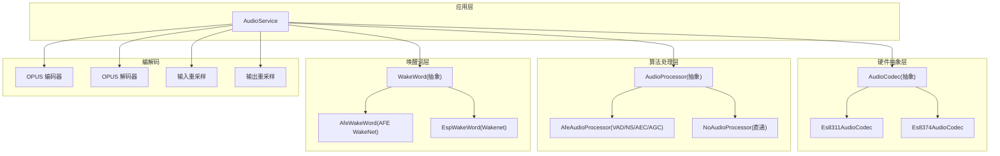
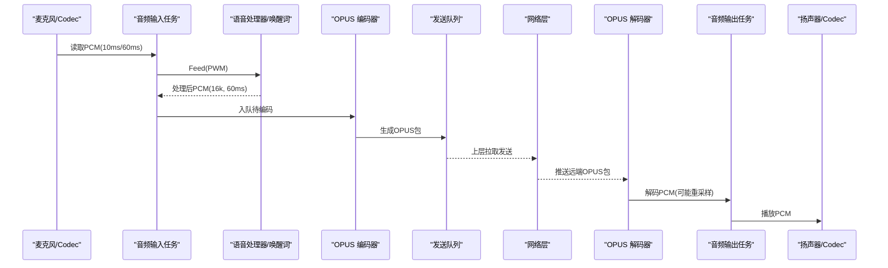
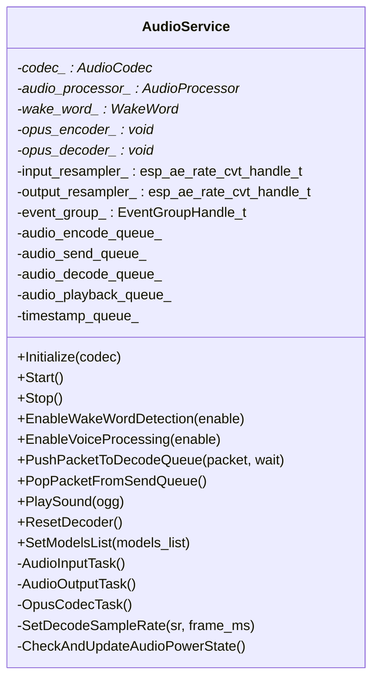
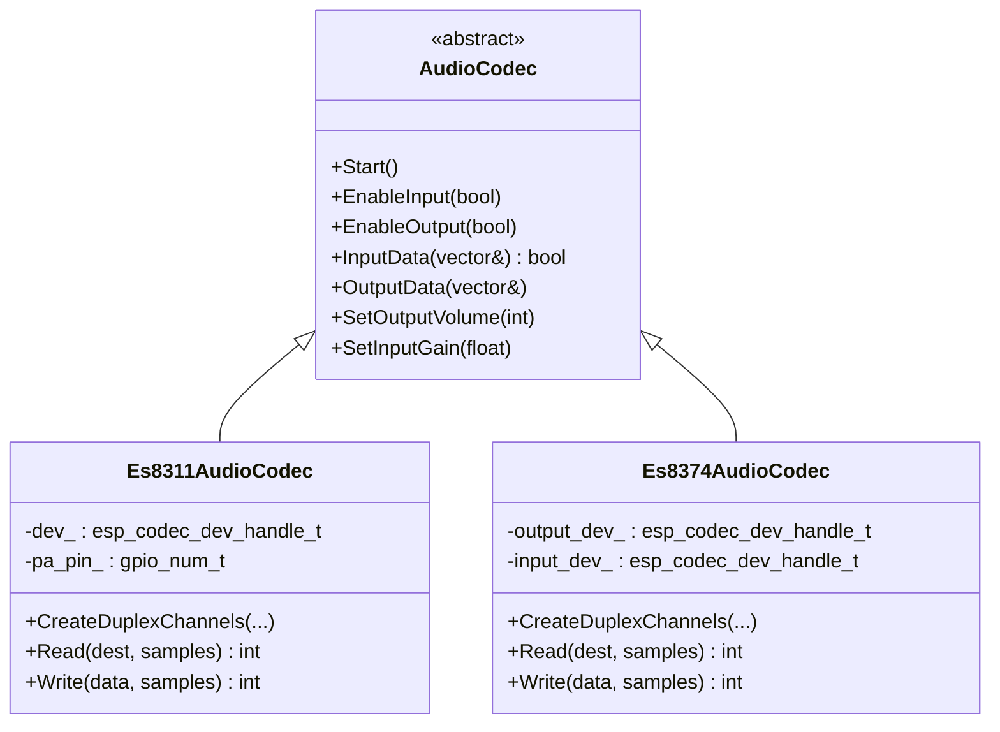
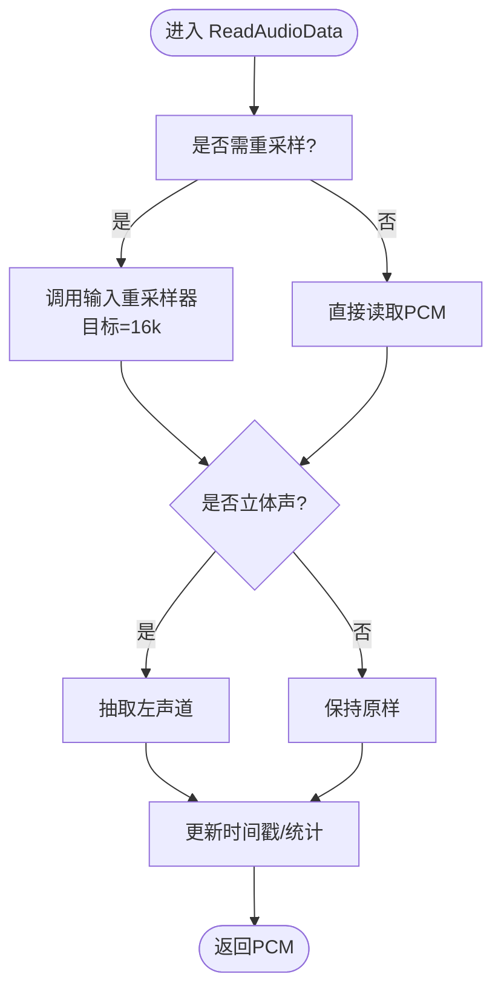
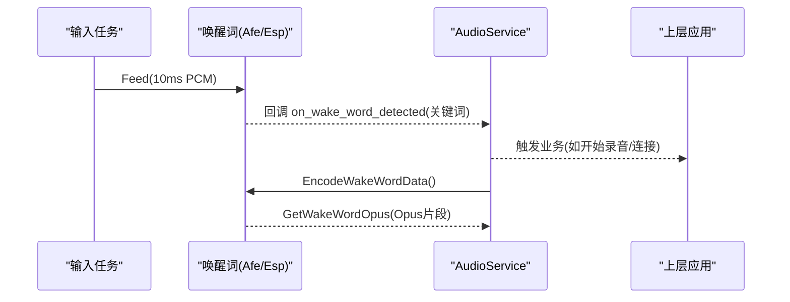
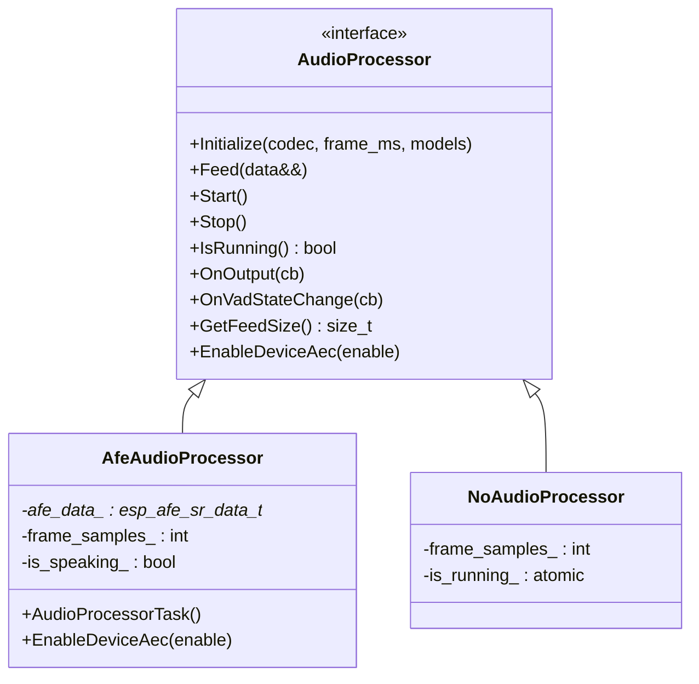
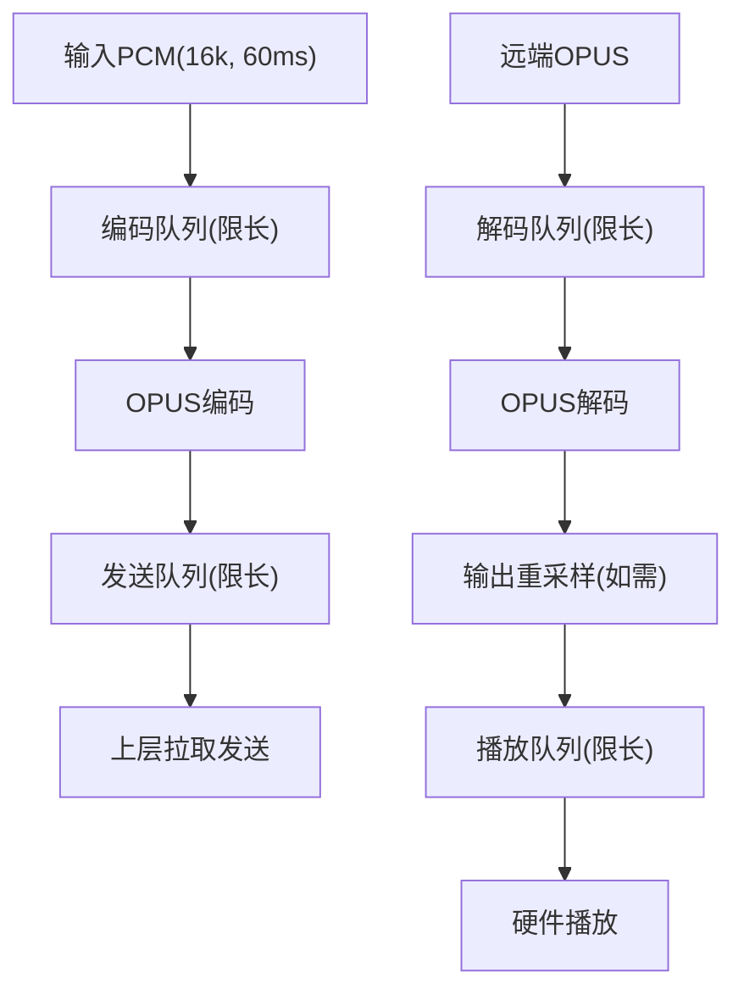
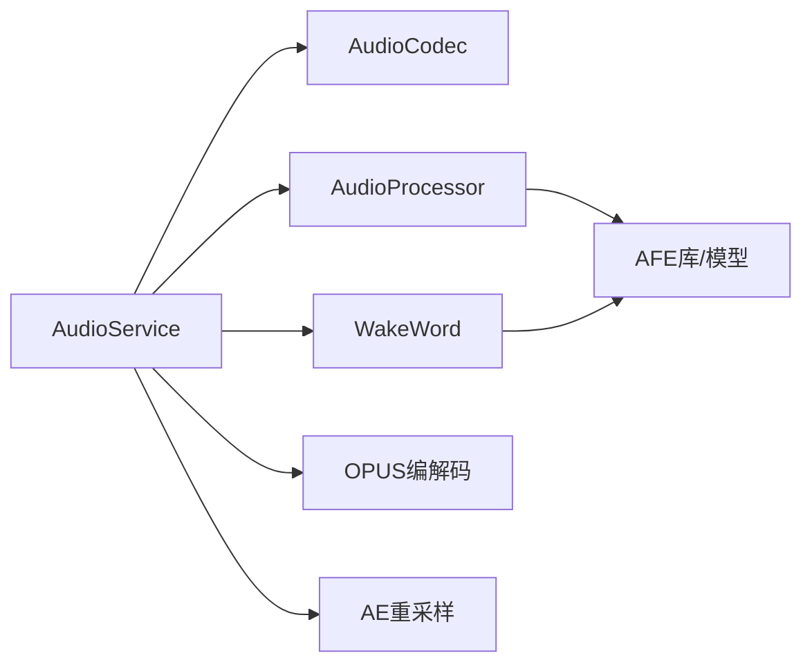
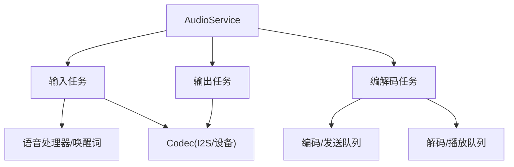

# 音频服务

<cite>
**本文引用的文件**   
- [audio_service.h](file://main\audio\audio_service.h)
- [audio_service.cc](file://main\audio\audio_service.cc)
- [audio_codec.h](file://main\audio\audio_codec.h)
- [audio_codec.cc](file://main\audio\audio_codec.cc)
- [es8311_audio_codec.h](file://main\audio\codecs\es8311_audio_codec.h)
- [es8311_audio_codec.cc](file://main\audio\codecs\es8311_audio_codec.cc)
- [es8374_audio_codec.h](file://main\audio\codecs\es8374_audio_codec.h)
- [es8374_audio_codec.cc](file://main\audio\codecs\es8374_audio_codec.cc)
- [audio_processor.h](file://main\audio\audio_processor.h)
- [afe_audio_processor.h](file://main\audio\processors\afe_audio_processor.h)
- [afe_audio_processor.cc](file://main\audio\processors\afe_audio_processor.cc)
- [no_audio_processor.h](file://main\audio\processors\no_audio_processor.h)
- [no_audio_processor.cc](file://main\audio\processors\no_audio_processor.cc)
- [wake_word.h](file://main\audio\wake_word.h)
- [afe_wake_word.h](file://main\audio\wake_words\afe_wake_word.h)
- [afe_wake_word.cc](file://main\audio\wake_words\afe_wake_word.cc)
- [esp_wake_word.h](file://main\audio\wake_words\esp_wake_word.h)
- [esp_wake_word.cc](file://main\audio\wake_words\esp_wake_word.cc)
</cite>

## 目录
1. [简介](#简介)
2. [项目结构](#项目结构)
3. [核心组件](#核心组件)
4. [架构总览](#架构总览)
5. [详细组件分析](#详细组件分析)
6. [依赖关系分析](#依赖关系分析)
7. [性能与调优](#性能与调优)
8. [故障诊断指南](#故障诊断指南)
9. [结论](#结论)
10. [附录：数据流与交互图](#附录数据流与交互图)

## 简介
本文件面向开发者，系统性阐述 AudioService 的架构设计与实现细节，覆盖从麦克风采集、后处理（VAD/NS/AEC/AGC）、编码（OPUS）、网络发送队列、解码播放、采样率转换、音量控制到唤醒词检测的完整链路。文档同时给出类图、时序图与流程图，帮助快速理解音频数据在各模块间的流转与控制流。

## 项目结构
音频子系统位于 main/audio 目录，采用“接口抽象 + 多实现”的分层组织方式：
- 顶层服务：AudioService 负责任务编排、队列管理、编解码调度、事件通知与电源管理。
- 硬件抽象：AudioCodec 及其具体实现（如 Es8311AudioCodec、Es8374AudioCodec）封装 I2S/Codec 驱动。
- 算法处理：AudioProcessor 抽象接口，提供 AfeAudioProcessor（含 VAD/NS/AEC/AGC）与 NoAudioProcessor（直通）。
- 唤醒词：WakeWord 抽象接口，提供 AfeWakeWord（基于 AFE WakeNet）与 EspWakeWord（轻量 Wakenet）。
- 编解码：使用 ESP-IDF OPUS 编解码库进行实时压缩/解压；输入输出路径支持动态采样率转换。

图表来源
- [audio_service.h:105-193](file://main\audio\audio_service.h#L105-L193)
- [audio_codec.h:17-59](file://main\audio\audio_codec.h#L17-L59)
- [es8311_audio_codec.h:13-40](file://main\audio\codecs\es8311_audio_codec.h#L13-L40)
- [es8374_audio_codec.h:13-39](file://main\audio\codecs\es8374_audio_codec.h#L13-L39)
- [audio_processor.h:11-24](file://main\audio\audio_processor.h#L11-L24)
- [afe_audio_processor.h:17-46](file://main\audio\processors\afe_audio_processor.h#L17-L46)
- [no_audio_processor.h:11-33](file://main\audio\processors\no_audio_processor.h#L11-L33)
- [wake_word.h:11-24](file://main\audio\wake_word.h#L11-L24)
- [afe_wake_word.h:22-60](file://main\audio\wake_words\afe_wake_word.h#L22-L60)
- [esp_wake_word.h:17-43](file://main\audio\wake_words\esp_wake_word.h#L17-L43)

章节来源
- [audio_service.h:105-193](file://main\audio\audio_service.h#L105-L193)
- [audio_codec.h:17-59](file://main\audio\audio_codec.h#L17-L59)

## 核心组件
- AudioService
  - 职责：协调采集/处理/编码/发送/解码/播放全链路；维护多个队列与任务；管理事件组与回调；处理动态采样率切换与设备电源状态。
  - 关键能力：
    - 双路任务：输入/输出任务与编解码任务分离，降低阻塞风险。
    - 队列缓冲：encode_queue/send_queue/decode_queue/playback_queue/testing_queue 等，限长防溢出。
    - 动态编解码：根据帧时长与采样率重建 OPUS 解码器；输入/输出路径按需重采样。
    - 唤醒词与语音处理：可并行启用唤醒词检测或语音处理（VAD/NS/AEC/AGC），并支持模式切换时重置重采样器避免缓存污染。
    - 服务器端 AEC 时间戳同步：记录播放时间戳用于服务端回声消除对齐。
- AudioCodec 抽象与实现
  - 职责：统一 I2S/Codec 驱动访问，提供输入/输出使能、音量/增益设置、读写接口。
  - 典型实现：Es8311AudioCodec、Es8374AudioCodec，分别适配不同 Codec 芯片与引脚配置。
- AudioProcessor 抽象与实现
  - 职责：对 PCM 做降噪、VAD、AEC、AGC 等后处理，按固定帧大小输出。
  - 典型实现：AfeAudioProcessor（高性能 AFE 管线，支持 NS/VAD/AEC/AGC），NoAudioProcessor（直通，仅通道数转换）。
- WakeWord 抽象与实现
  - 职责：在后台持续监听唤醒词，触发回调并可导出唤醒片段（PCM/Opus）。
  - 典型实现：AfeWakeWord（基于 AFE WakeNet，支持保存约 2s 历史 PCM 并离线编码为 Opus），EspWakeWord（轻量 Wakenet）。

章节来源
- [audio_service.h:105-193](file://main\audio\audio_service.h#L105-L193)
- [audio_service.cc:62-123](file://main\audio\audio_service.cc#L62-L123)
- [audio_codec.h:17-59](file://main\audio\audio_codec.h#L17-L59)
- [audio_codec.cc:17-68](file://main\audio\audio_codec.cc#L17-L68)
- [audio_processor.h:11-24](file://main\audio\audio_processor.h#L11-L24)
- [afe_audio_processor.h:17-46](file://main\audio\processors\afe_audio_processor.h#L17-L46)
- [no_audio_processor.h:11-33](file://main\audio\processors\no_audio_processor.h#L11-L33)
- [wake_word.h:11-24](file://main\audio\wake_word.h#L11-L24)
- [afe_wake_word.h:22-60](file://main\audio\wake_words\afe_wake_word.h#L22-L60)
- [esp_wake_word.h:17-43](file://main\audio\wake_words\esp_wake_word.h#L17-L43)

## 架构总览
AudioService 通过三个核心任务协同工作：
- 音频输入任务：周期性读取麦克风 PCM，分发给唤醒词与语音处理器，必要时降采样/单声道化。
- 音频输出任务：从播放队列取 PCM 写入 Codec，更新最后输出时间以驱动电源管理。
- 编解码任务：将编码队列中的 PCM 打包为 OPUS 包放入发送队列；将接收队列中的 OPUS 包解码为 PCM，必要时重采样后放入播放队列。

图表来源
- [audio_service.cc:230-288](file://main\audio\audio_service.cc#L230-L288)
- [audio_service.cc:290-325](file://main\audio\audio_service.cc#L290-L325)
- [audio_service.cc:327-446](file://main\audio\audio_service.cc#L327-L446)

章节来源
- [audio_service.cc:125-167](file://main\audio\audio_service.cc#L125-L167)
- [audio_service.cc:230-288](file://main\audio\audio_service.cc#L230-L288)
- [audio_service.cc:290-325](file://main\audio\audio_service.cc#L290-L325)
- [audio_service.cc:327-446](file://main\audio\audio_service.cc#L327-L446)

## 详细组件分析

### AudioService 类设计
- 线程模型
  - 输入任务：高优先级，绑定至特定核（可选），负责采集与分发。
  - 输出任务：中优先级，负责播放与电源状态更新。
  - 编解码任务：低优先级但较大栈空间，负责 OPUS 编解码与队列搬运。
- 队列与同步
  - 使用互斥量+条件变量保护 encode/decode/playback/testing 队列，防止溢出与死锁。
  - 事件组标志位控制唤醒词运行、语音处理运行、音频测试运行三种模式。
- 编解码与重采样
  - 输入路径：若 Codec 输入采样率非 16k，则通过输入重采样器转换为 16k。
  - 输出路径：若解码采样率与 Codec 输出不一致，则通过输出重采样器转换。
  - 动态切换：当收到不同采样率/帧长的数据包时，关闭旧解码器并重建新解码器。
- 电源管理
  - 周期定时器检查最近输入/输出时间，超过阈值自动关闭对应通道以降低功耗。
- 服务器端 AEC 时间戳
  - 输出任务记录每帧播放时间戳，编码任务将其附加到上行包，便于服务端对齐。

图表来源
- [audio_service.h:105-193](file://main\audio\audio_service.h#L105-L193)
- [audio_service.cc:62-123](file://main\audio\audio_service.cc#L62-L123)
- [audio_service.cc:448-482](file://main\audio\audio_service.cc#L448-L482)
- [audio_service.cc:682-698](file://main\audio\audio_service.cc#L682-L698)

章节来源
- [audio_service.h:105-193](file://main\audio\audio_service.h#L105-L193)
- [audio_service.cc:125-167](file://main\audio\audio_service.cc#L125-L167)
- [audio_service.cc:230-288](file://main\audio\audio_service.cc#L230-L288)
- [audio_service.cc:290-325](file://main\audio\audio_service.cc#L290-L325)
- [audio_service.cc:327-446](file://main\audio\audio_service.cc#L327-L446)
- [audio_service.cc:448-482](file://main\audio\audio_service.cc#L448-L482)
- [audio_service.cc:682-698](file://main\audio\audio_service.cc#L682-L698)

### 音频编解码器抽象与动态切换
- 抽象接口
  - AudioCodec 定义统一的 Start/EnableInput/EnableOutput/InputData/OutputData/SetOutputVolume/SetInputGain 等接口，屏蔽底层差异。
- 具体实现
  - Es8311AudioCodec/Es8374AudioCodec 基于 esp_codec_dev 与 I2S 双工通道，分别管理输入/输出设备句柄与 PA 控制。
- 动态切换
  - AudioService 在初始化阶段创建 OPUS 编解码器，并在 SetDecodeSampleRate 中根据远端参数重建解码器，确保任意采样率/帧长兼容。
  - 输入/输出路径通过重采样器在运行时完成 16k 与硬件采样率的转换。

图表来源
- [audio_codec.h:17-59](file://main\audio\audio_codec.h#L17-L59)
- [es8311_audio_codec.h:13-40](file://main\audio\codecs\es8311_audio_codec.h#L13-L40)
- [es8374_audio_codec.h:13-39](file://main\audio\codecs\es8374_audio_codec.h#L13-L39)
- [es8311_audio_codec.cc:70-98](file://main\audio\codecs\es8311_audio_codec.cc#L70-L98)
- [es8374_audio_codec.cc:76-132](file://main\audio\codecs\es8374_audio_codec.cc#L76-L132)

章节来源
- [audio_codec.h:17-59](file://main\audio\audio_codec.h#L17-L59)
- [audio_codec.cc:17-68](file://main\audio\audio_codec.cc#L17-L68)
- [es8311_audio_codec.cc:158-202](file://main\audio\codecs\es8311_audio_codec.cc#L158-L202)
- [es8374_audio_codec.cc:134-200](file://main\audio\codecs\es8374_audio_codec.cc#L134-L200)
- [audio_service.cc:62-123](file://main\audio\audio_service.cc#L62-L123)
- [audio_service.cc:448-482](file://main\audio\audio_service.cc#L448-L482)

### 音频缓冲区管理与采样率转换
- 缓冲区策略
  - 输入任务按 10ms 切片喂给唤醒词/处理器；处理器按固定帧（默认 60ms）聚合输出。
  - 编码队列限长，防止 CPU 过载；发送/播放队列限长，防止内存膨胀。
- 采样率转换
  - 输入路径：当 Codec 输入采样率非 16k 时，使用输入重采样器转为 16k，再喂给处理器/唤醒词。
  - 输出路径：解码后若与 Codec 输出采样率不一致，使用输出重采样器转换后再播放。
  - 模式切换：在唤醒词与语音处理之间切换时，显式重置输入重采样器，避免缓存残留导致溢出。

图表来源
- [audio_service.cc:184-228](file://main\audio\audio_service.cc#L184-L228)
- [audio_service.cc:370-382](file://main\audio\audio_service.cc#L370-L382)
- [audio_service.cc:563-576](file://main\audio\audio_service.cc#L563-L576)
- [audio_service.cc:589-604](file://main\audio\audio_service.cc#L589-L604)

章节来源
- [audio_service.cc:184-228](file://main\audio\audio_service.cc#L184-L228)
- [audio_service.cc:370-382](file://main\audio\audio_service.cc#L370-L382)
- [audio_service.cc:563-576](file://main\audio\audio_service.cc#L563-L576)
- [audio_service.cc:589-604](file://main\audio\audio_service.cc#L589-L604)

### 音量控制与输入增益
- 输出音量
  - 通过 AudioCodec::SetOutputVolume 持久化并下发至硬件（如 es8311/es8374 的 DAC 音量寄存器）。
- 输入增益
  - 通过 AudioCodec::SetInputGain 设置 ADC 增益，影响前端拾音灵敏度。
- 电源联动
  - 长时间无输入/输出时，AudioService 会关闭对应通道以降低功耗；再次使用时自动开启。

章节来源
- [audio_codec.cc:40-51](file://main\audio\audio_codec.cc#L40-L51)
- [es8311_audio_codec.cc:158-164](file://main\audio\codecs\es8311_audio_codec.cc#L158-L164)
- [es8374_audio_codec.cc:134-137](file://main\audio\codecs\es8374_audio_codec.cc#L134-L137)
- [audio_service.cc:682-698](file://main\audio\audio_service.cc#L682-L698)

### 与 ESP-SR 语音识别引擎集成（唤醒词）
- 选择策略
  - 根据模型列表前缀选择 AfeWakeWord（ESP32S3/P4）或 EspWakeWord（其他平台）。
- AfeWakeWord
  - 基于 AFE WakeNet，支持参考输入（AEC）与多唤醒词解析；检测到唤醒词后停止检测并回调上层；保留约 2s 历史 PCM 供后续离线编码为 Opus。
- EspWakeWord
  - 轻量级 Wakenet 实现，适合资源受限场景；检测到唤醒词后回调上层。
- 与 AudioService 协作
  - 输入任务按 10ms 切片喂给唤醒词；唤醒词回调触发上层业务逻辑（如进入对话流程）。

图表来源
- [audio_service.cc:549-577](file://main\audio\audio_service.cc#L549-L577)
- [audio_service.cc:700-726](file://main\audio\audio_service.cc#L700-L726)
- [afe_wake_word.cc:135-161](file://main\audio\wake_words\afe_wake_word.cc#L135-L161)
- [esp_wake_word.cc:62-96](file://main\audio\wake_words\esp_wake_word.cc#L62-L96)

章节来源
- [audio_service.cc:700-726](file://main\audio\audio_service.cc#L700-L726)
- [afe_wake_word.h:22-60](file://main\audio\wake_words\afe_wake_word.h#L22-L60)
- [afe_wake_word.cc:135-161](file://main\audio\wake_words\afe_wake_word.cc#L135-L161)
- [esp_wake_word.h:17-43](file://main\audio\wake_words\esp_wake_word.h#L17-L43)
- [esp_wake_word.cc:62-96](file://main\audio\wake_words\esp_wake_word.cc#L62-L96)

### 语音后处理（VAD/NS/AEC/AGC）
- AfeAudioProcessor
  - 初始化时根据模型列表选择 NS/VAD/AEC/AGC 模块；支持设备侧 AEC 开关（需编译选项启用）。
  - 内部任务循环 fetch_with_delay，按帧聚合输出，并通过 VAD 状态变化回调通知上层。
- NoAudioProcessor
  - 直通模式，仅做立体声转单声道与帧聚合，适用于无需后处理的场景。
- 与 AudioService 协作
  - 输入任务将 10ms 切片喂给处理器；处理器按 60ms 帧输出至编码队列；VAD 状态变更回调用于 UI/状态机联动。

图表来源
- [audio_processor.h:11-24](file://main\audio\audio_processor.h#L11-L24)
- [afe_audio_processor.h:17-46](file://main\audio\processors\afe_audio_processor.h#L17-L46)
- [afe_audio_processor.cc:13-75](file://main\audio\processors\afe_audio_processor.cc#L13-L75)
- [no_audio_processor.h:11-33](file://main\audio\processors\no_audio_processor.h#L11-L33)
- [no_audio_processor.cc:6-37](file://main\audio\processors\no_audio_processor.cc#L6-L37)

章节来源
- [audio_processor.h:11-24](file://main\audio\audio_processor.h#L11-L24)
- [afe_audio_processor.cc:13-75](file://main\audio\processors\afe_audio_processor.cc#L13-L75)
- [no_audio_processor.cc:6-37](file://main\audio\processors\no_audio_processor.cc#L6-L37)
- [audio_service.cc:95-111](file://main\audio\audio_service.cc#L95-L111)

### 编解码流水线与队列限流
- 编码路径
  - 输入任务 -> 处理器 -> 编码队列 -> 编解码任务 -> OPUS 编码 -> 发送队列 -> 上层拉取。
- 解码路径
  - 上层推送 OPUS -> 解码队列 -> 编解码任务 -> OPUS 解码 -> 重采样 -> 播放队列 -> 输出任务 -> 硬件播放。
- 限流策略
  - 编码队列最大任务数、发送/播放队列最大包数均有限制，避免内存暴涨与卡顿。

图表来源
- [audio_service.cc:327-446](file://main\audio\audio_service.cc#L327-L446)
- [audio_service.cc:506-529](file://main\audio\audio_service.cc#L506-L529)

章节来源
- [audio_service.cc:327-446](file://main\audio\audio_service.cc#L327-L446)
- [audio_service.cc:506-529](file://main\audio\audio_service.cc#L506-L529)

## 依赖关系分析
- 组件耦合
  - AudioService 强依赖 AudioCodec、AudioProcessor、WakeWord 抽象；弱依赖具体实现（通过工厂/选择逻辑）。
  - AfeAudioProcessor/AfeWakeWord 依赖 ESP-AFE 与模型列表；EspWakeWord 依赖轻量 Wakenet。
- 外部依赖
  - ESP-IDF OPUS 编解码库、AE 重采样库、I2S/Codec 驱动。
- 潜在环路与解耦
  - 通过回调与队列解耦任务间通信，避免直接函数调用导致的紧耦合。
  - 事件组与条件变量保证任务间同步，减少竞态。

图表来源
- [audio_service.h:105-193](file://main\audio\audio_service.h#L105-L193)
- [audio_service.cc:62-123](file://main\audio\audio_service.cc#L62-L123)
- [afe_audio_processor.cc:13-75](file://main\audio\processors\afe_audio_processor.cc#L13-L75)
- [afe_wake_word.cc:38-90](file://main\audio\wake_words\afe_wake_word.cc#L38-L90)

章节来源
- [audio_service.h:105-193](file://main\audio\audio_service.h#L105-L193)
- [audio_service.cc:62-123](file://main\audio\audio_service.cc#L62-L123)

## 性能与调优
- 任务栈与优先级
  - 编解码任务分配更大栈空间，避免深度递归或大缓冲导致的栈溢出；输入任务高优先级保障实时性。
- 队列长度
  - 合理设置 MAX_ENCODE_TASKS_IN_QUEUE、MAX_SEND_PACKETS_IN_QUEUE、MAX_PLAYBACK_TASKS_IN_QUEUE、MAX_DECODE_PACKETS_IN_QUEUE，平衡延迟与稳定性。
- 帧时长
  - OPUS 帧时长默认 60ms，可在网络抖动与延迟之间权衡；更短帧提升实时性但增加开销。
- 重采样复杂度
  - 输入/输出重采样复杂度设为速度优先，降低 CPU 占用；如需更高音质可调整复杂度。
- 电源管理
  - 空闲超时自动关闭输入/输出通道，显著降低功耗；双工模式下注意 TX 时钟保持以避免 RX 卡住。
- 模型与内存
  - AFE 模型建议分配 PSRAM，避免 SRAM 不足；按需加载 NS/VAD/AEC 模型以减少启动时间与内存占用。

[本节为通用指导，不直接分析具体文件]

## 故障诊断指南
- 常见问题定位
  - 无法解码：检查 SetDecodeSampleRate 是否成功重建解码器；确认远端采样率/帧长与本地一致。
  - 无声播放：确认输出任务未因电源管理关闭通道；检查播放队列是否为空。
  - 唤醒词无响应：确认输入任务已启用唤醒词模式；检查模型列表是否包含对应前缀；查看回调是否注册。
  - 回声/啸叫：启用设备侧 AEC（需编译选项）或使用参考输入；调整输入增益与输出音量。
- 日志与调试
  - 关注各任务的错误码与日志输出；必要时启用音频调试器（如存在）抓取原始 PCM。
- 恢复手段
  - ResetDecoder 清空解码器与相关队列；重新设置模型列表并重启相应模块。

章节来源
- [audio_service.cc:448-482](file://main\audio\audio_service.cc#L448-L482)
- [audio_service.cc:668-680](file://main\audio\audio_service.cc#L668-L680)
- [audio_service.cc:682-698](file://main\audio\audio_service.cc#L682-L698)
- [audio_service.cc:700-726](file://main\audio\audio_service.cc#L700-L726)

## 结论
AudioService 通过清晰的任务划分、严格的队列限流与灵活的编解码/重采样机制，实现了稳定高效的端到端音频链路。结合 AFE 后处理与多种唤醒词实现，既满足低功耗待机，又兼顾高质量通话体验。开发者可根据硬件与场景需求灵活选择 Codec、处理器与唤醒词实现，并通过配置参数与调优建议获得最佳性能。

[本节为总结，不直接分析具体文件]

## 附录：数据流与交互图

### 音频数据流向图（概念）

[此图为概念示意，不对应具体源码文件]

### 组件交互图（代码映射）

图表来源
- [audio_service.cc:125-167](file://main\audio\audio_service.cc#L125-L167)
- [audio_service.cc:230-288](file://main\audio\audio_service.cc#L230-L288)
- [audio_service.cc:290-325](file://main\audio\audio_service.cc#L290-L325)
- [audio_service.cc:327-446](file://main\audio\audio_service.cc#L327-L446)