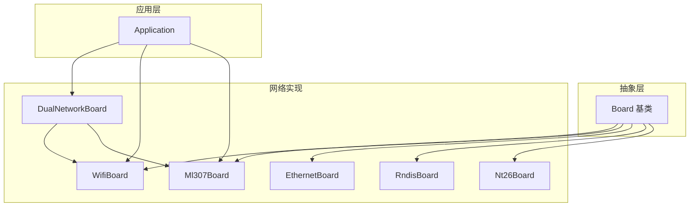
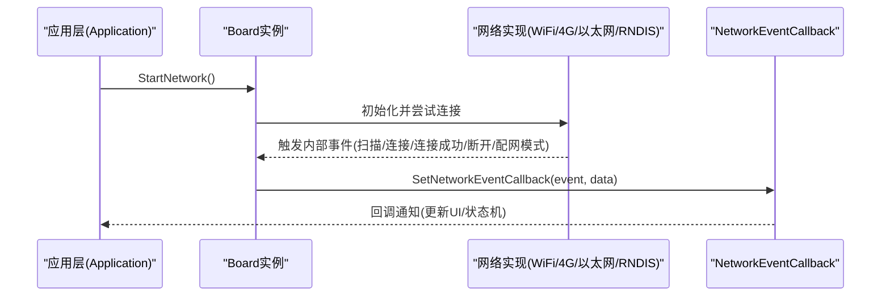
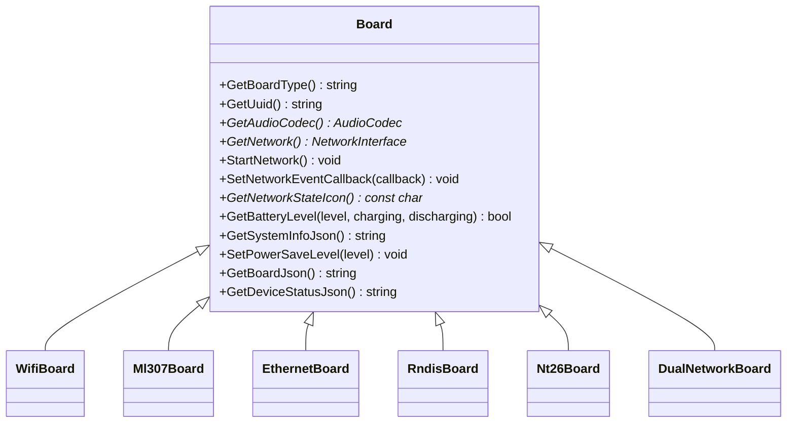

# Board抽象接口设计

<cite>
**本文引用的文件**   
- [board.h](file://main/boards/common/board.h)
- [board.cc](file://main/boards/common/board.cc)
- [wifi_board.h](file://main/boards/common/wifi_board.h)
- [wifi_board.cc](file://main/boards/common/wifi_board.cc)
- [ml307_board.h](file://main/boards/common/ml307_board.h)
- [ml307_board.cc](file://main/boards/common/ml307_board.cc)
- [dual_network_board.h](file://main/boards/common/dual_network_board.h)
- [dual_network_board.cc](file://main/boards/common/dual_network_board.cc)
- [ethernet_board.h](file://main/boards/common/ethernet_board.h)
- [ethernet_board.cc](file://main/boards/common/ethernet_board.cc)
- [rndis_board.h](file://main/boards/common/rndis_board.h)
- [nt26_board.h](file://main/boards/common/nt26_board.h)
- [application.cc](file://main/application.cc)
- [esp32s3_korvo2_v3_board.cc](file://main/boards/esp32s3-korvo2-v3/esp32s3_korvo2_v3_board.cc)
- [atk_dnesp32s3_box2.cc](file://main/boards/atk-dnesp32s3-box2-wifi/atk_dnesp32s3_box2.cc)
- [power_save_timer.cc](file://main/boards/common/power_save_timer.cc)
- [custom-board.md](file://docs/custom-board.md)
</cite>

## 目录
1. [简介](#简介)
2. [项目结构](#项目结构)
3. [核心组件](#核心组件)
4. [架构总览](#架构总览)
5. [详细组件分析](#详细组件分析)
6. [依赖关系分析](#依赖关系分析)
7. [性能与功耗考量](#性能与功耗考量)
8. [故障排查指南](#故障排查指南)
9. [结论](#结论)
10. [附录：新硬件平台适配流程](#附录新硬件平台适配流程)

## 简介
本文件围绕 Board 抽象接口的设计与实现进行深入解析，涵盖基类设计理念、关键方法职责与实现要求、网络事件回调机制、电源管理模式、设备 UUID 生成、系统信息与电池状态接口等。同时提供 WiFi 板与 4G 板的差异化实现说明、双网络支持模式，以及新硬件平台的完整适配流程与最佳实践。

## 项目结构
Board 抽象位于 common 目录，提供统一的硬件抽象层；具体网络类型（WiFi、ML307、以太网、RNDIS）通过继承扩展；双网络桥接类用于在 WiFi 与 4G 之间切换；应用层通过统一回调处理网络事件。

图表来源
- [board.h:49-85](file://main/boards/common/board.h#L49-L85)
- [wifi_board.h:9-67](file://main/boards/common/wifi_board.h#L9-L67)
- [ml307_board.h:9-36](file://main/boards/common/ml307_board.h#L9-L36)
- [ethernet_board.h:8-39](file://main/boards/common/ethernet_board.h#L8-L39)
- [rndis_board.h:17-71](file://main/boards/common/rndis_board.h#L17-L71)
- [nt26_board.h:28-60](file://main/boards/common/nt26_board.h#L28-L60)
- [dual_network_board.h:16-58](file://main/boards/common/dual_network_board.h#L16-L58)
- [application.cc:114-143](file://main/application.cc#L114-L143)

章节来源
- [board.h:49-85](file://main/boards/common/board.h#L49-L85)
- [custom-board.md:398-433](file://docs/custom-board.md#L398-L433)

## 核心组件
- Board 基类
  - 职责：定义硬件抽象的统一接口，提供单例访问、UUID 管理、系统信息 JSON 构建、默认显示/摄像头/LED 返回等。
  - 关键方法：GetBoardType、GetAudioCodec、GetNetwork、StartNetwork、SetNetworkEventCallback、GetNetworkStateIcon、GetBatteryLevel、GetSystemInfoJson、SetPowerSaveLevel、GetBoardJson、GetDeviceStatusJson。
  - 设计要点：纯虚接口强制子类实现网络相关能力；提供可覆盖的默认实现降低接入成本。

- 网络事件回调 NetworkEventCallback
  - 作用：将底层网络事件（扫描、连接、断开、配网模式进入/退出、模组检测与错误等）以统一形式上报给上层。
  - 使用方式：各 Board 子类在内部事件处理中调用 OnNetworkEvent，再转发到外部注册的回调。

- 电源管理模式 PowerSaveLevel
  - 枚举值：LOW_POWER、BALANCED、PERFORMANCE。
  - 策略：不同网络类型有不同实现，如 WiFi 映射到底层省电级别；部分 4G 板结合 PM 锁或休眠定时器调整 CPU 频率与唤醒策略。

- 设备 UUID 生成
  - 机制：首次启动时基于硬件随机数生成 UUID v4，持久化存储于 Settings，后续启动直接读取。

- 系统信息与电池状态
  - GetSystemInfoJson：聚合语言、Flash、堆栈、MAC、芯片信息、应用版本、分区表、OTA 分区、显示参数与板级信息。
  - GetBatteryLevel：默认返回 false，具体板卡需实现电量、充电、放电状态。

章节来源
- [board.h:49-85](file://main/boards/common/board.h#L49-L85)
- [board.cc:15-46](file://main/boards/common/board.cc#L15-L46)
- [board.cc:70-178](file://main/boards/common/board.cc#L70-L178)

## 架构总览
Board 抽象作为统一入口，向上屏蔽底层网络差异；应用层仅依赖 Board 接口与统一事件回调，无需关心具体网络实现。

图表来源
- [board.h:76-78](file://main/boards/common/board.h#L76-L78)
- [wifi_board.cc:52-87](file://main/boards/common/wifi_board.cc#L52-L87)
- [ml307_board.cc:134-141](file://main/boards/common/ml307_board.cc#L134-L141)
- [application.cc:114-143](file://main/application.cc#L114-L143)

## 详细组件分析

### Board 基类与宏 DECLARE_BOARD
- 设计理念
  - 通过纯虚接口约束网络相关能力，确保所有板卡具备一致的网络生命周期管理能力。
  - 提供默认实现减少样板代码（如无屏/无摄像头/无背光时的安全返回）。
  - 通过单例工厂 create_board 与 DECLARE_BOARD 宏简化注册过程。

- 关键方法与约定
  - GetBoardType：返回板卡类型标识字符串，供 OTA 与诊断使用。
  - GetAudioCodec：返回音频编解码器指针，若无则返回空指针。
  - GetNetwork / StartNetwork：获取网络接口与异步启动网络连接。
  - SetNetworkEventCallback：设置网络事件回调，用于 UI 与状态机联动。
  - GetNetworkStateIcon：根据当前网络状态返回图标常量。
  - GetBatteryLevel：查询电量与充放状态，未实现时返回 false。
  - GetSystemInfoJson：输出系统与环境信息 JSON。
  - SetPowerSaveLevel：设置省电级别，具体策略由子类决定。
  - GetBoardJson / GetDeviceStatusJson：输出板级与设备状态 JSON。

- UUID 生成与持久化
  - 构造时从 Settings 读取 uuid，若为空则生成 UUID v4 并保存。
  - 生成过程使用硬件随机源，并按 v4 规范设置版本与变体位。

- 系统信息 JSON 构建
  - 包含语言、Flash 大小、最小空闲堆、MAC、UUID、芯片型号与特性、应用名称/版本/编译时间/IDF 版本/ELF SHA256、分区表、当前 OTA 分区、显示尺寸与是否单色、板级 JSON。

- 宏 DECLARE_BOARD
  - 展开为 create_board 函数，返回 new BOARD_CLASS_NAME()，配合 Board::GetInstance 完成单例创建。

章节来源
- [board.h:49-92](file://main/boards/common/board.h#L49-L92)
- [board.cc:15-46](file://main/boards/common/board.cc#L15-L46)
- [board.cc:70-178](file://main/boards/common/board.cc#L70-L178)

### WiFi 板实现（WifiBoard）
- 功能要点
  - 启动网络：初始化 WiFi 管理器，设置事件回调，尝试连接或进入配网模式。
  - 超时控制：连接超时后自动进入配网模式。
  - 配网模式：支持热点配网、Blufi、声学配网等多种方式（按配置开关）。
  - 网络状态图标：根据 RSSI 强度返回不同图标。
  - 省电策略：将 PowerSaveLevel 映射到底层 WiFi 省电级别。
  - 设备状态 JSON：汇总扬声器音量、屏幕亮度/主题、电池、网络信号强度、芯片温度等。

- 网络事件回调
  - 内部 OnNetworkEvent 统一处理 Scanning/Connecting/Connected/Disconnected/WifiConfigModeEnter/Exit，并转发至外部回调。

章节来源
- [wifi_board.h:9-67](file://main/boards/common/wifi_board.h#L9-L67)
- [wifi_board.cc:52-145](file://main/boards/common/wifi_board.cc#L52-L145)
- [wifi_board.cc:151-197](file://main/boards/common/wifi_board.cc#L151-L197)
- [wifi_board.cc:244-282](file://main/boards/common/wifi_board.cc#L244-L282)
- [wifi_board.cc:284-299](file://main/boards/common/wifi_board.cc#L284-L299)
- [wifi_board.cc:301-357](file://main/boards/common/wifi_board.cc#L301-L357)

### 4G 板实现（Ml307Board）
- 功能要点
  - 异步初始化：StartNetwork 创建任务执行模组检测、网络注册与状态监听。
  - 事件模型：ModemDetecting/Connecting/Connected/Disconnected 及多种错误事件（无SIM、注册拒绝、初始化失败、超时）。
  - 网络状态图标：依据 CSQ 信号强度返回对应图标。
  - 设备状态 JSON：包含音频、屏幕、电池、蜂窝网络运营商与信号等级等。

- 注意
  - 避免阻塞 ReceiveTask，例如不在回调中直接发送 AT 命令。

章节来源
- [ml307_board.h:9-36](file://main/boards/common/ml307_board.h#L9-L36)
- [ml307_board.cc:27-65](file://main/boards/common/ml307_board.cc#L27-L65)
- [ml307_board.cc:67-132](file://main/boards/common/ml307_board.cc#L67-L132)
- [ml307_board.cc:134-145](file://main/boards/common/ml307_board.cc#L134-L145)
- [ml307_board.cc:147-179](file://main/boards/common/ml307_board.cc#L147-L179)
- [ml307_board.cc:186-270](file://main/boards/common/ml307_board.cc#L186-L270)

### 以太网与 RNDIS 板实现（EthernetBoard / RndisBoard）
- EthernetBoard
  - 基于 ESP-IDF 以太网驱动，监听链路上下线与 IP 分配事件，转换为统一网络事件。
  - 提供 MAC 地址与 IP 信息收集，返回 EspNetwork 接口。

- RndisBoard
  - 通过 USB RNDIS 提供网络接口，封装事件与配网逻辑，对外暴露统一 Board 接口。

章节来源
- [ethernet_board.h:8-39](file://main/boards/common/ethernet_board.h#L8-L39)
- [ethernet_board.cc:149-222](file://main/boards/common/ethernet_board.cc#L149-L222)
- [rndis_board.h:17-71](file://main/boards/common/rndis_board.h#L17-L71)

### NT26 4G 板（Nt26Board）
- 特点
  - 维护当前省电级别与 PM 锁，根据 PowerSaveLevel 调整 CPU 最大频率。
  - 提供网络就绪超时处理与异步停止调度。

章节来源
- [nt26_board.h:28-60](file://main/boards/common/nt26_board.h#L28-L60)

### 双网络桥接（DualNetworkBoard）
- 设计模式
  - 组合模式：持有当前活动板卡（WiFi 或 ML307），所有 Board 接口转发至当前板卡。
  - 持久化选择：从 Settings 加载上次选择的网络类型，重启后生效。
  - 切换流程：修改设置、提示用户、延时后重启设备以重新初始化目标网络。

- 事件转发
  - SetNetworkEventCallback 将回调转发至当前板卡，保证上层只注册一次。

章节来源
- [dual_network_board.h:16-58](file://main/boards/common/dual_network_board.h#L16-L58)
- [dual_network_board.cc:10-43](file://main/boards/common/dual_network_board.cc#L10-L43)
- [dual_network_board.cc:45-57](file://main/boards/common/dual_network_board.cc#L45-L57)
- [dual_network_board.cc:64-98](file://main/boards/common/dual_network_board.cc#L64-L98)

### 应用层网络事件处理（Application）
- 行为
  - 接收 NetworkEvent 回调，更新显示通知与状态机事件标志。
  - 对蜂窝模组特定事件进行状态提示（如检测模块、无 SIM、注册拒绝等）。

章节来源
- [application.cc:114-143](file://main/application.cc#L114-L143)

## 依赖关系分析
- 耦合与内聚
  - Board 基类与具体网络实现解耦良好，通过纯虚接口与事件回调降低耦合度。
  - DualNetworkBoard 采用组合模式，内聚性强且易于扩展新的网络类型。

- 外部依赖
  - WiFi 依赖 WifiManager、SsidManager、可选 Blufi/声学配网。
  - 4G 依赖 AtModem/UartEthModem 等模组驱动。
  - 系统信息依赖 SystemInfo、ESP-IDF 运行时 API。

图表来源
- [board.h:49-85](file://main/boards/common/board.h#L49-L85)
- [wifi_board.h:9-67](file://main/boards/common/wifi_board.h#L9-L67)
- [ml307_board.h:9-36](file://main/boards/common/ml307_board.h#L9-L36)
- [ethernet_board.h:8-39](file://main/boards/common/ethernet_board.h#L8-L39)
- [rndis_board.h:17-71](file://main/boards/common/rndis_board.h#L17-L71)
- [nt26_board.h:28-60](file://main/boards/common/nt26_board.h#L28-L60)
- [dual_network_board.h:16-58](file://main/boards/common/dual_network_board.h#L16-L58)

章节来源
- [board.h:49-85](file://main/boards/common/board.h#L49-L85)

## 性能与功耗考量
- WiFi 省电策略
  - 将 PowerSaveLevel 映射到底层 WiFi 省电级别，影响射频与连接策略。
- 4G 省电策略
  - 部分板卡通过 PM 锁限制 CPU 最高频率，或在低电模式下启用休眠定时器。
- 休眠定时器
  - PowerSaveTimer 周期性检查，结合电池充放状态启用/禁用定时任务，降低待机功耗。

章节来源
- [wifi_board.cc:284-299](file://main/boards/common/wifi_board.cc#L284-L299)
- [nt26_board.h:28-60](file://main/boards/common/nt26_board.h#L28-L60)
- [power_save_timer.cc:10-41](file://main/boards/common/power_save_timer.cc#L10-L41)

## 故障排查指南
- WiFi 无法连接
  - 检查是否进入配网模式（超时后自动进入），确认 SSID 列表是否为空。
  - 查看 OnWifiConnectTimeout 是否触发，必要时手动 EnterWifiConfigMode。
- 4G 模组异常
  - 关注 ModemDetecting/ModemErrorNoSim/ModemErrorRegDenied/ModemErrorInitFailed/ModemErrorTimeout 事件。
  - 确认串口引脚与波特率配置，重试次数与等待网络就绪逻辑。
- 双网络切换无效
  - 检查 Settings 中 network.type 是否写入成功，确认重启流程是否执行。
- 电池状态不更新
  - 确认板卡是否实现 GetBatteryLevel，并在充放状态变化时联动省电定时器。

章节来源
- [wifi_board.cc:151-197](file://main/boards/common/wifi_board.cc#L151-L197)
- [ml307_board.cc:31-65](file://main/boards/common/ml307_board.cc#L31-L65)
- [dual_network_board.cc:45-57](file://main/boards/common/dual_network_board.cc#L45-L57)
- [esp32s3_korvo2_v3_board.cc:434-451](file://main/boards/esp32s3-korvo2-v3/esp32s3_korvo2_v3_board.cc#L434-L451)
- [atk_dnesp32s3_box2.cc:433-450](file://main/boards/atk-dnesp32s3-box2-wifi/atk_dnesp32s3_box2.cc#L433-L450)

## 结论
Board 抽象通过统一接口与事件模型，有效屏蔽了多网络类型的差异，提升了系统的可扩展性与可维护性。结合双网络桥接与完善的系统信息/状态 JSON，便于上层应用快速集成与诊断。建议在新平台适配中优先复用现有基类与通用组件，遵循事件驱动与异步初始化原则，确保用户体验与功耗平衡。

## 附录：新硬件平台适配流程
- 步骤概览
  1. 新建板卡类，继承自合适的基类（如 WifiBoard、Ml307Board、DualNetworkBoard）。
  2. 实现必要接口：GetBoardType、GetAudioCodec、GetDisplay、GetBacklight、GetCamera（如有）、GetBatteryLevel（如有）。
  3. 如需自定义网络行为，重写 StartNetwork、SetNetworkEventCallback、GetNetworkStateIcon、SetPowerSaveLevel、GetBoardJson、GetDeviceStatusJson。
  4. 在构造函数中完成外设初始化（I2C/SPI/按钮/显示/背光等）。
  5. 在文件末尾使用 DECLARE_BOARD(YourBoardClass) 注册。
  6. 配置构建系统（MANUFACTURER/BOARD_TYPE），确保源码被正确纳入编译。

- 参考示例路径
  - 自定义板卡示例与组件清单参见文档：[custom-board.md](file://docs/custom-board.md)
  - 典型实现参考：
    - [esp32s3_korvo2_v3_board.cc](file://main/boards/esp32s3-korvo2-v3/esp32s3_korvo2_v3_board.cc)
    - [atk_dnesp32s3_box2.cc](file://main/boards/atk-dnesp32s3-box2-wifi/atk_dnesp32s3_box2.cc)

- 最佳实践
  - 使用统一事件回调更新 UI 与状态机，避免在回调中执行耗时操作。
  - 异步初始化网络，避免阻塞主流程。
  - 合理设置省电级别，结合电池状态启用休眠定时器。
  - 完善 GetBoardJson 与 GetDeviceStatusJson，便于远程诊断与 OTA 管理。

章节来源
- [custom-board.md:147-278](file://docs/custom-board.md#L147-L278)
- [custom-board.md:398-433](file://docs/custom-board.md#L398-L433)
- [esp32s3_korvo2_v3_board.cc:434-451](file://main/boards/esp32s3-korvo2-v3/esp32s3_korvo2_v3_board.cc#L434-L451)
- [atk_dnesp32s3_box2.cc:433-450](file://main/boards/atk-dnesp32s3-box2-wifi/atk_dnesp32s3_box2.cc#L433-L450)