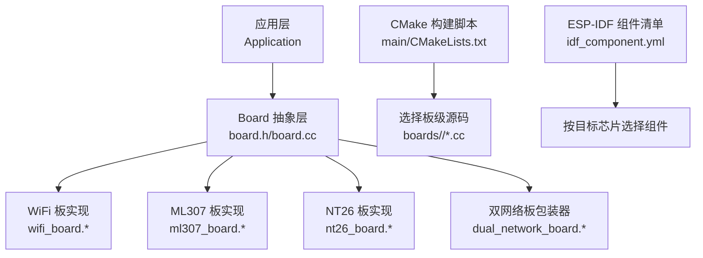
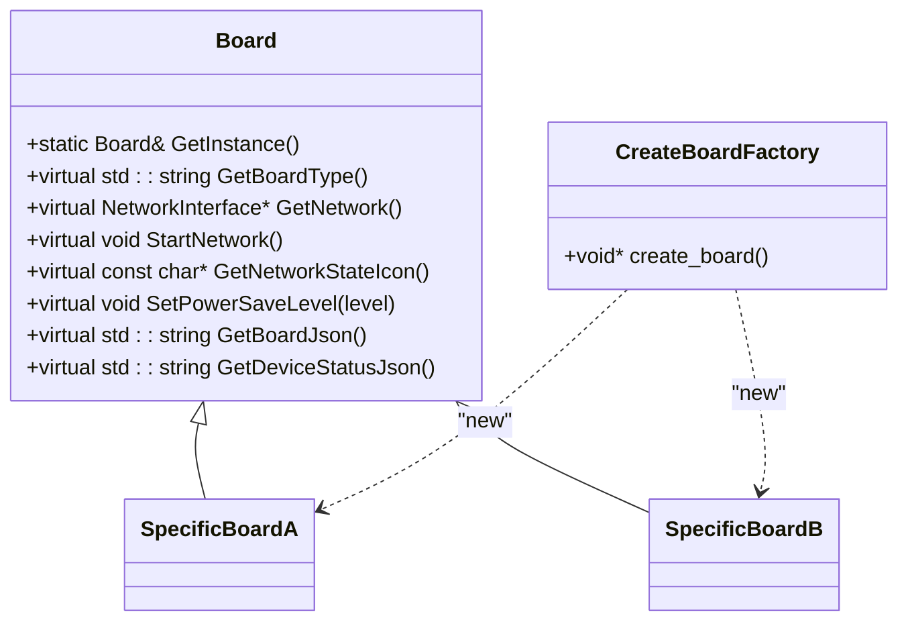
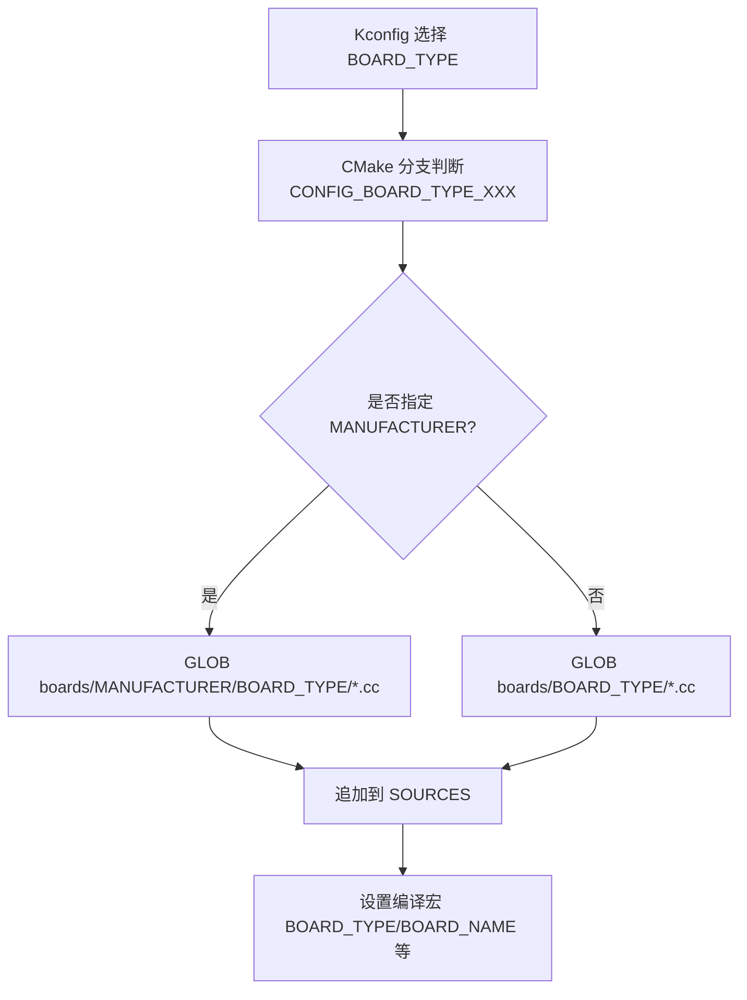
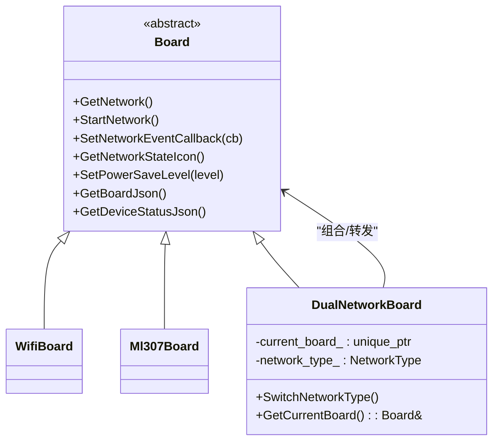
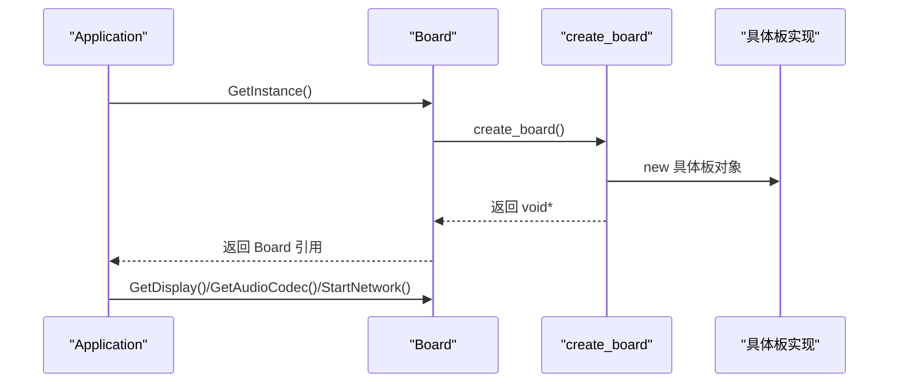
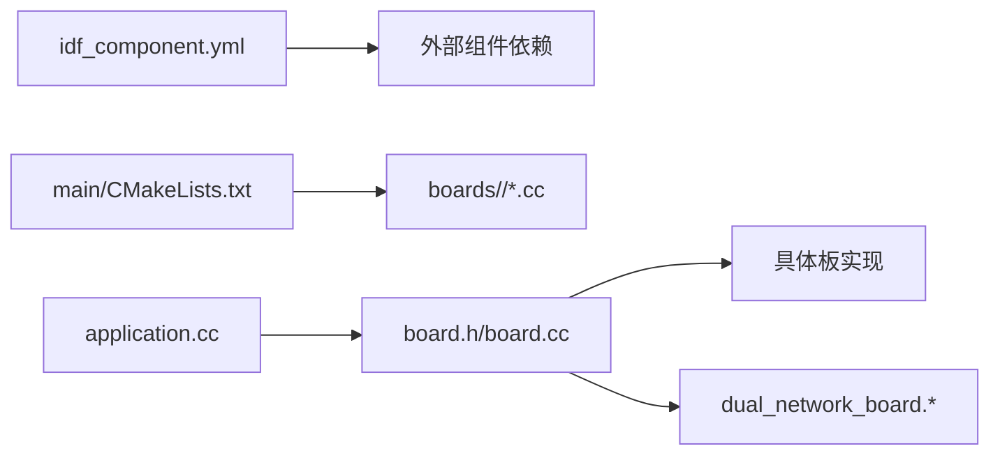

# 工厂模式与动态加载

<cite>
**本文引用的文件**   
- [main/CMakeLists.txt](file://main/CMakeLists.txt)
- [main/boards/common/board.h](file://main/boards/common/board.h)
- [main/boards/common/board.cc](file://main/boards/common/board.cc)
- [main/boards/common/dual_network_board.h](file://main/boards/common/dual_network_board.h)
- [main/boards/common/dual_network_board.cc](file://main/boards/common/dual_network_board.cc)
- [main/application.cc](file://main/application.cc)
- [main/idf_component.yml](file://main/idf_component.yml)
- [docs/custom-board.md](file://docs/custom-board.md)
</cite>

## 目录
1. [简介](#简介)
2. [项目结构](#项目结构)
3. [核心组件](#核心组件)
4. [架构总览](#架构总览)
5. [详细组件分析](#详细组件分析)
6. [依赖关系分析](#依赖关系分析)
7. [性能考量](#性能考量)
8. [故障排除指南](#故障排除指南)
9. [结论](#结论)
10. [附录](#附录)

## 简介
本文件围绕“工厂模式与动态加载机制”展开，系统性阐述：
- create_board 函数的实现原理与 DECLARE_BOARD 宏的板级实例动态创建方式
- CMake 构建系统如何根据配置选择特定板级支持并动态编译
- ESP-IDF 组件管理机制 idf_component.yml 在依赖解析中的作用
- 运行时板级切换的技术实现（以双网络板为例），包括内存管理与生命周期控制
- 插件热插拔的设计考虑与实现方案
- 版本兼容性与向后兼容性保证机制
- 构建配置示例与常见问题排查

## 项目结构
本项目采用“通用抽象 + 多板实现”的分层组织方式：
- 通用抽象层：定义 Board 基类、统一接口与工厂入口 create_board
- 板级实现层：各具体板卡目录提供 Board 子类实现，并通过 DECLARE_BOARD 暴露 create_board
- 构建系统层：CMake 根据 Kconfig 选择的 BOARD_TYPE 动态选择对应板级源文件参与编译
- 组件管理层：idf_component.yml 声明外部组件依赖，按目标芯片条件化引入



图表来源
- [main/CMakeLists.txt:869-880](file://main/CMakeLists.txt#L869-L880)
- [main/boards/common/board.h:46-90](file://main/boards/common/board.h#L46-L90)
- [main/boards/common/dual_network_board.h:1-60](file://main/boards/common/dual_network_board.h#L1-L60)
- [main/idf_component.yml:1-151](file://main/idf_component.yml#L1-L151)

章节来源
- [main/CMakeLists.txt:869-880](file://main/CMakeLists.txt#L869-L880)
- [main/boards/common/board.h:46-90](file://main/boards/common/board.h#L46-L90)
- [main/idf_component.yml:1-151](file://main/idf_component.yml#L1-L151)

## 核心组件
- Board 抽象类与工厂入口
  - 提供统一的硬件能力抽象（显示、音频、网络、电量等）
  - 通过静态单例获取当前板实例，内部调用 create_board 完成动态创建
- DECLARE_BOARD 宏
  - 在每个板级实现中声明 create_board，返回该板类的 new 实例
- 双网络板 DualNetworkBoard
  - 作为包装器，在 WiFi 与 ML307 之间进行运行时切换，转发所有 Board 接口
- Application 应用层
  - 初始化阶段通过 Board::GetInstance() 获取板实例，驱动 UI、音频、网络等子系统

章节来源
- [main/boards/common/board.h:46-90](file://main/boards/common/board.h#L46-L90)
- [main/boards/common/board.cc:15-23](file://main/boards/common/board.cc#L15-L23)
- [main/boards/common/dual_network_board.h:1-60](file://main/boards/common/dual_network_board.h#L1-L60)
- [main/application.cc:61-67](file://main/application.cc#L61-L67)

## 架构总览
下图展示了从构建期到运行期的完整链路：Kconfig 选择 BOARD_TYPE → CMake 选择板级源码 → 链接时生成 create_board → 运行时 Board::GetInstance 调用 create_board 构造具体板对象。

```mermaid
sequenceDiagram
participant Dev as "开发者"
participant Cfg as "Kconfig/SDKConfig"
participant CMake as "CMake 构建脚本"
participant Link as "链接器"
participant App as "Application"
participant Board as "Board 抽象"
participant Impl as "具体板实现"
Dev->>Cfg : 选择 BOARD_TYPE
Cfg-->>CMake : 生成 CONFIG_BOARD_TYPE_*
CMake->>CMake : 根据 BOARD_TYPE 选择 boards/<TYPE>/*.cc
CMake->>Link : 将选中的板级源码加入编译单元
Link-->>App : 导出 create_board 符号
App->>Board : Board : : GetInstance()
Board->>Impl : create_board() 返回 new 实例
Board-->>App : 返回 Board 指针
```

图表来源
- [main/CMakeLists.txt:89-880](file://main/CMakeLists.txt#L89-L880)
- [main/boards/common/board.h:46-90](file://main/boards/common/board.h#L46-L90)
- [main/application.cc:61-67](file://main/application.cc#L61-L67)

## 详细组件分析

### 工厂函数与宏：create_board 与 DECLARE_BOARD
- 设计要点
  - Board 抽象层声明全局工厂函数 void* create_board()
  - 每个板级实现通过 DECLARE_BOARD(ClassName) 宏生成对应的 create_board，返回 new ClassName()
  - Board::GetInstance() 使用静态局部指针保存唯一实例，首次访问时调用 create_board 完成构造
- 优点
  - 解耦：上层仅依赖抽象接口，不感知具体板类
  - 可扩展：新增板只需添加实现与宏，无需修改上层逻辑
  - 可测试：可通过替换 create_board 注入 Mock 板用于单元测试



图表来源
- [main/boards/common/board.h:46-90](file://main/boards/common/board.h#L46-L90)

章节来源
- [main/boards/common/board.h:46-90](file://main/boards/common/board.h#L46-L90)
- [main/boards/common/board.cc:15-23](file://main/boards/common/board.cc#L15-L23)

### CMake 动态编译与板级选择
- 机制说明
  - 通过 Kconfig 选择 BOARD_TYPE，CMake 在 main/CMakeLists.txt 中将 CONFIG_BOARD_TYPE_* 映射为字符串 BOARD_TYPE
  - 使用 file(GLOB ...) 收集 boards/${BOARD_TYPE}/*.cc 或 boards/${MANUFACTURER}/${BOARD_TYPE}/*.cc 加入 SOURCES
  - 同时设置编译宏 BOARD_TYPE、BOARD_NAME 以及字体/表情集合等常量，供运行时使用
- 扩展性
  - 新增板类型仅需在 Kconfig 增加选项并在 CMake 分支中添加映射与资源策略
  - 支持按厂商子目录组织，便于多品牌多型号管理



图表来源
- [main/CMakeLists.txt:89-880](file://main/CMakeLists.txt#L89-L880)

章节来源
- [main/CMakeLists.txt:89-880](file://main/CMakeLists.txt#L89-L880)

### ESP-IDF 组件管理：idf_component.yml 的作用
- 作用范围
  - 集中声明项目对外部组件的依赖及版本约束
  - 通过 rules/if 条件按目标芯片（esp32/esp32s3/esp32p4 等）选择性引入组件
- 典型场景
  - 不同屏幕驱动、触摸控制器、摄像头、视频播放、语音识别等组件按平台差异化引入
  - 确保构建产物最小化且与目标硬件匹配

章节来源
- [main/idf_component.yml:1-151](file://main/idf_component.yml#L1-L151)

### 运行时板级切换：DualNetworkBoard 设计与实现
- 设计目标
  - 在不改变上层代码的前提下，于运行时在 WiFi 与 ML307 两种网络路径间切换
- 关键实现
  - 内部持有 std::unique_ptr<Board> current_board_，指向当前生效的网络板实现
  - 重写 Board 的所有虚方法，将调用转发给 current_board_
  - 提供 SwitchNetworkType() 切换网络类型，并从 Settings 持久化当前选择
  - 构造函数接收 ML307 相关引脚参数，完成底层初始化
- 内存与生命周期
  - 使用智能指针管理内部板对象，避免手动释放
  - 切换时销毁旧对象并构造新对象，确保资源正确清理
  - 对外仍暴露稳定的 Board 接口，上层无感知



图表来源
- [main/boards/common/dual_network_board.h:1-60](file://main/boards/common/dual_network_board.h#L1-L60)
- [main/boards/common/dual_network_board.cc:73-98](file://main/boards/common/dual_network_board.cc#L73-L98)

章节来源
- [main/boards/common/dual_network_board.h:1-60](file://main/boards/common/dual_network_board.h#L1-L60)
- [main/boards/common/dual_network_board.cc:73-98](file://main/boards/common/dual_network_board.cc#L73-L98)

### 应用启动流程与工厂集成
- 启动顺序
  - Application::Initialize 获取 Board 单例，依次初始化显示、音频服务、网络回调
  - 通过 Board::StartNetwork 异步启动网络；事件驱动更新 UI 状态
- 工厂集成点
  - Board::GetInstance 内部调用 create_board 完成具体板对象的构造
  - 上层仅依赖 Board 抽象，屏蔽了具体板差异



图表来源
- [main/application.cc:61-67](file://main/application.cc#L61-L67)
- [main/boards/common/board.h:46-90](file://main/boards/common/board.h#L46-L90)

章节来源
- [main/application.cc:61-67](file://main/application.cc#L61-L67)
- [main/boards/common/board.h:46-90](file://main/boards/common/board.h#L46-L90)

### 插件热插拔的设计考虑与实现方案
- 设计原则
  - 保持稳定的抽象接口（如 Board、Protocol、AssetStrategy 等）
  - 通过工厂/注册表机制在运行时发现并加载插件
- 可行方案
  - 基于 create_board 的扩展：为“功能插件”定义统一接口与工厂函数命名约定，由框架扫描并注册
  - 基于组件清单：利用 idf_component.yml 的条件规则按需启用插件组件
  - 基于分区/文件系统：将插件二进制或资源打包至独立分区，运行时 mmap 加载并解析元数据
- 注意事项
  - 版本对齐：插件 ABI 需与宿主稳定接口保持一致
  - 安全校验：对加载的插件进行完整性校验与权限控制
  - 资源隔离：避免插件间共享可变全局状态，必要时使用进程/任务边界

[本节为概念性内容，不直接分析具体文件]

### 版本兼容性与向后兼容性保证
- 构建期
  - Kconfig 与 CMake 分支严格限定可选板型，避免误配导致不可用固件
  - idf_component.yml 的版本约束与 target 规则确保依赖与目标芯片一致
- 运行期
  - Board 抽象保持稳定，新增能力通过可选虚方法与默认实现保障向下兼容
  - 双网络板包装器在不改变上层 API 的前提下增强能力
- OTA 与资产
  - 应用层在激活流程中检查并升级固件与资源，失败回退保证可用

章节来源
- [main/idf_component.yml:1-151](file://main/idf_component.yml#L1-L151)
- [main/application.cc:323-338](file://main/application.cc#L323-L338)

## 依赖关系分析
- 组件依赖
  - 屏幕驱动、触摸、摄像头、视频、语音等组件通过 idf_component.yml 按目标芯片条件化引入
- 板级依赖
  - 通过 CMake 的 GLOB 将选定板目录下的 .cc/.c 加入编译单元
- 运行时依赖
  - Application 依赖 Board 抽象；Board 依赖具体板实现；双网络板组合具体网络板



图表来源
- [main/idf_component.yml:1-151](file://main/idf_component.yml#L1-L151)
- [main/CMakeLists.txt:869-880](file://main/CMakeLists.txt#L869-L880)
- [main/application.cc:61-67](file://main/application.cc#L61-L67)

章节来源
- [main/idf_component.yml:1-151](file://main/idf_component.yml#L1-L151)
- [main/CMakeLists.txt:869-880](file://main/CMakeLists.txt#L869-L880)

## 性能考量
- 构建期
  - 精准选择板级源码，减少无用代码与资源占用
  - 按目标芯片条件化引入组件，降低镜像体积
- 运行期
  - 工厂模式避免运行时分支判断开销
  - 双网络板通过转发调用，保持零拷贝与低延迟
  - 合理设置电源模式（低功耗/平衡/高性能）以适配不同阶段需求

[本节为通用指导，不直接分析具体文件]

## 故障排除指南
- 无法选择板型
  - 确认 Kconfig 已添加 BOARD_TYPE 选项，CMake 分支已映射
  - 参考自定义板文档的步骤与示例
- 编译报错找不到板级源
  - 检查 BOARD_TYPE 与目录名一致，或 MANUFACTURER 与子目录一致
  - 确认 file(GLOB ...) 能匹配到 *.cc/*.c
- 运行时崩溃或功能异常
  - 核对 config.h 引脚定义与实际硬件一致
  - 检查音频编解码器、显示屏、触摸控制器等外设初始化顺序
- 双网络切换无效
  - 确认 Settings 中网络类型持久化是否正确
  - 检查 ML307 串口引脚与 DTR 控制线连接

章节来源
- [docs/custom-board.md:281-331](file://docs/custom-board.md#L281-L331)
- [main/CMakeLists.txt:869-880](file://main/CMakeLists.txt#L869-L880)

## 结论
本项目通过“工厂模式 + 宏 + CMake 动态编译 + 组件清单”的组合，实现了高度可扩展的板级抽象与动态加载机制。上层应用仅依赖 Board 抽象，新增板型成本低、风险小；双网络板进一步演示了运行时切换与资源管理的最佳实践。配合完善的构建与组件管理，项目在可维护性、可移植性与可演进性方面具备良好基础。

## 附录
- 构建配置示例（参考自定义板文档）
  - 在 Kconfig 中新增 BOARD_TYPE_MY_CUSTOM_BOARD 选项
  - 在 CMake 分支中设置 BOARD_TYPE、字体与表情集合
  - 使用 release.py 自动化构建与打包
- 常用命令
  - idf.py set-target esp32s3
  - idf.py menuconfig（选择 Board Type）
  - idf.py build && idf.py flash monitor

章节来源
- [docs/custom-board.md:331-375](file://docs/custom-board.md#L331-L375)