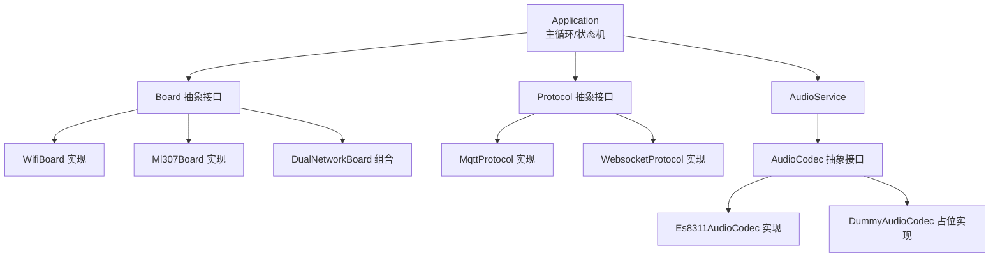
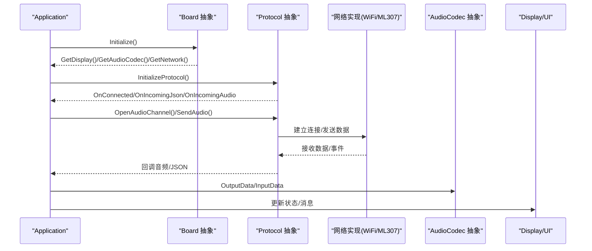
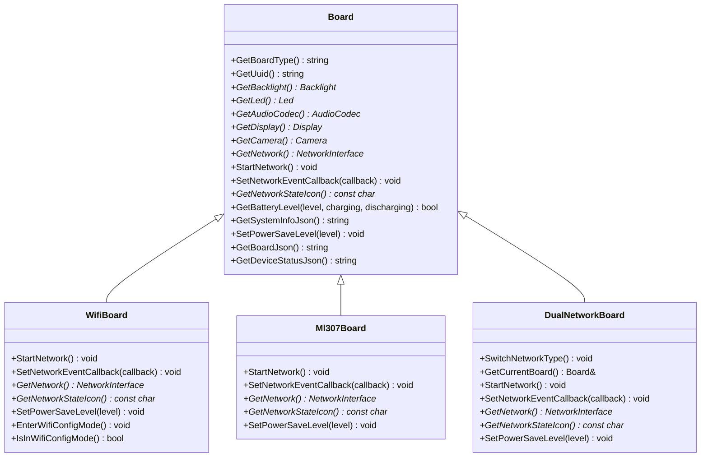
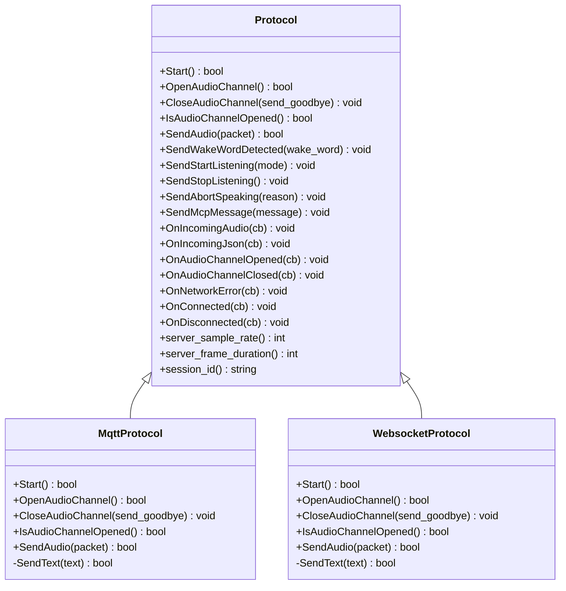
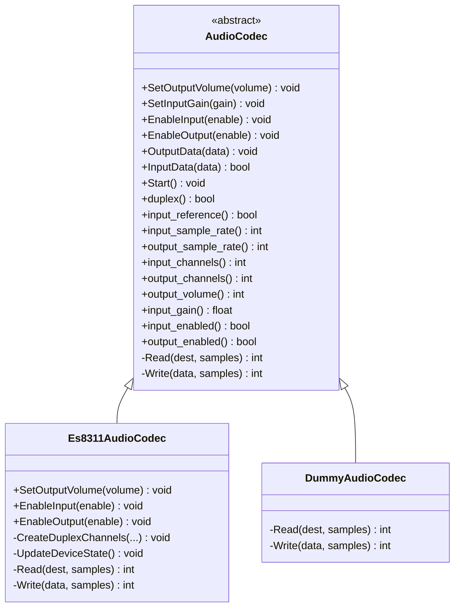
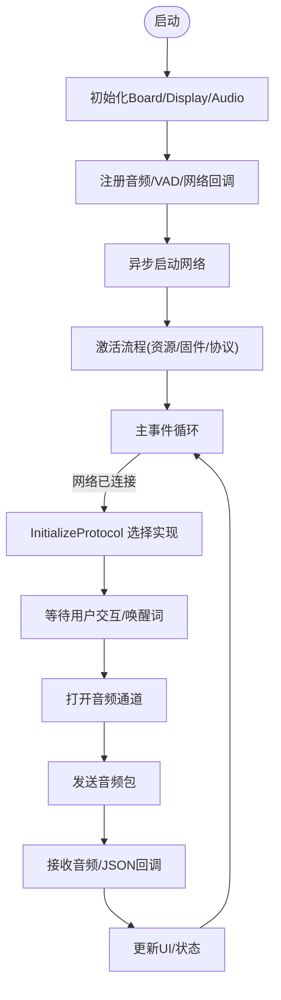
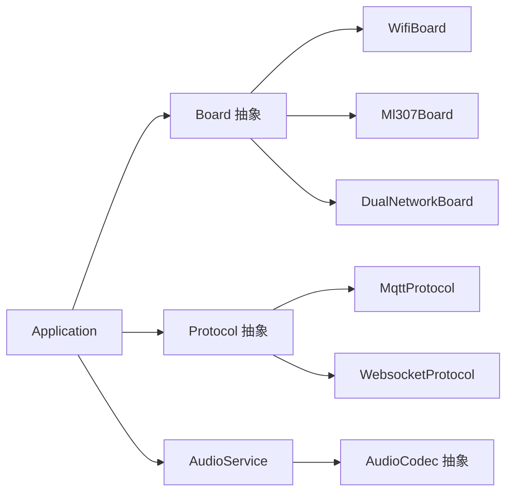
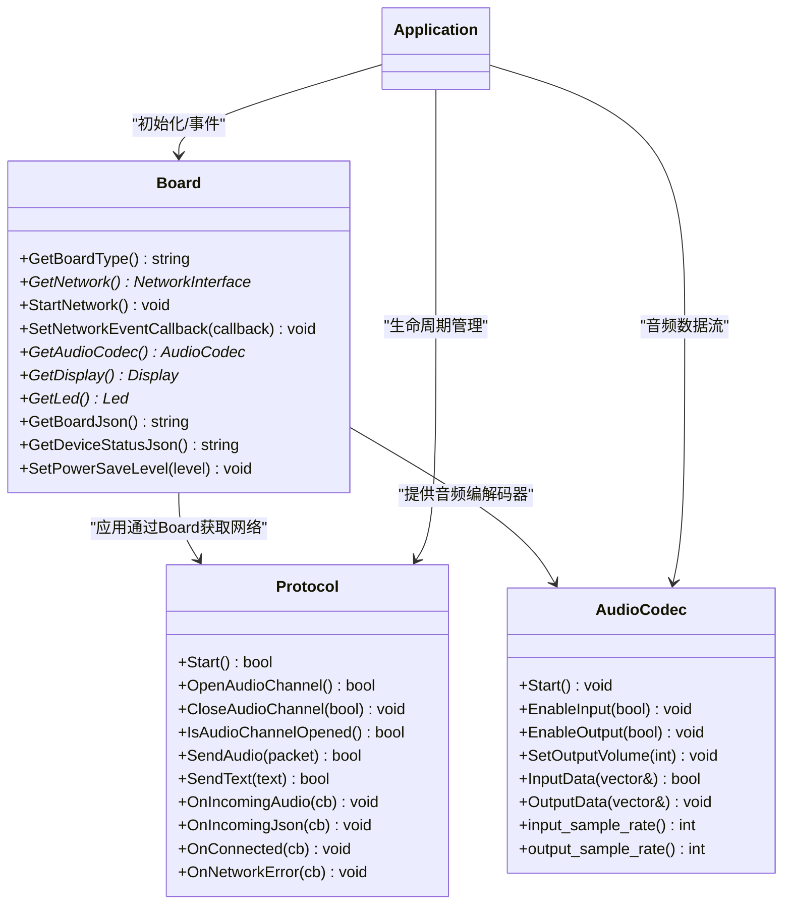

# 模块化插件设计

<cite>
**本文引用的文件**   
- [board.h](file://main/boards/common/board.h)
- [board.cc](file://main/boards/common/board.cc)
- [wifi_board.h](file://main/boards/common/wifi_board.h)
- [ml307_board.h](file://main/boards/common/ml307_board.h)
- [dual_network_board.h](file://main/boards/common/dual_network_board.h)
- [audio_codec.h](file://main/audio/audio_codec.h)
- [es8311_audio_codec.h](file://main/audio/codecs/es8311_audio_codec.h)
- [dummy_audio_codec.h](file://main/audio/codecs/dummy_audio_codec.h)
- [protocol.h](file://main/protocols/protocol.h)
- [mqtt_protocol.h](file://main/protocols/mqtt_protocol.h)
- [websocket_protocol.h](file://main/protocols/websocket_protocol.h)
- [application.h](file://main/application.h)
- [application.cc](file://main/application.cc)
</cite>

## 目录
1. [引言](#引言)
2. [项目结构](#项目结构)
3. [核心组件](#核心组件)
4. [架构总览](#架构总览)
5. [详细组件分析](#详细组件分析)
6. [依赖关系分析](#依赖关系分析)
7. [性能与扩展性考量](#性能与扩展性考量)
8. [故障排查指南](#故障排查指南)
9. [结论](#结论)
10. [附录：扩展示例与开发流程](#附录扩展示例与开发流程)

## 引言
本设计文档面向小智AI聊天机器人的“模块化插件化”架构，围绕以下目标展开：
- 通过抽象接口实现高内聚、低耦合的硬件适配层，支持70+种硬件平台快速接入。
- 定义Board抽象接口、Protocol通信协议抽象、AudioCodec音频编解码器接口，形成清晰的插件边界。
- 说明工厂模式与动态加载机制，解释如何在不修改核心应用逻辑的前提下扩展新硬件、新协议与新音频格式。
- 提供接口设计图与扩展示例路径，指导开发者完成新平台、新协议、新音频格式的集成。
- 强调向后兼容性与可维护性，确保新增能力不影响既有功能。

## 项目结构
系统采用分层与插件化相结合的组织方式：
- 应用层（Application）：负责状态机、事件循环、协议生命周期管理、UI与音频服务协调。
- 硬件抽象层（Board）：统一对外暴露显示、LED、摄像头、网络、电源管理等能力；具体板卡实现位于 boards 目录下。
- 通信协议层（Protocol）：抽象出统一的音视频通道与消息收发接口；MQTT与WebSocket为两种具体实现。
- 音频子系统（Audio）：以AudioCodec为抽象，封装I2S/编解码驱动细节，提供输入输出与参数配置。

图表来源
- [application.h:1-194](file://main/application.h#L1-L194)
- [application.cc:1-800](file://main/application.cc#L1-L800)
- [board.h:1-93](file://main/boards/common/board.h#L1-L93)
- [wifi_board.h:1-70](file://main/boards/common/wifi_board.h#L1-L70)
- [ml307_board.h:1-39](file://main/boards/common/ml307_board.h#L1-L39)
- [dual_network_board.h:1-60](file://main/boards/common/dual_network_board.h#L1-L60)
- [protocol.h:1-99](file://main/protocols/protocol.h#L1-L99)
- [mqtt_protocol.h:1-66](file://main/protocols/mqtt_protocol.h#L1-L66)
- [websocket_protocol.h:1-35](file://main/protocols/websocket_protocol.h#L1-L35)
- [audio_codec.h:1-62](file://main/audio/audio_codec.h#L1-L62)
- [es8311_audio_codec.h:1-42](file://main/audio/codecs/es8311_audio_codec.h#L1-L42)
- [dummy_audio_codec.h:1-16](file://main/audio/codecs/dummy_audio_codec.h#L1-L16)

章节来源
- [application.h:1-194](file://main/application.h#L1-L194)
- [application.cc:1-800](file://main/application.cc#L1-L800)
- [board.h:1-93](file://main/boards/common/board.h#L1-L93)

## 核心组件
- Board 抽象接口
  - 职责：统一设备能力访问点，包括类型标识、UUID、背光、LED、音频编解码器、摄像头、网络接口、网络事件回调、电量/温度、系统信息JSON等。
  - 关键方法：GetBoardType、GetUuid、GetBacklight、GetLed、GetAudioCodec、GetDisplay、GetCamera、GetNetwork、StartNetwork、SetNetworkEventCallback、GetNetworkStateIcon、GetBatteryLevel、GetSystemInfoJson、SetPowerSaveLevel、GetBoardJson、GetDeviceStatusJson。
  - 工厂宏：DECLARE_BOARD(BOARD_CLASS_NAME) 用于在链接期生成 create_board()，配合单例获取实例。
- Protocol 抽象接口
  - 职责：屏蔽底层传输差异，提供统一的音频通道与文本消息收发、连接/断开回调、错误处理、会话ID与服务器采样率/帧长查询等。
  - 关键方法：Start、OpenAudioChannel、CloseAudioChannel、IsAudioChannelOpened、SendAudio、SendText、SendWakeWordDetected、SendStartListening、SendStopListening、SendAbortSpeaking、SendMcpMessage。
  - 回调：OnIncomingAudio、OnIncomingJson、OnAudioChannelOpened/Closed、OnNetworkError、OnConnected、OnDisconnected。
- AudioCodec 抽象接口
  - 职责：屏蔽I2S/编解码驱动差异，提供音量/增益控制、输入输出使能、数据读写、启动停止、双工/参考通道/采样率/声道数等属性访问。
  - 关键方法：SetOutputVolume、SetInputGain、EnableInput、EnableOutput、OutputData、InputData、Start、Read/Write（受保护）。
- Application 应用编排
  - 职责：初始化显示/音频/网络、注册回调、事件循环、协议生命周期管理、状态机驱动、OTA升级与激活流程。
  - 关键点：InitializeProtocol根据配置选择具体Protocol实现；Run主循环分发事件；Handle*系列方法处理网络/语音/唤醒等事件。

章节来源
- [board.h:1-93](file://main/boards/common/board.h#L1-L93)
- [protocol.h:1-99](file://main/protocols/protocol.h#L1-L99)
- [audio_codec.h:1-62](file://main/audio/audio_codec.h#L1-L62)
- [application.h:1-194](file://main/application.h#L1-L194)
- [application.cc:1-800](file://main/application.cc#L1-L800)

## 架构总览
下图展示了从应用到硬件/协议的调用链与数据流，体现“应用-抽象-实现”的分层解耦。

图表来源
- [application.cc:1-800](file://main/application.cc#L1-L800)
- [board.h:1-93](file://main/boards/common/board.h#L1-L93)
- [protocol.h:1-99](file://main/protocols/protocol.h#L1-L99)
- [wifi_board.h:1-70](file://main/boards/common/wifi_board.h#L1-L70)
- [ml307_board.h:1-39](file://main/boards/common/ml307_board.h#L1-L39)
- [audio_codec.h:1-62](file://main/audio/audio_codec.h#L1-L62)

## 详细组件分析

### Board 抽象与工厂/动态加载
- 设计要点
  - 单例入口：Board::GetInstance 通过全局函数 create_board() 返回具体板卡对象指针，避免硬编码。
  - 工厂宏：DECLARE_BOARD(YourBoard) 自动生成 create_board()，将具体类注入运行时。
  - 默认实现：Board::GetDisplay/GetLed 提供无操作或最小可用实现，降低新板卡门槛。
  - 网络抽象：StartNetwork 异步启动，SetNetworkEventCallback 上报扫描/连接/断开/调制解调器事件等。
- 典型继承体系
  - WifiBoard：基于WiFi的连接管理、超时重试、配网模式。
  - Ml307Board：基于AT指令的蜂窝网络任务化初始化与事件上报。
  - DualNetworkBoard：组合WiFi与ML307，运行时切换当前活动网络。

图表来源
- [board.h:1-93](file://main/boards/common/board.h#L1-L93)
- [wifi_board.h:1-70](file://main/boards/common/wifi_board.h#L1-L70)
- [ml307_board.h:1-39](file://main/boards/common/ml307_board.h#L1-L39)
- [dual_network_board.h:1-60](file://main/boards/common/dual_network_board.h#L1-L60)

章节来源
- [board.h:1-93](file://main/boards/common/board.h#L1-L93)
- [board.cc:1-179](file://main/boards/common/board.cc#L1-L179)
- [wifi_board.h:1-70](file://main/boards/common/wifi_board.h#L1-L70)
- [ml307_board.h:1-39](file://main/boards/common/ml307_board.h#L1-L39)
- [dual_network_board.h:1-60](file://main/boards/common/dual_network_board.h#L1-L60)

### Protocol 抽象与多实现
- 设计要点
  - 统一音频通道：OpenAudioChannel/CloseAudioChannel/IsAudioChannelOpened/SendAudio。
  - 统一文本通道：SendText（由具体实现提供），以及通用命令 SendWakeWordDetected/SendStartListening/SendStopListening/SendAbortSpeaking/SendMcpMessage。
  - 回调模型：OnIncomingAudio/OnIncomingJson/OnAudioChannelOpened/Closed/OnNetworkError/OnConnected/OnDisconnected。
  - 运行时选择：Application::InitializeProtocol 依据配置创建具体协议实例（MQTT或WebSocket）。
- 典型实现
  - MqttProtocol：基于MQTT/UDP，包含心跳、重连、AES加解密、序列号等。
  - WebsocketProtocol：基于WebSocket，握手与文本/二进制消息收发。

图表来源
- [protocol.h:1-99](file://main/protocols/protocol.h#L1-L99)
- [mqtt_protocol.h:1-66](file://main/protocols/mqtt_protocol.h#L1-L66)
- [websocket_protocol.h:1-35](file://main/protocols/websocket_protocol.h#L1-L35)

章节来源
- [protocol.h:1-99](file://main/protocols/protocol.h#L1-L99)
- [mqtt_protocol.h:1-66](file://main/protocols/mqtt_protocol.h#L1-L66)
- [websocket_protocol.h:1-35](file://main/protocols/websocket_protocol.h#L1-L35)
- [application.cc:1-800](file://main/application.cc#L1-L800)

### AudioCodec 抽象与具体实现
- 设计要点
  - 输入输出抽象：InputData/OutputData 面向上层队列，内部 Read/Write 对接I2S/编解码驱动。
  - 参数控制：SetOutputVolume/SetInputGain/EnableInput/EnableOutput/Start。
  - 属性访问：duplex/input_reference/input_sample_rate/output_sample_rate/input_channels/output_channels 等。
- 典型实现
  - Es8311AudioCodec：基于ESP-Codec-Dev与I2C/I2S，提供完整音频通路。
  - DummyAudioCodec：占位实现，便于在无硬件时编译运行。

图表来源
- [audio_codec.h:1-62](file://main/audio/audio_codec.h#L1-L62)
- [es8311_audio_codec.h:1-42](file://main/audio/codecs/es8311_audio_codec.h#L1-L42)
- [dummy_audio_codec.h:1-16](file://main/audio/codecs/dummy_audio_codec.h#L1-L16)

章节来源
- [audio_codec.h:1-62](file://main/audio/audio_codec.h#L1-L62)
- [es8311_audio_codec.h:1-42](file://main/audio/codecs/es8311_audio_codec.h#L1-L42)
- [dummy_audio_codec.h:1-16](file://main/audio/codecs/dummy_audio_codec.h#L1-L16)

### 应用编排与协议初始化流程
- 初始化顺序
  - 获取Board单例，设置显示与音频服务，注册音频/VAD/唤醒回调。
  - 注册网络事件回调，异步启动网络。
  - 激活阶段检查资源版本与固件版本，随后根据配置创建具体Protocol实例并注册回调。
- 主循环事件分发
  - 网络连接/断开、唤醒词检测、VAD变化、定时时钟、任务调度等事件统一进入Run循环处理。
  - 音频发送队列触发时，从队列取包并通过Protocol发送。

图表来源
- [application.cc:1-800](file://main/application.cc#L1-L800)
- [application.h:1-194](file://main/application.h#L1-L194)

章节来源
- [application.cc:1-800](file://main/application.cc#L1-L800)
- [application.h:1-194](file://main/application.h#L1-L194)

## 依赖关系分析
- 松耦合原则
  - Application 仅依赖 Board/Protocol/AudioCodec 抽象，不感知具体实现。
  - Board 抽象屏蔽不同网络栈（WiFi/ML307）与外设差异。
  - Protocol 抽象屏蔽传输层（MQTT/WebSocket）差异。
  - AudioCodec 抽象屏蔽I2S/编解码驱动差异。
- 可能的环与规避
  - 通过头文件前向声明与只引入必要接口，避免循环依赖。
  - 工厂宏与单例模式将构造时机推迟至运行时，减少编译期耦合。

图表来源
- [application.h:1-194](file://main/application.h#L1-L194)
- [board.h:1-93](file://main/boards/common/board.h#L1-L93)
- [protocol.h:1-99](file://main/protocols/protocol.h#L1-L99)
- [audio_codec.h:1-62](file://main/audio/audio_codec.h#L1-L62)

章节来源
- [application.h:1-194](file://main/application.h#L1-L194)
- [board.h:1-93](file://main/boards/common/board.h#L1-L93)
- [protocol.h:1-99](file://main/protocols/protocol.h#L1-L99)
- [audio_codec.h:1-62](file://main/audio/audio_codec.h#L1-L62)

## 性能与扩展性考量
- 功耗策略
  - 通过 SetPowerSaveLevel 在空闲/低功耗与高性能之间切换，降低待机功耗并在通话时提升性能。
- 事件驱动
  - 使用事件组与定时器，避免忙轮询，提高CPU利用率。
- 可扩展性
  - 新增硬件：实现 Board 子类并 DECLARE_BOARD，无需改动应用层。
  - 新增协议：实现 Protocol 子类，并在初始化处增加选择分支。
  - 新增音频格式：实现 AudioCodec 子类，替换 GetAudioCodec 返回实例。
- 向后兼容
  - 抽象接口保持稳定的虚函数签名；新增可选能力以默认实现兜底，避免破坏既有板卡。

[本节为通用指导，不涉及具体文件分析]

## 故障排查指南
- 常见问题定位
  - 网络未连接：检查 Board::StartNetwork 是否被调用、网络事件回调是否触发、图标/通知是否正确更新。
  - 协议未初始化：确认 InitializeProtocol 是否按配置选择了正确实现，OnConnected/OnNetworkError 回调是否注册。
  - 音频异常：检查 AudioCodec 的 EnableInput/EnableOutput 与 Start 调用顺序，确认采样率/声道匹配。
- 日志与调试
  - 利用 ESP_LOG 与系统信息 JSON（GetSystemInfoJson）辅助定位分区、芯片与应用版本。
  - 使用设备状态机与事件标志位，结合 UI 提示进行问题复现。

章节来源
- [board.cc:1-179](file://main/boards/common/board.cc#L1-L179)
- [application.cc:1-800](file://main/application.cc#L1-L800)

## 结论
本设计通过 Board/Protocol/AudioCodec 三层抽象，结合工厂宏与单例模式，实现了高度模块化的插件架构。应用层仅依赖抽象接口，硬件、协议与音频能力的扩展均以“新增实现+轻量装配”的方式完成，既保证了高内聚低耦合，又兼顾了向后兼容与可维护性。

[本节为总结性内容，不涉及具体文件分析]

## 附录：扩展示例与开发流程

### 新增硬件平台（Board 插件）
- 步骤
  - 新建 YourBoard 类，继承 Board，实现所有纯虚方法（如 GetBoardType、GetNetwork、StartNetwork、GetBoardJson、GetDeviceStatusJson、SetPowerSaveLevel 等）。
  - 在板卡源文件中添加 DECLARE_BOARD(YourBoard) 宏，生成 create_board()。
  - 在构建配置中启用该板卡，确保 Board::GetInstance 能返回 YourBoard 实例。
- 参考路径
  - [board.h:1-93](file://main/boards/common/board.h#L1-L93)
  - [wifi_board.h:1-70](file://main/boards/common/wifi_board.h#L1-L70)
  - [ml307_board.h:1-39](file://main/boards/common/ml307_board.h#L1-L39)
  - [dual_network_board.h:1-60](file://main/boards/common/dual_network_board.h#L1-L60)

### 新增通信协议（Protocol 插件）
- 步骤
  - 新建 YourProtocol 类，继承 Protocol，实现 Start/OpenAudioChannel/CloseAudioChannel/IsAudioChannelOpened/SendAudio/SendText 等。
  - 在 Application::InitializeProtocol 中增加条件分支，根据配置创建 YourProtocol 实例。
  - 注册必要的回调（OnIncomingAudio/OnIncomingJson/OnConnected/OnNetworkError 等）。
- 参考路径
  - [protocol.h:1-99](file://main/protocols/protocol.h#L1-L99)
  - [mqtt_protocol.h:1-66](file://main/protocols/mqtt_protocol.h#L1-L66)
  - [websocket_protocol.h:1-35](file://main/protocols/websocket_protocol.h#L1-L35)
  - [application.cc:1-800](file://main/application.cc#L1-L800)

### 新增音频格式/编解码器（AudioCodec 插件）
- 步骤
  - 新建 YourAudioCodec 类，继承 AudioCodec，实现 Read/Write 与必要的控制方法（SetOutputVolume/EnableInput/EnableOutput/Start）。
  - 在对应板卡的 GetAudioCodec 中返回 YourAudioCodec 实例。
  - 验证采样率/声道/双工模式与上层期望一致。
- 参考路径
  - [audio_codec.h:1-62](file://main/audio/audio_codec.h#L1-L62)
  - [es8311_audio_codec.h:1-42](file://main/audio/codecs/es8311_audio_codec.h#L1-L42)
  - [dummy_audio_codec.h:1-16](file://main/audio/codecs/dummy_audio_codec.h#L1-L16)

### 接口设计图（代码级）

图表来源
- [board.h:1-93](file://main/boards/common/board.h#L1-L93)
- [protocol.h:1-99](file://main/protocols/protocol.h#L1-L99)
- [audio_codec.h:1-62](file://main/audio/audio_codec.h#L1-L62)
- [application.h:1-194](file://main/application.h#L1-L194)

### 向后兼容性建议
- 新增可选虚方法时，提供默认空实现，避免破坏现有子类。
- 对已有接口变更遵循语义稳定原则，必要时通过版本字段或配置开关过渡。
- 在 Application 中通过配置判断行为分支，而非直接修改核心流程。

[本节为通用指导，不涉及具体文件分析]