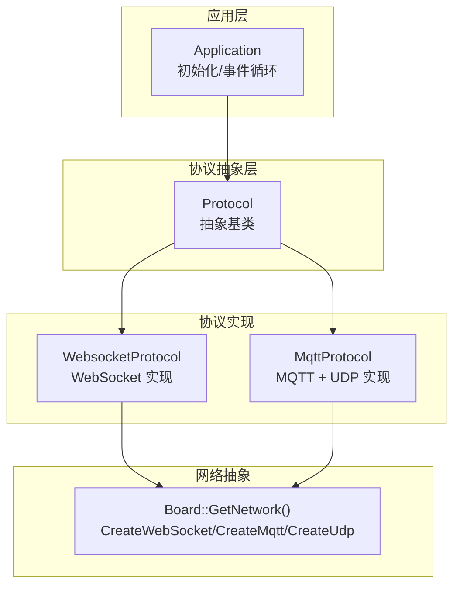
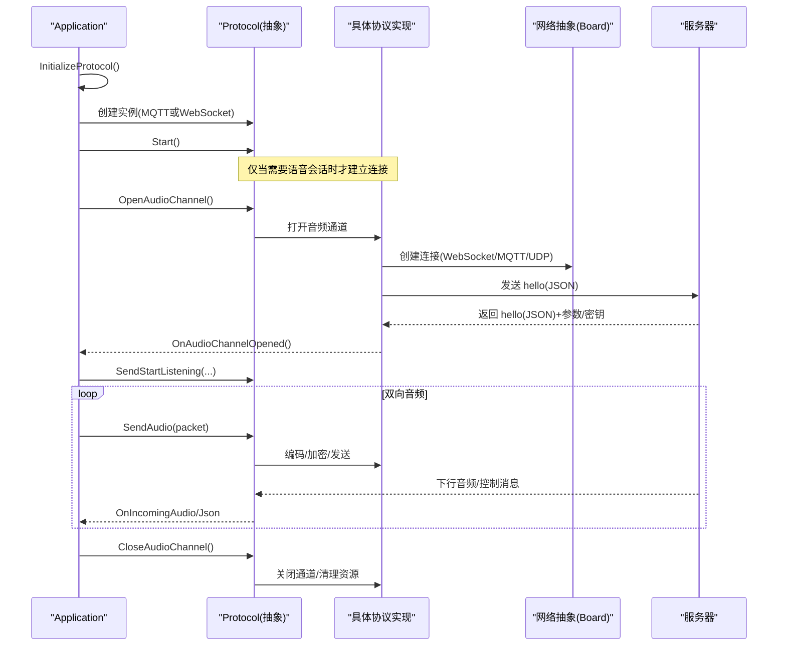
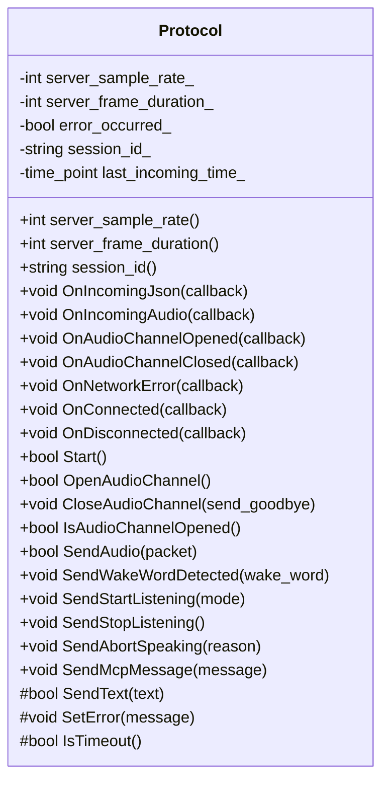
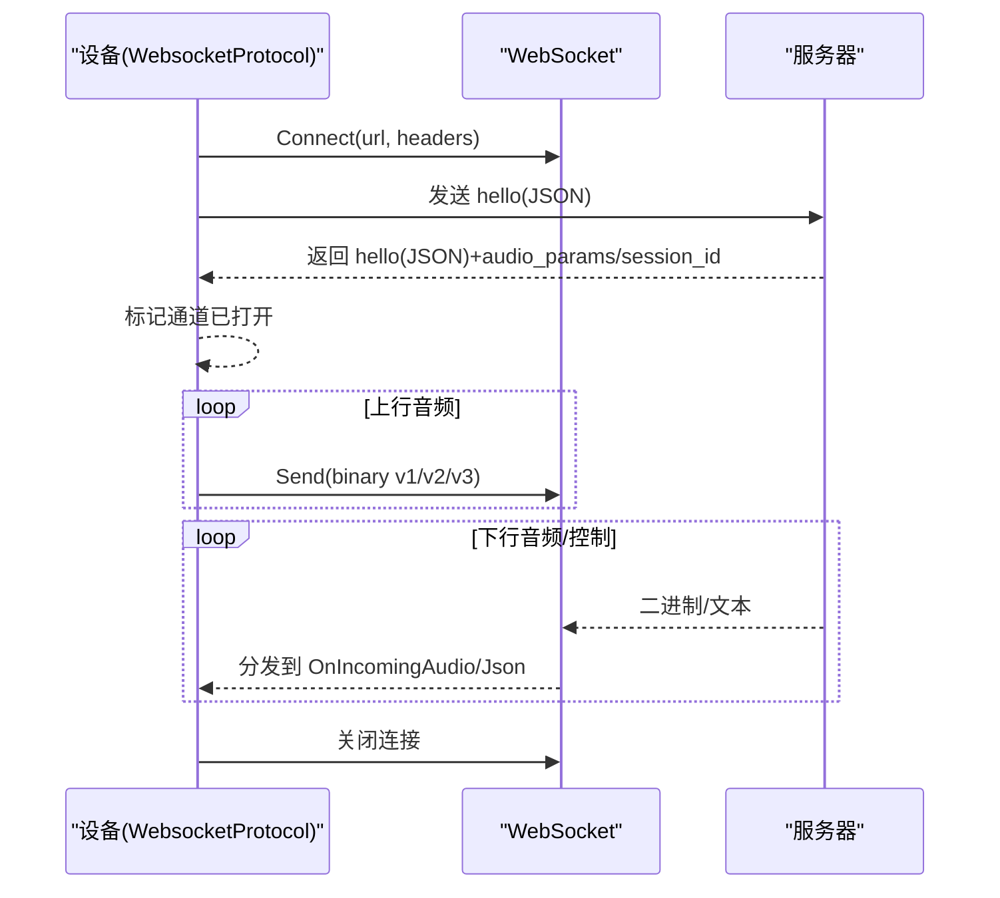
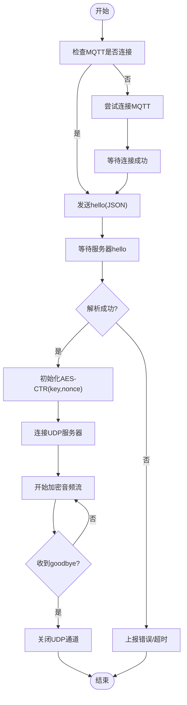
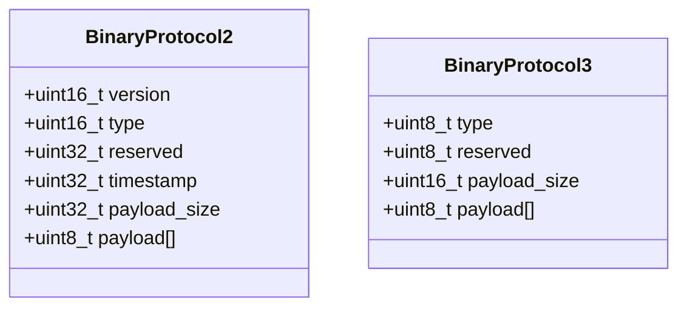
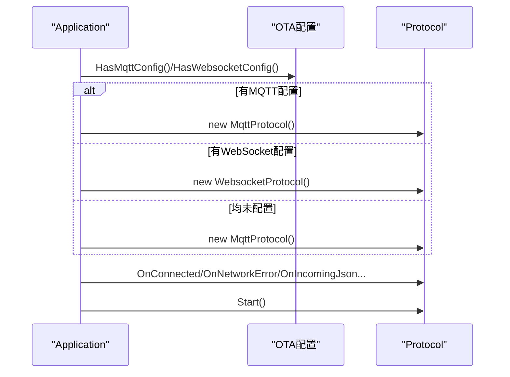
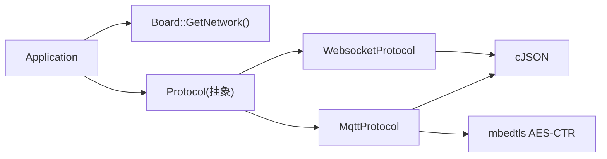

# 通信协议插件系统

<cite>
**本文引用的文件**   
- [protocol.h](file://main/protocols/protocol.h)
- [protocol.cc](file://main/protocols/protocol.cc)
- [websocket_protocol.h](file://main/protocols/websocket_protocol.h)
- [websocket_protocol.cc](file://main/protocols/websocket_protocol.cc)
- [mqtt_protocol.h](file://main/protocols/mqtt_protocol.h)
- [mqtt_protocol.cc](file://main/protocols/mqtt_protocol.cc)
- [application.h](file://main/application.h)
- [application.cc](file://main/application.cc)
- [websocket.md](file://docs/websocket.md)
- [mqtt-udp.md](file://docs/mqtt-udp.md)
</cite>

## 目录
1. [简介](#简介)
2. [项目结构](#项目结构)
3. [核心组件](#核心组件)
4. [架构总览](#架构总览)
5. [详细组件分析](#详细组件分析)
6. [依赖关系分析](#依赖关系分析)
7. [性能与可靠性](#性能与可靠性)
8. [故障排查指南](#故障排查指南)
9. [结论](#结论)
10. [附录：扩展开发与安全建议](#附录扩展开发与安全建议)

## 简介
本文件系统性地梳理并文档化设备侧的“通信协议插件系统”。该系统的目标是：
- 通过统一的抽象基类 Protocol，屏蔽底层传输差异（WebSocket、MQTT+UDP），向上层提供一致的连接管理、消息收发、错误处理接口。
- 实现 WebSocket 协议的完整流程：握手、文本/二进制帧处理、版本协商、会话 ID 管理、超时检测等。
- 实现 MQTT+UDP 混合协议：以 MQTT 作为控制通道，以 UDP 承载加密音频数据；支持 AES-CTR 加解密、序列号防重放、自动重连等。
- 明确二进制协议 v2 与 v3 的差异及序列化/反序列化过程。
- 给出自定义协议的扩展方法与动态切换机制，以及安全通信（TLS、认证）要点。

## 项目结构
与通信协议相关的核心代码位于 main/protocols 目录，应用层在 Application 中完成协议实例的动态选择与生命周期管理。文档参考位于 docs 目录。

图表来源
- [application.cc:473-610](file://main/application.cc#L473-L610)
- [protocol.h:44-95](file://main/protocols/protocol.h#L44-L95)
- [websocket_protocol.h:13-32](file://main/protocols/websocket_protocol.h#L13-L32)
- [mqtt_protocol.h:26-62](file://main/protocols/mqtt_protocol.h#L26-L62)

章节来源
- [application.h:125-176](file://main/application.h#L125-L176)
- [application.cc:473-610](file://main/application.cc#L473-L610)
- [protocol.h:10-95](file://main/protocols/protocol.h#L10-L95)
- [websocket_protocol.h:1-35](file://main/protocols/websocket_protocol.h#L1-L35)
- [mqtt_protocol.h:1-66](file://main/protocols/mqtt_protocol.h#L1-L66)

## 核心组件
- Protocol 抽象基类
  - 统一回调注册：OnIncomingJson、OnIncomingAudio、OnConnected、OnDisconnected、OnNetworkError、OnAudioChannelOpened/Closed。
  - 通用业务消息封装：SendWakeWordDetected、SendStartListening、SendStopListening、SendAbortSpeaking、SendMcpMessage。
  - 超时检测：IsTimeout（基于最近一次接收时间）。
  - 虚函数约束：Start、OpenAudioChannel、CloseAudioChannel、IsAudioChannelOpened、SendAudio、SendText。
- WebsocketProtocol
  - 基于 WebSocket 的文本/二进制双通道：JSON 控制面、Opus 二进制数据面。
  - 支持二进制协议 v1/v2/v3 三种帧格式，按配置版本进行编解码。
  - 握手流程：发送 hello，等待服务器 hello，解析 session_id 与 audio_params。
- MqttProtocol
  - 控制面：MQTT JSON 消息（hello、listen、abort、mcp、goodbye 等）。
  - 数据面：UDP 加密 Opus 流（AES-CTR），含序列号与时间戳校验。
  - 自动重连：MQTT 断开后定时重连；收到 goodbye 时避免 ping-pong。
- Application
  - 根据 OTA 配置动态选择协议实例（优先 MQTT，其次 WebSocket）。
  - 绑定协议回调，驱动状态机与 UI 更新。

章节来源
- [protocol.h:44-95](file://main/protocols/protocol.h#L44-L95)
- [protocol.cc:35-91](file://main/protocols/protocol.cc#L35-L91)
- [websocket_protocol.h:13-32](file://main/protocols/websocket_protocol.h#L13-L32)
- [websocket_protocol.cc:83-255](file://main/protocols/websocket_protocol.cc#L83-L255)
- [mqtt_protocol.h:26-62](file://main/protocols/mqtt_protocol.h#L26-L62)
- [mqtt_protocol.cc:55-390](file://main/protocols/mqtt_protocol.cc#L55-L390)
- [application.cc:473-610](file://main/application.cc#L473-L610)

## 架构总览
下图展示了从应用启动到建立语音会话的整体流程，包括协议选择、握手、音频通道建立与关闭。

图表来源
- [application.cc:473-610](file://main/application.cc#L473-L610)
- [websocket_protocol.cc:83-201](file://main/protocols/websocket_protocol.cc#L83-L201)
- [mqtt_protocol.cc:215-295](file://main/protocols/mqtt_protocol.cc#L215-L295)

## 详细组件分析

### Protocol 抽象基类设计
- 职责边界
  - 定义跨实现的统一接口与回调模型，屏蔽底层细节。
  - 提供通用 JSON 控制消息构造方法，减少重复拼接逻辑。
  - 维护会话级信息：session_id、server_sample_rate、server_frame_duration、超时计时。
- 关键接口
  - 连接与通道：Start、OpenAudioChannel、CloseAudioChannel、IsAudioChannelOpened。
  - 数据面：SendAudio（二进制）、SendText（文本）。
  - 控制面：SendStartListening、SendStopListening、SendAbortSpeaking、SendWakeWordDetected、SendMcpMessage。
  - 回调：OnIncomingJson、OnIncomingAudio、OnConnected、OnDisconnected、OnNetworkError、OnAudioChannelOpened/Closed。
- 错误与超时
  - SetError 设置错误标志并触发网络错误回调。
  - IsTimeout 基于 last_incoming_time_ 判断 120 秒无数据即超时。

图表来源
- [protocol.h:44-95](file://main/protocols/protocol.h#L44-L95)
- [protocol.cc:35-91](file://main/protocols/protocol.cc#L35-L91)

章节来源
- [protocol.h:10-95](file://main/protocols/protocol.h#L10-L95)
- [protocol.cc:1-91](file://main/protocols/protocol.cc#L1-L91)

### WebSocket 协议实现
- 连接建立
  - 从配置读取 url、token、version；设置请求头 Authorization、Protocol-Version、Device-Id、Client-Id。
  - 建立 WebSocket 连接后发送 hello(JSON)，等待服务器 hello，解析 session_id 与 audio_params。
- 数据收发
  - 文本：JSON 控制消息（listen、abort、mcp、alert、system 等）。
  - 二进制：Opus 音频帧，按 version 字段选择 v1/v2/v3 帧格式。
- 心跳与断线重连
  - 使用 IsTimeout 检测长时间无数据；断开回调触发 on_audio_channel_closed_。
  - 上层可结合状态机与重试策略实现重连。
- 二进制协议版本
  - v1：原始 Opus 帧。
  - v2：BinaryProtocol2，包含 version/type/reserved/timestamp/payload_size/payload[]。
  - v3：BinaryProtocol3，包含 type/reserved/payload_size/payload[]。

图表来源
- [websocket_protocol.cc:83-201](file://main/protocols/websocket_protocol.cc#L83-L201)
- [websocket_protocol.cc:28-72](file://main/protocols/websocket_protocol.cc#L28-L72)
- [websocket_protocol.cc:112-166](file://main/protocols/websocket_protocol.cc#L112-L166)
- [websocket_protocol.cc:203-255](file://main/protocols/websocket_protocol.cc#L203-L255)

章节来源
- [websocket_protocol.h:13-32](file://main/protocols/websocket_protocol.h#L13-L32)
- [websocket_protocol.cc:1-255](file://main/protocols/websocket_protocol.cc#L1-L255)
- [websocket.md:1-531](file://docs/websocket.md#L1-L531)

### MQTT + UDP 混合协议实现
- 设计理念
  - 控制面：MQTT 承载 JSON 控制消息（hello、listen、abort、mcp、goodbye 等）。
  - 数据面：UDP 承载加密 Opus 音频，低延迟、高吞吐。
- 握手与通道建立
  - 先建立 MQTT 连接，发送 hello(JSON) 申请 UDP 通道。
  - 服务器返回 hello(JSON) 包含 udp.server/port/key/nonce 与 audio_params。
  - 客户端初始化 AES-CTR 上下文，建立 UDP 连接。
- 音频帧格式与加密
  - 明文头部：type(1B)/flags(1B)/payload_len(2B)/ssrc(4B)/timestamp(4B)/sequence(4B)。
  - payload：AES-CTR 加密后的 Opus 数据。
  - 计数器由 nonce + timestamp + sequence 组合生成。
- 序列号与防重放
  - 发送端 local_sequence_ 单调递增。
  - 接收端 remote_sequence_ 校验连续性，丢弃旧包，容忍小范围跳跃。
- 自动重连
  - MQTT 断开后通过定时器周期性重连；收到 goodbye 时不回复 goodbye，避免乒乓。

图表来源
- [mqtt_protocol.cc:55-152](file://main/protocols/mqtt_protocol.cc#L55-L152)
- [mqtt_protocol.cc:215-295](file://main/protocols/mqtt_protocol.cc#L215-L295)
- [mqtt_protocol.cc:166-190](file://main/protocols/mqtt_protocol.cc#L166-L190)
- [mqtt_protocol.cc:243-287](file://main/protocols/mqtt_protocol.cc#L243-L287)
- [mqtt-udp.md:203-240](file://docs/mqtt-udp.md#L203-L240)

章节来源
- [mqtt_protocol.h:26-62](file://main/protocols/mqtt_protocol.h#L26-L62)
- [mqtt_protocol.cc:1-390](file://main/protocols/mqtt_protocol.cc#L1-L390)
- [mqtt-udp.md:1-410](file://docs/mqtt-udp.md#L1-L410)

### 二进制协议 v2 与 v3 差异与序列化/反序列化
- 结构体定义
  - BinaryProtocol2：包含 version、type、reserved、timestamp、payload_size、payload[]。
  - BinaryProtocol3：包含 type、reserved、payload_size、payload[]。
- 差异点
  - v2 携带 protocol version 与毫秒级 timestamp，适合服务端 AEC 对齐。
  - v3 更精简，不含 timestamp，体积更小。
- 序列化/反序列化
  - 发送端按当前 version_ 选择结构体填充，注意网络字节序转换（htonl/htons）。
  - 接收端按 version_ 解析，将 payload 转换为 AudioStreamPacket 并回调上层。

图表来源
- [protocol.h:17-31](file://main/protocols/protocol.h#L17-L31)
- [websocket_protocol.cc:28-58](file://main/protocols/websocket_protocol.cc#L28-L58)
- [websocket_protocol.cc:112-166](file://main/protocols/websocket_protocol.cc#L112-L166)

章节来源
- [protocol.h:17-31](file://main/protocols/protocol.h#L17-L31)
- [websocket_protocol.cc:28-58](file://main/protocols/websocket_protocol.cc#L28-L58)
- [websocket_protocol.cc:112-166](file://main/protocols/websocket_protocol.cc#L112-L166)
- [websocket.md:96-127](file://docs/websocket.md#L96-L127)

### 应用层动态切换与注册机制
- 动态切换
  - Application::InitializeProtocol 根据 OTA 配置决定使用 MqttProtocol 或 WebsocketProtocol。
  - 若未指定，默认回退为 MQTT。
- 注册机制
  - 通过 Protocol 的回调 API 注册事件处理器（连接、断开、错误、音频/JSON 回调）。
  - Application 将这些回调与 UI、状态机、音频服务联动。

图表来源
- [application.cc:473-610](file://main/application.cc#L473-L610)
- [application.h:125-176](file://main/application.h#L125-L176)

章节来源
- [application.cc:473-610](file://main/application.cc#L473-L610)
- [application.h:125-176](file://main/application.h#L125-L176)

## 依赖关系分析
- 组件耦合
  - Application 依赖 Board 获取网络抽象，进而创建 WebSocket/MQTT/UDP 对象。
  - 各协议实现依赖 cJSON 解析 JSON，依赖 mbedTLS 进行 AES-CTR 加解密（MQTT+UDP）。
- 外部依赖
  - FreeRTOS 事件组与定时器用于握手同步与重连调度。
  - ESP-IDF 日志与系统信息用于调试与标识。
- 潜在环依赖
  - 通过回调解耦，避免直接循环调用；Application 与 Protocol 之间通过接口与回调交互。

图表来源
- [application.cc:473-610](file://main/application.cc#L473-L610)
- [websocket_protocol.cc:1-20](file://main/protocols/websocket_protocol.cc#L1-L20)
- [mqtt_protocol.cc:1-20](file://main/protocols/mqtt_protocol.cc#L1-L20)

章节来源
- [application.cc:473-610](file://main/application.cc#L473-L610)
- [websocket_protocol.cc:1-20](file://main/protocols/websocket_protocol.cc#L1-L20)
- [mqtt_protocol.cc:1-20](file://main/protocols/mqtt_protocol.cc#L1-L20)

## 性能与可靠性
- 低延迟优化
  - MQTT+UDP 分离控制与数据面，UDP 直传音频，降低端到端延迟。
  - 二进制 v3 帧更紧凑，减少带宽占用。
- 并发与内存
  - MQTT 音频发送使用互斥锁保护 UDP 写路径。
  - 使用智能指针管理网络对象与音频包，及时释放加密上下文。
- 可靠性
  - MQTT 自动重连；UDP 序列号校验与容错；IsTimeout 检测长时无数据。
  - 握手阶段使用事件组等待服务器响应，避免阻塞主线程过久。

[本节为通用指导，无需特定文件引用]

## 故障排查指南
- 常见问题
  - 握手失败：检查 URL/endpoint、端口、鉴权头是否正确；确认服务器 hello 是否按时返回。
  - 音频不可用：确认二进制版本一致；检查 v2/v3 帧长度与字节序；MQTT+UDP 需核对 key/nonce 与端口可达性。
  - 频繁断开：关注 IsTimeout 与 OnDisconnected 回调；检查网络质量与防火墙规则。
- 定位手段
  - 启用 ESP_LOGE/ESP_LOGI 日志，观察握手与数据收发。
  - 抓包验证 JSON 结构与二进制帧格式。
  - 对 MQTT+UDP，检查序列号连续性与解密成功率。

章节来源
- [websocket_protocol.cc:168-194](file://main/protocols/websocket_protocol.cc#L168-L194)
- [mqtt_protocol.cc:85-152](file://main/protocols/mqtt_protocol.cc#L85-L152)
- [mqtt_protocol.cc:243-287](file://main/protocols/mqtt_protocol.cc#L243-L287)
- [protocol.cc:81-91](file://main/protocols/protocol.cc#L81-L91)

## 结论
本插件系统通过 Protocol 抽象统一了不同传输层的差异，提供了可扩展的协议实现方式。WebSocket 适用于大多数场景，易于部署与穿透；MQTT+UDP 则在低延迟与安全性方面具备优势。二进制协议 v2/v3 的演进兼顾了功能与效率。应用层通过 OTA 配置动态选择协议，便于灵活部署与升级。

[本节为总结性内容，无需特定文件引用]

## 附录：扩展开发与安全建议

### 自定义协议扩展指南
- 步骤
  - 新建类继承 Protocol，实现 Start、OpenAudioChannel、CloseAudioChannel、IsAudioChannelOpened、SendAudio、SendText 等虚函数。
  - 在 Application::InitializeProtocol 中增加条件分支，依据配置创建新协议实例。
  - 注册必要的回调，确保与状态机、UI、音频服务协同工作。
- 注意事项
  - 遵循现有 JSON 控制消息约定（type、session_id、features、audio_params 等）。
  - 合理处理错误与超时，保证资源释放与线程安全。
  - 如需新的二进制帧格式，定义结构体并在发送/接收路径中正确处理字节序与长度。

章节来源
- [protocol.h:44-95](file://main/protocols/protocol.h#L44-L95)
- [application.cc:473-610](file://main/application.cc#L473-L610)

### 安全通信考虑
- TLS 加密
  - WebSocket：可通过带 wss:// 的 URL 与证书配置启用 TLS（由底层网络库负责）。
  - MQTT：默认端口 8883，支持 TLS/SSL；用户名/密码认证。
- 认证机制
  - WebSocket：Authorization: Bearer <token> 请求头。
  - MQTT：client_id、username、password。
- 数据面安全（MQTT+UDP）
  - AES-CTR 加密音频载荷，key/nonce 经 MQTT 下发。
  - 序列号与时间戳防重放，丢弃旧包与异常包。

章节来源
- [websocket_protocol.cc:101-110](file://main/protocols/websocket_protocol.cc#L101-L110)
- [mqtt_protocol.cc:134-152](file://main/protocols/mqtt_protocol.cc#L134-L152)
- [mqtt-udp.md:319-336](file://docs/mqtt-udp.md#L319-L336)