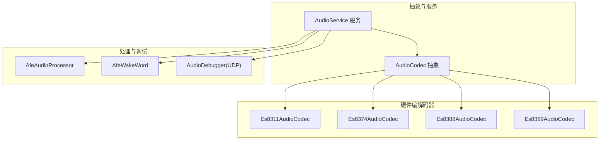
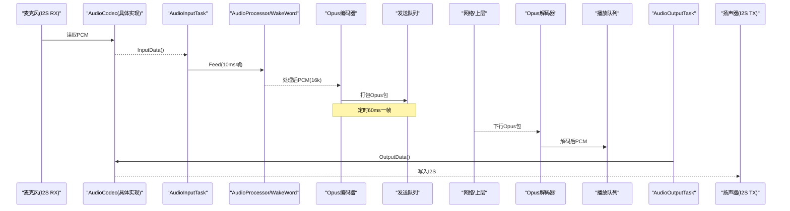
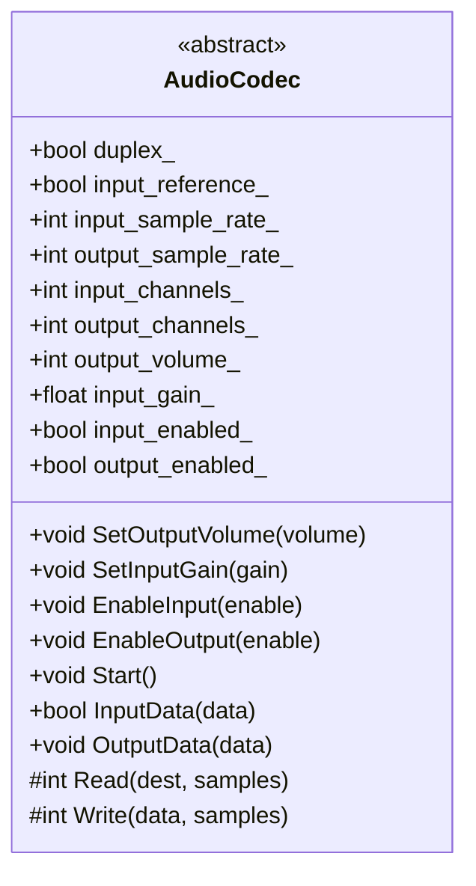
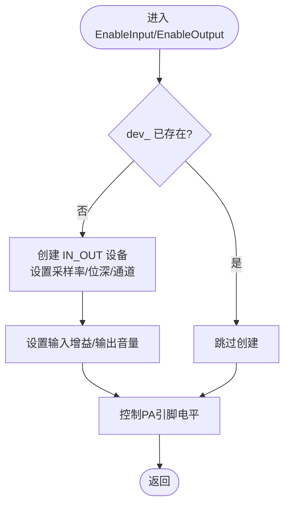
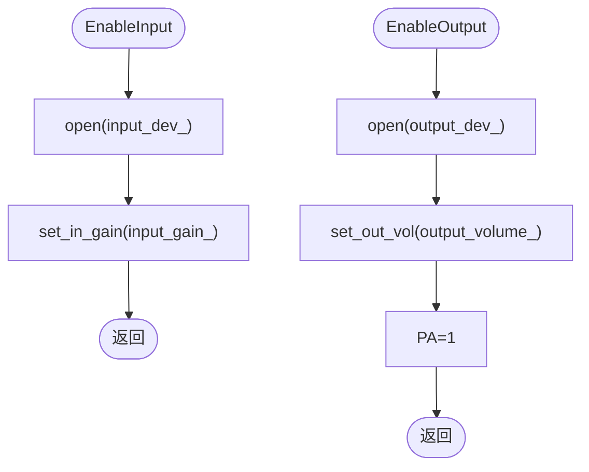
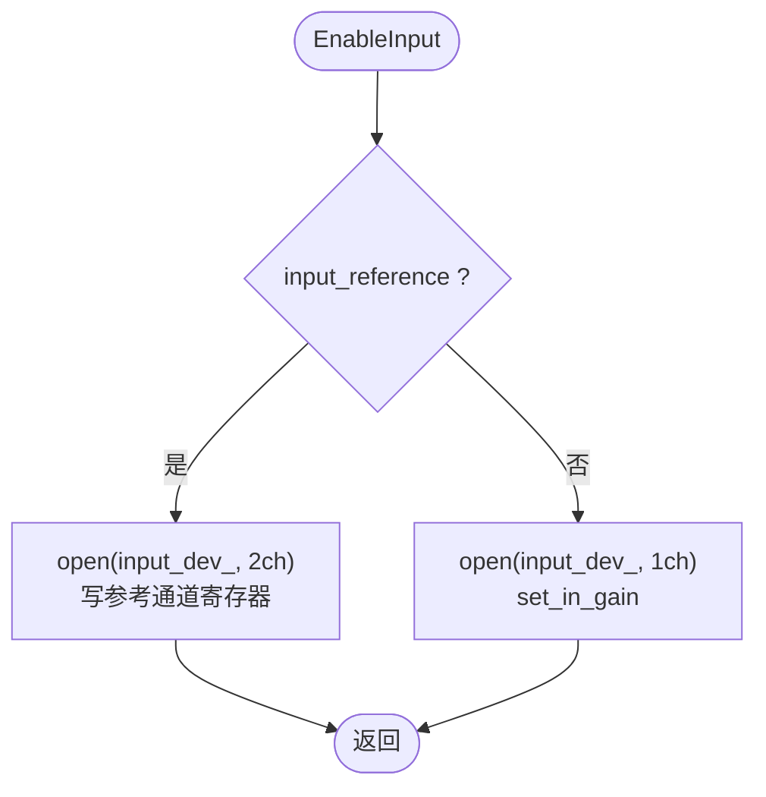
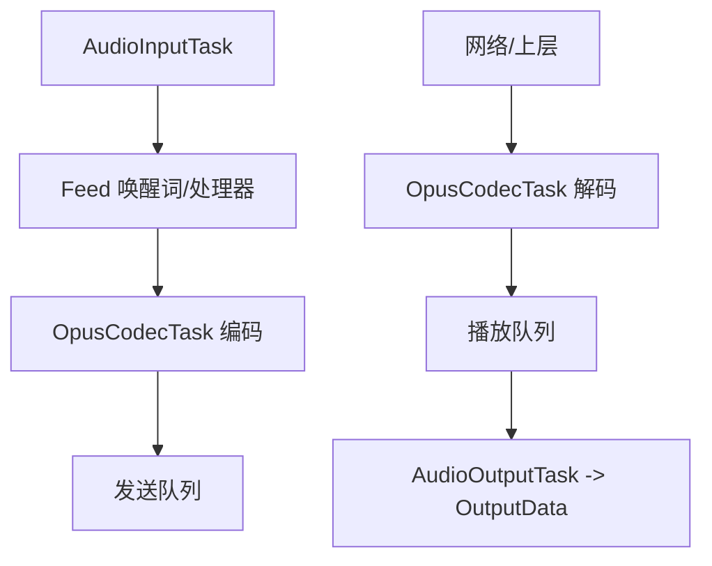
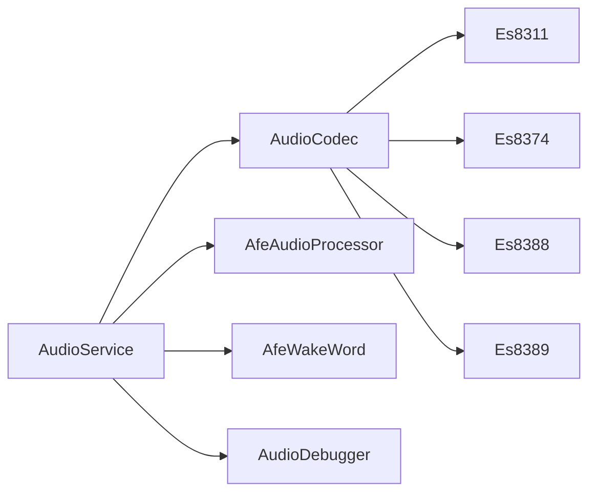

# 音频编解码器扩展

<cite>
**本文引用的文件**   
- [audio_codec.h](file://main\audio\audio_codec.h)
- [es8311_audio_codec.h](file://main\audio\codecs\es8311_audio_codec.h)
- [es8311_audio_codec.cc](file://main\audio\codecs\es8311_audio_codec.cc)
- [es8374_audio_codec.h](file://main\audio\codecs\es8374_audio_codec.h)
- [es8374_audio_codec.cc](file://main\audio\codecs\es8374_audio_codec.cc)
- [es8388_audio_codec.h](file://main\audio\codecs\es8388_audio_codec.h)
- [es8388_audio_codec.cc](file://main\audio\codecs\es8388_audio_codec.cc)
- [es8389_audio_codec.h](file://main\audio\codecs\es8389_audio_codec.h)
- [es8389_audio_codec.cc](file://main\audio\codecs\es8389_audio_codec.cc)
- [audio_service.h](file://main\audio\audio_service.h)
- [audio_service.cc](file://main\audio\audio_service.cc)
- [audio_debugger.h](file://main\audio\processors\audio_debugger.h)
- [audio_debugger.cc](file://main\audio\processors\audio_debugger.cc)
- [afe_audio_processor.h](file://main\audio\processors\afe_audio_processor.h)
- [afe_wake_word.h](file://main\audio\wake_words\afe_wake_word.h)
</cite>

## 目录
1. [简介](#简介)
2. [项目结构](#项目结构)
3. [核心组件](#核心组件)
4. [架构总览](#架构总览)
5. [详细组件分析](#详细组件分析)
6. [依赖关系分析](#依赖关系分析)
7. [性能考量](#性能考量)
8. [故障排查指南](#故障排查指南)
9. [结论](#结论)
10. [附录](#附录)

## 简介
本文件面向“音频编解码器扩展系统”，聚焦于：
- AudioCodec 抽象接口的设计与职责边界（初始化、配置、流式读写）
- 硬件编解码器实现差异（ES8311、ES8374、ES8388、ES8389）
- 音频参数配置（采样率、位深、声道数、输入增益/输出音量）
- 从 ADC 采集到 DAC 播放的完整链路（含重采样、编码/解码、队列调度）
- 新编解码器的集成开发指南（驱动适配、算法优化建议）
- 调试工具使用与性能分析方法
- 常见问题定位与解决方案

## 项目结构
围绕音频子系统的关键目录与文件如下：
- 抽象层与运行时服务
  - main/audio/audio_codec.h：AudioCodec 抽象接口定义
  - main/audio/audio_service.{h,cc}：音频服务，负责任务编排、Opus 编解码、重采样、队列管理
- 硬件编解码器实现
  - main/audio/codecs/es8311_audio_codec.{h,cc}
  - main/audio/codecs/es8374_audio_codec.{h,cc}
  - main/audio/codecs/es8388_audio_codec.{h,cc}
  - main/audio/codecs/es8389_audio_codec.{h,cc}
- 处理链路与调试
  - main/audio/processors/afe_audio_processor.h：AEC/AI 处理入口
  - main/audio/wake_words/afe_wake_word.h：唤醒词检测
  - main/audio/processors/audio_debugger.{h,cc}：UDP 原始音频导出调试

图表来源
- [audio_codec.h:17-59](file://main\audio\audio_codec.h#L17-L59)
- [audio_service.h:105-195](file://main\audio\audio_service.h#L105-L195)
- [es8311_audio_codec.h:13-40](file://main\audio\codecs\es8311_audio_codec.h#L13-L40)
- [es8374_audio_codec.h:13-39](file://main\audio\codecs\es8374_audio_codec.h#L13-L39)
- [es8388_audio_codec.h:12-38](file://main\audio\codecs\es8388_audio_codec.h#L12-L38)
- [es8389_audio_codec.h:12-38](file://main\audio\codecs\es8389_audio_codec.h#L12-L38)
- [afe_audio_processor.h:17-46](file://main\audio\processors\afe_audio_processor.h#L17-L46)
- [afe_wake_word.h:22-60](file://main\audio\wake_words\afe_wake_word.h#L22-L60)
- [audio_debugger.h:10-21](file://main\audio\processors\audio_debugger.h#L10-L21)

章节来源
- [audio_codec.h:17-59](file://main\audio\audio_codec.h#L17-L59)
- [audio_service.h:105-195](file://main\audio\audio_service.h#L105-L195)

## 核心组件
- AudioCodec 抽象接口
  - 职责：封装 I2S 双工通道、设备状态、输入/输出使能、音量/增益控制、数据读写
  - 关键方法：Start、EnableInput/EnableOutput、SetOutputVolume、SetInputGain、InputData/OutputData、Read/Write（纯虚）
  - 关键属性：duplex、input_reference、input/output_sample_rate、input/output_channels、output_volume、input_gain、input/output_enabled
- AudioService 服务
  - 职责：任务编排（输入/输出/编解码）、队列缓冲、重采样、Opus 编解码、VAD/唤醒词联动、电源管理
  - 关键流程：AudioInputTask → 可选 WakeWord/AudioProcessor → Opus 编码 → 发送队列；接收队列 → Opus 解码 → 可选输出重采样 → 播放队列 → OutputData
- 硬件编解码器实现
  - Es8311/Es8374/Es8388/Es8389：基于 esp_codec_dev + I2S 标准模式，提供独立输入/输出设备句柄或统一设备句柄，支持 PA 引脚控制、参考输入（ES8388）等差异化能力
- 调试工具
  - AudioDebugger：通过 UDP 将 PCM 数据发送到配置的服务器地址，便于离线分析与可视化

章节来源
- [audio_codec.h:17-59](file://main\audio\audio_codec.h#L17-L59)
- [audio_service.h:105-195](file://main\audio\audio_service.h#L105-L195)
- [audio_service.cc:62-123](file://main\audio\audio_service.cc#L62-L123)
- [audio_debugger.h:10-21](file://main\audio\processors\audio_debugger.h#L10-L21)
- [audio_debugger.cc:16-42](file://main\audio\processors\audio_debugger.cc#L16-L42)

## 架构总览
下图展示从麦克风采集到扬声器播放的端到端路径，以及并行任务与队列交互。

图表来源
- [audio_service.cc:230-288](file://main\audio\audio_service.cc#L230-L288)
- [audio_service.cc:290-325](file://main\audio\audio_service.cc#L290-L325)
- [audio_service.cc:327-446](file://main\audio\audio_service.cc#L327-L446)
- [audio_codec.h:27-29](file://main\audio\audio_codec.h#L27-L29)

## 详细组件分析

### AudioCodec 抽象接口设计
- 设计要点
  - 以 Read/Write 为最小原子操作，对外暴露 InputData/OutputData 进行向量级传输
  - 通过 EnableInput/EnableOutput 控制设备生命周期与功耗
  - duplex/input_reference 用于描述硬件能力（如是否支持回声消除参考通道）
  - 统一的音量/增益设置接口，屏蔽不同芯片的差异
- 复杂度与约束
  - 典型帧大小由 OPUS_FRAME_DURATION_MS 与采样率决定，需保证 DMA 缓冲区与中断吞吐匹配
  - 输入/输出采样率不一致时，由上层重采样器处理

图表来源
- [audio_codec.h:17-59](file://main\audio\audio_codec.h#L17-L59)

章节来源
- [audio_codec.h:17-59](file://main\audio\audio_codec.h#L17-L59)

### ES8311 适配实现
- 特点
  - 使用统一设备句柄（IN_OUT），在 EnableInput/EnableOutput 组合下动态 open/close
  - 支持 PA 引脚反转控制
  - 通过 esp_codec_dev 设置输入增益与输出音量
- 关键流程
  - CreateDuplexChannels：配置 I2S 主模式、16bit、立体时隙、MCLK×256
  - UpdateDeviceState：根据输入/输出使能状态创建/销毁设备并控制 PA

图表来源
- [es8311_audio_codec.cc:70-98](file://main\audio\codecs\es8311_audio_codec.cc#L70-L98)
- [es8311_audio_codec.cc:158-188](file://main\audio\codecs\es8311_audio_codec.cc#L158-L188)

章节来源
- [es8311_audio_codec.h:13-40](file://main\audio\codecs\es8311_audio_codec.h#L13-L40)
- [es8311_audio_codec.cc:7-59](file://main\audio\codecs\es8311_audio_codec.cc#L7-L59)
- [es8311_audio_codec.cc:100-156](file://main\audio\codecs\es8311_audio_codec.cc#L100-L156)
- [es8311_audio_codec.cc:158-202](file://main\audio\codecs\es8311_audio_codec.cc#L158-L202)

### ES8374 适配实现
- 特点
  - 分别创建输出与输入设备句柄，独立 open/close
  - 支持 PA 引脚控制
  - 输入增益通过 esp_codec_dev_set_in_gain 设置
- 关键流程
  - CreateDuplexChannels：与 ES8311 类似，I2S 主模式、16bit、立体时隙
  - EnableInput/EnableOutput：按各自设备句柄打开/关闭，并设置参数

图表来源
- [es8374_audio_codec.cc:139-186](file://main\audio\codecs\es8374_audio_codec.cc#L139-L186)

章节来源
- [es8374_audio_codec.h:13-39](file://main\audio\codecs\es8374_audio_codec.h#L13-L39)
- [es8374_audio_codec.cc:7-62](file://main\audio\codecs\es8374_audio_codec.cc#L7-L62)
- [es8374_audio_codec.cc:76-132](file://main\audio\codecs\es8374_audio_codec.cc#L76-L132)
- [es8374_audio_codec.cc:134-200](file://main\audio\codecs\es8374_audio_codec.cc#L134-L200)

### ES8388 适配实现
- 特点
  - 支持 input_reference 模式：当启用时，输入通道数为 2（左+参考），用于设备侧 AEC
  - 分别创建输入/输出设备句柄
  - 输出模拟音量寄存器直写，确保默认值合理
- 关键流程
  - EnableInput：根据 input_reference 选择单声道或双声道，必要时直接写寄存器配置参考通道
  - EnableOutput：设置输出音量并控制 PA

图表来源
- [es8388_audio_codec.cc:144-171](file://main\audio\codecs\es8388_audio_codec.cc#L144-L171)

章节来源
- [es8388_audio_codec.h:12-38](file://main\audio\codecs\es8388_audio_codec.h#L12-L38)
- [es8388_audio_codec.cc:7-71](file://main\audio\codecs\es8388_audio_codec.cc#L7-L71)
- [es8388_audio_codec.cc:85-137](file://main\audio\codecs\es8388_audio_codec.cc#L85-L137)
- [es8388_audio_codec.cc:139-221](file://main\audio\codecs\es8388_audio_codec.cc#L139-L221)

### ES8389 适配实现
- 特点
  - 与 ES8374 类似，分别创建输入/输出设备句柄
  - 支持 MCLK 选项与 PA 控制
- 关键流程
  - CreateDuplexChannels：I2S 主模式、16bit、立体时隙
  - EnableInput/EnableOutput：open/close 对应设备并设置增益/音量

章节来源
- [es8389_audio_codec.h:12-38](file://main\audio\codecs\es8389_audio_codec.h#L12-L38)
- [es8389_audio_codec.cc:7-70](file://main\audio\codecs\es8389_audio_codec.cc#L7-L70)
- [es8389_audio_codec.cc:84-138](file://main\audio\codecs\es8389_audio_codec.cc#L84-L138)
- [es8389_audio_codec.cc:140-206](file://main\audio\codecs\es8389_audio_codec.cc#L140-L206)

### 音频服务与数据处理链路
- 任务划分
  - AudioInputTask：周期性读取 PCM（10ms 帧），喂给唤醒词与语音处理器
  - OpusCodecTask：从编码队列取 PCM 编码为 Opus 放入发送队列；从解码队列取 Opus 解码为 PCM 放入播放队列
  - AudioOutputTask：从播放队列取出 PCM 调用 OutputData 写入 I2S
- 重采样策略
  - 输入：若 codec 输入采样率非 16k，则使用输入重采样器转换为 16k
  - 输出：若解码采样率与 codec 输出采样率不一致，则使用输出重采样器
- 队列与背压
  - 发送/解码/播放/测试队列均有上限，避免内存暴涨
  - 条件变量协调任务间同步

图表来源
- [audio_service.cc:230-288](file://main\audio\audio_service.cc#L230-L288)
- [audio_service.cc:327-446](file://main\audio\audio_service.cc#L327-L446)
- [audio_service.cc:290-325](file://main\audio\audio_service.cc#L290-L325)

章节来源
- [audio_service.h:105-195](file://main\audio\audio_service.h#L105-L195)
- [audio_service.cc:62-123](file://main\audio\audio_service.cc#L62-L123)
- [audio_service.cc:448-482](file://main\audio\audio_service.cc#L448-L482)

### 音频参数配置
- 采样率
  - 输入：通常 16k（若硬件非 16k，自动重采样）
  - 输出：跟随 codec 输出采样率，若解码采样率不同则输出重采样
- 位深
  - 内部 PCM 采用 16bit
- 声道数
  - 输入：默认单声道；ES8388 可开启参考输入为双声道（左+参考）
  - 输出：单声道
- 增益/音量
  - 输入增益：各芯片通过 set_in_gain 或寄存器直写
  - 输出音量：通过 set_out_vol 设置

章节来源
- [audio_service.cc:86-93](file://main\audio\audio_service.cc#L86-L93)
- [audio_service.cc:448-482](file://main\audio\audio_service.cc#L448-L482)
- [es8311_audio_codec.cc:158-164](file://main\audio\codecs\es8311_audio_codec.cc#L158-L164)
- [es8374_audio_codec.cc:134-137](file://main\audio\codecs\es8374_audio_codec.cc#L134-L137)
- [es8388_audio_codec.cc:139-142](file://main\audio\codecs\es8388_audio_codec.cc#L139-L142)
- [es8389_audio_codec.cc:140-143](file://main\audio\codecs\es8389_audio_codec.cc#L140-L143)

### 新音频编解码器集成指南
- 步骤概览
  1) 新建类继承 AudioCodec，声明构造/析构、CreateDuplexChannels、Read/Write、EnableInput/EnableOutput、SetOutputVolume 等
  2) 构造中设置 duplex/input_reference/channels/sample_rates/gains，并调用 CreateDuplexChannels 初始化 I2S
  3) 初始化 esp_codec_dev 相关接口（data_if/ctrl_if/gpio_if），并按芯片手册创建 codec_if
  4) 在 EnableInput/EnableOutput 中按需 open/close 输入/输出设备句柄，设置采样率/位深/通道/增益/音量，控制 PA 引脚
  5) 在 Read/Write 中调用 esp_codec_dev_read/write 完成数据搬运
- 注意事项
  - I2S 配置需与芯片手册一致（时钟源、MCLK 倍频、时隙宽度、对齐方式）
  - 若支持参考输入（AEC），需在 EnableInput 中正确配置双通道与参考通道寄存器
  - 注意线程安全：对 data_if 访问加锁，避免并发冲突
  - 功耗管理：长时间无 IO 时，EnableInput/EnableOutput 应允许关闭以降低功耗

章节来源
- [audio_codec.h:17-59](file://main\audio\audio_codec.h#L17-L59)
- [es8311_audio_codec.cc:100-156](file://main\audio\codecs\es8311_audio_codec.cc#L100-L156)
- [es8374_audio_codec.cc:76-132](file://main\audio\codecs\es8374_audio_codec.cc#L76-L132)
- [es8388_audio_codec.cc:85-137](file://main\audio\codecs\es8388_audio_codec.cc#L85-L137)
- [es8389_audio_codec.cc:84-138](file://main\audio\codecs\es8389_audio_codec.cc#L84-L138)

### 算法优化建议
- 输入路径
  - 尽量保持 10ms 帧馈入处理器/唤醒词，减少抖动
  - 若硬件采样率非 16k，优先使用硬件重采样或高效库，避免 CPU 占用过高
- 输出路径
  - 解码后若需重采样，仅在必要时启用，避免重复转换
  - 合理设置播放队列长度，平衡延迟与卡顿风险
- 编码路径
  - 固定 60ms 帧长，结合 VBR/DTX 降低带宽占用
- 资源管理
  - 空闲时及时关闭输入/输出设备，降低功耗与热噪声

[本节为通用指导，不直接分析具体文件]

## 依赖关系分析
- 模块耦合
  - AudioService 依赖 AudioCodec 抽象，解耦硬件差异
  - 各具体编解码器依赖 esp_codec_dev 与 I2S 驱动
  - AudioDebugger 仅作为可选调试旁路，不影响主链路
- 外部依赖
  - ESP-IDF I2S、esp_codec_dev、ESP_OPUS、重采样库、FreeRTOS 事件组/任务

图表来源
- [audio_service.h:105-195](file://main\audio\audio_service.h#L105-L195)
- [audio_codec.h:17-59](file://main\audio\audio_codec.h#L17-L59)
- [es8311_audio_codec.h:13-40](file://main\audio\codecs\es8311_audio_codec.h#L13-L40)
- [es8374_audio_codec.h:13-39](file://main\audio\codecs\es8374_audio_codec.h#L13-L39)
- [es8388_audio_codec.h:12-38](file://main\audio\codecs\es8388_audio_codec.h#L12-L38)
- [es8389_audio_codec.h:12-38](file://main\audio\codecs\es8389_audio_codec.h#L12-L38)
- [afe_audio_processor.h:17-46](file://main\audio\processors\afe_audio_processor.h#L17-L46)
- [afe_wake_word.h:22-60](file://main\audio\wake_words\afe_wake_word.h#L22-L60)
- [audio_debugger.h:10-21](file://main\audio\processors\audio_debugger.h#L10-L21)

章节来源
- [audio_service.h:105-195](file://main\audio\audio_service.h#L105-L195)
- [audio_codec.h:17-59](file://main\audio\audio_codec.h#L17-L59)

## 性能考量
- 任务栈与优先级
  - 输入/输出/编解码任务分配不同栈大小与优先级，避免阻塞关键路径
- 队列容量
  - 发送/解码/播放/测试队列上限防止内存膨胀，同时保障低延迟
- 重采样开销
  - 仅在必要路径启用，避免重复转换
- 功耗与时钟
  - 空闲时关闭输入/输出设备，但需注意双工场景下 RX 可能依赖 TX 时钟的情况

章节来源
- [audio_service.cc:125-167](file://main\audio\audio_service.cc#L125-L167)
- [audio_service.cc:327-446](file://main\audio\audio_service.cc#L327-L446)
- [audio_service.cc:682-698](file://main\audio\audio_service.cc#L682-L698)

## 故障排查指南
- 无声/杂音
  - 检查 EnableOutput 是否被调用、PA 引脚电平是否正确
  - 确认输出音量与模拟输出寄存器设置
- 无声/断续
  - 检查输入使能与输入增益，确认 I2S 配置与 DMA 参数
  - 核对输入/输出采样率一致性，必要时启用重采样
- 回声/啸叫
  - 若使用 ES8388，确认 input_reference 与参考通道寄存器配置
  - 调整输入增益与输出音量，避免环路增益过大
- 高 CPU 占用
  - 检查是否频繁重采样或队列积压导致任务饥饿
  - 评估唤醒词/处理器运行开关时机
- 调试手段
  - 启用 AudioDebugger，通过 UDP 抓取 PCM 数据进行离线分析
  - 关注日志中的错误码与队列满告警

章节来源
- [audio_service.cc:682-698](file://main\audio\audio_service.cc#L682-L698)
- [audio_debugger.cc:16-42](file://main\audio\processors\audio_debugger.cc#L16-L42)
- [audio_debugger.cc:54-66](file://main\audio\processors\audio_debugger.cc#L54-L66)

## 结论
本系统通过 AudioCodec 抽象屏蔽了多芯片差异，AudioService 统一管理任务、队列与编解码流程，配合重采样与调试工具，形成可扩展、可观测、低功耗的音频链路。新增编解码器只需遵循抽象接口与 I2S/esp_codec_dev 规范即可快速接入。

[本节为总结性内容，不直接分析具体文件]

## 附录
- 术语
  - I2S：数字音频串行总线
  - OPUS：低延迟音频编码格式
  - AEC：声学回声消除
  - VAD：语音活动检测
- 参考路径
  - 抽象接口：[audio_codec.h](file://main\audio\audio_codec.h)
  - 服务与任务：[audio_service.{h,cc}](file://main\audio\audio_service.h), [audio_service.cc](file://main\audio\audio_service.cc)
  - 硬件实现：[es8311/8374/8388/8389](file://main\audio\codecs)
  - 调试工具：[audio_debugger.{h,cc}](file://main\audio\processors\audio_debugger.h), [audio_debugger.cc](file://main\audio\processors\audio_debugger.cc)