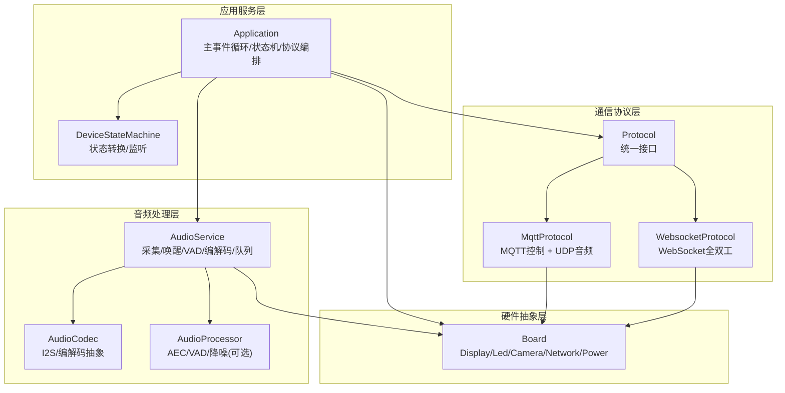
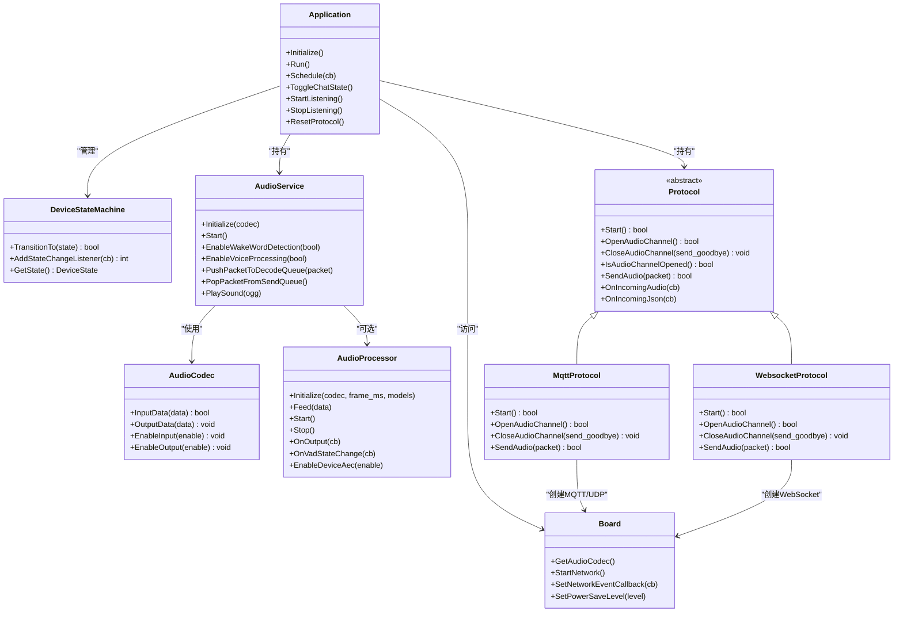
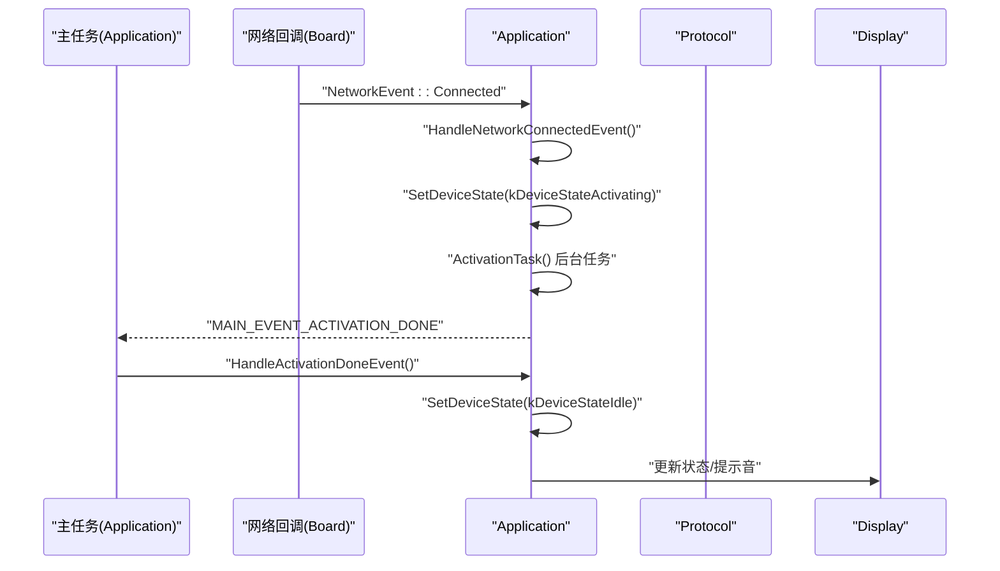
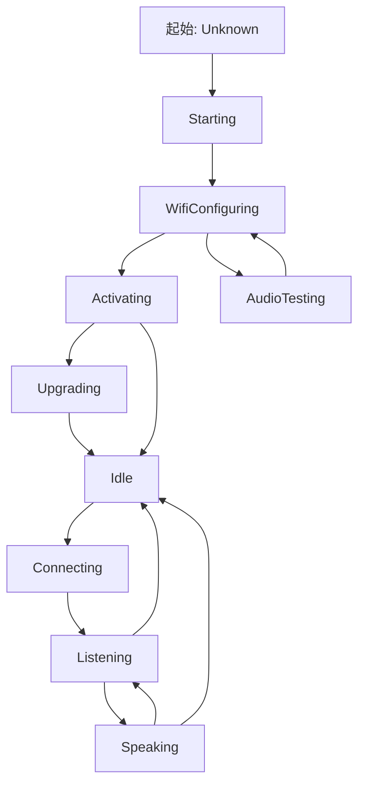
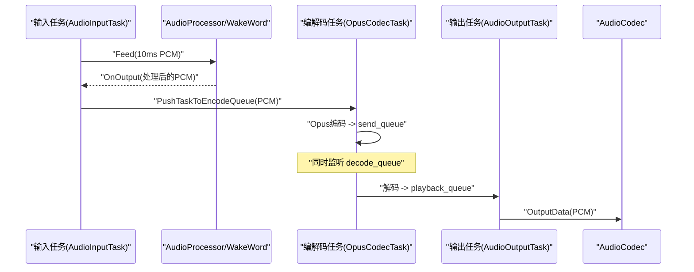
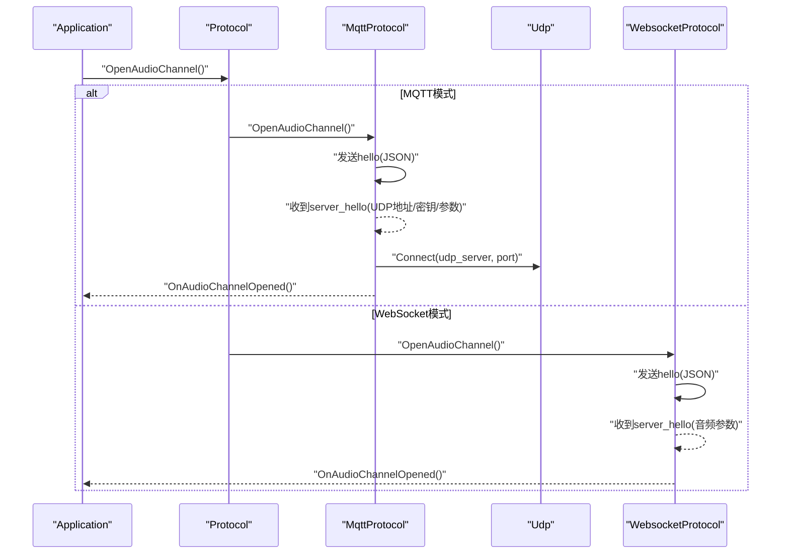
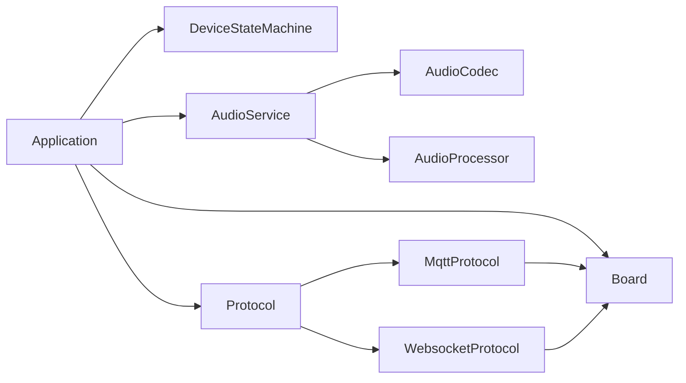
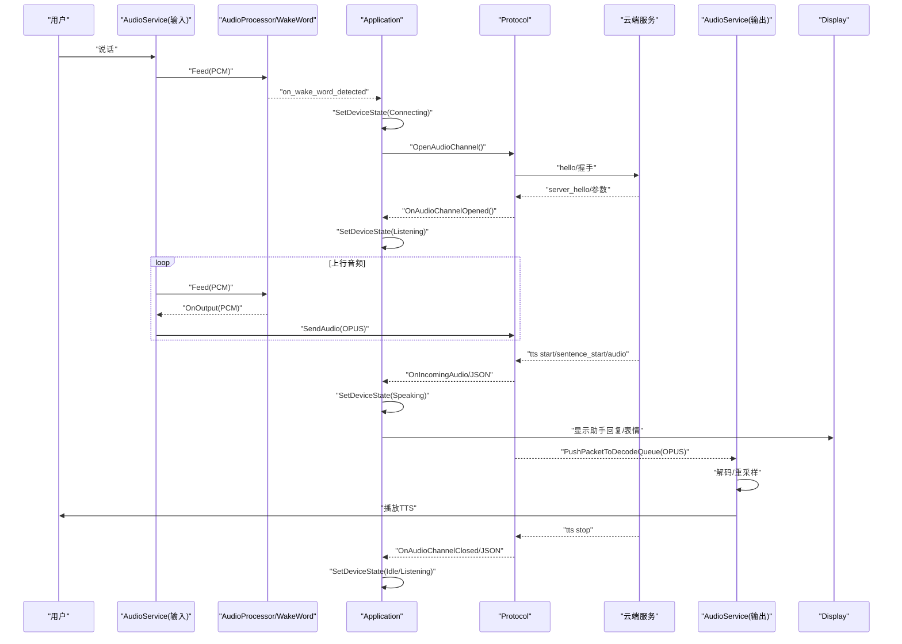

# 系统整体架构

<cite>
**本文引用的文件**   
- [main.cc](file://main/main.cc)
- [application.h](file://main/application.h)
- [application.cc](file://main/application.cc)
- [device_state.h](file://main/device_state.h)
- [device_state_machine.h](file://main/device_state_machine.h)
- [device_state_machine.cc](file://main/device_state_machine.cc)
- [audio_service.h](file://main/audio/audio_service.h)
- [audio_service.cc](file://main/audio/audio_service.cc)
- [audio_codec.h](file://main/audio/audio_codec.h)
- [audio_processor.h](file://main/audio/audio_processor.h)
- [protocol.h](file://main/protocols/protocol.h)
- [websocket_protocol.h](file://main/protocols/websocket_protocol.h)
- [websocket_protocol.cc](file://main/protocols/websocket_protocol.cc)
- [mqtt_protocol.h](file://main/protocols/mqtt_protocol.h)
- [mqtt_protocol.cc](file://main/protocols/mqtt_protocol.cc)
- [board.h](file://main/boards/common/board.h)
</cite>

## 目录
1. [引言](#引言)
2. [项目结构](#项目结构)
3. [核心组件](#核心组件)
4. [架构总览](#架构总览)
5. [详细组件分析](#详细组件分析)
6. [依赖关系分析](#依赖关系分析)
7. [性能与功耗特性](#性能与功耗特性)
8. [故障排查指南](#故障排查指南)
9. [结论](#结论)
10. [附录：端到端语音流程时序](#附录端到端语音流程时序)

## 引言
本文件面向小智AI聊天机器人系统的整体架构，聚焦ESP32设备端的分层设计、事件驱动应用模型、FreeRTOS任务调度与EventGroup使用模式，以及云端通信协议（MQTT+UDP、WebSocket）的交互方式。文档从“硬件抽象层—音频处理层—通信协议层—应用服务层”的角度梳理模块职责与数据流向，帮助开发者快速建立系统理解框架并指导二次开发。

## 项目结构
- 入口与主循环
  - main.cc 负责NVS初始化与应用启动，随后进入 Application::Run 的主事件循环。
- 应用服务层
  - Application 类作为系统编排中心，管理状态机、网络回调、协议生命周期、UI提示与定时任务。
- 设备状态机
  - DeviceStateMachine 提供严格的状态转换规则与监听机制，保障状态流转一致性。
- 音频处理层
  - AudioService 封装I/O采集、唤醒词检测、VAD、编码/解码、重采样与播放队列；AudioCodec 为硬件编解码抽象；AudioProcessor 提供AEC/VAD等算法接口。
- 通信协议层
  - Protocol 抽象基类定义统一接口；MqttProtocol 与 WebsocketProtocol 分别实现基于MQTT+UDP和WebSocket的音视频通道。
- 硬件抽象层
  - Board 抽象出显示、LED、摄像头、网络接口、电源管理等板级能力，屏蔽具体硬件差异。

图表来源
- [application.h:43-176](file://main/application.h#L43-L176)
- [application.cc:61-259](file://main/application.cc#L61-L259)
- [device_state_machine.h:17-81](file://main/device_state_machine.h#L17-L81)
- [audio_service.h:105-195](file://main/audio/audio_service.h#L105-L195)
- [audio_codec.h:17-59](file://main/audio/audio_codec.h#L17-L59)
- [audio_processor.h:11-24](file://main/audio/audio_processor.h#L11-L24)
- [protocol.h:44-95](file://main/protocols/protocol.h#L44-L95)
- [mqtt_protocol.h:26-62](file://main/protocols/mqtt_protocol.h#L26-L62)
- [websocket_protocol.h:13-32](file://main/protocols/websocket_protocol.h#L13-L32)
- [board.h:49-85](file://main/boards/common/board.h#L49-L85)

章节来源
- [main.cc:14-29](file://main/main.cc#L14-L29)
- [application.h:43-176](file://main/application.h#L43-L176)
- [application.cc:61-259](file://main/application.cc#L61-L259)
- [device_state_machine.h:17-81](file://main/device_state_machine.h#L17-L81)
- [audio_service.h:105-195](file://main/audio/audio_service.h#L105-L195)
- [audio_codec.h:17-59](file://main/audio/audio_codec.h#L17-L59)
- [audio_processor.h:11-24](file://main/audio/audio_processor.h#L11-L24)
- [protocol.h:44-95](file://main/protocols/protocol.h#L44-L95)
- [mqtt_protocol.h:26-62](file://main/protocols/mqtt_protocol.h#L26-L62)
- [websocket_protocol.h:13-32](file://main/protocols/websocket_protocol.h#L13-L32)
- [board.h:49-85](file://main/boards/common/board.h#L49-L85)

## 核心组件
- Application
  - 单例，维护主事件循环、定时器、事件组、协议实例、状态机、音频服务与OTA。
  - 通过 EventGroup 聚合多源事件（网络、VAD、唤醒词、时钟滴答、用户交互等），在 Run() 中分发处理。
  - 提供 Schedule 将跨任务回调安全投递到主任务执行，保证UI与状态更新线程安全。
- DeviceStateMachine
  - 严格校验状态迁移路径，支持添加监听器，变更时触发回调。
  - 所有状态变更均通过 SetDeviceState 发起，避免非法跳转。
- AudioService
  - 三任务架构：输入任务（采集/唤醒/VAD）、输出任务（播放）、编解码任务（Opus编解码与重采样）。
  - 内部队列：encode_queue、send_queue、decode_queue、playback_queue、testing_queue，配合条件变量与事件组协调。
  - 支持唤醒词检测、VAD状态上报、设备AEC开关、服务器AEC时间戳透传。
- Protocol/MqttProtocol/WebsocketProtocol
  - Protocol 定义统一的音频通道与文本消息接口。
  - MqttProtocol：控制面走MQTT，媒体面走UDP（AES加密、序列号保护、时间戳用于服务端AEC）。
  - WebsocketProtocol：控制面与媒体面统一走WebSocket，支持版本协商与二进制协议。
- Board
  - 抽象显示、LED、摄像头、网络接口、电源管理等，提供 StartNetwork、SetNetworkEventCallback、GetAudioCodec 等能力。

章节来源
- [application.h:43-176](file://main/application.h#L43-L176)
- [application.cc:61-259](file://main/application.cc#L61-L259)
- [device_state_machine.h:17-81](file://main/device_state_machine.h#L17-L81)
- [device_state_machine.cc:34-102](file://main/device_state_machine.cc#L34-L102)
- [audio_service.h:105-195](file://main/audio/audio_service.h#L105-L195)
- [audio_service.cc:125-167](file://main/audio/audio_service.cc#L125-L167)
- [protocol.h:44-95](file://main/protocols/protocol.h#L44-L95)
- [mqtt_protocol.h:26-62](file://main/protocols/mqtt_protocol.h#L26-L62)
- [websocket_protocol.h:13-32](file://main/protocols/websocket_protocol.h#L13-L32)
- [board.h:49-85](file://main/boards/common/board.h#L49-L85)

## 架构总览
系统采用分层与事件驱动相结合的设计：
- 硬件抽象层（Board）：屏蔽不同板卡差异，提供网络、音频、显示、电源等能力。
- 音频处理层（AudioService/AudioCodec/AudioProcessor）：完成采集、唤醒、VAD、编解码、重采样与播放。
- 通信协议层（Protocol/MQTT/WebSocket）：统一音频通道与JSON控制面，适配不同传输。
- 应用服务层（Application/FSM）：编排各层协作，驱动状态机与UI反馈。

图表来源
- [application.h:43-176](file://main/application.h#L43-L176)
- [device_state_machine.h:17-81](file://main/device_state_machine.h#L17-L81)
- [audio_service.h:105-195](file://main/audio/audio_service.h#L105-L195)
- [audio_codec.h:17-59](file://main/audio/audio_codec.h#L17-L59)
- [audio_processor.h:11-24](file://main/audio/audio_processor.h#L11-L24)
- [protocol.h:44-95](file://main/protocols/protocol.h#L44-L95)
- [mqtt_protocol.h:26-62](file://main/protocols/mqtt_protocol.h#L26-L62)
- [websocket_protocol.h:13-32](file://main/protocols/websocket_protocol.h#L13-L32)
- [board.h:49-85](file://main/boards/common/board.h#L49-L85)

## 详细组件分析

### Application 与事件驱动主循环
- 主循环等待事件组 ALL_EVENTS，按位解析后调用对应处理器。
- 关键事件：
  - MAIN_EVENT_NETWORK_CONNECTED/DISCONNECTED：连接/断开时打开或关闭音频通道，刷新UI。
  - MAIN_EVENT_WAKE_WORD_DETECTED：唤醒词触发，进入连接或继续唤醒流程。
  - MAIN_EVENT_VAD_CHANGE：在监听态切换LED状态。
  - MAIN_EVENT_SEND_AUDIO：拉取音频包并通过协议发送。
  - MAIN_EVENT_SCHEDULE：执行跨任务投递的任务队列。
  - MAIN_EVENT_CLOCK_TICK：周期性刷新状态栏与调试信息。
- 激活流程：
  - 网络就绪后进入 Activating，后台任务检查资源与固件版本，初始化协议，完成后回到 Idle。

图表来源
- [application.cc:261-338](file://main/application.cc#L261-L338)
- [application.cc:299-338](file://main/application.cc#L299-L338)
- [application.cc:61-163](file://main/application.cc#L61-L163)

章节来源
- [application.h:22-35](file://main/application.h#L22-L35)
- [application.cc:165-259](file://main/application.cc#L165-L259)
- [application.cc:261-338](file://main/application.cc#L261-L338)
- [application.cc:299-338](file://main/application.cc#L299-L338)

### 设备状态机
- 状态集合：未知、启动、配网、空闲、连接中、监听、说话、升级、激活、音频测试、致命错误。
- 转换规则由 IsValidTransition 严格限定，防止非法跳转。
- 支持观察者模式，任何状态变化都会通知监听者（如Application内用于刷新UI或触发后续动作）。

图表来源
- [device_state_machine.cc:34-102](file://main/device_state_machine.cc#L34-L102)
- [device_state.h:4-16](file://main/device_state.h#L4-L16)

章节来源
- [device_state_machine.h:17-81](file://main/device_state_machine.h#L17-L81)
- [device_state_machine.cc:108-131](file://main/device_state_machine.cc#L108-L131)
- [device_state.h:4-16](file://main/device_state.h#L4-L16)

### 音频子系统（采集/唤醒/VAD/编解码/播放）
- 任务划分
  - 输入任务：读取PCM，喂给唤醒词与音频处理器，按帧入队。
  - 编解码任务：从 encode_queue 取出PCM进行Opus编码，结果入 send_queue；从 decode_queue 取出OPUS解码，必要时重采样，结果入 playback_queue。
  - 输出任务：从 playback_queue 取PCM写入硬件。
- 队列与同步
  - 使用条件变量与互斥锁协调生产者/消费者，限制队列长度避免溢出。
  - 事件组标记唤醒词运行、音频处理运行、音频测试运行等状态。
- AEC与时间戳
  - 设备侧AEC：通过 AudioProcessor::EnableDeviceAec 启用。
  - 服务器侧AEC：音频包携带 timestamp，输出任务记录时间戳，输入编码时复用，便于服务端对齐。
- 唤醒词与VAD
  - 唤醒词检测完成后回调 Application，触发连接或继续唤醒流程。
  - VAD变化回调用于UI指示与功耗策略。

图表来源
- [audio_service.cc:230-288](file://main/audio/audio_service.cc#L230-L288)
- [audio_service.cc:327-446](file://main/audio/audio_service.cc#L327-L446)
- [audio_service.cc:290-325](file://main/audio/audio_service.cc#L290-L325)
- [audio_service.h:105-195](file://main/audio/audio_service.h#L105-L195)

章节来源
- [audio_service.h:105-195](file://main/audio/audio_service.h#L105-L195)
- [audio_service.cc:125-167](file://main/audio/audio_service.cc#L125-L167)
- [audio_service.cc:230-288](file://main/audio/audio_service.cc#L230-L288)
- [audio_service.cc:327-446](file://main/audio/audio_service.cc#L327-L446)
- [audio_service.cc:290-325](file://main/audio/audio_service.cc#L290-L325)

### 通信协议层（MQTT+UDP / WebSocket）
- 统一接口
  - Protocol 定义 OpenAudioChannel/SendAudio/CloseAudioChannel 及 JSON/音频回调。
- MQTT+UDP
  - 控制面：MQTT订阅/发布，hello/goodbye会话管理。
  - 媒体面：UDP传输OPUS，AES-CTR加密，序列号与时间戳保护。
- WebSocket
  - 控制面与媒体面统一走WS，支持版本协商与二进制协议（v2/v3）。
  - hello握手后返回 session_id 与音频参数。

图表来源
- [mqtt_protocol.cc:215-295](file://main/protocols/mqtt_protocol.cc#L215-L295)
- [websocket_protocol.cc:83-201](file://main/protocols/websocket_protocol.cc#L83-L201)
- [protocol.h:44-95](file://main/protocols/protocol.h#L44-L95)

章节来源
- [protocol.h:44-95](file://main/protocols/protocol.h#L44-L95)
- [mqtt_protocol.h:26-62](file://main/protocols/mqtt_protocol.h#L26-L62)
- [mqtt_protocol.cc:215-295](file://main/protocols/mqtt_protocol.cc#L215-L295)
- [websocket_protocol.h:13-32](file://main/protocols/websocket_protocol.h#L13-L32)
- [websocket_protocol.cc:83-201](file://main/protocols/websocket_protocol.cc#L83-L201)

### 硬件抽象层（Board）
- 提供 GetAudioCodec、GetDisplay、GetLed、GetNetwork、StartNetwork、SetNetworkEventCallback、SetPowerSaveLevel 等接口。
- 网络事件回调统一封装 WiFi/蜂窝等场景，Application 据此更新UI与状态。

章节来源
- [board.h:49-85](file://main/boards/common/board.h#L49-L85)
- [application.cc:101-163](file://main/application.cc#L101-L163)

## 依赖关系分析
- Application 强依赖 DeviceStateMachine、AudioService、Protocol 与 Board。
- AudioService 依赖 AudioCodec 与可选 AudioProcessor。
- Protocol 派生自 MqttProtocol 与 WebsocketProtocol，二者均依赖 Board 的网络抽象。
- 事件流：
  - 音频输入/输出与编解码通过队列与事件组解耦。
  - 网络事件通过 Board 回调至 Application，再转化为内部事件。

图表来源
- [application.h:43-176](file://main/application.h#L43-L176)
- [audio_service.h:105-195](file://main/audio/audio_service.h#L105-L195)
- [protocol.h:44-95](file://main/protocols/protocol.h#L44-L95)
- [mqtt_protocol.h:26-62](file://main/protocols/mqtt_protocol.h#L26-L62)
- [websocket_protocol.h:13-32](file://main/protocols/websocket_protocol.h#L13-L32)
- [board.h:49-85](file://main/boards/common/board.h#L49-L85)

章节来源
- [application.h:43-176](file://main/application.h#L43-L176)
- [audio_service.h:105-195](file://main/audio/audio_service.h#L105-L195)
- [protocol.h:44-95](file://main/protocols/protocol.h#L44-L95)
- [mqtt_protocol.h:26-62](file://main/protocols/mqtt_protocol.h#L26-L62)
- [websocket_protocol.h:13-32](file://main/protocols/websocket_protocol.h#L13-L32)
- [board.h:49-85](file://main/boards/common/board.h#L49-L85)

## 性能与功耗特性
- 任务优先级
  - 主任务优先级设为较高，确保事件响应及时。
  - 音频输入任务高优先级，输出与编解码任务次之，降低延迟。
- 队列与背压
  - 对 encode/decode/playback/send 队列设置上限，避免内存抖动与丢帧。
- 动态功耗
  - 根据活动状态切换 PowerSaveLevel（PERFORMANCE/LOW_POWER）。
  - 音频输入/输出空闲超时自动关闭I2S端口，减少功耗。
- 采样率与重采样
  - 当服务器采样率与硬件不一致时动态重建解码器与重采样器，平衡兼容性与失真风险。

章节来源
- [application.cc:165-167](file://main/application.cc#L165-L167)
- [audio_service.cc:125-167](file://main/audio/audio_service.cc#L125-L167)
- [audio_service.cc:682-698](file://main/audio/audio_service.cc#L682-L698)
- [application.cc:504-519](file://main/application.cc#L504-L519)

## 故障排查指南
- 网络相关
  - 未配置MQTT端点或WebSocket URL：检查 Settings 中的 mqtt/websocket 配置项。
  - 握手超时：确认服务器可达与证书/鉴权正确。
- 音频相关
  - 无声音/无声：检查 OutputEnabled 与音量；查看是否因空闲超时关闭了输出。
  - 回声/啸叫：确认是否启用设备AEC或服务端AEC，调整麦克风增益与扬声器音量。
- 状态异常
  - 非法状态跳转：查看日志中 Invalid state transition 提示，修正业务逻辑。
  - 频繁断线重连：关注 MQTT 心跳与重连间隔，评估网络质量。

章节来源
- [mqtt_protocol.cc:59-152](file://main/protocols/mqtt_protocol.cc#L59-L152)
- [websocket_protocol.cc:83-201](file://main/protocols/websocket_protocol.cc#L83-L201)
- [audio_service.cc:682-698](file://main/audio/audio_service.cc#L682-L698)
- [device_state_machine.cc:117-121](file://main/device_state_machine.cc#L117-L121)

## 结论
本系统以 Application 为核心，结合 DeviceStateMachine 的严格状态管理与 FreeRTOS 的事件/任务机制，实现了低耦合、可扩展的语音对话链路。音频子系统通过多任务与队列化设计保障实时性，协议层抽象使MQTT+UDP与WebSocket可插拔替换，Board抽象则屏蔽硬件差异。该架构既满足低功耗与稳定性要求，也为功能扩展（如更多协议、更多音频算法）提供了清晰边界。

## 附录：端到端语音流程时序
以下时序展示从语音输入到AI响应的完整链路，涵盖唤醒、连接、上行音频、下行TTS与UI联动。

图表来源
- [application.cc:489-610](file://main/application.cc#L489-L610)
- [application.cc:713-730](file://main/application.cc#L713-L730)
- [audio_service.cc:506-529](file://main/audio/audio_service.cc#L506-L529)
- [audio_service.cc:327-446](file://main/audio/audio_service.cc#L327-L446)
- [mqtt_protocol.cc:215-295](file://main/protocols/mqtt_protocol.cc#L215-L295)
- [websocket_protocol.cc:83-201](file://main/protocols/websocket_protocol.cc#L83-L201)