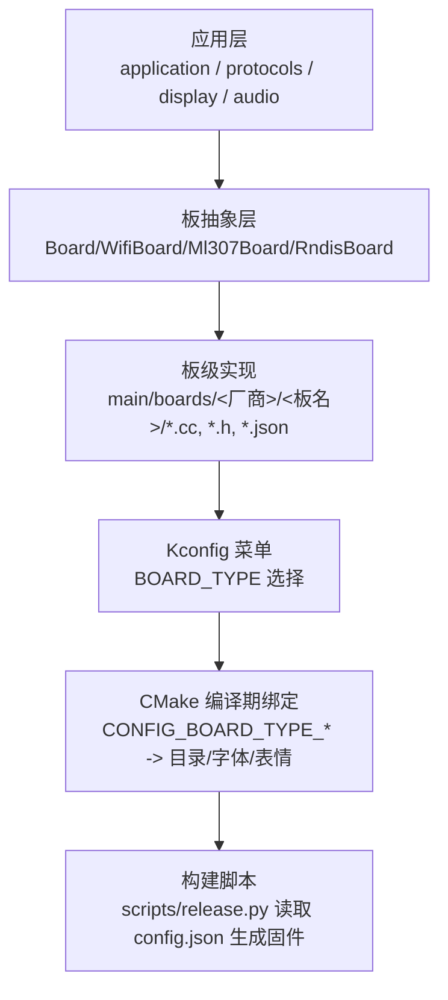
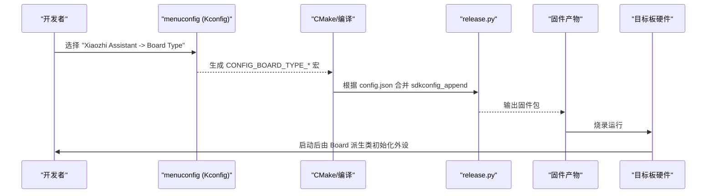
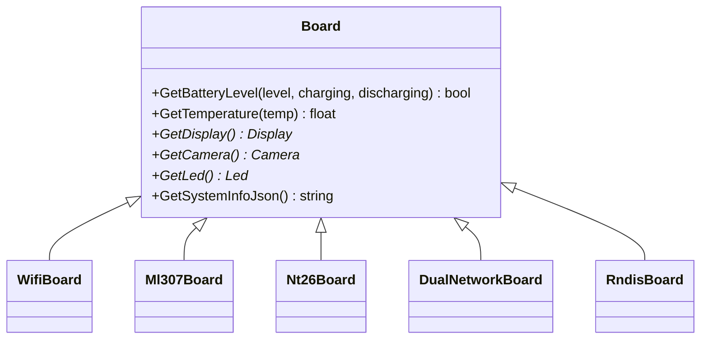
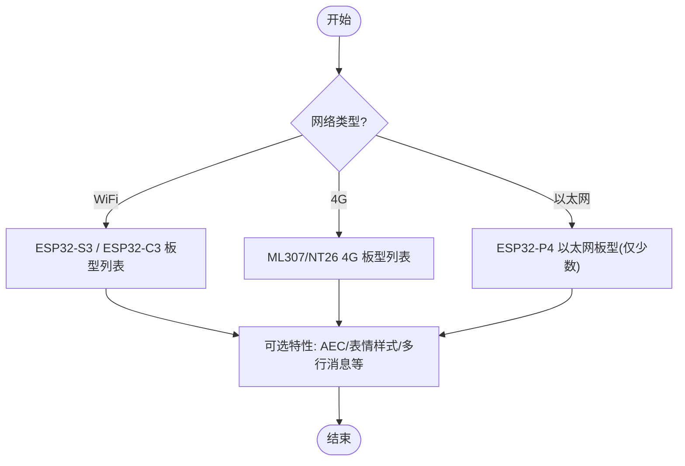

# 支持的硬件平台

<cite>
**本文引用的文件**
- [README.md](file://README.md)
- [Kconfig.projbuild](file://main/Kconfig.projbuild)
- [custom-board.md](file://docs/custom-board.md)
- [board.cc](file://main/boards/common/board.cc)
</cite>

## 目录
1. [简介](#简介)
2. [项目结构](#项目结构)
3. [核心组件](#核心组件)
4. [架构总览](#架构总览)
5. [详细组件分析](#详细组件分析)
6. [依赖关系分析](#依赖关系分析)
7. [性能与功耗考量](#性能与功耗考量)
8. [故障排查指南](#故障排查指南)
9. [结论](#结论)
10. [附录：已适配硬件清单与选型指南](#附录已适配硬件清单与选型指南)

## 简介
本文件面向小智AI聊天机器人（ESP32系列）的硬件支持，系统梳理并分类整理仓库中已适配的70+种开发板与硬件设备。内容按芯片类型（ESP32-C3、ESP32-S3、ESP32-P4等）与用途进行组织，提供每种硬件的简要规格说明、特点优势与适用场景；同时给出硬件选择指南与新硬件适配的基本要求和步骤概述，帮助开发者快速完成选型与落地。

## 项目结构
本项目将“硬件板级适配”以“板级目录 + Kconfig/CMake 注册 + 构建脚本”的方式统一管理：
- 每个板子位于 main/boards/<厂商>/<板名>/ 或 main/boards/<板名>/ 下，包含板级初始化代码、引脚配置、屏幕/音频/电源等驱动与资源。
- 通过 main/Kconfig.projbuild 中的 BOARD_TYPE 选项暴露所有已适配板型，并按目标芯片（IDF_TARGET_ESP32S3/ESP32C3/ESP32P4 等）过滤显示。
- 通过 main/CMakeLists.txt 将选中的 BOARD_TYPE 映射到具体目录与字体/表情等资源。
- 使用 scripts/release.py 可基于板目录下的 config.json 自动设置 target、合并 sdkconfig_append、打包固件。

图示来源
- [Kconfig.projbuild:146-615](file://main/Kconfig.projbuild#L146-L615)
- [custom-board.md:281-391](file://docs/custom-board.md#L281-L391)

章节来源
- [custom-board.md:1-474](file://docs/custom-board.md#L1-L474)
- [Kconfig.projbuild:146-615](file://main/Kconfig.projbuild#L146-L615)

## 核心组件
- 板抽象基类与通用能力
  - Board 基类提供默认空实现（如电池、温度、显示、摄像头、LED），各板派生类按需覆盖。
  - WifiBoard、Ml307Board/Nt26Board、DualNetworkBoard、RndisBoard 等子类封装不同网络接入方式。
- 板级配置与注册
  - Kconfig 中为每块板定义一个 BOARD_TYPE_* 选项，并通过 depends on IDF_TARGET_* 限制可用芯片。
  - CMake 中将 CONFIG_BOARD_TYPE_* 映射到具体目录、内置字体与表情集合。
- 构建与发布
  - 板目录下提供 config.json，指定 target、name、sdkconfig_append，release.py 据此自动化构建与打包。

章节来源
- [board.cc:48-95](file://main/boards/common/board.cc#L48-L95)
- [Kconfig.projbuild:146-615](file://main/Kconfig.projbuild#L146-L615)
- [custom-board.md:281-391](file://docs/custom-board.md#L281-L391)

## 架构总览
下图展示从“用户选择板型”到“固件生成”的关键路径，以及运行时板抽象层如何对接具体硬件。

图示来源
- [Kconfig.projbuild:146-615](file://main/Kconfig.projbuild#L146-L615)
- [custom-board.md:359-371](file://docs/custom-board.md#L359-L371)

## 详细组件分析

### 板抽象层与继承关系
- 基类 Board 提供默认行为，派生类覆盖 GetAudioCodec()/GetDisplay()/GetBacklight()/GetCamera() 等接口。
- 网络相关基类封装了 WiFi/4G/RNDIS 等差异，统一对外暴露连接与状态管理。

图示来源
- [board.cc:48-95](file://main/boards/common/board.cc#L48-L95)
- [custom-board.md:447-454](file://docs/custom-board.md#L447-L454)

章节来源
- [board.cc:48-95](file://main/boards/common/board.cc#L48-L95)
- [custom-board.md:447-454](file://docs/custom-board.md#L447-L454)

### 新硬件适配流程（要点）
- 创建板目录与配置文件
  - 在 main/boards/<厂商>/<板名>/ 下放置 xxx_board.cc、config.h、config.json、README.md。
  - config.json 指定 target、name、sdkconfig_append（Flash大小、分区表、语言、唤醒词策略等）。
- 实现板级类
  - 继承自 WifiBoard/Ml307Board/DualNetworkBoard/RndisBoard 之一，初始化 I2C/SPI/按钮/显示/背光等，并返回对应对象。
- 注册到构建系统
  - 在 Kconfig 的 choice BOARD_TYPE 中添加一项，depends on 正确的 IDF_TARGET_*。
  - 在 CMakeLists.txt 中增加分支，将 CONFIG_BOARD_TYPE_* 映射到目录与字体/表情。
- 构建与验证
  - 使用 idf.py menuconfig 选择板型，或直接 python scripts/release.py <板目录> 一键构建。

章节来源
- [custom-board.md:24-135](file://docs/custom-board.md#L24-L135)
- [custom-board.md:136-280](file://docs/custom-board.md#L136-L280)
- [custom-board.md:281-391](file://docs/custom-board.md#L281-L391)
- [custom-board.md:359-371](file://docs/custom-board.md#L359-L371)

## 依赖关系分析
- 板型与芯片目标强耦合：每个 BOARD_TYPE_* 均通过 depends on IDF_TARGET_* 限定可用芯片，避免跨芯片误用。
- 功能开关与板型联动：例如 USE_DEVICE_AEC、DISPLAY_STYLE、WAKE_WORD_TYPE 等选项对特定板型有条件启用。
- 以太网仅支持部分 P4 板：XIAOZHI_NETWORK_ETHERNET 仅在 ESP32-P4 上可用，且 ETH_BOARD_TYPE 当前指向 Waveshare ESP32-P4-NANO。

图示来源
- [Kconfig.projbuild:120-139](file://main/Kconfig.projbuild#L120-L139)
- [Kconfig.projbuild:924-934](file://main/Kconfig.projbuild#L924-L934)
- [Kconfig.projbuild:816-833](file://main/Kconfig.projbuild#L816-L833)

章节来源
- [Kconfig.projbuild:120-139](file://main/Kconfig.projbuild#L120-L139)
- [Kconfig.projbuild:924-934](file://main/Kconfig.projbuild#L924-L934)
- [Kconfig.projbuild:816-833](file://main/Kconfig.projbuild#L816-L833)

## 性能与功耗考量
- 语音唤醒与降噪
  - 带 PSRAM 的 ESP32-S3/ESP32-P4 可启用 AFE 唤醒与音频降噪，提升远场体验。
  - 无 PSRAM 的 C3/C5/C6 可使用 Wakenet 模型（无 AFE）。
- 回声消除（AEC）
  - 设备端 AEC 需要干净的扬声器参考路径与良好的声学隔离，仅对部分板型建议开启。
- 显示与交互
  - 表情动画样式仅对部分板型可用；多行消息显示需配合默认消息样式。
- 相机与图像旋转
  - ESP32-P4 支持硬件 JPEG 编解码与 PPA 旋转，其他芯片软件旋转有性能开销。

章节来源
- [Kconfig.projbuild:846-923](file://main/Kconfig.projbuild#L846-L923)
- [Kconfig.projbuild:987-1063](file://main/Kconfig.projbuild#L987-L1063)

## 故障排查指南
- 显示异常
  - 检查 SPI 配置、镜像/翻转、颜色反转参数是否与屏匹配。
- 无声/杂音
  - 核对 I2S 引脚、PA 使能引脚、Codec I2C 地址与采样率。
- 无法连 Wi-Fi
  - 确认配网方式（热点/蓝牙 Blufi/声学）与凭证正确性。
- 无法连接服务器
  - 校验 WebSocket/MQTT 端点与证书/代理设置。
- 自定义板 OTA 风险
  - 不要覆盖已有板配置，务必新建独立板型与固件通道，避免被官方固件覆盖。

章节来源
- [custom-board.md:462-468](file://docs/custom-board.md#L462-L468)
- [custom-board.md:5-10](file://docs/custom-board.md#L5-L10)

## 结论
小智AI聊天机器人已广泛适配 ESP32 系列主流开发板与第三方产品，覆盖 WiFi/4G/以太网等多种联网方式，并提供完善的板抽象层与构建体系。开发者可按本文档的选型指南快速定位合适板型，也可依据“新硬件适配流程”低成本扩展新板支持。

## 附录：已适配硬件清单与选型指南

### 一、按芯片类型分类的已适配硬件（节选）
说明：以下清单来源于 Kconfig 中 BOARD_TYPE 选项与 README 公开信息，按芯片族归类，便于快速筛选。

- ESP32-C3
  - Xmini C3 / Xmini C3 V3 / Xmini C3 4G
  - Kevin C3
  - ESP-HI
  - Surfer-C3-1.14TFT
  - 立创·实战派 ESP32-C3
  - 正点原子 DNESP32S3M-WIFI（注：名称含S3但实际为C3方案，见Kconfig）
  - 其他C3系示例板（面包板基础版等）

- ESP32-S3
  - Espressif ESP-BOX / ESP-BOX-3 / ESP-BOX-Lite / ESP-VoCat / Korvo2 V3 / SparkBot / Spot-S3
  - M5Stack CoreS3 / StickS3 / AtomS3R + Echo Base / AtomS3 + Echo Base / Cardputer Adv / StopWatch
  - Waveshare 系列（AMOLED/LCD/ePaper/RLCD/RGB-Matrix 等多尺寸触控与非触控屏）
  - LILYGO T-Circle-S3 / T-CameraPlus-S3 / T-Display-S3-Pro-MVSRLora
  - 正点原子 DNESP32S3 / BOX / BOX0 / BOX2(WiFi/4G) / BOX3 / DNESP32S3M(WiFi/4G)
  - 无名科技星智系列（0.85/0.96/1.54 TFT/OLED，WiFi/4G 多种组合）
  - 征辰科技 1.54TFT/AI Camera（WiFi/4G）
  - 四博智联 AI陪伴盒子
  - 亘具科技 1.54(S3)
  - 太极小派 ESP32S3
  - 九川智能
  - labplus mpython_v3 / ledong_v2
  - 小智云聊-S3
  - Movecall Moji / CuiCan
  - 全动 ESP32-S3 开发板
  - 元控·青春 Mixgo Nova
  - 鱼鹰科技 3.13LCD
  - 土豆子
  - 乐鑫 ESP32-S3 LCD EV Board / EV Board 2
  - 其它 DIY 面包板基础套件（WiFi/LCD/Camera/4G 组合）

- ESP32-P4
  - Waveshare ESP32-P4-NANO（支持以太网）
  - Waveshare ESP32-P4-WiFi6 Touch LCD 系列（多尺寸）
  - LILYGO T-Display-P4
  - M5Stack Tab5
  - Wireless-Tag WTP4C5MP07S
  - Espressif ESP-P4-Function-EV-Board

- ESP32（经典）
  - 面包板基础版（ESP32 DevKit）
  - 立创·实战派 ESP32（非S3）
  - CGC / CGC 144
  - M5Stack AtomMatrix + Echo Base
  - Waveshare ESP32-Touch-LCD-3.5

- ESP32-C5/C6
  - Waveshare ESP32-C5-Touch-LCD-1.69
  - Waveshare ESP32-C6 系列（LCD/Touch AMOLED 多尺寸）
  - ESP-SensairShuttle / Spot-C5

章节来源
- [Kconfig.projbuild:146-615](file://main/Kconfig.projbuild#L146-L615)
- [README.md:51-103](file://README.md#L51-L103)

### 二、按用途分类的推荐板型
- 入门与学习
  - 面包板基础套件（ESP32/ESP32-S3）、Xmini C3、Surfer-C3-1.14TFT
  - 特点：成本低、资料丰富、适合快速上手
  - 适用：初学者、教学演示、原型验证

- 桌面/便携对话终端
  - ESP-BOX/ESP-BOX-3、AtomS3R + Echo Base、CoreS3、Magiclick 系列
  - 特点：集成麦克风/扬声器/屏幕，开箱即用
  - 适用：桌面助手、语音交互原型

- 可穿戴/挂饰
  - Movecall CuiCan、Moji、Xmini C3
  - 特点：体积小、低功耗、佩戴友好
  - 适用：随身助手、通知提醒

- 工业/户外/物联网
  - SenseCAP Watcher、Wireless-Tag WTP4C5MP07S、ML307/NT26 4G 板
  - 特点：广域通信、耐候性强
  - 适用：远程监控、巡检终端

- 高算力/视频与以太网
  - ESP32-P4 系列（Nano/P4-WiFi6 Touch LCD/T-Display-P4/Tab5）
  - 特点：更高主频、更多外设、支持以太网/PPA/JPEG硬件加速
  - 适用：复杂UI、视频处理、网关/边缘计算

章节来源
- [README.md:51-103](file://README.md#L51-L103)
- [Kconfig.projbuild:120-139](file://main/Kconfig.projbuild#L120-L139)

### 三、硬件选择指南（决策树）
- 是否需要4G？
  - 是：优先选择 ML307/NT26 4G 板（如面包板4G版、无名科技星智4G版）
  - 否：继续
- 是否需要以太网？
  - 是：选择 ESP32-P4 以太网板（如 Waveshare ESP32-P4-NANO）
  - 否：继续
- 是否需要彩色大屏/复杂UI？
  - 是：选择 ESP32-S3 大尺寸触控屏板或 ESP32-P4 系列
  - 否：继续
- 是否追求低功耗/小型化？
  - 是：选择 ESP32-C3 系列（Xmini C3、Surfer-C3-1.14TFT 等）
  - 否：继续
- 是否需要摄像头？
  - 是：选择带摄像头的 S3/P4 板（如 LILYGO T-CameraPlus-S3、Waveshare CAM 系列）
  - 否：继续
- 是否需要离线唤醒/降噪？
  - 是：选择带 PSRAM 的 S3/P4 板并启用 AFE 唤醒与降噪
  - 否：继续

### 四、新硬件适配基本要求与步骤
- 基本要求
  - 明确目标芯片（ESP32/ESP32-C3/ESP32-S3/ESP32-P4/ESP32-C5/ESP32-C6）
  - 提供完整引脚定义（音频I2S、Codec I2C、SPI屏、按键、背光、摄像头等）
  - 准备分区表与Flash容量配置（4MB/8MB/16MB）
  - 如需以太网/4G，需确认PHY/模组型号与GPIO映射
- 步骤概述
  1) 创建板目录与 config.json（target/name/sdkconfig_append）
  2) 编写板级类（初始化外设、覆写 GetAudioCodec/GetDisplay/GetBacklight 等）
  3) 在 Kconfig 的 BOARD_TYPE 添加选项，depends on 正确 IDF_TARGET_*
  4) 在 CMakeLists.txt 增加分支，绑定目录与字体/表情
  5) 使用 release.py 或 idf.py 构建、烧录与联调
  6) 编写 README 说明硬件要求与注意事项

章节来源
- [custom-board.md:24-135](file://docs/custom-board.md#L24-L135)
- [custom-board.md:136-280](file://docs/custom-board.md#L136-L280)
- [custom-board.md:281-391](file://docs/custom-board.md#L281-L391)
- [custom-board.md:359-371](file://docs/custom-board.md#L359-L371)