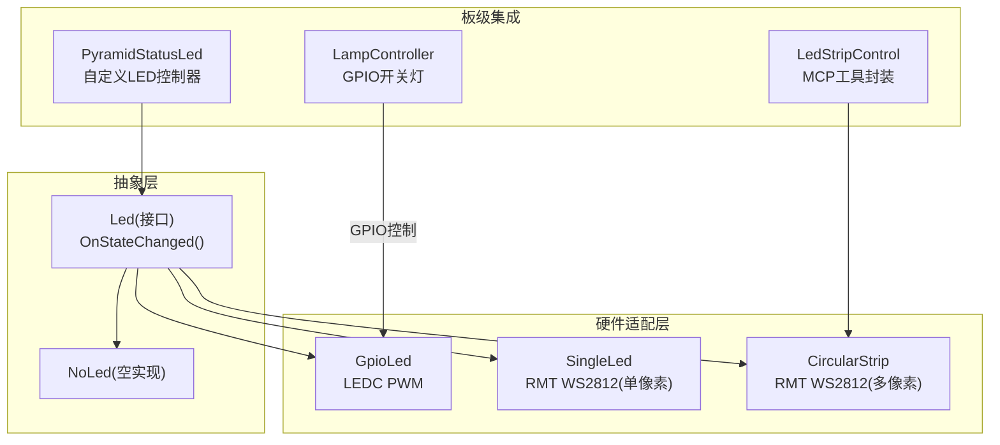
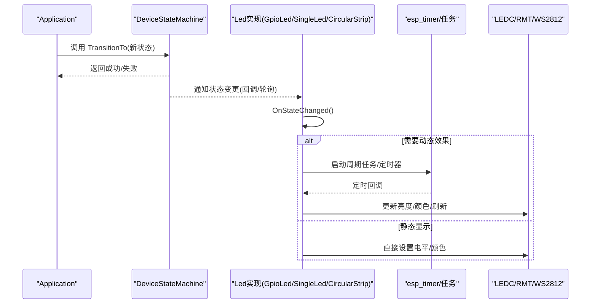
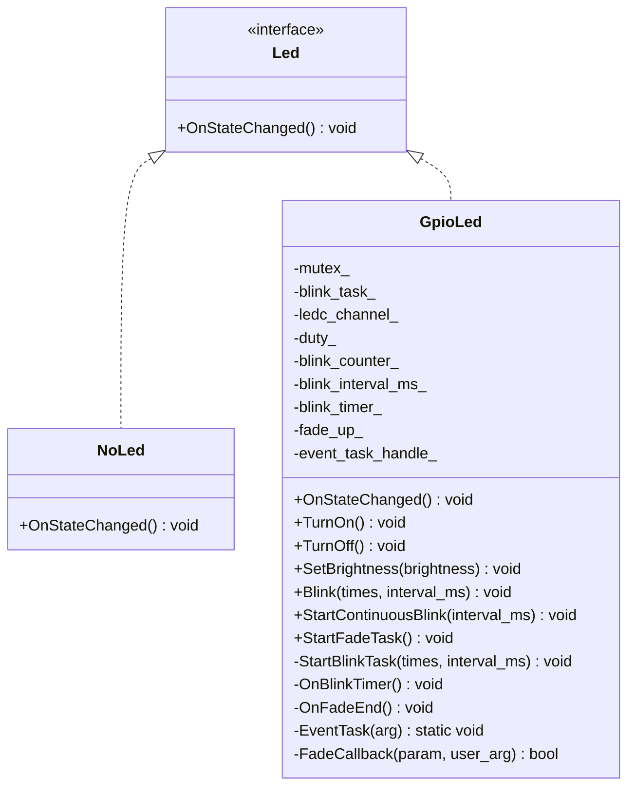
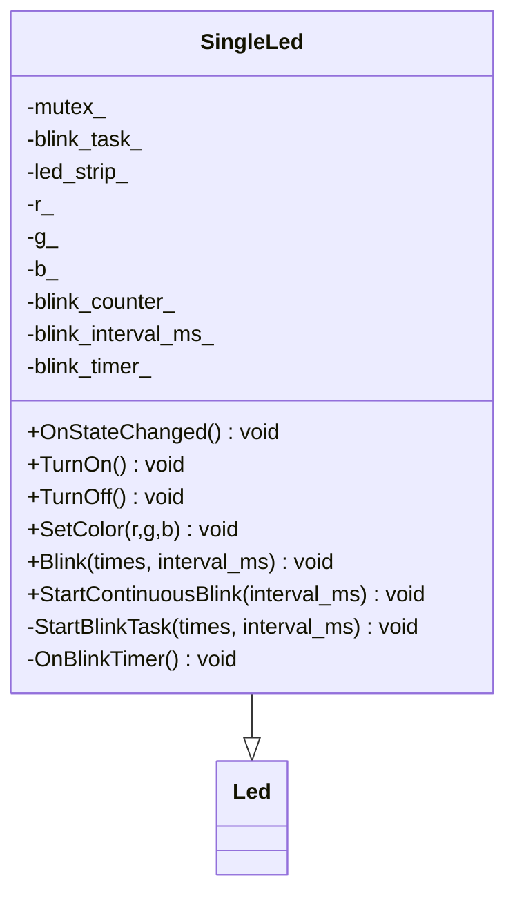
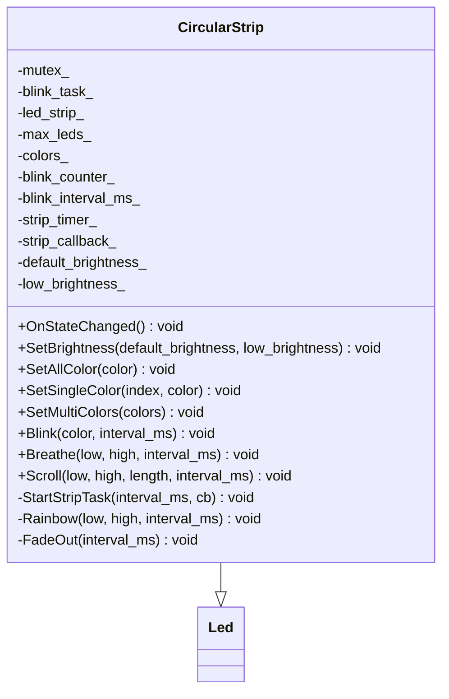
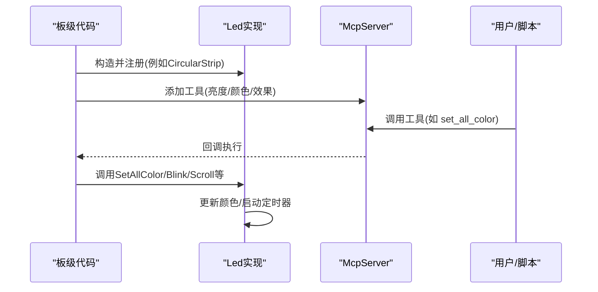
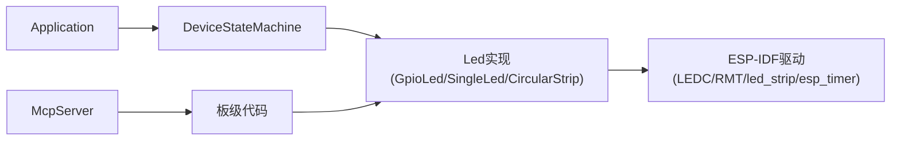

# LED指示灯系统

<cite>
**本文引用的文件列表**
- [main/led/led.h](file://main/led/led.h)
- [main/led/gpio_led.h](file://main/led/gpio_led.h)
- [main/led/gpio_led.cc](file://main/led/gpio_led.cc)
- [main/led/single_led.h](file://main/led/single_led.h)
- [main/led/single_led.cc](file://main/led/single_led.cc)
- [main/led/circular_strip.h](file://main/led/circular_strip.h)
- [main/led/circular_strip.cc](file://main/led/circular_strip.cc)
- [main/device_state_machine.h](file://main/device_state_machine.h)
- [main/device_state_machine.cc](file://main/device_state_machine.cc)
- [main/boards/atoms3r-echo-pyramid/atoms3r_echo_pyramid.cc](file://main/boards/atoms3r-echo-pyramid/atoms3r_echo_pyramid.cc)
- [main/boards/df-k10/led_control.h](file://main/boards/df-k10/led_control.h)
- [main/boards/df-k10/led_control.cc](file://main/boards/df-k10/led_control.cc)
- [main/boards/common/lamp_controller.h](file://main/boards/common/lamp_controller.h)
</cite>

## 目录
1. [简介](#简介)
2. [项目结构](#项目结构)
3. [核心组件](#核心组件)
4. [架构总览](#架构总览)
5. [详细组件分析](#详细组件分析)
6. [依赖关系分析](#依赖关系分析)
7. [性能与资源特性](#性能与资源特性)
8. [故障排查指南](#故障排查指南)
9. [结论](#结论)
10. [附录：颜色编码与状态映射、动态效果规范](#附录颜色编码与状态映射动态效果规范)

## 简介
本文件系统性地梳理了LED指示灯系统的抽象接口设计与多种硬件实现，包括单色LED、RGB灯带、环形灯条等。文档重点说明状态指示逻辑、颜色编码规范、动态效果（闪烁、呼吸、滚动）的实现方法，并给出电源状态同步、网络连接指示、语音交互反馈等典型场景的集成示例。同时提供自定义LED效果与第三方驱动集成的开发指南，帮助在不同板级平台上快速扩展LED能力。

## 项目结构
LED子系统位于 main/led 目录下，采用“统一抽象 + 多实现”的设计：
- 抽象层：Led 基类定义统一的 OnStateChanged 回调接口，以及 NoLed 空实现用于无LED平台。
- 硬件适配层：
  - GpioLed：基于ESP32 LEDC的PWM控制，支持亮度调节、闪烁、呼吸渐变。
  - SingleLed：基于RMT驱动的WS2812单像素灯，支持颜色设置与闪烁。
  - CircularStrip：基于RMT驱动的WS2812环形/条形灯带，支持整带/单点/多点颜色设置，以及闪烁、呼吸、滚动等动态效果。
- 板级集成：各板可在其板文件中实例化具体LED类，并在设备状态变化时触发 OnStateChanged。

图表来源
- [main/led/led.h:1-18](file://main/led/led.h#L1-L18)
- [main/led/gpio_led.h:13-47](file://main/led/gpio_led.h#L13-L47)
- [main/led/single_led.h:11-36](file://main/led/single_led.h#L11-L36)
- [main/led/circular_strip.h:19-50](file://main/led/circular_strip.h#L19-L50)
- [main/boards/atoms3r-echo-pyramid/atoms3r_echo_pyramid.cc:205-230](file://main/boards/atoms3r-echo-pyramid/atoms3r_echo_pyramid.cc#L205-L230)
- [main/boards/df-k10/led_control.h:6-16](file://main/boards/df-k10/led_control.h#L6-L16)
- [main/boards/common/lamp_controller.h:7-45](file://main/boards/common/lamp_controller.h#L7-L45)

章节来源
- [main/led/led.h:1-18](file://main/led/led.h#L1-L18)
- [main/led/gpio_led.h:13-47](file://main/led/gpio_led.h#L13-L47)
- [main/led/single_led.h:11-36](file://main/led/single_led.h#L11-L36)
- [main/led/circular_strip.h:19-50](file://main/led/circular_strip.h#L19-L50)

## 核心组件
- Led 抽象接口
  - 职责：定义统一的设备状态到LED行为的映射入口 OnStateChanged。
  - 设计要点：所有LED实现均继承自该接口，便于在应用层以统一方式订阅设备状态变化。
- NoLed 空实现
  - 用途：在无LED硬件的平台中作为占位实现，避免条件编译带来的复杂分支。
- GpioLed（单路PWM LED）
  - 硬件：ESP32 LEDC通道，支持输出反转、亮度调节、定时器驱动的闪烁与硬件渐变的呼吸效果。
  - 关键能力：TurnOn/TurnOff/SetBrightness/Blink/StartContinuousBlink/StartFadeTask。
- SingleLed（单像素WS2812）
  - 硬件：ESP32 RMT驱动WS2812，单像素控制。
  - 关键能力：SetColor/TurnOn/TurnOff/Blink/StartContinuousBlink。
- CircularStrip（多像素WS2812）
  - 硬件：ESP32 RMT驱动WS2812，支持最大LED数量配置。
  - 关键能力：SetAllColor/SetSingleColor/SetMultiColors/Blink/Breathe/Scroll/FadeOut/SetBrightness。

章节来源
- [main/led/led.h:1-18](file://main/led/led.h#L1-L18)
- [main/led/gpio_led.h:13-47](file://main/led/gpio_led.h#L13-L47)
- [main/led/single_led.h:11-36](file://main/led/single_led.h#L11-L36)
- [main/led/circular_strip.h:19-50](file://main/led/circular_strip.h#L19-L50)

## 架构总览
LED子系统通过设备状态机驱动，将设备状态转换为具体的LED行为。每个LED实现内部维护定时器或任务，负责周期性刷新显示效果；同时使用互斥锁保证线程安全。

图表来源
- [main/device_state_machine.h:17-81](file://main/device_state_machine.h#L17-L81)
- [main/device_state_machine.cc:119-161](file://main/device_state_machine.cc#L119-L161)
- [main/led/gpio_led.cc:207-254](file://main/led/gpio_led.cc#L207-L254)
- [main/led/single_led.cc:123-167](file://main/led/single_led.cc#L123-L167)
- [main/led/circular_strip.cc:197-245](file://main/led/circular_strip.cc#L197-L245)

## 详细组件分析

### 抽象接口与空实现
- Led 接口
  - 方法：OnStateChanged()
  - 语义：当设备状态变化时，由上层触发此方法，实现类据此更新LED显示。
- NoLed
  - 作用：无LED平台的空实现，避免运行时判断。

章节来源
- [main/led/led.h:1-18](file://main/led/led.h#L1-L18)

### GpioLed（单路PWM LED）
- 初始化
  - 配置LEDC定时器与通道，注册fade回调，创建blink定时器与事件任务。
- 主要能力
  - SetBrightness：按百分比映射到LEDC占空比。
  - TurnOn/TurnOff：停止定时器与渐变，直接设置占空比。
  - Blink/StartContinuousBlink：基于定时器切换占空比实现闪烁。
  - StartFadeTask：利用硬件渐变实现呼吸效果，回调通知任务翻转方向。
- 状态映射
  - 不同设备状态对应不同的亮度与动态效果（如启动、配网、空闲、连接、监听、说话、升级、激活）。

图表来源
- [main/led/led.h:1-18](file://main/led/led.h#L1-L18)
- [main/led/gpio_led.h:13-47](file://main/led/gpio_led.h#L13-L47)
- [main/led/gpio_led.cc:28-89](file://main/led/gpio_led.cc#L28-L89)
- [main/led/gpio_led.cc:100-205](file://main/led/gpio_led.cc#L100-L205)
- [main/led/gpio_led.cc:207-263](file://main/led/gpio_led.cc#L207-L263)

章节来源
- [main/led/gpio_led.h:13-47](file://main/led/gpio_led.h#L13-L47)
- [main/led/gpio_led.cc:28-89](file://main/led/gpio_led.cc#L28-L89)
- [main/led/gpio_led.cc:100-205](file://main/led/gpio_led.cc#L100-L205)
- [main/led/gpio_led.cc:207-263](file://main/led/gpio_led.cc#L207-L263)

### SingleLed（单像素WS2812）
- 初始化
  - 使用RMT驱动WS2812，创建blink定时器。
- 主要能力
  - SetColor/TurnOn/TurnOff：设置像素颜色并刷新。
  - Blink/StartContinuousBlink：基于定时器切换像素点亮/熄灭。
- 状态映射
  - 根据设备状态设置不同颜色与闪烁策略。

图表来源
- [main/led/single_led.h:11-36](file://main/led/single_led.h#L11-L36)
- [main/led/single_led.cc:14-52](file://main/led/single_led.cc#L14-L52)
- [main/led/single_led.cc:55-120](file://main/led/single_led.cc#L55-L120)
- [main/led/single_led.cc:123-167](file://main/led/single_led.cc#L123-L167)

章节来源
- [main/led/single_led.h:11-36](file://main/led/single_led.h#L11-L36)
- [main/led/single_led.cc:14-52](file://main/led/single_led.cc#L14-L52)
- [main/led/single_led.cc:55-120](file://main/led/single_led.cc#L55-L120)
- [main/led/single_led.cc:123-167](file://main/led/single_led.cc#L123-L167)

### CircularStrip（多像素WS2812）
- 初始化
  - 配置RMT驱动WS2812，创建strip定时器，分配颜色缓冲区。
- 主要能力
  - SetAllColor/SetSingleColor/SetMultiColors：批量或单点设置颜色并刷新。
  - Blink/Breathe/Scroll/FadeOut：基于定时器回调实现的动态效果。
  - SetBrightness：设置默认与低亮度等级，并立即应用当前状态。
- 状态映射
  - 针对不同设备状态选择合适的全带颜色与动态效果。

图表来源
- [main/led/circular_strip.h:19-50](file://main/led/circular_strip.h#L19-L50)
- [main/led/circular_strip.cc:10-49](file://main/led/circular_strip.cc#L10-L49)
- [main/led/circular_strip.cc:52-177](file://main/led/circular_strip.cc#L52-L177)
- [main/led/circular_strip.cc:191-245](file://main/led/circular_strip.cc#L191-L245)

章节来源
- [main/led/circular_strip.h:19-50](file://main/led/circular_strip.h#L19-L50)
- [main/led/circular_strip.cc:10-49](file://main/led/circular_strip.cc#L10-L49)
- [main/led/circular_strip.cc:52-177](file://main/led/circular_strip.cc#L52-L177)
- [main/led/circular_strip.cc:191-245](file://main/led/circular_strip.cc#L191-L245)

### 板级集成与第三方驱动示例
- 自定义LED控制器（PyramidStatusLed）
  - 通过I2C控制外部LED芯片，依据设备状态设置不同颜色。
- MCP工具封装（LedStripControl）
  - 为CircularStrip暴露亮度、颜色、闪烁、滚动等MCP工具，便于远程或脚本控制。
- GPIO开关灯（LampController）
  - 通过GPIO控制外部灯具，与LED子系统解耦但可协同工作。

图表来源
- [main/boards/atoms3r-echo-pyramid/atoms3r_echo_pyramid.cc:205-230](file://main/boards/atoms3r-echo-pyramid/atoms3r_echo_pyramid.cc#L205-L230)
- [main/boards/df-k10/led_control.h:6-16](file://main/boards/df-k10/led_control.h#L6-L16)
- [main/boards/df-k10/led_control.cc:19-116](file://main/boards/df-k10/led_control.cc#L19-L116)
- [main/boards/common/lamp_controller.h:7-45](file://main/boards/common/lamp_controller.h#L7-L45)

章节来源
- [main/boards/atoms3r-echo-pyramid/atoms3r_echo_pyramid.cc:205-230](file://main/boards/atoms3r-echo-pyramid/atoms3r_echo_pyramid.cc#L205-L230)
- [main/boards/df-k10/led_control.h:6-16](file://main/boards/df-k10/led_control.h#L6-L16)
- [main/boards/df-k10/led_control.cc:19-116](file://main/boards/df-k10/led_control.cc#L19-L116)
- [main/boards/common/lamp_controller.h:7-45](file://main/boards/common/lamp_controller.h#L7-L45)

## 依赖关系分析
- 组件耦合
  - Led实现依赖 Application 获取设备状态，从而在 OnStateChanged 中做出响应。
  - GpioLed 依赖 ESP-IDF LEDC 与 esp_timer；SingleLed/CircularStrip 依赖 RMT 与 led_strip 驱动。
  - 板级代码可能通过 MCP 工具间接调用LED功能。
- 潜在循环依赖
  - Led实现仅读取设备状态，不反向修改状态机，避免循环依赖。
- 外部依赖
  - ESP-IDF 驱动：LEDC、RMT、led_strip、esp_timer。
  - 可选：MCP服务器（用于工具暴露）。

图表来源
- [main/device_state_machine.h:17-81](file://main/device_state_machine.h#L17-L81)
- [main/led/gpio_led.cc:207-254](file://main/led/gpio_led.cc#L207-L254)
- [main/led/single_led.cc:123-167](file://main/led/single_led.cc#L123-L167)
- [main/led/circular_strip.cc:197-245](file://main/led/circular_strip.cc#L197-L245)

章节来源
- [main/device_state_machine.h:17-81](file://main/device_state_machine.h#L17-L81)
- [main/device_state_machine.cc:119-161](file://main/device_state_machine.cc#L119-L161)

## 性能与资源特性
- 定时器与任务
  - 各LED实现使用 esp_timer 进行周期刷新，避免阻塞主循环；GpioLed额外使用事件任务处理硬件渐变回调。
- 并发与线程安全
  - 使用互斥锁保护对底层驱动的访问，防止多线程竞争导致的显示异常。
- 资源占用
  - LEDC与RMT均为硬件外设，CPU占用较低；多像素灯带的刷新频率与像素数量会影响带宽与功耗。
- 优化建议
  - 合理设置刷新间隔，避免过高频率导致功耗上升。
  - 在空闲状态下降低亮度或使用淡出效果，节省能耗。

[本节为通用指导，无需特定文件引用]

## 故障排查指南
- LED无响应
  - 检查GPIO是否连接到实际引脚，若未连接应使用 NoLed 占位。
  - 确认初始化流程是否完成（LEDC/RMT配置、定时器创建）。
- 显示异常或闪烁不稳定
  - 检查互斥锁是否正确加锁，避免并发写入底层驱动。
  - 调整定时器间隔与亮度参数，确保在目标硬件上稳定运行。
- 呼吸效果不生效
  - 确认已安装fade服务并正确注册回调；检查回调任务是否正常唤醒。
- 多像素灯带颜色错乱
  - 校验颜色分量格式与模型配置（GRB/WS2812），确保与硬件一致。

章节来源
- [main/led/gpio_led.cc:28-89](file://main/led/gpio_led.cc#L28-L89)
- [main/led/gpio_led.cc:173-205](file://main/led/gpio_led.cc#L173-L205)
- [main/led/single_led.cc:14-52](file://main/led/single_led.cc#L14-L52)
- [main/led/circular_strip.cc:10-49](file://main/led/circular_strip.cc#L10-L49)

## 结论
LED子系统通过统一的抽象接口与多样化的硬件实现，提供了灵活且可扩展的状态指示方案。结合设备状态机，系统能够以一致的编程模型驱动不同LED类型，满足从简单单色LED到复杂RGB灯带的多种需求。配合MCP工具与板级定制，可实现丰富的交互体验与远程控制能力。

[本节为总结性内容，无需特定文件引用]

## 附录：颜色编码与状态映射、动态效果规范

### 状态到LED行为的映射（参考实现）
- 启动中（Starting）
  - GpioLed：中等亮度连续快闪。
  - SingleLed：蓝色连续快闪。
  - CircularStrip：滚动高亮段。
- 配网中（WifiConfiguring）
  - GpioLed：中等亮度慢闪。
  - SingleLed：蓝色慢闪。
  - CircularStrip：全带慢闪。
- 空闲（Idle）
  - GpioLed：低亮度常亮或关闭（取决于实现）。
  - SingleLed：关闭。
  - CircularStrip：淡出至关闭。
- 连接中（Connecting）
  - GpioLed：中等亮度常亮。
  - SingleLed：蓝色常亮。
  - CircularStrip：全带常亮。
- 监听/音频测试（Listening/AudioTesting）
  - GpioLed：根据语音检测高低亮度呼吸。
  - SingleLed：红色高/低亮度常亮。
  - CircularStrip：全带红色。
- 说话（Speaking）
  - GpioLed：较高亮度常亮。
  - SingleLed：绿色常亮。
  - CircularStrip：全带绿色。
- 升级（Upgrading）
  - GpioLed：中等亮度快闪。
  - SingleLed：绿色快闪。
  - CircularStrip：绿色快闪。
- 激活（Activating）
  - GpioLed：中等亮度慢闪。
  - SingleLed：绿色慢闪。
  - CircularStrip：绿色慢闪。

章节来源
- [main/led/gpio_led.cc:207-254](file://main/led/gpio_led.cc#L207-L254)
- [main/led/single_led.cc:123-167](file://main/led/single_led.cc#L123-L167)
- [main/led/circular_strip.cc:197-245](file://main/led/circular_strip.cc#L197-L245)

### 动态效果规范
- 闪烁（Blink）
  - 参数：颜色、间隔毫秒、次数（无限次可用特殊值）。
  - 实现：定时器周期切换亮/灭。
- 呼吸（Breathe）
  - 参数：低/高颜色、间隔毫秒。
  - 实现：在低/高之间线性过渡，达到边界后反向。
- 滚动（Scroll）
  - 参数：背景色、前景色、长度、间隔毫秒。
  - 实现：周期性偏移窗口，渲染固定长度的前景段。
- 淡出（FadeOut）
  - 参数：间隔毫秒。
  - 实现：逐帧减半颜色分量直至全黑。

章节来源
- [main/led/circular_strip.cc:81-177](file://main/led/circular_strip.cc#L81-L177)

### 应用场景示例
- 电源状态同步
  - 可通过 LampController 控制外部灯具，与LED状态联动，体现设备供电情况。
- 网络连接指示
  - 在连接中/失败/成功等状态切换时，使用不同颜色与闪烁模式直观反馈。
- 语音交互反馈
  - 监听阶段根据语音检测结果调整亮度或颜色；说话阶段使用显著颜色提示。

章节来源
- [main/boards/common/lamp_controller.h:7-45](file://main/boards/common/lamp_controller.h#L7-L45)
- [main/led/gpio_led.cc:207-254](file://main/led/gpio_led.cc#L207-L254)
- [main/led/single_led.cc:123-167](file://main/led/single_led.cc#L123-L167)
- [main/led/circular_strip.cc:197-245](file://main/led/circular_strip.cc#L197-L245)

### 自定义LED效果与第三方驱动集成指南
- 自定义LED控制器
  - 步骤：
    - 新建类继承 Led，实现 OnStateChanged。
    - 在板级代码中实例化并注册到应用。
    - 依据设备状态调用底层驱动API更新显示。
  - 示例：PyramidStatusLed 通过I2C控制外部LED芯片。
- 暴露MCP工具
  - 步骤：
    - 在板级代码中创建 LedStripControl 或直接调用 CircularStrip API。
    - 使用 McpServer.AddTool 注册工具，绑定属性与回调。
  - 示例：LedStripControl 暴露亮度、颜色、闪烁、滚动等工具。
- 注意事项
  - 确保线程安全：对外部驱动的访问需加锁。
  - 合理管理定时器生命周期：停止与释放资源，避免泄漏。
  - 颜色与格式匹配：确保与硬件一致（如GRB/WS2812）。

章节来源
- [main/boards/atoms3r-echo-pyramid/atoms3r_echo_pyramid.cc:205-230](file://main/boards/atoms3r-echo-pyramid/atoms3r_echo_pyramid.cc#L205-L230)
- [main/boards/df-k10/led_control.h:6-16](file://main/boards/df-k10/led_control.h#L6-L16)
- [main/boards/df-k10/led_control.cc:19-116](file://main/boards/df-k10/led_control.cc#L19-L116)