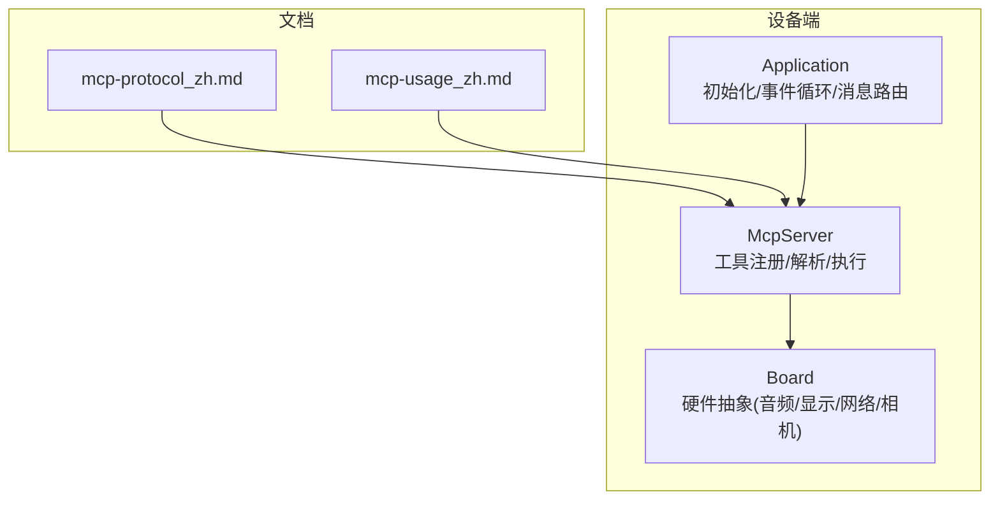
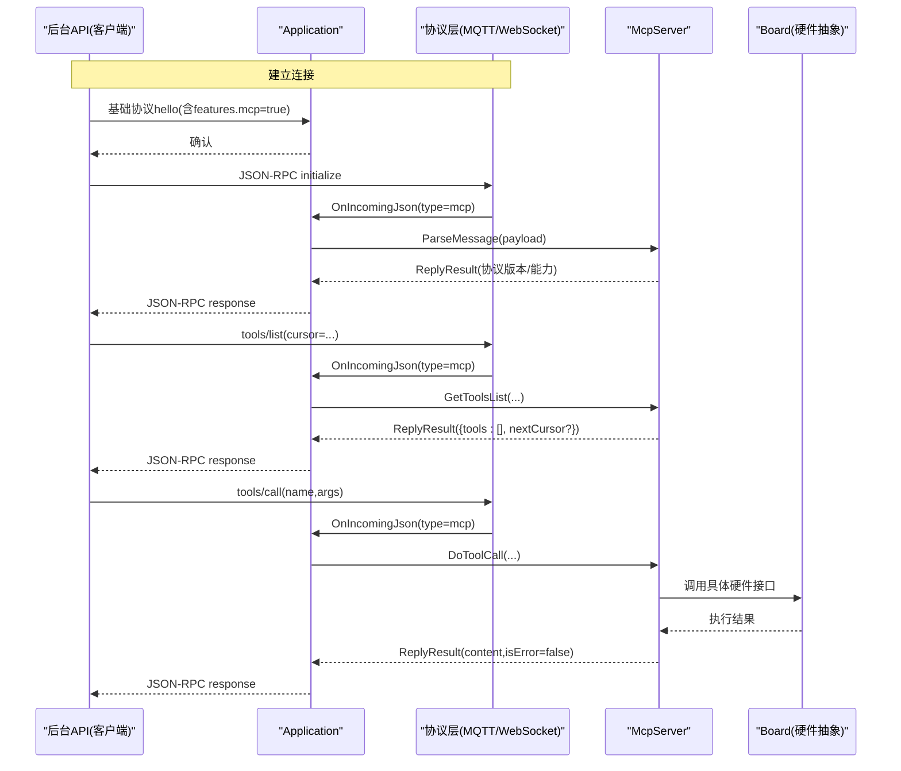
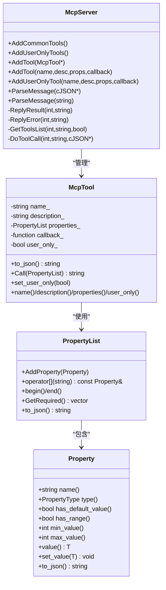
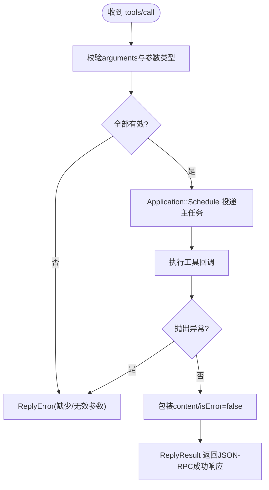
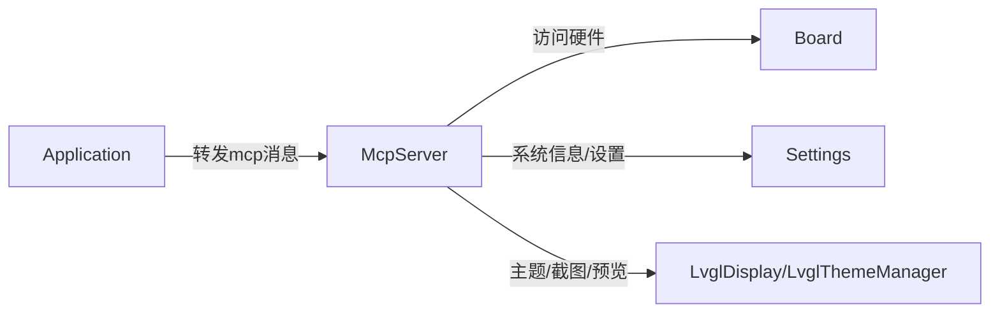

# MCP设备控制系统

<cite>
**本文引用的文件列表**
- [mcp_server.h](file://main/mcp_server.h)
- [mcp_server.cc](file://main/mcp_server.cc)
- [application.h](file://main/application.h)
- [application.cc](file://main/application.cc)
- [mcp-protocol_zh.md](file://docs/mcp-protocol_zh.md)
- [mcp-usage_zh.md](file://docs/mcp-usage_zh.md)
</cite>

## 目录
1. [简介](#简介)
2. [项目结构](#项目结构)
3. [核心组件](#核心组件)
4. [架构总览](#架构总览)
5. [详细组件分析](#详细组件分析)
6. [依赖关系分析](#依赖关系分析)
7. [性能与并发特性](#性能与并发特性)
8. [故障排查指南](#故障排查指南)
9. [结论](#结论)
10. [附录：API参考与示例](#附录api参考与示例)

## 简介
本文件系统性地梳理并文档化 ESP32 设备侧的 MCP（Model Context Protocol）设备控制子系统。MCP 基于 JSON-RPC 2.0，用于后台服务（客户端）与设备（服务器）之间发现与调用“工具”（Tool），实现对音频、屏幕、相机、系统信息、固件升级等硬件能力的统一控制。本文面向开发者与集成方，提供协议规范、实现架构、内置工具能力、自定义工具开发方法、错误处理与异步调度机制，以及完整的 API 参考与使用示例。

## 项目结构
与 MCP 相关的核心代码位于 main 目录下，协议说明位于 docs 目录。关键文件如下：
- 协议与用法说明：docs/mcp-protocol_zh.md、docs/mcp-usage_zh.md
- 服务端实现：main/mcp_server.h、main/mcp_server.cc
- 应用主循环与消息路由：main/application.h、main/application.cc

图表来源
- [mcp-protocol_zh.md:1-270](file://docs/mcp-protocol_zh.md#L1-L270)
- [mcp-usage_zh.md:1-115](file://docs/mcp-usage_zh.md#L1-L115)
- [application.cc:473-610](file://main/application.cc#L473-L610)
- [mcp_server.cc:33-298](file://main/mcp_server.cc#L33-L298)

章节来源
- [mcp-protocol_zh.md:1-270](file://docs/mcp-protocol_zh.md#L1-L270)
- [mcp-usage_zh.md:1-115](file://docs/mcp-usage_zh.md#L1-L115)
- [application.cc:473-610](file://main/application.cc#L473-L610)
- [mcp_server.cc:33-298](file://main/mcp_server.cc#L33-L298)

## 核心组件
- McpServer：MCP 服务端核心，负责工具注册、参数校验、请求分发、结果封装与发送。
- Application：应用主循环与协议层桥接，将底层协议收到的 JSON 消息转发给 McpServer 处理。
- Board：硬件抽象层，提供音频、显示、网络、相机等能力，供工具回调访问。
- Property/PropertyList/McpTool：工具元数据与参数定义的数据模型。

章节来源
- [mcp_server.h:50-345](file://main/mcp_server.h#L50-L345)
- [mcp_server.cc:300-561](file://main/mcp_server.cc#L300-L561)
- [application.cc:565-570](file://main/application.cc#L565-L570)

## 架构总览
MCP 在设备端的整体流程：
- 启动阶段：Application::Initialize 中注册通用与用户专属工具。
- 连接建立：底层协议（WebSocket/MQTT）建立后，设备通过基础协议 hello 通告支持 MCP。
- 会话初始化：客户端发送 initialize，设备返回协议版本与能力摘要。
- 工具发现：客户端 tools/list 分页获取工具清单（可包含 user-only 工具）。
- 工具调用：客户端 tools/call 携带 name 与 arguments，设备校验参数并执行回调。
- 结果返回：设备以 JSON-RPC result 或 error 响应；异常通过 ReplyError 上报。

图表来源
- [application.cc:565-570](file://main/application.cc#L565-L570)
- [mcp_server.cc:350-433](file://main/mcp_server.cc#L350-L433)
- [mcp_server.cc:452-506](file://main/mcp_server.cc#L452-L506)
- [mcp_server.cc:508-561](file://main/mcp_server.cc#L508-L561)

## 详细组件分析

### McpServer 类与数据结构
- 返回值类型 ReturnValue：支持 bool/int/string/cJSON*/ImageContent*，便于工具返回文本、结构化 JSON 或图片内容。
- 属性定义 Property/PropertyList：支持布尔、整数、字符串三种类型，可为整数设置最小/最大值范围，并提供默认值与必填项推导。
- 工具对象 McpTool：封装名称、描述、输入 schema、回调函数与是否仅用户可见标记。to_json() 生成 inputSchema 与可选 audience 注解。
- 工具注册：AddTool/AddUserOnlyTool 支持直接传入函数式回调或 McpTool 指针；AddCommonTools 优先插入常用工具以提升提示缓存命中率。
- 消息解析：ParseMessage 校验 jsonrpc/method/params/id，分派到 initialize/tools/list/tools/call。
- 工具列表：GetToolsList 支持分页 cursor 与 withUserTools 开关，按 payload 大小限制切分。
- 工具调用：DoToolCall 完成参数映射与范围校验，随后通过 Application::Schedule 在主线程安全执行回调，捕获异常并以 ReplyError 返回。

图表来源
- [mcp_server.h:50-345](file://main/mcp_server.h#L50-L345)
- [mcp_server.cc:300-319](file://main/mcp_server.cc#L300-L319)

章节来源
- [mcp_server.h:50-345](file://main/mcp_server.h#L50-L345)
- [mcp_server.cc:300-319](file://main/mcp_server.cc#L300-L319)

### 内置工具与功能特性
- 通用工具（AddCommonTools）
  - self.get_device_status：返回设备状态 JSON（音频、屏幕、电池、网络等）。
  - self.audio_speaker.set_volume：设置音量，参数 volume 为 0-100 的整数。
  - self.screen.set_brightness：设置屏幕亮度，参数 brightness 为 0-100 的整数（若存在背光）。
  - self.screen.set_theme：切换主题 light/dark（仅在 LVGL 可用时）。
  - self.camera.take_photo：拍照并解释图像，需 camera 能力；参数 question 为字符串。
- 用户专属工具（AddUserOnlyTools）
  - self.get_system_info：获取系统信息 JSON。
  - self.reboot：重启设备（延迟后触发）。
  - self.upgrade_firmware：从指定 URL 下载并安装固件，完成后重启。
  - self.screen.get_info：获取屏幕宽高与是否单色信息（LVGL）。
  - self.screen.snapshot：截图上传至指定 URL（multipart/form-data）。
  - self.screen.preview_image：预览远程图片（GET 下载后显示）。
  - self.assets.set_download_url：设置资源包下载地址（持久化存储）。

章节来源
- [mcp_server.cc:33-126](file://main/mcp_server.cc#L33-L126)
- [mcp_server.cc:128-298](file://main/mcp_server.cc#L128-L298)

### 参数定义与验证规则
- 类型支持：boolean、integer、string。
- 范围约束：仅 integer 支持 minimum/maximum，并在 set_value 时进行边界检查。
- 默认值：可为任意类型提供默认值；无默认值的属性视为必填。
- 参数映射：tools/call 的 arguments 对象字段名需与工具定义的属性名一致，类型必须匹配。
- 错误处理：缺失必填参数或类型不匹配会返回错误消息，阻止执行。

章节来源
- [mcp_server.h:58-206](file://main/mcp_server.h#L58-L206)
- [mcp_server.cc:508-548](file://main/mcp_server.cc#L508-L548)

### 调用流程与异步处理
- 解析入口：Application::OnIncomingJson 识别 type=mcp，将 payload 交给 McpServer::ParseMessage。
- 方法分派：initialize/tools/list/tools/call 分别处理能力协商、工具发现与工具调用。
- 异步执行：DoToolCall 通过 Application::Schedule 将回调投递到主任务队列，避免阻塞协议线程。
- 结果封装：McpTool::Call 将返回值转换为 content 数组（text/image），isError=false；异常则 ReplyError。

图表来源
- [application.cc:565-570](file://main/application.cc#L565-L570)
- [mcp_server.cc:508-561](file://main/mcp_server.cc#L508-L561)

章节来源
- [application.cc:565-570](file://main/application.cc#L565-L570)
- [mcp_server.cc:508-561](file://main/mcp_server.cc#L508-L561)

### 错误处理与状态同步
- 参数错误：Missing valid argument / Invalid arguments 等错误码由 ReplyError 返回。
- 未知工具：Unknown tool: xxx。
- 未实现方法：Method not implemented: xxx。
- 运行时异常：工具回调抛出的 std::exception 会被捕获并转为错误消息。
- 状态同步：设备可通过 Application::SendMcpMessage 主动推送通知（如 notifications/*），但当前实现主要采用请求-响应模式。

章节来源
- [mcp_server.cc:435-450](file://main/mcp_server.cc#L435-L450)
- [mcp_server.cc:452-506](file://main/mcp_server.cc#L452-L506)
- [mcp_server.cc:508-561](file://main/mcp_server.cc#L508-L561)

### 如何开发自定义 MCP 工具
- 在板级 InitializeTools 中注册工具（不要添加到 AddCommonTools）。
- 使用 AddTool 或 AddUserOnlyTool 注册，定义 name、description、PropertyList 与回调。
- 回调中通过 Board 提供的接口访问硬件能力（音频、显示、网络、相机等）。
- 返回值建议使用简单类型或 cJSON* 返回结构化数据；如需图片，可使用 ImageContent*。

章节来源
- [mcp-usage_zh.md:18-59](file://docs/mcp-usage_zh.md#L18-L59)
- [mcp_server.cc:33-43](file://main/mcp_server.cc#L33-L43)
- [mcp_server.cc:300-319](file://main/mcp_server.cc#L300-L319)

## 依赖关系分析
- Application 依赖 McpServer：在协议层收到 mcp 消息时转发给 McpServer 处理。
- McpServer 依赖 Board：工具回调通过 Board 访问音频、显示、网络、相机等硬件能力。
- McpServer 依赖 Settings/LvglThemeManager/LvglDisplay 等：用于系统信息与屏幕相关工具。
- 工具列表分页与大小限制：GetToolsList 根据最大负载大小与 cursor 分页返回。

图表来源
- [application.cc:565-570](file://main/application.cc#L565-L570)
- [mcp_server.cc:33-126](file://main/mcp_server.cc#L33-L126)
- [mcp_server.cc:128-298](file://main/mcp_server.cc#L128-L298)

章节来源
- [application.cc:565-570](file://main/application.cc#L565-L570)
- [mcp_server.cc:33-298](file://main/mcp_server.cc#L33-L298)

## 性能与并发特性
- 常用工具前置：AddCommonTools 将高频工具置于列表前端，提升提示缓存命中率与响应速度。
- 异步执行：DoToolCall 通过 Application::Schedule 在主任务队列执行，避免阻塞协议线程。
- 分页限制：GetToolsList 对工具列表进行大小限制与 cursor 分页，防止单次响应过大。
- 优先级调整：部分耗时操作（如拍照）降低任务优先级，减少对实时交互的影响。

章节来源
- [mcp_server.cc:33-43](file://main/mcp_server.cc#L33-L43)
- [mcp_server.cc:452-506](file://main/mcp_server.cc#L452-L506)
- [mcp_server.cc:111-121](file://main/mcp_server.cc#L111-L121)

## 故障排查指南
- 无法解析消息：检查 JSON-RPC 版本与方法字段是否正确。
- 工具不存在：确认工具名称与注册一致，注意 user-only 工具需显式开启 withUserTools。
- 参数缺失或类型不匹配：核对 arguments 字段名与类型，确保必填参数齐全。
- 工具执行异常：查看日志中的 ReplyError 消息，定位具体异常原因。
- 列表过大导致失败：检查 nextCursor 并分页拉取，或减少工具数量。

章节来源
- [mcp_server.cc:350-433](file://main/mcp_server.cc#L350-L433)
- [mcp_server.cc:452-506](file://main/mcp_server.cc#L452-L506)
- [mcp_server.cc:508-561](file://main/mcp_server.cc#L508-L561)

## 结论
MCP 设备控制系统以 JSON-RPC 2.0 为基础，提供了统一的工具发现与调用机制。McpServer 实现了完善的参数校验、分页列表与异步执行，结合 Board 抽象层可灵活扩展各类硬件能力。通过规范的 API 与清晰的错误处理，开发者可以快速构建自然语言驱动的设备控制场景。

## 附录：API参考与示例

### 协议格式与交互
- 消息体包裹：type="mcp"，payload 为标准 JSON-RPC 2.0。
- 方法：initialize、tools/list、tools/call。
- 分页：tools/list 支持 cursor 与 nextCursor。
- 通知：支持 notifications/* 方法（无需 id）。

章节来源
- [mcp-protocol_zh.md:1-270](file://docs/mcp-protocol_zh.md#L1-L270)

### 工具定义语法
- 名称：建议模块.功能的层次命名。
- 描述：自然语言说明，便于 AI 理解。
- 参数：PropertyList 声明，支持 boolean/integer/string，可为 integer 设置范围与默认值。
- 回调：std::function<ReturnValue(const PropertyList&)>，返回文本、数值、JSON 或图片。

章节来源
- [mcp-usage_zh.md:18-59](file://docs/mcp-usage_zh.md#L18-L59)
- [mcp_server.h:50-206](file://main/mcp_server.h#L50-L206)

### 典型调用示例（JSON-RPC）
- 获取工具列表
  - method: tools/list
  - params: { cursor: "" }
- 设置音量
  - method: tools/call
  - params: { name: "self.audio_speaker.set_volume", arguments: { volume: 50 } }
- 切换主题
  - method: tools/call
  - params: { name: "self.screen.set_theme", arguments: { theme: "dark" } }
- 拍照并解释
  - method: tools/call
  - params: { name: "self.camera.take_photo", arguments: { question: "这是什么？" } }

章节来源
- [mcp-usage_zh.md:61-115](file://docs/mcp-usage_zh.md#L61-L115)

### 实际使用场景（自然语言指令）
- “把音量调到 70” → tools/call(self.audio_speaker.set_volume, {volume: 70})
- “切换到深色主题” → tools/call(self.screen.set_theme, {theme: "dark"})
- “拍一张照片并告诉我看到了什么” → tools/call(self.camera.take_photo, {question: "我看到了什么？"})
- “重启设备” → tools/call(self.reboot)
- “从 https://example.com/firmware.bin 升级固件” → tools/call(self.upgrade_firmware, {url: "https://example.com/firmware.bin"})

章节来源
- [mcp-usage_zh.md:61-115](file://docs/mcp-usage_zh.md#L61-L115)
- [mcp_server.cc:128-298](file://main/mcp_server.cc#L128-L298)