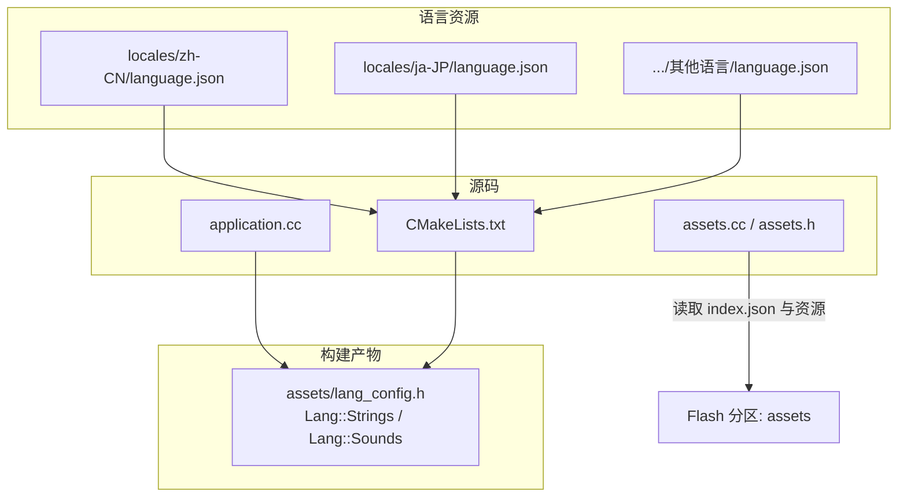
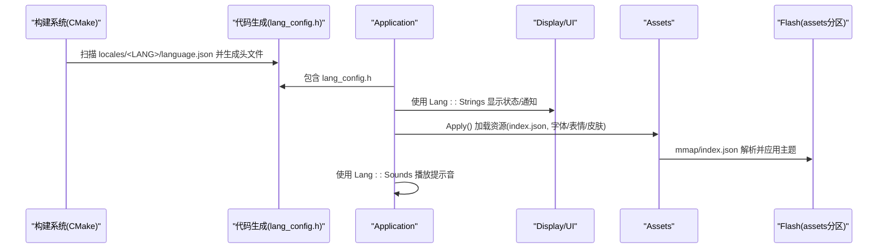
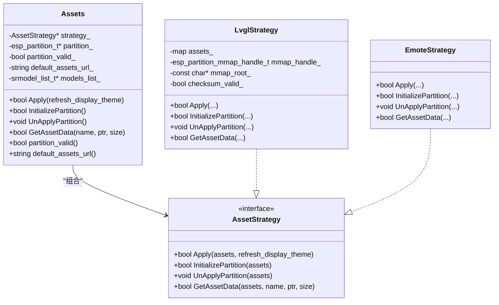
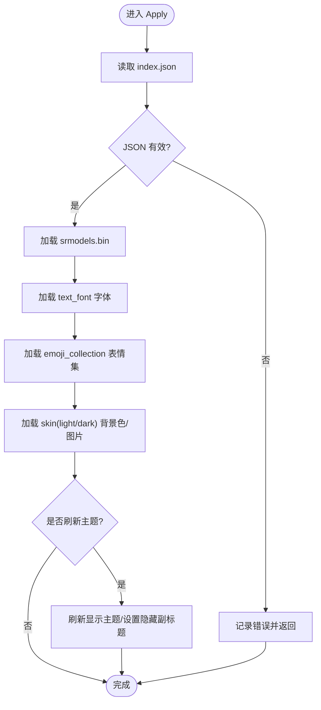
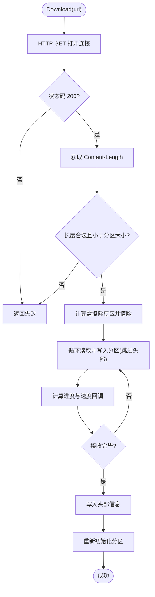
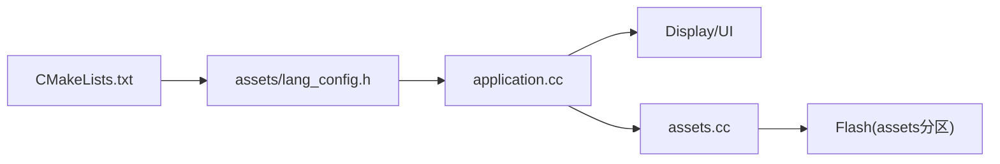

# 多语言国际化

<cite>
**本文引用的文件**   
- [assets.h](file://main/assets.h)
- [assets.cc](file://main/assets.cc)
- [application.h](file://main/application.h)
- [application.cc](file://main/application.cc)
- [CMakeLists.txt](file://main/CMakeLists.txt)
- [language.json（zh-CN）](file://main/assets/locales/zh-CN/language.json)
- [language.json（ja-JP）](file://main/assets/locales/ja-JP/language.json)
</cite>

## 目录
1. [简介](#简介)
2. [项目结构](#项目结构)
3. [核心组件](#核心组件)
4. [架构总览](#架构总览)
5. [详细组件分析](#详细组件分析)
6. [依赖关系分析](#依赖关系分析)
7. [性能与内存特性](#性能与内存特性)
8. [故障排查指南](#故障排查指南)
9. [结论](#结论)
10. [附录：新增语言与翻译工作流](#附录新增语言与翻译工作流)

## 简介
本文件面向开发者与维护者，系统化阐述本项目的多语言国际化体系。内容涵盖：
- 语言包的文件结构与 JSON 规范
- 构建期代码生成与运行时加载机制
- Assets 类对资源分区的管理、校验与应用流程
- 文本字符串的动态替换逻辑与格式化占位符
- 运行时语言切换的实现原理与注意事项
- 新增语言支持的完整步骤与翻译工作流程
- 特殊字符与格式化字符串的处理方法
- 实际使用示例路径与复数/上下文相关翻译的扩展建议

## 项目结构
多语言资源以“语言包”形式组织在 main/assets/locales 下，每个语言对应一个子目录，内部包含 language.json 与若干音频资源（ogg）。构建脚本根据配置选择当前语言目录，并将语言键值编译为 C++ 常量头文件，供应用层直接访问。

图表来源
- [CMakeLists.txt:968-1005](file://main/CMakeLists.txt#L968-L1005)
- [assets.cc:121-212](file://main/assets.cc#L121-L212)
- [assets.cc:213-358](file://main/assets.cc#L213-L358)

章节来源
- [CMakeLists.txt:968-1005](file://main/CMakeLists.txt#L968-L1005)
- [assets.cc:121-212](file://main/assets.cc#L121-L212)
- [assets.cc:213-358](file://main/assets.cc#L213-L358)

## 核心组件
- 语言常量生成器（构建期）
  - 依据 CMake 配置选定语言目录，解析 language.json，生成 assets/lang_config.h，暴露 Lang::Strings 与 Lang::Sounds 等静态常量接口。
- 应用层语言访问（运行期）
  - application.cc 通过 Lang::Strings 获取本地化文案，结合 snprintf 进行占位符替换；通过 Lang::Sounds 播放对应提示音。
- 资源管理（Assets 类）
  - 负责 Flash 分区映射、index.json 解析、字体/表情/皮肤等资源应用，以及在线下载并写入资源分区。

章节来源
- [CMakeLists.txt:968-1005](file://main/CMakeLists.txt#L968-L1005)
- [application.cc:106-156](file://main/application.cc#L106-L156)
- [application.cc:307-321](file://main/application.cc#L307-L321)
- [assets.h:23-87](file://main/assets.h#L23-L87)
- [assets.cc:121-212](file://main/assets.cc#L121-L212)
- [assets.cc:213-358](file://main/assets.cc#L213-L358)

## 架构总览
下图展示从构建到运行的关键路径：CMake 收集语言资源并生成头文件；应用启动后通过 Lang::Strings/Sounds 访问文案与音效；Assets 类负责资源分区的应用与更新。

图表来源
- [CMakeLists.txt:968-1005](file://main/CMakeLists.txt#L968-L1005)
- [application.cc:106-156](file://main/application.cc#L106-L156)
- [assets.cc:213-358](file://main/assets.cc#L213-L358)

## 详细组件分析

### 语言包结构与 JSON 规范
- 目录结构
  - main/assets/locales/<语言代码>/language.json
  - 同一目录下存放该语言的音频资源（ogg），用于提示音与播报
- JSON 字段约定
  - language.type：语言标识（如 zh-CN、ja-JP）
  - strings.*：界面文案键值对，支持占位符（如 %s、%d）
- 示例参考
  - 中文语言包：[language.json（zh-CN）](file://main/assets/locales/zh-CN/language.json)
  - 日文语言包：[language.json（ja-JP）](file://main/assets/locales/ja-JP/language.json)

章节来源
- [language.json（zh-CN）:1-59](file://main/assets/locales/zh-CN/language.json#L1-L59)
- [language.json（ja-JP）:46-59](file://main/assets/locales/ja-JP/language.json#L46-L59)

### 构建期：语言资源收集与代码生成
- 语言选择
  - 通过 Kconfig 配置项（CONFIG_LANGUAGE_*）确定 LANG_DIR
- 资源收集
  - 收集当前语言目录下的 *.ogg 作为内置音效
  - 若当前语言非 en-US，则自动将 en-US 中缺失的 ogg 作为回退资源加入
- 生成目标
  - 输出 assets/lang_config.h，提供 Lang::Strings 与 Lang::Sounds 等常量访问方式

章节来源
- [CMakeLists.txt:968-1005](file://main/CMakeLists.txt#L968-L1005)

### 运行期：文本访问与动态替换
- 文本访问
  - 应用层通过 Lang::Strings::KEY 获取文案
- 动态替换
  - 使用 snprintf 将参数填充至占位符（如 %s、%d）
  - 典型场景：网络事件提示、资产下载进度、版本检查失败信息等
- 音效播放
  - 通过 Lang::Sounds::OGG_XXX 触发对应提示音

章节来源
- [application.cc:106-156](file://main/application.cc#L106-L156)
- [application.cc:307-321](file://main/application.cc#L307-L321)
- [application.cc:363-396](file://main/application.cc#L363-L396)
- [application.cc:405-431](file://main/application.cc#L405-L431)

### 资源管理：Assets 类与策略模式
- 设计要点
  - 采用策略模式适配不同显示后端（LVGL 或 Emote Display）
  - 统一对外接口：Apply、InitializePartition、UnApplyPartition、GetAssetData
- LVGL 策略
  - 将 assets 分区 mmap 映射，校验头部与校验和，解析 index.json，加载字体、表情集合、皮肤背景图，并刷新显示主题
- Emote 策略
  - 通过 emote 子系统挂载/卸载资源分区，按名称获取资源数据
- 在线升级
  - Download 函数通过 HTTP 拉取新资源包，擦写 Flash 分区，完成后重新初始化分区

图表来源
- [assets.h:23-87](file://main/assets.h#L23-L87)
- [assets.cc:121-212](file://main/assets.cc#L121-L212)
- [assets.cc:213-358](file://main/assets.cc#L213-L358)
- [assets.cc:361-426](file://main/assets.cc#L361-L426)

章节来源
- [assets.h:23-87](file://main/assets.h#L23-L87)
- [assets.cc:121-212](file://main/assets.cc#L121-L212)
- [assets.cc:213-358](file://main/assets.cc#L213-L358)
- [assets.cc:361-426](file://main/assets.cc#L361-L426)

### 资源分区应用流程（LVGL 策略）

图表来源
- [assets.cc:213-358](file://main/assets.cc#L213-L358)

章节来源
- [assets.cc:213-358](file://main/assets.cc#L213-L358)

### 资源下载与写入流程

图表来源
- [assets.cc:427-615](file://main/assets.cc#L427-L615)

章节来源
- [assets.cc:427-615](file://main/assets.cc#L427-L615)

### 运行时语言切换实现原理
- 当前实现
  - 语言由构建期决定，生成对应的 Lang::Strings/Lang::Sounds 常量头文件
  - 运行期通过 Lang::Strings 访问文案，无需额外切换逻辑
- 切换思路（概念性说明）
  - 可在运行时读取用户偏好，动态选择语言目录，重新生成或热加载对应常量表
  - 对于 LVGL 主题与字体，可结合 Assets.Apply 刷新显示主题
  - 注意：当前仓库未提供运行时切换入口，如需支持需在应用层增加配置与刷新流程

章节来源
- [CMakeLists.txt:968-1005](file://main/CMakeLists.txt#L968-L1005)
- [application.cc:106-156](file://main/application.cc#L106-L156)

## 依赖关系分析
- 构建期依赖
  - CMake 根据 CONFIG_LANGUAGE_* 选择语言目录，收集 language.json 与 *.ogg，生成 assets/lang_config.h
- 运行期依赖
  - application.cc 包含 lang_config.h，使用 Lang::Strings/Sounds
  - assets.cc 通过 ESP-IDF 分区 API 与 cJSON 解析 index.json，驱动 LVGL/Emote 资源应用

图表来源
- [CMakeLists.txt:968-1005](file://main/CMakeLists.txt#L968-L1005)
- [application.cc:106-156](file://main/application.cc#L106-L156)
- [assets.cc:213-358](file://main/assets.cc#L213-L358)

章节来源
- [CMakeLists.txt:968-1005](file://main/CMakeLists.txt#L968-L1005)
- [application.cc:106-156](file://main/application.cc#L106-L156)
- [assets.cc:213-358](file://main/assets.cc#L213-L358)

## 性能与内存特性
- 资源映射
  - LVGL 策略使用 esp_partition_mmap 将资源分区映射到内存空间，避免整块拷贝，降低 RAM 占用
- 校验开销
  - 初始化时计算校验和，时间复杂度 O(N)，N 为资源数据长度；日志记录了耗时
- 下载写入
  - 按扇区擦写，边读边写，减少峰值内存占用；进度回调便于 UI 反馈

章节来源
- [assets.cc:121-212](file://main/assets.cc#L121-L212)
- [assets.cc:427-615](file://main/assets.cc#L427-L615)

## 故障排查指南
- 资源分区未找到
  - 现象：初始化阶段提示未找到 assets 分区
  - 排查：确认分区表包含 assets 分区，且固件已正确烧录
- index.json 无效或缺失
  - 现象：无法加载字体/表情/皮肤，或提示 index.json 无效
  - 排查：检查资源包完整性与版本兼容性
- 校验和不匹配
  - 现象：初始化失败，日志提示校验和不一致
  - 排查：确认资源包未被损坏，或重新下载
- 下载失败
  - 现象：HTTP 状态码非 200、Content-Length 异常、写入失败
  - 排查：检查网络连接、服务器地址与权限、Flash 分区容量

章节来源
- [assets.cc:121-212](file://main/assets.cc#L121-L212)
- [assets.cc:213-358](file://main/assets.cc#L213-L358)
- [assets.cc:427-615](file://main/assets.cc#L427-L615)

## 结论
本项目采用“构建期生成 + 运行期常量访问”的多语言方案，配合 Assets 类的资源分区管理与在线升级能力，实现了高效、稳定的国际化体验。通过规范的 JSON 结构与清晰的构建脚本，新增语言与补充资源的工作流清晰可控。未来如需运行时切换语言，可在现有基础上引入动态加载与主题刷新机制。

## 附录：新增语言与翻译工作流

### 新增语言支持步骤
- 创建语言目录
  - 在 main/assets/locales 下新建 <语言代码> 目录（例如 fr-FR）
- 准备 language.json
  - 复制任一现有语言包的 language.json，完善 strings 键值
  - 确保 language.type 与目录名一致
- 添加音频资源（可选）
  - 将对应语言的 ogg 放入该目录；若缺失，构建系统将自动回退到 en-US 的资源
- 启用语言配置
  - 在 Kconfig 中添加 CONFIG_LANGUAGE_<CODE>=y（若尚未存在）
- 构建与验证
  - 构建后检查 assets/lang_config.h 是否包含新语言常量
  - 运行设备，验证 UI 文案与音效

章节来源
- [CMakeLists.txt:968-1005](file://main/CMakeLists.txt#L968-L1005)
- [language.json（zh-CN）:1-59](file://main/assets/locales/zh-CN/language.json#L1-L59)

### 翻译工作流程建议
- 维护源语言（推荐 en-US）
  - 保持 en-US 为权威源，其他语言优先对齐其键集
- 增量更新
  - 新增键时，先在 en-US 补齐，再在各语言中补充翻译
- 一致性校验
  - 使用脚本对比各语言 JSON 的键集合，发现缺失键并告警
- 回归测试
  - 针对长文本、富文本、数字/日期/货币格式进行 UI 布局与换行测试

### 特殊字符与格式化字符串处理
- 占位符
  - 使用标准占位符（%s、%d、%.2f 等），在应用层通过 snprintf 填充
  - 示例路径：
    - 资产下载进度提示：[application.cc:363-396](file://main/application.cc#L363-L396)
    - 版本检查失败重试提示：[application.cc:405-431](file://main/application.cc#L405-L431)
- 转义与编码
  - JSON 中使用 Unicode 转义或直接 UTF-8 文本
  - 避免在 JSON 值中嵌入未转义的控制字符
- 复数与上下文相关翻译（扩展建议）
  - 当前仓库未内置复数规则引擎，建议在 JSON 中预定义多种键（如 item_one、item_other），并在应用层根据数量选择
  - 或使用 ICU/CLDR 等库集成复数规则，在构建期或运行期生成相应常量

章节来源
- [application.cc:363-396](file://main/application.cc#L363-L396)
- [application.cc:405-431](file://main/application.cc#L405-L431)