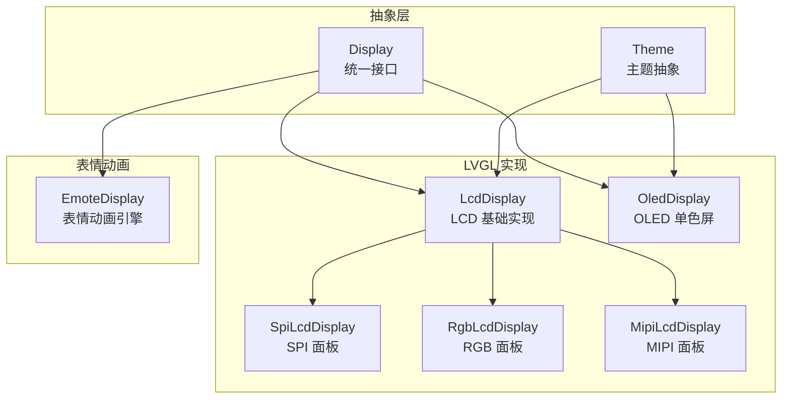
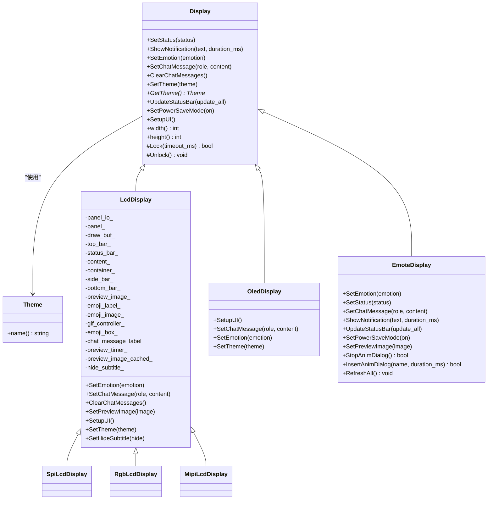
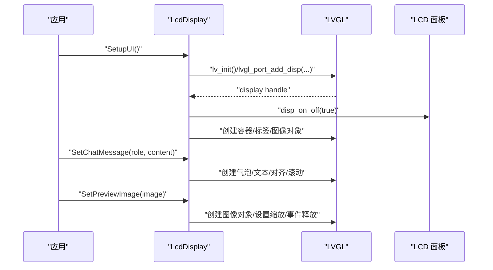
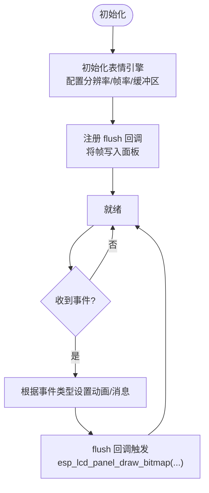
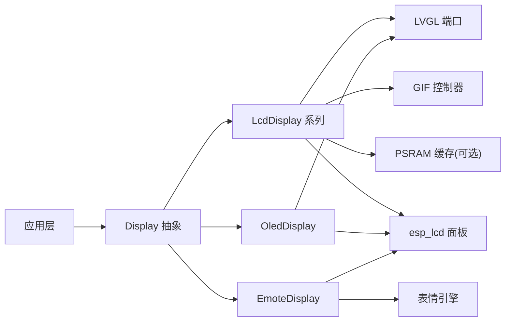

# 显示界面系统

<cite>
**本文引用的文件**   
- [display.h](file://main/display/display.h)
- [display.cc](file://main/display/display.cc)
- [lcd_display.h](file://main/display/lcd_display.h)
- [lcd_display.cc](file://main/display/lcd_display.cc)
- [oled_display.h](file://main/display/oled_display.h)
- [oled_display.cc](file://main/display/oled_display.cc)
- [emote_display.h](file://main/display/emote_display.h)
- [emote_display.cc](file://main/display/emote_display.cc)
</cite>

## 目录
1. [简介](#简介)
2. [项目结构](#项目结构)
3. [核心组件](#核心组件)
4. [架构总览](#架构总览)
5. [详细组件分析](#详细组件分析)
6. [依赖关系分析](#依赖关系分析)
7. [性能考虑](#性能考虑)
8. [故障排查指南](#故障排查指南)
9. [结论](#结论)
10. [附录](#附录)

## 简介
本文件系统性地梳理了基于 LVGL 的显示界面子系统，涵盖：
- Display 抽象接口与主题机制
- LCD（SPI/RGB/MIPI）与 OLED 两类驱动实现差异
- 表情显示与动画效果（含 GIF 播放、JPEG 渲染）
- UI 主题与样式定制方法
- 聊天消息、预览图、状态栏等交互逻辑
- 响应式布局与多分辨率适配要点
- 自定义 UI 组件与扩展方式

## 项目结构
显示子系统位于 main/display 目录下，采用“抽象接口 + 多实现”的分层设计：
- 抽象层：Display 基类定义统一 API（状态、通知、表情、聊天消息、主题、电源模式等）
- 具体实现：
  - LcdDisplay 及其子类 SpiLcdDisplay/RgbLcdDisplay/MipiLcdDisplay：面向彩色屏，集成 LVGL 端口与多种面板总线
  - OledDisplay：面向单色屏，提供精简 UI 布局
  - EmoteDisplay：面向表情动画引擎，通过回调将帧绘制到面板

图表来源
- [display.h:28-61](file://main/display/display.h#L28-L61)
- [lcd_display.h:17-83](file://main/display/lcd_display.h#L17-L83)
- [oled_display.h:10-39](file://main/display/oled_display.h#L10-L39)
- [emote_display.h:12-40](file://main/display/emote_display.h#L12-L40)

章节来源
- [display.h:18-61](file://main/display/display.h#L18-L61)
- [lcd_display.h:17-83](file://main/display/lcd_display.h#L17-L83)
- [oled_display.h:10-39](file://main/display/oled_display.h#L10-L39)
- [emote_display.h:12-40](file://main/display/emote_display.h#L12-L40)

## 核心组件
- Display 抽象接口
  - 提供 SetStatus、ShowNotification、SetEmotion、SetChatMessage、ClearChatMessages、SetTheme、UpdateStatusBar、SetPowerSaveMode 等统一能力
  - 内置 DisplayLockGuard 用于跨线程访问 LVGL 时的互斥保护
  - NoDisplay 空实现便于无屏场景编译链接
- Theme 主题抽象
  - 以名称标识主题，配合具体主题管理器进行注册与切换
- LcdDisplay 系列
  - 封装 LVGL 初始化、显示添加、缓冲区配置、旋转/镜像/偏移设置
  - 支持 SPI/RGB/MIPI 三种面板总线
  - 内置主题管理、聊天气泡、预览图、GIF 控制器、低电量提示等
- OledDisplay
  - 针对 128x64/128x32 两种布局，提供精简 UI（顶部图标、状态文本、滚动字幕、表情图标）
- EmoteDisplay
  - 对接表情动画引擎，通过 flush 回调将帧写入面板，支持事件消息与动画对话框插入

章节来源
- [display.h:28-85](file://main/display/display.h#L28-L85)
- [display.cc:23-61](file://main/display/display.cc#L23-L61)
- [lcd_display.h:17-83](file://main/display/lcd_display.h#L17-L83)
- [oled_display.h:10-39](file://main/display/oled_display.h#L10-L39)
- [emote_display.h:12-40](file://main/display/emote_display.h#L12-L40)

## 架构总览
显示子系统围绕 Display 抽象展开，上层应用通过统一 API 控制不同硬件平台上的显示行为。LVGL 作为图形后端，由具体显示类完成初始化与对象创建；表情动画由独立模块负责，通过回调将像素数据推送到底层面板。

图表来源
- [display.h:18-61](file://main/display/display.h#L18-L61)
- [lcd_display.h:17-83](file://main/display/lcd_display.h#L17-L83)
- [oled_display.h:10-39](file://main/display/oled_display.h#L10-L39)
- [emote_display.h:12-40](file://main/display/emote_display.h#L12-L40)

## 详细组件分析

### Display 抽象与主题
- 职责
  - 定义统一的显示控制接口，屏蔽底层差异
  - 提供锁守卫 DisplayLockGuard 保证 LVGL 调用线程安全
  - 主题名称持久化至 Settings，便于重启后恢复
- 关键点
  - SetupUI 标记位防止重复初始化
  - 默认实现仅记录日志，具体功能在子类中覆盖

章节来源
- [display.h:28-85](file://main/display/display.h#L28-L85)
- [display.cc:23-61](file://main/display/display.cc#L23-L61)

### LcdDisplay（SPI/RGB/MIPI）
- 初始化流程
  - 构造时加载主题并创建预览定时器
  - 子类构造函数中初始化 LVGL、添加显示、配置缓冲区与旋转/镜像/偏移
  - RGB 路径启用双缓冲与直接模式，提升刷新效率
- UI 构建（微信风格）
  - 顶部状态栏（网络、静音、电池图标）
  - 居中状态/通知文本
  - 可滚动的聊天内容区，按角色区分气泡样式与对齐
  - 低电量弹窗
  - 启动时展示 AI Logo，收到消息后隐藏
- 聊天消息
  - 限制最大消息数，超出则删除最旧消息并自动滚动
  - 系统消息折叠合并，避免刷屏
  - 用户消息右对齐，助手消息左对齐
- 图片预览
  - 计算缩放比例以适应屏幕宽高限制
  - 通过事件回调释放 LvglImage 资源，避免内存泄漏
- GIF 动图
  - 持有 LvglGif 控制器，析构时停止播放并清理
- 主题与字体
  - 注册 light/dark 主题，设置背景、文字、气泡、边框、低电量颜色及字体
  - 从 Settings 读取上次主题并应用

图表来源
- [lcd_display.cc:65-172](file://main/display/lcd_display.cc#L65-L172)
- [lcd_display.cc:354-498](file://main/display/lcd_display.cc#L354-L498)
- [lcd_display.cc:504-698](file://main/display/lcd_display.cc#L504-L698)
- [lcd_display.cc:700-782](file://main/display/lcd_display.cc#L700-L782)

章节来源
- [lcd_display.h:17-83](file://main/display/lcd_display.h#L17-L83)
- [lcd_display.cc:25-90](file://main/display/lcd_display.cc#L25-L90)
- [lcd_display.cc:92-172](file://main/display/lcd_display.cc#L92-L172)
- [lcd_display.cc:176-233](file://main/display/lcd_display.cc#L176-L233)
- [lcd_display.cc:235-284](file://main/display/lcd_display.cc#L235-L284)
- [lcd_display.cc:345-351](file://main/display/lcd_display.cc#L345-L351)
- [lcd_display.cc:354-498](file://main/display/lcd_display.cc#L354-L498)
- [lcd_display.cc:504-698](file://main/display/lcd_display.cc#L504-L698)
- [lcd_display.cc:700-782](file://main/display/lcd_display.cc#L700-L782)
- [lcd_display.cc:784-800](file://main/display/lcd_display.cc#L784-L800)

### OledDisplay（单色屏）
- 初始化
  - 注册 dark 主题，初始化 LVGL 端口，添加单色显示
- 布局
  - 128x64：顶部图标条 + 居中状态/通知 + 左右分栏（左侧表情图标，右侧滚动字幕）
  - 128x32：左侧表情图标 + 右侧状态栏与滚动字幕
- 交互
  - SetChatMessage 替换换行符为空格，超长文本循环滚动
  - SetEmotion 通过字体映射更新表情图标
  - 低电量弹窗与主题切换

章节来源
- [oled_display.h:10-39](file://main/display/oled_display.h#L10-L39)
- [oled_display.cc:20-81](file://main/display/oled_display.cc#L20-L81)
- [oled_display.cc:83-96](file://main/display/oled_display.cc#L83-L96)
- [oled_display.cc:138-144](file://main/display/oled_display.cc#L138-L144)
- [oled_display.cc:146-166](file://main/display/oled_display.cc#L146-L166)
- [oled_display.cc:168-298](file://main/display/oled_display.cc#L168-L298)
- [oled_display.cc:300-385](file://main/display/oled_display.cc#L300-L385)
- [oled_display.cc:387-408](file://main/display/oled_display.cc#L387-L408)

### EmoteDisplay（表情动画）
- 初始化
  - 创建表情引擎句柄，配置分辨率、帧率、缓冲区大小与任务参数
  - 注册 flush 回调，将帧数据写入面板
- 交互
  - SetEmotion/SetStatus/SetChatMessage/ShowNotification 映射到引擎事件
  - 支持插入/停止动画对话框、全量刷新
- 线程与同步
  - Lock/Unlock 为空实现（内部自行调度）

图表来源
- [emote_display.cc:74-112](file://main/display/emote_display.cc#L74-L112)
- [emote_display.cc:118-127](file://main/display/emote_display.cc#L118-L127)
- [emote_display.cc:137-176](file://main/display/emote_display.cc#L137-L176)
- [emote_display.cc:214-222](file://main/display/emote_display.cc#L214-L222)

章节来源
- [emote_display.h:12-40](file://main/display/emote_display.h#L12-L40)
- [emote_display.cc:33-68](file://main/display/emote_display.cc#L33-L68)
- [emote_display.cc:74-112](file://main/display/emote_display.cc#L74-L112)
- [emote_display.cc:118-135](file://main/display/emote_display.cc#L118-L135)
- [emote_display.cc:137-200](file://main/display/emote_display.cc#L137-L200)
- [emote_display.cc:202-212](file://main/display/emote_display.cc#L202-L212)
- [emote_display.cc:214-222](file://main/display/emote_display.cc#L214-L222)
- [emote_display.cc:224-248](file://main/display/emote_display.cc#L224-L248)

## 依赖关系分析
- 组件耦合
  - LcdDisplay/OledDisplay 均依赖 LVGL 端口与 esp_lcd 面板驱动
  - LcdDisplay 额外依赖 GIF 控制器与图片缓存（PSRAM）
  - EmoteDisplay 依赖表情引擎与面板 IO 事件回调
- 外部依赖
  - LVGL 图形库与 esp_lvgl_port
  - esp_lcd 面板驱动（SPI/RGB/DSI）
  - FreeRTOS 任务与定时器
  - Settings 存储主题选择

图表来源
- [lcd_display.cc:113-172](file://main/display/lcd_display.cc#L113-L172)
- [oled_display.cc:39-81](file://main/display/oled_display.cc#L39-L81)
- [emote_display.cc:74-112](file://main/display/emote_display.cc#L74-L112)

章节来源
- [lcd_display.cc:113-172](file://main/display/lcd_display.cc#L113-L172)
- [oled_display.cc:39-81](file://main/display/oled_display.cc#L39-L81)
- [emote_display.cc:74-112](file://main/display/emote_display.cc#L74-L112)

## 性能考虑
- 缓冲区与刷新
  - SPI 路径使用单缓冲，RGB 路径启用双缓冲与直接模式，降低撕裂与提高吞吐
  - MIPI 路径开启软件旋转，适配不同方向
- 内存优化
  - 当 PSRAM 容量满足条件时，启用 LVGL 图片缓存以减少重复解码开销
- 消息数量上限
  - 聊天区域限制最大消息数，避免对象过多导致卡顿
- 动画与 GIF
  - GIF 控制器在析构时显式停止，避免后台任务占用 CPU
- 锁粒度
  - 使用 DisplayLockGuard 包裹 LVGL 操作，减少竞态风险

章节来源
- [lcd_display.cc:116-126](file://main/display/lcd_display.cc#L116-L126)
- [lcd_display.cc:196-233](file://main/display/lcd_display.cc#L196-L233)
- [lcd_display.cc:504-533](file://main/display/lcd_display.cc#L504-L533)
- [lcd_display.cc:286-298](file://main/display/lcd_display.cc#L286-L298)
- [lcd_display.cc:345-351](file://main/display/lcd_display.cc#L345-L351)

## 故障排查指南
- 重复初始化
  - SetupUI 被多次调用时会跳过，检查上层调用顺序
- 未初始化即发消息
  - 若先于 SetupUI 调用 SetChatMessage，会记录警告并丢弃消息
- 内存泄漏
  - 预览图通过事件回调释放 LvglImage，确保对象生命周期正确
- 主题未生效
  - 确认当前主题已注册且 Settings 中的 theme 键值存在
- 低电量提示不显示
  - 检查弹窗对象是否被隐藏标志控制

章节来源
- [lcd_display.cc:354-359](file://main/display/lcd_display.cc#L354-L359)
- [lcd_display.cc:504-514](file://main/display/lcd_display.cc#L504-L514)
- [lcd_display.cc:754-761](file://main/display/lcd_display.cc#L754-L761)
- [lcd_display.cc:25-63](file://main/display/lcd_display.cc#L25-L63)
- [lcd_display.cc:477-487](file://main/display/lcd_display.cc#L477-L487)

## 结论
该显示子系统通过清晰的抽象与分层，实现了在不同面板与分辨率下的统一 UI 体验。LcdDisplay 提供了丰富的聊天与多媒体能力，OledDisplay 聚焦简洁信息展示，EmoteDisplay 专注表情动画。结合主题管理与资源优化策略，可在资源受限平台上获得稳定流畅的交互表现。

## 附录

### 如何创建自定义 UI 组件（示例步骤）
- 继承 Display 或现有实现（如 LcdDisplay），覆写必要方法
- 在 SetupUI 中创建 LVGL 对象并应用主题样式
- 使用 DisplayLockGuard 保护 LVGL 调用
- 在业务事件中调用相应 API 更新 UI

章节来源
- [display.h:28-61](file://main/display/display.h#L28-L61)
- [lcd_display.cc:354-498](file://main/display/lcd_display.cc#L354-L498)

### 如何实现响应式布局与适配不同分辨率
- 使用 LV_HOR_RES/LV_VER_RES 获取屏幕尺寸
- 通过 flex 布局与相对尺寸（百分比、LV_SIZE_CONTENT）自适应
- 针对不同分辨率分支处理（如 OledDisplay 的 128x64/128x32）

章节来源
- [lcd_display.cc:375-383](file://main/display/lcd_display.cc#L375-L383)
- [oled_display.cc:83-96](file://main/display/oled_display.cc#L83-L96)

### 表情集合管理与 GIF/JPEG 支持
- 表情集合：通过表情引擎接口设置动画与事件消息
- GIF 播放：LcdDisplay 集成 LvglGif 控制器，支持动态表情
- JPEG 渲染：通过 LVGL 图片缓存与解码器支持（需启用相应组件）

章节来源
- [emote_display.cc:137-176](file://main/display/emote_display.cc#L137-L176)
- [lcd_display.cc:286-298](file://main/display/lcd_display.cc#L286-L298)
- [lcd_display.cc:116-126](file://main/display/lcd_display.cc#L116-L126)