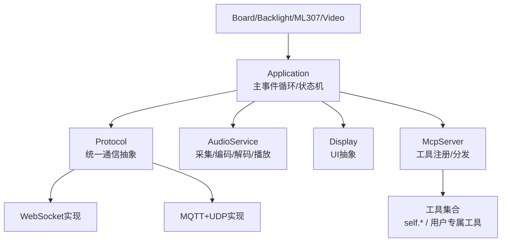
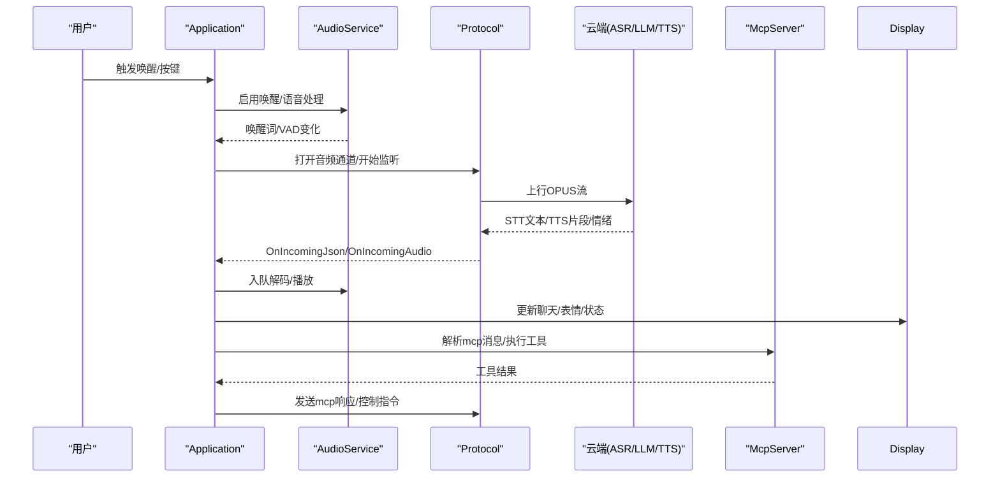
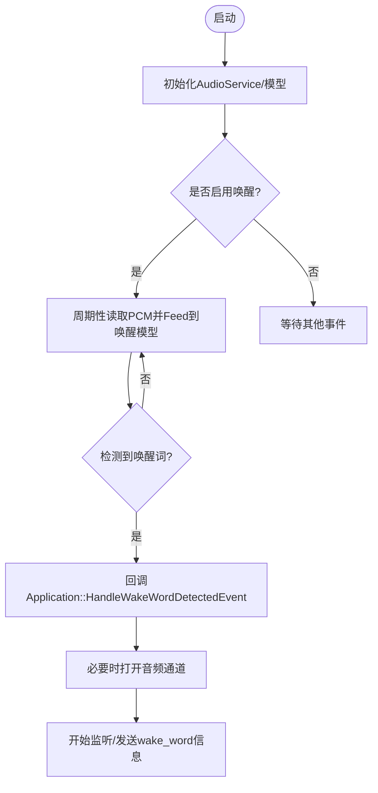
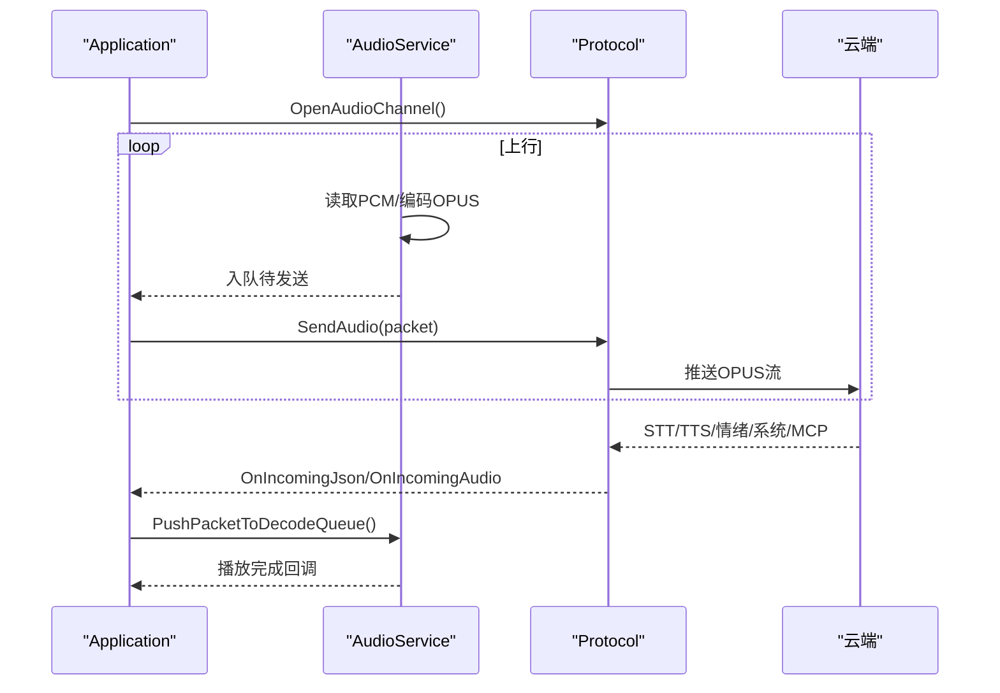
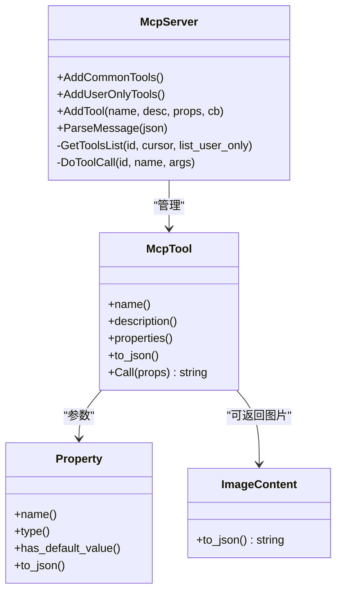
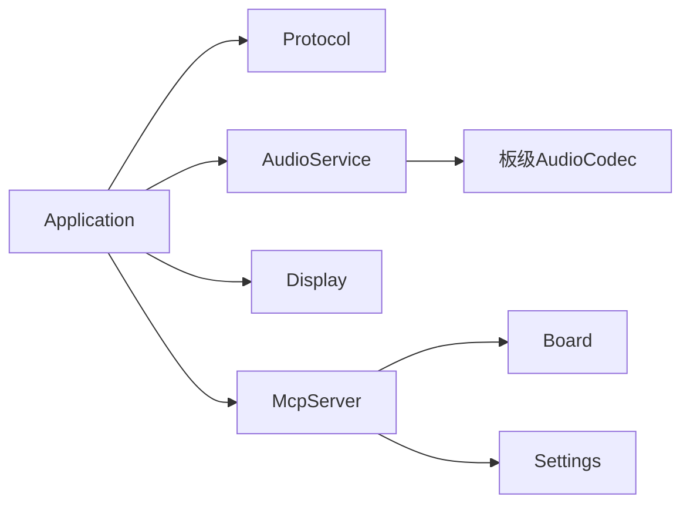

# 核心功能特性

<cite>
**本文引用的文件**   
- [README.md](file://README.md)
- [application.h](file://main/application.h)
- [application.cc](file://main/application.cc)
- [protocol.h](file://main/protocols/protocol.h)
- [protocol.cc](file://main/protocols/protocol.cc)
- [audio_service.h](file://main/audio/audio_service.h)
- [audio_service.cc](file://main/audio/audio_service.cc)
- [display.h](file://main/display/display.h)
- [display.cc](file://main/display/display.cc)
- [mcp_server.h](file://main/mcp_server.h)
- [mcp_server.cc](file://main/mcp_server.cc)
- [press_to_talk_mcp_tool.h](file://main/boards/common/press_to_talk_mcp_tool.h)
- [press_to_talk_mcp_tool.cc](file://main/boards/common/press_to_talk_mcp_tool.cc)
- [ml307_board.cc](file://main/boards/common/ml307_board.cc)
- [backlight.cc](file://main/boards/common/backlight.cc)
- [esp_video.cc](file://main/boards/common/esp_video.cc)
- [Kconfig.projbuild](file://main/Kconfig.projbuild)
- [CMakeLists.txt](file://main/CMakeLists.txt)
- [mcp-protocol_zh.md](file://docs/mcp-protocol_zh.md)
- [mcp-usage_zh.md](file://docs/mcp-usage_zh.md)
</cite>

## 目录
1. [简介](#简介)
2. [项目结构](#项目结构)
3. [核心组件](#核心组件)
4. [架构总览](#架构总览)
5. [详细组件分析](#详细组件分析)
6. [依赖关系分析](#依赖关系分析)
7. [性能与功耗特性](#性能与功耗特性)
8. [故障排查指南](#故障排查指南)
9. [结论](#结论)
10. [附录：使用场景与演示要点](#附录使用场景与演示要点)

## 简介
小智AI聊天机器人是一个面向ESP32系列的端侧语音交互系统，采用“离线唤醒 + 流式ASR + LLM + TTS”的端到端语音对话架构，并通过MCP（Model Context Protocol）实现标准化的设备控制接口。系统支持Wi-Fi与ML307 Cat.1 4G双网络、OPUS音频编解码、OLED/LCD显示与表情展示、多语言本地化、电池与电源管理、以及可插拔的工具扩展能力。

- 主要能力概览
  - 离线语音唤醒：基于ESP-SR的Wake Word检测，支持AWE/AFE与自定义热词
  - 实时语音对话：流式上行OPUS + 服务端ASR/LLM/TTS + 下行OPUS播放
  - MCP设备控制：通过JSON-RPC 2.0在云端发现并调用设备工具（音量、亮度、GPIO等）
  - 多语言支持：编译期选择语言包，运行时动态切换主题与表情
  - 显示界面：状态栏、通知、聊天消息、表情动画、背光渐变
  - 网络与OTA：WebSocket或MQTT+UDP协议；固件与资源在线升级

章节来源
- [README.md:1-37](file://README.md#L1-L37)

## 项目结构
- 应用层
  - Application：主事件循环、状态机、协议初始化、UI/音频回调编排
  - AudioService：采集/处理/编码/解码/播放全链路任务与队列
  - Display：显示抽象与默认空实现，具体板级实现覆盖
  - McpServer：MCP工具注册、参数校验、调用分发与结果封装
- 通信层
  - Protocol：统一音频/文本通道抽象，提供发送/接收回调
  - WebSocket/MQTT+UDP：具体协议实现（由Application根据配置选择）
- 硬件适配层
  - Board：各板级引脚、外设、电源策略、摄像头、背光等
  - Backlight：PWM背光渐变控制
  - ML307Board：蜂窝网络状态上报
  - ESP Video：摄像头预览与格式转换
- 构建与配置
  - Kconfig/CMakeLists：语言包、唤醒模型、音频处理器开关、源文件选择

图表来源
- [application.h:43-176](file://main/application.h#L43-L176)
- [application.cc:61-163](file://main/application.cc#L61-L163)
- [protocol.h:44-80](file://main/protocols/protocol.h#L44-L80)
- [mcp_server.h:314-345](file://main/mcp_server.h#L314-L345)

章节来源
- [application.h:43-176](file://main/application.h#L43-L176)
- [application.cc:61-163](file://main/application.cc#L61-L163)
- [protocol.h:44-80](file://main/protocols/protocol.h#L44-L80)
- [mcp_server.h:314-345](file://main/mcp_server.h#L314-L345)

## 核心组件
- Application
  - 职责：初始化显示/音频/网络；启动激活流程；维护设备状态机；调度主事件循环；处理网络/音频/唤醒事件；与MCP集成
  - 关键方法：Initialize/Run/SetDeviceState/ToggleChatState/StartListening/StopListening/AbortSpeaking/SendMcpMessage
- AudioService
  - 职责：驱动Codec、VAD/降噪/回声消除（可选）、WakeWord、OPUS编解码、队列缓冲、播放与定时休眠
  - 关键方法：Initialize/Start/EnableWakeWordDetection/EnableVoiceProcessing/PlaySound/PushPacketToDecodeQueue/PopPacketFromSendQueue
- Protocol
  - 职责：统一音频/文本通道抽象；定义OnIncomingJson/OnIncomingAudio等回调；封装listen/tts/stt/abort/mcp消息
- Display
  - 职责：设置状态/通知/表情/聊天消息/主题；默认空实现供无屏设备复用
- McpServer
  - 职责：注册工具（含公共工具与仅用户可见工具）、解析capabilities、tools/list/call、返回结构化结果（文本/布尔/整数/JSON/图片）

章节来源
- [application.h:43-176](file://main/application.h#L43-L176)
- [application.cc:61-163](file://main/application.cc#L61-L163)
- [audio_service.h:105-195](file://main/audio/audio_service.h#L105-L195)
- [audio_service.cc:62-167](file://main/audio/audio_service.cc#L62-L167)
- [protocol.h:44-80](file://main/protocols/protocol.h#L44-L80)
- [protocol.cc:42-79](file://main/protocols/protocol.cc#L42-L79)
- [display.h:28-61](file://main/display/display.h#L28-L61)
- [display.cc:23-61](file://main/display/display.cc#L23-L61)
- [mcp_server.h:314-345](file://main/mcp_server.h#L314-L345)

## 架构总览
系统以Application为核心，协调AudioService与Protocol，将语音数据流与控制指令流解耦；Display负责人机反馈；McpServer暴露设备能力给云端大模型。

图表来源
- [application.cc:489-610](file://main/application.cc#L489-L610)
- [audio_service.cc:230-446](file://main/audio/audio_service.cc#L230-L446)
- [protocol.cc:42-79](file://main/protocols/protocol.cc#L42-L79)
- [mcp_server.cc:321-364](file://main/mcp_server.cc#L321-L364)

## 详细组件分析

### 离线语音唤醒
- 原理
  - 通过AudioService加载不同唤醒实现（AFE/Custom/Esp），按平台与模型自动选择
  - 输入路径：Mic -> 可选AEC/降噪 -> WakeWord/Processor并行Feed
  - 检测到唤醒词后回调Application，进入连接与对话流程
- 技术特点
  - 支持AWE/AFE与自定义热词，阈值/显示词可配置
  - 可在低功耗模式下保持唤醒，避免频繁唤醒CPU
- 用户体验
  - 低延迟唤醒提示音，打断正在播放的TTS，无缝进入对话

图表来源
- [audio_service.cc:700-735](file://main/audio/audio_service.cc#L700-L735)
- [application.cc:780-845](file://main/application.cc#L780-L845)
- [Kconfig.projbuild:864-902](file://main/Kconfig.projbuild#L864-L902)

章节来源
- [audio_service.h:105-195](file://main/audio/audio_service.h#L105-L195)
- [audio_service.cc:700-735](file://main/audio/audio_service.cc#L700-L735)
- [application.cc:780-845](file://main/application.cc#L780-L845)
- [Kconfig.projbuild:864-902](file://main/Kconfig.projbuild#L864-L902)

### 实时语音对话（流式ASR+LLM+TTS）
- 原理
  - 上行：16kHz PCM -> OPUS编码 -> 网络流式发送
  - 下行：OPUS帧 -> 解码 -> 重采样 -> 播放
  - 控制：STT文本、TTS开始/结束/分句、情绪、系统命令、MCP消息
- 技术特点
  - 双任务分离（输入/输出）+ 独立编解码任务，降低抖动
  - 支持设备侧/服务器侧AEC与静音检测，提升抗噪体验
- 用户体验
  - 边说边出字、边想边说话，打断自然、恢复迅速

图表来源
- [application.cc:489-610](file://main/application.cc#L489-L610)
- [audio_service.cc:327-446](file://main/audio/audio_service.cc#L327-L446)
- [protocol.cc:42-79](file://main/protocols/protocol.cc#L42-L79)

章节来源
- [application.cc:489-610](file://main/application.cc#L489-L610)
- [audio_service.cc:327-446](file://main/audio/audio_service.cc#L327-L446)
- [protocol.cc:42-79](file://main/protocols/protocol.cc#L42-L79)

### MCP设备控制（标准化工具接口）
- 原理
  - 设备端通过McpServer注册工具（名称/描述/参数Schema/回调）
  - 云端通过initialize/tools/list/tools/call发现并调用工具
  - 工具返回结构化结果（文本/布尔/整数/JSON/图片），统一封装为content数组
- 技术特点
  - JSON-RPC 2.0负载，支持分页工具列表、用户专属工具（对AI不可见）
  - 参数类型安全（布尔/整数/字符串），整数支持范围校验
- 用户体验
  - 自然语言驱动设备动作，如调节音量/亮度、切换模式、拍照解释等

图表来源
- [mcp_server.h:16-50](file://main/mcp_server.h#L16-L50)
- [mcp_server.h:58-206](file://main/mcp_server.h#L58-L206)
- [mcp_server.h:208-312](file://main/mcp_server.h#L208-L312)
- [mcp_server.cc:33-364](file://main/mcp_server.cc#L33-L364)

章节来源
- [mcp_server.h:314-345](file://main/mcp_server.h#L314-L345)
- [mcp_server.cc:321-364](file://main/mcp_server.cc#L321-L364)
- [mcp-protocol_zh.md:1-270](file://docs/mcp-protocol_zh.md#L1-L270)
- [mcp-usage_zh.md:1-115](file://docs/mcp-usage_zh.md#L1-L115)

### 多语言与本地化
- 编译期选择语言包，生成语言头文件与声音资源清单
- 非目标语言缺失时回退至en-US音频资源
- 运行时通过Display设置主题与表情，结合语言文案呈现

章节来源
- [CMakeLists.txt:885-1005](file://main/CMakeLists.txt#L885-L1005)
- [display.h:28-61](file://main/display/display.h#L28-L61)
- [display.cc:52-61](file://main/display/display.cc#L52-L61)

### 显示界面与交互
- 能力
  - 状态栏、通知弹窗、聊天消息（用户/助手/系统）、表情动画、主题持久化
  - 背光渐变与亮度持久化
- 典型交互
  - 网络扫描/连接/断开提示
  - 激活码播报与数字发音
  - 错误告警与情绪图标

章节来源
- [display.h:28-61](file://main/display/display.h#L28-L61)
- [display.cc:23-61](file://main/display/display.cc#L23-L61)
- [application.cc:612-660](file://main/application.cc#L612-L660)
- [backlight.cc:32-82](file://main/boards/common/backlight.cc#L32-L82)

### 网络与电源管理
- 网络
  - Wi-Fi/ML307双模，状态事件回调驱动UI与状态机
  - 蜂窝模组SIM/注册/初始化异常提示
- 电源
  - 音频I/O空闲超时关闭，降低功耗
  - 睡眠/深度睡眠定时器与唤醒回调

章节来源
- [ml307_board.cc:181-227](file://main/boards/common/ml307_board.cc#L181-L227)
- [audio_service.cc:682-698](file://main/audio/audio_service.cc#L682-L698)

### 摄像头与视觉辅助
- 摄像头预览：YUV/RGB转RGB565显示，内存对齐与SPIRAM分配
- 视觉能力可通过MCP initialize capabilities传入URL与token，用于图像理解

章节来源
- [esp_video.cc:731-760](file://main/boards/common/esp_video.cc#L731-L760)
- [mcp_server.cc:331-348](file://main/mcp_server.cc#L331-L348)

## 依赖关系分析
- Application依赖
  - Protocol（WebSocket/MQTT+UDP）：音频通道与JSON控制面
  - AudioService：采集/处理/编解码/播放
  - Display：UI反馈
  - McpServer：工具注册与分发
- AudioService依赖
  - Codec（板级实现）：输入/输出、音量、采样率
  - 可选：AEC/降噪处理器、唤醒模型
- McpServer依赖
  - Board：获取摄像头/背光/电量等状态
  - Settings：持久化配置（如按键说话模式）

图表来源
- [application.h:43-176](file://main/application.h#L43-L176)
- [mcp_server.cc:33-364](file://main/mcp_server.cc#L33-L364)

章节来源
- [application.h:43-176](file://main/application.h#L43-L176)
- [mcp_server.cc:33-364](file://main/mcp_server.cc#L33-L364)

## 性能与功耗特性
- 音频流水线
  - 输入/输出/编解码三任务并行，队列长度限制防止溢出
  - 动态重采样保证与硬件输出一致，减少失真
- 唤醒与处理
  - 按需启用AEC/降噪，避免不必要的CPU占用
  - 唤醒模型与处理器共享输入流，合理切分时间片
- 电源策略
  - 音频I/O空闲超时关闭，双工场景保留必要时钟
  - 睡眠/深度睡眠定时器配合唤醒词运行状态

章节来源
- [audio_service.cc:125-167](file://main/audio/audio_service.cc#L125-L167)
- [audio_service.cc:327-446](file://main/audio/audio_service.cc#L327-L446)
- [audio_service.cc:682-698](file://main/audio/audio_service.cc#L682-L698)

## 故障排查指南
- 常见问题定位
  - 无法连接网络：检查网络事件回调与状态栏提示
  - 无声/杂音：确认采样率匹配、重采样器是否创建成功
  - 唤醒不灵敏：调整阈值与模型选择，确认唤醒任务是否运行
  - MCP调用失败：检查工具名/参数schema，查看返回error字段
- 日志与调试
  - 启用音频调试（可选），抓取原始PCM进行离线分析
  - 关注PowerSaveTimer与SleepTimer的进入/退出回调

章节来源
- [application.cc:165-259](file://main/application.cc#L165-L259)
- [audio_service.cc:219-228](file://main/audio/audio_service.cc#L219-L228)
- [mcp_server.cc:321-364](file://main/mcp_server.cc#L321-L364)

## 结论
小智AI聊天机器人在ESP32平台上实现了完整的“唤醒-对话-控制”闭环：离线唤醒保障即时响应，流式ASR+LLM+TTS带来自然的对话体验，MCP提供可扩展的设备控制能力，配合多语言与显示界面形成良好的交互闭环。其模块化设计与清晰的职责边界，便于在不同硬件上快速移植与扩展。

## 附录：使用场景与演示要点
- 场景示例
  - 智能家居控制：通过自然语言调节音量/亮度/灯光颜色
  - 问答与知识检索：结合云端知识库与搜索工具
  - 远程协助：摄像头画面上传，云端进行图像理解与指导
- 演示建议
  - 先演示离线唤醒与打断能力
  - 再演示流式对话中的字幕与表情同步
  - 最后演示MCP工具调用（音量/亮度/拍照解释）

章节来源
- [README.md:1-37](file://README.md#L1-L37)
- [mcp-usage_zh.md:1-115](file://docs/mcp-usage_zh.md#L1-L115)