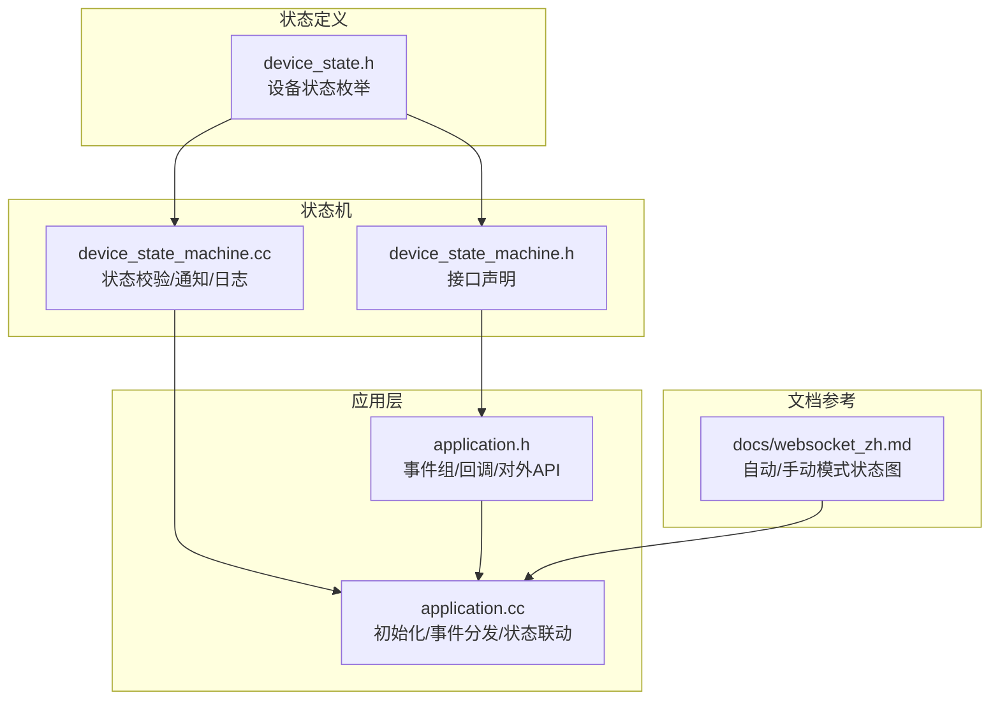
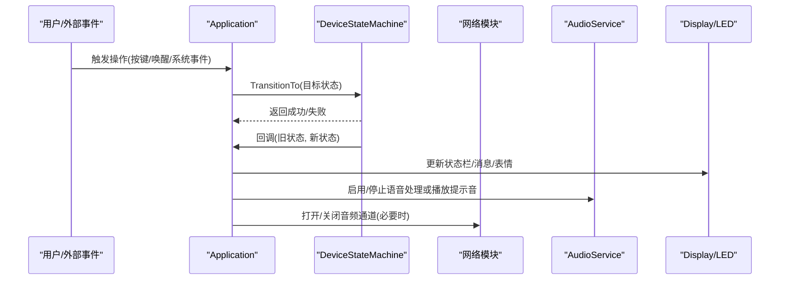
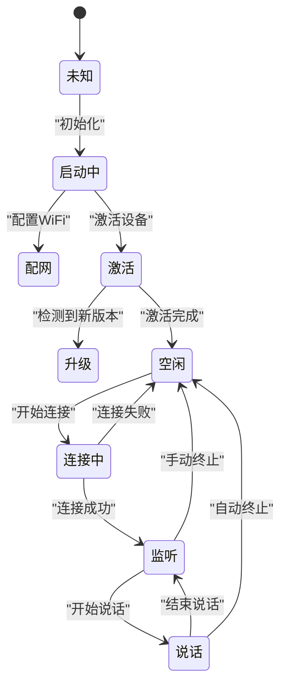
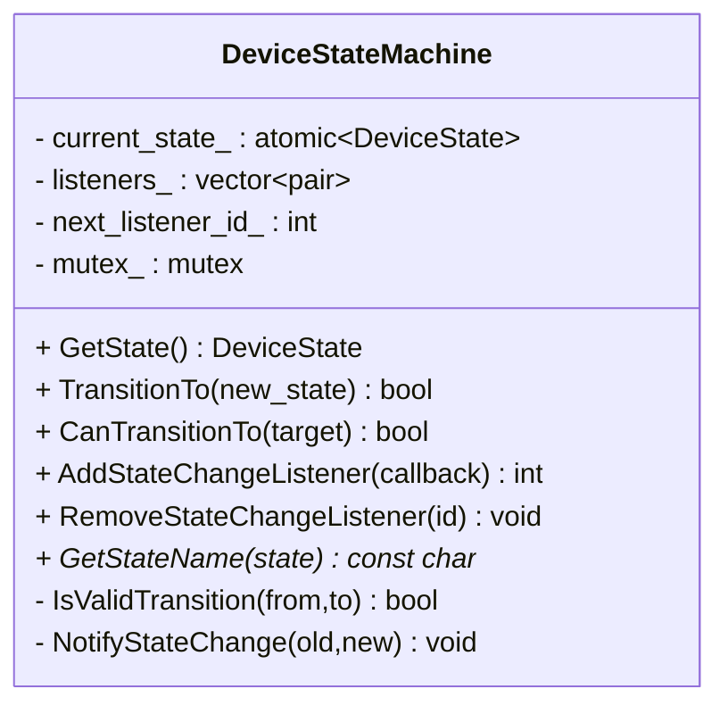
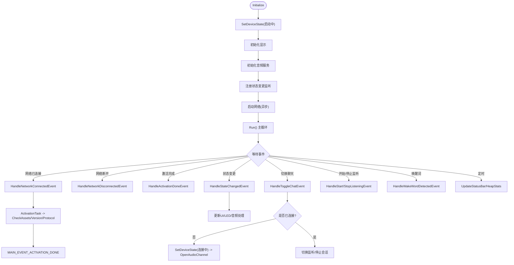
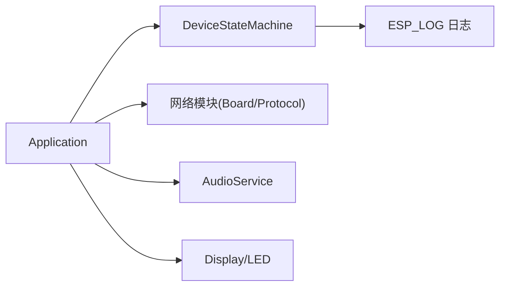

# 设备状态管理

<cite>
**本文引用的文件**   
- [device_state.h](file://main/device_state.h)
- [device_state_machine.h](file://main/device_state_machine.h)
- [device_state_machine.cc](file://main/device_state_machine.cc)
- [application.h](file://main/application.h)
- [application.cc](file://main/application.cc)
- [websocket_zh.md](file://docs/websocket_zh.md)
</cite>

## 目录
1. [简介](#简介)
2. [项目结构](#项目结构)
3. [核心组件](#核心组件)
4. [架构总览](#架构总览)
5. [详细组件分析](#详细组件分析)
6. [依赖关系分析](#依赖关系分析)
7. [性能与并发特性](#性能与并发特性)
8. [故障排查指南](#故障排查指南)
9. [结论](#结论)
10. [附录：扩展开发指南](#附录扩展开发指南)

## 简介
本文件围绕“基于状态机的设备管理模式”展开，系统性阐述设备状态定义、状态转换规则、事件驱动迁移机制、DeviceStateMachine 类的设计与实现、异常恢复与错误处理逻辑，以及设备初始化流程、网络状态监控、音频服务管理等关键状态的管理实现。同时提供面向扩展的开发指南，帮助开发者添加新状态与业务逻辑。

## 项目结构
与设备状态管理直接相关的代码集中在 main 目录下，核心包括：
- 状态枚举定义：device_state.h
- 状态机实现：device_state_machine.h/.cc
- 应用主循环与状态联动：application.h/.cc
- 文档中的状态流转图参考：docs/websocket_zh.md

图表来源
- [device_state.h:1-18](file://main/device_state.h#L1-L18)
- [device_state_machine.h:1-84](file://main/device_state_machine.h#L1-L84)
- [device_state_machine.cc:1-162](file://main/device_state_machine.cc#L1-L162)
- [application.h:1-194](file://main/application.h#L1-L194)
- [application.cc:1-1132](file://main/application.cc#L1-L1132)
- [websocket_zh.md:327-368](file://docs/websocket_zh.md#L327-L368)

章节来源
- [device_state.h:1-18](file://main/device_state.h#L1-L18)
- [device_state_machine.h:1-84](file://main/device_state_machine.h#L1-L84)
- [device_state_machine.cc:1-162](file://main/device_state_machine.cc#L1-L162)
- [application.h:1-194](file://main/application.h#L1-L194)
- [application.cc:1-1132](file://main/application.cc#L1-L1132)
- [websocket_zh.md:327-368](file://docs/websocket_zh.md#L327-L368)

## 核心组件
- 设备状态枚举 DeviceState：定义所有合法状态，如未知、启动中、配网、空闲、连接中、监听、说话、升级、激活、音频测试、致命错误等。
- 状态机 DeviceStateMachine：负责状态合法性校验、原子化切换、观察者通知、状态名映射与日志输出。
- 应用 Application：作为状态机消费者，封装 SetDeviceState 调用；在 Initialize/Run 中完成初始化、事件分发、UI/LED/音频联动；通过事件组协调多任务。

章节来源
- [device_state.h:1-18](file://main/device_state.h#L1-L18)
- [device_state_machine.h:1-84](file://main/device_state_machine.h#L1-L84)
- [device_state_machine.cc:1-162](file://main/device_state_machine.cc#L1-L162)
- [application.h:1-194](file://main/application.h#L1-L194)
- [application.cc:1-1132](file://main/application.cc#L1-L1132)

## 架构总览
设备状态管理采用“状态机 + 事件驱动”的架构：
- 状态机集中维护当前状态与转换规则，保证一致性。
- 应用层通过事件组（EventGroup）将网络、音频、用户交互等异步事件汇聚到主循环统一处理。
- 状态变化时，状态机触发观察者回调，应用层据此更新 UI、LED、音频处理管线等。

图表来源
- [application.cc:86-91](file://main/application.cc#L86-L91)
- [application.cc:860-932](file://main/application.cc#L860-L932)
- [device_state_machine.cc:108-131](file://main/device_state_machine.cc#L108-L131)

章节来源
- [application.cc:86-91](file://main/application.cc#L86-L91)
- [application.cc:860-932](file://main/application.cc#L860-L932)
- [device_state_machine.cc:108-131](file://main/device_state_machine.cc#L108-L131)

## 详细组件分析

### 设备状态定义与转换规则
- 状态集合：包含未知、启动中、配网、空闲、连接中、监听、说话、升级、激活、音频测试、致命错误等。
- 转换规则：由状态机内部严格限定，例如：
  - 未知 → 启动中
  - 启动中 → 配网 或 激活
  - 激活 → 升级 或 空闲 或 回退至配网
  - 空闲 ↔ 连接中 ↔ 监听 ↔ 说话
  - 致命错误不可再迁移
- 文档中的自动/手动模式状态图可作为业务视角的补充说明。

图表来源
- [websocket_zh.md:327-368](file://docs/websocket_zh.md#L327-L368)
- [device_state_machine.cc:34-102](file://main/device_state_machine.cc#L34-L102)

章节来源
- [device_state.h:1-18](file://main/device_state.h#L1-L18)
- [device_state_machine.cc:34-102](file://main/device_state_machine.cc#L34-L102)
- [websocket_zh.md:327-368](file://docs/websocket_zh.md#L327-L368)

### DeviceStateMachine 类设计
- 线程安全：使用原子变量保存当前状态，避免竞态；使用互斥量保护监听器列表。
- 观察者模式：支持注册/注销状态变更回调，回调在调用者上下文中执行。
- 状态名映射：提供静态方法用于日志打印。
- 转换校验：集中式 IsValidTransition 判定，确保非法迁移被拒绝并记录警告。

图表来源
- [device_state_machine.h:17-81](file://main/device_state_machine.h#L17-L81)
- [device_state_machine.cc:1-162](file://main/device_state_machine.cc#L1-162)

章节来源
- [device_state_machine.h:17-81](file://main/device_state_machine.h#L17-L81)
- [device_state_machine.cc:1-162](file://main/device_state_machine.cc#L1-162)

### 应用层状态管理与事件驱动
- 初始化流程：
  - 设置状态为“启动中”，初始化显示、音频服务、时钟定时器、MCP 工具。
  - 注册状态变更监听器，将状态变化转化为事件 MAIN_EVENT_STATE_CHANGED。
  - 启动网络模块，异步进行后续激活流程。
- 主循环 Run：
  - 等待事件组，按优先级处理错误、网络、激活、状态变更、聊天切换、监听控制、音频发送、唤醒词、VAD、定时器等事件。
  - 根据状态更新 UI/LED，控制音频处理开关与提示音。
- 网络事件：
  - 连接后进入“激活”阶段，后台任务检查资源版本、固件版本、协议初始化。
  - 断开时关闭音频通道，避免资源泄漏。
- 音频服务管理：
  - 监听/说话状态切换时，控制语音处理、唤醒词检测、解码器重置、提示音播放。
  - 根据 AEC 模式决定默认监听模式（自动停止或实时）。
- 升级流程：
  - 资源包或固件升级时切换到“升级”状态，完成后回到“空闲”。

图表来源
- [application.cc:61-163](file://main/application.cc#L61-L163)
- [application.cc:165-259](file://main/application.cc#L165-L259)
- [application.cc:261-338](file://main/application.cc#L261-L338)
- [application.cc:340-471](file://main/application.cc#L340-L471)
- [application.cc:473-610](file://main/application.cc#L473-L610)
- [application.cc:662-778](file://main/application.cc#L662-L778)
- [application.cc:780-858](file://main/application.cc#L780-L858)
- [application.cc:860-932](file://main/application.cc#L860-L932)

章节来源
- [application.cc:61-163](file://main/application.cc#L61-L163)
- [application.cc:165-259](file://main/application.cc#L165-L259)
- [application.cc:261-338](file://main/application.cc#L261-L338)
- [application.cc:340-471](file://main/application.cc#L340-L471)
- [application.cc:473-610](file://main/application.cc#L473-L610)
- [application.cc:662-778](file://main/application.cc#L662-L778)
- [application.cc:780-858](file://main/application.cc#L780-L858)
- [application.cc:860-932](file://main/application.cc#L860-L932)

### 关键状态的处理逻辑
- 空闲 Idle：
  - 清理聊天消息，设置情绪为中性，禁用语音处理，重新启用唤醒词检测。
- 连接中 Connecting：
  - 预提升功耗等级以降低延迟，随后尝试打开音频通道。
- 监听 Listening：
  - 发送开始监听命令，启用语音处理；根据配置决定是否在监听中启用唤醒词检测；必要时播放提示音。
- 说话 Speaking：
  - 在非实时模式下禁用语音处理，仅允许 AFE 唤醒词；重置解码器以准备接收 TTS 数据。
- 配网 WifiConfiguring / 音频测试 AudioTesting：
  - 禁用语音处理与唤醒词检测；可通过切换进入音频测试辅助调试。
- 升级 Upgrading：
  - 下载资源包或固件，成功后重启；失败则恢复音频服务并继续运行。
- 致命错误 FatalError：
  - 状态机禁止从此状态迁移，需外部干预或重启恢复。

章节来源
- [application.cc:860-932](file://main/application.cc#L860-L932)
- [application.cc:972-1022](file://main/application.cc#L972-L1022)
- [device_state_machine.cc:94-101](file://main/device_state_machine.cc#L94-L101)

## 依赖关系分析
- 状态机对应用层的耦合度低，仅提供状态查询、转换与回调能力。
- 应用层依赖状态机进行状态一致性保障，并通过事件组解耦各子系统。
- 网络与音频子系统通过回调与事件与状态机联动，避免直接强耦合。

图表来源
- [application.h:1-194](file://main/application.h#L1-194)
- [application.cc:1-1132](file://main/application.cc#L1-1132)
- [device_state_machine.cc:1-162](file://main/device_state_machine.cc#L1-162)

章节来源
- [application.h:1-194](file://main/application.h#L1-194)
- [application.cc:1-1132](file://main/application.cc#L1-1132)
- [device_state_machine.cc:1-162](file://main/device_state_machine.cc#L1-162)

## 性能与并发特性
- 原子状态存储：current_state_ 使用原子类型，读操作无锁，写操作在互斥保护下进行，降低竞争开销。
- 观察者拷贝策略：NotifyStateChange 先复制回调列表再遍历调用，避免持有锁期间执行回调导致的死锁风险。
- 事件驱动：主循环通过事件组聚合异步事件，减少忙轮询，提高整体吞吐与时延可控性。
- 功耗管理：连接前提升性能等级，会话结束后恢复低功耗，平衡时延与能耗。

[本节为通用性能讨论，不直接分析具体文件]

## 故障排查指南
- 非法状态迁移：
  - 现象：日志出现“无效状态迁移”警告。
  - 定位：检查调用方是否在错误时机发起 TransitionTo。
  - 建议：依据状态图调整业务逻辑，或在调用前使用 CanTransitionTo 预判。
- 致命错误状态：
  - 现象：设备停留在致命错误状态且无法迁移。
  - 处理：需要外部复位或重启，确保资源释放后再恢复。
- 网络断开导致会话中断：
  - 现象：监听/说话时断网，音频通道被关闭。
  - 处理：确认 HandleNetworkDisconnectedEvent 正确关闭通道，并在重连后重新建立会话。
- 升级失败：
  - 现象：升级失败后仍继续运行。
  - 处理：检查升级回调与重试逻辑，确认音频服务重启与功耗等级恢复。

章节来源
- [device_state_machine.cc:108-131](file://main/device_state_machine.cc#L108-L131)
- [application.cc:286-297](file://main/application.cc#L286-L297)
- [application.cc:972-1022](file://main/application.cc#L972-L1022)

## 结论
该设备状态管理系统以 DeviceStateMachine 为核心，结合事件驱动的 Application 主循环，实现了清晰、可验证的状态迁移与跨子系统联动。通过严格的转换规则与观察者通知机制，系统在复杂交互场景下保持了高一致性与可维护性。对于扩展新状态与业务逻辑，建议在保持转换规则完整性的前提下，最小化修改范围，遵循现有事件与回调约定。

[本节为总结，不直接分析具体文件]

## 附录：扩展开发指南

### 添加新设备状态的步骤
- 定义新状态：
  - 在设备状态枚举中添加新值，并确保其语义明确、边界清晰。
- 更新转换规则：
  - 在状态机的 IsValidTransition 中增加从源状态到新状态、以及从新状态到其他状态的合法路径。
  - 若存在不可迁移的终态（如致命错误），需在规则中显式排除。
- 应用层适配：
  - 在 HandleStateChangedEvent 中为新状态添加 UI/LED/音频处理等副作用。
  - 在相应事件处理器中插入触发新状态的条件判断与调用 SetDeviceState。
- 文档与测试：
  - 更新状态流转图与相关文档，确保读者理解新增状态的业务含义。
  - 编写用例覆盖正常迁移与非法迁移路径，验证日志与行为符合预期。

章节来源
- [device_state.h:1-18](file://main/device_state.h#L1-L18)
- [device_state_machine.cc:34-102](file://main/device_state_machine.cc#L34-L102)
- [application.cc:860-932](file://main/application.cc#L860-L932)

### 事件驱动迁移的最佳实践
- 优先使用事件组传递跨任务信号，避免在回调中直接做耗时操作。
- 在回调中仅设置标志位或调度任务，实际状态迁移与副作用在主循环中执行。
- 对可能阻塞的操作（如网络 I/O、升级）使用独立任务或 Schedule 队列，防止阻塞主循环。

章节来源
- [application.cc:165-259](file://main/application.cc#L165-L259)
- [application.cc:934-940](file://main/application.cc#L934-L940)

### 状态持久化与恢复策略
- 现状：当前实现未显式持久化设备状态，重启后状态机初始化为“未知”，由初始化流程推进到“启动中”。
- 建议方案：
  - 在状态变更时，将最新状态写入非易失存储（如 NVS/Flash），并记录时间戳。
  - 启动时读取持久化状态，若处于可恢复状态（如空闲、配网），可直接恢复；否则回退到“启动中”以确保一致性。
  - 注意持久化操作的原子性与幂等性，避免重复写入与损坏。
- 注意事项：
  - 持久化不应阻塞主循环，建议使用异步写入或批量合并。
  - 对异常断电场景，考虑写入失败的回退策略与自检逻辑。

[本节为概念性指导，不直接分析具体文件]