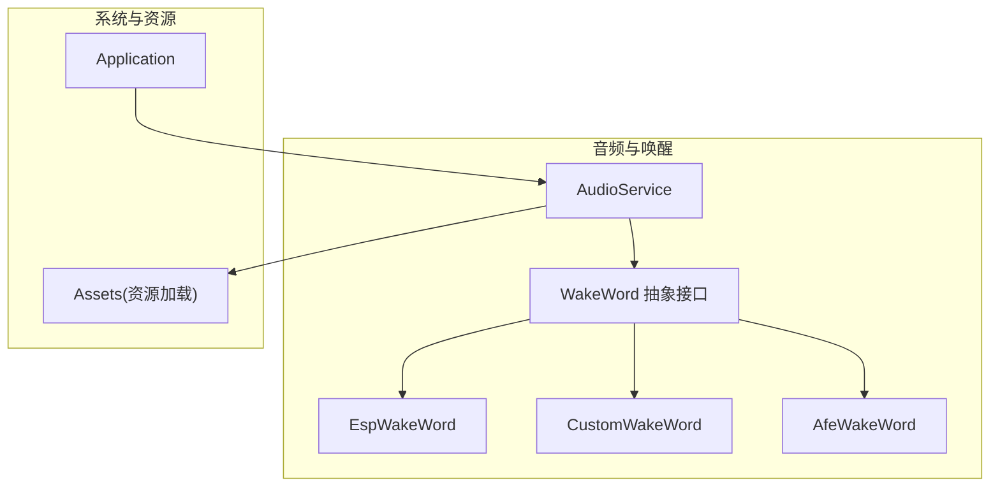
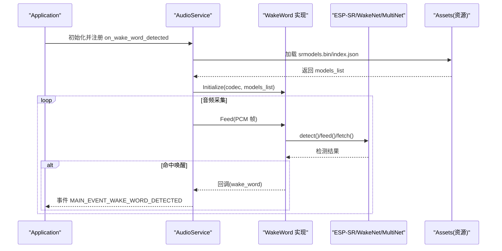
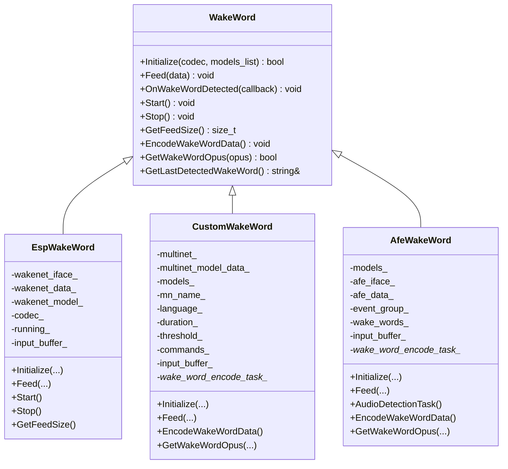
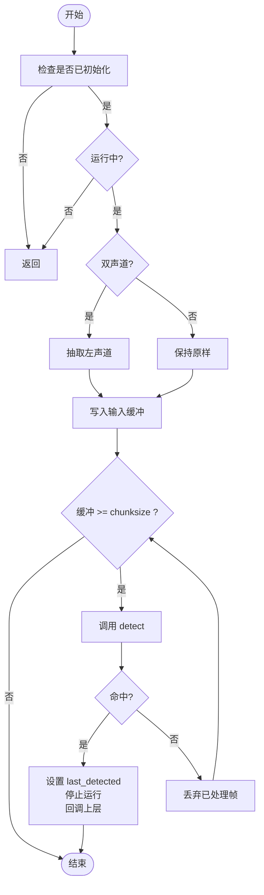
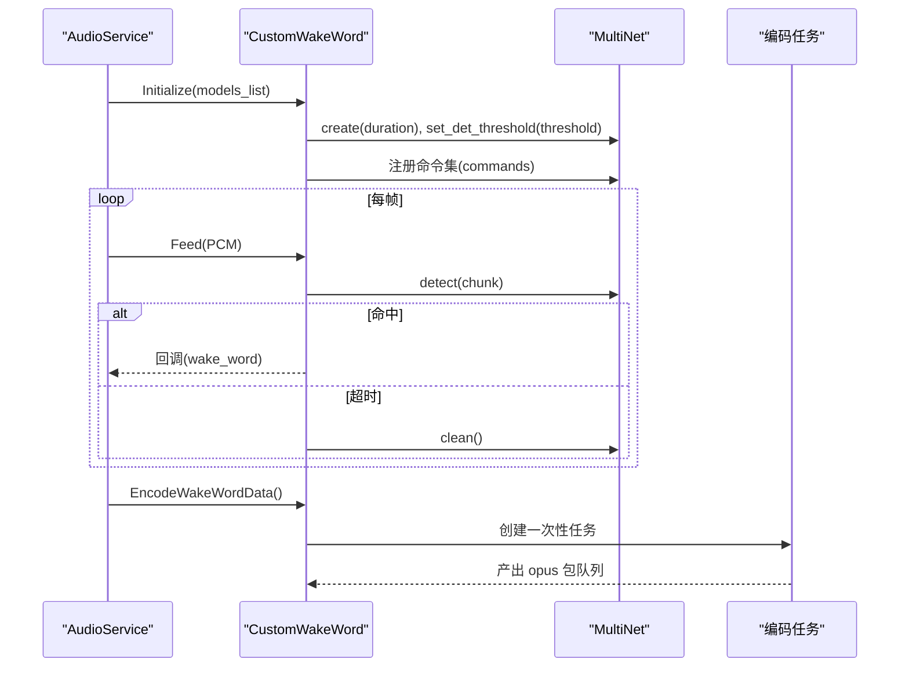
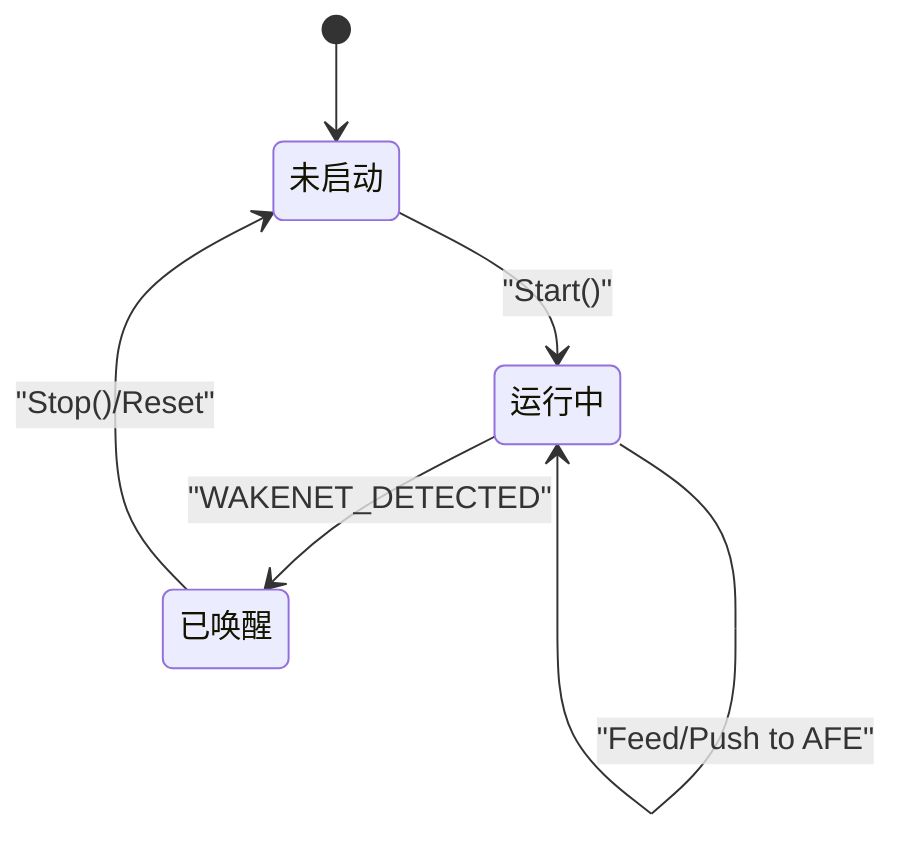
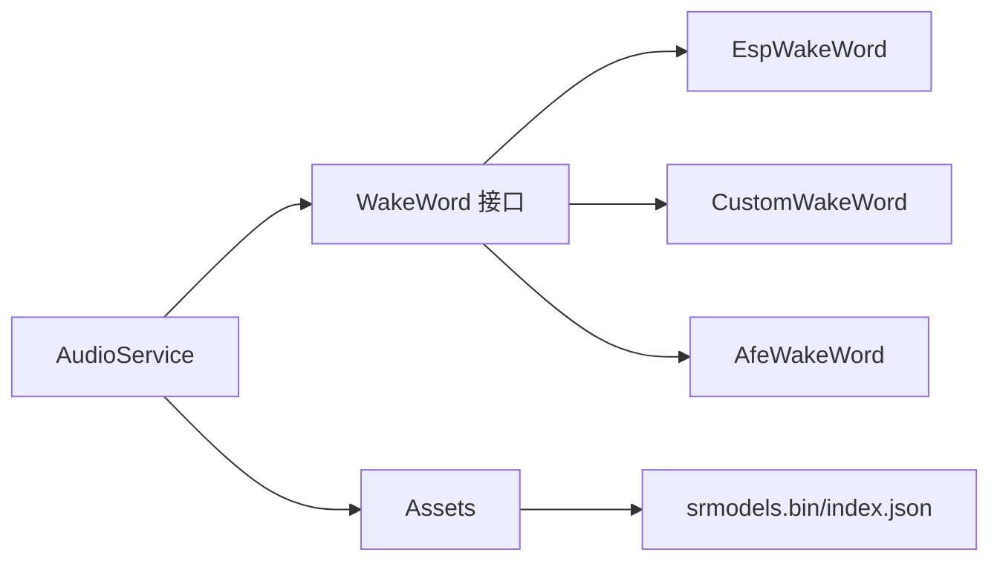

# 唤醒词检测系统

<cite>
**本文引用的文件列表**
- [wake_word.h](file://main/audio/wake_word.h)
- [esp_wake_word.h](file://main/audio/wake_words/esp_wake_word.h)
- [esp_wake_word.cc](file://main/audio/wake_words/esp_wake_word.cc)
- [custom_wake_word.h](file://main/audio/wake_words/custom_wake_word.h)
- [custom_wake_word.cc](file://main/audio/wake_words/custom_wake_word.cc)
- [afe_wake_word.h](file://main/audio/wake_words/afe_wake_word.h)
- [afe_wake_word.cc](file://main/audio/wake_words/afe_wake_word.cc)
- [audio_service.cc](file://main/audio/audio_service.cc)
- [application.cc](file://main/application.cc)
- [assets.cc](file://main/assets.cc)
- [assets.h](file://main/assets.h)
</cite>

## 目录
1. [简介](#简介)
2. [项目结构](#项目结构)
3. [核心组件](#核心组件)
4. [架构总览](#架构总览)
5. [详细组件分析](#详细组件分析)
6. [依赖关系分析](#依赖关系分析)
7. [性能与功耗考量](#性能与功耗考量)
8. [故障排查指南](#故障排查指南)
9. [结论](#结论)
10. [附录：配置与部署要点](#附录配置与部署要点)

## 简介
本文件面向小智AI聊天机器人设备的离线语音唤醒子系统，系统性阐述其实现原理、接口设计、ESP-SR引擎集成方式、自定义唤醒词训练与部署流程、检测阈值与误触发优化策略，以及与音频处理流水线和FreeRTOS任务调度的集成细节。文档同时提供可操作的代码示例路径，帮助读者快速上手添加新唤醒词和优化检测性能。

## 项目结构
唤醒词检测相关代码集中在 main/audio 目录下，采用“抽象接口 + 多实现”的模块化组织方式：
- 抽象接口定义位于 wake_word.h
- 三种具体实现分别对应不同技术路线：
  - EspWakeWord：基于 ESP-WakeNet 的轻量级唤醒模型
  - CustomWakeWord：基于 ESP-MultiNet 的多命令词识别（支持自定义）
  - AfeWakeWord：基于 AFE 前端（AEC/降噪等）+ WakeNet 的高鲁棒性方案
- AudioService 负责将音频流喂入唤醒模块，并桥接上层应用事件
- Application 作为主循环调度者，接收唤醒事件并驱动状态机流转
- Assets 负责从资源分区加载 srmodels.bin 和 index.json，注入到 AudioService

图表来源
- [wake_word.h:1-26](file://main/audio/wake_word.h#L1-L26)
- [esp_wake_word.h:17-43](file://main/audio/wake_words/esp_wake_word.h#L17-L43)
- [custom_wake_word.h:20-71](file://main/audio/wake_words/custom_wake_word.h#L20-L71)
- [afe_wake_word.h:22-62](file://main/audio/wake_words/afe_wake_word.h#L22-L62)
- [audio_service.cc:555-577](file://main/audio/audio_service.cc#L555-L577)
- [application.cc:76-86](file://main/application.cc#L76-L86)
- [assets.cc:71-119](file://main/assets.cc#L71-L119)

章节来源
- [wake_word.h:1-26](file://main/audio/wake_word.h#L1-L26)
- [audio_service.cc:555-577](file://main/audio/audio_service.cc#L555-L577)
- [application.cc:76-86](file://main/application.cc#L76-L86)
- [assets.cc:71-119](file://main/assets.cc#L71-L119)

## 核心组件
- WakeWord 抽象接口
  - 统一初始化、数据馈送、启动/停止、回调注册、获取帧大小、编码唤醒片段、获取最后识别结果等能力
- 三大实现
  - EspWakeWord：直接调用 Wakenet 接口进行在线检测，适合内置标准唤醒词场景
  - CustomWakeWord：基于 MultiNet 的命令词识别，支持通过 index.json 或编译宏动态配置语言、时长、阈值与命令集，适合自定义唤醒词
  - AfeWakeWord：在 AFE 前端（含 AEC、降噪）后接入 WakeNet，具备更强抗噪能力；内部维护独立检测任务与事件组
- AudioService
  - 管理音频采集、重采样、VAD/AEC 等处理链，并将 PCM 按唤醒模块所需 chunksize 喂入
  - 根据运行模式启用/禁用唤醒模块，并在检测到唤醒时向上层派发事件
- Application
  - 注册唤醒回调，收到 MAIN_EVENT_WAKE_WORD_DETECTED 后进入后续对话流程
- Assets
  - 从资源分区读取 index.json 与 srmodels.bin，解析并注入到 AudioService，供唤醒模块使用

章节来源
- [wake_word.h:11-24](file://main/audio/wake_word.h#L11-L24)
- [esp_wake_word.cc:17-45](file://main/audio/wake_words/esp_wake_word.cc#L17-L45)
- [custom_wake_word.cc:85-129](file://main/audio/wake_words/custom_wake_word.cc#L85-L129)
- [afe_wake_word.cc:38-90](file://main/audio/wake_words/afe_wake_word.cc#L38-L90)
- [audio_service.cc:555-577](file://main/audio/audio_service.cc#L555-L577)
- [application.cc:76-86](file://main/application.cc#L76-L86)
- [assets.cc:71-119](file://main/assets.cc#L71-L119)

## 架构总览
唤醒链路整体时序如下：
- 设备启动后，Application 初始化 AudioService 并注册 on_wake_word_detected 回调
- AudioService 在需要时加载 srmodels.bin（由 Assets 提供），初始化所选 WakeWord 实现
- 音频采集线程以固定帧长推送 PCM 至 WakeWord::Feed
- 唤醒模块内部完成特征提取与推理，命中后通过回调通知上层
- Application 收到事件后切换状态，继续打开音频通道或执行其他业务逻辑

图表来源
- [application.cc:76-86](file://main/application.cc#L76-L86)
- [audio_service.cc:555-577](file://main/audio/audio_service.cc#L555-L577)
- [assets.cc:71-119](file://main/assets.cc#L71-L119)
- [esp_wake_word.cc:62-96](file://main/audio/wake_words/esp_wake_word.cc#L62-L96)
- [custom_wake_word.cc:146-200](file://main/audio/wake_words/custom_wake_word.cc#L146-L200)
- [afe_wake_word.cc:110-161](file://main/audio/wake_words/afe_wake_word.cc#L110-L161)

## 详细组件分析

### WakeWord 抽象接口
- 职责
  - 统一对外暴露初始化、数据馈送、启停、回调、编码与查询接口
- 关键方法
  - Initialize：绑定音频编解码器与模型列表
  - Feed：按模块要求的 chunksize 累积并推理
  - OnWakeWordDetected：注册唤醒回调
  - Start/Stop：控制运行态
  - GetFeedSize：获取输入帧大小
  - EncodeWakeWordData/GetWakeWordOpus：可选地编码唤醒前后片段为 Opus
  - GetLastDetectedWakeWord：获取最近一次识别到的唤醒词文本

章节来源
- [wake_word.h:11-24](file://main/audio/wake_word.h#L11-L24)

#### 类图（WakeWord 及其实现）

图表来源
- [wake_word.h:11-24](file://main/audio/wake_word.h#L11-L24)
- [esp_wake_word.h:17-43](file://main/audio/wake_words/esp_wake_word.h#L17-L43)
- [custom_wake_word.h:20-71](file://main/audio/wake_words/custom_wake_word.h#L20-L71)
- [afe_wake_word.h:22-62](file://main/audio/wake_words/afe_wake_word.h#L22-L62)

章节来源
- [wake_word.h:11-24](file://main/audio/wake_word.h#L11-L24)
- [esp_wake_word.h:17-43](file://main/audio/wake_words/esp_wake_word.h#L17-L43)
- [custom_wake_word.h:20-71](file://main/audio/wake_words/custom_wake_word.h#L20-L71)
- [afe_wake_word.h:22-62](file://main/audio/wake_words/afe_wake_word.h#L22-L62)

### EspWakeWord（Wakenet 直连）
- 特点
  - 直接加载 Wakenet 模型，按固定 chunksize 滑动窗口检测
  - 双声道输入自动抽取左声道单声道
  - 检测成功后立即停止运行并清空缓冲，避免重复触发
- 适用场景
  - 使用官方预置唤醒词、对功耗与内存敏感的设备
- 关键流程
  - Initialize：选择首个可用模型，创建实例并获取频率与 chunksize
  - Feed：累积输入，达到 chunksize 即调用 detect，命中则回调并停止
  - GetFeedSize：返回模型期望的输入帧大小

图表来源
- [esp_wake_word.cc:17-45](file://main/audio/wake_words/esp_wake_word.cc#L17-L45)
- [esp_wake_word.cc:62-96](file://main/audio/wake_words/esp_wake_word.cc#L62-L96)

章节来源
- [esp_wake_word.cc:17-45](file://main/audio/wake_words/esp_wake_word.cc#L17-L45)
- [esp_wake_word.cc:62-96](file://main/audio/wake_words/esp_wake_word.cc#L62-L96)

### CustomWakeWord（MultiNet 自定义命令词）
- 特点
  - 支持通过 index.json 或编译宏配置语言、检测时长、阈值与命令集
  - 支持将唤醒前后约 2 秒 PCM 缓存并异步编码为 Opus，便于后续上传或回放
  - 支持命令动作标记（如 "wake"）区分唤醒与其他命令
- 适用场景
  - 需要自定义唤醒词或多命令词识别的产品
- 关键流程
  - Initialize：加载模型，过滤指定语言的 multinet，设置阈值，注册命令
  - Feed：累积输入，按 chunksize 推进，检测命中后清理状态并回调
  - EncodeWakeWordData：创建一次性任务，将缓存 PCM 编码为 Opus 包队列
  - GetWakeWordOpus：阻塞等待编码完成并取走第一个包

图表来源
- [custom_wake_word.cc:85-129](file://main/audio/wake_words/custom_wake_word.cc#L85-L129)
- [custom_wake_word.cc:146-200](file://main/audio/wake_words/custom_wake_word.cc#L146-L200)
- [custom_wake_word.cc:218-293](file://main/audio/wake_words/custom_wake_word.cc#L218-L293)

章节来源
- [custom_wake_word.cc:85-129](file://main/audio/wake_words/custom_wake_word.cc#L85-L129)
- [custom_wake_word.cc:146-200](file://main/audio/wake_words/custom_wake_word.cc#L146-L200)
- [custom_wake_word.cc:218-293](file://main/audio/wake_words/custom_wake_word.cc#L218-L293)

### AfeWakeWord（AFE + WakeNet）
- 特点
  - 在 AFE 前端（AEC/降噪）之后接入 WakeNet，提升复杂环境下的鲁棒性
  - 内部创建独立的音频检测任务，通过事件组控制启停
  - 同样支持将唤醒前后 PCM 缓存并异步编码为 Opus
- 适用场景
  - 对噪声抑制要求高、有参考麦克风或强回声环境的设备
- 关键流程
  - Initialize：根据输入通道数构建输入格式，创建 AFE 实例，启动检测任务
  - Feed：将 PCM 喂入 AFE，检测任务周期性 fetch 并判断唤醒状态
  - AudioDetectionTask：保存 PCM、判断唤醒、回调上层
  - EncodeWakeWordData/GetWakeWordOpus：与 CustomWakeWord 类似

图表来源
- [afe_wake_word.cc:38-90](file://main/audio/wake_words/afe_wake_word.cc#L38-L90)
- [afe_wake_word.cc:110-161](file://main/audio/wake_words/afe_wake_word.cc#L110-L161)
- [afe_wake_word.cc:172-253](file://main/audio/wake_words/afe_wake_word.cc#L172-L253)

章节来源
- [afe_wake_word.cc:38-90](file://main/audio/wake_words/afe_wake_word.cc#L38-L90)
- [afe_wake_word.cc:110-161](file://main/audio/wake_words/afe_wake_word.cc#L110-L161)
- [afe_wake_word.cc:172-253](file://main/audio/wake_words/afe_wake_word.cc#L172-L253)

### 与音频流水线的集成
- AudioService 负责：
  - 在启用唤醒时初始化 WakeWord 并重置输入重采样器，避免跨模式缓冲溢出
  - 将音频帧按 WakeWord::GetFeedSize 对齐喂入
  - 当唤醒回调到达时，向 Application 发送 MAIN_EVENT_WAKE_WORD_DETECTED
- Application 负责：
  - 注册 on_wake_word_detected 回调，收到事件后进入下一步流程（如打开上行通道）

章节来源
- [audio_service.cc:555-577](file://main/audio/audio_service.cc#L555-L577)
- [application.cc:76-86](file://main/application.cc#L76-L86)

### FreeRTOS 任务调度细节
- AfeWakeWord
  - 初始化时创建名为 "audio_detection" 的任务，优先级高于默认，用于持续 fetch 与唤醒判定
  - 使用事件组 DETECTION_RUNNING_EVENT 控制运行/停止
- CustomWakeWord
  - EncodeWakeWordData 创建一次性任务 "encode_wake_word"，使用静态分配栈与 TCB，完成后自删除
  - 通过条件变量 wake_word_cv_ 通知上层 Opus 包就绪
- EspWakeWord
  - 无后台任务，所有处理在 Feed 中同步完成，适合低开销场景

章节来源
- [afe_wake_word.cc:83-90](file://main/audio/wake_words/afe_wake_word.cc#L83-L90)
- [afe_wake_word.cc:135-161](file://main/audio/wake_words/afe_wake_word.cc#L135-L161)
- [custom_wake_word.cc:218-293](file://main/audio/wake_words/custom_wake_word.cc#L218-L293)

## 依赖关系分析
- 外部依赖
  - ESP-SR：Wakenet、MultiNet、AFE 接口与模型加载
  - 资源系统：index.json 与 srmodels.bin 的加载与解析
- 内部耦合
  - AudioService 与 WakeWord 实现松耦合，通过统一接口交互
  - Application 仅感知事件，不关心具体实现

图表来源
- [audio_service.cc:555-577](file://main/audio/audio_service.cc#L555-L577)
- [assets.cc:71-119](file://main/assets.cc#L71-L119)

章节来源
- [audio_service.cc:555-577](file://main/audio/audio_service.cc#L555-L577)
- [assets.cc:71-119](file://main/assets.cc#L71-L119)

## 性能与功耗考量
- 输入分块大小
  - 各实现均通过 get_samp_chunksize/get_feed_chunksize 获取最佳分块，避免频繁拷贝与溢出
- 双声道处理
  - 在 Feed 中对双声道输入抽取左声道，降低计算量
- 任务与内存
  - AfeWakeWord 使用专用任务与事件组，提高实时性与解耦
  - CustomWakeWord 的编码任务使用 PSRAM 栈与内部 TCB，减少堆碎片
- 阈值与误触发
  - CustomWakeWord 支持 threshold 调节；AfeWakeWord 借助 AEC/降噪提升鲁棒性
- 建议
  - 在安静环境优先使用 EspWakeWord 以降低功耗
  - 在嘈杂环境优先使用 AfeWakeWord 以提升准确率
  - 需要自定义词时使用 CustomWakeWord，并通过 index.json 精细控制

[本节为通用指导，无需特定文件引用]

## 故障排查指南
- 模型加载失败
  - 现象：Initialize 返回 false，日志提示模型未找到或无效
  - 排查：确认 assets 分区存在且包含 index.json 与 srmodels.bin；检查 LoadSrmodelsFromIndex 返回值
- 唤醒无响应
  - 现象：Feed 被调用但无回调
  - 排查：确认 Start 已调用；检查 GetFeedSize 与输入帧对齐；查看 running_ 或事件组状态
- 误触发过多
  - 调整 CustomWakeWord 的 threshold；或在 AfeWakeWord 侧开启 AEC/降噪
- 编码失败
  - 现象：EncodeWakeWordData 报错或 GetWakeWordOpus 长时间阻塞
  - 排查：检查编码器创建与帧尺寸获取；确认 wake_word_pcm_ 非空

章节来源
- [assets.cc:71-119](file://main/assets.cc#L71-L119)
- [esp_wake_word.cc:17-45](file://main/audio/wake_words/esp_wake_word.cc#L17-L45)
- [custom_wake_word.cc:218-293](file://main/audio/wake_words/custom_wake_word.cc#L218-L293)
- [afe_wake_word.cc:172-253](file://main/audio/wake_words/afe_wake_word.cc#L172-L253)

## 结论
本唤醒词检测系统通过统一的 WakeWord 抽象接口，将多种 ESP-SR 技术路线整合进同一音频流水线，既满足低功耗与高性能的不同需求，又提供了灵活的自定义能力。结合资源加载机制与 FreeRTOS 任务调度，系统在嵌入式设备上实现了稳定可靠的离线唤醒体验。

[本节为总结性内容，无需特定文件引用]

## 附录：配置与部署要点

### 1) 模型与资源准备
- 生成 srmodels.bin 与 index.json
  - 使用 ESP-SR 工具链导出 Wakenet/MultiNet 模型，打包为 srmodels.bin
  - 在 index.json 中声明 srmodels 文件名及可选的 multinet_model 配置（语言、时长、阈值、命令集）
- 将资源烧录至资源分区，确保 Assets 能正确读取

章节来源
- [assets.cc:71-119](file://main/assets.cc#L71-L119)
- [custom_wake_word.cc:37-82](file://main/audio/wake_words/custom_wake_word.cc#L37-L82)

### 2) 选择与初始化唤醒实现
- 在 AudioService 中根据产品需求选择 EspWakeWord / CustomWakeWord / AfeWakeWord
- 调用 Initialize(codec, models_list)，随后 Start 即可开始监听

章节来源
- [audio_service.cc:555-577](file://main/audio/audio_service.cc#L555-L577)
- [esp_wake_word.cc:17-45](file://main/audio/wake_words/esp_wake_word.cc#L17-L45)
- [custom_wake_word.cc:85-129](file://main/audio/wake_words/custom_wake_word.cc#L85-L129)
- [afe_wake_word.cc:38-90](file://main/audio/wake_words/afe_wake_word.cc#L38-L90)

### 3) 添加新的唤醒词（CustomWakeWord）
- 在 index.json 的 multinet_model.commands 中添加条目，包含 command、text、action（如 "wake"）
- 若使用编译宏方式，可通过 CONFIG_CUSTOM_WAKE_WORD 等宏注入默认命令与阈值
- 重新打包资源并部署

章节来源
- [custom_wake_word.cc:37-82](file://main/audio/wake_words/custom_wake_word.cc#L37-L82)
- [custom_wake_word.cc:85-129](file://main/audio/wake_words/custom_wake_word.cc#L85-L129)

### 4) 检测阈值与误触发优化
- CustomWakeWord
  - 通过 index.json 的 threshold 字段或编译宏 CONFIG_CUSTOM_WAKE_WORD_THRESHOLD 调整
- AfeWakeWord
  - 利用 AEC/降噪增强鲁棒性；必要时调整 AFE 配置参数（如 AEC_MODE_SR_HIGH_PERF）
- EspWakeWord
  - 受限于模型本身，可通过更换更优模型或改善声学环境来降低误触发

章节来源
- [custom_wake_word.cc:85-129](file://main/audio/wake_words/custom_wake_word.cc#L85-L129)
- [afe_wake_word.cc:66-84](file://main/audio/wake_words/afe_wake_word.cc#L66-L84)

### 5) 与上层应用的集成示例路径
- 注册唤醒回调与事件分发
  - 参考 Application 中的回调注册与事件处理位置
- 音频服务启停与模型注入
  - 参考 AudioService 的 EnableWakeWord 与模型加载流程

章节来源
- [application.cc:76-86](file://main/application.cc#L76-L86)
- [audio_service.cc:555-577](file://main/audio/audio_service.cc#L555-L577)