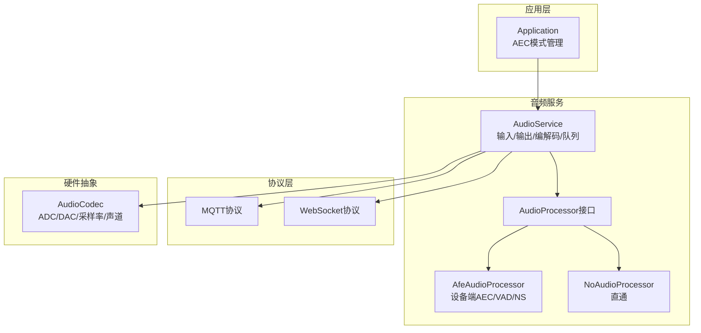
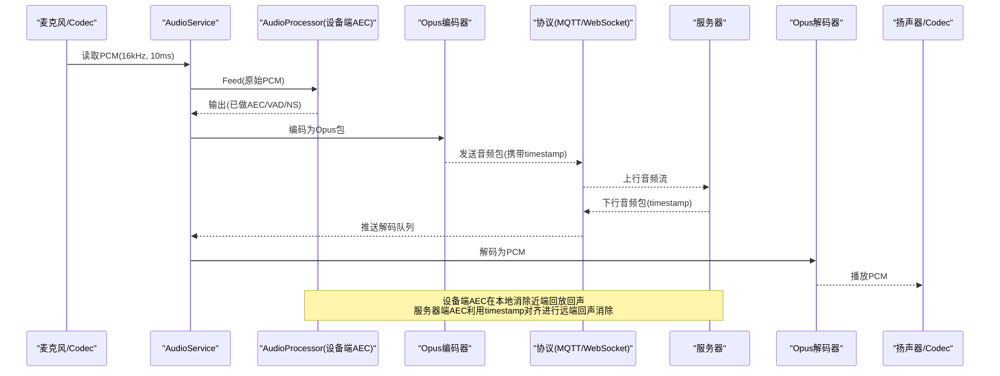
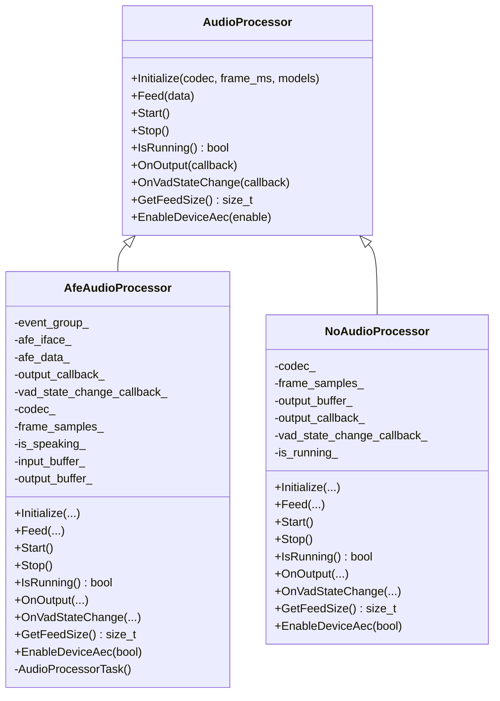
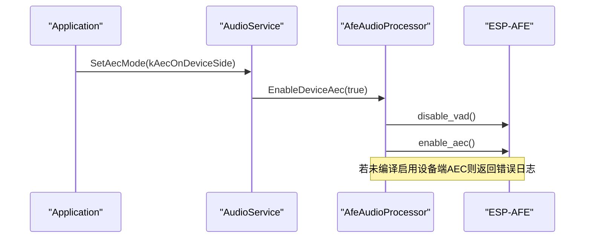
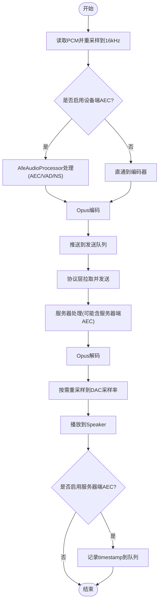
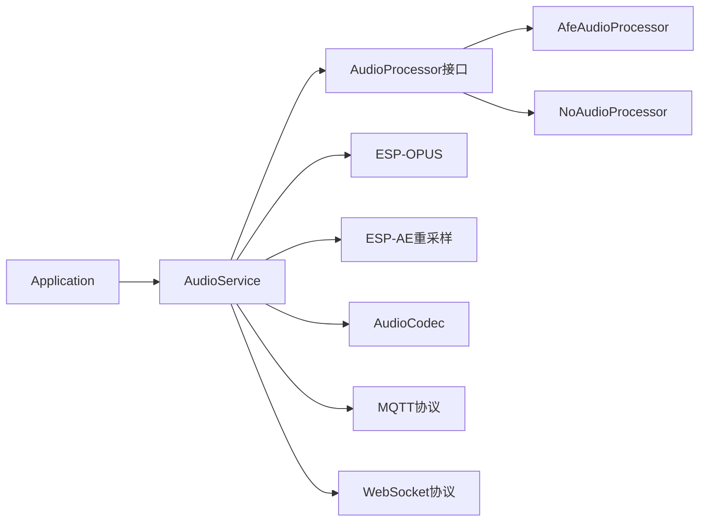

# 回声消除(AEC)

<cite>
**本文引用的文件**   
- [afe_audio_processor.h](file://main/audio/processors/afe_audio_processor.h)
- [afe_audio_processor.cc](file://main/audio/processors/afe_audio_processor.cc)
- [no_audio_processor.h](file://main/audio/processors/no_audio_processor.h)
- [no_audio_processor.cc](file://main/audio/processors/no_audio_processor.cc)
- [audio_processor.h](file://main/audio/audio_processor.h)
- [audio_service.h](file://main/audio/audio_service.h)
- [audio_service.cc](file://main/audio/audio_service.cc)
- [application.h](file://main/application.h)
- [application.cc](file://main/application.cc)
- [config.json](file://main/boards/esp-box-3/config.json)
- [mqtt_protocol.cc](file://main/protocols/mqtt_protocol.cc)
- [websocket_protocol.cc](file://main/protocols/websocket_protocol.cc)
- [audio_debugger.h](file://main/audio/processors/audio_debugger.h)
- [audio_debugger.cc](file://main/audio/processors/audio_debugger.cc)
</cite>

## 目录
1. [引言](#引言)
2. [项目结构](#项目结构)
3. [核心组件](#核心组件)
4. [架构总览](#架构总览)
5. [详细组件分析](#详细组件分析)
6. [依赖关系分析](#依赖关系分析)
7. [性能与调优](#性能与调优)
8. [故障排查指南](#故障排查指南)
9. [结论](#结论)
10. [附录](#附录)

## 引言
本技术文档围绕小智AI聊天机器人中的回声消除（AEC）系统，系统性阐述双向语音通信中本地与远端回声消除的重要性、设备端与服务器端协作机制、AFE_AFE_AEC处理器的算法实现要点（自适应滤波、延迟补偿、频率响应匹配等）、参数与环境配置、性能监控指标，以及不同硬件平台的适配与常见问题解决方案。文档以代码仓库为依据，结合架构图与时序图帮助读者快速理解端到端的音频处理链路。

## 项目结构
本项目在音频子系统内提供两种处理器：
- AfeAudioProcessor：基于ESP-AFE的语音前端，支持设备端AEC、降噪、VAD等能力。
- NoAudioProcessor：轻量直通处理器，用于无AEC或调试场景。

音频服务AudioService负责采集、编码、解码、播放、任务调度以及与协议层的对接；Application层提供AEC模式切换入口并联动显示与协议通道状态。

图表来源
- [application.cc:1090-1115](file://main/application.cc#L1090-L1115)
- [audio_service.h:105-195](file://main/audio/audio_service.h#L105-L195)
- [audio_service.cc:125-167](file://main/audio/audio_service.cc#L125-L167)
- [afe_audio_processor.h:17-46](file://main/audio/processors/afe_audio_processor.h#L17-L46)
- [no_audio_processor.h:11-33](file://main/audio/processors/no_audio_processor.h#L11-L33)

章节来源
- [application.h:37-41](file://main/application.h#L37-L41)
- [application.cc:25-34](file://main/application.cc#L25-L34)
- [audio_service.h:28-44](file://main/audio/audio_service.h#L28-L44)
- [audio_service.cc:62-123](file://main/audio/audio_service.cc#L62-L123)

## 核心组件
- AudioProcessor接口：统一封装音频前端的初始化、数据馈入、启停、回调注册、喂入帧大小查询、设备端AEC开关等能力。
- AfeAudioProcessor：基于ESP-AFE的语音前端实现，支持设备端AEC、VAD、降噪（NS），内部维护输入/输出缓冲与独立任务循环，通过事件组控制运行态。
- NoAudioProcessor：轻量实现，不做复杂处理，主要用于对比或禁用AEC时的直通路径。
- AudioService：音频I/O、重采样、Opus编解码、任务队列、唤醒词检测、设备端AEC开关、服务器端AEC时间戳记录等。
- Application：AEC模式（关闭/设备端/服务器端）管理与切换，联动显示通知与协议音频通道状态。

章节来源
- [audio_processor.h:11-24](file://main/audio/audio_processor.h#L11-L24)
- [afe_audio_processor.h:17-46](file://main/audio/processors/afe_audio_processor.h#L17-L46)
- [afe_audio_processor.cc:13-75](file://main/audio/processors/afe_audio_processor.cc#L13-L75)
- [no_audio_processor.h:11-33](file://main/audio/processors/no_audio_processor.h#L11-L33)
- [audio_service.h:105-195](file://main/audio/audio_service.h#L105-L195)
- [application.h:37-41](file://main/application.h#L37-L41)

## 架构总览
下图展示从麦克风采集到网络发送、以及从网络接收到扬声器播放的完整链路，并标注AEC相关节点。

图表来源
- [audio_service.cc:230-288](file://main/audio/audio_service.cc#L230-L288)
- [audio_service.cc:327-446](file://main/audio/audio_service.cc#L327-L446)
- [audio_service.cc:290-325](file://main/audio/audio_service.cc#L290-L325)
- [mqtt_protocol.cc:303](file://main/protocols/mqtt_protocol.cc#L303)
- [websocket_protocol.cc:208](file://main/protocols/websocket_protocol.cc#L208)

## 详细组件分析

### AfeAudioProcessor（设备端AEC/VAD/NS）
- 初始化流程
  - 根据AudioCodec的输入声道数与参考声道标志构建输入格式字符串。
  - 加载模型列表（默认从“model”分区），筛选VAD与NS模型名称。
  - 构造AFE配置：设置AEC模式为VoIP高性能、VAD模式与最小噪声时长、可选NS与AGC、内存分配策略。
  - 编译期宏CONFIG_USE_DEVICE_AEC决定启用设备端AEC还是VAD。
  - 创建AFE句柄与实例，启动独立任务循环。
- 数据处理
  - Feed将PCM按AFE要求的feed chunksize分块喂入。
  - 任务循环使用fetch_with_delay获取处理结果，触发VAD状态变化回调，并将整帧PCM输出给上层。
- 运行时控制
  - Start/Stop通过事件组控制任务运行，Stop时复位缓冲区。
  - EnableDeviceAec动态切换设备端AEC与VAD（仅在编译期允许设备端AEC时生效）。

图表来源
- [audio_processor.h:11-24](file://main/audio/audio_processor.h#L11-L24)
- [afe_audio_processor.h:17-46](file://main/audio/processors/afe_audio_processor.h#L17-L46)
- [no_audio_processor.h:11-33](file://main/audio/processors/no_audio_processor.h#L11-L33)

章节来源
- [afe_audio_processor.cc:13-75](file://main/audio/processors/afe_audio_processor.cc#L13-L75)
- [afe_audio_processor.cc:84-125](file://main/audio/processors/afe_audio_processor.cc#L84-L125)
- [afe_audio_processor.cc:135-187](file://main/audio/processors/afe_audio_processor.cc#L135-L187)
- [afe_audio_processor.cc:189-201](file://main/audio/processors/afe_audio_processor.cc#L189-L201)
- [no_audio_processor.cc:6-37](file://main/audio/processors/no_audio_processor.cc#L6-L37)
- [no_audio_processor.cc:67-71](file://main/audio/processors/no_audio_processor.cc#L67-L71)

#### 设备端AEC开关时序

图表来源
- [application.cc:1090-1115](file://main/application.cc#L1090-L1115)
- [audio_service.cc:619-627](file://main/audio/audio_service.cc#L619-L627)
- [afe_audio_processor.cc:189-201](file://main/audio/processors/afe_audio_processor.cc#L189-L201)

### AudioService（音频服务与服务器端AEC）
- 输入路径
  - 定时从Codec读取PCM，必要时进行重采样至16kHz，送入WakeWord与AudioProcessor。
  - 当启用设备端AEC时，AudioProcessor对输入进行AEC/VAD/NS处理后再进入编码。
- 编码与发送
  - Opus编码器将16kHz PCM编码为Opus包，推送到发送队列，供协议层拉取。
- 解码与播放
  - 从解码队列取出包，Opus解码后按需要重采样至Codec输出采样率，推送到播放队列。
  - 播放任务更新最后输出时间，并在启用服务器端AEC时将timestamp记录到队列，供后续上行包复用。
- 服务器端AEC时间戳传递
  - 播放任务记录timestamp到timestamp_queue_。
  - 编码任务从timestamp_queue_取出一个timestamp赋给待发送包，确保上下行时间戳对齐。

图表来源
- [audio_service.cc:230-288](file://main/audio/audio_service.cc#L230-L288)
- [audio_service.cc:327-446](file://main/audio/audio_service.cc#L327-L446)
- [audio_service.cc:290-325](file://main/audio/audio_service.cc#L290-L325)
- [audio_service.cc:484-504](file://main/audio/audio_service.cc#L484-L504)

章节来源
- [audio_service.h:28-44](file://main/audio/audio_service.h#L28-L44)
- [audio_service.cc:62-123](file://main/audio/audio_service.cc#L62-L123)
- [audio_service.cc:125-167](file://main/audio/audio_service.cc#L125-L167)
- [audio_service.cc:484-504](file://main/audio/audio_service.cc#L484-L504)
- [audio_service.cc:315-321](file://main/audio/audio_service.cc#L315-L321)

### Application（AEC模式管理）
- 编译期约束：不允许同时启用设备端AEC与服务器端AEC。
- 默认模式：根据编译宏选择kAecOnDeviceSide或kAecOnServerSide，否则为关闭。
- 运行时切换：SetAecMode会调用AudioService.EnableDeviceAec并提示用户，同时关闭当前音频通道以确保新配置生效。

章节来源
- [application.cc:25-34](file://main/application.cc#L25-L34)
- [application.h:37-41](file://main/application.h#L37-L41)
- [application.cc:1090-1115](file://main/application.cc#L1090-L1115)

### 协议层与服务器端AEC
- 特性声明：当启用服务器端AEC时，协议会在握手信息中上报features.aec=true。
- 时间戳对齐：设备端在播放时记录timestamp，编码时将其附加到上行包，以便服务器端进行远端回声消除。

章节来源
- [mqtt_protocol.cc:303](file://main/protocols/mqtt_protocol.cc#L303)
- [websocket_protocol.cc:208](file://main/protocols/websocket_protocol.cc#L208)
- [audio_service.cc:315-321](file://main/audio/audio_service.cc#L315-L321)
- [audio_service.cc:484-504](file://main/audio/audio_service.cc#L484-L504)

## 依赖关系分析
- 组件耦合
  - Application仅通过AudioService暴露的接口控制AEC模式，避免直接依赖具体处理器实现。
  - AudioService通过AudioProcessor接口解耦设备端AEC与直通路径。
  - 协议层与AudioService通过队列与回调交互，保持低耦合。
- 外部依赖
  - ESP-AFE（设备端AEC/VAD/NS）
  - ESP-OPUS编解码
  - ESP-AE重采样
  - 平台板级AudioCodec抽象

图表来源
- [application.cc:1090-1115](file://main/application.cc#L1090-L1115)
- [audio_service.h:105-195](file://main/audio/audio_service.h#L105-L195)
- [audio_service.cc:62-123](file://main/audio/audio_service.cc#L62-L123)

章节来源
- [audio_service.h:105-195](file://main/audio/audio_service.h#L105-L195)
- [audio_service.cc:62-123](file://main/audio/audio_service.cc#L62-L123)

## 性能与调优
- 关键参数与影响
  - 帧长与采样率：输入通常为16kHz，10ms帧；编码器默认60ms帧，需平衡延迟与压缩效率。
  - 重采样：当Codec输入/输出采样率与16kHz不一致时启用，注意缓存与抖动。
  - 队列长度：发送/解码/播放队列上限影响吞吐与延迟，过大增加延迟，过小易丢包。
  - AEC/VAD/NS：设备端AEC在高回声环境有效，但需参考声道；VAD可节省带宽；NS提升信噪比。
- 监控指标
  - 输入/解码/编码/播放计数：DebugStatistics便于评估链路健康度。
  - 最后输入/输出时间：用于电源管理，长时间空闲自动关闭Codec以降低功耗。
  - 时间戳队列：服务器端AEC依赖稳定的timestamp传递。
- 优化建议
  - 合理设置OPUS帧长与VBR，兼顾音质与带宽。
  - 在强回声场景优先启用设备端AEC；在网络不稳定时考虑服务器端AEC。
  - 调整VAD阈值与最小噪声时长，减少误触发。
  - 针对PSRAM受限平台，谨慎开启NS/AEC，避免内存不足。

章节来源
- [audio_service.h:98-103](file://main/audio/audio_service.h#L98-L103)
- [audio_service.cc:682-698](file://main/audio/audio_service.cc#L682-L698)
- [audio_service.cc:327-446](file://main/audio/audio_service.cc#L327-L446)
- [afe_audio_processor.cc:40-57](file://main/audio/processors/afe_audio_processor.cc#L40-L57)

## 故障排查指南
- 设备端AEC不可用
  - 现象：调用EnableDeviceAec(true)返回不支持日志。
  - 原因：编译期未启用CONFIG_USE_DEVICE_AEC。
  - 解决：在目标板配置中追加CONFIG_USE_DEVICE_AEC=y，例如esp-box-3的config.json。
- 同时启用设备端与服务器端AEC
  - 现象：编译报错，禁止同时启用。
  - 解决：二选一，依据硬件与网络条件选择合适模式。
- 回声残留或啸叫
  - 检查是否提供参考声道（输入参考标志），确认AEC模式与VAD/NS配置。
  - 调整VAD最小噪声时长与NS模式，避免过度抑制导致失真。
- 延迟过高
  - 降低OPUS帧长或减少重采样次数。
  - 检查队列长度与任务优先级，避免阻塞。
- 服务器端AEC不生效
  - 确认协议features.aec已上报。
  - 检查timestamp是否在播放与编码路径正确传递。

章节来源
- [afe_audio_processor.cc:189-201](file://main/audio/processors/afe_audio_processor.cc#L189-L201)
- [application.cc:25-34](file://main/application.cc#L25-L34)
- [config.json:6-8](file://main/boards/esp-box-3/config.json#L6-L8)
- [audio_service.cc:315-321](file://main/audio/audio_service.cc#L315-L321)
- [mqtt_protocol.cc:303](file://main/protocols/mqtt_protocol.cc#L303)
- [websocket_protocol.cc:208](file://main/protocols/websocket_protocol.cc#L208)

## 结论
本项目的AEC体系通过设备端与服务器端两种路径满足多样化场景需求：设备端AEC在本地完成自适应滤波与回声消除，适合高回声环境；服务器端AEC借助时间戳对齐实现远端回声消除，适合网络侧集中处理。AudioService作为中枢协调采集、处理、编解码与播放，Application提供便捷的模式切换与状态反馈。通过合理的参数调优与监控指标，可在不同硬件平台上获得稳定、低延迟且高质量的语音通话体验。

## 附录
- 硬件平台适配要点
  - 在目标板配置文件中添加CONFIG_USE_DEVICE_AEC=y以启用设备端AEC（如esp-box-3）。
  - 对于不支持参考声道的板卡，设备端AEC效果受限，建议采用服务器端AEC。
  - 关注PSRAM容量与内存分配策略，避免NS/AEC导致内存不足。
- 调试工具
  - 音频调试器可通过UDP将原始PCM发送到指定服务器，辅助定位回声与噪声问题。

章节来源
- [config.json:6-8](file://main/boards/esp-box-3/config.json#L6-L8)
- [audio_debugger.h:10-20](file://main/audio/processors/audio_debugger.h#L10-L20)
- [audio_debugger.cc:16-42](file://main/audio/processors/audio_debugger.cc#L16-L42)
- [audio_debugger.cc:54-66](file://main/audio/processors/audio_debugger.cc#L54-L66)