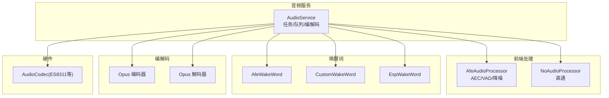
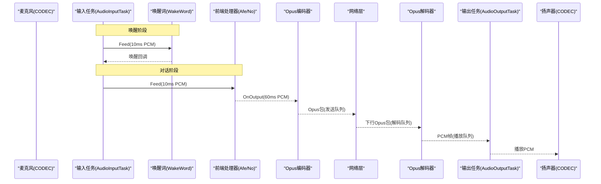
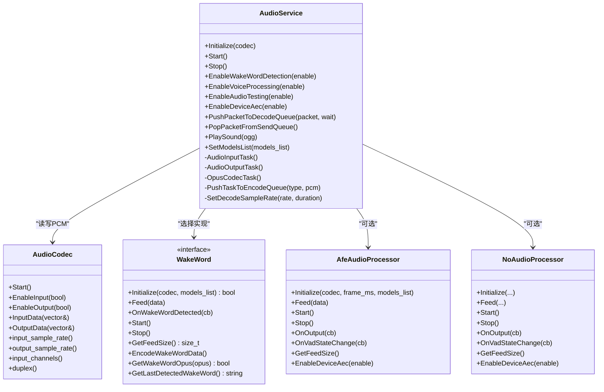
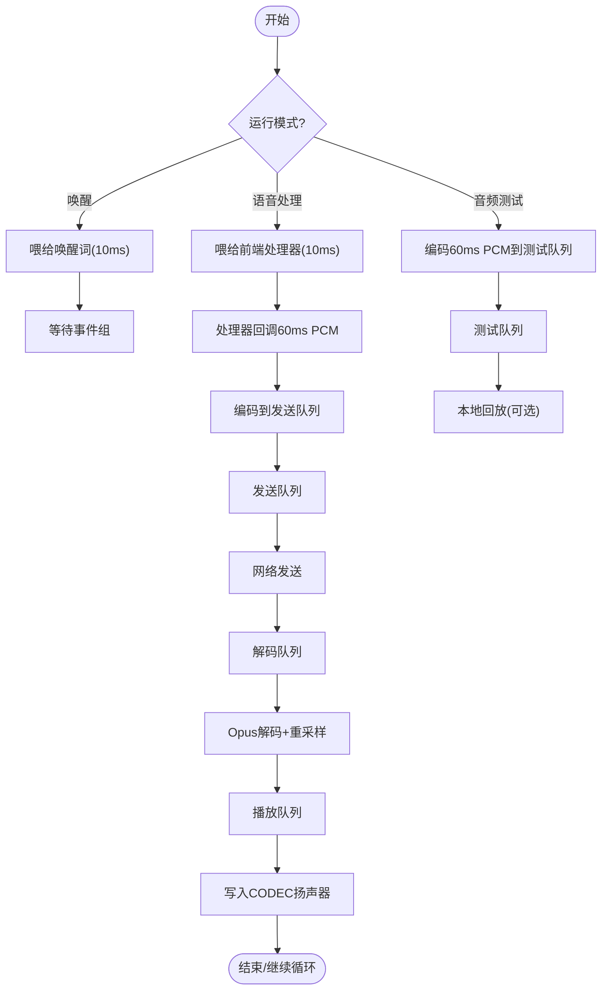
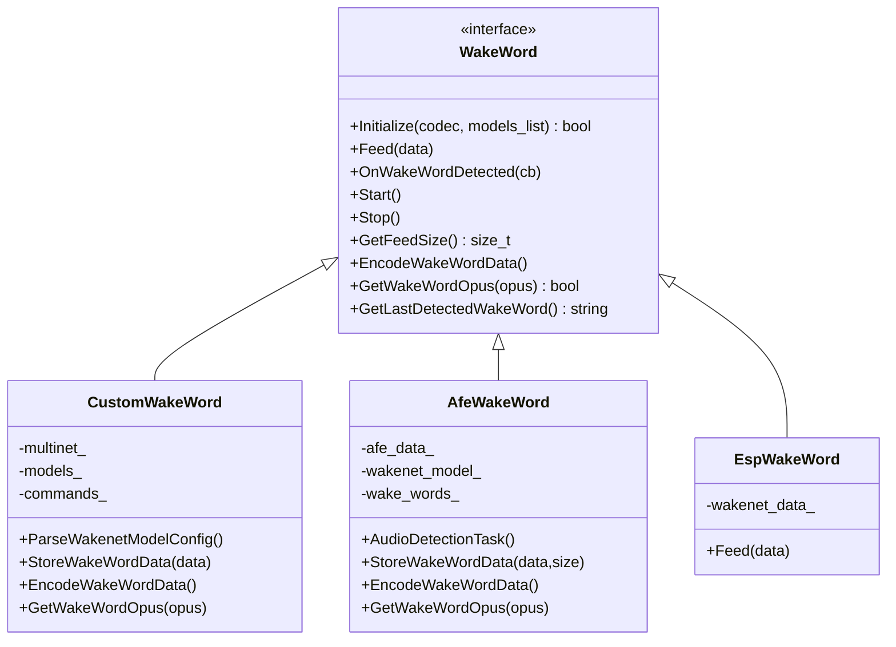
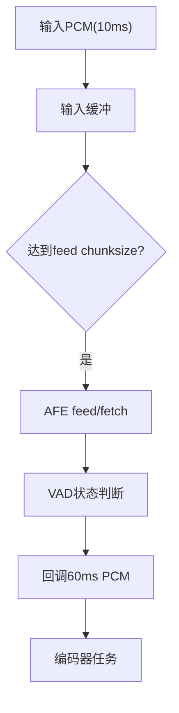
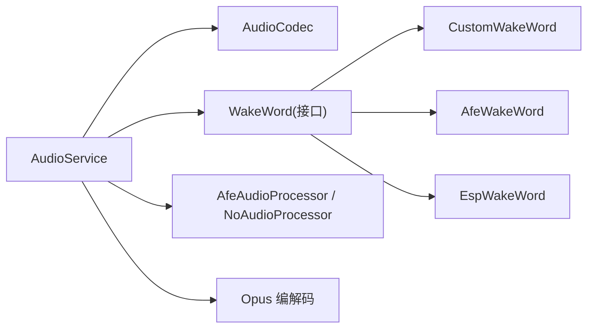

# 语音交互系统

<cite>
**本文引用的文件**   
- [audio_service.h](file://main\audio\audio_service.h)
- [audio_service.cc](file://main\audio\audio_service.cc)
- [wake_word.h](file://main\audio\wake_word.h)
- [afe_audio_processor.h](file://main\audio\processors\afe_audio_processor.h)
- [afe_audio_processor.cc](file://main\audio\processors\afe_audio_processor.cc)
- [custom_wake_word.h](file://main\audio\wake_words\custom_wake_word.h)
- [custom_wake_word.cc](file://main\audio\wake_words\custom_wake_word.cc)
- [afe_wake_word.h](file://main\audio\wake_words\afe_wake_word.h)
- [afe_wake_word.cc](file://main\audio\wake_words\afe_wake_word.cc)
- [esp_wake_word.h](file://main\audio\wake_words\esp_wake_word.h)
- [esp_wake_word.cc](file://main\audio\wake_words\esp_wake_word.cc)
- [no_audio_processor.h](file://main\audio\processors\no_audio_processor.h)
- [no_audio_processor.cc](file://main\audio\processors\no_audio_processor.cc)
- [es8311_audio_codec.h](file://main\audio\codecs\es8311_audio_codec.h)
- [audio_codec.h](file://main\audio\audio_codec.h)
- [audio_codec.cc](file://main\audio\audio_codec.cc)
</cite>

## 目录
1. [简介](#简介)
2. [项目结构](#项目结构)
3. [核心组件](#核心组件)
4. [架构总览](#架构总览)
5. [详细组件分析](#详细组件分析)
6. [依赖关系分析](#依赖关系分析)
7. [性能与优化](#性能与优化)
8. [故障排查指南](#故障排查指南)
9. [结论](#结论)
10. [附录：集成示例与最佳实践](#附录集成示例与最佳实践)

## 简介
本文件面向小智AI聊天机器人语音交互系统的实现，围绕“流式ASR + LLM + TTS”的端到端语音对话链路，重点阐述以下能力：
- 离线唤醒检测（支持多种唤醒方案）
- 实时音频采集与回声消除、降噪、VAD等前端处理
- 双路径音频数据流：麦克风→处理器→编码器→服务器；服务器→解码器→扬声器
- FreeRTOS任务调度与队列/事件组协作
- 唤醒词配置、VAD状态回调、音频调试工具使用
- 性能优化策略与常见问题定位

## 项目结构
本项目将音频子系统集中在 main/audio 目录下，采用分层与可插拔设计：
- audio_service：音频服务编排，负责任务创建、队列管理、编解码、电源管理等
- processors：音频前端处理（AEC/VAD/降噪），提供 AFE 实现与直通实现
- wake_words：唤醒词识别（AFE WakeNet、Custom Multinet、ESP WakeNet）
- codecs：具体硬件编解码器抽象与驱动封装（如 ES8311）
- audio_codec：统一音频接口抽象

图表来源
- [audio_service.h:28-44](file://main\audio\audio_service.h#L28-L44)
- [audio_service.cc:125-167](file://main\audio\audio_service.cc#L125-L167)
- [afe_audio_processor.h:17-46](file://main\audio\processors\afe_audio_processor.h#L17-L46)
- [custom_wake_word.h:20-69](file://main\audio\wake_words\custom_wake_word.h#L20-L69)
- [afe_wake_word.h:22-60](file://main\audio\wake_words\afe_wake_word.h#L22-L60)
- [esp_wake_word.h:17-43](file://main\audio\wake_words\esp_wake_word.h#L17-L43)
- [es8311_audio_codec.h:13-40](file://main\audio\codecs\es8311_audio_codec.h#L13-L40)

章节来源
- [audio_service.h:28-44](file://main\audio\audio_service.h#L28-L44)
- [audio_service.cc:125-167](file://main\audio\audio_service.cc#L125-L167)

## 核心组件
- AudioService：音频系统核心，负责：
  - 启动输入/输出/编解码三个FreeRTOS任务
  - 维护多队列（发送、解码、播放、测试）与条件变量同步
  - 动态设置采样率、帧长、重采样、Opus编解码
  - 管理唤醒词与前端处理器的生命周期与切换
  - 设备AEC开关、VAD状态回调、音频测试模式
- 音频前端处理器：
  - AfeAudioProcessor：基于ESP-AFE，支持AEC/VAD/降噪，独立任务fetch结果并回调
  - NoAudioProcessor：轻量直通，仅做声道转换与分帧
- 唤醒词模块：
  - CustomWakeWord：Multinet命令词识别，支持index.json配置与自定义指令
  - AfeWakeWord：基于AFE的Wakenet唤醒，支持多唤醒词列表
  - EspWakeWord：轻量WakeNet实现
- 音频编解码：
  - Opus编码：固定16kHz单声道，60ms帧，VBR/DTX/FEC可选
  - Opus解码：根据网络侧sample_rate/frame_duration动态重建解码器，必要时重采样到硬件输出

章节来源
- [audio_service.h:105-195](file://main\audio\audio_service.h#L105-L195)
- [audio_service.cc:62-123](file://main\audio\audio_service.cc#L62-L123)
- [afe_audio_processor.h:17-46](file://main\audio\processors\afe_audio_processor.h#L17-L46)
- [no_audio_processor.h:11-33](file://main\audio\processors\no_audio_processor.h#L11-L33)
- [custom_wake_word.h:20-69](file://main\audio\wake_words\custom_wake_word.h#L20-L69)
- [afe_wake_word.h:22-60](file://main\audio\wake_words\afe_wake_word.h#L22-L60)
- [esp_wake_word.h:17-43](file://main\audio\wake_words\esp_wake_word.h#L17-L43)

## 架构总览
整体遵循“双任务+编解码任务”的三任务模型：
- 输入任务：从Codec读取PCM，按模式喂给唤醒词或前端处理器
- 输出任务：从播放队列取PCM写入Codec
- 编解码任务：从编码队列取PCM进行Opus编码入发送队列；从解码队列取包解码入播放队列

图表来源
- [audio_service.cc:230-288](file://main\audio\audio_service.cc#L230-L288)
- [audio_service.cc:290-325](file://main\audio\audio_service.cc#L290-L325)
- [audio_service.cc:327-446](file://main\audio\audio_service.cc#L327-L446)
- [afe_audio_processor.cc:135-187](file://main\audio\processors\afe_audio_processor.cc#L135-L187)

## 详细组件分析

### AudioService 类设计与职责
- 关键职责
  - 初始化Codec、Opus编解码器、输入/输出重采样器
  - 启动三个任务：输入、输出、编解码
  - 维护多队列与条件变量，控制背压与延迟
  - 管理唤醒词与前端处理器的Start/Stop与资源切换
  - 提供VAD状态回调、音频测试、设备AEC开关
- 关键数据结构
  - 队列：audio_encode_queue_、audio_send_queue_、audio_decode_queue_、audio_playback_queue_、audio_testing_queue_
  - 事件组：用于控制输入任务的运行模式（唤醒/处理/测试）
  - 定时器：周期性检查输入/输出空闲以关闭Codec通道节能
- 关键流程
  - ReadAudioData：按需开启输入、采样率不一致时重采样至16kHz
  - PushTaskToEncodeQueue：为发送到服务器的包附加时间戳（用于服务端AEC）
  - SetDecodeSampleRate：动态重建解码器与输出重采样器
  - PlaySound：本地OGG音效播放，经OggDemuxer拆帧后进入解码队列

图表来源
- [audio_service.h:105-195](file://main\audio\audio_service.h#L105-L195)
- [audio_codec.h:17-59](file://main\audio\audio_codec.h#L17-L59)
- [wake_word.h:11-24](file://main\audio\wake_word.h#L11-L24)
- [afe_audio_processor.h:17-46](file://main\audio\processors\afe_audio_processor.h#L17-L46)
- [no_audio_processor.h:11-33](file://main\audio\processors\no_audio_processor.h#L11-L33)

章节来源
- [audio_service.h:28-44](file://main\audio\audio_service.h#L28-L44)
- [audio_service.cc:62-123](file://main\audio\audio_service.cc#L62-L123)
- [audio_service.cc:125-167](file://main\audio\audio_service.cc#L125-L167)
- [audio_service.cc:184-228](file://main\audio\audio_service.cc#L184-L228)
- [audio_service.cc:448-482](file://main\audio\audio_service.cc#L448-L482)
- [audio_service.cc:633-654](file://main\audio\audio_service.cc#L633-L654)

### 音频数据流与任务调度
- 输入路径（麦克风→处理器→编码器→服务器）
  - 输入任务循环等待事件组，按模式分别：
    - 唤醒模式：10ms PCM喂给唤醒词
    - 语音处理模式：10ms PCM喂给前端处理器，处理器回调60ms PCM
    - 音频测试模式：直接编码60ms PCM进入测试队列
  - 编码器任务从编码队列取PCM，编码为Opus包，推入发送队列或测试队列
- 输出路径（服务器→解码器→扬声器）
  - 外部将Opus包推入解码队列
  - 编码器任务取出包，调用Opus解码，必要时重采样，推入播放队列
  - 输出任务从播放队列取PCM写入Codec

图表来源
- [audio_service.cc:230-288](file://main\audio\audio_service.cc#L230-L288)
- [audio_service.cc:327-446](file://main\audio\audio_service.cc#L327-L446)
- [audio_service.cc:290-325](file://main\audio\audio_service.cc#L290-L325)

章节来源
- [audio_service.cc:230-288](file://main\audio\audio_service.cc#L230-L288)
- [audio_service.cc:290-325](file://main\audio\audio_service.cc#L290-L325)
- [audio_service.cc:327-446](file://main\audio\audio_service.cc#L327-L446)

### 唤醒词模块详解
- 选择策略
  - 根据模型列表前缀自动选择：ESP_MN_PREFIX → CustomWakeWord；ESP_WN_PREFIX → AfeWakeWord；否则回退到EspWakeWord（非S3/P4平台）
- CustomWakeWord（Multinet）
  - 支持从index.json解析语言、阈值、时长、命令列表
  - 检测到匹配命令后回调上层，并可停止检测
  - 提供EncodeWakeWordData与GetWakeWordOpus，异步编码最近约2秒PCM为Opus片段
- AfeWakeWord（Wakenet）
  - 基于AFE的唤醒流水线，支持参考通道AEC
  - 唤醒后记录最后唤醒词，并提供相同Opus导出接口
- EspWakeWord（轻量）
  - 简单WakeNet实现，无Opus导出

图表来源
- [wake_word.h:11-24](file://main\audio\wake_word.h#L11-L24)
- [custom_wake_word.h:20-69](file://main\audio\wake_words\custom_wake_word.h#L20-L69)
- [custom_wake_word.cc:37-129](file://main\audio\wake_words\custom_wake_word.cc#L37-L129)
- [custom_wake_word.cc:218-303](file://main\audio\wake_words\custom_wake_word.cc#L218-L303)
- [afe_wake_word.h:22-60](file://main\audio\wake_words\afe_wake_word.h#L22-L60)
- [afe_wake_word.cc:38-90](file://main\audio\wake_words\afe_wake_word.cc#L38-L90)
- [afe_wake_word.cc:172-263](file://main\audio\wake_words\afe_wake_word.cc#L172-L263)
- [esp_wake_word.h:17-43](file://main\audio\wake_words\esp_wake_word.h#L17-L43)
- [esp_wake_word.cc:17-45](file://main\audio\wake_words\esp_wake_word.cc#L17-L45)

章节来源
- [audio_service.cc:700-726](file://main\audio\audio_service.cc#L700-L726)
- [custom_wake_word.cc:37-129](file://main\audio\wake_words\custom_wake_word.cc#L37-L129)
- [custom_wake_word.cc:218-303](file://main\audio\wake_words\custom_wake_word.cc#L218-L303)
- [afe_wake_word.cc:38-90](file://main\audio\wake_words\afe_wake_word.cc#L38-L90)
- [afe_wake_word.cc:172-263](file://main\audio\wake_words\afe_wake_word.cc#L172-L263)
- [esp_wake_word.cc:17-45](file://main\audio\wake_words\esp_wake_word.cc#L17-L45)

### 前端处理与VAD/AEC
- AfeAudioProcessor
  - 通过AFE配置NS/VAD/AEC，支持参考通道AEC
  - 独立任务fetch结果，触发VAD状态变化回调，并按60ms整帧输出
  - EnableDeviceAec可在运行时切换AEC/VAD
- NoAudioProcessor
  - 轻量直通，仅做立体声转单声道与分帧，适合低算力场景

图表来源
- [afe_audio_processor.cc:13-75](file://main\audio\processors\afe_audio_processor.cc#L13-L75)
- [afe_audio_processor.cc:135-187](file://main\audio\processors\afe_audio_processor.cc#L135-L187)
- [no_audio_processor.cc:12-37](file://main\audio\processors\no_audio_processor.cc#L12-L37)

章节来源
- [afe_audio_processor.cc:13-75](file://main\audio\processors\afe_audio_processor.cc#L13-L75)
- [afe_audio_processor.cc:135-187](file://main\audio\processors\afe_audio_processor.cc#L135-L187)
- [no_audio_processor.cc:12-37](file://main\audio\processors\no_audio_processor.cc#L12-L37)

### 编解码与重采样
- 编码器
  - 固定16kHz、单声道、60ms帧，启用VBR/DTX，FEC可选
  - 编码成功后推入发送队列，并通过回调通知上层可取包
- 解码器
  - 根据包sample_rate与frame_duration动态重建解码器
  - 若与硬件输出采样率不一致，则启用输出重采样器
- 重采样
  - 输入重采样：当Codec输入采样率≠16kHz时使用
  - 输出重采样：当解码采样率≠Codec输出采样率时使用

章节来源
- [audio_service.cc:62-123](file://main\audio\audio_service.cc#L62-L123)
- [audio_service.cc:448-482](file://main\audio\audio_service.cc#L448-L482)
- [audio_service.cc:327-446](file://main\audio\audio_service.cc#L327-L446)

## 依赖关系分析
- 模块耦合
  - AudioService 强依赖 AudioCodec 与 WakeWord 抽象，弱依赖具体处理器实现（编译期选择）
  - 唤醒词实现之间互不依赖，通过统一接口被AudioService选择
- 外部依赖
  - ESP-IDF I2S/Codec驱动、ESP-AFE、ESP-Multinet/WakeNet、Opus编解码库
- 潜在环依赖
  - 当前未见循环依赖；唤醒词与处理器均通过回调解耦

图表来源
- [audio_service.h:105-195](file://main\audio\audio_service.h#L105-L195)
- [wake_word.h:11-24](file://main\audio\wake_word.h#L11-L24)
- [afe_audio_processor.h:17-46](file://main\audio\processors\afe_audio_processor.h#L17-L46)
- [no_audio_processor.h:11-33](file://main\audio\processors\no_audio_processor.h#L11-L33)

章节来源
- [audio_service.h:105-195](file://main\audio\audio_service.h#L105-L195)
- [wake_word.h:11-24](file://main\audio\wake_word.h#L11-L24)

## 性能与优化
- 任务与优先级
  - 输入任务高优先级（确保低延迟采集）
  - 编解码任务中等优先级（避免阻塞I/O）
  - 输出任务较低优先级（播放抖动容忍度较高）
- 队列与背压
  - 编码/解码/播放队列限制长度，防止内存暴涨
  - 条件变量协调生产者-消费者，减少忙轮询
- 重采样复杂度
  - 仅在必要时启用输入/输出重采样，降低CPU占用
- 电源管理
  - 定时检查输入/输出空闲，关闭Codec通道以降低功耗
- 建议
  - 在嘈杂环境优先启用AEC/VAD/降噪
  - 合理调整OPUS帧长与码率（默认60ms，VBR）
  - 对双声道输入，尽量在早期抽取单声道以减少带宽与计算

[本节为通用指导，无需源码引用]

## 故障排查指南
- 无法唤醒
  - 检查模型加载与命令词配置是否正确
  - 确认唤醒词模块已Start且事件组位正确
- 无声或杂音
  - 检查输入/输出是否被电源管理关闭
  - 确认重采样链路与采样率一致
- 回声严重
  - 启用设备AEC（需硬件支持参考通道）
  - 调整AFE AEC模式与VAD参数
- 卡顿/爆音
  - 检查队列是否长期满，适当增大队列上限或提升任务优先级
  - 观察网络丢包与解码错误日志

章节来源
- [audio_service.cc:682-698](file://main\audio\audio_service.cc#L682-L698)
- [audio_service.cc:327-446](file://main\audio\audio_service.cc#L327-L446)
- [afe_audio_processor.cc:189-201](file://main\audio\processors\afe_audio_processor.cc#L189-L201)

## 结论
本系统通过清晰的任务划分与队列机制，实现了稳定的流式语音交互链路。结合可插拔的唤醒词与前端处理模块，既满足低功耗场景的直通需求，也支持高性能的AEC/VAD/降噪组合。通过完善的回调与调试接口，便于快速集成与问题定位。

[本节为总结性内容，无需源码引用]

## 附录：集成示例与最佳实践

### 集成自定义唤醒词（Multinet）
- 准备模型与index.json
  - index.json中定义language、duration、threshold、commands数组（command/text/action）
- 加载模型列表并设置到AudioService
  - 调用SetModelsList传入模型列表指针，内部会根据前缀选择CustomWakeWord
- 启用唤醒检测
  - 调用EnableWakeWordDetection(true)，并在回调中处理on_wake_word_detected
- 获取唤醒片段
  - 调用EncodeWakeWordData与GetWakeWordOpus获取最近约2秒PCM的Opus片段

章节来源
- [custom_wake_word.cc:37-129](file://main\audio\wake_words\custom_wake_word.cc#L37-L129)
- [custom_wake_word.cc:218-303](file://main\audio\wake_words\custom_wake_word.cc#L218-L303)
- [audio_service.cc:700-726](file://main\audio\audio_service.cc#L700-L726)

### 启用设备AEC与VAD
- 启用前端处理
  - 调用EnableVoiceProcessing(true)
- 切换AEC/VAD
  - 调用EnableDeviceAec(true)启用设备AEC并禁用VAD；false则恢复VAD
- 监听VAD状态
  - 通过on_vad_change回调感知说话/静音

章节来源
- [audio_service.cc:579-604](file://main\audio\audio_service.cc#L579-L604)
- [audio_service.cc:619-627](file://main\audio\audio_service.cc#L619-L627)
- [afe_audio_processor.cc:189-201](file://main\audio\processors\afe_audio_processor.cc#L189-L201)

### 音频调试工具使用
- 启用音频调试
  - 在ReadAudioData中，若启用音频调试宏，会创建AudioDebugger并将原始PCM馈入
- 使用方法
  - 配合脚本或服务端工具接收PCM，进行波形可视化或离线分析

章节来源
- [audio_service.cc:219-225](file://main\audio\audio_service.cc#L219-L225)

### 音频测试模式
- 用途
  - 在网络配置模式下，可通过按键触发音频测试，录制并回放一段音频
- 步骤
  - 调用EnableAudioTesting(true)
  - 输入任务会将60ms PCM编码进测试队列
  - 停止测试后，测试队列内容会被复制到解码队列进行回放

章节来源
- [audio_service.cc:606-617](file://main\audio\audio_service.cc#L606-L617)

### 性能调优清单
- 任务栈大小与优先级
  - 输入任务与编解码任务保持足够栈空间，避免溢出
- 队列容量
  - 根据网络与CPU能力调整MAX_SEND_PACKETS_IN_QUEUE与MAX_DECODE_PACKETS_IN_QUEUE
- 重采样
  - 尽量使Codec输入/输出采样率与16kHz一致，减少重采样开销
- 电源管理
  - 合理设置AUDIO_POWER_TIMEOUT_MS与检查间隔，平衡功耗与响应速度

章节来源
- [audio_service.cc:125-167](file://main\audio\audio_service.cc#L125-L167)
- [audio_service.cc:682-698](file://main\audio\audio_service.cc#L682-L698)