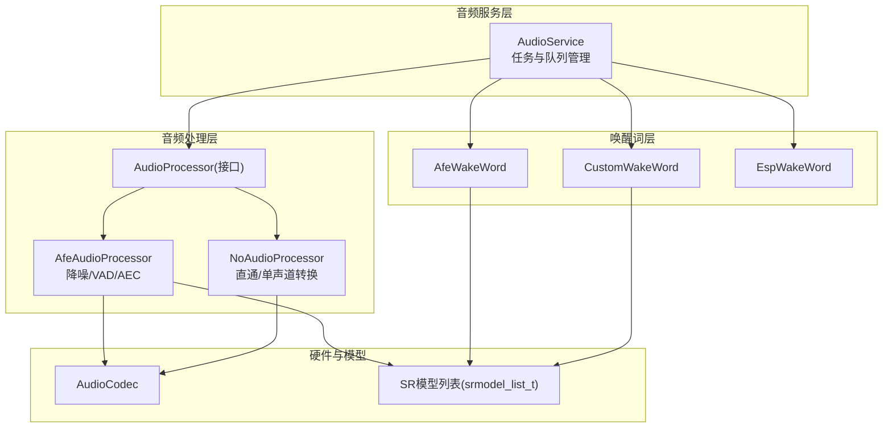
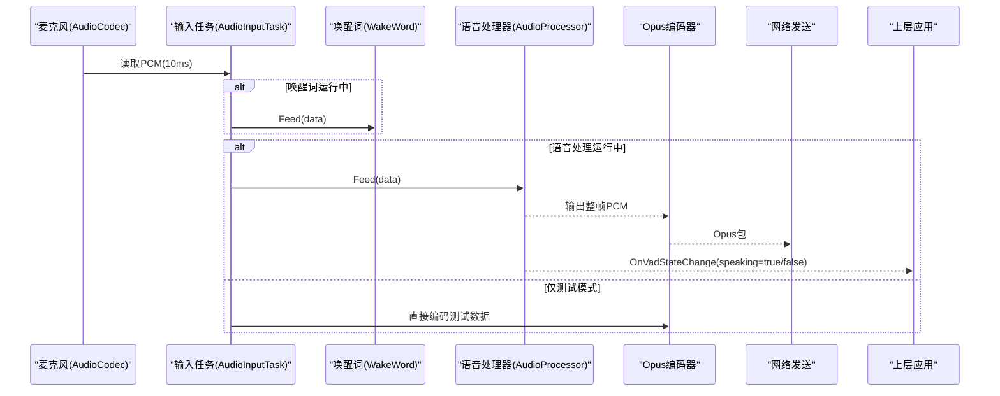
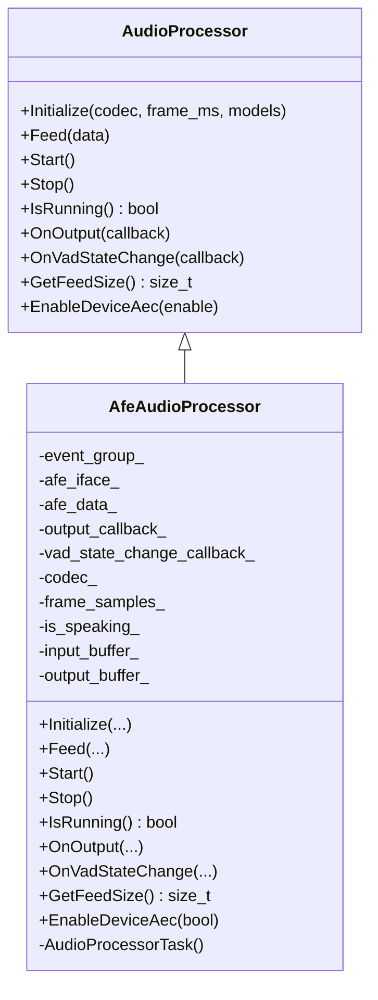
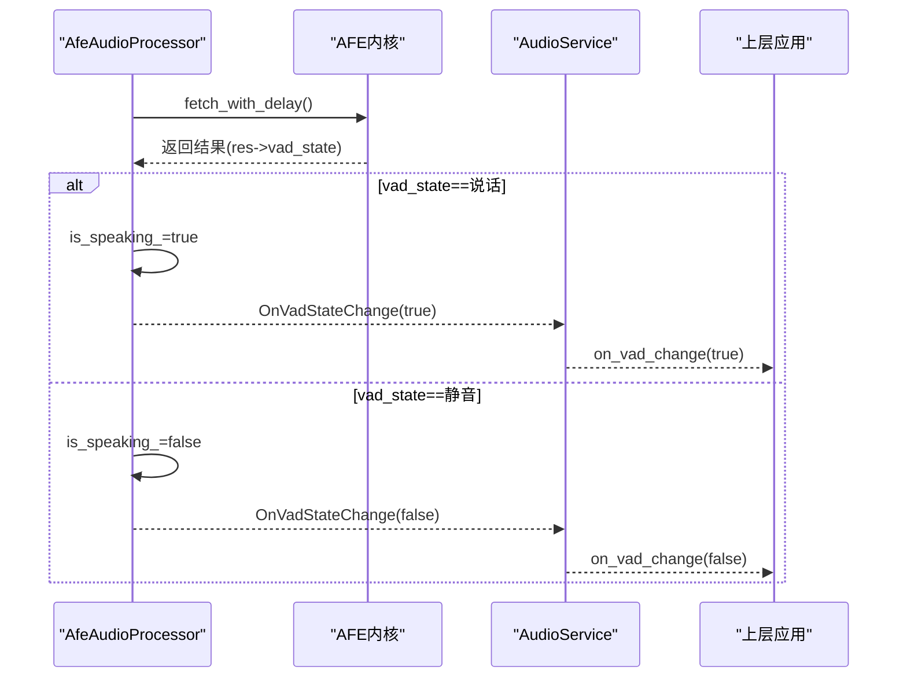
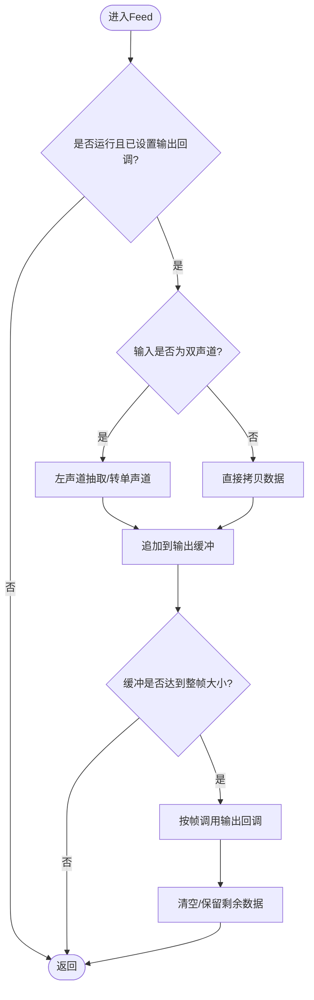
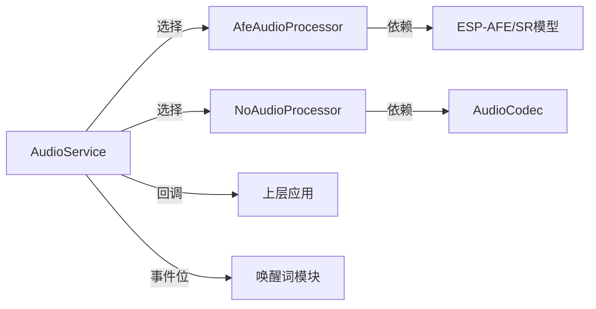

# 语音活动检测(VAD)

<cite>
**本文引用的文件**   
- [audio_processor.h](file://main\audio\audio_processor.h)
- [no_audio_processor.h](file://main\audio\processors\no_audio_processor.h)
- [no_audio_processor.cc](file://main\audio\processors\no_audio_processor.cc)
- [afe_audio_processor.h](file://main\audio\processors\afe_audio_processor.h)
- [afe_audio_processor.cc](file://main\audio\processors\afe_audio_processor.cc)
- [audio_service.h](file://main\audio\audio_service.h)
- [audio_service.cc](file://main\audio\audio_service.cc)
- [afe_wake_word.h](file://main\audio\wake_words\afe_wake_word.h)
- [custom_wake_word.h](file://main\audio\wake_words\custom_wake_word.h)
</cite>

## 目录
1. [简介](#简介)
2. [项目结构](#项目结构)
3. [核心组件](#核心组件)
4. [架构总览](#架构总览)
5. [详细组件分析](#详细组件分析)
6. [依赖关系分析](#依赖关系分析)
7. [性能与调优](#性能与调优)
8. [故障排查指南](#故障排查指南)
9. [结论](#结论)
10. [附录：配置与示例](#附录配置与示例)

## 简介
本文件围绕小智AI聊天机器人中的语音活动检测（VAD）子系统，系统阐述其在语音交互链路中的作用、实现原理与工程实践。重点覆盖以下方面：
- VAD在语音采集、降噪、回声消除、唤醒词识别与后续对话流程中的关键作用
- NoAudioProcessor与AfeAudioProcessor两种处理器的差异与适用场景
- VAD参数配置、灵敏度调节与误检率优化方法
- VAD与唤醒词检测的协作机制
- 通过回调函数向上层应用通知语音状态变化
- 具体配置示例与性能调优建议

## 项目结构
本项目将音频输入/输出、编解码、VAD与唤醒词等模块解耦，采用“服务+处理器”的分层设计：
- AudioService负责整体调度、任务编排、队列管理与回调分发
- AudioProcessor为统一抽象接口，提供两种实现：
  - AfeAudioProcessor：基于ESP-AFE的完整语音前端（降噪、VAD、可选设备AEC），适用于S3/P4平台
  - NoAudioProcessor：轻量直通处理器，不做复杂信号处理，适用于无硬件AEC或资源受限场景
- WakeWord模块支持多种唤醒方案（AfeWakeWord、CustomWakeWord、EspWakeWord），与VAD协同工作

图表来源
- [audio_service.h:105-195](file://main\audio\audio_service.h#L105-L195)
- [audio_service.cc:95-123](file://main\audio\audio_service.cc#L95-L123)
- [audio_processor.h:11-24](file://main\audio\audio_processor.h#L11-L24)
- [afe_audio_processor.h:17-46](file://main\audio\processors\afe_audio_processor.h#L17-L46)
- [no_audio_processor.h:11-33](file://main\audio\processors\no_audio_processor.h#L11-L33)

章节来源
- [audio_service.h:105-195](file://main\audio\audio_service.h#L105-L195)
- [audio_service.cc:95-123](file://main\audio\audio_service.cc#L95-L123)
- [audio_processor.h:11-24](file://main\audio\audio_processor.h#L11-L24)
- [afe_audio_processor.h:17-46](file://main\audio\processors\afe_audio_processor.h#L17-L46)
- [no_audio_processor.h:11-33](file://main\audio\processors\no_audio_processor.h#L11-L33)

## 核心组件
- AudioProcessor接口：定义统一的初始化、数据馈入、启停、输出与VAD状态回调等能力
- AfeAudioProcessor：集成降噪、VAD与可选设备AEC，内部维护独立任务循环，按帧输出PCM并上报VAD状态
- NoAudioProcessor：轻量实现，仅做必要的通道数转换与分帧输出，不启用VAD
- AudioService：串联输入任务、编码器、VAD/唤醒词与播放任务，并通过回调向应用层暴露语音状态

章节来源
- [audio_processor.h:11-24](file://main\audio\audio_processor.h#L11-L24)
- [afe_audio_processor.h:17-46](file://main\audio\processors\afe_audio_processor.h#L17-L46)
- [no_audio_processor.h:11-33](file://main\audio\processors\no_audio_processor.h#L11-L33)
- [audio_service.h:105-195](file://main\audio\audio_service.h#L105-L195)

## 架构总览
下图展示从麦克风到网络发送的端到端路径，以及VAD状态如何驱动上层逻辑。

图表来源
- [audio_service.cc:230-288](file://main\audio\audio_service.cc#L230-L288)
- [audio_service.cc:101-110](file://main\audio\audio_service.cc#L101-L110)
- [audio_service.cc:327-446](file://main\audio\audio_service.cc#L327-L446)

## 详细组件分析

### 组件一：AfeAudioProcessor（含VAD/降噪/可选AEC）
- 功能要点
  - 初始化时根据输入通道构建输入格式，加载降噪与VAD模型，配置AFE工作模式
  - 启动独立任务循环，周期性从AFE拉取处理结果，更新VAD状态并输出整帧PCM
  - 支持动态切换设备AEC与软件VAD（受编译宏控制）
- 关键流程
  - Initialize：创建事件组、计算帧大小、构造输入格式、选择NS/VAD模型、创建AFE实例并启动任务
  - Feed：加锁写入输入缓冲，按chunk_size喂给AFE
  - AudioProcessorTask：等待运行标志，fetch_with_delay获取结果；若vad_state变化则触发回调；累积输出缓冲并按帧推送
  - EnableDeviceAec：根据宏启用/禁用设备AEC，同时关闭/开启VAD
- 复杂度与性能
  - 时间复杂度：每帧O(N)，N为采样点数；内存使用以缓冲为主
  - 空间复杂度：输入/输出缓冲与AFE内部状态
  - 并发安全：输入缓冲使用互斥量保护；事件组控制任务启停

图表来源
- [audio_processor.h:11-24](file://main\audio\audio_processor.h#L11-L24)
- [afe_audio_processor.h:17-46](file://main\audio\processors\afe_audio_processor.h#L17-L46)
- [afe_audio_processor.cc:13-75](file://main\audio\processors\afe_audio_processor.cc#L13-L75)
- [afe_audio_processor.cc:135-187](file://main\audio\processors\afe_audio_processor.cc#L135-L187)
- [afe_audio_processor.cc:189-201](file://main\audio\processors\afe_audio_processor.cc#L189-L201)

章节来源
- [afe_audio_processor.h:17-46](file://main\audio\processors\afe_audio_processor.h#L17-L46)
- [afe_audio_processor.cc:13-75](file://main\audio\processors\afe_audio_processor.cc#L13-L75)
- [afe_audio_processor.cc:135-187](file://main\audio\processors\afe_audio_processor.cc#L135-L187)
- [afe_audio_processor.cc:189-201](file://main\audio\processors\afe_audio_processor.cc#L189-L201)

#### VAD状态变更时序

图表来源
- [afe_audio_processor.cc:155-164](file://main\audio\processors\afe_audio_processor.cc#L155-L164)
- [audio_service.cc:105-110](file://main\audio\audio_service.cc#L105-L110)

### 组件二：NoAudioProcessor（直通/轻量）
- 功能要点
  - 初始化时计算帧大小并预分配输出缓冲
  - Feed阶段将立体声转换为单声道（如需要），累积至整帧后调用输出回调
  - 不提供VAD能力，OnVadStateChange仅保存回调但不触发
  - 不支持设备AEC，调用时会记录错误日志
- 适用场景
  - 无需降噪/VAD/AEC的简单录音/转发场景
  - 资源紧张或不需要实时VAD判断的设备

图表来源
- [no_audio_processor.cc:12-37](file://main\audio\processors\no_audio_processor.cc#L12-L37)
- [no_audio_processor.cc:52-58](file://main\audio\processors\no_audio_processor.cc#L52-L58)
- [no_audio_processor.cc:67-71](file://main\audio\processors\no_audio_processor.cc#L67-L71)

章节来源
- [no_audio_processor.h:11-33](file://main\audio\processors\no_audio_processor.h#L11-L33)
- [no_audio_processor.cc:6-10](file://main\audio\processors\no_audio_processor.cc#L6-L10)
- [no_audio_processor.cc:12-37](file://main\audio\processors\no_audio_processor.cc#L12-L37)
- [no_audio_processor.cc:52-58](file://main\audio\processors\no_audio_processor.cc#L52-L58)
- [no_audio_processor.cc:67-71](file://main\audio\processors\no_audio_processor.cc#L67-L71)

### 组件三：AudioService（调度与回调）
- 职责
  - 根据编译选项选择AfeAudioProcessor或NoAudioProcessor
  - 注册输出与VAD状态回调，将VAD变化透传给上层
  - 管理输入/输出任务、Opus编解码任务与各类队列
  - 提供唤醒词开关、语音处理开关、设备AEC开关等能力
- 关键点
  - Initialize中完成编码器/解码器/重采样器初始化，并绑定处理器回调
  - EnableVoiceProcessing/EnableWakeWordDetection负责生命周期与事件位控制
  - SetModelsList用于选择不同唤醒词实现（Afe/Custom/Esp）

章节来源
- [audio_service.h:78-195](file://main\audio\audio_service.h#L78-L195)
- [audio_service.cc:62-123](file://main\audio\audio_service.cc#L62-L123)
- [audio_service.cc:579-627](file://main\audio\audio_service.cc#L579-L627)
- [audio_service.cc:700-726](file://main\audio\audio_service.cc#L700-L726)

### 组件四：唤醒词与VAD协作
- 协作方式
  - 输入任务可同时向唤醒词与语音处理器喂入数据（取决于事件位）
  - 唤醒词检测到关键词后，通过回调通知上层；VAD负责在对话阶段上报说话/静音
- 实现选择
  - S3/P4平台优先尝试CustomWakeWord（多语种命令集），否则回退到AfeWakeWord
  - 其他平台使用EspWakeWord

章节来源
- [audio_service.cc:230-288](file://main\audio\audio_service.cc#L230-L288)
- [audio_service.cc:700-726](file://main\audio\audio_service.cc#L700-L726)
- [afe_wake_word.h:22-60](file://main\audio\wake_words\afe_wake_word.h#L22-L60)
- [custom_wake_word.h:20-69](file://main\audio\wake_words\custom_wake_word.h#L20-L69)

## 依赖关系分析
- 组件耦合
  - AudioService对AudioProcessor为松耦合（通过接口），可替换实现
  - AfeAudioProcessor依赖ESP-AFE与SR模型；NoAudioProcessor仅依赖AudioCodec
  - 唤醒词模块与AudioService通过事件位与回调协作
- 外部依赖
  - ESP-AFE（降噪、VAD、AEC）、Opus编解码、FreeRTOS任务/事件组/互斥量

图表来源
- [audio_service.cc:95-123](file://main\audio\audio_service.cc#L95-L123)
- [audio_processor.h:11-24](file://main\audio\audio_processor.h#L11-L24)
- [afe_audio_processor.h:17-46](file://main\audio\processors\afe_audio_processor.h#L17-L46)
- [no_audio_processor.h:11-33](file://main\audio\processors\no_audio_processor.h#L11-L33)

章节来源
- [audio_service.cc:95-123](file://main\audio\audio_service.cc#L95-L123)
- [audio_processor.h:11-24](file://main\audio\audio_processor.h#L11-L24)

## 性能与调优
- 帧长与延迟
  - 默认OPUS帧长为60ms，输入任务每次读取10ms PCM；可根据需求调整帧长以平衡延迟与压缩效率
- 缓冲区与队列
  - 输入/输出/编码/播放队列有上限，避免积压导致卡顿；必要时增大队列容量或降低帧长
- 重采样
  - 当Codec采样率非16kHz时启用重采样，注意CPU开销；尽量使Codec输出16kHz以减少额外处理
- VAD与噪声抑制
  - 使用AfeAudioProcessor可获得更好的抗噪与VAD稳定性；在无硬件AEC环境下，建议开启软件VAD
- 设备AEC
  - 若硬件支持设备AEC，可在强混响/回声环境提升通话质量；但会关闭软件VAD，需权衡

[本节为通用指导，不涉及具体代码片段]

## 故障排查指南
- 现象：无VAD回调
  - 检查是否使用了NoAudioProcessor（该实现不触发VAD回调）
  - 确认EnableVoiceProcessing已调用且事件位正确
- 现象：频繁误报说话/静音切换
  - 调整VAD阈值与最小噪声时长（见附录）
  - 评估环境噪声，必要时启用降噪模型
- 现象：设备AEC无效
  - 确认编译宏CONFIG_USE_DEVICE_AEC是否启用
  - 查看日志提示“设备AEC不受支持”
- 现象：输入卡顿或丢帧
  - 检查队列长度与CPU占用，适当降低帧长或减少后台任务
  - 核对重采样配置与目标采样率一致性

章节来源
- [no_audio_processor.cc:52-58](file://main\audio\processors\no_audio_processor.cc#L52-L58)
- [afe_audio_processor.cc:189-201](file://main\audio\processors\afe_audio_processor.cc#L189-L201)
- [audio_service.cc:579-627](file://main\audio\audio_service.cc#L579-L627)

## 结论
- AfeAudioProcessor提供完整的语音前端能力（降噪、VAD、可选AEC），适合对音质与鲁棒性要求较高的场景
- NoAudioProcessor轻量高效，适合仅需直通传输或资源受限的场景
- AudioService作为中枢，统一管理任务、队列与回调，确保VAD与唤醒词的协同工作
- 通过合理配置VAD参数、选择合适的处理器与AEC策略，可在低误检率与低延迟之间取得良好平衡

[本节为总结性内容，不涉及具体代码片段]

## 附录：配置与示例
- 处理器选择
  - 编译选项：CONFIG_USE_AUDIO_PROCESSOR=1 使用AfeAudioProcessor；=0 使用NoAudioProcessor
- VAD相关参数（AfeAudioProcessor）
  - afe_config->vad_mode：VAD模式选择
  - afe_config->vad_min_noise_ms：最小噪声持续时间（毫秒），影响静音判定
  - afe_config->vad_model_name：VAD模型名称（由模型列表过滤得到）
  - afe_config->ns_init/ns_model_name：是否启用降噪及降噪模型
  - afe_config->aec_init/aec_mode：设备AEC开关与工作模式
- 典型配置步骤
  - 初始化AudioService并设置模型列表
  - 根据需要启用唤醒词检测与语音处理
  - 注册on_vad_change回调以接收说话/静音状态
  - 如需设备AEC，调用EnableDeviceAec(true)并在不支持时回退到软件VAD
- 回调注册示例（概念说明）
  - 在AudioService::Initialize中，绑定OnVadStateChange回调，将speaking状态透传给上层
  - 上层应用可通过该回调控制UI指示、打断/恢复对话等逻辑

章节来源
- [audio_service.cc:95-123](file://main\audio\audio_service.cc#L95-L123)
- [audio_service.cc:101-110](file://main\audio\audio_service.cc#L101-L110)
- [afe_audio_processor.cc:37-65](file://main\audio\processors\afe_audio_processor.cc#L37-L65)
- [afe_audio_processor.cc:189-201](file://main\audio\processors\afe_audio_processor.cc#L189-L201)