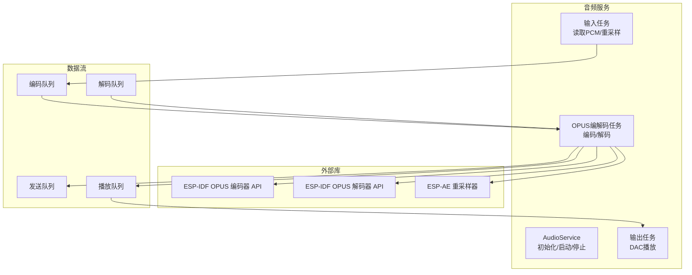
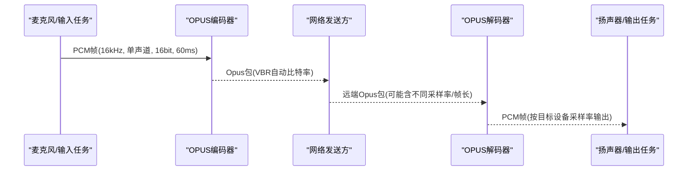
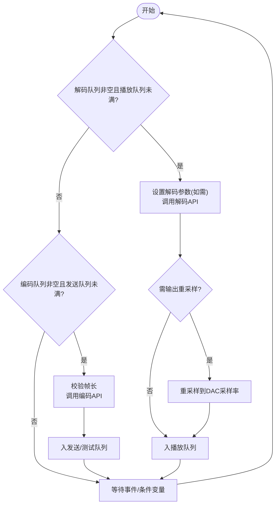
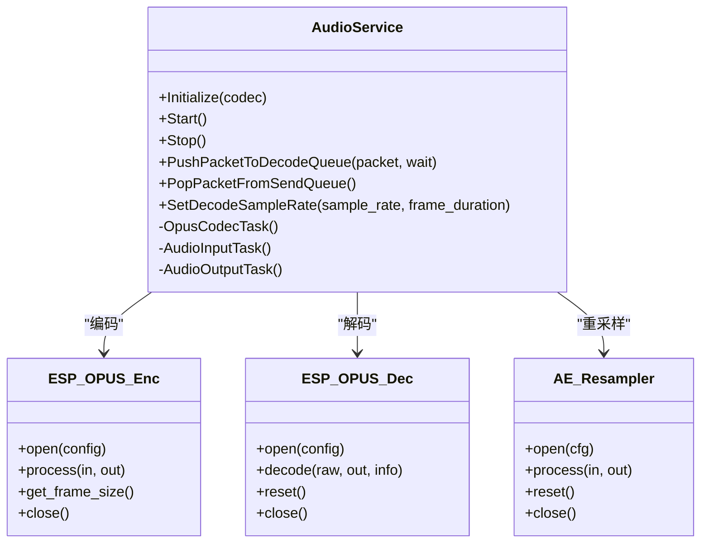

# OPUS编解码处理

<cite>
**本文引用的文件**   
- [audio_service.h](file://main/audio/audio_service.h)
- [audio_service.cc](file://main/audio/audio_service.cc)
- [ogg_demuxer.cc](file://main/audio/demuxer/ogg_demuxer.cc)
- [afe_wake_word.cc](file://main/audio/wake_words/afe_wake_word.cc)
- [custom_wake_word.cc](file://main/audio/wake_words/custom_wake_word.cc)
</cite>

## 目录
1. [简介](#简介)
2. [项目结构](#项目结构)
3. [核心组件](#核心组件)
4. [架构总览](#架构总览)
5. [详细组件分析](#详细组件分析)
6. [依赖关系分析](#依赖关系分析)
7. [性能与音质调优](#性能与音质调优)
8. [故障排查指南](#故障排查指南)
9. [结论](#结论)

## 简介
本技术文档聚焦小智AI聊天机器人在ESP-IDF平台上的OPUS编解码处理方案。内容涵盖：
- 编码器初始化参数配置（采样率、声道数、位深、帧长、比特率模式、VBR/DTX/FEC等）
- 解码器动态配置机制（自适应不同采样率与帧长度）
- 编解码状态管理、错误恢复与资源释放策略
- 编解码性能调优建议与音质评估方法

## 项目结构
本项目将音频采集、处理、编码、网络发送与播放路径解耦为多个任务与队列，OPUS编解码由独立任务统一调度，降低耦合并提升实时性。关键位置如下：
- 编解码配置宏与常量定义位于音频服务头文件
- 编解码主流程实现位于音频服务源文件
- OGG容器解析用于提取Opus包并获取采样率信息
- 唤醒词模块在特定路径下也使用OPUS编码器进行本地缓存

图表来源
- [audio_service.h:38-76](file://main/audio/audio_service.h#L38-L76)
- [audio_service.cc:62-84](file://main/audio/audio_service.cc#L62-L84)
- [audio_service.cc:327-446](file://main/audio/audio_service.cc#L327-L446)

章节来源
- [audio_service.h:38-76](file://main/audio/audio_service.h#L38-L76)
- [audio_service.cc:62-84](file://main/audio/audio_service.cc#L62-L84)

## 核心组件
- 编码器配置宏：集中定义采样率、声道、位深、帧时长、比特率模式、复杂度、FEC/DTX/VBR开关等
- 解码器配置宏：集中定义采样率、声道、帧时长、是否自分隔等
- 编解码任务：统一从队列取PCM或Opus包，调用ESP-IDF的OPUS API完成编解码
- 动态重采样：当输入/输出采样率与设备不一致时，通过ESP-AE重采样器进行转换
- 唤醒词路径：在唤醒词模块中复用OPUS编码器对语音片段进行本地缓存

章节来源
- [audio_service.h:55-76](file://main/audio/audio_service.h#L55-L76)
- [audio_service.cc:62-84](file://main/audio/audio_service.cc#L62-L84)
- [audio_service.cc:327-446](file://main/audio/audio_service.cc#L327-L446)

## 架构总览
整体采用“采集/处理 -> 编码 -> 发送”和“接收 -> 解码 -> 播放”的双通道流水线，OPUS编解码集中在一个任务内执行，避免跨任务共享复杂状态。

图表来源
- [audio_service.cc:327-446](file://main/audio/audio_service.cc#L327-L446)
- [audio_service.cc:448-482](file://main/audio/audio_service.cc#L448-L482)

## 详细组件分析

### 编码器初始化与参数配置
- 采样率：固定16kHz
- 声道：单声道
- 位深：16位
- 帧长度：默认60ms
- 比特率：自动比特率（自适应网络与内容）
- VBR：启用
- DTX：启用（静音段不发送）
- FEC：关闭（根据当前配置）
- 应用模式：语音/音乐通用（音频应用）

上述参数来源于编码器配置宏，并在初始化时创建编码器实例，随后查询每帧PCM样本数与最大输出缓冲大小，供后续编码循环使用。

章节来源
- [audio_service.h:65-76](file://main/audio/audio_service.h#L65-L76)
- [audio_service.cc:75-84](file://main/audio/audio_service.cc#L75-L84)

### 解码器动态配置机制
- 支持运行时切换采样率与帧长度
- 若检测到新流的采样率或帧长变化，则先关闭旧解码器，再按新参数重新打开
- 同时更新内部帧大小与输出重采样器（如需要）

该机制确保可兼容服务端下发的不同编码参数，提高鲁棒性。

章节来源
- [audio_service.cc:448-482](file://main/audio/audio_service.cc#L448-L482)

### 编解码主流程（任务级）
- 输入任务：以10ms粒度读取PCM，必要时重采样至16kHz，送入处理器/唤醒词；同时按60ms打包进入编码队列
- 编解码任务：
  - 解码分支：从解码队列取出Opus包，调用解码API得到PCM，必要时重采样到DAC采样率，入播放队列
  - 编码分支：从编码队列取出PCM帧，调用编码API得到Opus包，入发送队列或测试队列
- 输出任务：从播放队列取PCM写入DAC

图表来源
- [audio_service.cc:327-446](file://main/audio/audio_service.cc#L327-L446)
- [audio_service.cc:448-482](file://main/audio/audio_service.cc#L448-L482)

### 唤醒词路径中的OPUS编码
唤醒词模块在检测到语音片段后，同样使用OPUS编码器生成Opus包，便于后续传输或本地缓存。其编码流程与主路径一致，均基于相同的ESP-IDF OPUS API。

章节来源
- [afe_wake_word.cc:213-240](file://main/audio/wake_words/afe_wake_word.cc#L213-L240)
- [custom_wake_word.cc:264-288](file://main/audio/wake_words/custom_wake_word.cc#L264-L288)

### OGG容器解析与采样率探测
播放静态声音时，系统通过OGG Demuxer解析OpusHead/OpusTags，提取采样率等信息，以便正确配置解码器。

章节来源
- [ogg_demuxer.cc:224-273](file://main/audio/demuxer/ogg_demuxer.cc#L224-L273)

## 依赖关系分析
- 上层模块：音频服务（AudioService）
- 底层库：ESP-IDF OPUS 编解码API、ESP-AE 重采样器
- 数据载体：PCM向量、Opus字节数组、时间戳队列
- 同步原语：互斥锁、条件变量、事件组

图表来源
- [audio_service.h:105-193](file://main/audio/audio_service.h#L105-L193)
- [audio_service.cc:62-84](file://main/audio/audio_service.cc#L62-L84)
- [audio_service.cc:327-446](file://main/audio/audio_service.cc#L327-L446)

章节来源
- [audio_service.h:105-193](file://main/audio/audio_service.h#L105-L193)
- [audio_service.cc:62-84](file://main/audio/audio_service.cc#L62-L84)

## 性能与音质调优

### 编码器参数调优建议
- 帧长度
  - 60ms为默认值，适合一般通话场景，兼顾延迟与压缩效率
  - 若对端到端延迟敏感，可在协议允许范围内尝试更短帧（如20ms），但会增加CPU占用与开销
- 比特率与VBR
  - 自动比特率+VBR已开启，能根据内容复杂度与网络状况自适应
  - 若网络不稳定，可结合业务层限流策略，避免瞬时拥塞
- DTX
  - 已启用，可有效降低静音期带宽占用
- FEC
  - 当前未启用；在网络丢包较高时可考虑开启，但会牺牲一定码率与CPU

章节来源
- [audio_service.h:65-76](file://main/audio/audio_service.h#L65-L76)

### 解码器动态适配
- 支持运行时切换采样率与帧长，避免硬重启导致卡顿
- 若解码采样率与DAC不一致，自动插入重采样器，保证播放稳定

章节来源
- [audio_service.cc:448-482](file://main/audio/audio_service.cc#L448-L482)

### 内存与队列容量
- 编码/解码/播放队列长度与最大待发送包数量受常量控制，避免内存暴涨
- 建议保持默认值，除非有明确的低延迟或高吞吐需求

章节来源
- [audio_service.h:38-46](file://main/audio/audio_service.h#L38-L46)

### 音质评估方法
- 主观听感：在不同环境噪声与网络条件下进行A/B对比
- 客观指标：
  - 平均/峰值码率分布（统计发送队列包大小）
  - 丢包与乱序导致的失真比例（观察解码失败日志）
  - 端到端延迟（记录时间戳队列与播放时刻差）
- 工具建议：使用频谱分析与MOS评分工具进行离线评测

[本节为通用指导，无需源码引用]

## 故障排查指南

### 常见问题与定位
- 编码器未配置或帧长不匹配
  - 现象：编码失败日志提示帧长不符
  - 排查：确认输入PCM帧大小与编码器查询到的帧长一致
- 解码器未配置或参数变更
  - 现象：解码失败日志
  - 排查：检查SetDecodeSampleRate是否正确触发，以及解码器是否成功重建
- 重采样失败
  - 现象：重采样器创建失败
  - 排查：确认源/目标采样率与通道数合法，并重试创建
- 资源未释放
  - 现象：多次启停后内存增长
  - 排查：析构函数中是否关闭了编码器、解码器与重采样器

章节来源
- [audio_service.cc:44-60](file://main/audio/audio_service.cc#L44-L60)
- [audio_service.cc:384-391](file://main/audio/audio_service.cc#L384-L391)
- [audio_service.cc:434-440](file://main/audio/audio_service.cc#L434-L440)
- [audio_service.cc:458-482](file://main/audio/audio_service.cc#L458-L482)

### 错误恢复与状态重置
- 解码器重置：提供ResetDecoder接口，清空相关队列并重置解码器状态
- 动态重建：在SetDecodeSampleRate中先关闭旧解码器，再以新参数打开
- 幂等保护：仅在采样率或帧长变化时重建，避免不必要的抖动

章节来源
- [audio_service.cc:668-680](file://main/audio/audio_service.cc#L668-L680)
- [audio_service.cc:448-482](file://main/audio/audio_service.cc#L448-L482)

## 结论
小智AI聊天机器人的OPUS编解码方案在ESP-IDF平台上实现了稳定的双通道音频流水线：
- 编码器采用16kHz、单声道、16位、60ms帧长、自动比特率与VBR/DTX组合，兼顾质量与带宽
- 解码器具备动态参数适配能力，可无缝应对不同采样率与帧长的远端流
- 通过任务化与队列化设计，配合重采样器与完善的错误恢复/资源释放策略，提升了系统的鲁棒性与可维护性
- 建议在业务侧结合网络状况与延迟需求，进一步微调帧长与码率策略，并通过主客观评测持续优化体验