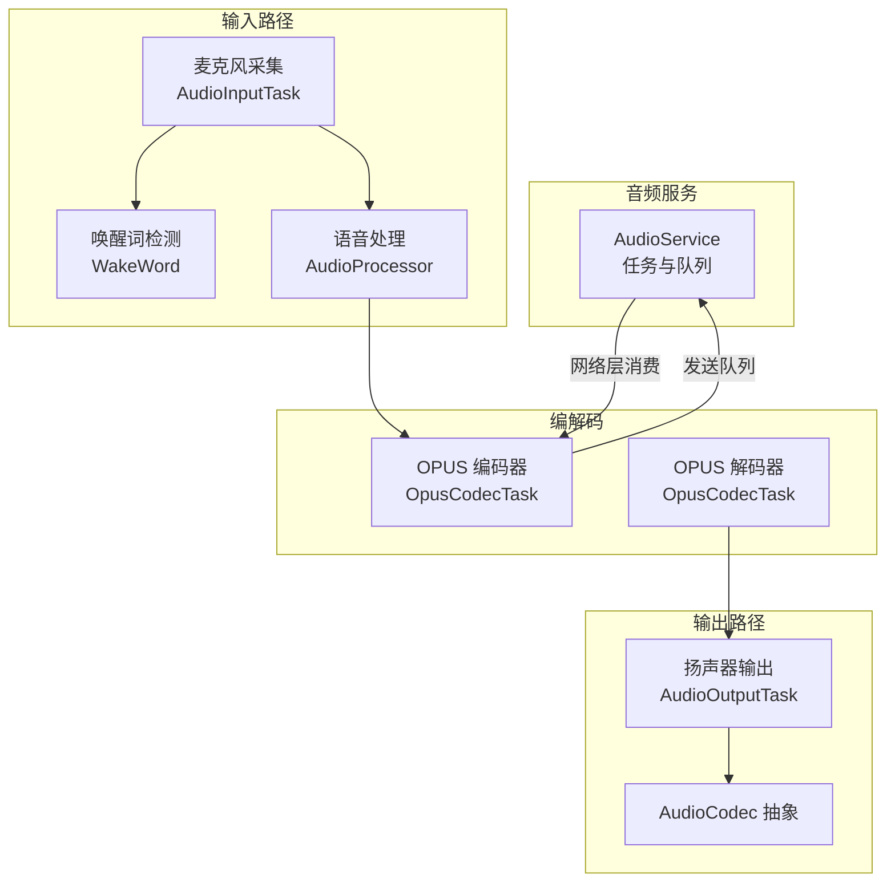
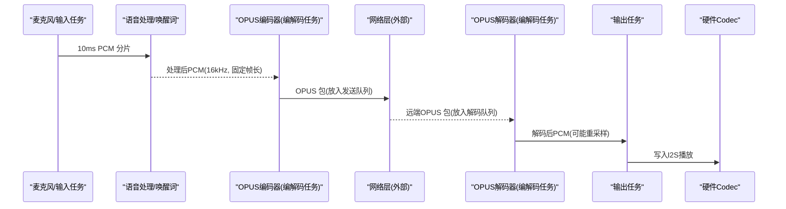
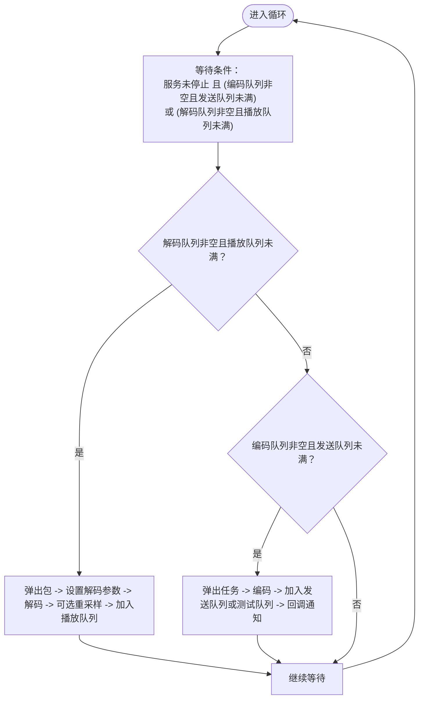
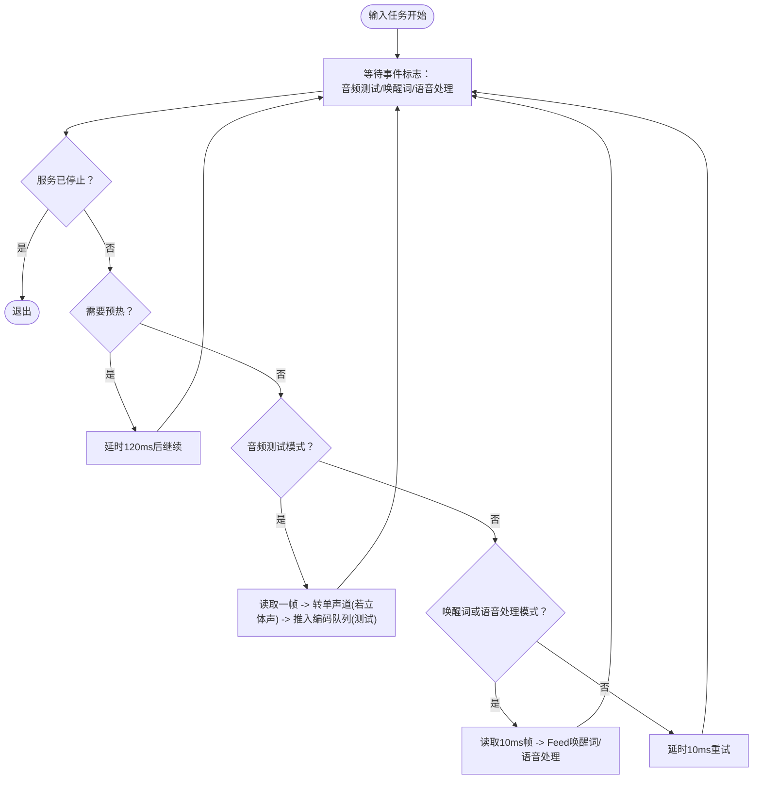
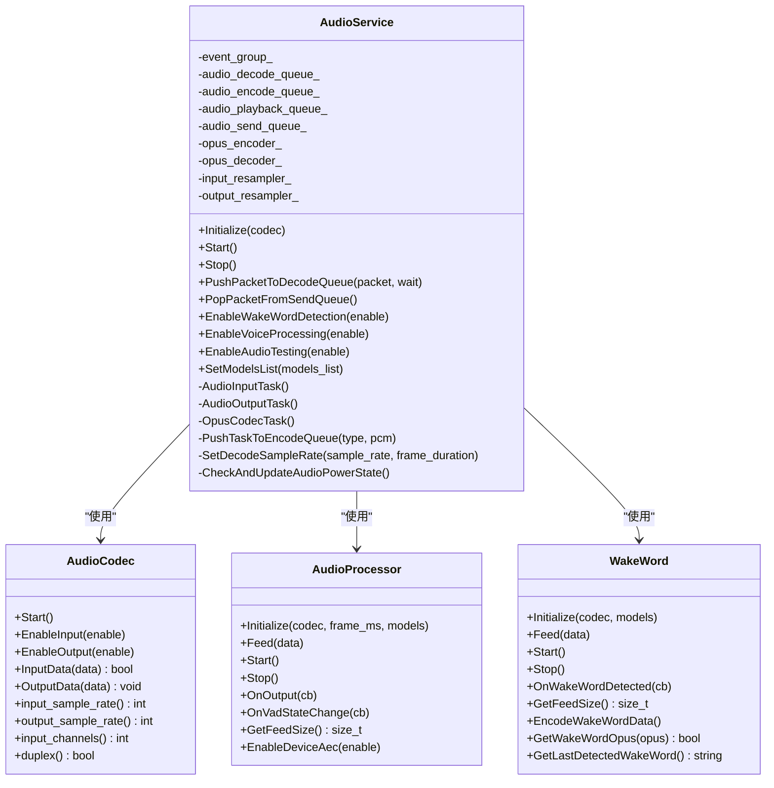
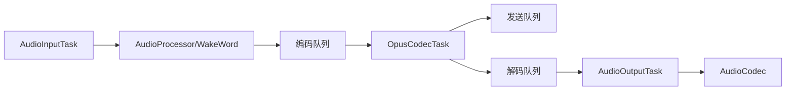

# 音频任务调度机制

<cite>
**本文引用的文件**   
- [audio_service.h](file://main/audio/audio_service.h)
- [audio_service.cc](file://main/audio/audio_service.cc)
- [audio_codec.h](file://main/audio/audio_codec.h)
- [audio_processor.h](file://main/audio/audio_processor.h)
- [wake_word.h](file://main/audio/wake_word.h)
</cite>

## 目录
1. [简介](#简介)
2. [项目结构](#项目结构)
3. [核心组件](#核心组件)
4. [架构总览](#架构总览)
5. [详细组件分析](#详细组件分析)
6. [依赖关系分析](#依赖关系分析)
7. [性能与监控](#性能与监控)
8. [故障排查指南](#故障排查指南)
9. [结论](#结论)

## 简介
本技术文档聚焦小智AI聊天机器人中的音频任务调度机制，深入解析 AudioService 中三个核心 FreeRTOS 任务的架构设计：
- AudioInputTask：负责麦克风数据采集、预处理（含唤醒词/语音处理分流）以及将数据推入编码队列。
- OpusCodecTask：统一负责 OPUS 编解码，包括从发送队列取 PCM 进行编码、从解码队列取 OPUS 包进行解码并送入播放队列。
- AudioOutputTask：负责从播放队列取出 PCM 帧并通过硬件 Codec 输出到扬声器。

文档将详细说明任务优先级设置、同步机制、数据传递方式、生命周期管理、异常处理与资源清理策略，并提供性能监控方法与调试技巧，包括 CPU 占用率分析与任务切换延迟测量等。

## 项目结构
围绕音频子系统的关键代码集中在 main/audio 目录下，其中 audio_service.{h,cc} 实现了三大任务与队列调度；audio_codec.h 定义了与硬件 I2S 交互的抽象接口；audio_processor.h 与 wake_word.h 分别定义语音处理与唤醒词模块的抽象接口。

图表来源
- [audio_service.cc:125-167](file://main/audio/audio_service.cc#L125-L167)
- [audio_service.cc:230-288](file://main/audio/audio_service.cc#L230-L288)
- [audio_service.cc:290-325](file://main/audio/audio_service.cc#L290-L325)
- [audio_service.cc:327-446](file://main/audio/audio_service.cc#L327-L446)
- [audio_codec.h:17-59](file://main/audio/audio_codec.h#L17-L59)

章节来源
- [audio_service.h:28-44](file://main/audio/audio_service.h#L28-L44)
- [audio_service.cc:125-167](file://main/audio/audio_service.cc#L125-L167)

## 核心组件
- AudioService：封装三大任务、多队列、事件组、定时器与回调，协调输入、编解码、输出全链路。
- AudioCodec：对底层 I2S 驱动与具体硬件编解码芯片的统一抽象，提供输入/输出能力与参数查询。
- AudioProcessor：可插拔的语音处理管线（如 AEC、降噪、VAD），通过回调向上层推送处理结果。
- WakeWord：可插拔的唤醒词检测模块，支持不同平台实现，提供唤醒事件与唤醒片段导出。

章节来源
- [audio_service.h:105-193](file://main/audio/audio_service.h#L105-L193)
- [audio_codec.h:17-59](file://main/audio/audio_codec.h#L17-L59)
- [audio_processor.h:11-24](file://main/audio/audio_processor.h#L11-L24)
- [wake_word.h:11-24](file://main/audio/wake_word.h#L11-L24)

## 架构总览
整体数据流分为两条主路径：
- 上行路径（采集→处理→编码→发送）：麦克风采样 → 可选唤醒词/语音处理 → 编码为 OPUS → 进入发送队列 → 由外部网络层消费。
- 下行路径（接收→解码→播放）：网络层投递 OPUS 包 → 解码为 PCM → 进入播放队列 → 由输出任务写入硬件。

图表来源
- [audio_service.cc:230-288](file://main/audio/audio_service.cc#L230-L288)
- [audio_service.cc:327-446](file://main/audio/audio_service.cc#L327-L446)
- [audio_service.cc:290-325](file://main/audio/audio_service.cc#L290-L325)

## 详细组件分析

### 任务与优先级
- AudioInputTask
  - 优先级：8（较高，确保实时采集与低时延）。
  - 绑定核心：在启用语音处理时，使用 xTaskCreatePinnedToCore 绑定至指定核心以降低抖动。
  - 职责：按事件标志位选择模式（测试/唤醒词/语音处理），读取音频数据，必要时降采样/单声道提取，并将任务推入编码队列。
- OpusCodecTask
  - 优先级：2（较低，避免抢占高优先级的输入/输出）。
  - 职责：统一执行编解码，维护编码队列、解码队列、发送队列、播放队列，并在需要时动态重建解码器与重采样器。
- AudioOutputTask
  - 优先级：4（中等，保证播放流畅度）。
  - 职责：从播放队列拉取 PCM 帧，按需开启输出通道，调用硬件输出，更新最后输出时间戳用于功耗管理。

章节来源
- [audio_service.cc:131-167](file://main/audio/audio_service.cc#L131-L167)
- [audio_service.cc:230-288](file://main/audio/audio_service.cc#L230-L288)
- [audio_service.cc:290-325](file://main/audio/audio_service.cc#L290-L325)
- [audio_service.cc:327-446](file://main/audio/audio_service.cc#L327-L446)

### 同步机制与数据传递
- 事件组（EventGroup）
  - 控制输入任务的工作模式：音频测试、唤醒词运行、语音处理运行。
  - 停止信号：Stop() 会置位所有运行标志，使各任务退出循环。
- 互斥量与条件变量
  - 全局互斥量 audio_queue_mutex_ 保护所有队列访问。
  - 条件变量 audio_queue_cv_ 协调任务间“有数据/有空位”的等待与唤醒。
  - 解码器专用互斥量 decoder_mutex_ 保护 opus_decoder_ 的动态重建。
- 队列与容量限制
  - 编码队列：最多容纳 2 个任务（MAX_ENCODE_TASKS_IN_QUEUE）。
  - 播放队列：最多容纳 2 个任务（MAX_PLAYBACK_TASKS_IN_QUEUE）。
  - 解码队列与发送队列：最大长度基于 2400ms 缓冲窗口计算（MAX_DECODE_PACKETS_IN_QUEUE / MAX_SEND_PACKETS_IN_QUEUE）。
  - 时间戳队列：最多保留 3 个时间戳（MAX_TIMESTAMPS_IN_QUEUE），用于服务器 AEC 对齐。
- 回调机制
  - on_send_queue_available：当发送队列有新包时通知上层网络线程消费。
  - on_wake_word_detected：唤醒词命中回调。
  - on_vad_change：VAD 状态变化回调。

章节来源
- [audio_service.h:50-54](file://main/audio/audio_service.h#L50-L54)
- [audio_service.h:98-103](file://main/audio/audio_service.h#L98-L103)
- [audio_service.h:161-176](file://main/audio/audio_service.h#L161-L176)
- [audio_service.cc:125-182](file://main/audio/audio_service.cc#L125-L182)
- [audio_service.cc:484-518](file://main/audio/audio_service.cc#L484-L518)
- [audio_service.cc:520-529](file://main/audio/audio_service.cc#L520-L529)

### 任务生命周期管理
- 启动流程
  - Initialize：初始化 Codec、OPUS 编解码器、输入/输出重采样器、语音处理器与唤醒词对象，创建周期性定时器用于功耗管理。
  - Start：根据配置创建三个任务，启动定时器，清理事件组标志。
- 停止流程
  - Stop：停止定时器，置位事件组标志，清空所有队列并广播条件变量，促使任务退出。
- 任务退出
  - 每个任务循环内检查 service_stopped_ 或事件标志，满足条件则跳出循环并打印日志。

章节来源
- [audio_service.cc:62-123](file://main/audio/audio_service.cc#L62-L123)
- [audio_service.cc:125-182](file://main/audio/audio_service.cc#L125-L182)
- [audio_service.cc:230-288](file://main/audio/audio_service.cc#L230-L288)
- [audio_service.cc:290-325](file://main/audio/audio_service.cc#L290-L325)
- [audio_service.cc:327-446](file://main/audio/audio_service.cc#L327-L446)

### 异常处理与资源清理
- 编解码器错误
  - 解码失败：记录错误码，保持队列一致性，继续处理后续包。
  - 编码失败：记录错误码，丢弃当前帧，继续处理。
- 动态重建解码器
  - SetDecodeSampleRate：当目标采样率或帧时长变化时，关闭旧解码器并重新打开，同时按需重建输出重采样器。
- 资源释放
  - 析构函数：删除事件组、关闭 OPUS 编解码器、关闭重采样器。
  - ResetDecoder：重置解码器状态，清空相关队列与时间戳队列，并广播条件变量。
- 功耗管理
  - CheckAndUpdateAudioPowerState：若长时间无输入/输出，自动关闭对应通道；双工模式下谨慎关闭 TX 时钟以避免 RX 卡死。

章节来源
- [audio_service.cc:448-482](file://main/audio/audio_service.cc#L448-L482)
- [audio_service.cc:44-60](file://main/audio/audio_service.cc#L44-L60)
- [audio_service.cc:668-680](file://main/audio/audio_service.cc#L668-L680)
- [audio_service.cc:682-698](file://main/audio/audio_service.cc#L682-L698)

### 关键流程图（算法与决策）

#### 编解码任务处理流程

图表来源
- [audio_service.cc:327-446](file://main/audio/audio_service.cc#L327-L446)

#### 输入任务工作模式选择

图表来源
- [audio_service.cc:230-288](file://main/audio/audio_service.cc#L230-L288)

### 类与关系图（代码级）

图表来源
- [audio_service.h:105-193](file://main/audio/audio_service.h#L105-L193)
- [audio_codec.h:17-59](file://main/audio/audio_codec.h#L17-L59)
- [audio_processor.h:11-24](file://main/audio/audio_processor.h#L11-L24)
- [wake_word.h:11-24](file://main/audio/wake_word.h#L11-L24)

## 依赖关系分析
- 任务耦合
  - AudioInputTask 与 AudioProcessor/WakeWord 解耦，通过事件标志位选择模式，降低耦合度。
  - OpusCodecTask 作为中央编解码节点，连接输入与输出两端，承担主要计算负载。
  - AudioOutputTask 仅关注播放队列与硬件输出，职责单一。
- 外部依赖
  - ESP-IDF FreeRTOS：任务、事件组、定时器。
  - ESP Audio 库：OPUS 编解码、重采样。
  - Board 抽象：获取 AudioCodec 实例。
- 潜在风险
  - 全局互斥量粒度较粗，在高并发场景下可能成为瓶颈；但考虑到音频帧率与队列长度较小，实际影响有限。
  - 动态重建解码器需持有 decoder_mutex_，避免与解码调用竞争。

图表来源
- [audio_service.cc:230-288](file://main/audio/audio_service.cc#L230-L288)
- [audio_service.cc:327-446](file://main/audio/audio_service.cc#L327-L446)
- [audio_service.cc:290-325](file://main/audio/audio_service.cc#L290-L325)

章节来源
- [audio_service.h:161-176](file://main/audio/audio_service.h#L161-L176)
- [audio_service.cc:484-518](file://main/audio/audio_service.cc#L484-L518)

## 性能与监控
- 任务优先级与核心绑定
  - 输入任务优先级最高（8），在启用语音处理时绑定核心，有助于降低采集抖动。
  - 输出任务优先级中等（4），保障播放连续性。
  - 编解码任务优先级最低（2），避免抢占 I/O 关键路径。
- 队列深度与时延
  - 编码/播放队列上限为 2，有效抑制突发导致的内存膨胀。
  - 解码/发送队列上限基于 2400ms 缓冲窗口，兼顾抗抖动与端到端时延。
- 统计指标
  - DebugStatistics 包含输入、解码、编码、播放计数，可用于粗略评估吞吐与丢包情况。
- 功耗与空闲检测
  - 周期性定时器检查最近输入/输出时间，超过阈值自动关闭通道，降低功耗。
- 监控方法建议
  - CPU 占用率分析：使用 ESP-IDF 的 task 统计 API（如 vTaskGetInfo、uxTaskGetSystemState）定期采样各任务 CPU 使用率，重点关注编解码任务。
  - 任务切换延迟测量：在输入任务读取前后与输出任务写入前后打点，结合 esp_timer_get_us 计算端到端时延分布；或在条件变量等待前后记录 tick 差值估算阻塞时延。
  - 队列深度监控：在回调或诊断接口中暴露各队列长度，观察是否频繁接近上限。
  - 重采样与编解码耗时：在关键路径插入高精度计时，评估是否需调整复杂度或帧长。

[本节为通用指导，不直接分析具体文件]

## 故障排查指南
- 常见问题定位
  - 无声或卡顿：检查播放队列是否为空、输出通道是否被自动关闭、重采样器是否成功创建。
  - 编码失败：确认输入帧大小是否符合编码器期望（encoder_frame_size_），检查编码器是否初始化成功。
  - 解码失败：查看错误码，确认解码器参数（采样率、帧时长）是否与网络侧一致。
  - 唤醒词无响应：确认唤醒词模式事件标志是否置位，输入任务是否正确 Feed 数据。
- 日志与断点
  - 关注日志标签 “AudioService”，在编解码失败、队列满、资源创建失败处均有明确日志。
  - 在条件变量等待与队列操作处设置断点，验证锁与通知逻辑。
- 恢复策略
  - 使用 ResetDecoder 重置解码器状态并清空相关队列。
  - 使用 EnableVoiceProcessing/EnableWakeWordDetection 切换模式，注意输入重采样器的 reset 以避免缓存污染。

章节来源
- [audio_service.cc:44-60](file://main/audio/audio_service.cc#L44-L60)
- [audio_service.cc:327-446](file://main/audio/audio_service.cc#L327-L446)
- [audio_service.cc:668-680](file://main/audio/audio_service.cc#L668-L680)
- [audio_service.cc:549-604](file://main/audio/audio_service.cc#L549-L604)

## 结论
该音频任务调度机制以清晰的职责划分与严格的同步控制，实现了稳定的采集-处理-编解码-播放流水线。通过事件组与条件变量的组合，任务间松耦合协作；通过队列容量限制与动态重建策略，系统具备较好的鲁棒性与可扩展性。配合合理的优先级与核心绑定，可在资源受限的 ESP32 平台上获得良好的实时性与能效表现。建议在工程实践中结合上述监控与诊断手段持续优化时延与稳定性。