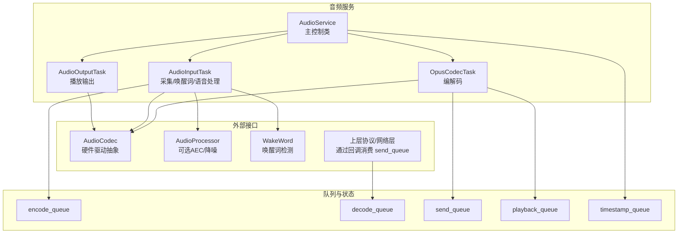
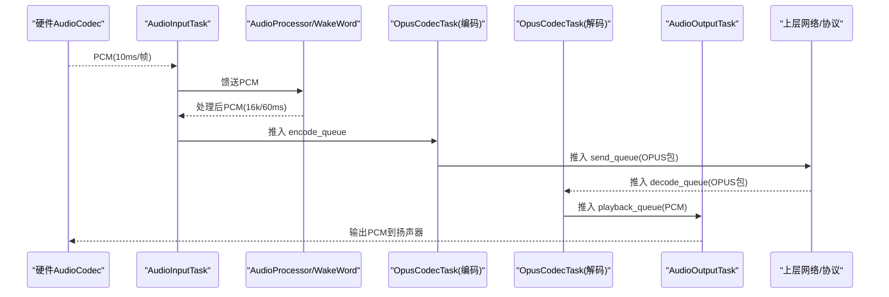
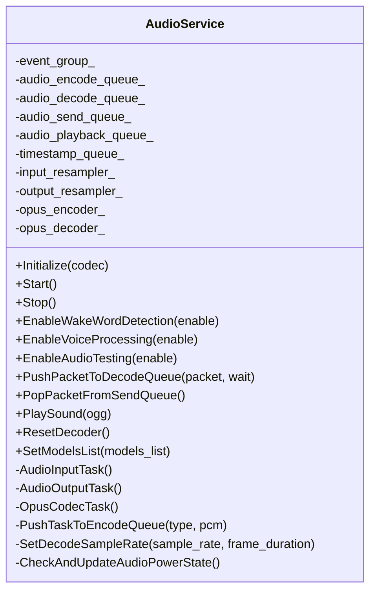
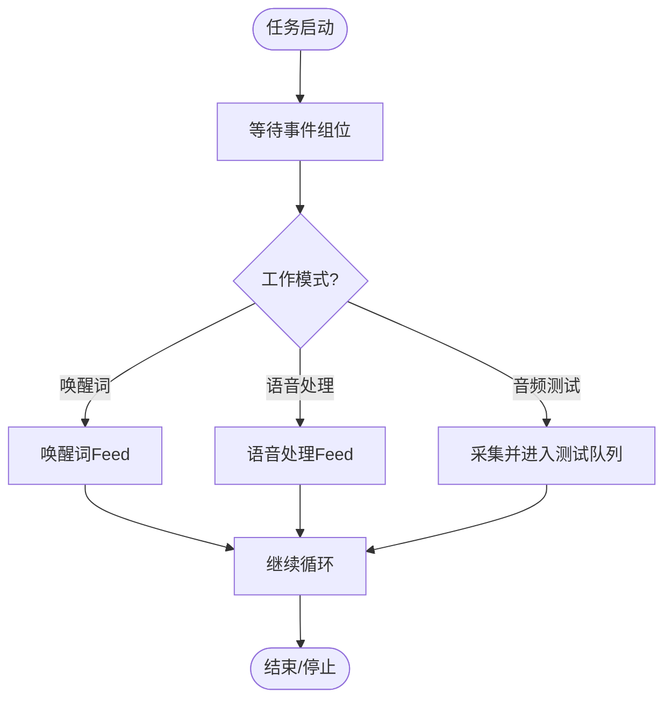
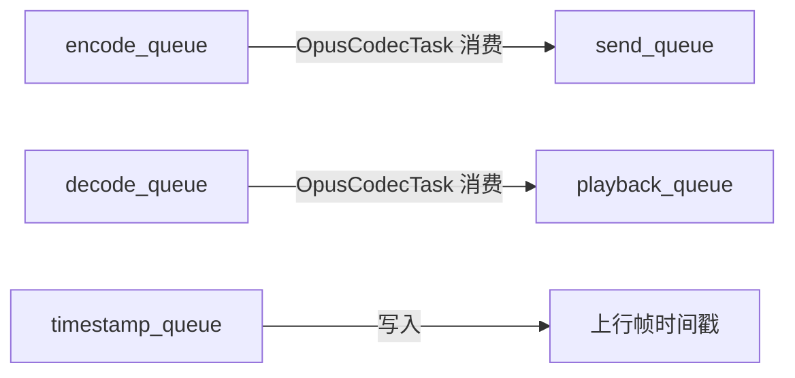
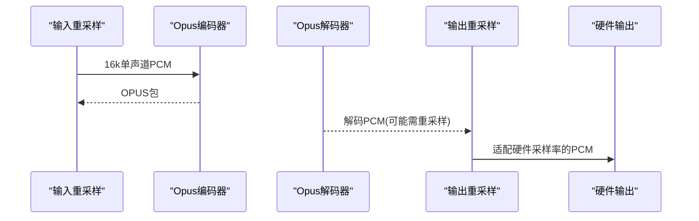
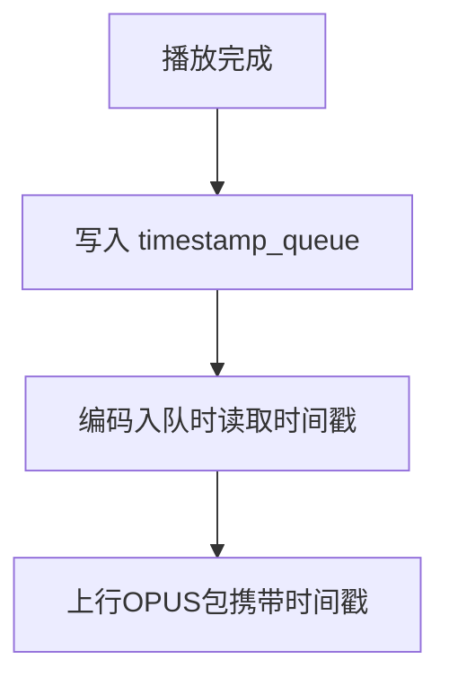
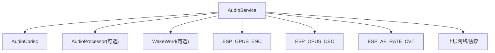

# 音频处理流水线

<cite>
**本文引用的文件**   
- [audio_service.h](file://main/audio/audio_service.h)
- [audio_service.cc](file://main/audio/audio_service.cc)
- [audio_debugger.h](file://main/audio/processors/audio_debugger.h)
- [audio_debugger.cc](file://main/audio/processors/audio_debugger.cc)
- [system_info.cc](file://main/system_info.cc)
</cite>

## 目录
1. [简介](#简介)
2. [项目结构](#项目结构)
3. [核心组件](#核心组件)
4. [架构总览](#架构总览)
5. [详细组件分析](#详细组件分析)
6. [依赖关系分析](#依赖关系分析)
7. [性能考量](#性能考量)
8. [故障排查指南](#故障排查指南)
9. [结论](#结论)
10. [附录](#附录)

## 简介
本技术文档聚焦小智AI聊天机器人设备端的音频处理流水线，围绕 AudioService 类的核心架构与实现进行深入解析。重点覆盖以下方面：
- 两条主要音频数据流路径：麦克风→处理器→编码器→服务器；服务器→解码器→扬声器
- FreeRTOS 多任务调度机制：AudioInputTask、AudioOutputTask、OpusCodecTask 的职责分工与数据传递方式
- 音频队列管理机制：encode_queue、playback_queue、decode_queue、send_queue 的缓冲策略与内存管理
- 关键算法与工程细节：音频重采样、格式转换、时间戳同步
- 性能监控与调试工具使用方法

## 项目结构
与音频处理流水线直接相关的核心代码位于 main/audio 目录，其中 audio_service.{h,cc} 实现了完整的采集、处理、编解码、播放与网络交互桥接逻辑；音频调试模块位于 processors/audio_debugger.{h,cc}；系统信息统计在 system_info.cc 中提供任务运行时间与堆栈等诊断能力。

图表来源
- [audio_service.h:28-37](file://main/audio/audio_service.h#L28-L37)
- [audio_service.cc:125-167](file://main/audio/audio_service.cc#L125-L167)
- [audio_service.cc:230-288](file://main/audio/audio_service.cc#L230-L288)
- [audio_service.cc:290-325](file://main/audio/audio_service.cc#L290-L325)
- [audio_service.cc:327-446](file://main/audio/audio_service.cc#L327-L446)

章节来源
- [audio_service.h:28-37](file://main/audio/audio_service.h#L28-L37)
- [audio_service.cc:125-167](file://main/audio/audio_service.cc#L125-L167)

## 核心组件
- AudioService：音频流水线的统一入口，负责初始化编解码器、重采样器、任务启动、事件组控制、队列管理与回调分发。
- AudioInputTask：周期性从硬件采集PCM，按模式喂给唤醒词或语音处理器，并将处理结果推入编码队列。
- OpusCodecTask：并发执行解码与编码，将解码后的PCM放入播放队列，将编码后的OPUS包放入发送队列。
- AudioOutputTask：从播放队列取出PCM并写入硬件扬声器，同时记录时间戳用于服务器AEC对齐。
- 队列与缓冲：encode_queue、decode_queue、send_queue、playback_queue 以及 timestamp_queue 共同构成低延迟、可控背压的数据通路。
- 重采样与格式转换：输入侧根据硬件采样率动态创建重采样器，输出侧在需要时将解码后PCM重采样到硬件输出采样率。
- 调试与统计：可选音频调试器UDP透传原始PCM；内部统计计数用于定位瓶颈。

章节来源
- [audio_service.h:105-195](file://main/audio/audio_service.h#L105-L195)
- [audio_service.cc:62-123](file://main/audio/audio_service.cc#L62-L123)
- [audio_service.cc:230-288](file://main/audio/audio_service.cc#L230-L288)
- [audio_service.cc:290-325](file://main/audio/audio_service.cc#L290-L325)
- [audio_service.cc:327-446](file://main/audio/audio_service.cc#L327-L446)

## 架构总览
整体采用“生产者-消费者”模型，结合条件变量与互斥锁实现线程安全的队列通信。FreeRTOS 事件组用于协调不同工作模式（唤醒词、语音处理、音频测试）的开关。

图表来源
- [audio_service.cc:230-288](file://main/audio/audio_service.cc#L230-L288)
- [audio_service.cc:327-446](file://main/audio/audio_service.cc#L327-L446)
- [audio_service.cc:290-325](file://main/audio/audio_service.cc#L290-L325)

## 详细组件分析

### AudioService 类设计
- 职责边界
  - 生命周期管理：Initialize/Start/Stop
  - 资源管理：Opus 编解码器、重采样器、定时器、事件组
  - 任务编排：创建并维护三个核心任务
  - 队列治理：统一的互斥锁与条件变量保护
  - 回调分发：VAD变化、唤醒词检测、发送队列可用通知
- 关键成员
  - 任务句柄：audio_input_task_handle_、audio_output_task_handle_、opus_codec_task_handle_
  - 队列：audio_encode_queue_、audio_decode_queue_、audio_send_queue_、audio_playback_queue_、timestamp_queue_
  - 状态：voice_detected_、service_stopped_、各采样率/帧长缓存
  - 回调：on_send_queue_available、on_wake_word_detected、on_vad_change、on_audio_testing_queue_full

图表来源
- [audio_service.h:105-195](file://main/audio/audio_service.h#L105-L195)
- [audio_service.cc:62-123](file://main/audio/audio_service.cc#L62-L123)

章节来源
- [audio_service.h:105-195](file://main/audio/audio_service.h#L105-L195)
- [audio_service.cc:62-123](file://main/audio/audio_service.cc#L62-L123)

### FreeRTOS 多任务调度与协作
- 任务划分
  - AudioInputTask：高优先级，负责采集与预处理，必要时进行通道选择与降采样至16k单声道，再喂给唤醒词或语音处理器。
  - OpusCodecTask：中等优先级，集中处理编解码，避免阻塞I/O路径。
  - AudioOutputTask：较低优先级，负责将PCM写入硬件，保证稳定播放。
- 同步机制
  - 事件组：AS_EVENT_AUDIO_TESTING_RUNNING、AS_EVENT_WAKE_WORD_RUNNING、AS_EVENT_AUDIO_PROCESSOR_RUNNING 控制输入任务的分支行为。
  - 条件变量+互斥锁：audio_queue_cv_ 与 audio_queue_mutex_ 保护所有队列访问，防止竞态。
- 任务间数据传递
  - 输入→编码：AudioInputTask 调用 PushTaskToEncodeQueue 将PCM任务推入 encode_queue。
  - 编码→发送：OpusCodecTask 完成编码后将 OPUS 包推入 send_queue，并通过回调通知上层取走。
  - 解码→播放：OpusCodecTask 完成解码后将 PCM 任务推入 playback_queue。
  - 播放→时间戳：AudioOutputTask 将已播放帧的时间戳回写 timestamp_queue，供后续上行帧携带以支持服务器AEC对齐。

图表来源
- [audio_service.cc:230-288](file://main/audio/audio_service.cc#L230-L288)

章节来源
- [audio_service.cc:125-167](file://main/audio/audio_service.cc#L125-L167)
- [audio_service.cc:230-288](file://main/audio/audio_service.cc#L230-L288)

### 队列与缓冲策略
- 队列定义与容量
  - encode_queue：最大容纳 MAX_ENCODE_TASKS_IN_QUEUE 个任务，用于削峰填谷，限制CPU占用。
  - decode_queue：最大容纳 MAX_DECODE_PACKETS_IN_QUEUE 个包，上限由 2400/OPUS_FRAME_DURATION_MS 决定，兼顾时延与吞吐。
  - send_queue：最大容纳 MAX_SEND_PACKETS_IN_QUEUE 个包，与 decode_queue 对称，便于网络层按需拉取。
  - playback_queue：最大容纳 MAX_PLAYBACK_TASKS_IN_QUEUE 个任务，确保播放平滑。
  - timestamp_queue：固定长度 MAX_TIMESTAMPS_IN_QUEUE，用于上行帧时间戳对齐。
- 背压与等待
  - 入队前检查容量，若满则阻塞等待或返回失败（如 PushPacketToDecodeQueue 的 wait 参数）。
  - 出队后立即通知条件变量，避免死锁与饥饿。
- 内存管理
  - 使用 std::deque 存储智能指针，减少拷贝开销。
  - 任务对象包含类型、PCM向量与时间戳，便于跨任务传递。

图表来源
- [audio_service.h:39-46](file://main/audio/audio_service.h#L39-L46)
- [audio_service.cc:484-518](file://main/audio/audio_service.cc#L484-L518)
- [audio_service.cc:520-529](file://main/audio/audio_service.cc#L520-L529)

章节来源
- [audio_service.h:39-46](file://main/audio/audio_service.h#L39-L46)
- [audio_service.cc:484-518](file://main/audio/audio_service.cc#L484-L518)
- [audio_service.cc:520-529](file://main/audio/audio_service.cc#L520-L529)

### 编解码与重采样流程
- 编码器配置
  - 固定采样率 16k、单声道、16bit，帧时长 60ms，启用 VBR/DTS，复杂度为最低，适合低功耗场景。
- 解码器配置
  - 动态根据网络包中的 sample_rate 与 frame_duration 重建解码器实例，确保兼容不同远端配置。
- 重采样
  - 输入侧：当硬件输入采样率非 16k 时，创建输入重采样器，将多通道PCM转换为 16k 单声道。
  - 输出侧：当解码后采样率与硬件输出不一致时，创建输出重采样器，将PCM重采样到硬件期望采样率。
- 时间戳同步
  - 下行播放完成后，将时间戳写入 timestamp_queue；上行编码时从该队列读取最新时间戳赋给对应包，用于服务器AEC对齐。

图表来源
- [audio_service.cc:62-123](file://main/audio/audio_service.cc#L62-L123)
- [audio_service.cc:327-446](file://main/audio/audio_service.cc#L327-L446)
- [audio_service.cc:448-482](file://main/audio/audio_service.cc#L448-L482)

章节来源
- [audio_service.cc:62-123](file://main/audio/audio_service.cc#L62-L123)
- [audio_service.cc:327-446](file://main/audio/audio_service.cc#L327-L446)
- [audio_service.cc:448-482](file://main/audio/audio_service.cc#L448-L482)

### 时间戳同步与服务器AEC
- 播放端记录时间戳：AudioOutputTask 在成功输出PCM后，将任务携带的 timestamp 写入 timestamp_queue。
- 编码端获取时间戳：PushTaskToEncodeQueue 在构造上行帧时，从 timestamp_queue 取出最近时间戳赋值给新任务，随后弹出。
- 限制与健壮性：timestamp_queue 有最大长度限制，超出会丢弃旧时间戳并告警，避免无限增长。

图表来源
- [audio_service.cc:290-325](file://main/audio/audio_service.cc#L290-L325)
- [audio_service.cc:484-504](file://main/audio/audio_service.cc#L484-L504)

章节来源
- [audio_service.cc:290-325](file://main/audio/audio_service.cc#L290-L325)
- [audio_service.cc:484-504](file://main/audio/audio_service.cc#L484-L504)

### 音频调试与性能监控
- 音频调试器
  - 可选编译开关 CONFIG_USE_AUDIO_DEBUGGER，开启后通过 UDP 将原始PCM发送到配置的远程地址，便于离线回放与频谱分析。
  - 在 ReadAudioData 中插入 Feed 调用，对每帧PCM进行透传。
- 系统信息
  - 打印任务列表、运行时间占比、空闲最小堆等，辅助评估任务调度与内存压力。
- 内部统计
  - DebugStatistics 记录输入、解码、编码、播放次数，可用于粗略评估链路健康度。

图表来源
- [audio_debugger.h:10-20](file://main/audio/processors/audio_debugger.h#L10-L20)
- [audio_debugger.cc:16-42](file://main/audio/processors/audio_debugger.cc#L16-L42)
- [audio_debugger.cc:54-66](file://main/audio/processors/audio_debugger.cc#L54-L66)
- [audio_service.cc:219-228](file://main/audio/audio_service.cc#L219-L228)
- [system_info.cc:144-154](file://main/system_info.cc#L144-L154)

章节来源
- [audio_debugger.h:10-20](file://main/audio/processors/audio_debugger.h#L10-L20)
- [audio_debugger.cc:16-42](file://main/audio/processors/audio_debugger.cc#L16-L42)
- [audio_debugger.cc:54-66](file://main/audio/processors/audio_debugger.cc#L54-L66)
- [audio_service.cc:219-228](file://main/audio/audio_service.cc#L219-L228)
- [system_info.cc:144-154](file://main/system_info.cc#L144-L154)

## 依赖关系分析
- 组件耦合
  - AudioService 强依赖 AudioCodec 抽象，屏蔽具体硬件差异。
  - 可选依赖 AudioProcessor 与 WakeWord，通过事件组切换工作模式。
  - 编解码与重采样均基于 ESP-IDF 音频库，封装于 AudioService 内部。
- 外部集成点
  - 网络层通过 PopPacketFromSendQueue 拉取编码包，或通过 PushPacketToDecodeQueue 推送解码包。
  - 上层可通过 SetCallbacks 订阅发送队列可用、唤醒词检测、VAD变化等事件。
- 潜在环路与风险
  - 队列之间通过条件变量解耦，无直接循环依赖。
  - 注意在 Stop/ResetDecoder 时清空队列并广播条件变量，避免任务长期阻塞。

图表来源
- [audio_service.h:10-26](file://main/audio/audio_service.h#L10-L26)
- [audio_service.cc:62-123](file://main/audio/audio_service.cc#L62-L123)

章节来源
- [audio_service.h:10-26](file://main/audio/audio_service.h#L10-L26)
- [audio_service.cc:62-123](file://main/audio/audio_service.cc#L62-L123)

## 性能考量
- 任务优先级与核心绑定
  - 输入任务在高优先级下运行，必要时绑定到特定核心以降低抖动。
  - 编解码任务独立运行，避免阻塞I/O路径。
- 队列深度与时延权衡
  - encode_queue 与 playback_queue 较小，降低端到端时延。
  - decode_queue 与 send_queue 较大，吸收网络抖动与突发流量。
- 重采样复杂度
  - 输入/输出重采样器仅在采样率不匹配时创建，避免不必要的计算。
- 功耗管理
  - 通过定时器检测长时间无输入/输出，自动关闭硬件端口，降低功耗。

[本节为通用指导，无需源码引用]

## 故障排查指南
- 常见问题定位
  - 编码失败：检查 encoder_frame_size_ 与输入PCM大小是否一致，确认编码器已正确初始化。
  - 解码失败：确认网络包的 sample_rate 与 frame_duration 与当前解码器配置一致，必要时触发 SetDecodeSampleRate。
  - 播放卡顿：检查 playback_queue 是否长期为空，确认解码任务正常产出。
  - 时间戳缺失：检查 timestamp_queue 是否为空，确认播放端已成功写入时间戳。
- 调试手段
  - 启用音频调试器，UDP 抓取原始PCM进行离线分析。
  - 打印任务列表与运行时间占比，识别热点任务。
  - 观察内部统计计数，判断链路是否出现瓶颈。
- 恢复策略
  - 调用 ResetDecoder 清理解码器状态与队列，重新建立播放路径。
  - 停止并重启相关任务，确保事件组与条件变量状态一致。

章节来源
- [audio_service.cc:327-446](file://main/audio/audio_service.cc#L327-L446)
- [audio_service.cc:448-482](file://main/audio/audio_service.cc#L448-L482)
- [audio_service.cc:668-680](file://main/audio/audio_service.cc#L668-L680)
- [audio_debugger.cc:54-66](file://main/audio/processors/audio_debugger.cc#L54-L66)
- [system_info.cc:144-154](file://main/system_info.cc#L144-L154)

## 结论
AudioService 通过清晰的任务划分、严格的队列治理与灵活的编解码/重采样策略，构建了低延迟、高鲁棒性的音频处理流水线。其设计充分考虑了嵌入式平台的资源约束与实时性要求，并通过事件组与回调机制提供了良好的扩展性与可观测性。配合音频调试器与系统信息工具，可在复杂场景中快速定位问题并进行优化。

[本节为总结性内容，无需源码引用]

## 附录
- 关键常量与默认值
  - OPUS_FRAME_DURATION_MS：60ms
  - MAX_ENCODE_TASKS_IN_QUEUE：2
  - MAX_PLAYBACK_TASKS_IN_QUEUE：2
  - MAX_DECODE_PACKETS_IN_QUEUE：2400 / OPUS_FRAME_DURATION_MS
  - MAX_SEND_PACKETS_IN_QUEUE：2400 / OPUS_FRAME_DURATION_MS
  - MAX_TIMESTAMPS_IN_QUEUE：3
- 事件标志
  - AS_EVENT_AUDIO_TESTING_RUNNING
  - AS_EVENT_WAKE_WORD_RUNNING
  - AS_EVENT_AUDIO_PROCESSOR_RUNNING
  - AS_EVENT_PLAYBACK_NOT_EMPTY

章节来源
- [audio_service.h:39-54](file://main/audio/audio_service.h#L39-L54)