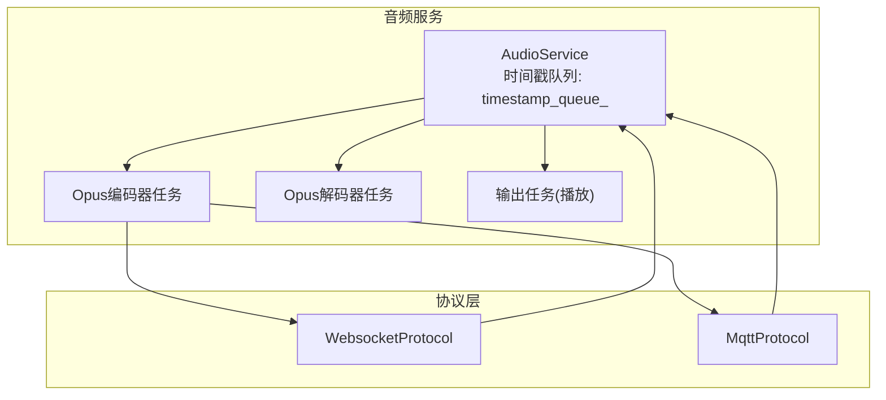
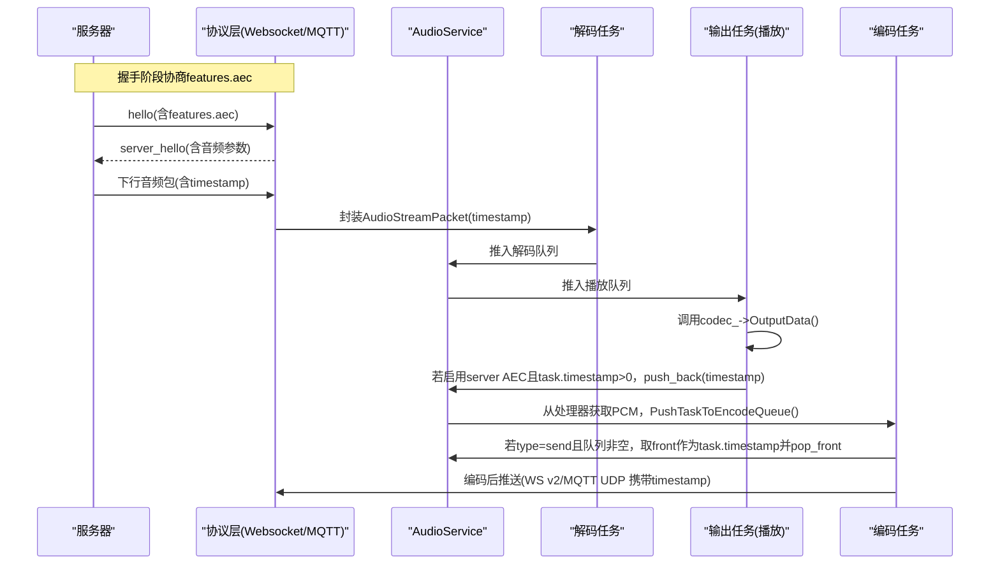
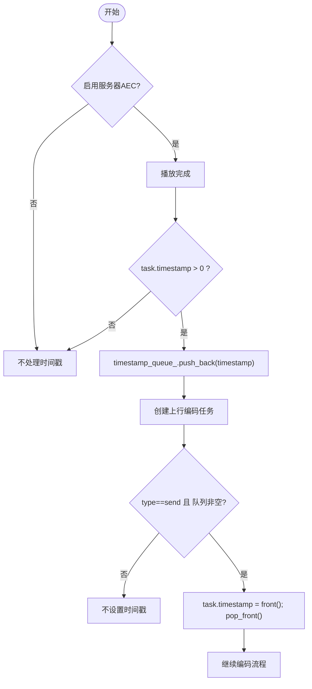
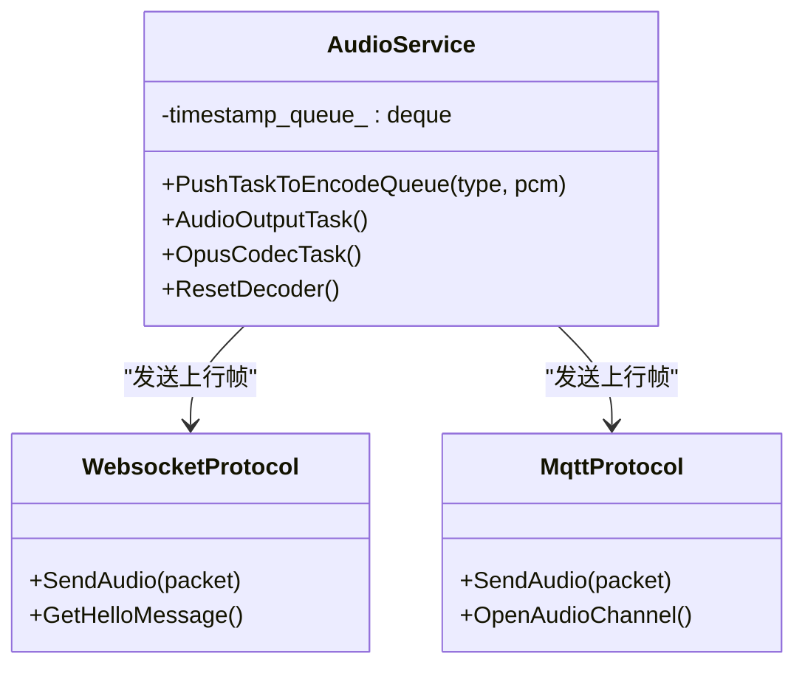

# 音频时间戳同步

<cite>
**本文引用的文件**   
- [audio_service.h](file://main/audio/audio_service.h)
- [audio_service.cc](file://main/audio/audio_service.cc)
- [websocket_protocol.cc](file://main/protocols/websocket_protocol.cc)
- [mqtt_protocol.cc](file://main/protocols/mqtt_protocol.cc)
- [application.cc](file://main/application.cc)
- [mqtt-udp.md](file://docs/mqtt-udp.md)
</cite>

## 目录
1. [简介](#简介)
2. [项目结构](#项目结构)
3. [核心组件](#核心组件)
4. [架构总览](#架构总览)
5. [详细组件分析](#详细组件分析)
6. [依赖关系分析](#依赖关系分析)
7. [性能与精度考量](#性能与精度考量)
8. [故障排查指南](#故障排查指南)
9. [结论](#结论)
10. [附录](#附录)

## 简介
本技术文档聚焦小智AI聊天机器人设备端“服务器端AEC（回声消除）”所需的音频时间戳同步机制。重点解析 timestamp_queue_ 的设计目的、实现原理，以及时间戳的生成策略、队列管理与同步算法；并给出时钟漂移补偿思路、延迟估计方法、同步精度控制手段，以及调试方法与性能监控指标建议。

## 项目结构
与时间戳同步直接相关的代码位于音频服务与协议层：
- 音频服务负责采集、编码、解码、播放，并在启用服务器AEC时维护时间戳队列，将播放时刻的时间戳回传给发送路径以绑定到上行帧。
- 协议层在握手阶段声明是否支持服务器AEC，并在二进制音频帧中携带或忽略时间戳字段。

图表来源
- [audio_service.h:105-195](file://main/audio/audio_service.h#L105-L195)
- [audio_service.cc:290-325](file://main/audio/audio_service.cc#L290-L325)
- [audio_service.cc:327-446](file://main/audio/audio_service.cc#L327-L446)
- [websocket_protocol.cc:28-58](file://main/protocols/websocket_protocol.cc#L28-L58)
- [mqtt_protocol.cc:166-190](file://main/protocols/mqtt_protocol.cc#L166-L190)

章节来源
- [audio_service.h:105-195](file://main/audio/audio_service.h#L105-L195)
- [audio_service.cc:290-325](file://main/audio/audio_service.cc#L290-L325)
- [websocket_protocol.cc:28-58](file://main/protocols/websocket_protocol.cc#L28-L58)
- [mqtt_protocol.cc:166-190](file://main/protocols/mqtt_protocol.cc#L166-L190)

## 核心组件
- 时间戳队列 timestamp_queue_
  - 类型：std::deque<uint32_t>
  - 作用：记录最近一次播放PCM的时间戳，供上行编码时取出并绑定到对应OPUS帧，用于服务器端AEC做时间对齐。
  - 容量限制：MAX_TIMESTAMPS_IN_QUEUE（默认3），防止积压导致时间戳过旧。
- 音频任务 AudioTask
  - 包含 type、pcm、timestamp 三个关键字段，其中 timestamp 用于承载与播放时刻关联的时间戳。
- 关键流程
  - 下行播放侧：解码得到PCM后进入播放队列，播放完成后若启用了服务器AEC，则将任务中的时间戳入队。
  - 上行编码侧：从处理器输出的PCM打包为编码任务时，若队列非空则取队首时间戳赋给任务，随后出队。

章节来源
- [audio_service.h:92-96](file://main/audio/audio_service.h#L92-L96)
- [audio_service.h:174-176](file://main/audio/audio_service.h#L174-L176)
- [audio_service.cc:315-321](file://main/audio/audio_service.cc#L315-L321)
- [audio_service.cc:484-504](file://main/audio/audio_service.cc#L484-L504)

## 架构总览
下图展示了时间戳在设备端的生成、传递与使用闭环，以及与协议层的交互。

图表来源
- [websocket_protocol.cc:203-226](file://main/protocols/websocket_protocol.cc#L203-L226)
- [websocket_protocol.cc:112-147](file://main/protocols/websocket_protocol.cc#L112-L147)
- [mqtt_protocol.cc:297-320](file://main/protocols/mqtt_protocol.cc#L297-L320)
- [mqtt_protocol.cc:243-287](file://main/protocols/mqtt_protocol.cc#L243-L287)
- [audio_service.cc:327-446](file://main/audio/audio_service.cc#L327-L446)
- [audio_service.cc:290-325](file://main/audio/audio_service.cc#L290-L325)
- [audio_service.cc:484-504](file://main/audio/audio_service.cc#L484-L504)

## 详细组件分析

### 时间戳队列 timestamp_queue_ 设计与实现
- 设计目的
  - 为服务器端AEC提供“参考信号”的时间锚点：设备端播放的PCM来自服务器下发的音频流，该流携带了服务器生成的时间戳。设备在播放完成后将该时间戳入队，以便后续上行编码时将同一时间戳绑定到麦克风采集的上行帧，从而让服务器能按时间对齐参考信号与远端语音。
- 数据结构与容量
  - 使用双端队列 std::deque<uint32_t>，最大长度由 MAX_TIMESTAMPS_IN_QUEUE 控制，避免时间戳过期或堆积。
- 写入时机
  - 仅在启用 CONFIG_USE_SERVER_AEC 时生效；当播放任务完成且 task->timestamp > 0 时入队。
- 读取时机
  - 在上行编码任务创建时，若类型为发送到服务器且队列非空，则取队首赋值给任务的 timestamp 字段并出队。
- 清理时机
  - 重置解码器时清空队列，确保会话切换或异常恢复后不会混用历史时间戳。

图表来源
- [audio_service.cc:315-321](file://main/audio/audio_service.cc#L315-L321)
- [audio_service.cc:484-504](file://main/audio/audio_service.cc#L484-L504)
- [audio_service.cc:668-680](file://main/audio/audio_service.cc#L668-L680)

章节来源
- [audio_service.h:174-176](file://main/audio/audio_service.h#L174-L176)
- [audio_service.cc:315-321](file://main/audio/audio_service.cc#L315-L321)
- [audio_service.cc:484-504](file://main/audio/audio_service.cc#L484-L504)
- [audio_service.cc:668-680](file://main/audio/audio_service.cc#L668-L680)

### 时间戳生成策略
- 下行方向（服务器→设备）
  - Websocket 版本2：二进制帧头包含 timestamp 字段，设备接收后原样透传到解码任务。
  - Websocket 版本3：二进制帧不包含 timestamp，设备侧置0。
  - MQTT+UDP：加密音频包头部包含 timestamp 字段，设备解密后透传。
- 上行方向（设备→服务器）
  - Websocket 版本2：发送时携带 timestamp。
  - Websocket 版本3：不携带 timestamp。
  - MQTT+UDP：发送时在加密头部写入 timestamp。
- 设备端绑定逻辑
  - 设备在播放完成后将收到的时间戳入队；上行编码时从队列取一个时间戳绑定到当前帧。

章节来源
- [websocket_protocol.cc:28-58](file://main/protocols/websocket_protocol.cc#L28-L58)
- [websocket_protocol.cc:112-147](file://main/protocols/websocket_protocol.cc#L112-L147)
- [mqtt_protocol.cc:166-190](file://main/protocols/mqtt_protocol.cc#L166-L190)
- [mqtt_protocol.cc:243-287](file://main/protocols/mqtt_protocol.cc#L243-L287)

### 队列管理与同步算法
- 生产者-消费者模型
  - 生产者：输出任务在播放完成后将时间戳入队。
  - 消费者：编码任务在打包上行帧时从队首取时间戳并出队。
- 边界条件与保护
  - 队列满：仅当 size <= MAX_TIMESTAMPS_IN_QUEUE 时才取用，否则丢弃时间戳并告警日志。
  - 并发安全：通过互斥量与条件变量保护队列访问。
  - 会话重置：ResetDecoder 会清空队列，避免跨会话污染。
- 同步精度要点
  - 时间戳绑定发生在“编码前”，而实际网络发送存在额外延迟；因此服务器端需考虑发送缓冲与网络抖动对对齐精度的影响。
  - 设备端未实现显式的时钟漂移补偿或动态延迟估计，属于“弱耦合”的时间戳透传方案。

章节来源
- [audio_service.cc:315-321](file://main/audio/audio_service.cc#L315-L321)
- [audio_service.cc:484-504](file://main/audio/audio_service.cc#L484-L504)
- [audio_service.cc:668-680](file://main/audio/audio_service.cc#L668-L680)

### 协议能力协商与时间戳可见性
- 设备在 hello 消息中通过 features.aec 表明是否支持服务器AEC。
- 不同协议/版本的二进制帧对 timestamp 的处理差异：
  - Websocket v2：携带 timestamp；v3：不携带。
  - MQTT+UDP：始终携带 timestamp。

章节来源
- [websocket_protocol.cc:203-226](file://main/protocols/websocket_protocol.cc#L203-L226)
- [mqtt_protocol.cc:297-320](file://main/protocols/mqtt_protocol.cc#L297-L320)

## 依赖关系分析
- 模块内聚与耦合
  - AudioService 内部高内聚：时间戳队列、编解码任务、播放任务在同一类中协作，降低外部耦合。
  - 与协议层低耦合：仅通过 packet->timestamp 字段进行数据交换，协议层只负责序列化/反序列化和能力协商。
- 外部依赖
  - 硬件编解码器：时间戳绑定与播放完成事件依赖于 OutputData 的时序。
  - 网络传输：MQTT/UDP 与 Websocket 的帧格式决定时间戳是否可被端到端传递。

图表来源
- [audio_service.h:105-195](file://main/audio/audio_service.h#L105-L195)
- [websocket_protocol.cc:28-58](file://main/protocols/websocket_protocol.cc#L28-L58)
- [mqtt_protocol.cc:166-190](file://main/protocols/mqtt_protocol.cc#L166-L190)

章节来源
- [audio_service.h:105-195](file://main/audio/audio_service.h#L105-L195)
- [websocket_protocol.cc:28-58](file://main/protocols/websocket_protocol.cc#L28-L58)
- [mqtt_protocol.cc:166-190](file://main/protocols/mqtt_protocol.cc#L166-L190)

## 性能与精度考量
- 队列容量与丢帧风险
  - MAX_TIMESTAMPS_IN_QUEUE 过小可能导致时间戳不足，使部分上行帧无时间戳绑定；过大可能引入陈旧时间戳，降低对齐精度。
- 编解码与重采样开销
  - 解码后可能触发重采样，增加处理时延，影响“播放完成”与“时间戳入队”之间的相对时序稳定性。
- 网络抖动与发送缓冲
  - 编码完成后还需等待网络发送，时间戳与实际到达服务器的时间存在偏差，需在服务器端结合序列号与时间戳做平滑估计。
- 时钟源一致性
  - 设备端未实现本地时钟与服务器时钟的对齐，时间戳来源于服务器，设备仅透传与复用，避免了设备时钟漂移问题，但要求服务器时间戳具备单调性与连续性。

[本节为通用性能讨论，不直接分析具体文件]

## 故障排查指南
- 常见问题定位
  - 时间戳缺失：检查是否启用了服务器AEC；确认下行帧版本是否携带 timestamp；确认 ResetDecoder 是否频繁触发导致队列清空。
  - 时间戳错配：检查队列容量配置与日志告警（队列满丢弃）；观察是否存在长时间无上行帧导致队列陈旧。
  - 协议不一致：确认设备与服务器的 hello/features 协商一致，尤其是 features.aec 与二进制帧版本。
- 日志与观测点
  - 队列满告警：查看“Timestamp queue is full, dropping timestamp”相关日志。
  - 解码/编码错误：关注解码失败与编码失败的错误码与上下文。
  - 网络通道状态：检查 OpenAudioChannel 成功与否、hello/server_hello 交互是否正常。
- 调试建议
  - 在设备端打印每帧的 timestamp 与队列长度变化，评估时间戳绑定成功率。
  - 在服务器端统计时间戳差值分布，评估对齐误差与抖动情况。

章节来源
- [audio_service.cc:495-497](file://main/audio/audio_service.cc#L495-L497)
- [audio_service.cc:668-680](file://main/audio/audio_service.cc#L668-L680)
- [websocket_protocol.cc:203-226](file://main/protocols/websocket_protocol.cc#L203-L226)
- [mqtt_protocol.cc:297-320](file://main/protocols/mqtt_protocol.cc#L297-L320)

## 结论
本项目采用“透传+弱绑定”的服务器端AEC时间戳同步方案：设备端不生成时间戳，而是复用服务器下发的时间戳，在播放完成后将其入队，并在上行编码时绑定到对应帧。该方案实现简洁、耦合度低，适合资源受限的设备端。为保证对齐精度，建议在服务器端结合序列号与时间戳进行延迟估计与漂移补偿，同时在设备端合理配置时间戳队列容量，避免陈旧或丢失导致的对齐误差。

[本节为总结性内容，不直接分析具体文件]

## 附录
- 相关常量与宏
  - OPUS_FRAME_DURATION_MS：固定帧时长（毫秒）。
  - MAX_TIMESTAMPS_IN_QUEUE：时间戳队列最大长度。
  - CONFIG_USE_SERVER_AEC：编译期开关，决定是否启用服务器AEC相关逻辑。
- 协议文档参考
  - MQTT+UDP 音频包格式与加密说明见文档。

章节来源
- [audio_service.h:39-46](file://main/audio/audio_service.h#L39-L46)
- [mqtt-udp.md:203-242](file://docs/mqtt-udp.md#L203-L242)