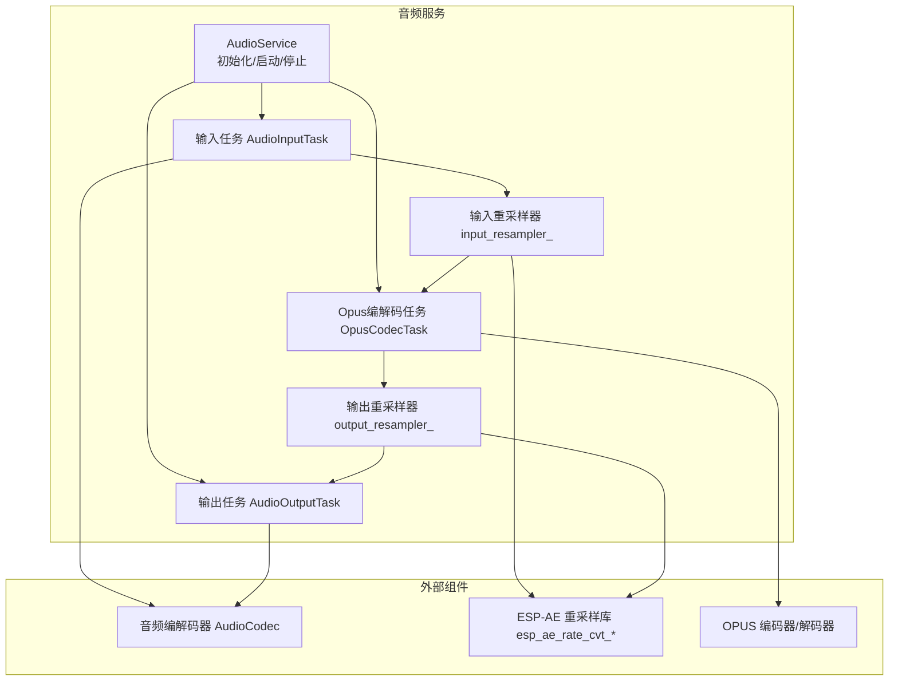
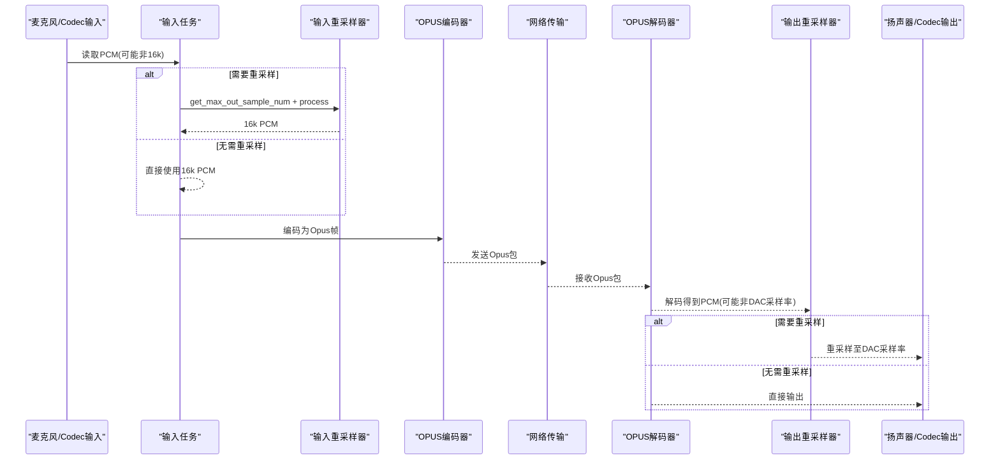
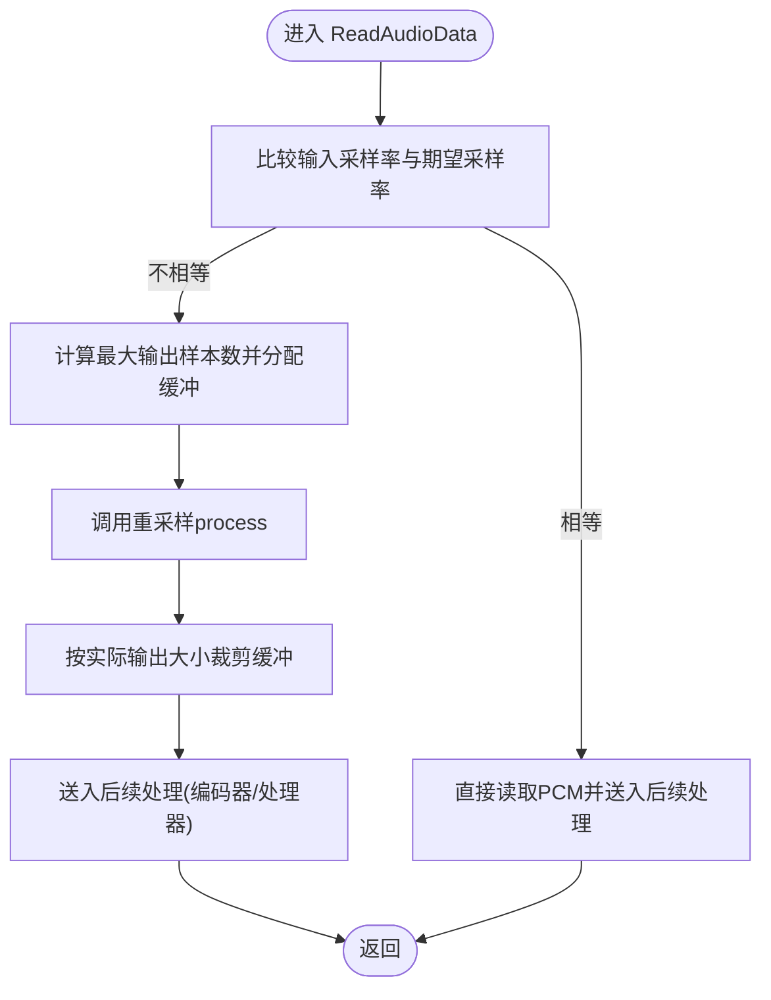
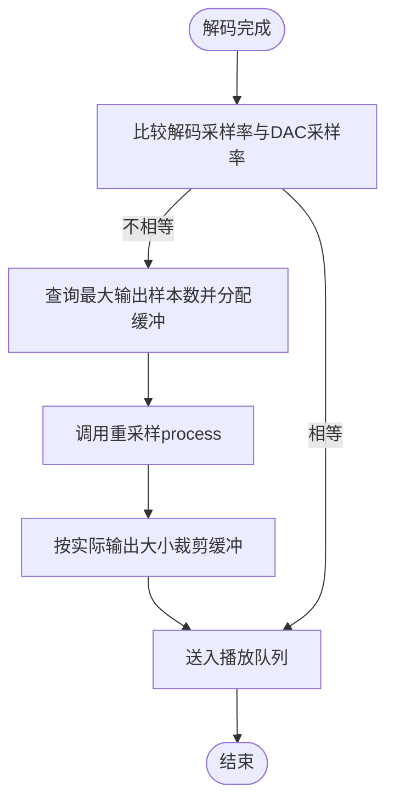
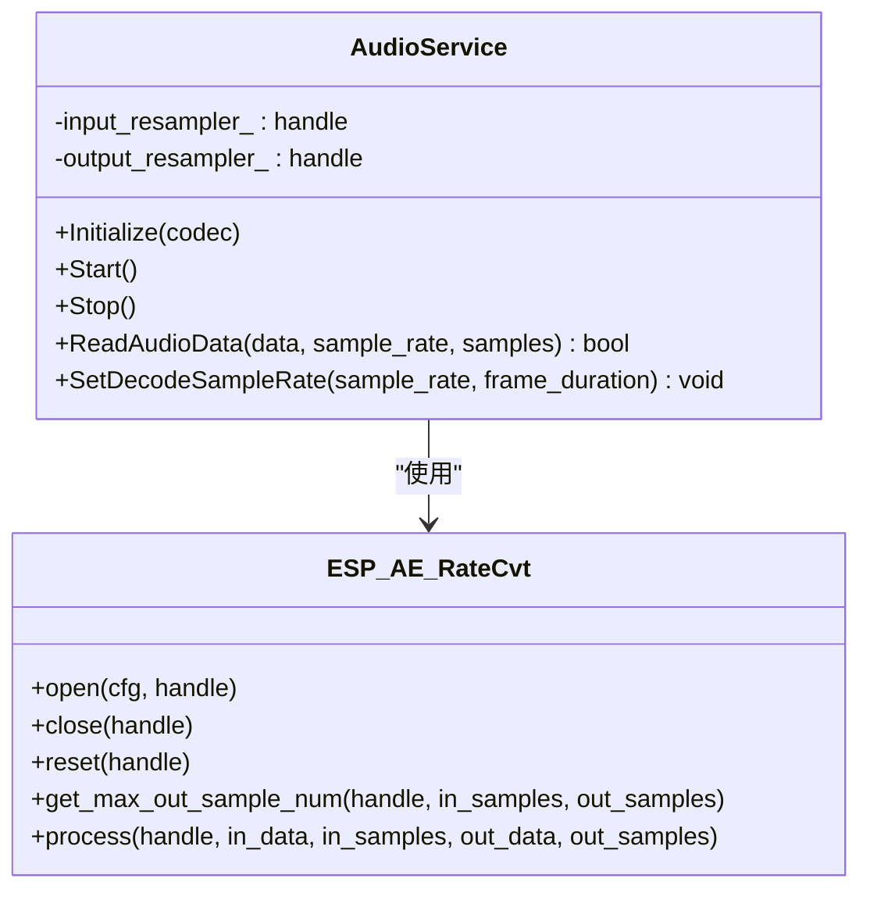

# 音频重采样处理

<cite>
**本文引用的文件列表**
- [audio_service.h](file://main/audio/audio_service.h)
- [audio_service.cc](file://main/audio/audio_service.cc)
</cite>

## 目录
1. [简介](#简介)
2. [项目结构](#项目结构)
3. [核心组件](#核心组件)
4. [架构总览](#架构总览)
5. [详细组件分析](#详细组件分析)
6. [依赖关系分析](#依赖关系分析)
7. [性能与延迟特性](#性能与延迟特性)
8. [重采样质量评估与最佳实践](#重采样质量评估与最佳实践)
9. [故障排查指南](#故障排查指南)
10. [结论](#结论)

## 简介
本技术文档聚焦小智AI聊天机器人中的音频重采样处理，重点阐述ESP-AE重采样库的集成方案，包括输入重采样器 input_resampler_ 与输出重采样器 output_resampler_ 的配置、使用流程、缓冲区管理、延迟控制与精度保证。同时提供不同采样率转换的质量设置与性能权衡建议，以及可操作的重采样质量评估方法与最佳实践。

## 项目结构
本项目将音频采集、编码、解码、播放与重采样整合在统一的音频服务中。重采样逻辑位于音频服务模块内，通过ESP-AE提供的速率转换API完成输入/输出路径的采样率适配。

图表来源
- [audio_service.h:105-195](file://main/audio/audio_service.h#L105-L195)
- [audio_service.cc:125-167](file://main/audio/audio_service.cc#L125-L167)

章节来源
- [audio_service.h:105-195](file://main/audio/audio_service.h#L105-L195)
- [audio_service.cc:125-167](file://main/audio/audio_service.cc#L125-L167)

## 核心组件
- 输入重采样器 input_resampler_：用于将硬件采集的非16kHz PCM数据转换为16kHz，以匹配语音识别/唤醒等下游模块的固定采样率需求。
- 输出重采样器 output_resampler_：用于将网络侧解码得到的PCM（可能为任意采样率）转换为硬件DAC所需的输出采样率。
- 配置宏 RATE_CVT_CFG：封装ESP-AE重采样器的创建参数，包含源/目标采样率、通道数、位深、复杂度与性能类型。
- 关键API：esp_ae_rate_cvt_open/close/reset/process/get_max_out_sample_num。

章节来源
- [audio_service.h:146-148](file://main/audio/audio_service.h#L146-L148)
- [audio_service.cc:5-14](file://main/audio/audio_service.cc#L5-L14)
- [audio_service.cc:86-93](file://main/audio/audio_service.cc#L86-L93)
- [audio_service.cc:468-482](file://main/audio/audio_service.cc#L468-L482)

## 架构总览
下图展示从麦克风采集到扬声器播放的全链路，并标注重采样发生的位置与触发条件。

图表来源
- [audio_service.cc:184-228](file://main/audio/audio_service.cc#L184-L228)
- [audio_service.cc:327-446](file://main/audio/audio_service.cc#L327-L446)
- [audio_service.cc:448-482](file://main/audio/audio_service.cc#L448-L482)

## 详细组件分析

### 输入重采样器 input_resampler_
- 触发条件：当硬件输入采样率不等于16kHz时创建并使用。
- 配置要点：
  - 源采样率：codec->input_sample_rate()
  - 目标采样率：16000Hz
  - 通道数：保持与输入一致
  - 位深：16bit
  - 复杂度：2
  - 性能类型：速度优先
- 运行时流程：
  - 计算最大输出样本数，分配缓冲
  - 调用process进行重采样
  - 根据实际输出长度裁剪缓冲
- 线程安全：使用互斥锁保护重置与处理过程，避免多任务并发访问导致状态不一致。
- 生命周期：
  - 初始化阶段按需创建
  - 模式切换（如唤醒词/语音处理）前执行reset，清空内部缓存，防止不同feed尺寸导致的溢出或错位
  - 析构时关闭释放

图表来源
- [audio_service.cc:184-228](file://main/audio/audio_service.cc#L184-L228)
- [audio_service.cc:563-570](file://main/audio/audio_service.cc#L563-L570)
- [audio_service.cc:590-597](file://main/audio/audio_service.cc#L590-L597)

章节来源
- [audio_service.cc:86-93](file://main/audio/audio_service.cc#L86-L93)
- [audio_service.cc:195-207](file://main/audio/audio_service.cc#L195-L207)
- [audio_service.cc:563-570](file://main/audio/audio_service.cc#L563-L570)
- [audio_service.cc:590-597](file://main/audio/audio_service.cc#L590-L597)

### 输出重采样器 output_resampler_
- 触发条件：当解码器输出采样率与硬件输出采样率不一致时创建或使用。
- 配置要点：
  - 源采样率：当前解码器采样率
  - 目标采样率：codec->output_sample_rate()
  - 通道数：单声道
  - 位深：16bit
  - 复杂度：2
  - 性能类型：速度优先
- 运行时流程：
  - 在解码完成后，若需重采样则先查询最大输出样本数并分配缓冲
  - 调用process完成重采样，再按实际输出大小裁剪
- 动态重建：当解码采样率或帧时长变化时，会重建解码器并重新配置输出重采样器。

图表来源
- [audio_service.cc:368-380](file://main/audio/audio_service.cc#L368-L380)
- [audio_service.cc:448-482](file://main/audio/audio_service.cc#L448-L482)

章节来源
- [audio_service.cc:368-380](file://main/audio/audio_service.cc#L368-L380)
- [audio_service.cc:448-482](file://main/audio/audio_service.cc#L448-L482)

### 重采样配置宏 RATE_CVT_CFG
- 作用：统一封装ESP-AE重采样器配置项，确保输入/输出路径一致性。
- 关键字段：
  - src_rate/dest_rate：源/目标采样率
  - channel：通道数
  - bits_per_sample：位深（16bit）
  - complexity：复杂度（2）
  - perf_type：性能类型（速度优先）

章节来源
- [audio_service.cc:5-14](file://main/audio/audio_service.cc#L5-L14)

## 依赖关系分析
- 头文件依赖：
  - audio_service.h 引入 ESP-AE 重采样接口与音频类型定义
- 运行时依赖：
  - 输入路径：AudioInputTask -> input_resampler_ -> Opus编码器
  - 输出路径：Opus解码器 -> output_resampler_ -> AudioOutputTask
- 资源管理：
  - 构造/析构：打开/关闭重采样器
  - 模式切换：重置重采样器内部状态，避免跨模式缓存污染

图表来源
- [audio_service.h:105-195](file://main/audio/audio_service.h#L105-L195)
- [audio_service.cc:44-60](file://main/audio/audio_service.cc#L44-L60)
- [audio_service.cc:86-93](file://main/audio/audio_service.cc#L86-L93)
- [audio_service.cc:468-482](file://main/audio/audio_service.cc#L468-L482)

章节来源
- [audio_service.h:105-195](file://main/audio/audio_service.h#L105-L195)
- [audio_service.cc:44-60](file://main/audio/audio_service.cc#L44-L60)

## 性能与延迟特性
- 性能类型：速度优先（ESP_AE_RATE_CVT_PERF_TYPE_SPEED），适合实时语音场景，降低CPU占用与端到端延迟。
- 复杂度：设置为2，在速度与音质之间取得平衡；如需更高音质可适当提高复杂度，但会增加CPU消耗与潜在延迟。
- 缓冲区管理：
  - 输入路径：每次读取后按最大输出样本数预分配缓冲，避免运行时扩容开销；按实际输出裁剪，减少内存浪费。
  - 输出路径：解码后再按需重采样，避免不必要的重采样开销。
- 延迟控制：
  - 输入任务每10ms读取一次，结合60ms OPUS帧长，整体端到端延迟受网络与编解码影响；重采样本身引入的额外延迟较小。
  - 模式切换时重置输入重采样器，避免跨模式缓存导致的抖动或溢出。
- 精度保证：
  - 使用16bit PCM，符合语音通信常用精度；重采样算法由ESP-AE实现，满足一般语音清晰度要求。

章节来源
- [audio_service.cc:5-14](file://main/audio/audio_service.cc#L5-L14)
- [audio_service.cc:184-228](file://main/audio/audio_service.cc#L184-L228)
- [audio_service.cc:327-446](file://main/audio/audio_service.cc#L327-L446)
- [audio_service.cc:563-570](file://main/audio/audio_service.cc#L563-L570)
- [audio_service.cc:590-597](file://main/audio/audio_service.cc#L590-L597)

## 重采样质量评估与最佳实践

### 质量评估方法
- 主观听感测试：
  - 在不同采样率组合下（如48k→16k、44.1k→16k、16k→48k）进行对话与音乐片段回放，评估清晰度与失真。
- 客观指标（可选）：
  - 频谱对比：观察高频衰减与混叠情况
  - 信噪比/THD：在稳态信号下测量
  - 延迟统计：记录重采样前后时间戳差异，评估端到端延迟波动

### 采样率选择策略
- 输入路径：
  - 若硬件支持16kHz，尽量直接以16kHz采集，避免重采样带来的额外开销与潜在失真。
  - 若硬件仅支持其他采样率（如48kHz/44.1kHz），启用输入重采样器将其降至16kHz，以满足语音识别/唤醒模型需求。
- 输出路径：
  - 若网络侧解码采样率与DAC一致，跳过重采样以减少延迟与CPU占用。
  - 若不匹配，启用输出重采样器，确保播放流畅无卡顿。

### 质量与性能的平衡
- 复杂度调整：
  - 默认复杂度2适用于大多数语音场景；对音质敏感时可尝试提升复杂度，但需评估CPU与功耗。
- 性能类型：
  - 速度优先适合低延迟交互；若追求更高音质，可在允许范围内考虑质量优先类型（需确认ESP-AE是否支持）。
- 通道数：
  - 输入路径保持与硬件一致；输出路径通常为单声道，减少带宽与计算量。

### 最佳实践建议
- 仅在必要时启用重采样，避免冗余处理。
- 模式切换（唤醒词/语音处理）前务必重置输入重采样器，避免缓存污染。
- 合理设置OPUS帧长与比特率，平衡音质与带宽。
- 监控输入/输出空闲状态，及时关闭Codec以降低功耗。

[本节为通用指导，不直接分析具体文件]

## 故障排查指南
- 重采样器创建失败：
  - 检查RATE_CVT_CFG参数是否正确（源/目标采样率、通道数、位深）
  - 查看日志错误码，确认ESP-AE库可用
- 重采样输出异常：
  - 确认get_max_out_sample_num返回值与实际输出大小一致
  - 检查process调用前后缓冲指针与长度是否正确
- 模式切换问题：
  - 确保在切换前调用reset，清理内部状态
- 资源泄漏：
  - 析构时确保关闭所有重采样器与编解码器

章节来源
- [audio_service.cc:86-93](file://main/audio/audio_service.cc#L86-L93)
- [audio_service.cc:195-207](file://main/audio/audio_service.cc#L195-L207)
- [audio_service.cc:368-380](file://main/audio/audio_service.cc#L368-L380)
- [audio_service.cc:563-570](file://main/audio/audio_service.cc#L563-L570)
- [audio_service.cc:590-597](file://main/audio/audio_service.cc#L590-L597)
- [audio_service.cc:44-60](file://main/audio/audio_service.cc#L44-L60)

## 结论
本方案通过在输入与输出路径分别集成ESP-AE重采样器，实现了灵活的采样率适配，兼顾了实时性与资源占用。输入重采样器确保语音处理模块稳定消费16kHz数据，输出重采样器保障播放设备正确驱动。通过合理的复杂度与性能类型配置、严格的缓冲区管理与模式切换时的状态重置，系统在质量与性能之间取得了良好平衡。建议在产品化过程中结合实际硬件与网络环境，持续优化采样率策略与重采样参数，以获得更佳的交互体验。