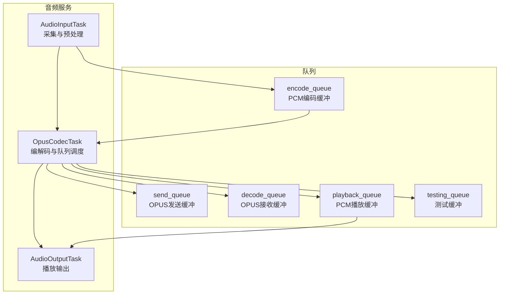
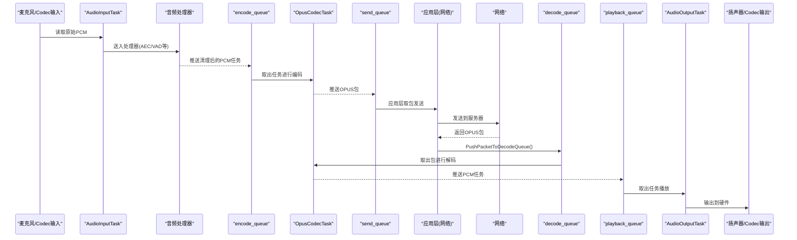
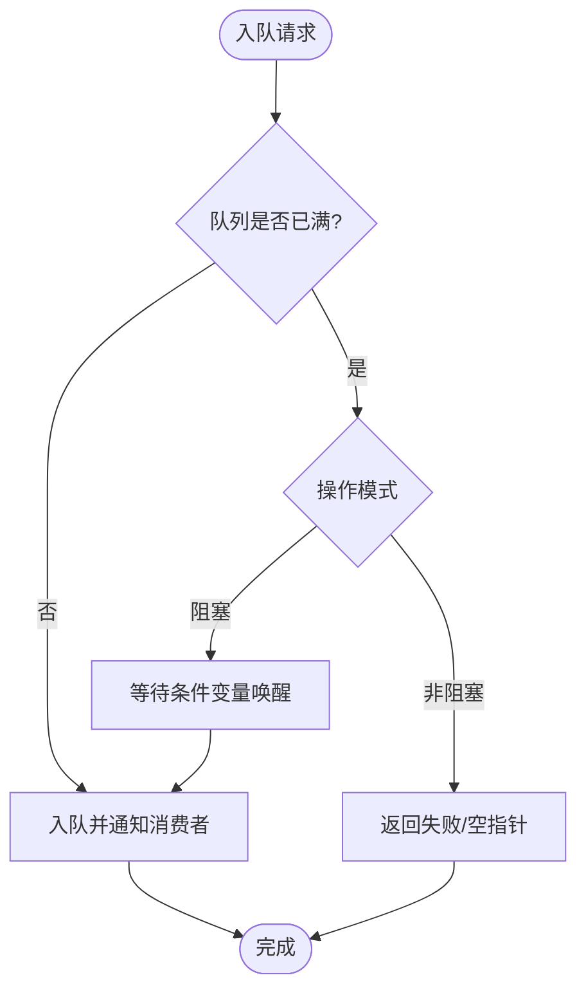
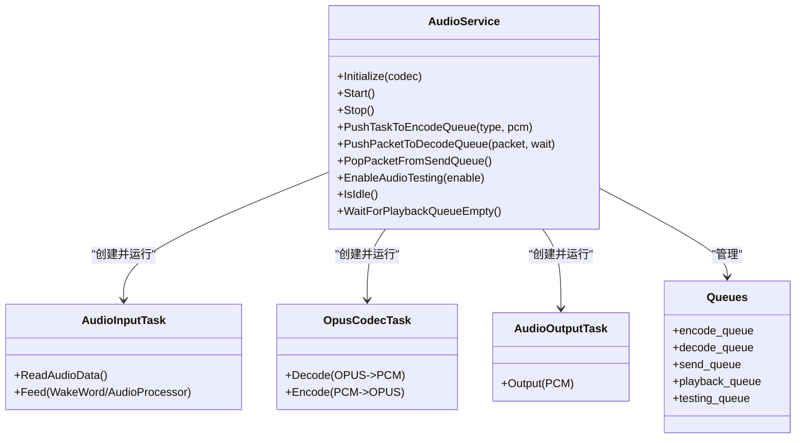

# 音频队列管理机制

<cite>
**本文引用的文件**   
- [audio_service.h](file://main/audio/audio_service.h)
- [audio_service.cc](file://main/audio/audio_service.cc)
- [README.md](file://main/audio/README.md)
</cite>

## 目录
1. [引言](#引言)
2. [项目结构](#项目结构)
3. [核心组件](#核心组件)
4. [架构总览](#架构总览)
5. [详细组件分析](#详细组件分析)
6. [依赖关系分析](#依赖关系分析)
7. [性能与内存特性](#性能与内存特性)
8. [故障排查指南](#故障排查指南)
9. [结论](#结论)
10. [附录](#附录)

## 引言
本技术文档聚焦小智AI聊天机器人中的音频队列管理系统，围绕五个核心队列的设计与实现展开：encode_queue（编码缓冲）、playback_queue（播放缓冲）、decode_queue（网络OPUS接收缓冲）、send_queue（发送缓冲）以及testing_queue（测试缓冲）。文档将系统阐述各队列的容量配置、内存分配策略、阻塞与非阻塞操作模式、溢出处理与背压机制、性能优化策略，并给出状态监控与调试工具的使用方法。

## 项目结构
音频服务位于 main/audio 目录下，核心类为 AudioService，负责初始化编解码器、启动任务、管理五类队列以及协调输入/输出流程。其线程模型由三个主要任务组成：AudioInputTask、OpusCodecTask、AudioOutputTask，分别负责采集与预处理、编解码与队列调度、播放输出。

图表来源
- [audio_service.cc:125-167](file://main/audio/audio_service.cc#L125-L167)
- [audio_service.h:163-175](file://main/audio/audio_service.h#L163-L175)

章节来源
- [README.md:1-88](file://main/audio/README.md#L1-L88)
- [audio_service.h:105-193](file://main/audio/audio_service.h#L105-L193)
- [audio_service.cc:125-167](file://main/audio/audio_service.cc#L125-L167)

## 核心组件
- 队列定义与容量常量
  - encode_queue：存储待编码的PCM任务，容量上限 MAX_ENCODE_TASKS_IN_QUEUE
  - playback_queue：存储已解码的PCM任务，容量上限 MAX_PLAYBACK_TASKS_IN_QUEUE
  - decode_queue：存储从网络收到的OPUS包，容量上限 MAX_DECODE_PACKETS_IN_QUEUE
  - send_queue：存储已编码的OPUS包，容量上限 MAX_SEND_PACKETS_IN_QUEUE
  - testing_queue：用于音频测试路径的OPUS包缓冲，长度受 AUDIO_TESTING_MAX_DURATION_MS 限制
- 关键常量
  - OPUS_FRAME_DURATION_MS：帧时长（毫秒）
  - MAX_ENCODE_TASKS_IN_QUEUE、MAX_PLAYBACK_TASKS_IN_QUEUE：任务级缓冲大小
  - MAX_DECODE_PACKETS_IN_QUEUE、MAX_SEND_PACKETS_IN_QUEUE：基于2400ms滑动窗口计算的包数量上限
  - AUDIO_TESTING_MAX_DURATION_MS：测试路径最大持续时间
  - MAX_TIMESTAMPS_IN_QUEUE：服务器AEC时间戳缓存上限

章节来源
- [audio_service.h:39-48](file://main/audio/audio_service.h#L39-L48)
- [audio_service.h:163-175](file://main/audio/audio_service.h#L163-L175)

## 架构总览
音频数据流分为上行（麦克风→编码→发送）和下行（接收→解码→播放），同时提供测试路径。

图表来源
- [audio_service.cc:230-288](file://main/audio/audio_service.cc#L230-L288)
- [audio_service.cc:327-446](file://main/audio/audio_service.cc#L327-L446)
- [audio_service.cc:290-325](file://main/audio/audio_service.cc#L290-L325)
- [audio_service.cc:506-529](file://main/audio/audio_service.cc#L506-L529)

章节来源
- [README.md:22-85](file://main/audio/README.md#L22-L85)
- [audio_service.cc:230-288](file://main/audio/audio_service.cc#L230-L288)
- [audio_service.cc:327-446](file://main/audio/audio_service.cc#L327-L446)
- [audio_service.cc:290-325](file://main/audio/audio_service.cc#L290-L325)
- [audio_service.cc:506-529](file://main/audio/audio_service.cc#L506-L529)

## 详细组件分析

### 队列设计与容量配置
- encode_queue（PCM编码缓冲）
  - 类型：std::deque<std::unique_ptr<AudioTask>>
  - 容量：MAX_ENCODE_TASKS_IN_QUEUE（固定小值，降低延迟）
  - 入队：PushTaskToEncodeQueue，若满则阻塞等待
  - 出队：OpusCodecTask在满足条件时取出并编码
- playback_queue（PCM播放缓冲）
  - 类型：std::deque<std::unique_ptr<AudioTask>>
  - 容量：MAX_PLAYBACK_TASKS_IN_QUEUE（固定小值，保证低延迟播放）
  - 入队：OpusCodecTask解码后推入
  - 出队：AudioOutputTask循环取出并播放
- decode_queue（OPUS接收缓冲）
  - 类型：std::deque<std::unique_ptr<AudioStreamPacket>>
  - 容量：MAX_DECODE_PACKETS_IN_QUEUE = (2400 / OPUS_FRAME_DURATION_MS)，按2400ms滑动窗口估算
  - 入队：PushPacketToDecodeQueue，支持阻塞与非阻塞两种模式
  - 出队：OpusCodecTask取出并解码
- send_queue（OPUS发送缓冲）
  - 类型：std::deque<std::unique_ptr<AudioStreamPacket>>
  - 容量：MAX_SEND_PACKETS_IN_QUEUE = (2400 / OPUS_FRAME_DURATION_MS)
  - 入队：OpusCodecTask编码后推入
  - 出队：PopPacketFromSendQueue非阻塞取包供上层发送
- testing_queue（测试缓冲）
  - 类型：std::deque<std::unique_ptr<AudioStreamPacket>>
  - 容量：受 AUDIO_TESTING_MAX_DURATION_MS 限制，超过阈值自动停止测试
  - 入队：测试模式下编码后推入
  - 出队：关闭测试时将testing_queue整体迁移至decode_queue进入正常解码流程

章节来源
- [audio_service.h:39-48](file://main/audio/audio_service.h#L39-L48)
- [audio_service.h:163-175](file://main/audio/audio_service.h#L163-L175)
- [audio_service.cc:484-504](file://main/audio/audio_service.cc#L484-L504)
- [audio_service.cc:506-518](file://main/audio/audio_service.cc#L506-L518)
- [audio_service.cc:520-529](file://main/audio/audio_service.cc#L520-L529)
- [audio_service.cc:246-266](file://main/audio/audio_service.cc#L246-L266)
- [audio_service.cc:606-617](file://main/audio/audio_service.cc#L606-L617)

### 内存分配策略
- 使用 std::vector<int16_t> 承载PCM帧，结合 unique_ptr 管理任务生命周期，避免重复拷贝
- 编码器输出缓冲区 encoder_outbuf_size_ 动态获取，按需分配临时向量存放OPUS包
- 采样率转换采用 esp_ae_rate_cvt，根据目标大小预分配 resampled 向量，减少运行时扩容开销
- 队列元素以移动语义转移，降低内存复制成本

章节来源
- [audio_service.cc:406-436](file://main/audio/audio_service.cc#L406-L436)
- [audio_service.cc:370-379](file://main/audio/audio_service.cc#L370-L379)
- [audio_service.cc:196-207](file://main/audio/audio_service.cc#L196-L207)

### 阻塞与非阻塞操作模式
- 阻塞模式
  - PushTaskToEncodeQueue：当 encode_queue 满时，调用方阻塞直到有空位
  - PushPacketToDecodeQueue(wait=true)：当 decode_queue 满时，调用方阻塞直到有空位
- 非阻塞模式
  - PopPacketFromSendQueue：若无包则直接返回空指针，不阻塞
  - PushPacketToDecodeQueue(wait=false)：若满则立即返回失败，不阻塞

章节来源
- [audio_service.cc:484-504](file://main/audio/audio_service.cc#L484-L504)
- [audio_service.cc:506-518](file://main/audio/audio_service.cc#L506-L518)
- [audio_service.cc:520-529](file://main/audio/audio_service.cc#L520-L529)

### 溢出处理与背压机制
- encode_queue 溢出：通过条件变量 wait 实现背压，阻止上游继续入队，直至下游消费
- decode_queue 溢出：支持阻塞或快速失败；阻塞时回压上游网络接收线程，快速失败时丢弃新包
- send_queue 溢出：OpusCodecTask仅在 send_queue 未满时编码并入队，防止无限增长
- playback_queue 溢出：OpusCodecTask仅在 playback_queue 未满时入队，避免播放积压
- testing_queue 溢出：达到最大持续时长阈值后自动停止测试，防止内存耗尽

图表来源
- [audio_service.cc:484-504](file://main/audio/audio_service.cc#L484-L504)
- [audio_service.cc:506-518](file://main/audio/audio_service.cc#L506-L518)
- [audio_service.cc:327-334](file://main/audio/audio_service.cc#L327-L334)
- [audio_service.cc:246-266](file://main/audio/audio_service.cc#L246-L266)

章节来源
- [audio_service.cc:327-334](file://main/audio/audio_service.cc#L327-L334)
- [audio_service.cc:484-504](file://main/audio/audio_service.cc#L484-L504)
- [audio_service.cc:506-518](file://main/audio/audio_service.cc#L506-L518)
- [audio_service.cc:246-266](file://main/audio/audio_service.cc#L246-L266)

### 性能优化策略
- 小容量任务队列：encode_queue 与 playback_queue 仅保留少量任务，降低端到端延迟
- 基于滑动窗口的包队列容量：decode_queue 与 send_queue 按2400ms窗口计算，平衡吞吐与时延
- 条件变量驱动的任务调度：OpusCodecTask在任一可用工作项出现时即被唤醒，提高CPU利用率
- 动态重采样：仅在需要时创建/重置 resampler，避免不必要的资源占用
- 回调通知：编码完成后回调 on_send_queue_available，促使上层尽快取包发送，减少send_queue堆积

章节来源
- [audio_service.h:39-48](file://main/audio/audio_service.h#L39-L48)
- [audio_service.cc:327-334](file://main/audio/audio_service.cc#L327-L334)
- [audio_service.cc:421-428](file://main/audio/audio_service.cc#L421-L428)
- [audio_service.cc:448-482](file://main/audio/audio_service.cc#L448-L482)

### 队列状态监控与调试工具
- 空闲检测：IsIdle 检查所有队列是否为空，可用于判断系统空闲状态
- 等待播放清空：WaitForPlaybackQueueEmpty 等待 decode_queue 与 playback_queue 清空，便于切换模式或停止
- 统计计数：DebugStatistics 包含 input_count、decode_count、encode_count、playback_count，可周期性打印用于性能评估
- 音频调试：启用 CONFIG_USE_AUDIO_DEBUGGER 后，AudioDebugger 会接收原始PCM数据，便于离线分析
- 事件标志：AS_EVENT_* 事件组用于控制不同运行模式（唤醒词、语音处理、音频测试）

章节来源
- [audio_service.h:98-103](file://main/audio/audio_service.h#L98-L103)
- [audio_service.cc:656-666](file://main/audio/audio_service.cc#L656-L666)
- [audio_service.cc:219-225](file://main/audio/audio_service.cc#L219-L225)
- [audio_service.h:50-54](file://main/audio/audio_service.h#L50-L54)

## 依赖关系分析
- 任务与队列耦合
  - AudioInputTask 仅向 encode_queue 写入
  - OpusCodecTask 同时消费 encode_queue 与 decode_queue，并向 send_queue、playback_queue、testing_queue 写入
  - AudioOutputTask 仅消费 playback_queue
- 外部依赖
  - AudioCodec：硬件抽象层，负责I2S输入输出
  - 音频处理器与唤醒词模块：可选接入，影响输入路径的数据流向
  - 定时器：用于电源管理与活动检测

图表来源
- [audio_service.h:105-193](file://main/audio/audio_service.h#L105-L193)
- [audio_service.cc:125-167](file://main/audio/audio_service.cc#L125-L167)
- [audio_service.cc:230-288](file://main/audio/audio_service.cc#L230-L288)
- [audio_service.cc:327-446](file://main/audio/audio_service.cc#L327-L446)
- [audio_service.cc:290-325](file://main/audio/audio_service.cc#L290-L325)

章节来源
- [audio_service.h:105-193](file://main/audio/audio_service.h#L105-L193)
- [audio_service.cc:125-167](file://main/audio/audio_service.cc#L125-L167)
- [audio_service.cc:230-288](file://main/audio/audio_service.cc#L230-L288)
- [audio_service.cc:327-446](file://main/audio/audio_service.cc#L327-L446)
- [audio_service.cc:290-325](file://main/audio/audio_service.cc#L290-L325)

## 性能与内存特性
- 延迟特性
  - 任务队列容量较小，有利于端到端低延迟
  - 条件变量唤醒机制确保任务及时执行
- 吞吐特性
  - 包队列容量按2400ms窗口设置，兼顾突发流量与稳定性
- 内存特性
  - 使用移动语义与唯一指针减少拷贝与释放开销
  - 动态重采样仅在必要时创建，避免常驻大对象
- 功耗管理
  - 长时间无输入/输出时自动关闭Codec通道，降低功耗

章节来源
- [audio_service.cc:682-698](file://main/audio/audio_service.cc#L682-L698)
- [audio_service.cc:327-334](file://main/audio/audio_service.cc#L327-L334)
- [audio_service.cc:406-436](file://main/audio/audio_service.cc#L406-L436)

## 故障排查指南
- 常见问题定位
  - 编码失败：检查编码器是否配置正确、帧尺寸是否匹配
  - 解码失败：检查解码器配置、输入包格式与帧时长
  - 队列溢出：观察日志中“队列满”警告，调整上层入队策略或增大容量
  - 测试路径异常：确认测试时长阈值与停止逻辑
- 诊断方法
  - 使用 IsIdle 与 WaitForPlaybackQueueEmpty 判断系统状态
  - 打印 DebugStatistics 统计指标，识别瓶颈环节
  - 启用音频调试，导出原始PCM数据进行离线分析
  - 检查事件标志位，确认当前运行模式是否正确

章节来源
- [audio_service.cc:434-440](file://main/audio/audio_service.cc#L434-L440)
- [audio_service.cc:384-391](file://main/audio/audio_service.cc#L384-L391)
- [audio_service.cc:246-251](file://main/audio/audio_service.cc#L246-L251)
- [audio_service.cc:656-666](file://main/audio/audio_service.cc#L656-L666)
- [audio_service.cc:219-225](file://main/audio/audio_service.cc#L219-L225)

## 结论
该音频队列管理系统通过明确的任务分工、严格的容量控制与背压机制，实现了低延迟、高稳定的实时音视频处理。五种队列各司其职，配合条件变量与回调机制，有效平衡了吞吐与时延。通过内置的监控与调试能力，开发者可以快速定位问题并进行性能调优。

## 附录
- 关键API路径参考
  - 入队与出队接口：[PushTaskToEncodeQueue:484-504](file://main/audio/audio_service.cc#L484-L504)、[PushPacketToDecodeQueue:506-518](file://main/audio/audio_service.cc#L506-L518)、[PopPacketFromSendQueue:520-529](file://main/audio/audio_service.cc#L520-L529)
  - 任务主循环：[AudioInputTask:230-288](file://main/audio/audio_service.cc#L230-L288)、[OpusCodecTask:327-446](file://main/audio/audio_service.cc#L327-L446)、[AudioOutputTask:290-325](file://main/audio/audio_service.cc#L290-L325)
  - 测试路径控制：[EnableAudioTesting:606-617](file://main/audio/audio_service.cc#L606-L617)
  - 状态查询与等待：[IsIdle:656-659](file://main/audio/audio_service.cc#L656-L659)、[WaitForPlaybackQueueEmpty:661-666](file://main/audio/audio_service.cc#L661-L666)