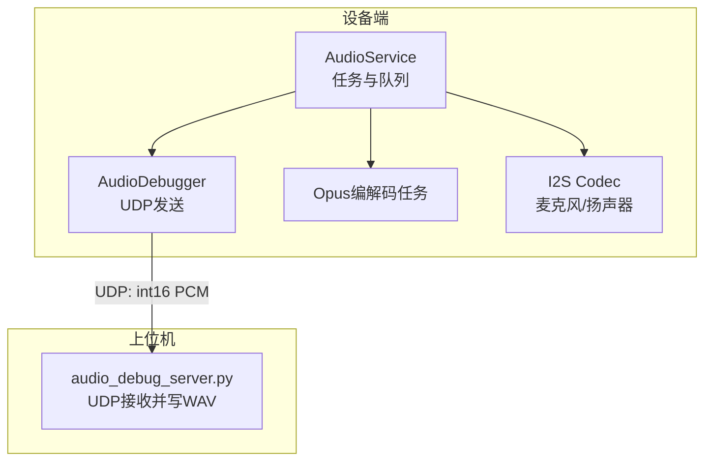
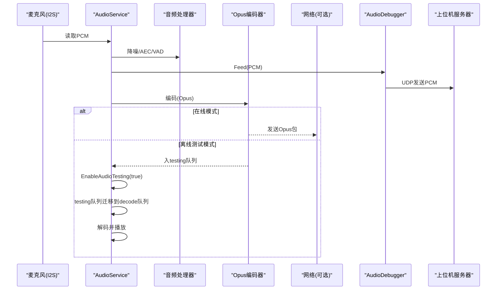
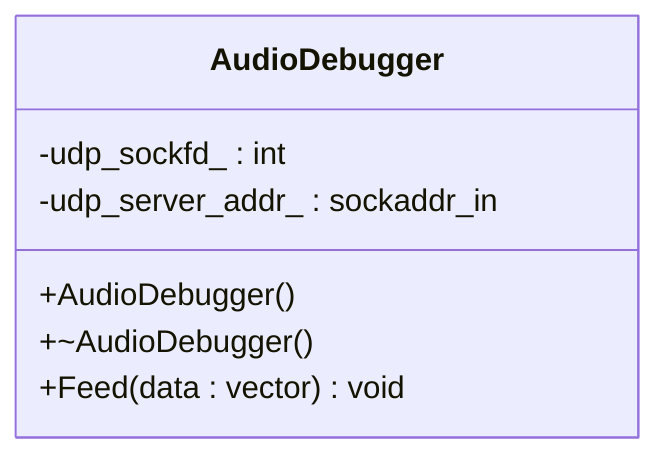
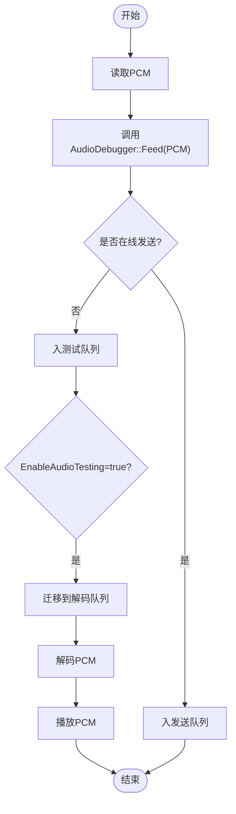
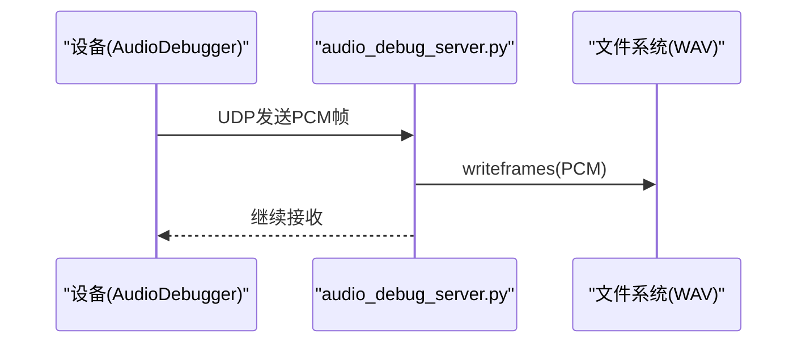
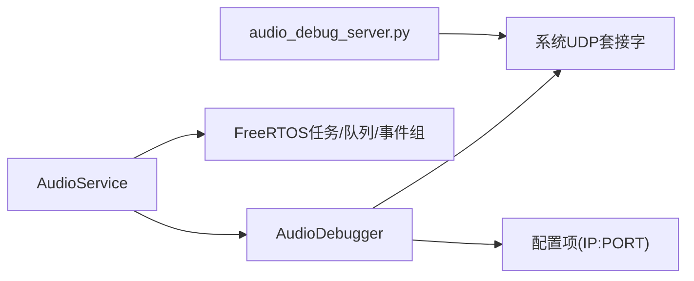

# 音频调试工具

<cite>
**本文引用的文件**
- [audio_debugger.h](file://main/audio/processors/audio_debugger.h)
- [audio_debugger.cc](file://main/audio/processors/audio_debugger.cc)
- [audio_service.h](file://main/audio/audio_service.h)
- [audio_service.cc](file://main/audio/audio_service.cc)
- [README.md（音频服务架构）](file://main/audio/README.md)
- [audio_debug_server.py](file://scripts/audio_debug_server.py)
</cite>

## 目录
1. [简介](#简介)
2. [项目结构](#项目结构)
3. [核心组件](#核心组件)
4. [架构总览](#架构总览)
5. [详细组件分析](#详细组件分析)
6. [依赖关系分析](#依赖关系分析)
7. [性能与稳定性考量](#性能与稳定性考量)
8. [故障诊断指南](#故障诊断指南)
9. [结论](#结论)
10. [附录：命令行与可视化使用指南](#附录命令行与可视化使用指南)

## 简介
本文件面向小智AI聊天机器人设备的音频调试，聚焦于 AudioDebugger 类及其配套能力，覆盖以下目标：
- 实时音频数据捕获与UDP透传到上位机
- 离线音频测试队列的启用、录制、回放与质量评估
- 调试统计指标的含义与分析方法（输入计数、解码计数、编码计数、播放计数）
- 常见问题定位与解决步骤（卡顿、音质劣化、延迟过高）
- 命令行工具与可视化界面的使用方法

## 项目结构
与音频调试直接相关的代码位于 audio 子系统与 scripts 工具中：
- 设备端
  - main/audio/processors/audio_debugger.{h,cc}：提供 UDP 音频数据转发能力
  - main/audio/audio_service.{h,cc}：音频任务编排、队列管理、统计信息、离线测试队列
  - main/audio/README.md：音频服务架构说明
- 上位机工具
  - scripts/audio_debug_server.py：UDP 接收器，将 PCM 流保存为 WAV 文件

图表来源
- [audio_service.h:105-195](file://main/audio/audio_service.h#L105-L195)
- [audio_debugger.h:10-22](file://main/audio/processors/audio_debugger.h#L10-L22)
- [audio_debug_server.py:1-55](file://scripts/audio_debug_server.py#L1-L55)

章节来源
- [audio_service.h:105-195](file://main/audio/audio_service.h#L105-L195)
- [audio_debugger.h:10-22](file://main/audio/processors/audio_debugger.h#L10-L22)
- [audio_debugger.cc:16-66](file://main/audio/processors/audio_debugger.cc#L16-L66)
- [audio_service.cc:224-228](file://main/audio/audio_service.cc#L224-L228)
- [audio_service.cc:605-616](file://main/audio/audio_service.cc#L605-L616)
- [README.md（音频服务架构）:1-88](file://main/audio/README.md#L1-L88)
- [audio_debug_server.py:1-55](file://scripts/audio_debug_server.py#L1-L55)

## 核心组件
- AudioDebugger
  - 功能：在配置开启后，通过 UDP 将 PCM 原始音频帧发送到指定服务器地址。
  - 关键接口：Feed(data)，构造时解析 CONFIG_AUDIO_DEBUG_UDP_SERVER，析构关闭套接字。
- AudioService
  - 功能：音频采集、处理、编解码、播放的主调度；维护多队列与事件组；提供 EnableAudioTesting 用于离线测试；维护 DebugStatistics 统计指标。
  - 关键能力：
    - 输入路径：I2S -> 处理器 -> 编码 -> 发送队列
    - 输出路径：解码 -> 播放队列 -> I2S
    - 离线测试：将编码后的包暂存到 testing 队列，随后转至 decode 队列进行本地回放
    - 调试透传：在读取PCM后调用 AudioDebugger::Feed 将原始PCM发至上位机
- audio_debug_server.py
  - 功能：监听 UDP 端口，接收 PCM 帧并写入 WAV 文件，便于后续波形/频谱分析与离线回放。

章节来源
- [audio_debugger.h:10-22](file://main/audio/processors/audio_debugger.h#L10-L22)
- [audio_debugger.cc:16-66](file://main/audio/processors/audio_debugger.cc#L16-L66)
- [audio_service.h:98-103](file://main/audio/audio_service.h#L98-L103)
- [audio_service.h:105-195](file://main/audio/audio_service.h#L105-L195)
- [audio_service.cc:224-228](file://main/audio/audio_service.cc#L224-L228)
- [audio_service.cc:605-616](file://main/audio/audio_service.cc#L605-L616)
- [audio_debug_server.py:1-55](file://scripts/audio_debug_server.py#L1-L55)

## 架构总览
下图展示了从采集到调试输出的完整链路，包括在线与离线两种模式。

图表来源
- [audio_service.cc:224-228](file://main/audio/audio_service.cc#L224-L228)
- [audio_service.cc:605-616](file://main/audio/audio_service.cc#L605-L616)
- [audio_debugger.cc:54-66](file://main/audio/processors/audio_debugger.cc#L54-L66)
- [audio_debug_server.py:11-43](file://scripts/audio_debug_server.py#L11-L43)

## 详细组件分析

### AudioDebugger 组件
- 职责
  - 初始化UDP套接字，解析配置中的服务器地址“IP:PORT”
  - 提供 Feed 接口，将 int16 PCM 向量以UDP方式发送至服务器
  - 析构时关闭套接字
- 关键实现要点
  - 仅在编译选项启用时生效
  - 发送失败会记录警告日志
  - 成功发送会记录调试日志
- 典型用法
  - 在音频输入路径中，每次读取PCM后调用 Feed 即可透传

图表来源
- [audio_debugger.h:10-22](file://main/audio/processors/audio_debugger.h#L10-L22)
- [audio_debugger.cc:16-66](file://main/audio/processors/audio_debugger.cc#L16-L66)

章节来源
- [audio_debugger.h:10-22](file://main/audio/processors/audio_debugger.h#L10-L22)
- [audio_debugger.cc:16-66](file://main/audio/processors/audio_debugger.cc#L16-L66)

### AudioService 与调试统计
- 职责
  - 管理音频输入/输出任务与多个队列
  - 控制离线音频测试队列的开关与迁移
  - 维护调试统计指标：input_count、encode_count、decode_count、playback_count
- 关键流程
  - 输入路径：ReadAudioData -> 可选处理器 -> 编码 -> 入send/testing队列
  - 离线测试：EnableAudioTesting(true) 后将 testing 队列内容迁移到 decode 队列，触发本地解码与播放
  - 调试透传：读取PCM后调用 AudioDebugger::Feed
- 统计指标含义
  - input_count：进入服务的PCM帧数（输入计数）
  - encode_count：编码完成的Opus帧数（编码计数）
  - decode_count：解码完成的PCM帧数（解码计数）
  - playback_count：实际送入DAC播放的PCM帧数（播放计数）

图表来源
- [audio_service.cc:224-228](file://main/audio/audio_service.cc#L224-L228)
- [audio_service.cc:605-616](file://main/audio/audio_service.cc#L605-L616)
- [audio_service.h:98-103](file://main/audio/audio_service.h#L98-L103)

章节来源
- [audio_service.h:98-103](file://main/audio/audio_service.h#L98-L103)
- [audio_service.h:105-195](file://main/audio/audio_service.h#L105-L195)
- [audio_service.cc:224-228](file://main/audio/audio_service.cc#L224-L228)
- [audio_service.cc:605-616](file://main/audio/audio_service.cc#L605-L616)

### 上位机接收与保存（audio_debug_server.py）
- 功能
  - 绑定UDP端口，持续接收PCM帧
  - 按采样率与声道数创建WAV文件并写入
  - 支持命令行参数设置采样率与声道数
- 使用要点
  - 默认监听 0.0.0.0:8000
  - 生成的文件名包含采样率与声道数，便于区分不同配置

图表来源
- [audio_debug_server.py:11-43](file://scripts/audio_debug_server.py#L11-L43)

章节来源
- [audio_debug_server.py:1-55](file://scripts/audio_debug_server.py#L1-L55)

## 依赖关系分析
- 设备端依赖
  - AudioService 依赖 AudioDebugger 进行UDP透传
  - AudioDebugger 依赖系统UDP套接字与配置项
  - AudioService 内部依赖 FreeRTOS 任务、队列与事件组
- 上位机依赖
  - Python socket 与 wave 模块

图表来源
- [audio_service.h:105-195](file://main/audio/audio_service.h#L105-L195)
- [audio_debugger.cc:16-66](file://main/audio/processors/audio_debugger.cc#L16-L66)
- [audio_debug_server.py:1-55](file://scripts/audio_debug_server.py#L1-L55)

章节来源
- [audio_service.h:105-195](file://main/audio/audio_service.h#L105-L195)
- [audio_debugger.cc:16-66](file://main/audio/processors/audio_debugger.cc#L16-L66)
- [audio_debug_server.py:1-55](file://scripts/audio_debug_server.py#L1-L55)

## 性能与稳定性考量
- 实时性
  - 音频输入、输出与编解码分别由独立任务执行，降低阻塞风险
  - 队列长度上限与条件变量避免内存暴涨
- 功耗
  - 空闲超时自动关闭ADC/DAC通道，周期性检查恢复
- 网络与CPU
  - UDP 发送为无连接，丢包不重传，适合低延迟场景
  - 建议在上位机侧做缓冲与合并写入，减少磁盘IO抖动

[本节为通用指导，无需源码引用]

## 故障诊断指南
- 现象：上位机未收到任何数据
  - 排查点
    - 确认设备端已启用音频调试编译选项
    - 核对设备配置的服务器地址格式为“IP:PORT”，且端口与上位机一致
    - 检查防火墙或路由器是否放行UDP端口
    - 查看设备日志是否有UDP套接字创建失败或发送失败的告警
  - 参考位置
    - [audio_debugger.cc:16-42](file://main/audio/processors/audio_debugger.cc#L16-L42)
    - [audio_debugger.cc:54-66](file://main/audio/processors/audio_debugger.cc#L54-L66)
- 现象：WAV文件无声或断续
  - 排查点
    - 确认采样率与声道数与设备一致
    - 检查上位机脚本是否正确写入frames
    - 观察设备端输入计数与播放计数是否匹配
  - 参考位置
    - [audio_debug_server.py:11-43](file://scripts/audio_debug_server.py#L11-L43)
    - [audio_service.h:98-103](file://main/audio/audio_service.h#L98-L103)
- 现象：离线测试无法回放
  - 排查点
    - 确认已调用 EnableAudioTesting(true)
    - 检查测试队列是否达到最大时长阈值导致停止
    - 确认测试队列已成功迁移到解码队列
  - 参考位置
    - [audio_service.cc:246-251](file://main/audio/audio_service.cc#L246-L251)
    - [audio_service.cc:605-616](file://main/audio/audio_service.cc#L605-L616)
- 现象：延迟过高或卡顿
  - 排查点
    - 观察 decode_count 与 playback_count 差值，若差距增大说明播放滞后
    - 检查网络丢包与队列积压情况
    - 适当调整解码帧长或提升硬件性能
  - 参考位置
    - [audio_service.h:98-103](file://main/audio/audio_service.h#L98-L103)
    - [README.md（音频服务架构）:14-21](file://main/audio/README.md#L14-L21)

章节来源
- [audio_debugger.cc:16-42](file://main/audio/processors/audio_debugger.cc#L16-L42)
- [audio_debugger.cc:54-66](file://main/audio/processors/audio_debugger.cc#L54-L66)
- [audio_service.cc:246-251](file://main/audio/audio_service.cc#L246-L251)
- [audio_service.cc:605-616](file://main/audio/audio_service.cc#L605-L616)
- [audio_service.h:98-103](file://main/audio/audio_service.h#L98-L103)
- [README.md（音频服务架构）:14-21](file://main/audio/README.md#L14-L21)

## 结论
AudioDebugger 提供了轻量高效的PCM透传能力，配合 AudioService 的离线测试队列与统计指标，可快速完成端到端的音频链路验证与问题定位。上位机脚本可将PCM流保存为WAV，便于进一步进行波形与频谱分析。通过合理配置与监控统计指标，可有效识别卡顿、音质与延迟等常见问题。

[本节为总结性内容，无需源码引用]

## 附录：命令行与可视化使用指南

- 启动上位机接收器
  - 命令示例
    - python scripts/audio_debug_server.py --samplerate 16000 --channels 2
  - 说明
    - samplerate：采样率，需与设备一致
    - channels：声道数，需与设备一致
    - 默认监听 0.0.0.0:8000，生成形如 “16000_2.wav” 的文件
  - 参考位置
    - [audio_debug_server.py:46-55](file://scripts/audio_debug_server.py#L46-L55)

- 设备端启用音频调试
  - 编译选项
    - 启用音频调试开关（需在SDK配置中打开）
    - 配置UDP服务器地址为“IP:PORT”
  - 运行时行为
    - 每次读取PCM后调用 Feed 发送至上位机
  - 参考位置
    - [audio_debugger.cc:16-42](file://main/audio/processors/audio_debugger.cc#L16-L42)
    - [audio_service.cc:224-228](file://main/audio/audio_service.cc#L224-L228)

- 离线音频测试
  - 启用测试
    - 调用 EnableAudioTesting(true)
  - 录制阶段
    - 输入PCM经处理后编码，结果入 testing 队列
  - 回放阶段
    - 将 testing 队列迁移到 decode 队列，触发解码与播放
  - 参考位置
    - [audio_service.cc:605-616](file://main/audio/audio_service.cc#L605-L616)

- 可视化分析建议
  - 使用任意支持WAV的播放器或音频分析软件（如 Audacity、Python matplotlib/pywt 等）加载生成的WAV文件
  - 关注波形幅度分布、频谱能量集中区域、静音段占比等指标
  - 结合设备端统计指标对比输入/编码/解码/播放计数，定位瓶颈环节

[本节为操作指引，无需源码引用]