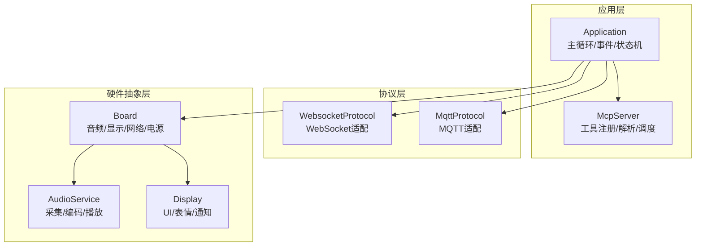
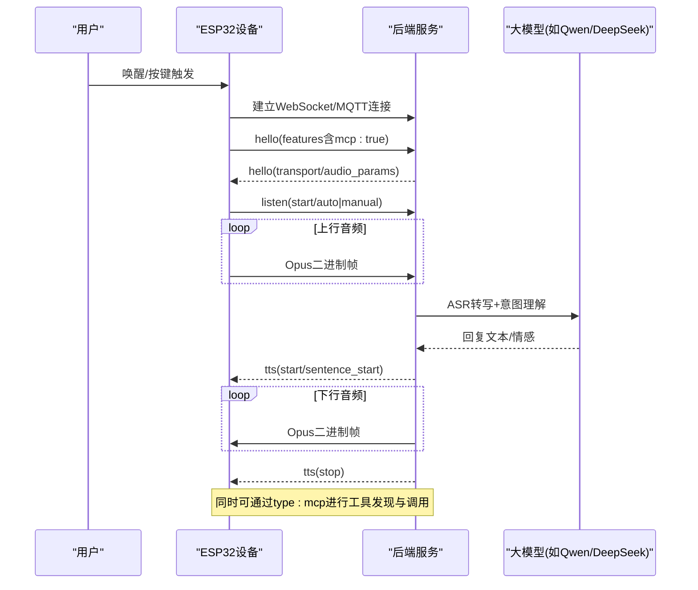
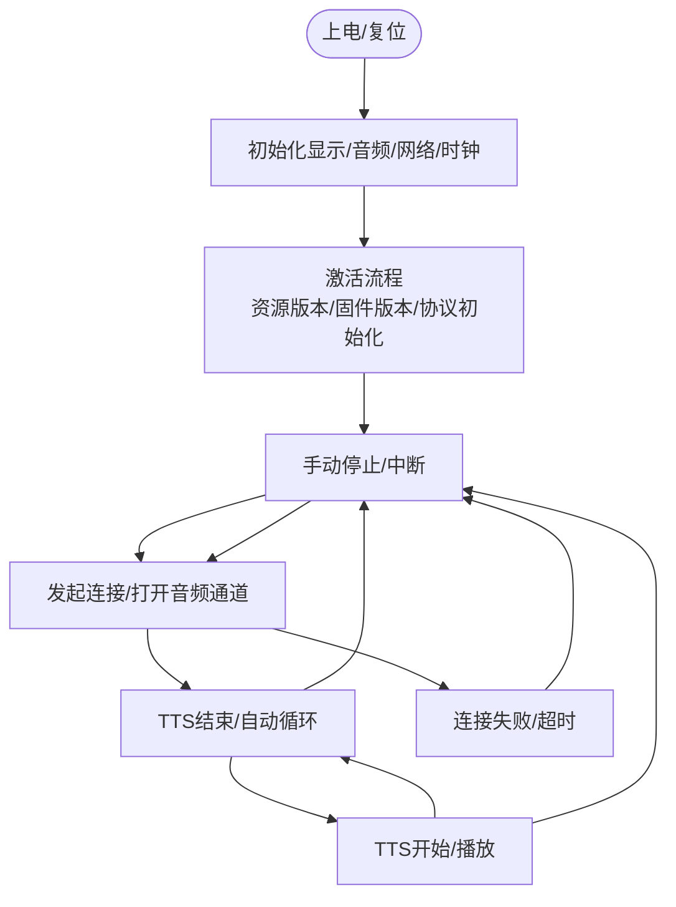
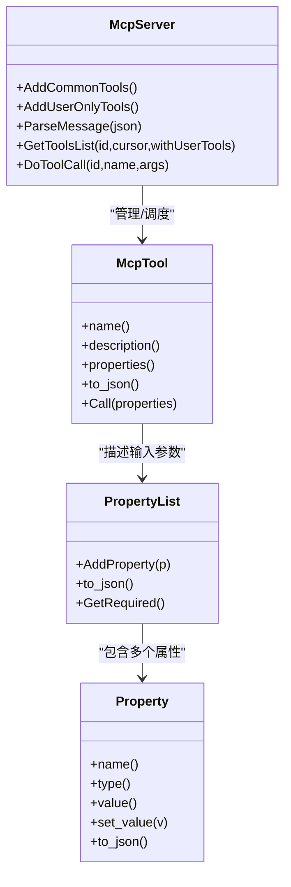
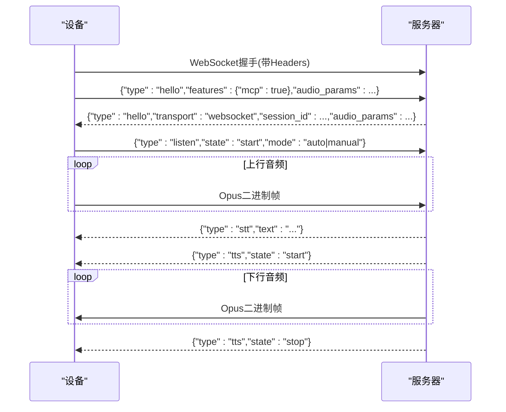
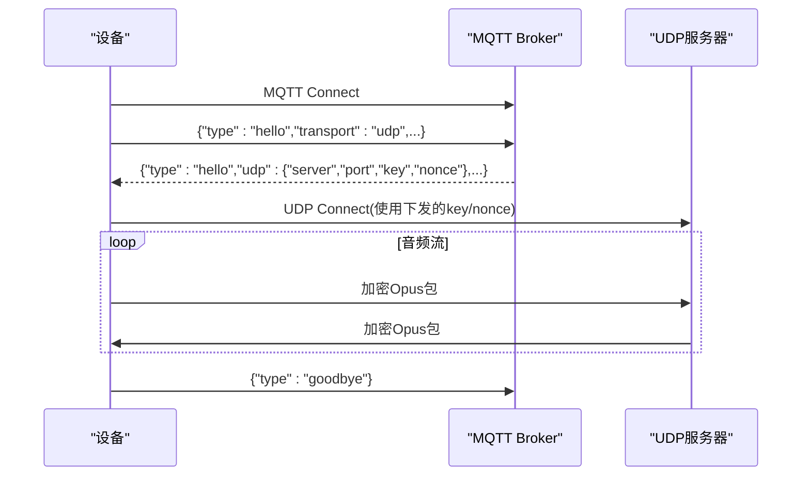
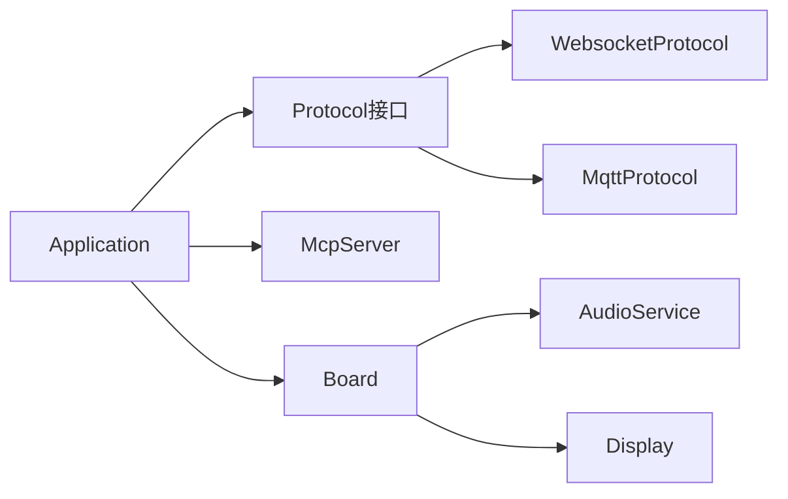

# 项目介绍

<cite>
**本文引用的文件列表**
- [README.md](file://README.md)
- [application.h](file://main/application.h)
- [application.cc](file://main/application.cc)
- [mcp_server.h](file://main/mcp_server.h)
- [mcp_server.cc](file://main/mcp_server.cc)
- [websocket_zh.md](file://docs/websocket_zh.md)
- [mqtt-udp_zh.md](file://docs/mqtt-udp_zh.md)
- [mcp-protocol_zh.md](file://docs/mcp-protocol_zh.md)
- [mcp-usage_zh.md](file://docs/mcp-usage_zh.md)
</cite>

## 目录
1. [引言](#引言)
2. [项目结构](#项目结构)
3. [核心组件](#核心组件)
4. [架构总览](#架构总览)
5. [详细组件分析](#详细组件分析)
6. [依赖关系分析](#依赖关系分析)
7. [性能与实时性考量](#性能与实时性考量)
8. [故障排查指南](#故障排查指南)
9. [结论](#结论)
10. [附录：术语与参考](#附录术语与参考)

## 引言
小智AI聊天机器人是一个基于ESP32系列的开源语音交互终端，核心价值在于“以自然语言为入口，通过大模型能力驱动设备控制”。项目采用MCP（Model Context Protocol）作为智能设备控制的统一协议，结合WebSocket或MQTT+UDP两种通信方案，实现多终端、跨网络环境的语音对话与物联网控制。

- 技术背景与目标
  - 将Qwen/DeepSeek等大模型的语义理解与生成能力下沉到边缘设备，形成“端侧感知—云端推理—端侧执行”的闭环。
  - 通过MCP工具化抽象，让后台服务可动态发现并调用设备能力（如音量调节、屏幕亮度、拍照等），从而支撑智能家居、桌面自动化、知识检索等场景。
- 技术选型理由
  - MCP协议：标准化JSON-RPC 2.0，具备工具发现、参数校验、分页枚举、错误码等完备特性，利于生态扩展。
  - WebSocket：握手简单、全双工、天然支持文本与二进制帧，适合快速集成与调试。
  - MQTT+UDP：控制面与数据面分离，UDP承载Opus音频流，具备更低延迟与更高吞吐潜力；配合AES-CTR加密保障安全。
- 主要特性
  - 支持Wi-Fi与ML307 Cat.1 4G接入
  - 离线唤醒（ESP-SR）、VAD、回声消除（设备侧/服务器侧可选）
  - 基于OPUS的流式ASR + LLM + TTS语音交互链路
  - 说话人识别（3D Speaker）
  - OLED/LCD显示与表情动画
  - 电池管理与低功耗策略
  - 多语言本地化
  - 设备侧MCP工具注册与云侧MCP能力扩展
  - 在线资源与固件升级（Assets/Firmware OTA）
- 典型应用场景
  - 智能家居中控：语音开关灯、调光调色、查询设备状态
  - 桌面助手：远程操作电脑、邮件处理、知识库检索
  - 教育陪伴：问答互动、情绪反馈、图片识别讲解
  - 工业巡检：摄像头拍照上传、异常告警、设备自检

章节来源
- [README.md:1-173](file://README.md#L1-L173)

## 项目结构
本项目遵循“分层+模块化”的组织方式：
- main/application：应用主循环、事件分发、状态机、协议初始化与回调
- main/protocols：WebSocket/MQTT协议适配层，统一Protocol接口
- main/mcp_server：MCP服务端实现，工具注册、解析与调度
- boards：硬件板级适配（音频编解码、显示、按键、电源管理等）
- assets/locales：多语言与静态资源
- docs：协议与用法文档（WebSocket、MQTT+UDP、MCP）

图表来源
- [application.cc:61-163](file://main/application.cc#L61-L163)
- [mcp_server.cc:33-126](file://main/mcp_server.cc#L33-L126)
- [websocket_zh.md:1-120](file://docs/websocket_zh.md#L1-L120)
- [mqtt-udp_zh.md:1-120](file://docs/mqtt-udp_zh.md#L1-L120)

章节来源
- [application.h:1-194](file://main/application.h#L1-L194)
- [application.cc:1-163](file://main/application.cc#L1-L163)
- [mcp_server.h:1-345](file://main/mcp_server.h#L1-L345)
- [mcp_server.cc:1-126](file://main/mcp_server.cc#L1-L126)

## 核心组件
- Application（应用主控）
  - 负责系统初始化、事件循环、状态机切换、协议生命周期管理、OTA与资源检查、MCP广播回调等。
  - 关键职责：
    - 初始化显示、音频服务、网络事件回调
    - 启动激活流程（资产版本检查、固件版本检查、协议初始化）
    - 维护音频通道打开/关闭、监听模式（自动/手动）
    - 接收并分发TTS/STT/LLM/MCP/System消息
- McpServer（MCP服务端）
  - 提供工具注册、能力协商、工具列表分页、工具调用执行、结果回传。
  - 内置常用工具：设备状态、音量、屏幕亮度、主题、拍照解释、系统信息、重启、固件升级、屏幕截图/预览、资源下载URL设置等。
- 协议适配层（WebSocket/MQTT）
  - 统一Protocol接口，屏蔽底层差异，向上提供音频通道、JSON消息收发、连接状态回调。
- 硬件抽象（Board/Audio/Display）
  - 封装具体板卡的音频编解码器、显示屏、背光、相机、电源管理等。

章节来源
- [application.h:43-176](file://main/application.h#L43-L176)
- [application.cc:61-163](file://main/application.cc#L61-L163)
- [mcp_server.h:314-345](file://main/mcp_server.h#L314-L345)
- [mcp_server.cc:33-126](file://main/mcp_server.cc#L33-L126)

## 架构总览
整体架构围绕“语音交互+设备控制”的双主线展开：
- 语音交互链路：麦克风采集→AEC/VAD→OPUS编码→网络传输→云端ASR→LLM→TTS→OPUS解码→扬声器播放
- 设备控制链路：后台通过MCP发现工具→tools/call调用→设备侧执行→返回结果

图表来源
- [websocket_zh.md:1-120](file://docs/websocket_zh.md#L1-L120)
- [mqtt-udp_zh.md:1-120](file://docs/mqtt-udp_zh.md#L1-L120)
- [mcp-protocol_zh.md:1-120](file://docs/mcp-protocol_zh.md#L1-L120)

## 详细组件分析

### 应用主控 Application
- 初始化流程
  - 设置显示UI、初始化音频服务、注册音频回调（发送队列可用、唤醒词检测、VAD变化）
  - 注册状态机变更回调、启动时钟定时器更新状态栏
  - 添加MCP通用工具与仅用户可见工具
  - 异步启动网络，并在网络事件中更新UI与内部状态
- 主循环与事件分发
  - 使用事件组等待各类事件：网络、音频、唤醒词、VAD、定时、任务调度、状态变更等
  - 根据事件类型执行对应处理器：连接/断开、激活完成、切换聊天、开始/停止监听、发送音频、唤醒词处理等
- 激活与协议初始化
  - 检查资源版本、检查固件版本、选择并初始化协议（优先按配置选择WebSocket或MQTT）
  - 注册协议回调：连接成功、网络错误、入站音频、音频通道打开/关闭、入站JSON消息（tts/stt/llm/mcp/system/custom）
- 状态机与交互模式
  - 支持自动/手动监听模式，空闲时发起连接，进入Listening后持续编码上行音频
  - 收到TTS start进入Speaking，stop后根据模式回到Idle或继续Listening
  - 网络断开时主动关闭音频通道并回到空闲

图表来源
- [application.cc:165-259](file://main/application.cc#L165-L259)
- [application.cc:473-610](file://main/application.cc#L473-L610)
- [application.cc:674-778](file://main/application.cc#L674-L778)

章节来源
- [application.h:43-176](file://main/application.h#L43-L176)
- [application.cc:61-163](file://main/application.cc#L61-L163)
- [application.cc:165-259](file://main/application.cc#L165-L259)
- [application.cc:473-610](file://main/application.cc#L473-L610)
- [application.cc:674-778](file://main/application.cc#L674-L778)

### MCP服务端 McpServer
- 工具注册与分类
  - 公共工具：设备状态、音量、屏幕亮度、主题、拍照解释等
  - 仅用户工具：系统信息、重启、固件升级、屏幕截图/预览、资源下载URL设置等
- 能力协商与会话初始化
  - 解析initialize中的capabilities（如vision.url/token），用于相机解释功能
- 工具发现与分页
  - tools/list支持cursor分页，避免单次响应过大
- 工具调用与结果回传
  - tools/call参数校验、默认值填充、异常捕获
  - 在主线程中执行工具回调，确保对UI/音频/网络的访问安全
  - 返回content数组（text/image），isError标记错误

图表来源
- [mcp_server.h:208-345](file://main/mcp_server.h#L208-L345)
- [mcp_server.cc:33-126](file://main/mcp_server.cc#L33-L126)
- [mcp_server.cc:350-433](file://main/mcp_server.cc#L350-L433)
- [mcp_server.cc:452-506](file://main/mcp_server.cc#L452-L506)
- [mcp_server.cc:508-561](file://main/mcp_server.cc#L508-L561)

章节来源
- [mcp_server.h:1-345](file://main/mcp_server.h#L1-L345)
- [mcp_server.cc:1-561](file://main/mcp_server.cc#L1-L561)
- [mcp-usage_zh.md:1-115](file://docs/mcp-usage_zh.md#L1-L115)

### 通信协议：WebSocket
- 握手与能力通告
  - 设备发送hello（version/features/transport/audio_params），服务器返回hello（transport/session_id/audio_params）
- 双向数据
  - 文本JSON：listen/tts/stt/llm/mcp/system/custom等
  - 二进制Opus：上行录音、下行TTS音频
- 鉴权与会话
  - 请求头携带Authorization、Protocol-Version、Device-Id、Client-Id
  - session_id用于会话隔离

图表来源
- [websocket_zh.md:1-120](file://docs/websocket_zh.md#L1-L120)
- [websocket_zh.md:128-216](file://docs/websocket_zh.md#L128-L216)
- [websocket_zh.md:219-292](file://docs/websocket_zh.md#L219-L292)

章节来源
- [websocket_zh.md:1-496](file://docs/websocket_zh.md#L1-L496)

### 通信协议：MQTT + UDP
- 控制面（MQTT）
  - 连接、Hello交换（下发UDP地址/端口/密钥/随机数）
  - JSON消息：listen/abort/goodbye/mcp等
- 数据面（UDP）
  - 加密Opus音频包（AES-CTR），序列号保护防重放
  - 独立于MQTT的高实时通道
- 状态管理
  - 连接/请求通道/UDP连接/音频流/关闭等状态机

图表来源
- [mqtt-udp_zh.md:1-120](file://docs/mqtt-udp_zh.md#L1-L120)
- [mqtt-udp_zh.md:176-224](file://docs/mqtt-udp_zh.md#L176-L224)
- [mqtt-udp_zh.md:226-257](file://docs/mqtt-udp_zh.md#L226-L257)

章节来源
- [mqtt-udp_zh.md:1-393](file://docs/mqtt-udp_zh.md#L1-L393)

### 语音交互链路设计
- 采集与预处理
  - 麦克风采集→AEC（设备侧/服务器侧可选）→VAD→静音段过滤
- 编码与传输
  - OPUS编码，60ms帧长，单声道，采样率16kHz（上行）/24kHz（下行）
- 云端处理
  - ASR转写→LLM生成→TTS合成
- 播放与UI联动
  - 解码→重采样（必要时）→播放；同步显示STT/LLM情感/TTS文本片段

章节来源
- [websocket_zh.md:295-305](file://docs/websocket_zh.md#L295-L305)
- [mqtt-udp_zh.md:260-278](file://docs/mqtt-udp_zh.md#L260-L278)
- [application.cc:498-519](file://main/application.cc#L498-L519)

## 依赖关系分析
- 组件耦合
  - Application强依赖Protocol接口与Board抽象，弱耦合具体协议实现
  - McpServer通过Application.SendMcpMessage与上层协议解耦
  - Board聚合AudioCodec/Display/Network等硬件能力，便于板级定制
- 外部依赖
  - ESP-IDF（FreeRTOS、cJSON、mbedtls等）
  - 第三方库：ESP-SR（唤醒）、LVGL（图形界面，可选）
- 潜在风险
  - 协议初始化顺序与回调线程上下文需严格把控（已在MCP调用中通过Schedule保证主线程执行）
  - 音频采样率不一致时的重采样可能引入失真（已记录警告）

图表来源
- [application.cc:473-610](file://main/application.cc#L473-L610)
- [mcp_server.cc:435-450](file://main/mcp_server.cc#L435-L450)

章节来源
- [application.cc:473-610](file://main/application.cc#L473-L610)
- [mcp_server.cc:435-450](file://main/mcp_server.cc#L435-L450)

## 性能与实时性考量
- 低延迟优化
  - 连接前提升功耗等级至高性能模式，降低握手与首帧延迟
  - 60ms帧长平衡带宽与延迟
- 内存与CPU
  - 每10秒打印堆统计，便于定位泄漏与峰值
  - 工具调用在主线程执行，避免并发竞争
- 网络健壮性
  - 断线自动关闭音频通道，防止状态不一致
  - MQTT自动重连，UDP依赖MQTT重新协商

章节来源
- [application.cc:713-730](file://main/application.cc#L713-L730)
- [application.cc:248-257](file://main/application.cc#L248-L257)
- [application.cc:286-297](file://main/application.cc#L286-L297)

## 故障排查指南
- 常见问题定位
  - 无法连接：检查Authorization/Token、协议版本、防火墙/NAT
  - 无声音：确认下行音频格式与采样率匹配，检查重采样日志
  - MCP调用失败：核对工具名、参数类型与必填项，查看错误码
  - 断线重连：观察MQTT重连与UDP协商是否成功
- 建议步骤
  - 启用自定义消息日志（CONFIG_RECEIVE_CUSTOM_MESSAGE）辅助诊断
  - 在设备端查看Alert提示与状态栏信息
  - 使用抓包工具验证WebSocket/MQTT/UDP报文

章节来源
- [application.cc:521-607](file://main/application.cc#L521-L607)
- [websocket_zh.md:369-406](file://docs/websocket_zh.md#L369-L406)
- [mqtt-udp_zh.md:280-321](file://docs/mqtt-udp_zh.md#L280-L321)

## 结论
小智AI聊天机器人以MCP为核心，将大模型能力与边缘设备深度融合，实现了“听得懂、说得出、控得住”的完整体验。其清晰的协议分层、灵活的板级适配与完善的工具生态，使其在智能家居、桌面助手、教育陪伴与工业巡检等场景中具备显著优势。对于初学者，建议从WebSocket入门，逐步过渡到MQTT+UDP，并结合MCP工具开发拓展更多能力。

## 附录：术语与参考
- MCP（Model Context Protocol）：设备与后台之间的标准化工具发现与调用协议
- AEC：回声消除（设备侧/服务器侧）
- VAD：语音活动检测
- STT/ASR：语音转文本
- TTS：文本转语音
- OPUS：高效音频编码格式
- LVGL：轻量级图形库（可选）

章节来源
- [mcp-protocol_zh.md:1-270](file://docs/mcp-protocol_zh.md#L1-L270)
- [mcp-usage_zh.md:1-115](file://docs/mcp-usage_zh.md#L1-L115)
- [websocket_zh.md:1-496](file://docs/websocket_zh.md#L1-L496)
- [mqtt-udp_zh.md:1-393](file://docs/mqtt-udp_zh.md#L1-L393)