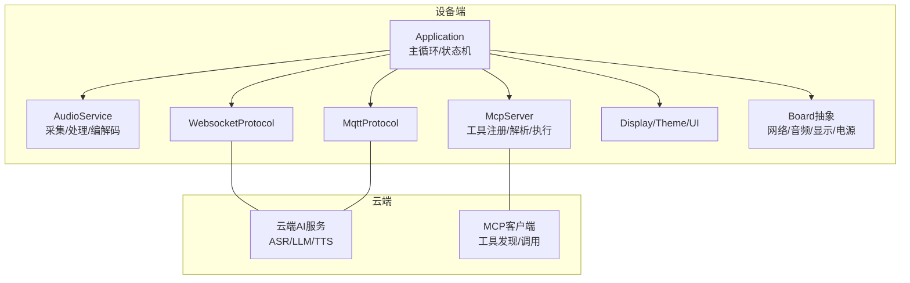
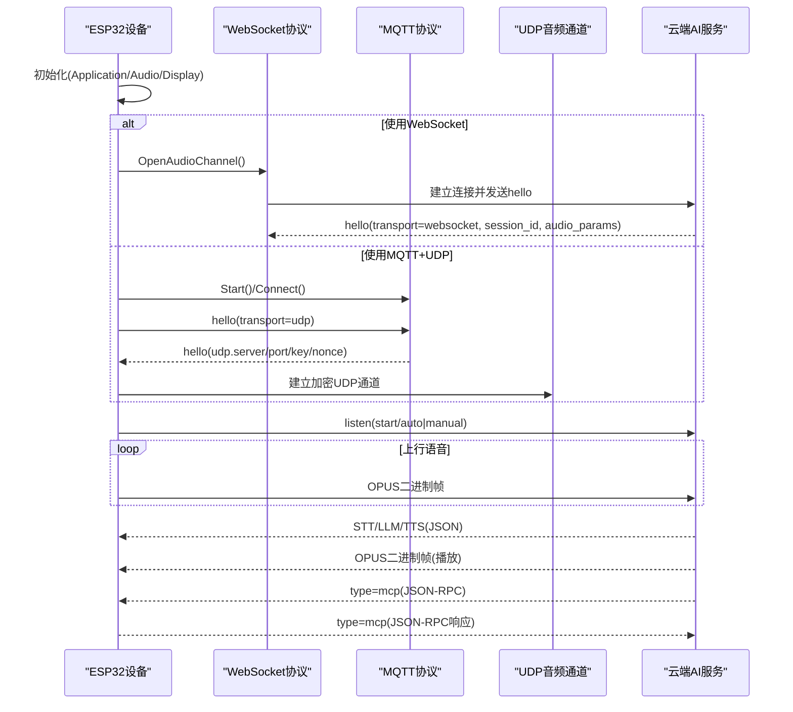
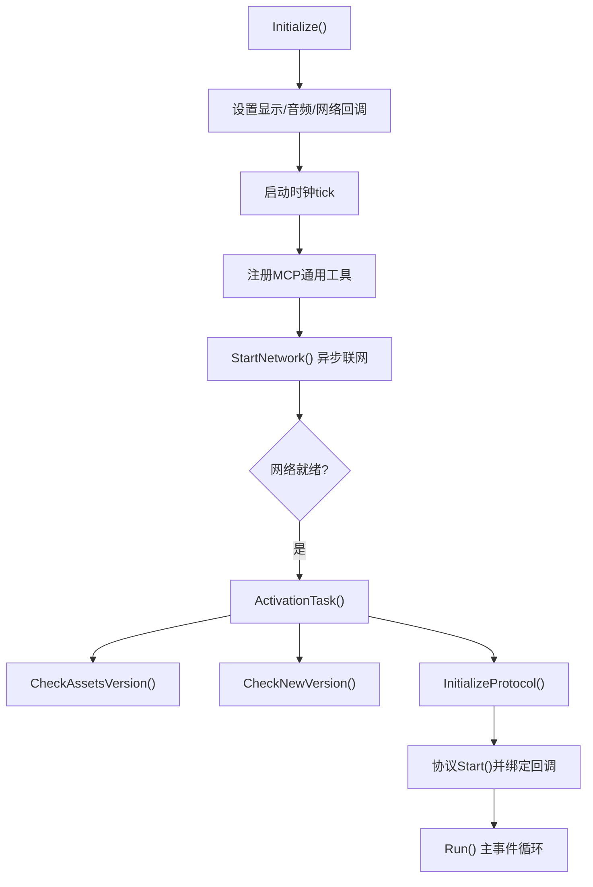
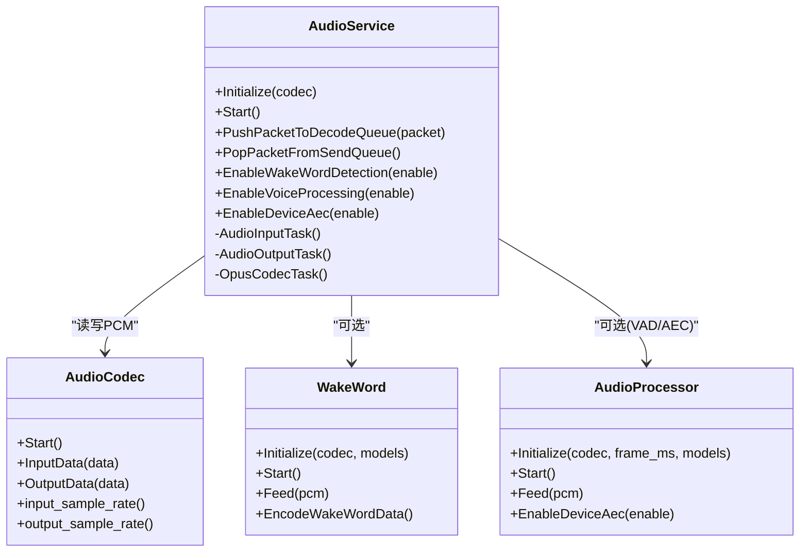
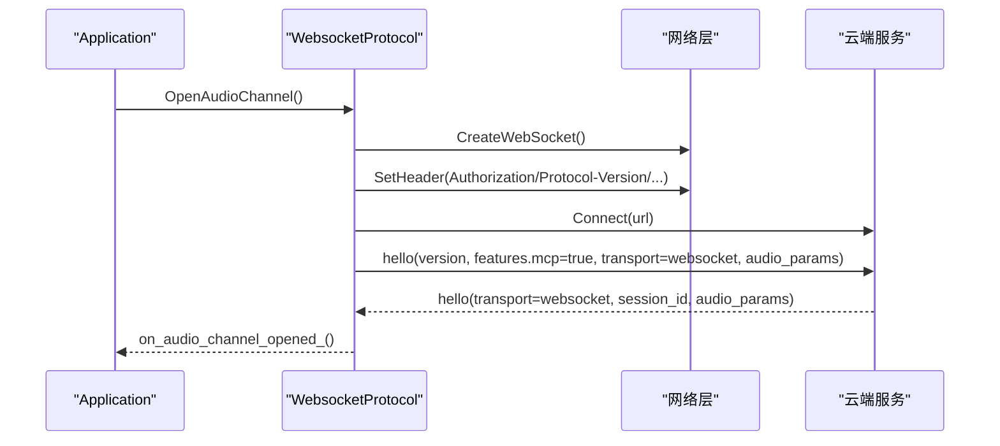
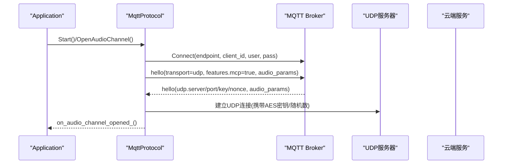
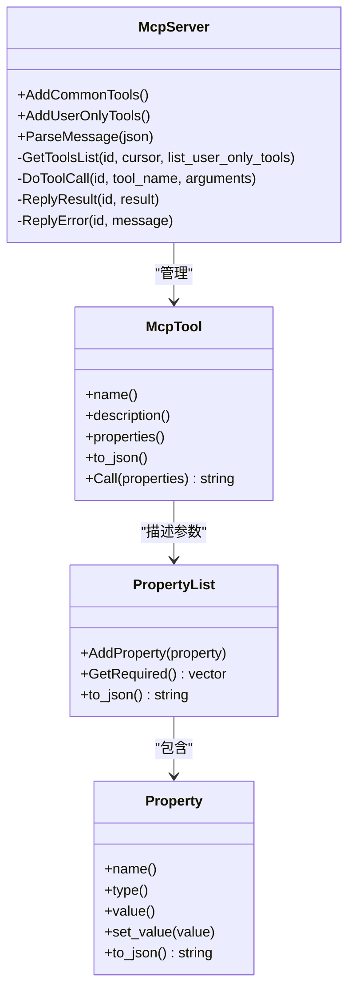
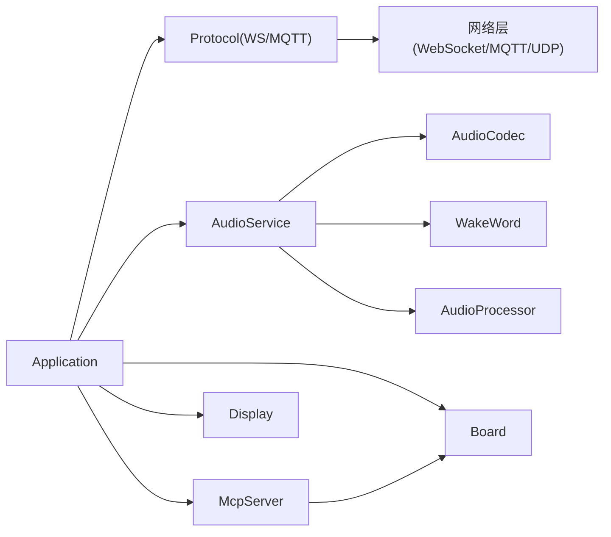

# 项目概述

<cite>
**本文引用的文件**   
- [README.md](file://README.md)
- [application.h](file://main/application.h)
- [application.cc](file://main/application.cc)
- [mcp_server.h](file://main/mcp_server.h)
- [mcp_server.cc](file://main/mcp_server.cc)
- [websocket_protocol.h](file://main/protocols/websocket_protocol.h)
- [websocket_protocol.cc](file://main/protocols/websocket_protocol.cc)
- [mqtt_protocol.h](file://main/protocols/mqtt_protocol.h)
- [mqtt_protocol.cc](file://main/protocols/mqtt_protocol.cc)
- [audio_service.h](file://main/audio/audio_service.h)
- [audio_service.cc](file://main/audio/audio_service.cc)
- [mcp-protocol_zh.md](file://docs/mcp-protocol_zh.md)
- [websocket_zh.md](file://docs/websocket_zh.md)
- [mqtt-udp_zh.md](file://docs/mqtt-udp_zh.md)
</cite>

## 目录
1. [简介](#简介)
2. [项目结构](#项目结构)
3. [核心组件](#核心组件)
4. [架构总览](#架构总览)
5. [详细组件分析](#详细组件分析)
6. [依赖关系分析](#依赖关系分析)
7. [性能与实时性](#性能与实时性)
8. [故障排查指南](#故障排查指南)
9. [结论](#结论)
10. [附录：支持的硬件平台与特性](#附录支持的硬件平台与特性)

## 简介
小智AI聊天机器人是一个基于ESP32系列的语音交互终端，通过云端大模型（如通义千问、DeepSeek等）实现自然语言对话，并借助MCP协议对智能设备进行统一控制。项目支持Wi-Fi与ML307 Cat.1 4G网络，提供离线唤醒、OPUS音频编解码、流式ASR+LLM+TTS架构、表情显示、电量管理、多语言与可定制资源等能力。设备端采用事件驱动的主循环，结合FreeRTOS任务与定时器，完成音频采集/播放、网络通信、状态机管理与MCP工具调用。

核心价值
- 以MCP为统一的“设备能力发现与调用”协议，打通本地设备与云端AI的扩展能力。
- 语音交互链路低延迟、高可靠：OPUS编码、双通道（WebSocket或MQTT+UDP）、服务端AEC可选。
- 丰富的硬件生态与板级抽象，快速适配70+开源硬件。
- 完善的OTA与资源升级机制，支持在线固件与资源包更新。

技术选型理由
- ESP-IDF + FreeRTOS：成熟的嵌入式生态，便于音频、网络与UI并发处理。
- WebSocket/MQTT+UDP：前者简化部署与穿透，后者在复杂网络下保证音频实时性与安全性。
- OPUS：高压缩比与低延迟，适合语音通话场景。
- MCP：标准化JSON-RPC 2.0语义，利于跨端扩展与工具编排。

## 项目结构
- main：应用主逻辑、协议栈、音频服务、MCP服务器、显示与LED等。
- boards：各硬件板级适配（引脚、电源、外设初始化）。
- display：LVGL/OLED/LCD显示抽象与主题。
- protocols：WebSocket与MQTT+UDP两种传输实现。
- audio：音频采集/处理/编解码、唤醒词、VAD/AEC等。
- docs：协议与用法文档（WebSocket、MQTT+UDP、MCP）。

图表来源
- [application.h:43-176](file://main/application.h#L43-L176)
- [application.cc:61-163](file://main/application.cc#L61-L163)
- [websocket_protocol.h:13-32](file://main/protocols/websocket_protocol.h#L13-L32)
- [mqtt_protocol.h:26-62](file://main/protocols/mqtt_protocol.h#L26-L62)
- [mcp_server.h:314-342](file://main/mcp_server.h#L314-L342)
- [audio_service.h:105-195](file://main/audio/audio_service.h#L105-L195)

章节来源
- [README.md:1-173](file://README.md#L1-L173)
- [application.h:43-176](file://main/application.h#L43-L176)
- [application.cc:61-163](file://main/application.cc#L61-L163)

## 核心组件
- Application：系统入口与主事件循环，协调网络、音频、显示、MCP与状态机；负责激活流程、协议选择、消息分发与错误提示。
- AudioService：音频I/O、VAD/WakeWord、Opus编解码、重采样与队列调度，支撑双向语音流。
- WebsocketProtocol / MqttProtocol：两套传输实现，封装握手、文本/二进制帧、超时与断线恢复。
- McpServer：设备侧MCP服务器，注册工具、解析JSON-RPC请求、执行回调并返回结果。
- Board抽象：屏蔽不同硬件差异，提供网络、音频、显示、电源等接口。

章节来源
- [application.h:43-176](file://main/application.h#L43-L176)
- [application.cc:473-610](file://main/application.cc#L473-L610)
- [audio_service.h:105-195](file://main/audio/audio_service.h#L105-L195)
- [websocket_protocol.h:13-32](file://main/protocols/websocket_protocol.h#L13-L32)
- [mqtt_protocol.h:26-62](file://main/protocols/mqtt_protocol.h#L26-L62)
- [mcp_server.h:314-342](file://main/mcp_server.h#L314-L342)

## 架构总览
设备启动后，Application初始化显示与音频服务，异步建立网络，随后根据配置选择WebSocket或MQTT+UDP进行会话建立。语音上行经AudioService编码为OPUS，下行由服务器推送OPUS帧，设备解码播放。MCP作为独立的消息类型，承载设备能力发现与工具调用。

图表来源
- [websocket_protocol.cc:83-201](file://main/protocols/websocket_protocol.cc#L83-L201)
- [mqtt_protocol.cc:215-295](file://main/protocols/mqtt_protocol.cc#L215-L295)
- [websocket_zh.md:1-496](file://docs/websocket_zh.md#L1-L496)
- [mqtt-udp_zh.md:1-393](file://docs/mqtt-udp_zh.md#L1-L393)

## 详细组件分析

### Application（应用主控）
职责
- 初始化显示、音频、网络回调与定时任务。
- 维护设备状态机，处理网络连通、激活、升级、错误等事件。
- 选择并启动协议实例，订阅音频通道打开/关闭、JSON消息、MCP消息。
- 将MCP JSON负载转发给McpServer解析执行。

关键流程
- Initialize：设置UI、音频回调、网络事件、时钟tick、注册MCP通用工具。
- Run：事件循环分发，处理网络、状态变更、监听切换、音频发送、唤醒词、VAD变化等。
- ActivationTask：检查资源版本、固件版本、初始化协议、完成激活。
- InitializeProtocol：根据配置创建WebSocket或MQTT协议，绑定OnIncomingJson回调，其中type=mcp交由McpServer处理。

图表来源
- [application.cc:61-163](file://main/application.cc#L61-L163)
- [application.cc:323-338](file://main/application.cc#L323-L338)
- [application.cc:473-610](file://main/application.cc#L473-L610)
- [application.cc:165-259](file://main/application.cc#L165-L259)

章节来源
- [application.h:43-176](file://main/application.h#L43-L176)
- [application.cc:61-163](file://main/application.cc#L61-L163)
- [application.cc:165-259](file://main/application.cc#L165-L259)
- [application.cc:473-610](file://main/application.cc#L473-L610)

### AudioService（音频服务）
职责
- 管理麦克风输入、扬声器输出、Opus编解码、重采样、唤醒词与VAD。
- 维护多个队列（解码/播放/编码/测试），通过任务协作降低延迟与抖动。
- 支持设备端AEC开关、音频测试模式、静音/省电策略。

数据流
- 上行：MIC -> 处理器/VAD -> 编码队列 -> Opus编码器 -> 发送队列 -> 协议发送。
- 下行：协议接收 -> 解码队列 -> Opus解码器 -> 播放队列 -> 扬声器。

图表来源
- [audio_service.h:105-195](file://main/audio/audio_service.h#L105-L195)
- [audio_service.cc:62-123](file://main/audio/audio_service.cc#L62-L123)
- [audio_service.cc:230-288](file://main/audio/audio_service.cc#L230-L288)
- [audio_service.cc:327-446](file://main/audio/audio_service.cc#L327-L446)

章节来源
- [audio_service.h:105-195](file://main/audio/audio_service.h#L105-L195)
- [audio_service.cc:62-123](file://main/audio/audio_service.cc#L62-L123)
- [audio_service.cc:230-288](file://main/audio/audio_service.cc#L230-L288)
- [audio_service.cc:327-446](file://main/audio/audio_service.cc#L327-L446)

### WebsocketProtocol（WebSocket传输）
职责
- 建立WebSocket连接，设置鉴权头与协议版本。
- 发送/接收JSON与二进制OPUS帧，支持协议版本1/2/3。
- 解析服务器hello，提取session_id与音频参数。

要点
- SendAudio按版本打包二进制帧；ParseServerHello校验transport与audio_params。
- OnDisconnected触发音频通道关闭回调。

图表来源
- [websocket_protocol.cc:83-201](file://main/protocols/websocket_protocol.cc#L83-L201)
- [websocket_protocol.cc:203-255](file://main/protocols/websocket_protocol.cc#L203-L255)
- [websocket_zh.md:1-496](file://docs/websocket_zh.md#L1-L496)

章节来源
- [websocket_protocol.h:13-32](file://main/protocols/websocket_protocol.h#L13-L32)
- [websocket_protocol.cc:83-201](file://main/protocols/websocket_protocol.cc#L83-L201)
- [websocket_zh.md:1-496](file://docs/websocket_zh.md#L1-L496)

### MqttProtocol（MQTT+UDP传输）
职责
- 通过MQTT建立控制通道，申请UDP音频通道，协商AES密钥与随机数。
- 使用AES-CTR加密OPUS音频，维护序列号防重放与乱序检测。
- 处理goodbye消息与自动重连。

要点
- ParseServerHello解析udp.server/port/key/nonce，初始化AES上下文。
- SendAudio构造nonce并加密发送；IsAudioChannelOpened基于UDP连接与超时判断。

图表来源
- [mqtt_protocol.cc:215-295](file://main/protocols/mqtt_protocol.cc#L215-L295)
- [mqtt_protocol.cc:322-366](file://main/protocols/mqtt_protocol.cc#L322-L366)
- [mqtt-udp_zh.md:1-393](file://docs/mqtt-udp_zh.md#L1-L393)

章节来源
- [mqtt_protocol.h:26-62](file://main/protocols/mqtt_protocol.h#L26-L62)
- [mqtt_protocol.cc:215-295](file://main/protocols/mqtt_protocol.cc#L215-L295)
- [mqtt-udp_zh.md:1-393](file://docs/mqtt-udp_zh.md#L1-L393)

### McpServer（设备侧MCP服务器）
职责
- 注册通用工具与用户专属工具，生成工具Schema。
- 解析JSON-RPC 2.0方法：initialize、tools/list、tools/call。
- 在主线程安全执行工具回调，返回text/image/json结果。

工具示例
- self.get_device_status：获取设备状态（音频、屏幕、电池、网络等）。
- self.audio_speaker.set_volume：设置音量。
- self.screen.set_brightness / set_theme：屏幕亮度与主题。
- self.camera.take_photo：拍照并解释图像内容。
- self.reboot / self.upgrade_firmware：系统重启与固件升级。

图表来源
- [mcp_server.h:314-342](file://main/mcp_server.h#L314-L342)
- [mcp_server.cc:33-126](file://main/mcp_server.cc#L33-L126)
- [mcp_server.cc:128-298](file://main/mcp_server.cc#L128-L298)
- [mcp_server.cc:350-433](file://main/mcp_server.cc#L350-L433)

章节来源
- [mcp_server.h:314-342](file://main/mcp_server.h#L314-L342)
- [mcp_server.cc:33-126](file://main/mcp_server.cc#L33-L126)
- [mcp_server.cc:128-298](file://main/mcp_server.cc#L128-L298)
- [mcp_server.cc:350-433](file://main/mcp_server.cc#L350-L433)
- [mcp-protocol_zh.md:1-270](file://docs/mcp-protocol_zh.md#L1-L270)

## 依赖关系分析
- Application依赖Board抽象、AudioService、Protocol（WebSocket/MQTT）、McpServer、Display与SystemInfo。
- Protocol实现依赖网络层（WebSocket/MQTT/UDP）与cJSON解析。
- AudioService依赖AudioCodec、WakeWord、AudioProcessor与Opus编解码库。
- McpServer依赖Board能力（音频、屏幕、相机）与应用调度（Schedule）。

图表来源
- [application.cc:61-163](file://main/application.cc#L61-L163)
- [websocket_protocol.cc:83-201](file://main/protocols/websocket_protocol.cc#L83-L201)
- [mqtt_protocol.cc:215-295](file://main/protocols/mqtt_protocol.cc#L215-L295)
- [audio_service.cc:62-123](file://main/audio/audio_service.cc#L62-L123)
- [mcp_server.cc:33-126](file://main/mcp_server.cc#L33-L126)

章节来源
- [application.cc:61-163](file://main/application.cc#L61-L163)
- [websocket_protocol.cc:83-201](file://main/protocols/websocket_protocol.cc#L83-L201)
- [mqtt_protocol.cc:215-295](file://main/protocols/mqtt_protocol.cc#L215-L295)
- [audio_service.cc:62-123](file://main/audio/audio_service.cc#L62-L123)
- [mcp_server.cc:33-126](file://main/mcp_server.cc#L33-L126)

## 性能与实时性
- 音频路径优化：分任务处理输入/输出/编解码，队列限长与条件变量避免阻塞；动态重采样确保与硬件输出一致。
- 传输优化：WebSocket直接二进制帧，MQTT+UDP采用AES-CTR加密与序列号保护，兼顾安全与实时。
- 功耗管理：空闲时关闭音频输入/输出，周期性检测降低功耗。
- 建议
  - 合理设置frame_duration与码率，平衡带宽与延迟。
  - 在弱网环境下优先使用MQTT+UDP以获得更好鲁棒性。
  - 启用服务端AEC时，注意时间戳传递与对齐。

[本节为通用指导，不直接分析具体文件]

## 故障排查指南
常见问题
- 无法连接服务器：检查Authorization、Protocol-Version、Device-Id、Client-Id等头部；确认URL/Endpoint可达。
- 握手失败或超时：确认服务器返回hello且transport匹配；检查session_id与audio_params。
- 音频无声或杂音：核对采样率与帧时长是否一致；检查重采样与解码器配置；查看日志中的解码错误。
- MCP工具不可用：确认工具已注册且不在user-only白名单中；检查arguments是否符合Schema。
- 频繁断开：检查网络稳定性与心跳配置；观察MQTT重连与UDP序列号异常日志。

定位线索
- Application主循环错误事件与Alert提示。
- WebSocket/MQTT协议的错误回调与超时处理。
- AudioService的解码/编码错误与队列状态。
- McpServer的工具解析与调用异常。

章节来源
- [application.cc:165-259](file://main/application.cc#L165-L259)
- [websocket_protocol.cc:168-201](file://main/protocols/websocket_protocol.cc#L168-L201)
- [mqtt_protocol.cc:85-152](file://main/protocols/mqtt_protocol.cc#L85-L152)
- [audio_service.cc:327-446](file://main/audio/audio_service.cc#L327-L446)
- [mcp_server.cc:350-433](file://main/mcp_server.cc#L350-L433)

## 结论
小智AI聊天机器人以Application为核心，整合AudioService、双协议栈与McpServer，形成从语音采集到云端AI再到设备控制的完整闭环。MCP协议使设备能力标准化暴露，便于云端编排与扩展。WebSocket与MQTT+UDP满足不同网络环境需求，配合OPUS与重采样保障音质与实时性。项目具备完善的OTA与资源管理能力，适配丰富硬件生态，适合快速落地各类语音交互与智能控制场景。

[本节为总结，不直接分析具体文件]

## 附录：支持的硬件平台与特性
- 芯片平台：ESP32-C3、ESP32-S3、ESP32-P4等。
- 网络：Wi-Fi、ML307 Cat.1 4G。
- 音频：OPUS编解码、离线唤醒（ESP-SR）、VAD/AEC、声纹识别（3D Speaker）。
- 显示：OLED/LCD，表情动画与主题。
- 其他：电池显示与电源管理、多语言、自定义资源（唤醒词/字体/表情/背景）。

章节来源
- [README.md:23-38](file://README.md#L23-L38)
- [README.md:51-103](file://README.md#L51-L103)